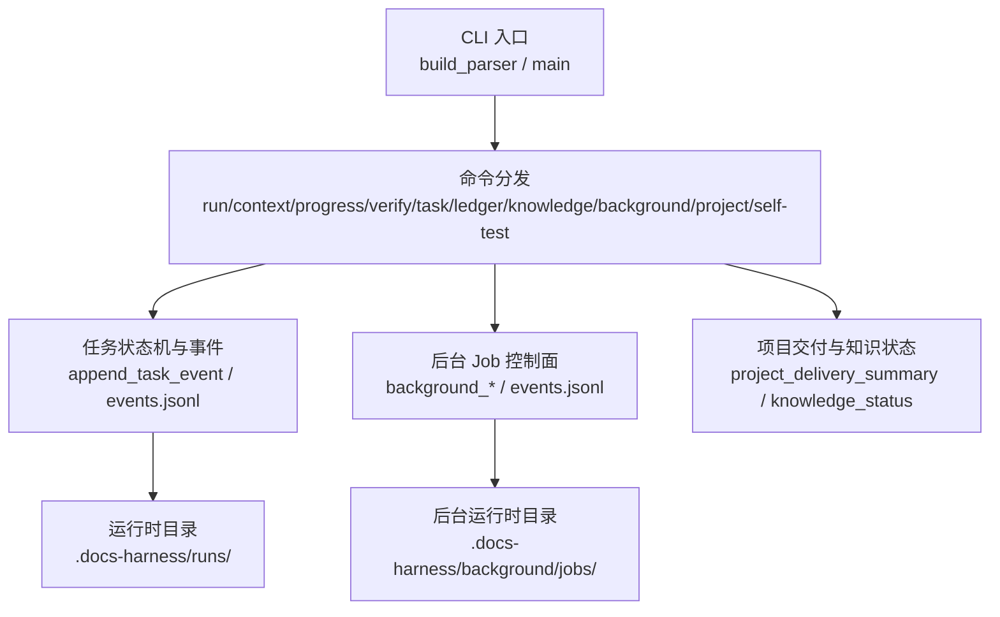
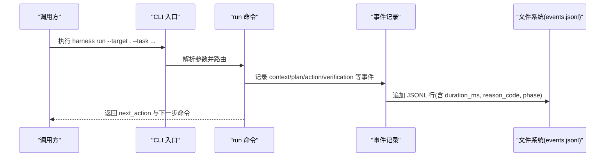
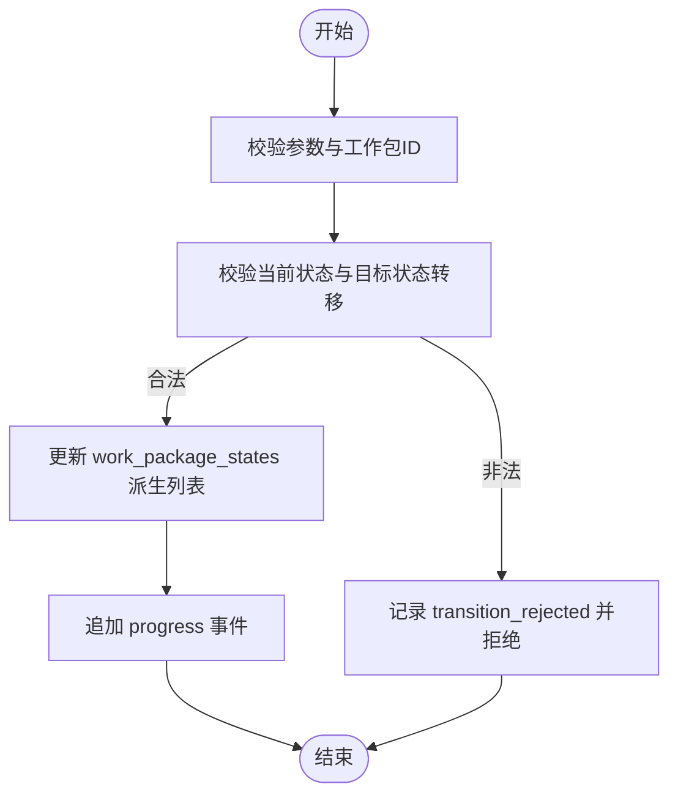
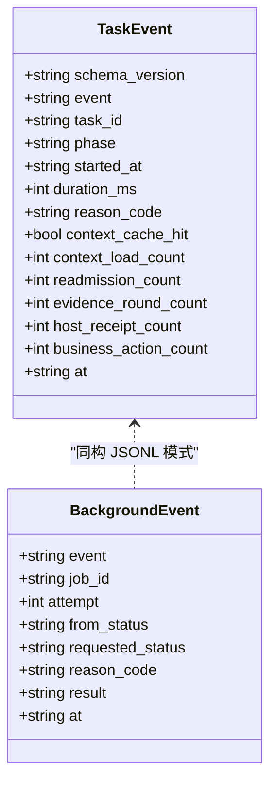
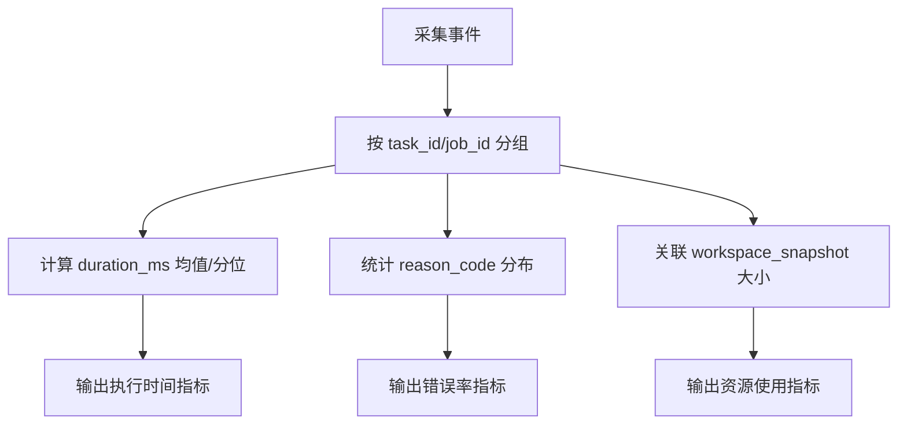
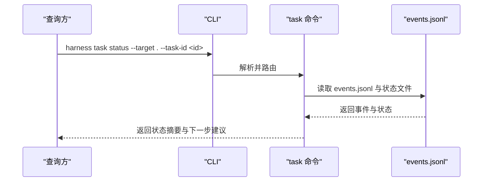
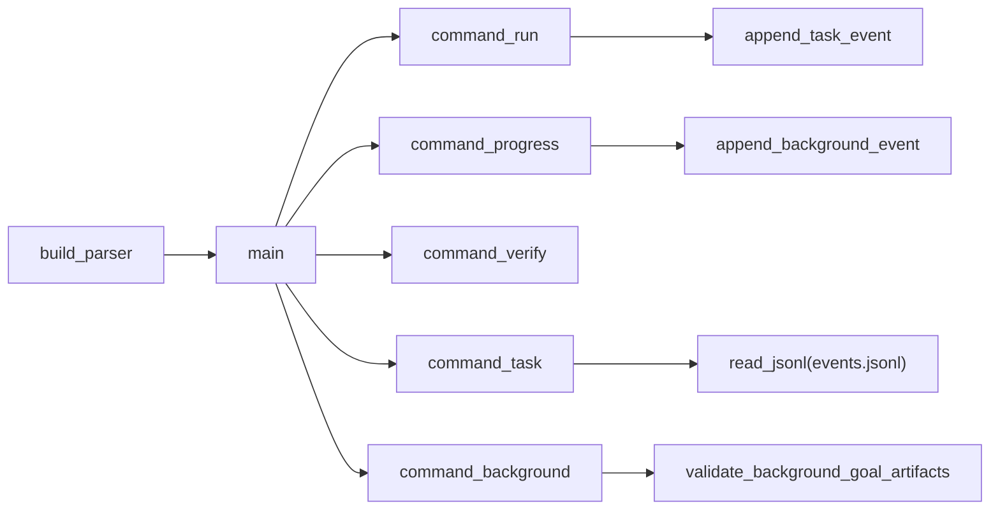

# 执行监控与日志

<cite>
**本文引用的文件**   
- [harness.py](file://scripts/harness.py)
- [test_harness.py](file://tests/test_harness.py)
- [package.json](file://package.json)
- [SKILL.md](file://SKILL.md)
</cite>

## 目录
1. [简介](#简介)
2. [项目结构](#项目结构)
3. [核心组件](#核心组件)
4. [架构总览](#架构总览)
5. [详细组件分析](#详细组件分析)
6. [依赖关系分析](#依赖关系分析)
7. [性能考量](#性能考量)
8. [故障排查指南](#故障排查指南)
9. [结论](#结论)
10. [附录](#附录)

## 简介
本文件面向 Docs Harness 的执行监控系统，聚焦以下能力：
- 实时状态跟踪：任务进度更新、状态变更通知、生命周期事件
- 日志记录系统：结构化日志输出、分级日志管理、日志聚合分析
- 监控指标收集：执行时间、资源使用率、错误率统计
- 监控 API 接口：查询任务状态、获取执行历史
- 日志查看与分析工具使用方法
- 监控仪表板配置与告警规则设置指南

Docs Harness 通过 CLI 命令驱动任务生命周期，所有关键状态与事件以 JSONL 形式持久化到任务工作区，便于外部系统采集、聚合与可视化。

## 项目结构
- scripts/harness.py：独立控制器主程序，包含任务编排、事件记录、后台 Job 控制、CLI 解析等核心逻辑
- tests/test_harness.py：契约测试与行为验证，覆盖 run/verify/background 等流程
- package.json：包元数据与脚本入口（self-test）
- SKILL.md：技能说明与用户操作指引

图表来源
- [harness.py:10175-10294](file://scripts/harness.py#L10175-L10294)
- [harness.py:10337-10375](file://scripts/harness.py#L10337-L10375)
- [harness.py:906-921](file://scripts/harness.py#L906-L921)
- [harness.py:1485-1491](file://scripts/harness.py#L1485-L1491)

章节来源
- [package.json:1-23](file://package.json#L1-L23)
- [SKILL.md:1-105](file://SKILL.md#L1-L105)

## 核心组件
- 事件与日志子系统
  - append_task_event：写入任务级 events.jsonl，附带阶段、耗时、重试计数、证据轮次、上下文加载次数等
  - append_background_event：写入后台 Job 级 events.jsonl，支持去重与受限字段
  - read_jsonl/append_jsonl：JSONL 读写原子性与幂等保障
- 任务状态与生命周期
  - next_step_payload：根据当前状态生成下一步动作与命令行参数
  - state_lock：进程级锁，避免并发写冲突
  - runtime_root/task_state_dir：运行时目录定位
- 后台 Job 监控
  - background_artifact_refs/validate_background_goal_artifacts：工件指纹校验与版本一致性
  - record_background_summary/index：汇总索引，供快速检索
- 项目交付与知识状态
  - project_delivery_summary：控制器与知识文档的交付就绪度
  - knowledge_status：知识库构建/审计/就绪状态

章节来源
- [harness.py:1031-1071](file://scripts/harness.py#L1031-L1071)
- [harness.py:7387-7411](file://scripts/harness.py#L7387-L7411)
- [harness.py:936-1005](file://scripts/harness.py#L936-L1005)
- [harness.py:1008-1029](file://scripts/harness.py#L1008-L1029)
- [harness.py:906-921](file://scripts/harness.py#L906-L921)
- [harness.py:7305-7384](file://scripts/harness.py#L7305-L7384)
- [harness.py:7484-7501](file://scripts/harness.py#L7484-L7501)
- [harness.py:2011-2054](file://scripts/harness.py#L2011-L2054)
- [harness.py:1653-1684](file://scripts/harness.py#L1653-L1684)

## 架构总览
Docs Harness 的监控体系围绕“事件即事实”的原则设计：
- 每个任务或后台 Job 在运行时目录下维护独立的 events.jsonl
- 控制器在关键生命周期节点追加事件，包含阶段、原因码、耗时、上下文命中、证据轮次等
- 外部系统可通过读取 JSONL 进行聚合、分析与可视化

图表来源
- [harness.py:10175-10294](file://scripts/harness.py#L10175-L10294)
- [harness.py:10337-10375](file://scripts/harness.py#L10337-L10375)
- [harness.py:1031-1071](file://scripts/harness.py#L1031-L1071)

## 详细组件分析

### 实时状态跟踪机制
- 任务进度更新
  - progress 命令推进工作包状态，内部校验状态转移合法性，失败时拒绝并记录 transition_rejected 事件
  - 复杂路线下，work_package_states 必须与冻结方案一致，attempt 与指纹需匹配
- 状态变更通知
  - append_background_event 对重复的 transition_rejected 做去重，避免噪声
  - record_background_summary 将 job_id/attempt/status 写入 index.jsonl，便于快速检索
- 生命周期事件
  - append_task_event 记录 context_load_count、readmission_count、evidence_round_count、business_action_count 等指标
  - 事件包含 started_at/duration_ms/at，便于计算执行时间与吞吐

图表来源
- [harness.py:8361-8393](file://scripts/harness.py#L8361-L8393)
- [harness.py:7387-7411](file://scripts/harness.py#L7387-L7411)
- [harness.py:7336-7384](file://scripts/harness.py#L7336-L7384)

章节来源
- [harness.py:8361-8393](file://scripts/harness.py#L8361-L8393)
- [harness.py:7387-7411](file://scripts/harness.py#L7387-L7411)
- [harness.py:7336-7384](file://scripts/harness.py#L7336-L7384)

### 日志记录系统
- 结构化日志输出
  - events.jsonl 每行一个 JSON 对象，包含 schema_version、event、task_id/job_id、phase、started_at、duration_ms、reason_code、at 等
  - 后台事件允许字段白名单，防止污染
- 分级日志管理
  - 通过 reason_code 区分成功、失败、重试、漂移等场景
  - 任务事件累计 context_load_count/readmission_count/evidence_round_count，便于分级统计
- 日志聚合分析
  - 读取 events.jsonl 后按 task_id/job_id 分组，计算各阶段耗时、重试次数、证据轮次
  - 结合 index.jsonl 可快速定位 Job 状态与尝试次数

图表来源
- [harness.py:1031-1071](file://scripts/harness.py#L1031-L1071)
- [harness.py:7387-7411](file://scripts/harness.py#L7387-L7411)

章节来源
- [harness.py:1031-1071](file://scripts/harness.py#L1031-L1071)
- [harness.py:7387-7411](file://scripts/harness.py#L7387-L7411)

### 监控指标收集
- 执行时间
  - duration_ms：事件中的阶段耗时
  - started_at/at：用于跨事件对齐时间线
- 资源使用率
  - workspace_snapshot/git_refs_snapshot：快照工作区与引用集合，间接反映 IO 与仓库规模
  - bounded_project_inventory：受控扫描源码与文档，限制文件大小与数量
- 错误率统计
  - reason_code：如 git_remote_drift、git_ref_scope_violation、invalid_background_progress_transition 等
  - 通过统计 reason_code 分布计算错误率

图表来源
- [harness.py:1031-1071](file://scripts/harness.py#L1031-L1071)
- [harness.py:1112-1135](file://scripts/harness.py#L1112-L1135)
- [harness.py:7717-7764](file://scripts/harness.py#L7717-L7764)

章节来源
- [harness.py:1031-1071](file://scripts/harness.py#L1031-L1071)
- [harness.py:1112-1135](file://scripts/harness.py#L1112-L1135)
- [harness.py:7717-7764](file://scripts/harness.py#L7717-L7764)

### 监控 API 接口
- 任务状态查询
  - task status：读取任务状态与最近事件摘要
  - task list/prune：列出活动任务与清理候选
- 执行历史获取
  - 直接读取 events.jsonl 并按 task_id 过滤
  - 后台 Job：background status/list 配合 index.jsonl 快速定位
- 下一步动作建议
  - enrich_next_step_response：根据当前状态生成 next_action 与 next_command_argv

图表来源
- [harness.py:10239-10248](file://scripts/harness.py#L10239-L10248)
- [harness.py:10305-10334](file://scripts/harness.py#L10305-L10334)
- [harness.py:3086-3088](file://scripts/harness.py#L3086-L3088)

章节来源
- [harness.py:10239-10248](file://scripts/harness.py#L10239-L10248)
- [harness.py:10305-10334](file://scripts/harness.py#L10305-L10334)
- [harness.py:3086-3088](file://scripts/harness.py#L3086-L3088)

### 日志查看与分析工具使用方法
- 本地查看
  - 直接打开 .docs-harness/runs/<task-id>/events.jsonl 或 .docs-harness/background/jobs/<job-id>/events.jsonl
  - 使用 jq 或 Python 脚本按 reason_code/phase 过滤
- 聚合分析
  - 读取 index.jsonl 获取 Job 状态与尝试次数
  - 结合 project_delivery_summary 了解控制器与知识文档交付就绪度
- 自检与诊断
  - self-test：校验控制器版本、命令解析器、规则有效性、背景桥接合同等

章节来源
- [harness.py:7484-7501](file://scripts/harness.py#L7484-L7501)
- [harness.py:2011-2054](file://scripts/harness.py#L2011-L2054)
- [harness.py:10118-10167](file://scripts/harness.py#L10118-L10167)

### 监控仪表板配置与告警规则设置指南
- 数据采集
  - 定期拉取 events.jsonl 与 index.jsonl，按 task_id/job_id 聚合
  - 指标维度：duration_ms、reason_code 分布、context_load_count、readmission_count、evidence_round_count
- 仪表板面板
  - 执行时间趋势：按阶段统计 P50/P95
  - 错误率看板：reason_code 占比与趋势
  - 资源使用概览：workspace_snapshot 大小与文件数
- 告警规则
  - 高错误率：reason_code=failed/retry_verification 超过阈值
  - 长尾任务：duration_ms 超过基线分位
  - 远端漂移：reason_code=git_remote_drift 出现频率异常
  - 知识就绪：knowledge_status.status!=ready 持续超时

[本节为概念性配置指南，不直接分析具体文件]

## 依赖关系分析
- CLI 与命令分发：build_parser/main 负责参数解析与命令路由
- 事件记录：append_task_event/append_background_event 依赖 JSONL 读写
- 后台 Job：validate_background_goal_artifacts 依赖 plan.json/progress.json 指纹校验
- 项目交付：project_delivery_summary 依赖 Git 与知识地图状态

图表来源
- [harness.py:10175-10294](file://scripts/harness.py#L10175-L10294)
- [harness.py:10337-10375](file://scripts/harness.py#L10337-L10375)
- [harness.py:1031-1071](file://scripts/harness.py#L1031-L1071)
- [harness.py:7387-7411](file://scripts/harness.py#L7387-L7411)
- [harness.py:7336-7384](file://scripts/harness.py#L7336-L7384)

章节来源
- [harness.py:10175-10294](file://scripts/harness.py#L10175-L10294)
- [harness.py:10337-10375](file://scripts/harness.py#L10337-L10375)
- [harness.py:1031-1071](file://scripts/harness.py#L1031-L1071)
- [harness.py:7387-7411](file://scripts/harness.py#L7387-L7411)
- [harness.py:7336-7384](file://scripts/harness.py#L7336-L7384)

## 性能考量
- JSONL 追加采用 fsync，保证落盘顺序与一致性，但可能影响高频写入性能；建议在批量分析时离线读取
- workspace_snapshot 与 bounded_project_inventory 有文件大小与数量上限，避免大仓库扫描阻塞
- 事件去重：transition_rejected 重复事件被抑制，减少噪声
- 索引优化：background_index_path 提供 job_id/attempt/status 的快速检索

章节来源
- [harness.py:1112-1135](file://scripts/harness.py#L1112-L1135)
- [harness.py:7717-7764](file://scripts/harness.py#L7717-L7764)
- [harness.py:7387-7411](file://scripts/harness.py#L7387-L7411)
- [harness.py:7468-7482](file://scripts/harness.py#L7468-L7482)

## 故障排查指南
- 常见错误码
  - git_remote_drift：远端目标不一致，检查远程引用是否漂移
  - git_ref_scope_violation：引用越界，检查 controlled_refs_namespace
  - invalid_background_progress_transition：工作包状态转移非法，检查状态机
  - stale_lock/state_locked：状态锁冲突，等待或人工清理
- 排查步骤
  - 读取 events.jsonl 定位失败阶段与 reason_code
  - 核对 plan.json/progress.json 指纹与 attempt 一致性
  - 使用 project_delivery_summary 确认控制器与知识文档交付就绪度
  - 运行 self-test 校验控制器与规则完整性

章节来源
- [harness.py:864-875](file://scripts/harness.py#L864-L875)
- [harness.py:8361-8393](file://scripts/harness.py#L8361-L8393)
- [harness.py:1008-1029](file://scripts/harness.py#L1008-L1029)
- [harness.py:2011-2054](file://scripts/harness.py#L2011-L2054)
- [harness.py:10118-10167](file://scripts/harness.py#L10118-L10167)

## 结论
Docs Harness 的监控体系以事件为核心，通过结构化 JSONL 实现高保真、可追溯的状态跟踪。结合 CLI 接口与索引文件，外部系统可高效采集、聚合与可视化执行指标。建议在生产环境中建立稳定的日志采集管道与告警规则，确保问题早发现、早定位、早恢复。

## 附录
- 常用命令参考
  - task status/list/prune：任务状态与清理
  - background status/list/prepare/dispatch/progress/verify/retry：后台 Job 全生命周期
  - project check/upgrade/uninstall：项目安装与交付状态
  - self-test：控制器自检

章节来源
- [harness.py:10239-10294](file://scripts/harness.py#L10239-L10294)
- [harness.py:10118-10167](file://scripts/harness.py#L10118-L10167)