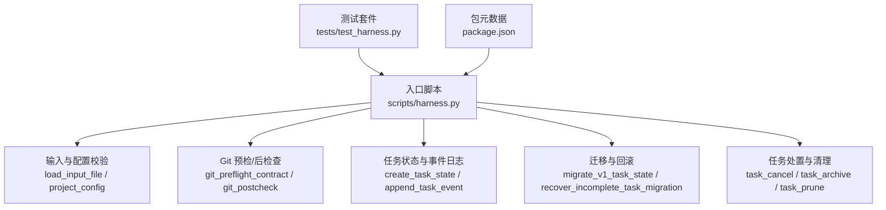
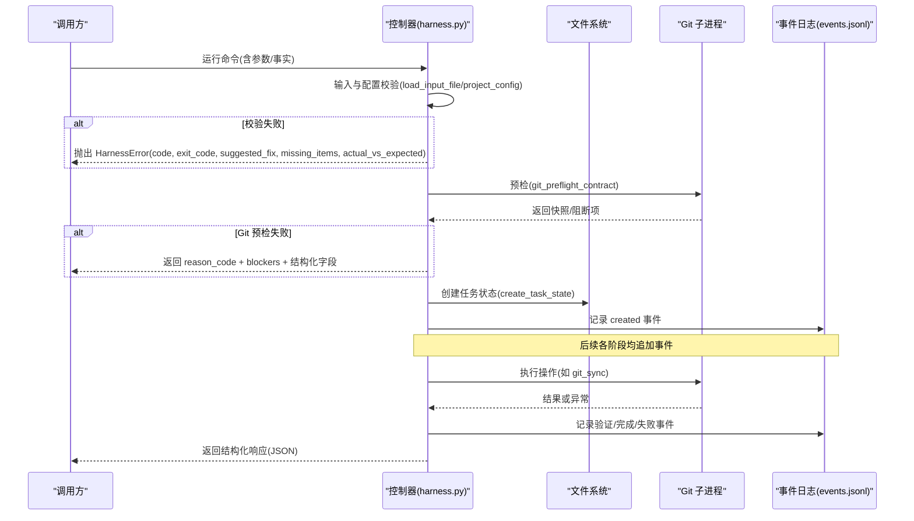
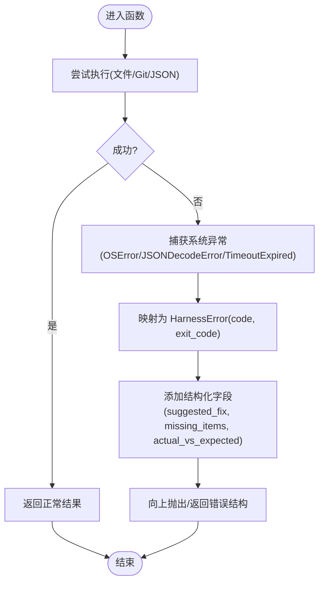
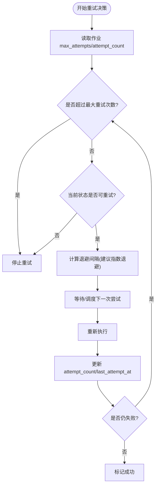
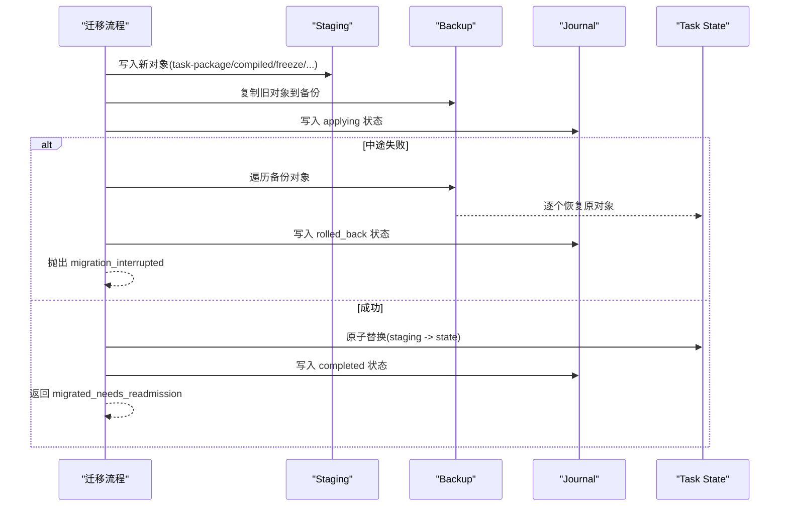
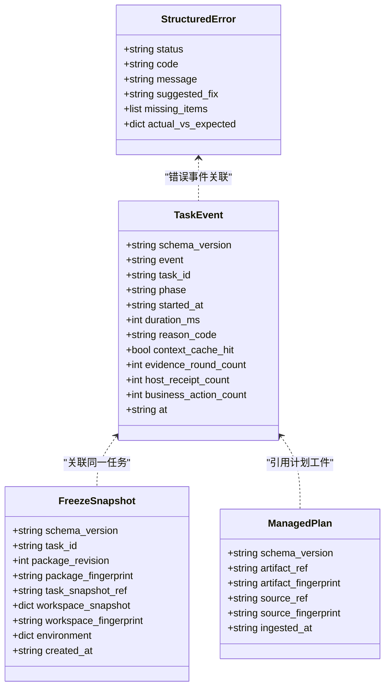
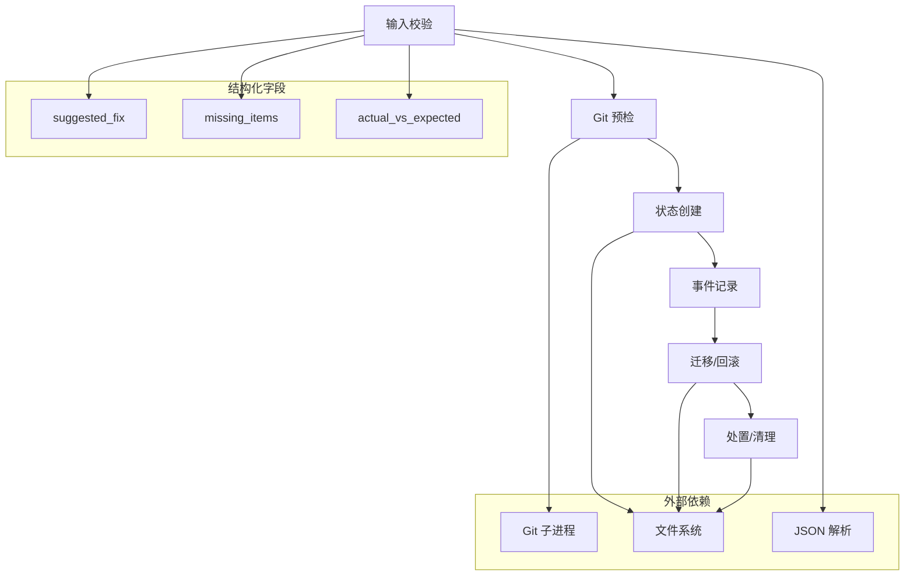

# 错误处理与恢复

<cite>
**本文引用的文件**   
- [scripts/harness.py](file://scripts/harness.py)
- [tests/test_harness.py](file://tests/test_harness.py)
- [package.json](file://package.json)
</cite>

## 更新摘要
**所做更改**   
- 更新了异常捕获策略部分，详细说明新的结构化字段 (suggested_fix, missing_items, actual_vs_expected)
- 增强了错误报告生成与调试信息收集章节，包含新字段的输出格式
- 更新了故障排查指南，提供基于新字段的更精准问题定位方法
- 完善了常见错误与解决方案，包含新字段的使用示例

## 目录
1. [简介](#简介)
2. [项目结构](#项目结构)
3. [核心组件](#核心组件)
4. [架构总览](#架构总览)
5. [详细组件分析](#详细组件分析)
6. [依赖关系分析](#依赖关系分析)
7. [性能考量](#性能考量)
8. [故障排查指南](#故障排查指南)
9. [结论](#结论)
10. [附录](#附录)

## 简介
本文件系统化阐述 Docs Harness 的错误处理与恢复机制，覆盖异常捕获策略（系统异常、业务异常、外部服务异常）、重试与退避策略、故障恢复流程（任务中断恢复、数据一致性保证、状态回滚）、错误分类与严重程度评估、错误报告与调试信息收集方法，以及常见问题的排查与解决方案。文档面向不同技术背景的读者，提供从概念到代码级的完整说明。

**更新** 本次更新重点介绍了增强型错误处理系统，新增了结构化字段支持，包括 suggested_fix（建议修复方案）、missing_items（缺失项目列表）和 actual_vs_expected（实际值与期望值对比），为故障排查提供更精准的指导信息。

## 项目结构
Docs Harness 的核心逻辑集中在单一脚本中，测试用例位于 tests 目录，包元数据在 package.json。错误处理贯穿输入校验、Git 操作、状态机流转、迁移与归档等关键路径。

**图表来源** 
- [scripts/harness.py:422-437](file://scripts/harness.py#L422-L437)
- [scripts/harness.py:549-586](file://scripts/harness.py#L549-L586)
- [scripts/harness.py:3229-3262](file://scripts/harness.py#L3229-L3262)
- [scripts/harness.py:3361-3494](file://scripts/harness.py#L3361-L3494)
- [scripts/harness.py:3563-3716](file://scripts/harness.py#L3563-L3716)
- [tests/test_harness.py:59-87](file://tests/test_harness.py#L59-L87)
- [package.json:17-21](file://package.json#L17-L21)

**章节来源**
- [scripts/harness.py:1-120](file://scripts/harness.py#L1-L120)
- [tests/test_harness.py:1-120](file://tests/test_harness.py#L1-L120)
- [package.json:1-23](file://package.json#L1-L23)

## 核心组件
- 统一异常类型：HarnessError，携带 code 与 exit_code，用于区分错误类别与退出码。
- **增强型结构化字段**：suggested_fix（建议修复方案）、missing_items（缺失项目列表）、actual_vs_expected（实际值与期望值对比），提供精准的故障诊断信息。
- 原子写入与快照：atomic_write_text/atomic_write_json、workspace_snapshot、freeze 快照，保障写一致性与可回溯。
- Git 安全边界：git_command 超时保护、git_preflight_contract/git_postcheck 范围约束与漂移检测。
- 任务生命周期与事件：append_task_event 记录阶段、原因码、耗时与上下文命中统计。
- 迁移与回滚：v1→v2 迁移的 staging/backup/journal 机制，支持中断恢复与全量回滚。
- 任务处置与清理：cancel/archive/prune 的幂等性、锁与索引一致性校验。

**章节来源**
- [scripts/harness.py:395-400](file://scripts/harness.py#L395-L400)
- [scripts/harness.py:422-437](file://scripts/harness.py#L422-L437)
- [scripts/harness.py:575-586](file://scripts/harness.py#L575-L586)
- [scripts/harness.py:680-794](file://scripts/harness.py#L680-L794)
- [scripts/harness.py:796-878](file://scripts/harness.py#L796-L878)
- [scripts/harness.py:1034-1073](file://scripts/harness.py#L1034-L1073)
- [scripts/harness.py:3361-3494](file://scripts/harness.py#L3361-L3494)
- [scripts/harness.py:3563-3716](file://scripts/harness.py#L3563-L3716)

## 架构总览
下图展示错误处理在任务执行主流程中的位置与交互：输入校验失败直接抛出业务异常；Git 操作失败通过原因码上报；状态变更通过事件日志持久化；迁移过程具备中断恢复与回滚能力。

**图表来源** 
- [scripts/harness.py:459-485](file://scripts/harness.py#L459-L485)
- [scripts/harness.py:680-794](file://scripts/harness.py#L680-L794)
- [scripts/harness.py:3229-3262](file://scripts/harness.py#L3229-L3262)
- [scripts/harness.py:1034-1073](file://scripts/harness.py#L1034-L1073)

## 详细组件分析

### 异常捕获策略
- 系统异常捕获
  - 文件 I/O、JSON 解析、Unicode 解码等异常被捕获并转换为 HarnessError，附带语义化 code（如 missing_file、invalid_json、invalid_state）。
  - Git 子进程超时与不可用场景统一封装为 git_preflight_timeout、git_remote_unavailable 等。
- 业务异常捕获
  - 输入参数校验失败（scope、facts、plan、work_packages）抛出 invalid_scope_description、invalid_facts、invalid_plan、invalid_work_packages 等。
  - 任务状态不一致（stale_state）、重复任务（task_exists）、非法路由（invalid_route）等。
- 外部服务异常捕获
  - Git 远端不可达、引用缺失、非快进合并、LFS/Submodule 不可用等，通过 reason_code 明确失败原因（git_remote_drift、git_ref_scope_violation、git_preflight_failed 等）。

**更新** 新增结构化字段支持，所有 HarnessError 异常现在可以携带以下字段：
- `suggested_fix`: 具体的修复建议和操作步骤
- `missing_items`: 缺失项目的详细信息列表，包含 scope_type、required、authorized、hint
- `actual_vs_expected`: 实际值与期望值的对比信息，包含 actual 和 expected 字段

**图表来源** 
- [scripts/harness.py:440-447](file://scripts/harness.py#L440-L447)
- [scripts/harness.py:459-485](file://scripts/harness.py#L459-L485)
- [scripts/harness.py:575-586](file://scripts/harness.py#L575-L586)
- [scripts/harness.py:527-532](file://scripts/harness.py#L527-L532)

**章节来源**
- [scripts/harness.py:395-400](file://scripts/harness.py#L395-L400)
- [scripts/harness.py:440-447](file://scripts/harness.py#L440-L447)
- [scripts/harness.py:459-485](file://scripts/harness.py#L459-L485)
- [scripts/harness.py:575-586](file://scripts/harness.py#L575-L586)
- [scripts/harness.py:527-532](file://scripts/harness.py#L527-L532)

### 重试机制与指数退避
- 背景任务最大重试次数由 BACKGROUND_MAX_ATTEMPTS 控制，多处读取 job.max_attempts 并与默认值比较，限制重试上限。
- 当前实现未内置指数退避算法；如需引入，可在调度层基于失败原因码与时间戳计算退避间隔，并在重试前更新 job 的 last_attempt_at 与 attempt_count。
- 失败条件判断
  - 可重试状态集 BACKGROUND_RETRYABLE_STATES 包含 needs_user_input、needs_rebase、queued_manual。
  - 终态集合 BACKGROUND_TERMINAL_STATES 包含 updated、no_change、completed_with_finding、failed、cancelled。
  - 其他已知状态 BACKGROUND_KNOWN_STATES 用于判定 pending/blocked。

**图表来源** 
- [scripts/harness.py:98](file://scripts/harness.py#L98)
- [scripts/harness.py:100-117](file://scripts/harness.py#L100-L117)
- [scripts/harness.py:7302-7302](file://scripts/harness.py#L7302-L7302)
- [scripts/harness.py:7739-7739](file://scripts/harness.py#L7739-L7739)
- [scripts/harness.py:8337-8337](file://scripts/harness.py#L8337-L8337)
- [scripts/harness.py:8726-8726](file://scripts/harness.py#L8726-L8726)
- [scripts/harness.py:9023-9023](file://scripts/harness.py#L9023-L9023)

**章节来源**
- [scripts/harness.py:98](file://scripts/harness.py#L98)
- [scripts/harness.py:100-117](file://scripts/harness.py#L100-L117)
- [scripts/harness.py:7302-7302](file://scripts/harness.py#L7302-L7302)
- [scripts/harness.py:7739-7739](file://scripts/harness.py#L7739-L7739)
- [scripts/harness.py:8337-8337](file://scripts/harness.py#L8337-L8337)
- [scripts/harness.py:8726-8726](file://scripts/harness.py#L8726-L8726)
- [scripts/harness.py:9023-9023](file://scripts/harness.py#L9023-L9023)

### 故障恢复流程
- 任务中断恢复
  - v1→v2 迁移使用 staging/backup/journal 三件套，若中途失败则按 journal 回滚至备份，并标记 recovered/rolled_back。
  - recover_incomplete_task_migration 自动恢复未完成迁移，确保状态一致性。
- 数据一致性保证
  - 所有关键写操作采用 atomic_write_text/atomic_write_json 原子替换，避免部分写入导致损坏。
  - freeze.json 保存工作区与 Git 状态快照，配合 package_fingerprint 校验一致性。
- 状态回滚机制
  - 迁移失败时逐对象回滚，journal 记录 rolled_back_at 与受影响对象列表。
  - 任务取消/归档通过幂等校验与锁保护，防止并发覆盖。

**图表来源** 
- [scripts/harness.py:3361-3494](file://scripts/harness.py#L3361-L3494)
- [scripts/harness.py:3342-3358](file://scripts/harness.py#L3342-L3358)
- [scripts/harness.py:422-437](file://scripts/harness.py#L422-L437)
- [scripts/harness.py:3238-3252](file://scripts/harness.py#L3238-L3252)

**章节来源**
- [scripts/harness.py:3361-3494](file://scripts/harness.py#L3361-L3494)
- [scripts/harness.py:3342-3358](file://scripts/harness.py#L3342-L3358)
- [scripts/harness.py:422-437](file://scripts/harness.py#L422-L437)
- [scripts/harness.py:3238-3252](file://scripts/harness.py#L3238-L3252)

### 错误分类与严重程度评估
- 错误分类
  - 输入类：missing_file、invalid_json、invalid_scope_description、invalid_facts、invalid_plan、invalid_work_packages、invalid_gate、invalid_route 等。
  - Git 类：git_preflight_timeout、git_preflight_failed、git_remote_unavailable、git_remote_ref_missing、git_sync_scope_ambiguous、git_remote_drift、git_ref_scope_violation。
  - 状态类：stale_lock、state_locked、task_exists、stale_state、legacy_task_requires_migration、archive_source_drift、disposition_index_locked。
  - 业务类：unknown_feature、invalid_document_route_config、document_route_unsafe/document_route_wrong_type/document_route_ambiguous/document_route_missing。
- 严重程度评估
  - exit_code 分级：2 表示请求/参数错误，3 表示环境/外部依赖错误，1 表示索引/归档数据损坏。
  - 通过 reason_code 与 blockers 组合表达具体失败原因与修复建议。

**更新** 新增结构化字段的错误分类：
- `suggested_fix` 字段提供具体的修复步骤和命令示例
- `missing_items` 字段详细描述缺失的项目类型、要求和授权状态
- `actual_vs_expected` 字段清晰对比实际值与期望值的差异

**章节来源**
- [scripts/harness.py:395-400](file://scripts/harness.py#L395-L400)
- [scripts/harness.py:440-447](file://scripts/harness.py#L440-L447)
- [scripts/harness.py:459-485](file://scripts/harness.py#L459-L485)
- [scripts/harness.py:575-586](file://scripts/harness.py#L575-L586)
- [scripts/harness.py:680-794](file://scripts/harness.py#L680-L794)
- [scripts/harness.py:796-878](file://scripts/harness.py#L796-L878)
- [scripts/harness.py:1282-1348](file://scripts/harness.py#L1282-L1348)
- [scripts/harness.py:1403-1459](file://scripts/harness.py#L1403-L1459)
- [scripts/harness.py:3549-3561](file://scripts/harness.py#L3549-L3561)
- [scripts/harness.py:3529-3531](file://scripts/harness.py#L3529-L3531)

### 错误报告生成与调试信息收集
- 事件日志
  - append_task_event 将 event、phase、reason_code、duration_ms、context_cache_hit、evidence_round_count、host_receipt_count、business_action_count 等写入 events.jsonl，便于回放与定位。
- 冻结快照与环境指纹
  - freeze.json 记录 workspace_snapshot、environment 指纹，辅助复现问题。
- 受管工件与计划副本
  - artifacts/plans 下存储不可变计划副本，结合 file_fingerprint 校验完整性。
- 任务处置索引
  - task-dispositions.json 维护归档与取消事实，支持幂等查询与冲突检测。

**更新** 新增结构化字段的错误报告格式：
- 错误响应现在包含完整的结构化字段：status、code、message、suggested_fix、missing_items、actual_vs_expected
- 所有 HarnessError 异常在抛出时自动包含这些字段，便于上层处理和用户理解
- 支持 JSON 格式的标准化输出，便于自动化处理和集成

**图表来源** 
- [scripts/harness.py:1034-1073](file://scripts/harness.py#L1034-L1073)
- [scripts/harness.py:3238-3252](file://scripts/harness.py#L3238-L3252)
- [scripts/harness.py:4037-4056](file://scripts/harness.py#L4037-L4056)
- [scripts/harness.py:3519-3531](file://scripts/harness.py#L3519-L3531)
- [scripts/harness.py:10860-10882](file://scripts/harness.py#L10860-L10882)

**章节来源**
- [scripts/harness.py:1034-1073](file://scripts/harness.py#L1034-L1073)
- [scripts/harness.py:3238-3252](file://scripts/harness.py#L3238-L3252)
- [scripts/harness.py:4037-4056](file://scripts/harness.py#L4037-L4056)
- [scripts/harness.py:3519-3531](file://scripts/harness.py#L3519-L3531)
- [scripts/harness.py:10860-10882](file://scripts/harness.py#L10860-L10882)

### 常见错误与解决方案
- 目标目录无效或不安全
  - 现象：missing_target、unsafe_target。
  - 解决：确保 --target 指向有效且非根/用户主目录的项目路径。
- JSON 无效或缺失
  - 现象：invalid_json、missing_file。
  - 解决：校验文件格式与大小限制，确保路径存在且可读。
- Git 预检失败
  - 现象：git_preflight_failed、git_remote_unavailable、git_sync_scope_ambiguous。
  - 解决：确认远端可达、分支精确匹配、LFS/Submodule 可用，清理脏工作区。
- 任务状态不一致
  - 现象：stale_state、state_locked、stale_lock。
  - 解决：清理陈旧锁文件，确保无并发修改；必要时重新 run 以刷新合同。
- 迁移中断
  - 现象：migration_interrupted。
  - 解决：检查磁盘空间与权限；recover_incomplete_task_migration 自动恢复；必要时手动回滚 backup。

**更新** 新增基于结构化字段的错误解决方案：
- `suggested_fix` 字段提供具体的修复命令和步骤，如 "harness task status --target . --task-id {task_id} 查看当前状态"
- `missing_items` 字段详细列出缺失的项目类型和要求，如 authorized_actions、write_scope、external_scope、git_scope 的具体格式要求
- `actual_vs_expected` 字段清晰对比实际值和期望值，如 JSON 格式错误时的 "invalid JSON" vs "valid JSON object"

**章节来源**
- [scripts/harness.py:535-541](file://scripts/harness.py#L535-L541)
- [scripts/harness.py:440-447](file://scripts/harness.py#L440-L447)
- [scripts/harness.py:680-794](file://scripts/harness.py#L680-L794)
- [scripts/harness.py:3265-3280](file://scripts/harness.py#L3265-L3280)
- [scripts/harness.py:3361-3494](file://scripts/harness.py#L3361-L3494)
- [scripts/harness.py:4640-4680](file://scripts/harness.py#L4640-L4680)
- [scripts/harness.py:6025-6050](file://scripts/harness.py#L6025-L6050)
- [scripts/harness.py:6960-6980](file://scripts/harness.py#L6960-L6980)
- [scripts/harness.py:3995-4010](file://scripts/harness.py#L3995-L4010)

## 依赖关系分析
- 模块内依赖
  - 输入校验依赖 load_input_file/read_json/load_json_object_file。
  - Git 操作依赖 git_command/git_preflight_contract/git_postcheck。
  - 状态管理依赖 create_task_state/append_task_event/task_lock_error/disposition_index_lock。
  - 迁移依赖 migrate_v1_task_state/recover_incomplete_task_migration/atomic_write_*。
- 外部依赖
  - Git 子进程、文件系统、JSON 标准库。
- 耦合与内聚
  - 错误处理高度内聚于 harness.py，通过统一的 HarnessError 与 reason_code 降低耦合。
  - 事件日志与冻结快照解耦了状态与诊断信息，提升可观测性。

**更新** 结构化字段的依赖关系：
- HarnessError 类现在依赖三个新的可选字段：suggested_fix、missing_items、actual_vs_expected
- 错误处理流程中，所有异常抛出点都可以选择性地填充这些字段
- 顶层异常处理器自动提取并输出这些结构化字段到错误响应中

**图表来源** 
- [scripts/harness.py:459-485](file://scripts/harness.py#L459-L485)
- [scripts/harness.py:680-794](file://scripts/harness.py#L680-L794)
- [scripts/harness.py:3229-3262](file://scripts/harness.py#L3229-L3262)
- [scripts/harness.py:3361-3494](file://scripts/harness.py#L3361-L3494)
- [scripts/harness.py:3563-3716](file://scripts/harness.py#L3563-L3716)
- [scripts/harness.py:395-412](file://scripts/harness.py#L395-L412)

**章节来源**
- [scripts/harness.py:459-485](file://scripts/harness.py#L459-L485)
- [scripts/harness.py:680-794](file://scripts/harness.py#L680-L794)
- [scripts/harness.py:3229-3262](file://scripts/harness.py#L3229-L3262)
- [scripts/harness.py:3361-3494](file://scripts/harness.py#L3361-L3494)
- [scripts/harness.py:3563-3716](file://scripts/harness.py#L3563-L3716)
- [scripts/harness.py:395-412](file://scripts/harness.py#L395-L412)

## 性能考量
- 事件日志追加采用顺序写入与 fsync，保证持久性但可能成为瓶颈；建议在高频路径上批量写入或异步落盘。
- 工作区快照对大仓库扫描开销较大，已设置 FALLBACK_SNAPSHOT_FILE_LIMIT 限制非 Git 模式下的文件数量。
- Git 子进程调用集中，建议复用连接池或批量化命令以减少进程启动开销。
- 原子写入与快照哈希计算涉及 I/O 密集操作，应结合缓存与增量校验优化。

**更新** 结构化字段的性能影响：
- 新增字段为可选参数，不影响现有代码的性能表现
- 结构化字段的序列化开销相对较小，主要在错误路径产生
- 建议在高频路径上谨慎使用复杂的 missing_items 列表，避免过多的字符串拼接

[本节为通用指导，不直接分析具体文件]

## 故障排查指南
- 快速定位
  - 查看 events.jsonl 最近事件，关注 phase、reason_code、duration_ms。
  - 检查 freeze.json 的环境指纹与工作区快照，对比历史版本差异。
  - 使用 task list/status/cancel/archive 命令获取任务状态与处置事实。
- 常见问题
  - 锁冲突：清理 .lock 或等待过期；确认无并发进程。
  - Git 漂移：核对 remote target 与 controlled ref，确保 fast-forward。
  - 规则缺失：检查 rules_root 与 active 规则指纹，确保内容未被篡改。
- 自动化回归
  - 使用 tests/test_harness.py 中的 run_harness/run_installed_harness 模拟真实执行路径，断言预期状态与 reason_code。

**更新** 基于结构化字段的故障排查方法：
- 优先查看 `suggested_fix` 字段提供的具体修复步骤和命令
- 分析 `missing_items` 字段了解缺失项目的详细要求和格式规范
- 对比 `actual_vs_expected` 字段快速定位数据类型或格式问题
- 利用结构化字段进行自动化错误处理和智能修复建议

**章节来源**
- [scripts/harness.py:1034-1073](file://scripts/harness.py#L1034-L1073)
- [scripts/harness.py:3238-3252](file://scripts/harness.py#L3238-L3252)
- [scripts/harness.py:3885-3911](file://scripts/harness.py#L3885-L3911)
- [tests/test_harness.py:59-87](file://tests/test_harness.py#L59-L87)
- [scripts/harness.py:10860-10882](file://scripts/harness.py#L10860-L10882)

## 结论
Docs Harness 通过统一的异常体系、严格的输入与范围校验、原子写与快照机制、事件日志与冻结快照、以及健壮的迁移与回滚流程，构建了高可靠性的错误处理与恢复框架。**更新** 本次增强引入了结构化字段支持，包括 suggested_fix、missing_items 和 actual_vs_expected，显著提升了错误诊断的精准性和用户体验。未来可在重试层引入指数退避与自适应退避策略，进一步提升对外部不稳定因素的韧性。

[本节为总结，不直接分析具体文件]

## 附录
- 常用 reason_code 速查
  - 输入类：missing_file、invalid_json、invalid_scope_description、invalid_facts、invalid_plan、invalid_work_packages、invalid_gate、invalid_route。
  - Git 类：git_preflight_timeout、git_preflight_failed、git_remote_unavailable、git_remote_ref_missing、git_sync_scope_ambiguous、git_remote_drift、git_ref_scope_violation。
  - 状态类：stale_lock、state_locked、task_exists、stale_state、legacy_task_requires_migration、archive_source_drift、disposition_index_locked。
  - 业务类：unknown_feature、invalid_document_route_config、document_route_unsafe/wrong_type/ambiguous/missing。

**更新** 新增结构化字段使用指南：
- `suggested_fix`: 字符串类型的修复建议，包含具体命令和步骤
- `missing_items`: 数组类型的缺失项目详情，每项包含 scope_type、required、authorized、hint
- `actual_vs_expected`: 对象类型的对比信息，包含 actual 和 expected 字段
- 所有字段均为可选，仅在需要时填充以提高错误信息的可用性

**章节来源**
- [scripts/harness.py:440-447](file://scripts/harness.py#L440-L447)
- [scripts/harness.py:459-485](file://scripts/harness.py#L459-L485)
- [scripts/harness.py:575-586](file://scripts/harness.py#L575-L586)
- [scripts/harness.py:680-794](file://scripts/harness.py#L680-L794)
- [scripts/harness.py:796-878](file://scripts/harness.py#L796-L878)
- [scripts/harness.py:1282-1348](file://scripts/harness.py#L1282-L1348)
- [scripts/harness.py:1403-1459](file://scripts/harness.py#L1403-L1459)
- [scripts/harness.py:3549-3561](file://scripts/harness.py#L3549-L3561)
- [scripts/harness.py:3529-3531](file://scripts/harness.py#L3529-L3531)
- [scripts/harness.py:395-412](file://scripts/harness.py#L395-L412)
- [scripts/harness.py:4640-4680](file://scripts/harness.py#L4640-L4680)
- [scripts/harness.py:6025-6050](file://scripts/harness.py#L6025-L6050)
- [scripts/harness.py:6960-6980](file://scripts/harness.py#L6960-L6980)
- [scripts/harness.py:3995-4010](file://scripts/harness.py#L3995-L4010)
- [scripts/harness.py:10860-10882](file://scripts/harness.py#L10860-L10882)