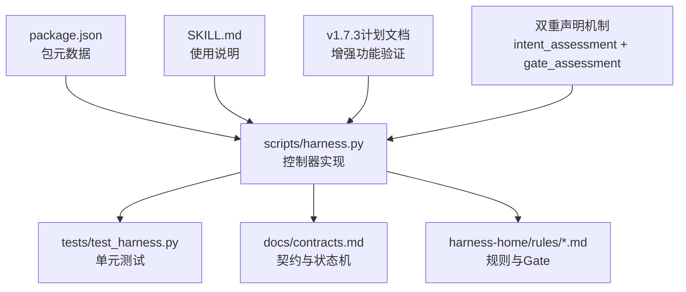
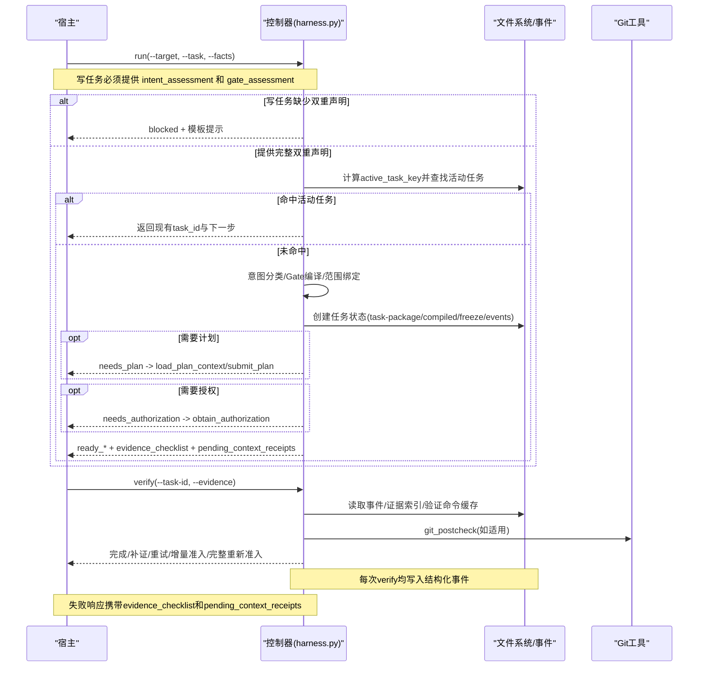
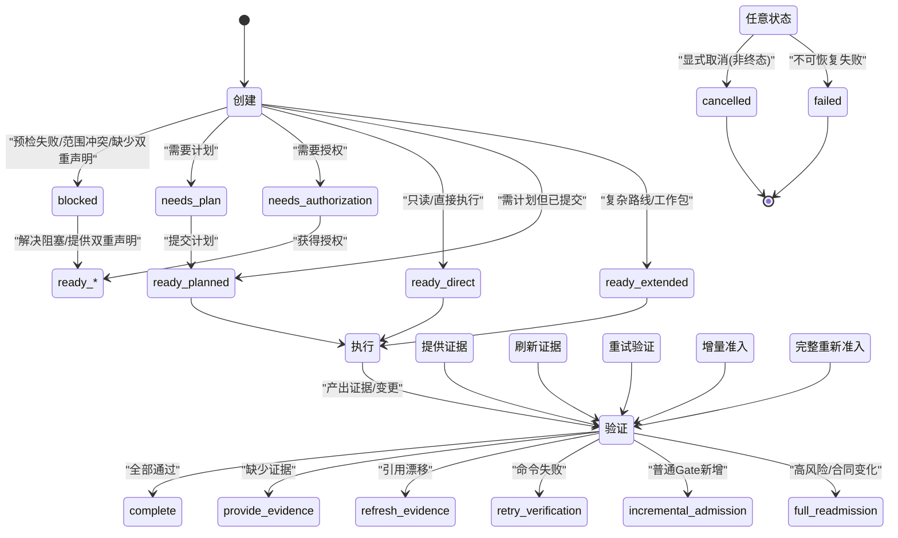
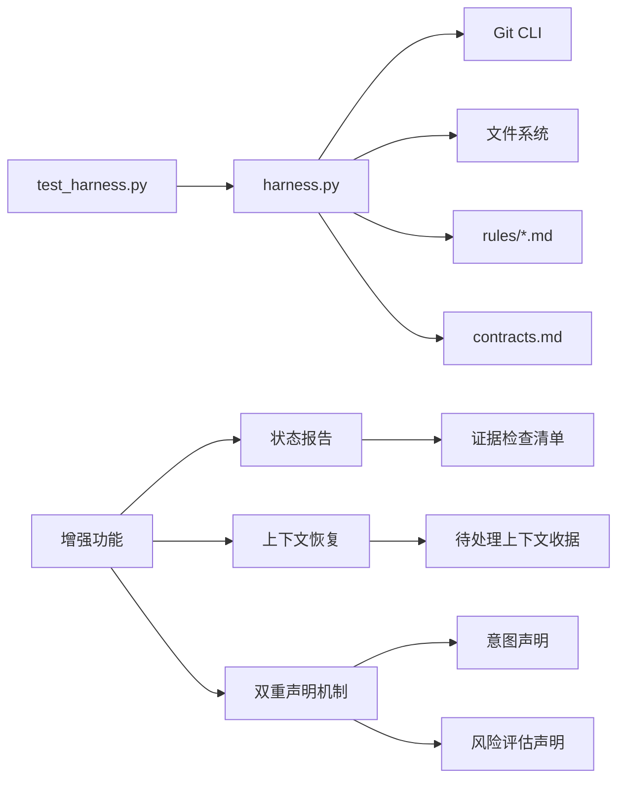

# 任务生命周期管理

<cite>
**本文引用的文件**   
- [scripts/harness.py](file://scripts/harness.py)
- [tests/test_harness.py](file://tests/test_harness.py)
- [package.json](file://package.json)
- [SKILL.md](file://SKILL.md)
- [docs/contracts.md](file://docs/contracts.md)
- [harness-home/rules/INDEX.md](file://harness-home/rules/INDEX.md)
- [harness-home/rules/scope-change-readmission.md](file://harness-home/rules/scope-change-readmission.md)
- [harness-home/rules/testing-release.md](file://harness-home/rules/testing-release.md)
- [docs/plans/v1.6.4-minimal-systemic-flow-efficiency-plan.md](file://docs/plans/v1.6.4-minimal-systemic-flow-efficiency-plan.md)
- [docs/plans/v1.7.3-minimal-host-flow-verify.py](file://docs/plans/v1.7.3-minimal-host-flow-verify.py)
</cite>

## 更新摘要
**所做更改**
- **重大变更**：写任务现在要求强制的双重声明 - 必须同时提供 `intent_assessment`（权威意图声明及理由）和 `gate_assessment`（风险评估及 Gate 声明及理由），之前可以从任务文本和路径推断意图
- 更新了任务状态报告机制，新增证据检查清单和待处理上下文收据功能
- 增强了上下文加载失败的错误处理和详细信息提供
- 完善了任务准入、执行和验证阶段的容错机制
- 改进了宿主与控制器之间的协作流程

## 目录
1. [简介](#简介)
2. [项目结构](#项目结构)
3. [核心组件](#核心组件)
4. [架构总览](#架构总览)
5. [详细组件分析](#详细组件分析)
6. [依赖关系分析](#依赖关系分析)
7. [性能考量](#性能考量)
8. [故障排查指南](#故障排查指南)
9. [结论](#结论)
10. [附录](#附录)

## 简介
本文件面向 Docs Harness 的任务生命周期管理，系统性阐述从任务创建、准入、执行到完成的全流程状态转换机制；明确 active、complete、cancelled、failed、blocked 等状态的触发条件与转换规则；解释幂等性保证与重复检测；说明任务缓存与复用策略；并给出任务 ID 生成规则、时间戳处理与版本控制集成要点。文档同时提供状态机图与使用示例，帮助在不同场景下正确处理任务状态变化。

**重大更新** 写任务现在要求强制的双重声明机制：
- **intent_assessment**：权威的意图声明，包含具体的意图列表和理由说明
- **gate_assessment**：权威的风险评估，包含 Gate 声明和风险评估理由

这一变更取代了之前从任务文本和路径自动推断意图的机制，提供了更严格的安全控制和明确的语义声明。

## 项目结构
Docs Harness 的核心实现位于 scripts/harness.py，测试用例位于 tests/test_harness.py，合同与计划文档位于 docs/ 目录，规则定义位于 harness-home/rules/。package.json 描述包元数据与脚本入口，SKILL.md 提供高层使用说明。

**图表来源** 
- [scripts/harness.py](file://scripts/harness.py)
- [tests/test_harness.py](file://tests/test_harness.py)
- [docs/contracts.md](file://docs/contracts.md)
- [harness-home/rules/INDEX.md](file://harness-home/rules/INDEX.md)
- [package.json](file://package.json)
- [SKILL.md](file://SKILL.md)
- [docs/plans/v1.7.3-minimal-host-flow-verify.py](file://docs/plans/v1.7.3-minimal-host-flow-verify.py)

**章节来源**
- [package.json:1-23](file://package.json#L1-L23)
- [SKILL.md:1-105](file://SKILL.md#L1-L105)

## 核心组件
- 任务包与编译态：task-package/v2、compiled-task/v2、freeze/v2、evidence-index/v2、events.jsonl 事件日志
- **双重声明机制**：`intent_assessment`（权威意图声明）和 `gate_assessment`（风险评估声明）为写任务的强制要求
- 准入与路线：direct/planned/extended 三种执行路线，按意图与 Gate 决定
- 状态机：control_status 维护 blocked/needs_plan/needs_authorization/ready_direct/ready_planned/ready_extended/complete/cancelled/failed 等
- 幂等键：active_task_key 基于 target_identity、任务文本、facts 指纹与初始工作区快照
- 验证与证据：verification_commands、evidence-receipt/v2、自动归因与命令缓存
- Git 预检与后检查：git_preflight_contract、git_postcheck，保障 fetch/sync 范围与一致性
- 后台治理：background job 的 prepare/dispatch/running/progress/verify/retry 流程
- **新增** 增强的状态报告：evidence_checklist 四段式证据清单和 pending_context_receipts 待处理上下文追踪

**章节来源**
- [docs/contracts.md:1-46](file://docs/contracts.md#L1-L46)
- [docs/contracts.md:48-76](file://docs/contracts.md#L48-L76)
- [docs/contracts.md:165-197](file://docs/contracts.md#L165-L197)
- [scripts/harness.py:2750-2766](file://scripts/harness.py#L2750-L2766)
- [scripts/harness.py:3362-3376](file://scripts/harness.py#L3362-L3376)
- [scripts/harness.py:3711-3714](file://scripts/harness.py#L3711-L3714)
- [scripts/harness.py:3062-3095](file://scripts/harness.py#L3062-L3095)
- [scripts/harness.py:3747-3767](file://scripts/harness.py#L3747-L3767)
- [scripts/harness.py:677-791](file://scripts/harness.py#L677-L791)
- [scripts/harness.py:793-876](file://scripts/harness.py#L793-L876)
- [scripts/harness.py:3033-3048](file://scripts/harness.py#L3033-L3048)
- [scripts/harness.py:3051-3073](file://scripts/harness.py#L3051-L3073)

## 架构总览
任务生命周期由控制器统一编排，贯穿 run → context → verify → complete 的主路径，并在需要时进入计划与授权阶段。Git 操作通过预检与后检查确保边界安全。**重大变更**：写任务现在必须提供双重声明才能通过准入检查。

**更新** 增强了状态报告机制，在关键节点提供证据检查清单和待处理上下文收据，提高宿主与控制器之间的协作效率。

**图表来源** 
- [scripts/harness.py:2750-2766](file://scripts/harness.py#L2750-L2766)
- [scripts/harness.py:3362-3376](file://scripts/harness.py#L3362-L3376)
- [scripts/harness.py:3711-3714](file://scripts/harness.py#L3711-L3714)
- [scripts/harness.py:3062-3095](file://scripts/harness.py#L3062-L3095)
- [scripts/harness.py:3747-3767](file://scripts/harness.py#L3747-L3767)
- [scripts/harness.py:793-876](file://scripts/harness.py#L793-L876)
- [docs/contracts.md:48-76](file://docs/contracts.md#L48-L76)
- [scripts/harness.py:7440-7446](file://scripts/harness.py#L7440-L7446)

## 详细组件分析

### 任务ID生成与时间戳
- 任务ID格式：dh-YYYYMMDDTHHMMSS-十位十六进制随机串，正则校验严格
- 时间戳：UTC 精确到秒，用于 created_at、updated_at、cancelled_at、completed_at、failed_at 等字段
- 版本控制：任务包 schema_version 为 v2，v1 任务需显式迁移；冻结对象包含 package_revision 与 package_fingerprint

**章节来源**
- [scripts/harness.py:72](file://scripts/harness.py#L72)
- [scripts/harness.py:3747-3749](file://scripts/harness.py#L3747-L3749)
- [scripts/harness.py:3062-3095](file://scripts/harness.py#L3062-L3095)
- [scripts/harness.py:3194-3327](file://scripts/harness.py#L3194-L3327)

### 幂等性与重复检测
- active_task_key = sha256(target_identity + normalized task + facts fingerprint + initial workspace snapshot fingerprint)
- 相同 key 的非终态任务默认复用，blocked 不参与复用（强制重新校验）
- --new-task 可强制新建独立任务

**章节来源**
- [scripts/harness.py:3756-3767](file://scripts/harness.py#L3756-L3767)
- [scripts/harness.py:3770-3794](file://scripts/harness.py#L3770-L3794)
- [SKILL.md:35-36](file://SKILL.md#L35-L36)
- [docs/contracts.md:48-49](file://docs/contracts.md#L48-L49)

### 强制双重声明机制

**重大变更** 写任务现在必须提供双重声明才能通过准入检查，这取代了之前从任务文本和路径自动推断意图的机制。

#### intent_assessment（权威意图声明）
- **必需字段**：`intents`（任务意图数组）和 `rationale`（理由说明，500字符内非空字符串）
- **作用**：提供权威的意图声明，自然语言关键词不能覆盖此声明
- **验证**：检查意图是否在受控列表中，理由是否为有效字符串
- **优先级**：一旦声明，任务文本启发式不得增补或覆盖

#### gate_assessment（风险评估声明）
- **必需字段**：`gates`（Gate 名称数组）和 `rationale`（风险评估理由，500字符内非空字符串）
- **作用**：提供权威的风险评估和 Gate 声明
- **验证**：检查 Gate 名称是否有效，理由是否为有效字符串
- **限制**：初始路径只能推断封闭结构 Gate（document-edit、code-edit、testing-acceptance），不能根据开放路径名称猜测语义

#### 准入检查逻辑
- 对于 `workspace_write` 或 `external_write` 任务：
  - 缺少 `intent_assessment`：阻断并返回模板提示
  - 缺少 `gate_assessment`：阻断并返回模板提示
  - 两者都提供：继续正常准入流程

**章节来源**
- [scripts/harness.py:2750-2766](file://scripts/harness.py#L2750-L2766)
- [scripts/harness.py:3362-3376](file://scripts/harness.py#L3362-L3376)
- [scripts/harness.py:3711-3714](file://scripts/harness.py#L3711-L3714)
- [docs/contracts.md:46-48](file://docs/contracts.md#L46-L48)

### 改进的意图分类机制

**更新** 意图分类现在优先考虑宿主声明，而不是从任务文本推断。

#### 分类优先级
1. **宿主声明优先**：如果提供 `intent_assessment`，直接使用声明的意图
2. **兼容字段**：支持旧的 `task_intent` 和 `candidate_intents` 字段
3. **启发式推断**：只有在没有声明时才从任务文本推断意图

#### 只读任务保护
- 只读讨论中出现动作词时保持只读
- 只有明确祈使或执行连接词才保留动作候选
- 仅声明 `read_scope` 不得触发 `modify` 兜底

**章节来源**
- [scripts/harness.py:2792-2887](file://scripts/harness.py#L2792-L2887)
- [tests/test_harness.py:7916-7929](file://tests/test_harness.py#L7916-L7929)

### 增强的任务状态报告机制

**新增功能** 系统现在在三个关键位置提供增强的状态报告：首次 run 响应、二次 run 的 ready 响应、以及 task status 响应。

#### 证据检查清单（evidence_checklist）
证据检查清单包含四个部分：
- **required**：完成清单要求的证据类型列表
- **conditional**：预声明的条件项及其激活条件
- **required_receipts**：每项附条件性文字说明（如 write_set 仅在任务产生实际写入时要求）
- **skeletons**：准入时预生成的证据骨架路径，包含 _instructions 填写说明

#### 待处理上下文收据（pending_context_receipts）
待处理上下文收据列出尚未加载或已失效的上下文阶段与工作包：
- 上下文阶段：action、plan
- 工作包：work_package:<id> 形式，已 verified 的工作包不再列出
- 目的：避免执行后才暴露缺上下文的问题

**章节来源**
- [scripts/harness.py:3033-3048](file://scripts/harness.py#L3033-L3048)
- [scripts/harness.py:3051-3073](file://scripts/harness.py#L3051-L3073)
- [docs/contracts.md:86](file://docs/contracts.md#L86)
- [docs/plans/v1.7.3-minimal-host-flow-verify.py:154-162](file://docs/plans/v1.7.3-minimal-host-flow-verify.py#L154-L162)

### 改进的上下文加载失败处理

**新增功能** 当执行阶段上下文未加载或已失效时，系统现在提供更详细的错误信息和恢复指导。

#### action_context_missing 错误处理
当检测到 action 上下文缺失时：
- 返回退出码 3，result 为 "补充证据"
- reason_code 为 "action_context_missing"
- 包含完整的 pending_context_receipts 列表
- 附带完整的 evidence_checklist
- next_action 设置为 "load_action_context"

#### 失败即前置机制
即使宿主未读准入指引，失败载荷也能提供足够的信息来恢复：
- action_context_missing 失败载荷携带 pending_context_receipts 与完整 evidence_checklist
- 宿主可以照失败载荷补齐所需上下文和证据
- 不依赖指令遵守，提供兜底恢复能力

**章节来源**
- [scripts/harness.py:7440-7446](file://scripts/harness.py#L7440-L7446)
- [tests/test_harness.py:7316-7350](file://tests/test_harness.py#L7316-L7350)
- [docs/plans/v1.7.3-minimal-host-flow-verify.py:186-200](file://docs/plans/v1.7.3-minimal-host-flow-verify.py#L186-L200)

### 任务状态机与转换规则
- 准入状态：blocked、needs_plan、needs_authorization、ready_direct、ready_planned、ready_extended
- 控制状态：blocked、complete、cancelled、failed 以及中间态（由 next_action 驱动）
- 关键转换：
  - create → blocked/needs_plan/needs_authorization/ready_*（根据 Gate、范围、路由）
  - ready_* → execute → verification → complete
  - verify 失败分支：provide_evidence / refresh_evidence / retry_verification / incremental_admission / full_readmission
  - cancel：仅非终态可取消，记录 reason_code 与 event_ref
  - failed：验证或执行失败且不可恢复时进入

**图表来源** 
- [docs/contracts.md:48-76](file://docs/contracts.md#L48-L76)
- [scripts/harness.py:3033-3059](file://scripts/harness.py#L3033-L3059)
- [scripts/harness.py:3396-3493](file://scripts/harness.py#L3396-L3493)

### 准入、范围与Gate
- 意图分类：query/audit/git_inspect/git_fetch/git_sync/modify/external_write，映射 mutation_profile
- **更新** Gate 推断：基于关键词、路径分词与安全底线（security-sensitive/destructive-data/release-external），但现在需要显式声明
- 范围绑定：read_scope/write_scope/git_scope/external_scope，git_sync 自动推导 write_scope
- 完成清单：completion_manifest 声明必需证据类型、收据、验证命令与阻断项

**章节来源**
- [scripts/harness.py:2154-2228](file://scripts/harness.py#L2154-L2228)
- [scripts/harness.py:2245-2286](file://scripts/harness.py#L2245-L2286)
- [scripts/harness.py:2613-2799](file://scripts/harness.py#L2613-L2799)
- [scripts/harness.py:2545-2585](file://scripts/harness.py#L2545-L2585)

### 验证与证据
- evidence-receipt/v2 绑定 task_id、target_identity、package_fingerprint、producer、ttl、读写集合
- 验证命令逐项缓存：输入指纹命中则跳过执行，失败仅重跑失败项
- 自动归因：write_scope 内未归因写入自动生成 workspace_attribution 收据
- 临时副产物：__pycache__/.pytest_cache/.coverage 等不计入额外写入，仅 volatile_write_set

**章节来源**
- [docs/contracts.md:165-197](file://docs/contracts.md#L165-L197)
- [scripts/harness.py:1188-1213](file://scripts/harness.py#L1188-L1213)
- [scripts/harness.py:1216-1233](file://scripts/harness.py#L1216-L1233)
- [SKILL.md:43-53](file://SKILL.md#L43-L53)

### Git 预检与后检查
- git_preflight_contract：对 git_fetch/git_sync 进行目标 OID、refs、index、worktree 快照与 LFS/Submodule 可用性检查
- git_postcheck：对比 preflight 快照，校验 remote_target_unchanged、controlled_ref、HEAD/index/worktree 一致性
- 漂移处理：远端漂移返回 git_remote_drift，ref 越界返回 git_ref_scope_violation

**章节来源**
- [scripts/harness.py:677-791](file://scripts/harness.py#L677-L791)
- [scripts/harness.py:793-876](file://scripts/harness.py#L793-L876)

### 后台治理（Job）
- 准备：prepare 生成 revision 2 Plan/Progress，重复调用内容一致返回 already_prepared
- 调度：contract_ready→dispatched→running，校验绑定、attempt、工作包全集与指纹
- 进度：progress 仅允许 running 的复杂 Job，状态转换受限
- 验收：verify 要求 updated/no_change 时所有工作包 completed；completed_with_finding 仅允许 completed/blocked

**章节来源**
- [docs/contracts.md:332-338](file://docs/contracts.md#L332-L338)
- [SKILL.md:59-89](file://SKILL.md#L59-L89)

### 取消与归档
- cancel：仅 v2 任务可取消，非终态可取消，记录 reason_code、event_ref、previous_status
- archive：仅 v1 任务可归档，写入处置索引，源对象指纹漂移则失败关闭

**章节来源**
- [scripts/harness.py:3396-3493](file://scripts/harness.py#L3396-L3493)
- [scripts/harness.py:3496-3548](file://scripts/harness.py#L3496-L3548)

### 实际使用示例

**重大更新** 增加了新的使用场景，展示强制双重声明的使用方法。

- 只读查询：run → ready_direct → verify（无写操作，无需双重声明）
- Git 同步：run → needs_plan → submit_plan → ready_planned → verify（git_postcheck 通过）
- 发布任务：run → needs_authorization → obtain_authorization → verify（外部状态证据）
- 失败重试：verify 返回 retry_verification → 修正输入后再次 verify
- **新增** 上下文缺失恢复：verify 返回 action_context_missing → 按 pending_context_receipts 加载上下文 → 重新 verify
- **新增** 证据清单使用：准入时获取 evidence_checklist → 执行中实时铸证据 → 一次 verify 通过
- **新增** 双重声明使用：写任务必须提供 intent_assessment 和 gate_assessment → 通过准入检查 → 继续执行流程

**章节来源**
- [tests/test_harness.py:429-448](file://tests/test_harness.py#L429-L448)
- [tests/test_harness.py:503-537](file://tests/test_harness.py#L503-L537)
- [tests/test_harness.py:597-684](file://tests/test_harness.py#L597-L684)
- [tests/test_harness.py:7291-7350](file://tests/test_harness.py#L7291-L7350)
- [tests/test_harness.py:7931-7941](file://tests/test_harness.py#L7931-L7941)
- [docs/plans/v1.7.3-minimal-host-flow-verify.py:149-184](file://docs/plans/v1.7.3-minimal-host-flow-verify.py#L149-L184)

## 依赖关系分析
- 控制器依赖 Git 工具、文件系统、JSON 序列化与哈希函数
- 规则系统依赖 harness-home/rules/*.md 的 frontmatter 与正文指纹
- 契约文档约束任务包、证据、验证命令与完成清单的结构
- **新增** 双重声明机制依赖严格的验证规则和模板生成

**图表来源** 
- [scripts/harness.py](file://scripts/harness.py)
- [harness-home/rules/INDEX.md](file://harness-home/rules/INDEX.md)
- [docs/contracts.md](file://docs/contracts.md)
- [tests/test_harness.py](file://tests/test_harness.py)

**章节来源**
- [harness-home/rules/INDEX.md:1-41](file://harness-home/rules/INDEX.md#L1-L41)
- [docs/contracts.md:1-46](file://docs/contracts.md#L1-L46)

## 性能考量
- 验证命令缓存：按输入指纹命中跳过执行，减少昂贵命令重复
- 上下文去重：plan/action 阶段相同内容正文只返回一次
- 增量准入：普通 Gate 新增不触发完整重新准入，降低往返
- 工作区快照：大文件采用 size+mtime 指纹，避免全量哈希
- **新增** 证据清单预生成：准入时预生成证据骨架，减少后续往返
- **新增** 上下文收据缓存：跨阶段复用已加载的上下文内容
- **新增** 双重声明验证：快速失败机制，避免不必要的处理开销

**章节来源**
- [docs/plans/v1.6.4-minimal-systemic-flow-efficiency-plan.md:493-506](file://docs/plans/v1.6.4-minimal-systemic-flow-efficiency-plan.md#L493-L506)
- [scripts/harness.py:1112-1135](file://scripts/harness.py#L1112-L1135)
- [scripts/harness.py:3033-3048](file://scripts/harness.py#L3033-L3048)
- [scripts/harness.py:4938-4942](file://scripts/harness.py#L4938-L4942)

## 故障排查指南

**重大更新** 增加了新的故障排查场景和处理方法，特别是针对双重声明机制。

- 常见错误码：invalid_task_id、stale_lock、state_locked、migration_interrupted、archive_source_drift
- **新增** action_context_missing：执行阶段上下文未加载或已失效
- **新增** invalid_intent_assessment：意图声明格式无效或缺少必需字段
- **新增** invalid_gate_assessment：风险评估声明格式无效或缺少必需字段
- **新增** stale_evidence：证据声明虚报未实际变化的路径
- 诊断步骤：
  - 检查 events.jsonl 最近事件定位失败阶段
  - 核对 compiled-task.json 的 control_status 与 next_action
  - 验证 freeze.json 的 package_fingerprint 一致性
  - 使用 task list/status/prune 清理陈旧状态
  - **新增** 检查 pending_context_receipts 了解缺失的上下文
  - **新增** 查看 evidence_checklist 了解所需的证据类型
  - **新增** 检查写任务是否提供了完整的双重声明

**章节来源**
- [scripts/harness.py:392-396](file://scripts/harness.py#L392-L396)
- [scripts/harness.py:3382-3393](file://scripts/harness.py#L3382-L3393)
- [scripts/harness.py:3663-3715](file://scripts/harness.py#L3663-L3715)
- [scripts/harness.py:7440-7446](file://scripts/harness.py#L7440-L7446)
- [tests/test_harness.py:7316-7350](file://tests/test_harness.py#L7316-L7350)

## 结论
Docs Harness 的任务生命周期管理以严格的契约、幂等键与事件化状态为核心，结合 Gate 与范围绑定实现安全可控的执行路径。通过验证命令缓存、上下文去重与增量准入，显著降低重复成本。Git 预检与后检查确保远端一致性，后台治理支持复杂目标型任务。

**重大更新** 最新的强制双重声明机制进一步提升了系统的安全性和可控性：
- **intent_assessment** 提供权威的意图声明，防止从任务文本推断带来的不确定性
- **gate_assessment** 提供明确的风险评估，确保高风险操作得到适当审查
- 这一变更解决了之前从自然语言关键词和路径推断意图的安全隐患
- 配合增强的任务状态报告机制和改进的上下文加载失败处理，提供了更好的用户体验和恢复能力

建议在实际使用中遵循"最小必要变更"原则，充分利用幂等与缓存机制，提升整体效率与可靠性。对于写任务，务必提供完整的双重声明以确保顺利准入。

## 附录
- 任务ID正则：^dh-[0-9]{8}T[0-9]{6}-[0-9a-f]{10}$
- 时间戳：UTC ISO 8601，秒级精度
- 版本兼容：v1 任务需显式迁移至 v2，迁移过程可回滚
- **新增** 证据检查清单格式：{required, conditional, required_receipts, skeletons}
- **新增** 待处理上下文收据格式：["action", "plan", "work_package:<id>"]
- **新增** 双重声明格式：
  - `intent_assessment`: {"intents": [...], "rationale": "..."}
  - `gate_assessment`: {"gates": [...], "rationale": "..."}

**章节来源**
- [scripts/harness.py:72](file://scripts/harness.py#L72)
- [scripts/harness.py:3194-3327](file://scripts/harness.py#L3194-L3327)
- [scripts/harness.py:3033-3048](file://scripts/harness.py#L3033-L3048)
- [scripts/harness.py:3051-3073](file://scripts/harness.py#L3051-L3073)
- [scripts/harness.py:2750-2766](file://scripts/harness.py#L2750-L2766)
- [scripts/harness.py:3362-3376](file://scripts/harness.py#L3362-L3376)