# 任务管理

<cite>
**本文引用的文件**   
- [SKILL.md](file://SKILL.md)
- [package.json](file://package.json)
- [harness.py](file://scripts/harness.py)
- [contracts.md](file://docs/contracts.md)
- [INDEX.md](file://harness-home/rules/INDEX.md)
- [api-compatibility.md](file://harness-home/rules/api-compatibility.md)
- [external-input-security.md](file://harness-home/rules/external-input-security.md)
- [testing-release.md](file://harness-home/rules/testing-release.md)
- [scope-change-readmission.md](file://harness-home/rules/scope-change-readmission.md)
- [v1.6.4-minimal-systemic-flow-efficiency-plan.md](file://docs/plans/v1.6.4-minimal-systemic-flow-efficiency-plan.md)
- [test_harness.py](file://tests/test_harness.py)
</cite>

## 更新摘要
**变更内容**   
- 新增外部任务采用工作流，支持对已在外部完成的任务进行补录和状态同步
- 新增跨平台任务感知功能，自动检测平台特定文件并生成验证层提示
- 更新了任务生命周期中的外部采用流程和相关状态转换
- 增强了任务包的平台范围检测和验证层构建机制

## 目录
1. [简介](#简介)
2. [项目结构](#项目结构)
3. [核心组件](#核心组件)
4. [架构总览](#架构总览)
5. [详细组件分析](#详细组件分析)
6. [依赖关系分析](#依赖关系分析)
7. [性能与幂等性](#性能与幂等性)
8. [故障排查指南](#故障排查指南)
9. [结论](#结论)
10. [附录：CLI 命令参考与 JSON 接口规范](#附录cli-命令参考与-json-接口规范)

## 简介
Docs Harness 是一个"意图优先、证据可复用且失败关闭"的独立控制技能，负责任务准入、风险 Gate、范围与授权、上下文与证据、验收与后台治理。它不自动提交、推送或发布下游内容，也不把源码、本地 Runtime、当前 HEAD、远端、fresh clone、发布产物和真实 UI 合并为单一完成结论。所有关键流程通过 CLI 暴露，并以结构化 JSON 输出，便于宿主集成与自动化。

**更新** 新增了外部任务采用工作流和跨平台任务感知功能，支持对已在外部完成的任务进行补录，以及自动检测和处理跨平台特定的文件验证需求。

## 项目结构
- scripts/harness.py：主控制器实现（Python），包含 CLI、状态机、Git 预/后检查、证据与收据处理、后台 Job 管理等。
- docs/contracts.md：对外合同定义（task-package、evidence-receipt、completion-manifest、Git 状态、退出码等）。
- harness-home/rules/*：生效规则集，按 Gate 与关键词驱动方案字段与证据类型要求。
- tests/test_harness.py：覆盖安装、准入、Git 操作、验证、后台 Job 等场景的单元测试。
- package.json：包元数据与脚本入口（self-test、pack:check 等）。

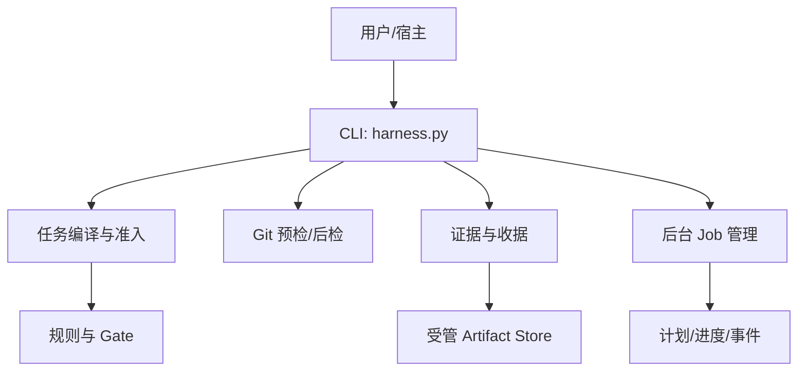

图表来源 
- [harness.py](file://scripts/harness.py)
- [contracts.md](file://docs/contracts.md)
- [INDEX.md](file://harness-home/rules/INDEX.md)

章节来源
- [package.json](file://package.json)
- [SKILL.md](file://SKILL.md)

## 核心组件
- 任务包与意图编译：task-package/v2，包含 task_intent、candidate_intents、deferred_intents、mutation_profile、读写范围、允许动作等。
- 准入与路线：blocked/needs_plan/needs_authorization/ready_direct/ready_planned/ready_extended；direct/planned/extended 三类执行路线。
- Git 交付层：git_inspect/git_fetch/git_sync 的预检快照与后检校验，ref 命名空间与漂移处理。
- 证据与收据：evidence-receipt/v2、verification-command-receipt/v1、workspace_attribution 自动归因、受管副本。
- 后台治理：background job v2，支持 direct/goal/goal_phased 三种路线，严格 prepare/dispatched/running/progress/verify 序列。
- 质量账本：按需记录 review，不自动注入。
- **新增** 外部任务采用：支持对已在外部完成的任务进行补录，包括 adoption_record 和 verification_status 字段。
- **新增** 跨平台任务感知：自动检测平台特定文件扩展名，生成 cross_platform_notice 和 verification_layers。

章节来源
- [contracts.md](file://docs/contracts.md)
- [SKILL.md](file://SKILL.md)
- [harness.py](file://scripts/harness.py)

## 架构总览
Docs Harness 以 CLI 为入口，将用户任务编译为任务包，结合规则与 Gate 决定准入状态与执行路线，随后进入上下文构建、授权、执行与证据收集，最终通过 verify 完成验收并消费后台交付物。

**更新** 架构中新增了外部任务采用流程和跨平台任务感知机制，在任务编译阶段检测平台特定文件并在响应中提供相应的提示信息。

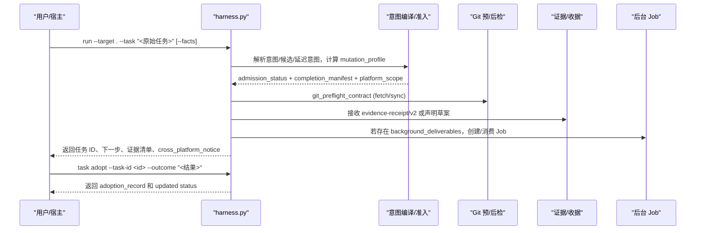

图表来源 
- [harness.py](file://scripts/harness.py)
- [contracts.md](file://docs/contracts.md)

## 详细组件分析

### 任务生命周期与状态转换
- 阶段：创建 → 准入 → 上下文/授权 → 执行 → 证据收集 → 验收 → 完成/取消/失败/阻塞。
- 准入状态：blocked、needs_plan、needs_authorization、ready_direct、ready_planned、ready_extended。
- 终态：complete、cancelled、failed、blocked（阻塞需重新准入）。
- 幂等复用：同一 target、归一化任务文本、事实指纹与工作区快照命中活动任务时复用，避免重复建立上下文与授权。
- **新增** 外部采用：任务可通过 `task adopt` 命令被外部完成，设置 `verification_status=adopted_external` 和 `adoption_record`。

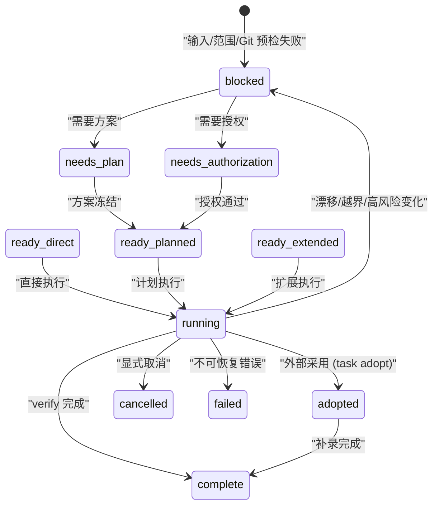

图表来源 
- [contracts.md](file://docs/contracts.md)
- [harness.py](file://scripts/harness.py)

章节来源
- [contracts.md](file://docs/contracts.md)
- [SKILL.md](file://SKILL.md)

### 意图编译过程
- 任务意图：query、audit、git_inspect、git_fetch、git_sync、modify、external_write。
- 候选意图：混合意图保留全部 candidate_intents；未来子句进入 deferred_intents；完成体仅作为审查上下文。
- 变更面：read_only、git_metadata_write、workspace_write、external_write；取最高变更面。
- Gate 推断：基于关键词与路径分词，安全底线 Gate（security-sensitive、destructive-data、release-external）强制兜底，宿主可通过 gate_assessment 权威声明。
- **新增** 平台范围检测：detect_platform_scope() 函数检测平台特定文件扩展名，生成 platform_scope 信息。

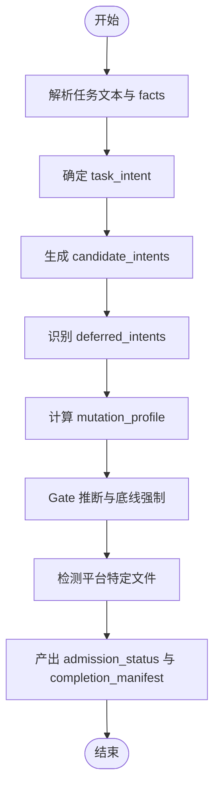

图表来源 
- [harness.py](file://scripts/harness.py)
- [contracts.md](file://docs/contracts.md)

章节来源
- [harness.py](file://scripts/harness.py)
- [contracts.md](file://docs/contracts.md)

### 跨平台任务感知
**新增功能** 系统现在能够自动检测任务涉及的平台特定文件，并提供相应的验证层信息。

- 平台特定扩展名映射：`.ps1/.bat/.cmd` → windows，`.sh/.bash/.zsh` → unix
- 跨平台检测：当检测到多个平台文件或当前平台与目标平台不一致时标记为跨平台
- 验证层构建：为每个检测到的平台生成独立的验证层，状态为 `executable` 或 `pending_verification`
- 响应通知：在 run 响应中包含 `cross_platform_notice` 字段，提示用户需要在目标平台补验

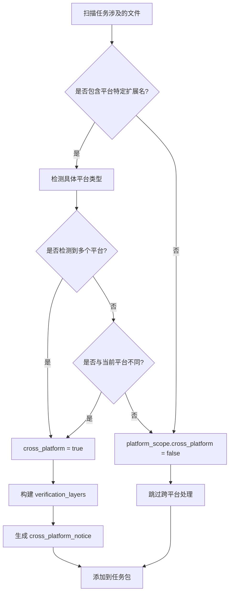

图表来源 
- [harness.py](file://scripts/harness.py)

章节来源
- [harness.py](file://scripts/harness.py)

### 外部任务采用工作流
**新增功能** 支持对已在外部完成的任务进行补录和状态同步。

- 采用命令：`task adopt --task-id <id> --outcome "<结果>" [--bypass-reason <原因>]`
- 采用记录：生成 `docs-harness/task-adoption/v1` 格式的 adoption_record
- 状态更新：将任务状态设置为 `complete`，verification_status 设置为 `adopted_external`
- 证据引用：支持外部证据文件的引用和管理
- 限制条件：终态任务（complete/cancelled/failed）不允许再次采用

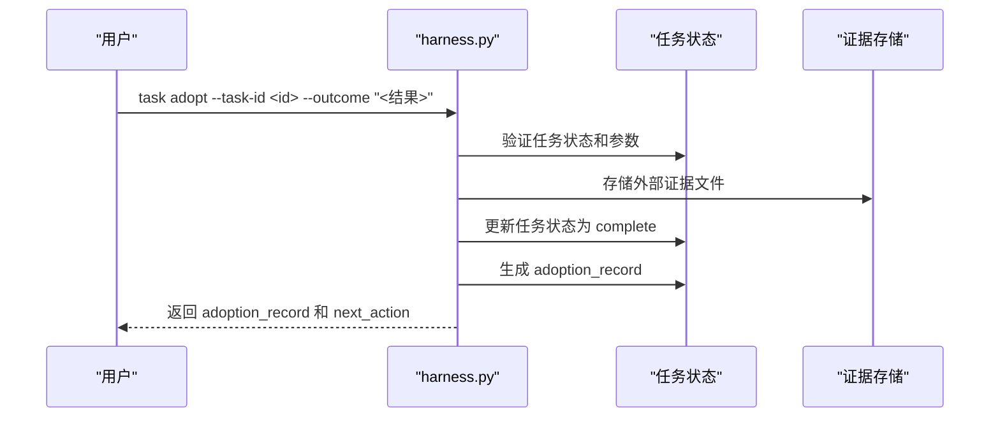

图表来源 
- [harness.py](file://scripts/harness.py)

章节来源
- [harness.py](file://scripts/harness.py)

### 范围评估与授权机制
- write_scope：只接受项目内相对路径、glob 或受控 Git 资源；自然语言边界拒绝。
- read_scope：用于结论的路径/受控资源与读取指纹。
- 授权收据：authorization-receipt/v2，绑定当前 package fingerprint，跨修订不复用。
- 自动归因：write_scope 内未归因写入默认由控制器代铸 workspace_attribution 收据并继续 verify，可配置关闭。

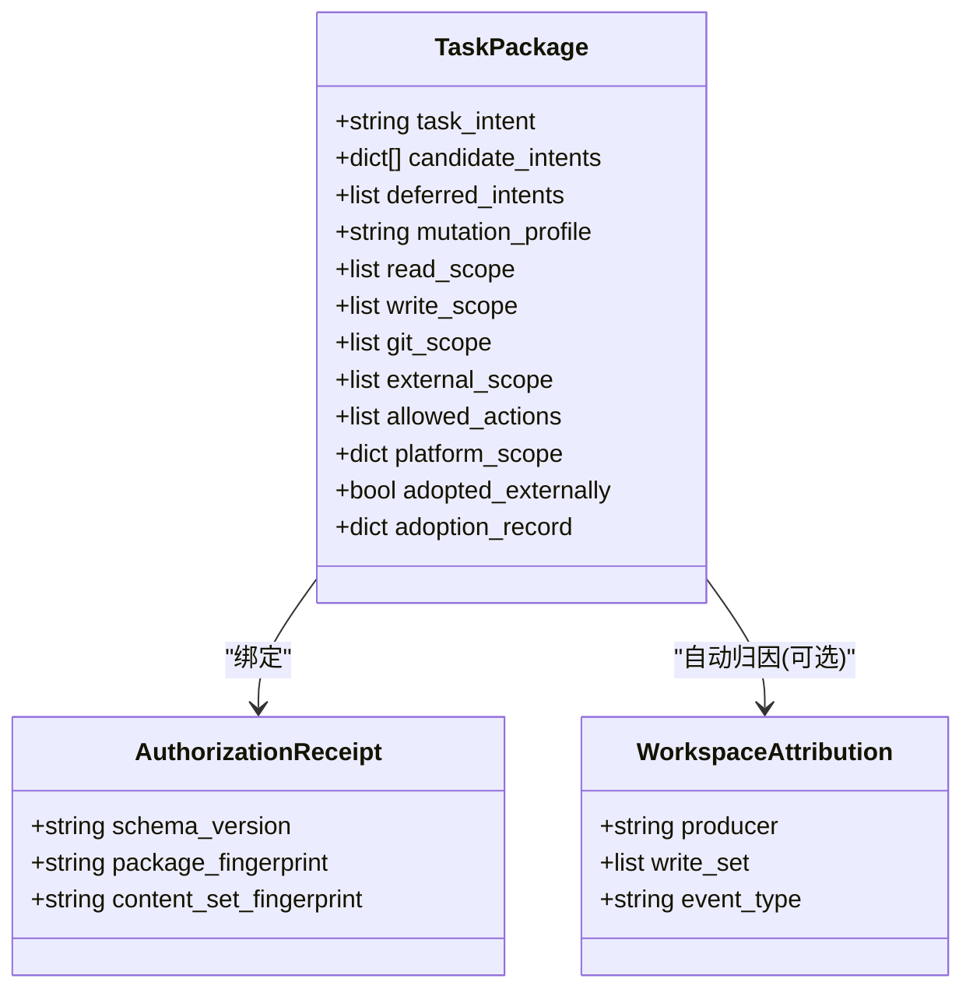

图表来源 
- [contracts.md](file://docs/contracts.md)
- [harness.py](file://scripts/harness.py)

章节来源
- [contracts.md](file://docs/contracts.md)
- [harness.py](file://scripts/harness.py)

### Git 交付层与状态合同
- git_inspect：只读，无需逐文件写入范围。
- git_fetch：仅允许声明的远端 refs/objects 变化，HEAD、索引与工作区必须不变。
- git_sync：绑定单一预检 OID，自动生成新增/修改/删除/重命名范围；非 fast-forward、脏工作区重叠、危险删除、LFS/Submodule 不可验证均失败关闭。
- 远端漂移：run --task-id 单命令完成重新准入并复用已冻结方案；pull 落盘文件经 git_sync_landed_scope 自动归因。

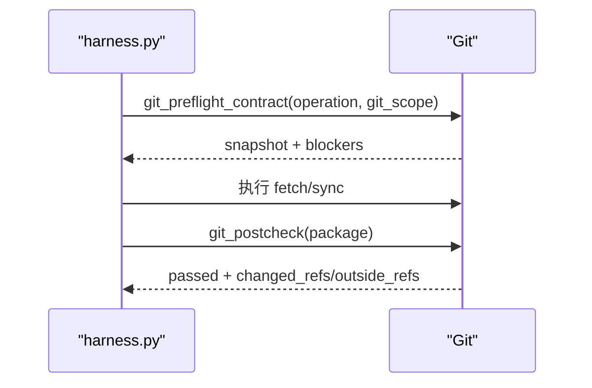

图表来源 
- [harness.py](file://scripts/harness.py)
- [contracts.md](file://docs/contracts.md)

章节来源
- [harness.py](file://scripts/harness.py)
- [contracts.md](file://docs/contracts.md)

### 证据与收据
- evidence-receipt/v2：必填绑定字段包括 task_id、target_identity、package_fingerprint、producer、command_argv_digest、cwd、起止时间、ttl、exit_code、digests、read_set/write_set。
- verification-command-receipt/v1：逐项收据，输入指纹缓存，通过则复用，失败或输入变化重跑。
- 临时副产物容忍：__pycache__、*.cache、*.log 等新建不计入额外写入；同名已有文件修改或删除仍阻断。
- 自动归因：write_scope 内未归因写入默认代铸 workspace_attribution 收据并继续 verify。

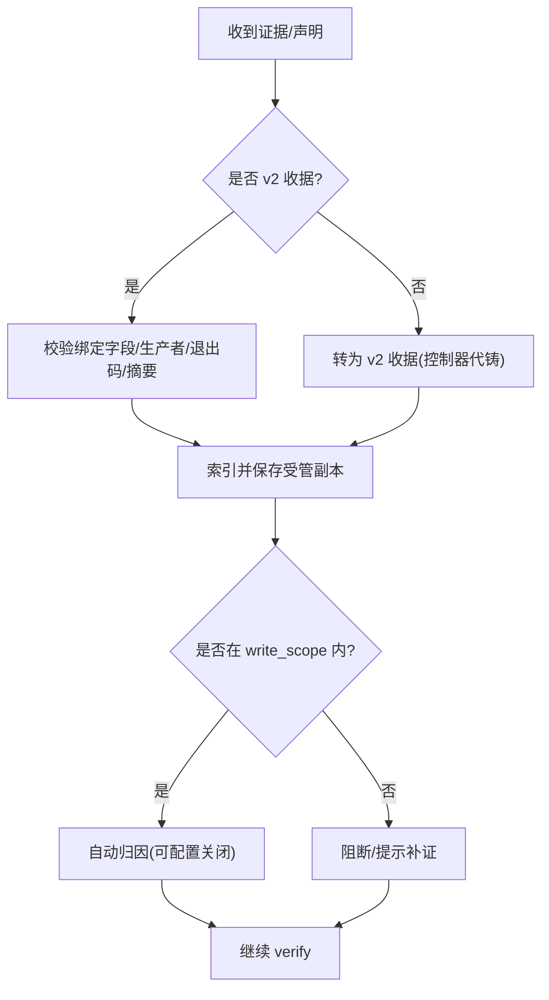

图表来源 
- [contracts.md](file://docs/contracts.md)
- [harness.py](file://scripts/harness.py)

章节来源
- [contracts.md](file://docs/contracts.md)
- [SKILL.md](file://SKILL.md)

### 后台治理（Background Jobs）
- 路线：background_direct、background_goal、background_goal_phased。
- 标准序列：contract_ready → prepare → dispatched → running → progress（多次）→ verify → 终态。
- 约束：may_mutate_parent=false、may_spawn_child_jobs=false、suppress_post_completion_dispatch=true；控制面只由 CLI 写入。
- 知识 Job：bootstrap/incremental sync/delivery governance/critical followup，共享 knowledge_flow 与就绪条件。

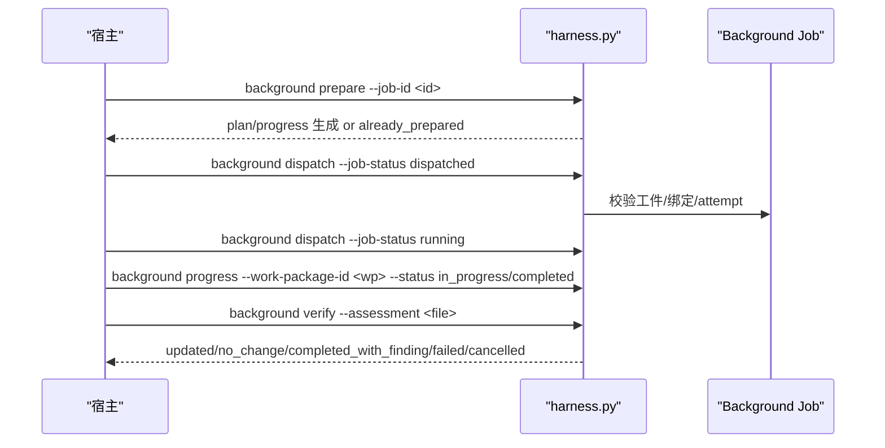

图表来源 
- [contracts.md](file://docs/contracts.md)
- [SKILL.md](file://SKILL.md)

章节来源
- [contracts.md](file://docs/contracts.md)
- [SKILL.md](file://SKILL.md)

### 规则与 Gate
- 生效规则：按 active_rules 列表加载，需 status: active、唯一 rule_id、正文指纹正确、合同字段完整。
- Gate 集合：product-change、architecture-contract、security-sensitive、destructive-data、release-external、frontend-design、diagnosis-fix、testing-acceptance、review-audit、code-edit、document-edit。
- 规则示例：API 兼容、外部输入安全、测试放行、范围变化重新判断等。

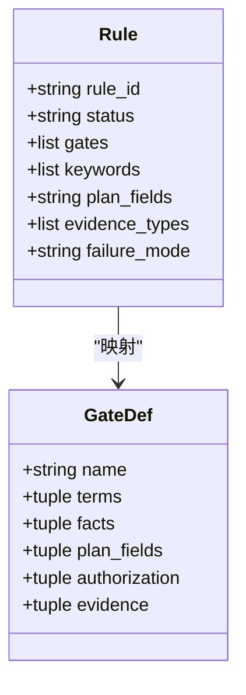

图表来源 
- [INDEX.md](file://harness-home/rules/INDEX.md)
- [api-compatibility.md](file://harness-home/rules/api-compatibility.md)
- [external-input-security.md](file://harness-home/rules/external-input-security.md)
- [testing-release.md](file://harness-home/rules/testing-release.md)
- [scope-change-readmission.md](file://harness-home/rules/scope-change-readmission.md)
- [harness.py](file://scripts/harness.py)

章节来源
- [INDEX.md](file://harness-home/rules/INDEX.md)
- [harness.py](file://scripts/harness.py)

## 依赖关系分析
- CLI 依赖：JSON/文件系统/Git 子进程/哈希/正则/路径工具。
- 合同依赖：task-package、evidence-receipt、verification-command-receipt、completion-manifest、background-job 等。
- 规则依赖：active_rules 列表与指纹一致性，缺失或漂移失败关闭。
- 测试依赖：unittest、subprocess、mock，覆盖安装、准入、Git、验证、后台 Job。

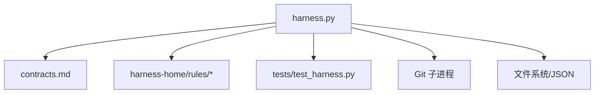

图表来源 
- [harness.py](file://scripts/harness.py)
- [contracts.md](file://docs/contracts.md)
- [INDEX.md](file://harness-home/rules/INDEX.md)
- [test_harness.py](file://tests/test_harness.py)

章节来源
- [harness.py](file://scripts/harness.py)
- [contracts.md](file://docs/contracts.md)

## 性能与幂等性
- 活动任务幂等：active_task_key = sha256(target_identity + task_snapshot_ref + normalized facts fingerprint + initial workspace snapshot fingerprint)。相同 key 的非终态任务复用，--new-task 强制新建。
- 验证命令缓存：verification-command-receipt/v1 逐项缓存，输入不变则复用，失败或输入变化重跑。
- 上下文与授权复用：stage 隔离但内容指纹一致可复用；authorization 绑定 package fingerprint 不复用跨修订。
- 增量准入：普通 Gate 追加且合同稳定时，原子增量准入并继承同轮证据，避免完整重新准入。
- **新增** 外部采用幂等：相同的 task_id 和 outcome 组合产生幂等的采用结果，防止重复补录。

章节来源
- [v1.6.4-minimal-systemic-flow-efficiency-plan.md](file://docs/plans/v1.6.4-minimal-systemic-flow-efficiency-plan.md)
- [contracts.md](file://docs/contracts.md)
- [SKILL.md](file://SKILL.md)

## 故障排查指南
- 常见退出码：0 成功；1 项目检查/自检失败；2 输入/合同/状态无效；3 需要方案/授权/证据/迁移/用户输入/Git 交付；4 范围/漂移/Gate/远端/授权/规则变化需重新准入。
- Git 预检失败：脏工作区、非 fast-forward、LFS/Submodule 不可用、删除数量超限、远端对象缺失等。
- 证据问题：过期、跨任务/目标、不可信生产者、非零退出、摘要无效、越界写入。
- 后台 Job：prepare 缺失工件、progress 非法状态转换、verify 工件漂移、retry 归档旧 attempt。
- **新增** 跨平台问题：检测到跨平台文件但当前平台无法执行相关验证，需要在目标平台补验。
- **新增** 外部采用问题：终态任务不允许再次采用，缺少必要的 outcome 参数会被拒绝。

章节来源
- [contracts.md](file://docs/contracts.md)
- [harness.py](file://scripts/harness.py)
- [test_harness.py](file://tests/test_harness.py)

## 结论
Docs Harness 通过严格的意图编译、Gate 与范围授权、证据与收据体系、以及后台治理流程，实现了高可信、可审计、幂等的任务管理。其设计强调失败关闭与最小必要变更，确保在复杂协作环境中保持可控与可追溯。

**更新** 新增的外部任务采用工作流和跨平台任务感知功能进一步增强了系统的灵活性和适应性，支持更复杂的实际使用场景，包括外部完成任务的补录和多平台环境的验证需求。

## 附录：CLI 命令参考与 JSON 接口规范

### CLI 命令参考
- 项目初始化与升级
  - project init --target <project> --json
  - project upgrade --apply --json
- 任务入口与上下文
  - run --target . --task "<原始用户任务>" [--facts <facts.json>] [--scope <path>] [--feature <id>] [--new-task] --json
  - context --target . --task-id <task-id> --stage action|plan --json
- 验收与证据
  - verify --target . --task-id <task-id> [--evidence <evidence.json>] --json
- **新增** 外部任务采用
  - task adopt --target . --task-id <task-id> --outcome "<结果>" [--bypass-reason <原因>] --json
- 后台治理
  - background list --target . --json
  - background status --target . --job-id <job-id> --json
  - background prepare --target . --job-id <job-id> --json
  - background dispatch --target . --job-id <job-id> --job-status dispatched|running --json
  - background progress --target . --job-id <job-id> --work-package-id <wp-id> --work-package-status in_progress|completed --json
  - background verify --target . --job-id <job-id> --assessment <file> --json
  - background retry --target . --job-id <job-id> --json
- 质量账本
  - ledger add --target . --task-id <task-id> --review <review.json> --json
- 任务处置与清理
  - task cancel --task-id <id> --reason-code <code> [--apply] --json
  - task prune --target . --older-than <days> [--dry-run|--apply] --json

章节来源
- [SKILL.md](file://SKILL.md)
- [contracts.md](file://docs/contracts.md)

### JSON 接口规范（节选）
- task-package/v2
  - 关键字段：task_intent、candidate_intents、deferred_intents、intent_boundary_reason_codes、mutation_profile、read_scope、write_scope、git_scope、external_scope、allowed_actions
  - **新增字段**：platform_scope（包含 detected_platforms、current_platform、cross_platform、verification_layers）、adopted_externally、adoption_record
- completion-manifest/v1
  - 关键字段：manifest_fingerprint、required_evidence_types、required_receipts、conditional_reviews、conditional_evidence、verification_commands、completion_blockers、completion_protocol
- evidence-receipt/v2
  - 关键字段：schema_version、id、type、result、covers、task_id、target_identity、package_fingerprint、content_set_fingerprint、producer、command_argv_digest、cwd、started_at、ended_at、ttl、exit_code、output_or_artifact_digest、changed_paths、read_set、write_set、concurrent_drift、conclusion
- verification-command-receipt/v1
  - 关键字段：argv、produces、input_fingerprint、cache_hit、exit_code、artifact_digest
- background-job/v2
  - 关键字段：job_id、execution_route、goal_contract、work_packages、host_dispatch_contract、attempt、plan/progress/events（控制面只由 CLI 写入）
- **新增** task-adoption/v1
  - 关键字段：schema_version、task_id、adopted_at、adopted_by、original_package_fingerprint、bypass_reason、outcome_summary、external_evidence_refs、verification_status

章节来源
- [contracts.md](file://docs/contracts.md)
- [SKILL.md](file://SKILL.md)

### 使用示例
- 新项目安装与知识引导
  - python3 scripts/harness.py project init --target . --json
  - 根据返回的 knowledge_next_action 执行 bootstrap_knowledge_base 或 audit_existing_docs
- 代码修改任务
  - python3 scripts/harness.py run --target . --task "实现项目核心 src/core.py" --scope src/core.py --json
  - 完成后提交证据 test_result，再调用 verify 获取完成结果
- Git 同步任务
  - 提交 facts 指定 git_scope，run 后按提示提交方案，执行 git merge 后再 verify
- **新增** 跨平台任务处理
  - 对于包含 `.ps1` 或 `.sh` 文件的任务，系统会自动检测并返回 cross_platform_notice
  - 在不同平台上运行时需要分别验证对应平台的特定文件
- **新增** 外部任务采用
  - 对于已在外部完成的任务，使用 `task adopt` 命令进行补录
  - 需要提供完整的 outcome 描述和可选的 bypass_reason

章节来源
- [SKILL.md](file://SKILL.md)
- [test_harness.py](file://tests/test_harness.py)