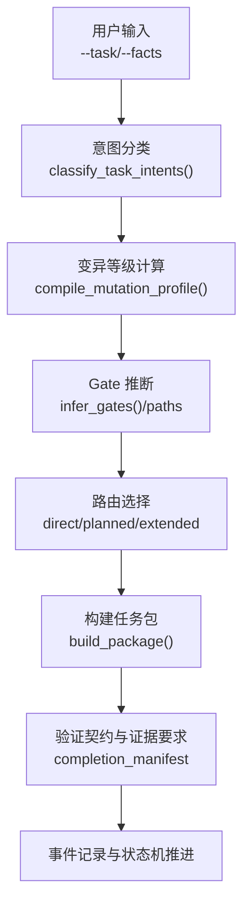
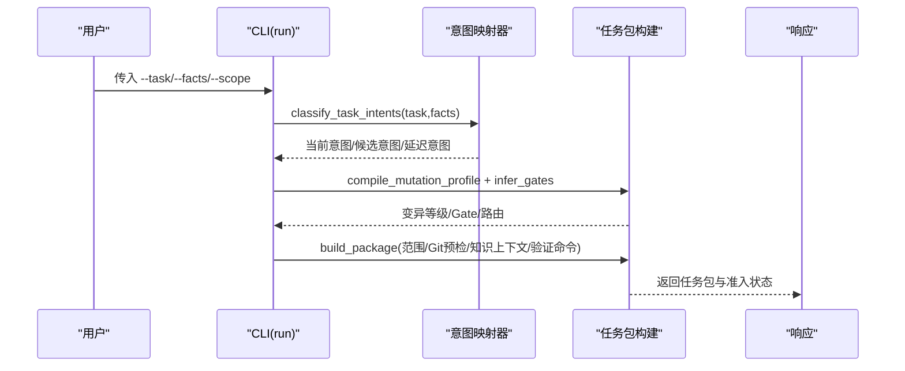
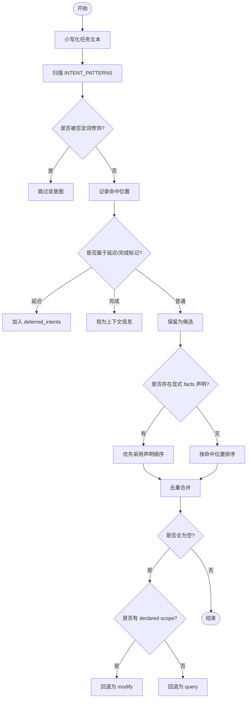
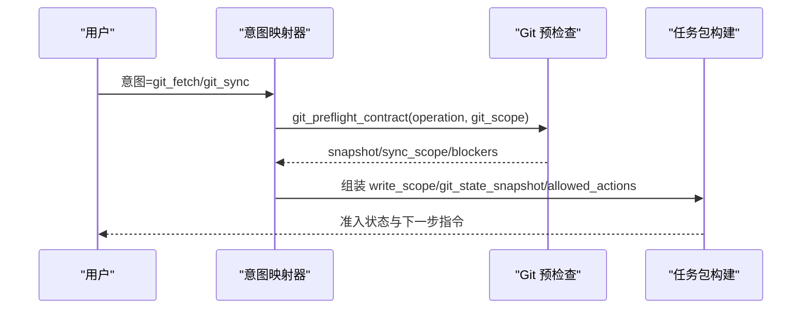
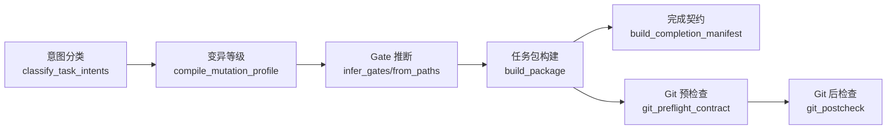

# 意图映射器

<cite>
**本文引用的文件**   
- [scripts/harness.py](file://scripts/harness.py)
- [tests/test_harness.py](file://tests/test_harness.py)
- [SKILL.md](file://SKILL.md)
</cite>

## 目录
1. [简介](#简介)
2. [项目结构](#项目结构)
3. [核心组件](#核心组件)
4. [架构总览](#架构总览)
5. [详细组件分析](#详细组件分析)
6. [依赖关系分析](#依赖关系分析)
7. [性能考量](#性能考量)
8. [故障排查指南](#故障排查指南)
9. [结论](#结论)
10. [附录](#附录)

## 简介
本文件为 Docs Harness 的“意图映射器”提供系统化、可操作的文档。内容涵盖：
- 意图与任务类型的映射关系（预定义规则与动态推断）
- 四类意图的处理流程（查询类、审计类、Git 操作类、后台任务类）
- 映射优先级策略（精确匹配、模糊匹配、默认回退）
- 映射配置结构与语法（条件映射、参数转换、输出格式化）
- 实际使用示例与错误诊断方法

该能力由独立控制器脚本实现，贯穿 run/verify 等入口，确保任务在准入、执行、验收各阶段具备一致且可审计的语义边界。

## 项目结构
- 核心逻辑集中在单一脚本中，负责意图分类、范围校验、Gate 推断、路由选择、验证契约与事件记录。
- 测试用例覆盖典型场景（只读查询、Git inspect/fetch/sync、混合意图、否定句处理等）。
- SKILL 文档描述整体工作流与 CLI 用法，强调 run 先编译意图与候选意图，再进入执行；verify 支持多级处置与增量准入。

**图表来源** 
- [scripts/harness.py:2311-2385](file://scripts/harness.py#L2311-L2385)
- [scripts/harness.py:2393-2415](file://scripts/harness.py#L2393-L2415)
- [scripts/harness.py:2770-3066](file://scripts/harness.py#L2770-L3066)

**章节来源**
- [scripts/harness.py:200-233](file://scripts/harness.py#L200-L233)
- [scripts/harness.py:2311-2385](file://scripts/harness.py#L2311-L2385)
- [scripts/harness.py:2770-3066](file://scripts/harness.py#L2770-L3066)
- [SKILL.md:25-43](file://SKILL.md#L25-L43)

## 核心组件
- 意图枚举与模式库
  - TASK_INTENTS：支持的意图集合（query、audit、git_inspect、git_fetch、git_sync、modify、external_write）。
  - INTENT_PATTERNS：每个意图对应的关键词/短语集合，用于模糊匹配。
  - INTENT_MUTATION：意图到变异等级的映射（read_only、git_metadata_write、workspace_write、external_write）。
- 意图分类器
  - classify_task_intents(task, facts, has_declared_scope)：基于文本模式匹配、显式 facts 声明、否定词与未来/完成标记，输出当前意图、延迟意图与原因码。
  - infer_task_intents：对 classify 结果的简化封装。
- 变异等级与动作集
  - compile_mutation_profile：合并推断与声明的最高等级。
  - build_package：综合范围、Git 预检查、Gate、知识上下文、验证命令等，生成任务包与准入状态。
- Gate 推断
  - infer_gates：基于任务文本与路径特征推断 Gate，受 mutation_profile 约束。
  - infer_gates_from_paths：按路径后缀、目录名、文件名启发式推断 Gate。
- 完成契约与证据
  - build_completion_manifest：根据意图、变异等级与 Gate 生成必需收据、条件证据与验证命令清单。

**章节来源**
- [scripts/harness.py:200-233](file://scripts/harness.py#L200-L233)
- [scripts/harness.py:2311-2385](file://scripts/harness.py#L2311-L2385)
- [scripts/harness.py:2393-2415](file://scripts/harness.py#L2393-L2415)
- [scripts/harness.py:2770-3066](file://scripts/harness.py#L2770-L3066)
- [scripts/harness.py:2702-2742](file://scripts/harness.py#L2702-L2742)

## 架构总览
意图映射器位于 run 流程的前置阶段，承担“语义解析→安全边界→执行路线”的三重职责。其输入来自 CLI 与 --facts，输出为任务包（包含 task_intent、candidate_intents、mutation_profile、execution_route、allowed_actions、semantic_evidence_requirements 等），并驱动后续 context/verify 阶段。

**图表来源** 
- [scripts/harness.py:2311-2385](file://scripts/harness.py#L2311-L2385)
- [scripts/harness.py:2770-3066](file://scripts/harness.py#L2770-L3066)

## 详细组件分析

### 意图分类与优先级策略
- 精确匹配优先：若 facts.task_intent 或 facts.candidate_intents 显式声明，则优先采用。
- 模糊匹配：遍历 INTENT_PATTERNS，统计命中位置，结合否定词（不/不要/禁止/不会/无需/不得/不进行/不执行/不允许/do not/don't）过滤误报。
- 延迟与完成标记：对 modify/external_write/git_sync 意图，若前缀出现“后续/以后/后面/另行/单独/另开任务/下一任务”，则归入 deferred_intents；若出现“已经/此前/上次/曾经/已完成”，则作为上下文信息。
- 默认回退：若无任何匹配，且有 declared scope 则回退为 modify，否则回退为 query。
- 只读问题降级：当存在“是否/能否/可否/要不要/有没有必要…删除/修改/修复/合并”的疑问句式且无明确后续写入时，剔除 modify。

**图表来源** 
- [scripts/harness.py:2311-2385](file://scripts/harness.py#L2311-L2385)

**章节来源**
- [scripts/harness.py:2311-2385](file://scripts/harness.py#L2311-L2385)

### 四类意图的处理流程

#### 查询类（query）
- 变异等级：read_only
- 允许动作：read
- 证据要求：source_trace
- 典型行为：读取项目事实、知识地图、文档与代码片段，不产生工作区变更。
- 常见触发词：在哪/定位/解释/比较/查询/查找/查看/列出/说明/where/explain/locate/find/list

**章节来源**
- [scripts/harness.py:200-233](file://scripts/harness.py#L200-L233)
- [scripts/harness.py:2932-2941](file://scripts/harness.py#L2932-L2941)

#### 审计类（audit）
- 变异等级：read_only
- 允许动作：read
- 证据要求：source_trace
- 典型行为：审查分支是否可删除、评审历史、审计变更影响范围等只读分析。
- 常见触发词：审计/审查/评审/review/audit

**章节来源**
- [scripts/harness.py:200-233](file://scripts/harness.py#L200-L233)
- [scripts/harness.py:2932-2941](file://scripts/harness.py#L2932-L2941)

#### Git 操作类（git_inspect / git_fetch / git_sync）
- git_inspect
  - 变异等级：read_only
  - 允许动作：git_inspect
  - 证据要求：git_inspection_result
  - 典型行为：git status/log/show/diff、ls-remote、检查分支等只读操作。
- git_fetch
  - 变异等级：git_metadata_write
  - 允许动作：read、git_fetch
  - 证据要求：git_fetch_result
  - 典型行为：获取远端引用/对象，需通过 git_preflight_contract 校验 LFS/Submodule 与 ref 范围。
- git_sync
  - 变异等级：workspace_write
  - 允许动作：git_fetch、git_sync
  - 证据要求：git_sync_result
  - 典型行为：同步远端分支，需 fast-forward、无脏工作区重叠、删除数量阈值限制等预检查。

**图表来源** 
- [scripts/harness.py:2770-3066](file://scripts/harness.py#L2770-L3066)
- [scripts/harness.py:680-794](file://scripts/harness.py#L680-L794)

**章节来源**
- [scripts/harness.py:200-233](file://scripts/harness.py#L200-L233)
- [scripts/harness.py:2932-2941](file://scripts/harness.py#L2932-L2941)
- [scripts/harness.py:680-794](file://scripts/harness.py#L680-L794)

#### 后台任务类（background_*）
- 背景：run 流程会识别 execution_route 与 work_packages，决定 direct/planned/extended 路由。
- 复杂路线：background_goal/background_goal_phased 需要 prepare/dispatched/running 与进度验收。
- 控制面：仅 CLI 可写入 job.json/plan.json/progress.json/events.jsonl，业务数据面仅能写合同声明范围。
- 终态：updated/no_change/completed_with_finding/failed/cancelled 等状态约束严格。

**章节来源**
- [SKILL.md:59-89](file://SKILL.md#L59-L89)
- [scripts/harness.py:2770-3066](file://scripts/harness.py#L2770-L3066)

### 映射配置文件结构与语法
- 输入来源
  - --facts JSON 文件：支持 task_intent、candidate_intents、mutation_profile、gates、gate_assessment、write_scope/read_scope/git_scope/external_scope、verification_commands 等字段。
  - CLI 参数：--scope、--action、--success、--feature 等。
- 关键字段
  - task_intent：主意图（字符串，限定于 TASK_INTENTS）。
  - candidate_intents：候选意图数组（字符串或对象 {intent, ...}）。
  - mutation_profile：变异等级（read_only/git_metadata_write/workspace_write/external_write）。
  - gates/gate_assessment：Gate 声明与理由（权威模式优先，安全底线强制兜底）。
  - verification_commands：验证命令规范（argv/produces）。
- 条件映射
  - 基于否定词与从句前缀进行延迟/完成判定。
  - 基于路径后缀/目录名启发式推断 Gate。
- 参数转换
  - normalize_string_list/validate_scope/normalize_verification_spec 等函数保证类型与格式正确性。
- 输出格式化
  - build_completion_manifest 生成 completion_manifest 指纹与必需收据/条件证据/验证命令清单。

**章节来源**
- [scripts/harness.py:2770-3066](file://scripts/harness.py#L2770-L3066)
- [scripts/harness.py:2702-2742](file://scripts/harness.py#L2702-L2742)
- [scripts/harness.py:1247-1256](file://scripts/harness.py#L1247-L1256)
- [scripts/harness.py:1259-1264](file://scripts/harness.py#L1259-L1264)
- [scripts/harness.py:2491-2509](file://scripts/harness.py#L2491-L2509)

### 实际使用示例（配置复杂映射规则）
- 只读查询
  - 输入：--task "项目文档在哪，请解释现有内容"
  - 预期：task_intent=query，mutation_profile=read_only，admission_status=ready_direct
- 审计分支删除
  - 输入：--task "审计 feature 分支是否可删除"
  - 预期：task_intent=audit，mutation_profile=read_only，candidate_intents 含 git_inspect
- 混合意图（fetch+sync）
  - 输入：--task "先 git fetch，再同步远端"，--facts {"git_scope":["..."]}
  - 预期：task_intent=git_fetch，mutation_profile=workspace_write，candidate_intents={git_fetch, git_sync}
- 否定句不升级
  - 输入：--task "查询远端状态，不推送，也不要修改文件"
  - 预期：task_intent=query，mutation_profile=read_only，candidate_intents 不含 external_write/modify

以上断言可由测试用例验证，便于回归与自测。

**章节来源**
- [tests/test_harness.py:429-448](file://tests/test_harness.py#L429-L448)
- [tests/test_harness.py:449-464](file://tests/test_harness.py#L449-L464)
- [tests/test_harness.py:758-779](file://tests/test_harness.py#L758-L779)
- [tests/test_harness.py:781-794](file://tests/test_harness.py#L781-L794)

## 依赖关系分析
- 模块内依赖
  - classify_task_intents 依赖 INTENT_PATTERNS、TASK_INTENTS、INTENT_MUTATION。
  - build_package 依赖 validate_scope、infer_gates/infer_gates_from_paths、git_preflight_contract、project_config、resolve_feature_knowledge、load_active_rules、compile_plan_contract、build_completion_manifest。
- 外部依赖
  - Git 子进程调用（git_command、git_preflight_contract、git_postcheck）。
  - 文件系统读写（JSON/JSONL、原子写入、快照指纹）。
- 耦合与内聚
  - 意图分类与变异等级计算高度内聚；与 Gate 推断、路由选择解耦清晰。
  - Git 预检查与后检查形成闭环，保障一致性。

**图表来源** 
- [scripts/harness.py:2311-2385](file://scripts/harness.py#L2311-L2385)
- [scripts/harness.py:2393-2415](file://scripts/harness.py#L2393-L2415)
- [scripts/harness.py:2770-3066](file://scripts/harness.py#L2770-L3066)
- [scripts/harness.py:680-794](file://scripts/harness.py#L680-L794)
- [scripts/harness.py:796-878](file://scripts/harness.py#L796-L878)

**章节来源**
- [scripts/harness.py:2311-2385](file://scripts/harness.py#L2311-L2385)
- [scripts/harness.py:2770-3066](file://scripts/harness.py#L2770-L3066)

## 性能考量
- 文本匹配复杂度：O(N×M)，N 为任务长度，M 为模式总数；可通过精简模式与缓存降低开销。
- Git 预检查：多次子进程调用（ls-remote、diff、merge-base、status、lfs/submodule），建议批量与超时控制。
- 工作区快照：非 Git 工作区下文件数上限保护，避免超大目录导致阻塞。
- 验证命令缓存：默认开启，可按需关闭以规避缓存失效风险。

[本节为通用指导，不直接分析具体文件]

## 故障排查指南
- 常见错误码与含义
  - invalid_task_intent：task_intent 或 candidate_intents 中的 intent 不在 TASK_INTENTS。
  - invalid_scope_description：scope 包含自然语言描述而非结构化路径。
  - invalid_git_scope：git_scope 远端引用格式无效或缺少 refs/remotes/*。
  - git_remote_drift：远端目标对象漂移，verify 失败。
  - state_locked/stale_lock：状态锁冲突或陈旧锁。
  - invalid_json/missing_file：JSON 无效或文件缺失。
- 定位步骤
  - 检查 --facts 字段类型与取值范围（字符串数组、相对路径、受控资源）。
  - 确认 Git 环境可用（LFS/Submodule）、远端可达、ref 合法。
  - 查看 events.jsonl 与 reason_code，定位阻断点。
  - 对于 git_sync，检查脏工作区、fast-forward、删除数量阈值。
- 解决建议
  - 修正 scope 为项目内相对路径或 .git:refs/remotes/* 受控资源。
  - 清理工作区或调整 git_scope 为单一远端分支。
  - 增加必要的 gate_assessment 与 rationale，确保安全底线不被绕过。
  - 必要时禁用验证命令缓存或重新准备后台 Job。

**章节来源**
- [scripts/harness.py:2491-2509](file://scripts/harness.py#L2491-L2509)
- [scripts/harness.py:680-794](file://scripts/harness.py#L680-L794)
- [scripts/harness.py:796-878](file://scripts/harness.py#L796-L878)
- [scripts/harness.py:1011-1032](file://scripts/harness.py#L1011-L1032)

## 结论
Docs Harness 的意图映射器通过“模式匹配+显式声明+否定/延迟标记”的多层机制，将自然语言任务转化为可执行的、带安全边界的任务包。其设计兼顾灵活性与可控性：既支持丰富的模糊匹配，又通过 Gate、范围与验证契约确保高风险操作的可审计与可恢复。配合完善的测试与日志，可在复杂工程环境中稳定运行。

[本节为总结，不直接分析具体文件]

## 附录
- 关键常量与映射
  - TASK_INTENTS、INTENT_PATTERNS、INTENT_MUTATION、DELIVERY_READ_ONLY_INTENTS、BACKGROUND_TASK_KINDS 等。
- 重要函数
  - classify_task_intents、compile_mutation_profile、infer_gates、build_package、build_completion_manifest、git_preflight_contract、git_postcheck。
- 参考文档
  - SKILL.md 描述了 run/verify 的整体流程与最佳实践。

**章节来源**
- [scripts/harness.py:200-233](file://scripts/harness.py#L200-L233)
- [scripts/harness.py:2311-2385](file://scripts/harness.py#L2311-L2385)
- [scripts/harness.py:2770-3066](file://scripts/harness.py#L2770-L3066)
- [SKILL.md:25-43](file://SKILL.md#L25-L43)