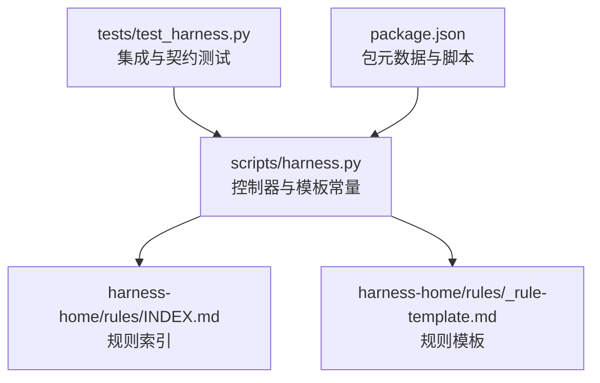
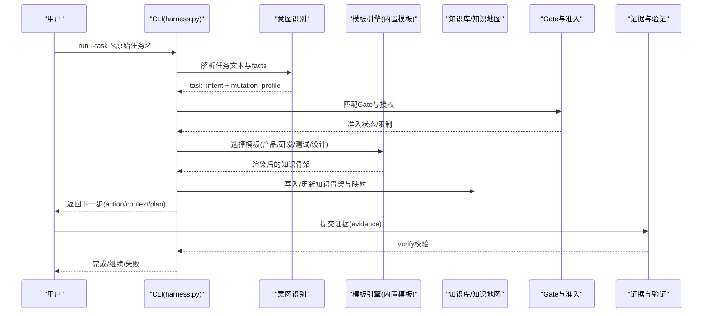
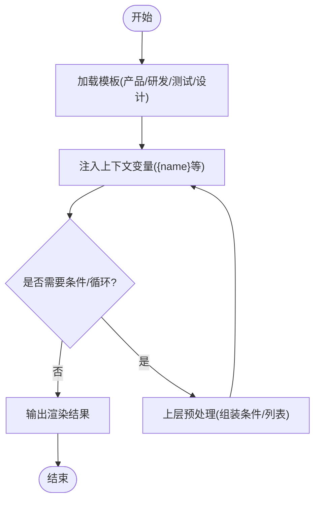
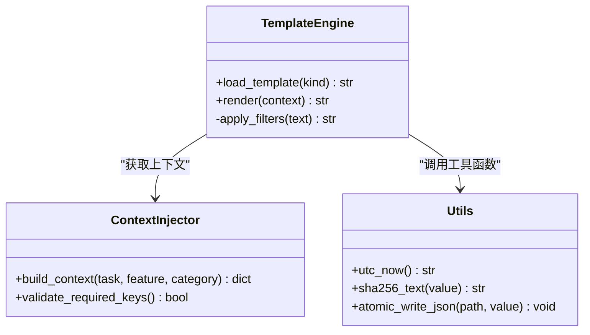
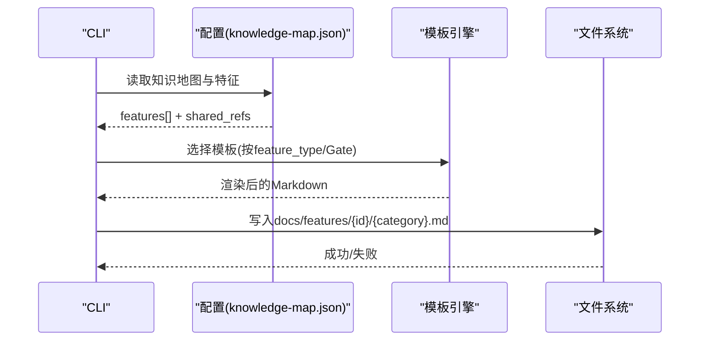
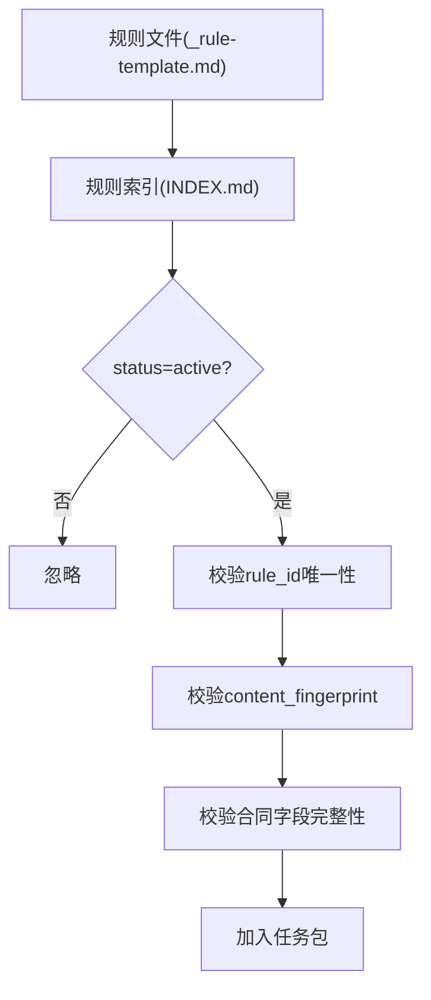
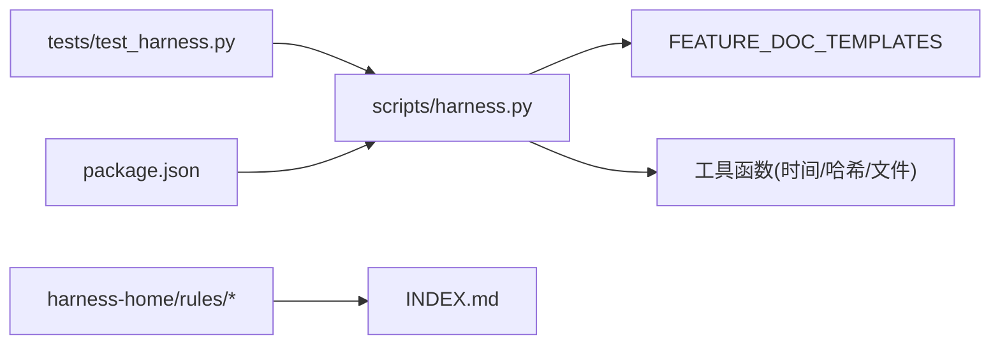

# 意图模板系统

<cite>
**本文引用的文件**
- [scripts/harness.py](file://scripts/harness.py)
- [tests/test_harness.py](file://tests/test_harness.py)
- [harness-home/rules/INDEX.md](file://harness-home/rules/INDEX.md)
- [harness-home/rules/_rule-template.md](file://harness-home/rules/_rule-template.md)
- [package.json](file://package.json)
</cite>

## 目录
1. [简介](#简介)
2. [项目结构](#项目结构)
3. [核心组件](#核心组件)
4. [架构总览](#架构总览)
5. [详细组件分析](#详细组件分析)
6. [依赖关系分析](#依赖关系分析)
7. [性能考量](#性能考量)
8. [故障排查指南](#故障排查指南)
9. [结论](#结论)
10. [附录](#附录)

## 简介
本文件为 Docs Harness 的“意图模板系统”提供完整、可操作的文档。该系统以“意图优先”为核心，围绕任务包与知识骨架生成，使用内置模板快速产出结构化文档（产品、研发、测试、设计等），并通过严格的准入、证据与治理流程保障质量与可追溯性。本文覆盖：
- 模板语法规则（变量引用、条件判断、循环）
- 模板渲染过程（上下文注入、函数调用、过滤器）
- 内置模板库与最佳实践
- 自定义模板开发流程（文件结构、测试方法、版本管理）
- 丰富示例（从简单参数替换到复杂逻辑处理）
- 调试与性能优化技巧

## 项目结构
Docs Harness 将模板与规则、配置、测试等模块解耦，便于扩展与维护。关键位置如下：
- 脚本与控制器：scripts/harness.py
- 规则快照与索引：harness-home/rules/INDEX.md 及 _rule-template.md
- 测试套件：tests/test_harness.py
- 元数据与打包清单：package.json

**图表来源**
- [scripts/harness.py:1-120](file://scripts/harness.py#L1-L120)
- [harness-home/rules/INDEX.md:1-41](file://harness-home/rules/INDEX.md#L1-L41)
- [harness-home/rules/_rule-template.md:1-21](file://harness-home/rules/_rule-template.md#L1-L21)
- [tests/test_harness.py:1-120](file://tests/test_harness.py#L1-L120)
- [package.json:1-23](file://package.json#L1-L23)

**章节来源**
- [scripts/harness.py:1-120](file://scripts/harness.py#L1-L120)
- [package.json:1-23](file://package.json#L1-L23)

## 核心组件
- 意图识别与路由：根据用户任务文本推断意图（查询、审计、Git 操作、修改、外部写入等），并决定变更等级与许可动作。
- 知识骨架与模板：按功能维度生成产品、研发、测试、设计四类事实文档模板，支撑知识库初始化与增量同步。
- 准入与证据：基于 Gate 与证据收据进行准入控制，确保变更范围、风险与验收标准一致。
- 后台治理：支持直接目标、分阶段目标等执行路线，严格约束控制面与业务面写入边界。
- 规则体系：通过规则索引与模板驱动规则生效，保证一致性、可审计与失败关闭。

**章节来源**
- [scripts/harness.py:200-392](file://scripts/harness.py#L200-L392)
- [scripts/harness.py:356-370](file://scripts/harness.py#L356-L370)
- [harness-home/rules/INDEX.md:1-41](file://harness-home/rules/INDEX.md#L1-L41)

## 架构总览
下图展示“意图模板系统”在任务生命周期中的角色与交互：

**图表来源**
- [scripts/harness.py:200-392](file://scripts/harness.py#L200-L392)
- [scripts/harness.py:356-370](file://scripts/harness.py#L356-L370)
- [tests/test_harness.py:108-164](file://tests/test_harness.py#L108-L164)

## 详细组件分析

### 内置模板库与语法
- 模板集合：包含 product、development、testing、design 四类事实文档模板，用于知识骨架的快速生成。
- 变量引用：模板中使用占位符（如 {name}）表示待注入的变量；渲染时由上下文提供值。
- 条件判断：当前内置模板未显式包含条件分支；如需条件输出，可在上层渲染器中预处理或扩展模板引擎。
- 循环结构：当前内置模板未包含循环；如需列表化内容，建议在上下文层组装后再注入。

**图表来源**
- [scripts/harness.py:365-370](file://scripts/harness.py#L365-L370)

**章节来源**
- [scripts/harness.py:365-370](file://scripts/harness.py#L365-L370)

### 模板渲染过程
- 上下文注入：在生成知识骨架时，控制器将必要字段（如 name、类别、路径等）注入模板变量。
- 函数调用：渲染过程中可调用工具函数（如时间戳、哈希、路径处理等）以生成稳定指纹或格式化输出。
- 过滤器应用：对输出内容进行规范化（如 JSON 序列化、去敏感信息、统一编码）。

**图表来源**
- [scripts/harness.py:402-437](file://scripts/harness.py#L402-L437)
- [scripts/harness.py:365-370](file://scripts/harness.py#L365-L370)

**章节来源**
- [scripts/harness.py:402-437](file://scripts/harness.py#L402-L437)
- [scripts/harness.py:365-370](file://scripts/harness.py#L365-L370)

### 知识骨架与模板使用
- 初始化阶段：为新项目创建 docs/shared 与 docs/features 的基础结构与模板文件。
- 增量同步：根据 knowledge-map.json 与 Gate 分类动态加载相关事实文档。
- 模板选择：依据 feature_type 与 Gate 映射选择对应模板（product/development/testing/design）。

**图表来源**
- [scripts/harness.py:356-370](file://scripts/harness.py#L356-L370)
- [tests/test_harness.py:108-164](file://tests/test_harness.py#L108-L164)

**章节来源**
- [scripts/harness.py:356-370](file://scripts/harness.py#L356-L370)
- [tests/test_harness.py:108-164](file://tests/test_harness.py#L108-L164)

### 规则模板与激活机制
- 规则索引：harness-home/rules/INDEX.md 维护活跃规则清单与文件映射。
- 规则模板：_rule-template.md 定义规则文件的固定头部与结构，确保一致性。
- 激活条件：仅 status=active、规则ID唯一、指纹正确且合同字段完整的规则进入任务包。

**图表来源**
- [harness-home/rules/_rule-template.md:1-21](file://harness-home/rules/_rule-template.md#L1-L21)
- [harness-home/rules/INDEX.md:1-41](file://harness-home/rules/INDEX.md#L1-L41)

**章节来源**
- [harness-home/rules/_rule-template.md:1-21](file://harness-home/rules/_rule-template.md#L1-L21)
- [harness-home/rules/INDEX.md:1-41](file://harness-home/rules/INDEX.md#L1-L41)

### 自定义模板开发流程
- 文件结构：建议遵循现有模板命名与目录约定（docs/features/{feature_id}/{category}.md）。
- 变量规范：明确需注入的变量（name、scope、categories 等），并在上下文中提供默认值。
- 条件与循环：若需复杂逻辑，建议在渲染前由上层代码预处理上下文，再注入模板。
- 测试方法：使用 tests/test_harness.py 中的 fixture 与断言验证模板渲染结果与文件写入。
- 版本管理：模板变更需更新 content_fingerprint 并确保 INDEX.md 同步，避免运行时不一致。

**章节来源**
- [tests/test_harness.py:108-164](file://tests/test_harness.py#L108-L164)
- [harness-home/rules/INDEX.md:34-41](file://harness-home/rules/INDEX.md#L34-L41)

### 示例场景
- 简单参数替换：使用 {name} 替换为具体功能名，生成标题与基础结构。
- 多类别模板：根据 feature_type 选择 product/development/testing/design 模板，自动填充对应章节。
- 复杂逻辑处理：结合 Gate 与 categories，动态决定加载哪些共享文档与事实来源。

**章节来源**
- [scripts/harness.py:365-370](file://scripts/harness.py#L365-L370)
- [scripts/harness.py:372-382](file://scripts/harness.py#L372-L382)

## 依赖关系分析
- 控制器依赖模板常量与工具函数，负责编排上下文注入与文件写入。
- 规则系统独立于模板，但通过索引与模板结构保证一致性。
- 测试套件覆盖安装、初始化、知识骨架生成与验证流程。

**图表来源**
- [scripts/harness.py:365-370](file://scripts/harness.py#L365-L370)
- [scripts/harness.py:402-437](file://scripts/harness.py#L402-L437)
- [harness-home/rules/INDEX.md:1-41](file://harness-home/rules/INDEX.md#L1-L41)
- [tests/test_harness.py:1-120](file://tests/test_harness.py#L1-L120)
- [package.json:1-23](file://package.json#L1-L23)

**章节来源**
- [scripts/harness.py:365-370](file://scripts/harness.py#L365-L370)
- [tests/test_harness.py:1-120](file://tests/test_harness.py#L1-L120)
- [package.json:1-23](file://package.json#L1-L23)

## 性能考量
- 模板渲染开销：当前内置模板结构简单，渲染成本低；复杂逻辑应前置到上下文构建阶段。
- 文件I/O：使用原子写入与缓冲减少磁盘竞争；批量写入时合并操作。
- 缓存策略：对频繁使用的上下文（如知识地图、规则索引）进行内存缓存，避免重复解析。
- 并发安全：通过锁机制（如 disposition_index_lock）确保并发写入一致性。

[本节为通用指导，无需特定文件来源]

## 故障排查指南
- 模板变量缺失：检查上下文构建是否遗漏必需字段，确认默认值设置。
- 渲染异常：查看工具函数调用链（时间戳、哈希、文件写入）是否抛出异常。
- 规则不生效：核对 INDEX.md 中规则状态、rule_id 唯一性与 content_fingerprint 是否正确。
- 测试失败：使用 tests/test_harness.py 中的 fixture 复现问题，逐步定位上下文或模板问题。

**章节来源**
- [scripts/harness.py:402-437](file://scripts/harness.py#L402-L437)
- [harness-home/rules/INDEX.md:34-41](file://harness-home/rules/INDEX.md#L34-L41)
- [tests/test_harness.py:108-164](file://tests/test_harness.py#L108-L164)

## 结论
Docs Harness 的意图模板系统以简洁、可扩展的设计支撑知识骨架的快速生成与治理。通过内置模板、严格准入与证据机制，确保文档质量与可追溯性。未来可进一步扩展模板引擎能力（条件、循环、过滤器），并结合缓存与并发优化提升性能。

[本节为总结，无需特定文件来源]

## 附录
- 最佳实践：
  - 保持模板简洁，复杂逻辑前置到上下文构建。
  - 明确变量契约，提供默认值与校验。
  - 规则与模板变更需同步更新指纹与索引。
- 调试技巧：
  - 启用详细日志，记录上下文与渲染结果。
  - 使用单元测试覆盖关键路径与边界情况。
  - 利用 package.json 脚本自动化测试与自检。

[本节为补充信息，无需特定文件来源]