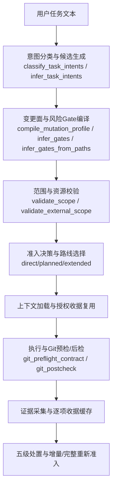
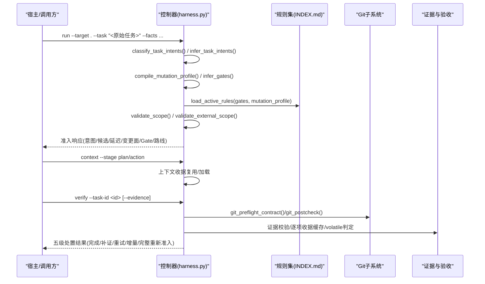
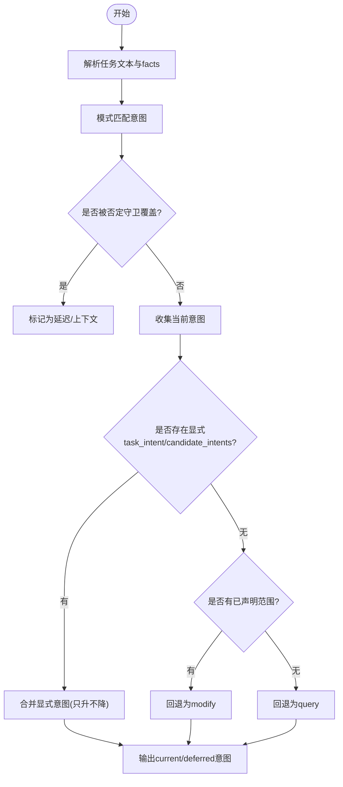
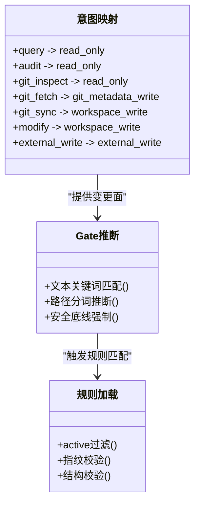
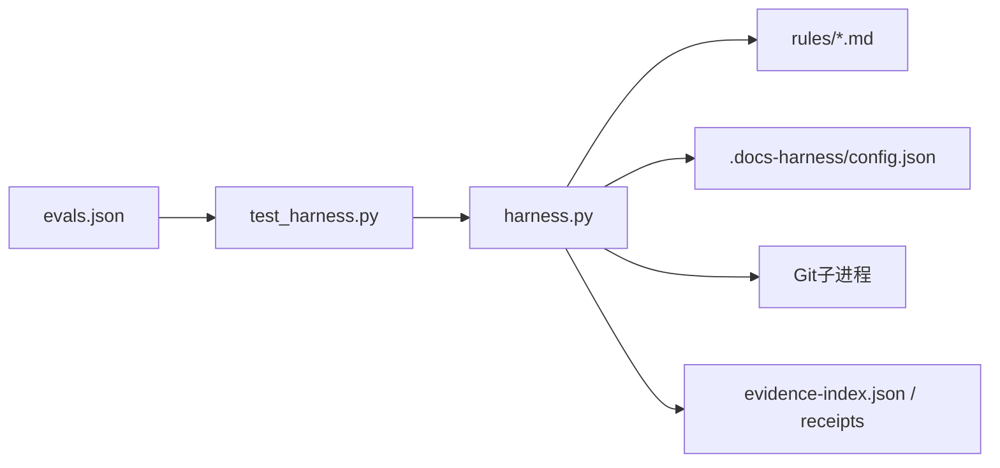

# 意图编译系统

<cite>
**本文引用的文件**   
- [scripts/harness.py](file://scripts/harness.py)
- [docs/contracts.md](file://docs/contracts.md)
- [SKILL.md](file://SKILL.md)
- [harness-home/rules/INDEX.md](file://harness-home/rules/INDEX.md)
- [tests/test_harness.py](file://tests/test_harness.py)
- [evals/evals.json](file://evals/evals.json)
</cite>

## 目录
1. [简介](#简介)
2. [项目结构](#项目结构)
3. [核心组件](#核心组件)
4. [架构总览](#架构总览)
5. [详细组件分析](#详细组件分析)
6. [依赖关系分析](#依赖关系分析)
7. [性能考量](#性能考量)
8. [故障排查指南](#故障排查指南)
9. [结论](#结论)
10. [附录：CLI 与 JSON 接口规范](#附录cli-与-json-接口规范)

## 简介
本文件面向 Docs Harness 的“意图编译系统”，系统性阐述从自然语言任务到可执行控制面的完整流程，包括：
- 意图识别、候选意图生成与延迟意图处理
- 变更面（mutation profile）与风险 Gate 的优先级排序与冲突解决
- 意图与任务类型的映射及不同路径的处理策略
- 验证规则（语法检查、语义分析与上下文关联）
- 证据与验收、工作区漂移归因、Git 状态契约
- 模板系统与扩展机制（规则、文档路由、知识地图）
- CLI 命令参考与 JSON 合同说明
- 使用示例与最佳实践

## 项目结构
Docs Harness 以 Python 控制器为核心，配合规则集、合同文档与测试用例构成完整的意图编译与验收闭环。关键位置：
- 控制器实现：scripts/harness.py
- 合同与边界定义：docs/contracts.md
- 技能入口与运行约定：SKILL.md
- 规则索引与激活：harness-home/rules/INDEX.md
- 行为验证与回归：tests/test_harness.py
- 评估用例集合：evals/evals.json

**图表来源** 
- [scripts/harness.py:2154-2228](file://scripts/harness.py#L2154-L2228)
- [scripts/harness.py:2236-2258](file://scripts/harness.py#L2236-L2258)
- [scripts/harness.py:2261-2286](file://scripts/harness.py#L2261-L2286)
- [scripts/harness.py:2334-2380](file://scripts/harness.py#L2334-L2380)
- [docs/contracts.md:9-46](file://docs/contracts.md#L9-L46)

**章节来源**
- [scripts/harness.py:1-120](file://scripts/harness.py#L1-L120)
- [docs/contracts.md:1-8](file://docs/contracts.md#L1-L8)

## 核心组件
- 意图分类器
  - 基于模式匹配与否定守卫，区分当前意图、未来延迟意图与已完成上下文
  - 支持显式 facts 指定 primary/candidate intents，且只能升级不能降级
- 变更面与风险 Gate
  - 将意图映射为变更面（read_only/git_metadata_write/workspace_write/external_write）
  - 通过关键词与路径分词推断 Gate，安全底线 Gate 强制兜底并带否定守卫
- 范围与资源校验
  - 仅接受结构化路径、glob 或受控 Git 资源；拒绝自然语言描述性边界
- 准入与路线
  - 根据意图与 Gate 决定 direct/planned/extended 等路线
- 上下文与授权收据
  - 按 task_id/target/stage/compiler_contract/content_set_fingerprint 复用
- Git 状态契约
  - 预检冻结远端目标、ref 命名空间与工作区指纹；后检校验 ref 越界、分支分歧、LFS/Submodule 可用性
- 证据与验收
  - v2 收据与声明草案；验证命令逐项收据缓存；volatile 副产物白名单
- 五级处置与重新准入
  - provide_evidence/refresh_evidence/retry_verification/incremental_admission/full_readmission

**章节来源**
- [scripts/harness.py:2154-2228](file://scripts/harness.py#L2154-L2228)
- [scripts/harness.py:2236-2258](file://scripts/harness.py#L2236-L2258)
- [scripts/harness.py:2261-2286](file://scripts/harness.py#L2261-L2286)
- [scripts/harness.py:2334-2380](file://scripts/harness.py#L2334-L2380)
- [docs/contracts.md:9-46](file://docs/contracts.md#L9-L46)
- [docs/contracts.md:97-133](file://docs/contracts.md#L97-L133)
- [docs/contracts.md:165-221](file://docs/contracts.md#L165-L221)

## 架构总览
下图展示从任务输入到最终验收的关键阶段与控制点，以及数据与状态在控制器内的流转。

**图表来源** 
- [scripts/harness.py:2154-2228](file://scripts/harness.py#L2154-L2228)
- [scripts/harness.py:2236-2258](file://scripts/harness.py#L2236-L2258)
- [scripts/harness.py:2057-2123](file://scripts/harness.py#L2057-L2123)
- [scripts/harness.py:677-791](file://scripts/harness.py#L677-L791)
- [scripts/harness.py:793-875](file://scripts/harness.py#L793-L875)
- [docs/contracts.md:165-221](file://docs/contracts.md#L165-L221)

## 详细组件分析

### 意图识别与候选生成
- 自然语言意图识别
  - 使用 INTENT_PATTERNS 对任务文本进行模式匹配，支持英文单词边界与中文短语
  - 否定守卫避免误触发修改类意图
  - 未来子句标记进入 deferred_intents，已完成动作仅作为上下文
- 显式意图优先
  - facts.task_intent 与 facts.candidate_intents 具有最高优先级，且只能升级不能降级
- 默认回退
  - 未检测到意图时，若存在已声明范围则回退为 modify，否则为 query

**图表来源** 
- [scripts/harness.py:2154-2228](file://scripts/harness.py#L2154-L2228)

**章节来源**
- [scripts/harness.py:2154-2228](file://scripts/harness.py#L2154-L2228)
- [docs/contracts.md:9-46](file://docs/contracts.md#L9-L46)

### 变更面与风险 Gate 编译
- 变更面映射
  - 意图到变更面：query/audit/git_inspect→read_only；git_fetch→git_metadata_write；git_sync/modify→workspace_write；external_write→external_write
  - 混合意图取最高变更面
- Gate 推断
  - 文本关键词匹配 + 路径分词推断（代码/文档/前端/测试/安全/架构）
  - 安全底线 Gate（security-sensitive/destructive-data/release-external）强制兜底，带否定守卫精确词表
- 规则加载
  - 仅 active 规则参与，需满足 schema、指纹与结构完整性

**图表来源** 
- [scripts/harness.py:213-230](file://scripts/harness.py#L213-L230)
- [scripts/harness.py:2245-2258](file://scripts/harness.py#L2245-L2258)
- [scripts/harness.py:2261-2286](file://scripts/harness.py#L2261-L2286)
- [scripts/harness.py:2057-2123](file://scripts/harness.py#L2057-L2123)

**章节来源**
- [scripts/harness.py:213-230](file://scripts/harness.py#L213-L230)
- [scripts/harness.py:2245-2258](file://scripts/harness.py#L2245-L2258)
- [scripts/harness.py:2261-2286](file://scripts/harness.py#L2261-L2286)
- [scripts/harness.py:2057-2123](file://scripts/harness.py#L2057-L2123)
- [docs/contracts.md:9-46](file://docs/contracts.md#L9-L46)

### 范围与资源校验
- 仅允许项目内相对路径、glob 或受控 Git 资源
- 拒绝自然语言描述性边界（如“仅只读查询”），返回 invalid_scope_description
- external_scope 严格白名单格式校验

**章节来源**
- [scripts/harness.py:2334-2380](file://scripts/harness.py#L2334-L2380)
- [docs/contracts.md:9-46](file://docs/contracts.md#L9-L46)

### 准入与路线选择
- 准入状态：blocked/needs_plan/needs_authorization/ready_direct/ready_planned/ready_extended
- 只读任务允许空 write_scope；git_sync 默认 planned；external_write 至少 planned
- 完成清单 completion_manifest 固定收尾要求与交付层期望

**章节来源**
- [docs/contracts.md:9-46](file://docs/contracts.md#L9-L46)
- [docs/contracts.md:50-78](file://docs/contracts.md#L50-L78)

### 上下文与授权收据复用
- 复用条件：同一 task_id/target/stage/compiler_contract/content_set_fingerprint
- 授权始终绑定 package fingerprint，不跨修订复用

**章节来源**
- [docs/contracts.md:222-234](file://docs/contracts.md#L222-L234)

### Git 状态契约与后检
- 预检冻结：远端 OID、ref 命名空间、HEAD、index_tree、worktree_fingerprint、LFS/Submodule 可用性
- 后检校验：remote_target_unchanged、refs_within_contract、head/index/worktree 一致性、分支分歧、LFS/Submodule 状态
- 远端漂移：自动计算 git_sync_landed_scope，单命令重新准入并复用冻结方案

**章节来源**
- [scripts/harness.py:677-791](file://scripts/harness.py#L677-L791)
- [scripts/harness.py:793-875](file://scripts/harness.py#L793-L875)
- [docs/contracts.md:97-133](file://docs/contracts.md#L97-L133)

### 证据与验收
- 证据收据 v2：强绑定 task/target/package/producer/ttl/read_set/write_set
- 验证命令逐项收据：argv+produces+输入指纹绑定，命中直接复用
- volatile 副产物白名单：新建容忍，已有同名文件修改/删除仍阻断
- 自动归因：write_scope 内未归因写入默认代铸 workspace_attribution 收据

**章节来源**
- [docs/contracts.md:165-221](file://docs/contracts.md#L165-L221)
- [SKILL.md:43-57](file://SKILL.md#L43-L57)

### 五级处置与重新准入
- provide_evidence：缺写集归因或类型化证据
- refresh_evidence：读取基线漂移，局部失效重读
- retry_verification：命令失败或临时网络问题
- incremental_admission：普通新增 Gate 且合同稳定
- full_readmission：高风险 Gate/范围变化/规则变化/远端漂移/ref 越界

**章节来源**
- [docs/contracts.md:153-163](file://docs/contracts.md#L153-L163)

### 模板系统与扩展机制
- 规则模板：harness-home/rules/*.md，active 规则需包含 rule_id、content_fingerprint、gates/keywords、plan_fields/evidence_types/failure_mode
- 文档路由：background_governance.document_routes 显式声明 architecture/changelog/todo/adr_root/reviews_root，非法配置零回退
- 知识地图：knowledge-map.json 约束功能文档四类（product/development/testing/design），支持别名、scope_patterns、shared_refs、dependencies

**章节来源**
- [harness-home/rules/INDEX.md:1-41](file://harness-home/rules/INDEX.md#L1-L41)
- [scripts/harness.py:1287-1345](file://scripts/harness.py#L1287-L1345)
- [scripts/harness.py:1526-1588](file://scripts/harness.py#L1526-L1588)

## 依赖关系分析
- 控制器依赖规则集与项目配置，动态加载 active 规则并按 Gate/关键词匹配
- Git 操作通过子进程封装，统一超时与错误码
- 证据与收据持久化于任务 Runtime，隔离于工作区快照
- 评估用例与单元测试驱动行为回归

**图表来源** 
- [scripts/harness.py:2057-2123](file://scripts/harness.py#L2057-L2123)
- [tests/test_harness.py:1-80](file://tests/test_harness.py#L1-L80)
- [evals/evals.json:1-20](file://evals/evals.json#L1-L20)

**章节来源**
- [scripts/harness.py:2057-2123](file://scripts/harness.py#L2057-L2123)
- [tests/test_harness.py:1-80](file://tests/test_harness.py#L1-L80)
- [evals/evals.json:1-20](file://evals/evals.json#L1-L20)

## 性能考量
- 上下文与授权收据复用减少重复加载与往返
- 验证命令逐项收据缓存避免重复执行昂贵命令
- 工作区快照限制文件大小与数量，非 Git 工作区设置截断保护
- Git 预检/后检集中校验，避免多次无效执行

[本节为通用指导，无需引用具体文件]

## 故障排查指南
- 常见错误码与退出码
  - 输入/合同/状态无效：exit 2
  - 需要方案/授权/证据/Git交付：exit 3
  - 范围/漂移/Gate/规则变化需重新准入：exit 4
- 典型阻塞原因
  - 脏工作区与 git_sync 范围重叠
  - 非 fast-forward 或分支分歧
  - LFS/Submodule 不可用
  - 越界写入或未归因漂移
- 定位手段
  - 查看 events.jsonl 事件统计（context_load_count、readmission_count、evidence_round_count）
  - 检查 git_postcheck 的 checks 字段与 reason_code
  - 核对 evidence-index 与 receipt 指纹一致性

**章节来源**
- [docs/contracts.md:359-370](file://docs/contracts.md#L359-L370)
- [scripts/harness.py:793-875](file://scripts/harness.py#L793-L875)
- [scripts/harness.py:1031-1071](file://scripts/harness.py#L1031-L1071)

## 结论
Docs Harness 的意图编译系统将自然语言任务转化为受控、可审计、可复用的执行计划，通过严格的范围与证据契约、Git 状态保障与五级处置策略，确保高风险操作的确定性与安全性。规则与模板体系提供可扩展的治理框架，结合上下文与证据收据复用，显著提升效率与稳定性。

[本节为总结，无需引用具体文件]

## 附录：CLI 与 JSON 接口规范

### CLI 命令参考
- 任务入口
  - python3 scripts/harness.py run --target . --task "<原始用户任务>" --json
- 上下文加载
  - python3 scripts/harness.py context --target . --task-id <id> --stage plan|action
- 提交方案
  - python3 scripts/harness.py run --target . --task-id <id> --plan <plan.json>
- 获取授权
  - python3 scripts/harness.py run --target . --task-id <id> --authorization <auth.json>
- 最终验收
  - python3 scripts/harness.py verify --target . --task-id <id> [--evidence <evidence.json>] --json
- 后台治理
  - background list/status/prepare/dispatch/progress/verify/retry

**章节来源**
- [SKILL.md:25-81](file://SKILL.md#L25-L81)

### JSON 接口规范（节选）
- task-package/v2
  - 关键字段：task_intent、candidate_intents、deferred_intents、intent_boundary_reason_codes、mutation_profile、read_scope、write_scope、git_scope、external_scope、allowed_actions
- 准入与完成清单
  - completion_manifest：manifest_fingerprint、required_evidence_types、required_receipts、conditional_reviews、conditional_evidence、verification_commands、completion_blockers、completion_protocol
- Git 状态快照
  - git_state_snapshot：repo_identity、remote、preflight_target_oid、head、index_tree、worktree_fingerprint、controlled_refs_namespace、lfs_available、submodule_available、git_sync_scope
- 证据收据 v2
  - 必填绑定：task_id、target_identity、package_fingerprint、producer、command_argv_digest、cwd、started_at、ended_at、ttl、exit_code、output_or_artifact_digest、read_set、write_set
- 验证命令收据
  - 键：task_id、target_identity、argv digest、cwd、verification_input_fingerprint、declared produces、relevant contract fingerprint、producer capability、ttl

**章节来源**
- [docs/contracts.md:9-46](file://docs/contracts.md#L9-L46)
- [docs/contracts.md:50-78](file://docs/contracts.md#L50-L78)
- [docs/contracts.md:97-133](file://docs/contracts.md#L97-L133)
- [docs/contracts.md:165-221](file://docs/contracts.md#L165-L221)

### 实际使用示例与最佳实践
- 只读查询
  - 任务：“项目文档在哪，请解释现有内容”
  - 预期：task_intent=query，mutation_profile=read_only，admission_status=ready_direct
- 混合意图（审计+修复）
  - 任务：“先审计 README，如需要再修复”
  - 预期：candidate_intents={audit, modify}，mutation_profile=workspace_write
- Git fetch/sync
  - 任务：“执行 git fetch/sync 同步远端”
  - 预期：git_scope 绑定单一远端分支；git_sync 需要计划；远端漂移触发重新准入并复用冻结方案
- 证据与验收
  - 使用 docs-harness/evidence-receipt/v2；验证命令声明 produces；volatile 副产物白名单可控；未归因写入默认自动归因

**章节来源**
- [tests/test_harness.py:429-448](file://tests/test_harness.py#L429-L448)
- [tests/test_harness.py:465-483](file://tests/test_harness.py#L465-L483)
- [tests/test_harness.py:503-536](file://tests/test_harness.py#L503-L536)
- [tests/test_harness.py:597-683](file://tests/test_harness.py#L597-L683)
- [docs/contracts.md:165-221](file://docs/contracts.md#L165-L221)