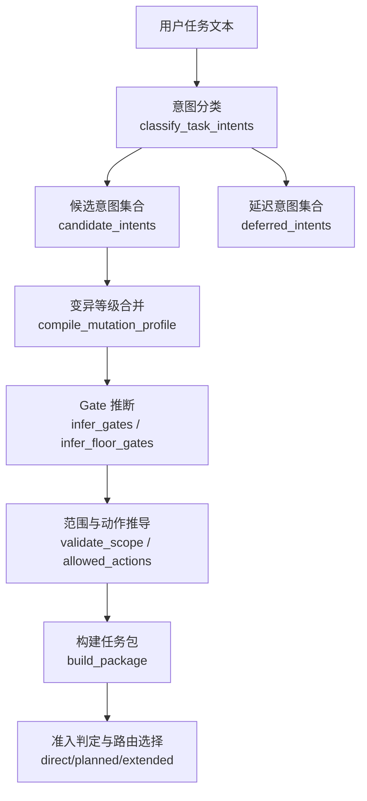
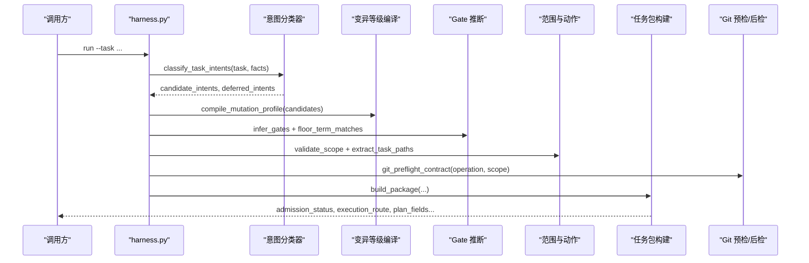
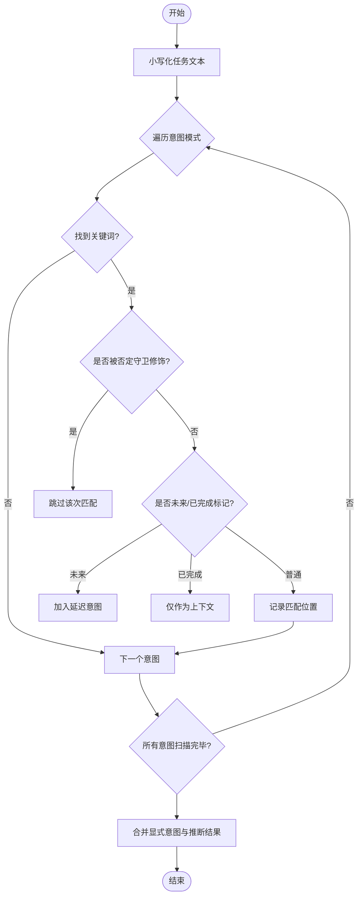
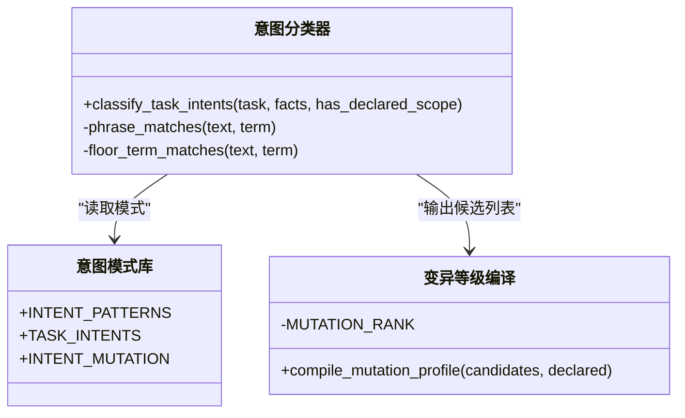
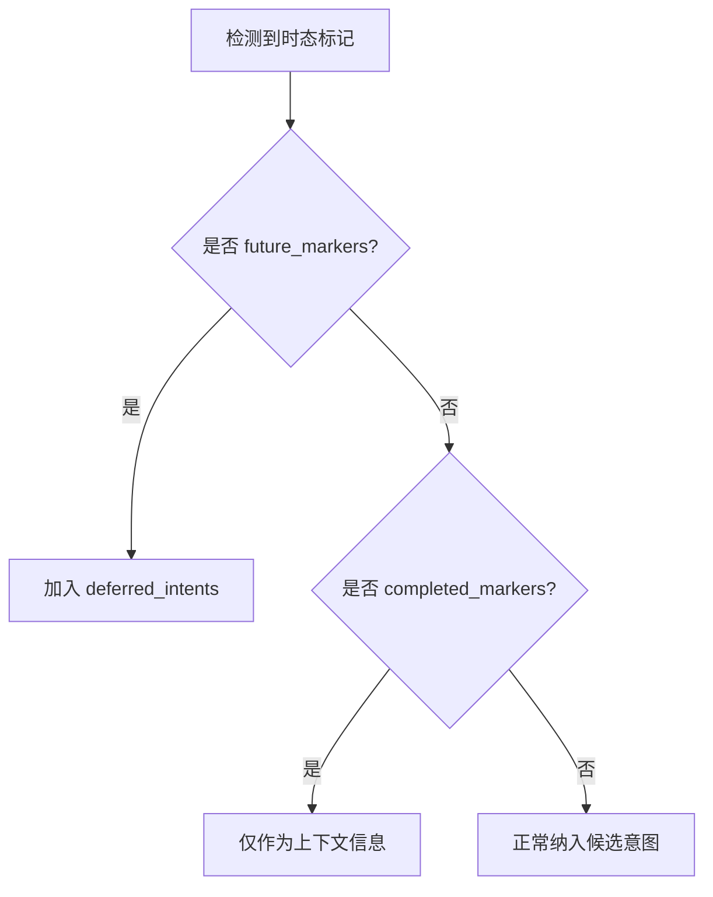
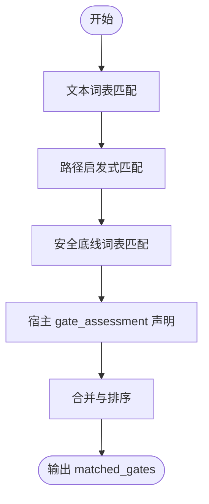
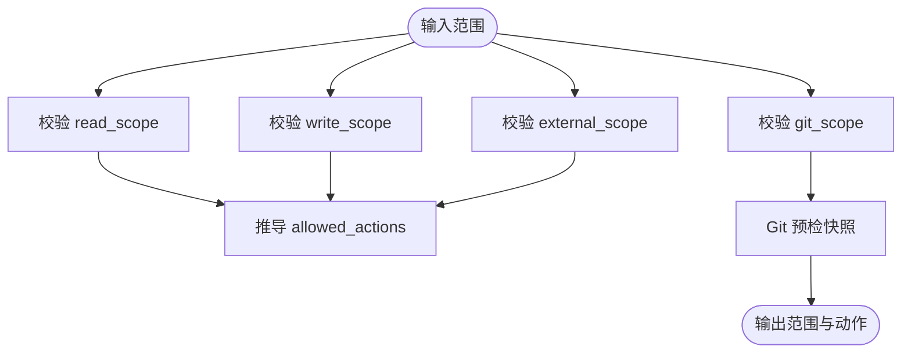
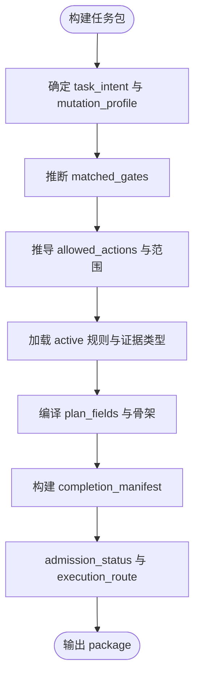
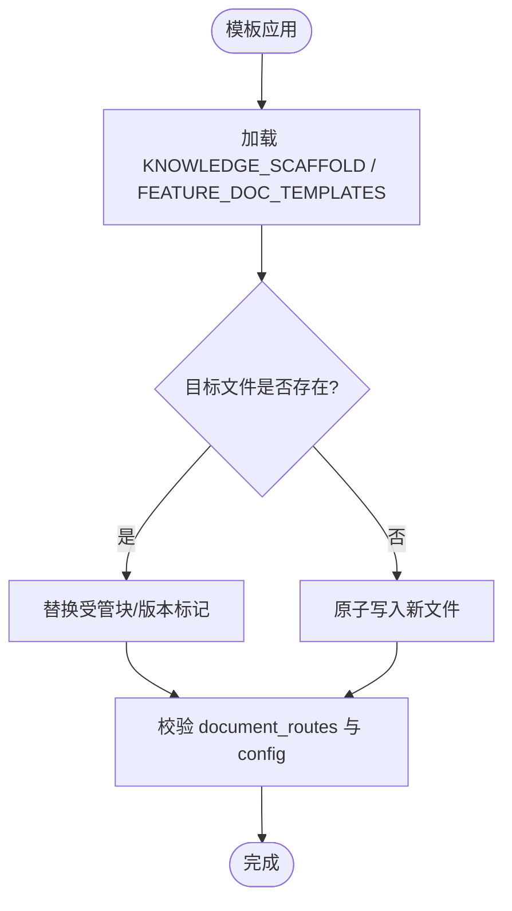
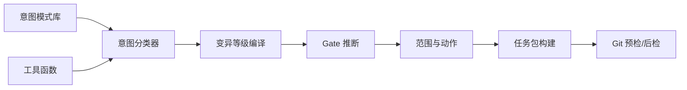

# 意图解析引擎

<cite>
**本文引用的文件**   
- [scripts/harness.py](file://scripts/harness.py)
- [tests/test_harness.py](file://tests/test_harness.py)
- [SKILL.md](file://SKILL.md)
- [package.json](file://package.json)
</cite>

## 目录
1. [简介](#简介)
2. [项目结构](#项目结构)
3. [核心组件](#核心组件)
4. [架构总览](#架构总览)
5. [详细组件分析](#详细组件分析)
6. [依赖关系分析](#依赖关系分析)
7. [性能考量](#性能考量)
8. [故障排查指南](#故障排查指南)
9. [结论](#结论)
10. [附录](#附录)

## 简介
本文件面向 Docs Harness 的“意图解析引擎”，系统性阐述自然语言意图识别、候选意图生成、延迟意图处理与模板系统的工作原理，并给出扩展自定义规则与调试常见错误的实践指引。该引擎以关键词匹配与语义约束为核心，结合宿主声明的安全底线 Gate 与范围合同，确保任务在安全、可审计的前提下执行。

## 项目结构
- 入口脚本：scripts/harness.py（包含意图解析、Gate 推断、范围校验、验证命令缓存、知识地图等全部控制面逻辑）
- 测试套件：tests/test_harness.py（覆盖意图边界、Git 预检/后检、延迟意图、只读问题句等关键路径）
- 技能说明：SKILL.md（任务入口、后台治理、质量账本、按需读取等高层流程）
- 包元数据：package.json（版本、描述、脚本入口）

图表来源
- [scripts/harness.py:2154-2228](file://scripts/harness.py#L2154-L2228)
- [scripts/harness.py:2236-2243](file://scripts/harness.py#L2236-L2243)
- [scripts/harness.py:2245-2258](file://scripts/harness.py#L2245-L2258)
- [scripts/harness.py:2613-2908](file://scripts/harness.py#L2613-L2908)

章节来源
- [scripts/harness.py:197-230](file://scripts/harness.py#L197-L230)
- [scripts/harness.py:2154-2228](file://scripts/harness.py#L2154-L2228)
- [scripts/harness.py:2613-2908](file://scripts/harness.py#L2613-L2908)
- [SKILL.md:25-43](file://SKILL.md#L25-L43)
- [package.json:1-23](file://package.json#L1-L23)

## 核心组件
- 意图模式库与映射：定义意图类型、关键词模式、以及意图到变异等级的映射
- 意图分类器：基于关键词位置、否定守卫、时态标记进行当前/延迟意图划分
- 变异等级编译：将多个候选意图合并为最高安全的 mutation_profile
- Gate 推断器：从任务文本、路径特征与安全底线词表推断 Gate，支持宿主权威声明兜底
- 范围与动作推导：规范化 read/write/git/external 范围，推导允许动作集
- 任务包构建：汇总上下文、证据要求、计划字段、完成清单、准入状态与路由

章节来源
- [scripts/harness.py:197-230](file://scripts/harness.py#L197-L230)
- [scripts/harness.py:2154-2228](file://scripts/harness.py#L2154-L2228)
- [scripts/harness.py:2236-2243](file://scripts/harness.py#L2236-L2243)
- [scripts/harness.py:2245-2258](file://scripts/harness.py#L2245-L2258)
- [scripts/harness.py:2613-2908](file://scripts/harness.py#L2613-L2908)

## 架构总览
意图解析引擎贯穿“输入→分类→合并→Gate→范围→包构建→准入”流水线，并与 Git 预检/后检、知识地图、验证命令缓存、事件日志等子系统协作。

图表来源
- [scripts/harness.py:2154-2228](file://scripts/harness.py#L2154-L2228)
- [scripts/harness.py:2236-2243](file://scripts/harness.py#L2236-L2243)
- [scripts/harness.py:2245-2258](file://scripts/harness.py#L2245-L2258)
- [scripts/harness.py:2682-2691](file://scripts/harness.py#L2682-L2691)
- [scripts/harness.py:2613-2908](file://scripts/harness.py#L2613-L2908)

## 详细组件分析

### 自然语言意图识别机制
- 关键词提取：对每个意图维护一组关键词模式；使用大小写不敏感搜索与单词边界保护，避免子串误匹配
- 语义分析：通过从句前缀判断否定守卫（如“不要/禁止/do not”），过滤非真实写入意图；通过时态标记区分“后续/以后”与“已经/此前”
- 上下文理解：若存在显式 task_intent/candidate_intents，优先采用；否则按首次命中位置排序得到候选序列

图表来源
- [scripts/harness.py:2154-2228](file://scripts/harness.py#L2154-L2228)

章节来源
- [scripts/harness.py:2154-2228](file://scripts/harness.py#L2154-L2228)

### 候选意图生成算法
- 模式匹配：逐意图扫描关键词，记录首次命中位置，保证顺序稳定性
- 相似度计算：未实现向量相似度，采用“位置+否定守卫+时态标记”的规则打分
- 优先级排序：显式声明优先于推断；同一轮去重保留首次出现；最终按突变等级取最高者作为 mutation_profile

图表来源
- [scripts/harness.py:2154-2228](file://scripts/harness.py#L2154-L2228)
- [scripts/harness.py:2236-2243](file://scripts/harness.py#L2236-L2243)
- [scripts/harness.py:197-230](file://scripts/harness.py#L197-L230)

章节来源
- [scripts/harness.py:2154-2228](file://scripts/harness.py#L2154-L2228)
- [scripts/harness.py:2236-2243](file://scripts/harness.py#L2236-L2243)
- [scripts/harness.py:197-230](file://scripts/harness.py#L197-L230)

### 延迟意图处理机制
- 触发条件：当意图属于 modify/external_write/git_sync，且从句前缀包含“后续/以后/后面/另行/单独/另开任务/下一任务”等标记时，归入延迟意图
- 异步解析：延迟意图不参与当前准入决策，但会记录在 deferred_intents 中，供后续阶段或任务拆分使用
- 错误恢复：延迟意图不影响当前任务执行；若后续需要，可通过新任务或工作包承接

图表来源
- [scripts/harness.py:2154-2228](file://scripts/harness.py#L2154-L2228)

章节来源
- [scripts/harness.py:2154-2228](file://scripts/harness.py#L2154-L2228)

### Gate 推断与安全底线
- 文本推断：基于 GATE_DEFS 的词表匹配，结合短语边界保护
- 路径推断：根据文件后缀、目录名、文件名启发式推断 code-edit/document-edit/security-sensitive/architecture-contract/testing-acceptance/frontend-design
- 安全底线：FLOOR_TERMS 精确词表 + 否定守卫，强制追加 security-sensitive/destructive-data/release-external，不可豁免
- 宿主权威：gate_assessment.gates 可声明 Gate 集合，代码仅做底线追加；未声明时回退关键词推断

图表来源
- [scripts/harness.py:2245-2258](file://scripts/harness.py#L2245-L2258)
- [scripts/harness.py:2261-2286](file://scripts/harness.py#L2261-L2286)
- [scripts/harness.py:2134-2151](file://scripts/harness.py#L2134-L2151)
- [scripts/harness.py:2596-2610](file://scripts/harness.py#L2596-L2610)

章节来源
- [scripts/harness.py:2245-2258](file://scripts/harness.py#L2245-L2258)
- [scripts/harness.py:2261-2286](file://scripts/harness.py#L2261-L2286)
- [scripts/harness.py:2134-2151](file://scripts/harness.py#L2134-L2151)
- [scripts/harness.py:2596-2610](file://scripts/harness.py#L2596-L2610)

### 范围与动作推导
- 范围校验：read/write/git/external 四类范围分别校验格式、安全性与冲突
- 动作推导：依据 mutation_profile 与 task_intent 组合推导 allowed_actions（read/write/local_verify/git_fetch/git_sync/git_inspect/external_write）
- Git 预检：git_preflight_contract 冻结索引、快照工作区、检查 LFS/Submodule、fast-forward 可行性与变更范围

图表来源
- [scripts/harness.py:2334-2381](file://scripts/harness.py#L2334-L2381)
- [scripts/harness.py:2682-2691](file://scripts/harness.py#L2682-L2691)
- [scripts/harness.py:2738-2749](file://scripts/harness.py#L2738-L2749)

章节来源
- [scripts/harness.py:2334-2381](file://scripts/harness.py#L2334-L2381)
- [scripts/harness.py:2682-2691](file://scripts/harness.py#L2682-L2691)
- [scripts/harness.py:2738-2749](file://scripts/harness.py#L2738-L2749)

### 任务包构建与准入策略
- 构建内容：task_intent、mutation_profile、matched_gates、allowed_actions、plan_fields、semantic_evidence_requirements、verification_commands、completion_manifest、context_schedule、work_packages 等
- 准入判定：blockers 为空则 ready_direct；否则 needs_plan 或 blocked
- 路由选择：direct/planned/extended，受 gates、work_packages、git_operation 影响

图表来源
- [scripts/harness.py:2613-2908](file://scripts/harness.py#L2613-L2908)

章节来源
- [scripts/harness.py:2613-2908](file://scripts/harness.py#L2613-L2908)

### 意图模板系统与变量替换
- 模板语法：KNOWLEDGE_SCAFFOLD 与 FEATURE_DOC_TEMPLATES 提供文档骨架，使用 {name} 等占位符
- 变量替换：安装/升级过程中通过 replace_managed_block 与 managed_version 机制更新受管块与版本标记
- 条件逻辑：根据 knowledge_status、docs_preexisted、document_routes 配置决定是否创建/更新文件

图表来源
- [scripts/harness.py:353-367](file://scripts/harness.py#L353-L367)
- [scripts/harness.py:9400-9600](file://scripts/harness.py#L9400-L9600)

章节来源
- [scripts/harness.py:353-367](file://scripts/harness.py#L353-L367)
- [scripts/harness.py:9400-9600](file://scripts/harness.py#L9400-L9600)

### 扩展自定义意图解析规则
- 新增意图模式：在 INTENT_PATTERNS 中添加新的意图键与关键词元组，并在 INTENT_MUTATION 中映射 mutation_profile
- 调整否定守卫与时态标记：修改 NEGATION_MARKERS、future_markers、completed_markers 以适配领域表达
- 添加 Gate 词表：在 GATE_DEFS 或 FLOOR_TERMS 中补充术语，配合 phrase_matches/floor_term_matches 提升准确率
- 验证方式：通过 tests/test_harness.py 中的用例断言 candidate_intents、deferred_intents、mutation_profile 与 admission_status

章节来源
- [scripts/harness.py:197-230](file://scripts/harness.py#L197-L230)
- [scripts/harness.py:2154-2228](file://scripts/harness.py#L2154-L2228)
- [scripts/harness.py:2245-2258](file://scripts/harness.py#L2245-L2258)
- [tests/test_harness.py:4676-4683](file://tests/test_harness.py#L4676-L4683)

### 常见解析错误与调试方法
- 无效范围描述：validate_scope 拒绝自然语言描述，需改为结构化路径
- 未知意图/Gate：infer_task_intents/infer_gates 抛出 invalid_task_intent/invalid_gate
- Git 预检失败：git_preflight_contract 返回 blockers（脏工作区、非 fast-forward、LFS/Submodule 不可用）
- 远端漂移：verify 阶段 git_postcheck 检测到 remote_target_unchanged 失败，返回 git_remote_drift
- 状态锁冲突：state_lock 检测到 stale_lock 或 state_locked，需人工清理

章节来源
- [scripts/harness.py:2334-2381](file://scripts/harness.py#L2334-L2381)
- [scripts/harness.py:2245-2258](file://scripts/harness.py#L2245-L2258)
- [scripts/harness.py:2682-2691](file://scripts/harness.py#L2682-L2691)
- [scripts/harness.py:793-875](file://scripts/harness.py#L793-L875)
- [scripts/harness.py:1008-1029](file://scripts/harness.py#L1008-L1029)

## 依赖关系分析
- 模块内依赖：意图分类器依赖模式库与工具函数（phrase_matches/floor_term_matches）；任务包构建依赖 Gate 推断、范围校验、Git 预检、规则加载
- 外部集成：Git CLI、文件系统、JSON/JSONL 读写、时间戳与哈希
- 耦合与内聚：高内聚的意图解析与低耦合的工具函数分离，便于扩展与维护

图表来源
- [scripts/harness.py:2154-2228](file://scripts/harness.py#L2154-L2228)
- [scripts/harness.py:2236-2243](file://scripts/harness.py#L2236-L2243)
- [scripts/harness.py:2245-2258](file://scripts/harness.py#L2245-L2258)
- [scripts/harness.py:2613-2908](file://scripts/harness.py#L2613-L2908)
- [scripts/harness.py:793-875](file://scripts/harness.py#L793-L875)

章节来源
- [scripts/harness.py:2154-2228](file://scripts/harness.py#L2154-L2228)
- [scripts/harness.py:2613-2908](file://scripts/harness.py#L2613-L2908)
- [scripts/harness.py:793-875](file://scripts/harness.py#L793-L875)

## 性能考量
- 关键词匹配复杂度：O(N×M)，N 为任务长度，M 为模式总数；建议精简模式与复用正则
- Git 操作超时与批量限制：git_command 设置超时，workspace_snapshot 限制文件大小与数量
- 验证命令缓存：verification_command_cache_enabled 默认开启，减少重复执行开销
- 事件日志与指纹：append_task_event 与 sha256_text 增加 IO 与 CPU 开销，应合理控制事件粒度

[本节为通用指导，无需引用具体文件]

## 故障排查指南
- 检查 candidate_intents/deferred_intents：确认意图分类是否符合预期，必要时调整 INTENT_PATTERNS 与否定守卫
- 查看 admission_status/blockers：定位 Git 预检失败、范围非法或缺少事实
- 审查 matched_gates/gate_decision：确认宿主声明与底线 Gate 是否正确叠加
- 验证 verification_commands 与 evidence_types：确保验收命令与证据类型满足 completion_manifest
- 关注 events.jsonl 与 reason_code：快速定位失败阶段与原因

章节来源
- [scripts/harness.py:2613-2908](file://scripts/harness.py#L2613-L2908)
- [scripts/harness.py:1031-1071](file://scripts/harness.py#L1031-L1071)
- [tests/test_harness.py:4676-4683](file://tests/test_harness.py#L4676-L4683)

## 结论
Docs Harness 意图解析引擎以规则驱动的自然语言理解为核心，结合安全底线 Gate、范围合同与 Git 预检/后检，形成稳定、可审计的任务控制流。通过清晰的意图分类、延迟处理与模板系统，既保证了灵活性，又确保了安全性与可维护性。扩展自定义规则与调试错误均具备明确的切入点与验证手段。

[本节为总结，无需引用具体文件]

## 附录
- 参考入口与高层流程：SKILL.md
- 包元数据与脚本入口：package.json
- 单元测试覆盖关键路径：tests/test_harness.py

章节来源
- [SKILL.md:25-43](file://SKILL.md#L25-L43)
- [package.json:1-23](file://package.json#L1-L23)
- [tests/test_harness.py:4676-4683](file://tests/test_harness.py#L4676-L4683)