# 意图验证系统

<cite>
**本文引用的文件**   
- [SKILL.md](file://SKILL.md)
- [package.json](file://package.json)
- [scripts/harness.py](file://scripts/harness.py)
- [tests/test_harness.py](file://tests/test_harness.py)
- [harness-home/rules/INDEX.md](file://harness-home/rules/INDEX.md)
- [harness-home/rules/api-compatibility.md](file://harness-home/rules/api-compatibility.md)
- [harness-home/rules/external-input-security.md](file://harness-home/rules/external-input-security.md)
- [harness-home/rules/documentation-changes.md](file://harness-home/rules/documentation-changes.md)
- [harness-home/rules/_rule-template.md](file://harness-home/rules/_rule-template.md)
</cite>

## 目录
1. [简介](#简介)
2. [项目结构](#项目结构)
3. [核心组件](#核心组件)
4. [架构总览](#架构总览)
5. [详细组件分析](#详细组件分析)
6. [依赖关系分析](#依赖关系分析)
7. [性能考量](#性能考量)
8. [故障排除指南](#故障排除指南)
9. [结论](#结论)
10. [附录](#附录)

## 简介
本文件为 Docs Harness 的“意图验证系统”提供系统化、可操作的技术文档。围绕以下目标展开：
- 意图语法检查机制：格式校验、类型校验与约束校验
- 语义分析过程：依赖检测、冲突识别与完整性校验
- 上下文关联机制：项目状态检查、权限验证与安全策略应用
- 验证规则引擎：规则加载、执行顺序与结果聚合
- 自定义验证规则编写指南
- 验证失败的故障排除与修复建议

该系统以“意图优先、证据可复用且失败关闭”为核心原则，通过 CLI 驱动的任务控制器对任务意图进行编译、准入、执行与验证，确保变更在受控范围内安全落地。

## 项目结构
Docs Harness 采用“脚本主入口 + 规则快照 + 测试契约”的组织方式：
- scripts/harness.py：控制器主程序，实现意图解析、准入、Git 预检/后验、知识地图校验、规则加载与验证流程编排
- harness-home/rules：随项目安装的通用规则快照（含索引与具体规则）
- tests/test_harness.py：契约与行为测试，覆盖意图路由、Git 操作、验证与验收等关键路径
- SKILL.md：技能说明与运行约定
- package.json：包元数据与脚本入口

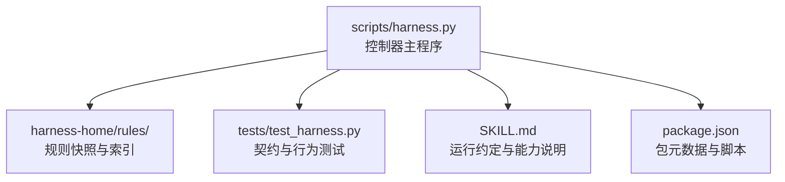

图表来源
- [scripts/harness.py:1-200](file://scripts/harness.py#L1-L200)
- [harness-home/rules/INDEX.md:1-41](file://harness-home/rules/INDEX.md#L1-L41)
- [tests/test_harness.py:1-120](file://tests/test_harness.py#L1-L120)
- [SKILL.md:1-60](file://SKILL.md#L1-L60)
- [package.json:1-23](file://package.json#L1-L23)

章节来源
- [scripts/harness.py:1-200](file://scripts/harness.py#L1-L200)
- [harness-home/rules/INDEX.md:1-41](file://harness-home/rules/INDEX.md#L1-L41)
- [tests/test_harness.py:1-120](file://tests/test_harness.py#L1-L120)
- [SKILL.md:1-60](file://SKILL.md#L1-L60)
- [package.json:1-23](file://package.json#L1-L23)

## 核心组件
- 意图与变更等级
  - 意图集合：query、audit、git_inspect、git_fetch、git_sync、modify、external_write
  - 变更等级：read_only、git_metadata_write、workspace_write、external_write
  - 意图到变更等级的映射用于确定最小授权范围与后续 Gate 匹配
- Gate 体系
  - 固定顺序与定义：product-change、architecture-contract、security-sensitive、destructive-data、release-external、frontend-design、diagnosis-fix、testing-acceptance、review-audit、code-edit、document-edit
  - 安全底线 Gate：security-sensitive、destructive-data、release-external（不可豁免）
- 规则系统
  - 规则索引与激活清单：harness-home/rules/INDEX.md
  - 规则模板与字段：status、rule_id、content_fingerprint、gates、keywords、plan_fields、evidence_types、failure_mode
- Git 预检/后验
  - git_preflight_contract：生成快照、计算变更范围、检查 LFS/Submodule、脏工作区与非快进合并
  - git_postcheck：对比远端目标、受控引用、工作区指纹、分支分歧度等
- 知识地图与文档路由
  - knowledge-map.json：功能维度、四类文档、依赖与已知缺口
  - document_routes：架构/变更记录/待办/ADR/评审根目录的路由解析与指纹化
- 验证与证据
  - 验证命令缓存、易失路径白名单、自动归因、证据收据 v2、完成清单 v1
- 事件与状态机
  - events.jsonl 记录阶段、原因码、计数指标；任务状态机驱动 next_action 与下一步命令

章节来源
- [scripts/harness.py:197-390](file://scripts/harness.py#L197-L390)
- [scripts/harness.py:677-875](file://scripts/harness.py#L677-L875)
- [scripts/harness.py:1279-1456](file://scripts/harness.py#L1279-L1456)
- [scripts/harness.py:1142-1234](file://scripts/harness.py#L1142-L1234)
- [scripts/harness.py:1031-1071](file://scripts/harness.py#L1031-L1071)
- [harness-home/rules/INDEX.md:1-41](file://harness-home/rules/INDEX.md#L1-L41)
- [harness-home/rules/_rule-template.md:1-21](file://harness-home/rules/_rule-template.md#L1-L21)

## 架构总览
意图验证系统贯穿“输入→编译→准入→执行→验证→归档”的全链路，结合 Gate 与规则引擎形成强约束控制面。

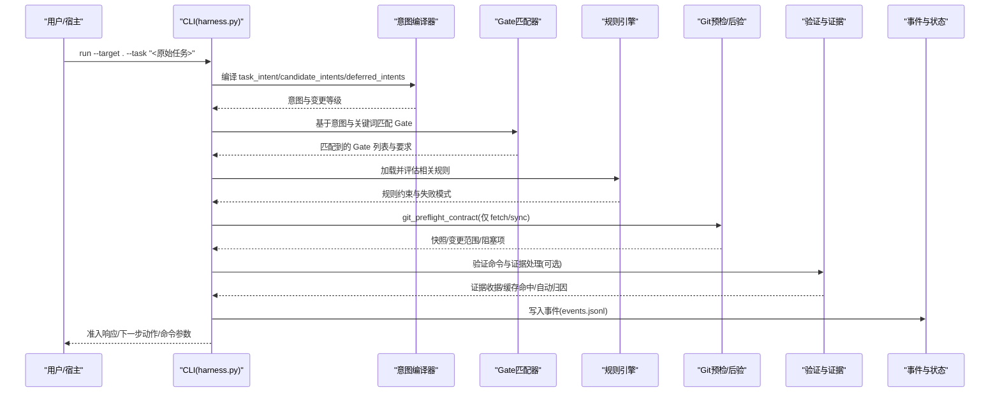

图表来源
- [scripts/harness.py:197-390](file://scripts/harness.py#L197-L390)
- [scripts/harness.py:677-875](file://scripts/harness.py#L677-L875)
- [scripts/harness.py:1031-1071](file://scripts/harness.py#L1031-L1071)
- [SKILL.md:25-56](file://SKILL.md#L25-L56)

## 详细组件分析

### 意图语法检查机制（格式、类型、约束）
- 输入来源
  - 命令行参数与 --facts JSON 对象
  - 内联输入限制：不支持多行或内联 JSON/数组作为路径参数
- 类型与格式校验
  - facts 必须为对象；字符串数组需去重且非空；路径类字段需相对项目内、禁止越界与符号链接
  - 任务 ID、背景信息、计划字段等均有严格正则与长度限制
- 约束校验
  - scope/read_scope/write_scope 必须为字符串数组；描述性文本不被接受（自然语言范围直接拒绝）
  - Git 操作范围必须满足 .git:refs/remotes/<remote>/<branch> 格式；git_sync 必须绑定单一远端分支
- 错误处理
  - 统一抛出 HarnessError，携带 code 与 exit_code，便于上层收敛与提示

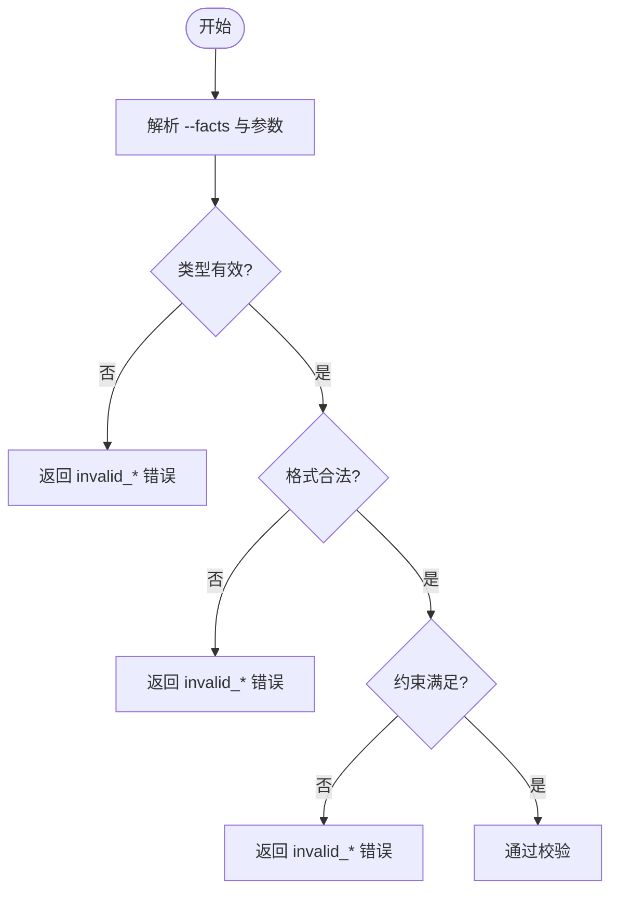

图表来源
- [scripts/harness.py:446-505](file://scripts/harness.py#L446-L505)
- [scripts/harness.py:1244-1262](file://scripts/harness.py#L1244-L1262)
- [scripts/harness.py:661-675](file://scripts/harness.py#L661-L675)
- [tests/test_harness.py:485-502](file://tests/test_harness.py#L485-L502)

章节来源
- [scripts/harness.py:446-505](file://scripts/harness.py#L446-L505)
- [scripts/harness.py:1244-1262](file://scripts/harness.py#L1244-L1262)
- [scripts/harness.py:661-675](file://scripts/harness.py#L661-L675)
- [tests/test_harness.py:485-502](file://tests/test_harness.py#L485-L502)

### 语义分析（依赖检测、冲突识别、完整性校验）
- 意图到变更等级映射
  - 将 query/audit/git_inspect 映射为 read_only；git_fetch 为 git_metadata_write；git_sync/modify 为 workspace_write；external_write 为 external_write
- 候选意图与最高变更等级
  - 混合意图取最高变更等级，确保安全边界不降级
- 依赖与冲突
  - 知识地图 features.dependencies 校验依赖存在性与唯一性
  - 文档路由冲突：同 inode 去重，符号链接拒绝，类型不匹配拒绝
- 完整性校验
  - 知识地图 schema_version、knowledge_level、features 数量与字段完整性
  - 文档路由 required_kinds 与 resolved 状态

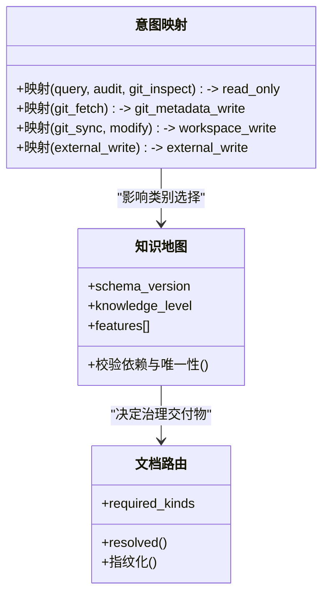

图表来源
- [scripts/harness.py:212-230](file://scripts/harness.py#L212-L230)
- [scripts/harness.py:1526-1588](file://scripts/harness.py#L1526-L1588)
- [scripts/harness.py:1400-1456](file://scripts/harness.py#L1400-L1456)

章节来源
- [scripts/harness.py:212-230](file://scripts/harness.py#L212-L230)
- [scripts/harness.py:1526-1588](file://scripts/harness.py#L1526-L1588)
- [scripts/harness.py:1400-1456](file://scripts/harness.py#L1400-L1456)

### 上下文关联（项目状态、权限、安全策略）
- 项目状态检查
  - target 合法性、Git 根与工作树一致性、远程身份指纹化
  - 工作区快照与易失路径过滤（缓存、日志、临时文件）
- 权限验证
  - 意图→变更等级→允许动作集；只读查询使用 read_only + write_scope=[]
  - Git 操作独立合同：fetch/sync 分别有 metadata 与 workspace 写入合同
- 安全策略
  - 安全底线 Gate 强制兜底；否定守卫避免误报；高风险证据类型白名单
  - 外部输入安全规则要求信任边界、最小权限、秘密处理与负向路径

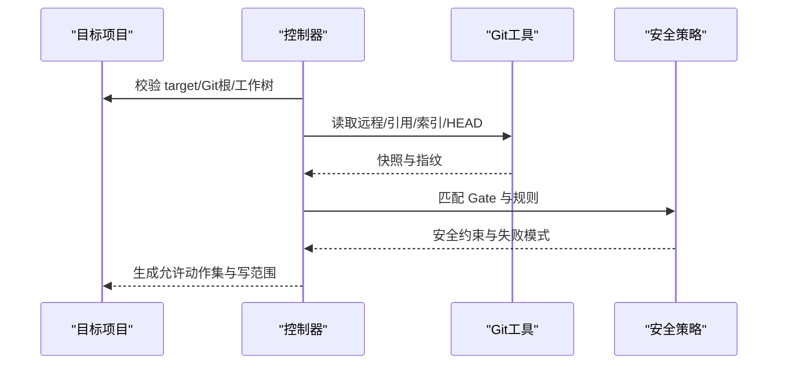

图表来源
- [scripts/harness.py:532-610](file://scripts/harness.py#L532-L610)
- [scripts/harness.py:1112-1136](file://scripts/harness.py#L1112-L1136)
- [scripts/harness.py:260-342](file://scripts/harness.py#L260-L342)
- [harness-home/rules/external-input-security.md:1-29](file://harness-home/rules/external-input-security.md#L1-L29)

章节来源
- [scripts/harness.py:532-610](file://scripts/harness.py#L532-L610)
- [scripts/harness.py:1112-1136](file://scripts/harness.py#L1112-L1136)
- [scripts/harness.py:260-342](file://scripts/harness.py#L260-L342)
- [harness-home/rules/external-input-security.md:1-29](file://harness-home/rules/external-input-security.md#L1-L29)

### 验证规则引擎（加载、执行顺序、结果聚合）
- 规则加载
  - 从 harness-home/rules/INDEX.md 获取 active_rules 与文件清单
  - 每个规则需 status: active、唯一 rule_id、完整 content_fingerprint 与合同字段
- 执行顺序
  - 按 Gate 顺序匹配规则；规则 failure_mode 决定停止与重新准入策略
- 结果聚合
  - 规则约束与 Gate 要求共同决定准入状态与下一步动作
  - 证据类型与审查要求由规则声明，控制器负责收据装配与复用

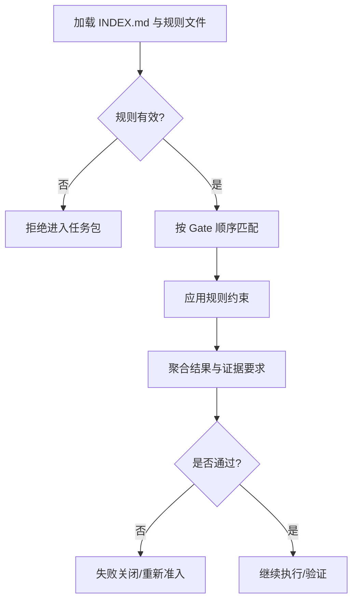

图表来源
- [harness-home/rules/INDEX.md:1-41](file://harness-home/rules/INDEX.md#L1-L41)
- [harness-home/rules/_rule-template.md:1-21](file://harness-home/rules/_rule-template.md#L1-L21)
- [scripts/harness.py:260-342](file://scripts/harness.py#L260-L342)

章节来源
- [harness-home/rules/INDEX.md:1-41](file://harness-home/rules/INDEX.md#L1-L41)
- [harness-home/rules/_rule-template.md:1-21](file://harness-home/rules/_rule-template.md#L1-L21)
- [scripts/harness.py:260-342](file://scripts/harness.py#L260-L342)

### Git 预检与后验（fetch/sync）
- 预检
  - 生成快照：repo_identity、remote、controlled_refs_namespace、worktree_fingerprint、refs、lfs/submodule 可用性
  - 变更范围：git diff --name-status -M 提取变更路径；删除阈值保护
  - 阻塞项：脏工作区重叠、非快进合并、LFS/Submodule 不可用
- 后验
  - 远端目标不变、受控引用未越界、分支未分歧、LFS/Submodule 校验
  - 返回 reason_code：git_remote_drift、git_ref_scope_violation、git_postcheck_failed

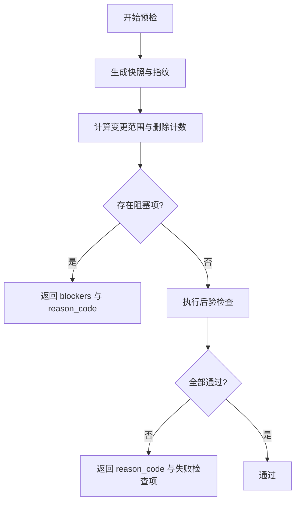

图表来源
- [scripts/harness.py:677-791](file://scripts/harness.py#L677-L791)
- [scripts/harness.py:793-875](file://scripts/harness.py#L793-L875)
- [tests/test_harness.py:651-709](file://tests/test_harness.py#L651-L709)

章节来源
- [scripts/harness.py:677-791](file://scripts/harness.py#L677-L791)
- [scripts/harness.py:793-875](file://scripts/harness.py#L793-L875)
- [tests/test_harness.py:651-709](file://tests/test_harness.py#L651-L709)

### 知识地图与文档路由
- 知识地图
  - schema_version、knowledge_level=L2、features 数组校验、四类文档路径与依赖校验
- 文档路由
  - 显式配置与自动发现；路径安全性检查（符号链接、越界、类型）
  - 指纹化与 required_kinds 约束；冲突与缺失错误分类

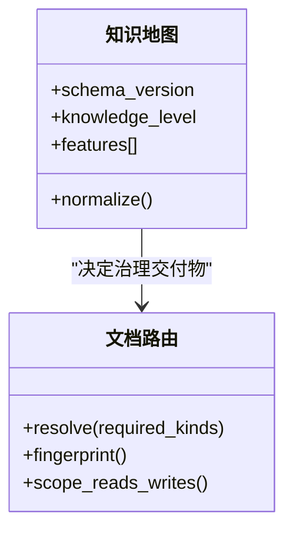

图表来源
- [scripts/harness.py:1526-1588](file://scripts/harness.py#L1526-L1588)
- [scripts/harness.py:1287-1456](file://scripts/harness.py#L1287-L1456)

章节来源
- [scripts/harness.py:1526-1588](file://scripts/harness.py#L1526-L1588)
- [scripts/harness.py:1287-1456](file://scripts/harness.py#L1287-L1456)

### 验证与证据（v2 收据、缓存、自动归因）
- 证据收据 v2
  - id、type、covers、task_id、target_identity、package_fingerprint、producer、command_argv_digest、changed_paths、read_set、write_set、conclusion
- 验证命令缓存
  - 默认开启，可通过 verification.command_cache_enabled 关闭
- 易失路径白名单
  - 内置目录/后缀/文件名白名单；支持 verification.volatile_paths 追加带固定根目录的 glob
- 自动归因
  - write_scope 内未归因写入默认自动归因，verification.auto_attribute_in_scope 可关闭

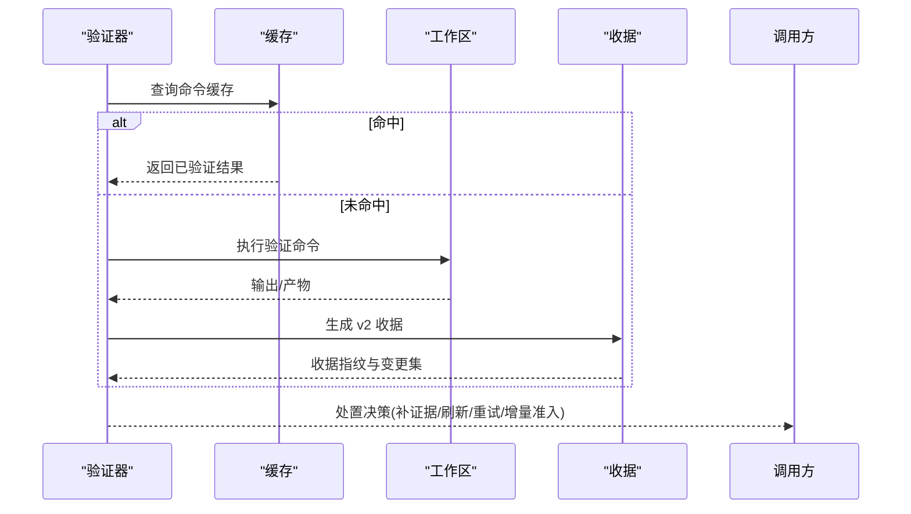

图表来源
- [scripts/harness.py:1188-1214](file://scripts/harness.py#L1188-L1214)
- [scripts/harness.py:1142-1234](file://scripts/harness.py#L1142-L1234)
- [tests/test_harness.py:248-304](file://tests/test_harness.py#L248-L304)

章节来源
- [scripts/harness.py:1188-1214](file://scripts/harness.py#L1188-L1214)
- [scripts/harness.py:1142-1234](file://scripts/harness.py#L1142-L1234)
- [tests/test_harness.py:248-304](file://tests/test_harness.py#L248-L304)

### 事件与状态机（next_action 与命令参数）
- 事件记录
  - events.jsonl 记录 phase、reason_code、duration_ms、context_cache_hit、evidence_round_count、host_receipt_count 等
- 下一步动作
  - load_plan_context、submit_plan、complete_plan_delta、load_action_context、obtain_authorization、provide_evidence、verify、retry_verification、rerun_harness_for_readmission、begin_work_package 等
- 命令参数组装
  - harness_command_argv 统一封装 CLI 调用参数

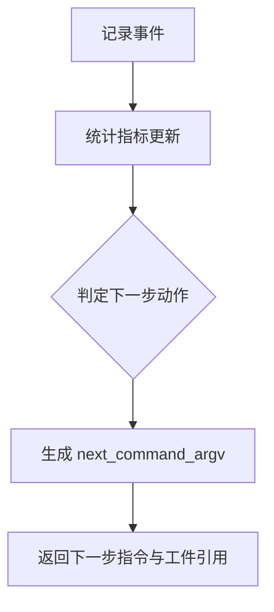

图表来源
- [scripts/harness.py:1031-1071](file://scripts/harness.py#L1031-L1071)
- [scripts/harness.py:936-1005](file://scripts/harness.py#L936-L1005)

章节来源
- [scripts/harness.py:1031-1071](file://scripts/harness.py#L1031-L1071)
- [scripts/harness.py:936-1005](file://scripts/harness.py#L936-L1005)

## 依赖关系分析
- 模块耦合
  - harness.py 依赖 Git 工具、文件系统、JSON 读写、哈希与时间戳
  - 规则系统通过 INDEX.md 与规则文件解耦；控制器仅读取与校验
- 外部依赖
  - Git（LFS/Submodule）、Python 标准库、子进程调用
- 循环依赖
  - 无循环导入；控制器为单入口，规则与测试为被依赖方

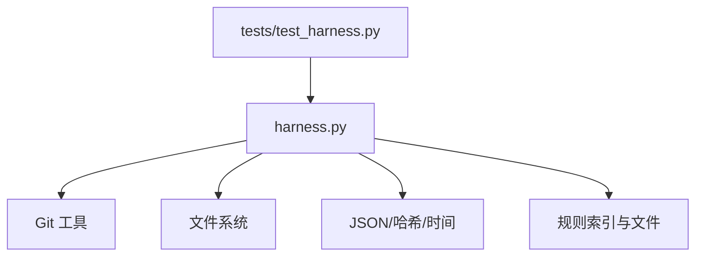

图表来源
- [scripts/harness.py:1-100](file://scripts/harness.py#L1-L100)
- [harness-home/rules/INDEX.md:1-41](file://harness-home/rules/INDEX.md#L1-L41)
- [tests/test_harness.py:1-120](file://tests/test_harness.py#L1-L120)

章节来源
- [scripts/harness.py:1-100](file://scripts/harness.py#L1-L100)
- [harness-home/rules/INDEX.md:1-41](file://harness-home/rules/INDEX.md#L1-L41)
- [tests/test_harness.py:1-120](file://tests/test_harness.py#L1-L120)

## 性能考量
- 快照与指纹
  - 大文件使用 size+mtime 指纹降低 IO；非 Git 工作区快照限制文件数上限
- 验证命令缓存
  - 默认开启，减少重复执行；可按需关闭
- Git 操作超时与批量
  - git_command 设置超时；diff/name-status 批量解析减少子进程开销
- 事件与状态锁
  - 原子写入与状态锁避免并发竞争；事件追加顺序写入

[本节为通用指导，无需特定文件来源]

## 故障排除指南
- 常见错误码与含义
  - invalid_facts、invalid_json、missing_file、invalid_target、unsafe_target、invalid_task_id、git_preflight_timeout、git_remote_unavailable、git_remote_ref_missing、git_scope_required、invalid_git_scope、git_sync_scope_ambiguous、git_target_object_missing、git_preflight_failed、git_remote_drift、git_ref_scope_violation、git_postcheck_failed、stale_lock、state_locked、invalid_project_config、invalid_document_route_config、document_route_unsafe、document_route_wrong_type、document_route_ambiguous、document_route_missing、invalid_knowledge_map、missing_feature_knowledge
- 定位步骤
  - 查看 events.jsonl 的 reason_code 与 phase
  - 检查 git_preflight_contract 的 blockers 与 git_postcheck 的 checks
  - 核对 rules/INDEX.md 与规则文件的 content_fingerprint 与字段完整性
  - 确认 knowledge-map.json 与 document_routes 的 required_kinds 与 resolved 状态
- 修复建议
  - 修正 --facts 结构与路径；清理脏工作区；确保 fast-forward；安装/启用 LFS/Submodule
  - 补齐规则指纹与字段；修复知识地图依赖与路径；明确文档路由

章节来源
- [scripts/harness.py:392-397](file://scripts/harness.py#L392-L397)
- [scripts/harness.py:677-875](file://scripts/harness.py#L677-L875)
- [harness-home/rules/INDEX.md:1-41](file://harness-home/rules/INDEX.md#L1-L41)
- [scripts/harness.py:1279-1456](file://scripts/harness.py#L1279-L1456)
- [scripts/harness.py:1526-1588](file://scripts/harness.py#L1526-L1588)

## 结论
Docs Harness 的意图验证系统以严格的语法与类型约束、语义分析与 Gate/规则引擎协同、Git 预检/后验保障、以及证据驱动的验证闭环，实现了“意图优先、证据可复用且失败关闭”的控制面。通过规则快照与索引化管理，系统在保持灵活性的同时确保了稳定性与可审计性。

[本节为总结，无需特定文件来源]

## 附录

### 自定义验证规则编写指南
- 基本结构
  - 使用 _rule-template.md 模板，填写 status、rule_id、content_fingerprint、gates、keywords、plan_fields、evidence_types、failure_mode
- 生效条件
  - 在 INDEX.md 中声明 active_rules 与对应文件；控制器会校验指纹与字段完整性
- 最佳实践
  - gates 精确匹配；keywords 使用精确词表并配合否定守卫；plan_fields 明确必需字段；evidence_types 限定证据类型；failure_mode 清晰说明失败处理方式

章节来源
- [harness-home/rules/_rule-template.md:1-21](file://harness-home/rules/_rule-template.md#L1-L21)
- [harness-home/rules/INDEX.md:1-41](file://harness-home/rules/INDEX.md#L1-L41)
- [harness-home/rules/api-compatibility.md:1-29](file://harness-home/rules/api-compatibility.md#L1-L29)
- [harness-home/rules/external-input-security.md:1-29](file://harness-home/rules/external-input-security.md#L1-L29)
- [harness-home/rules/documentation-changes.md:1-29](file://harness-home/rules/documentation-changes.md#L1-L29)