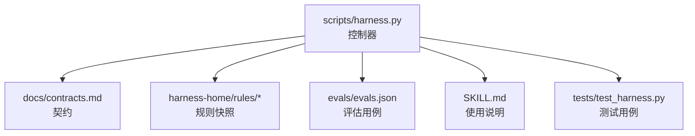
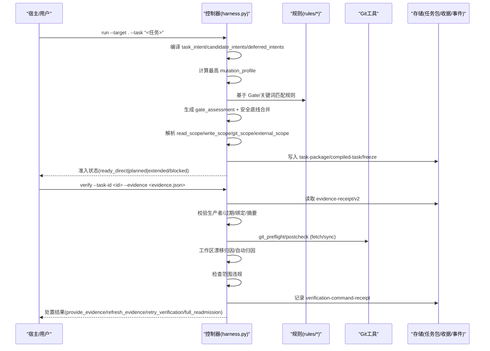
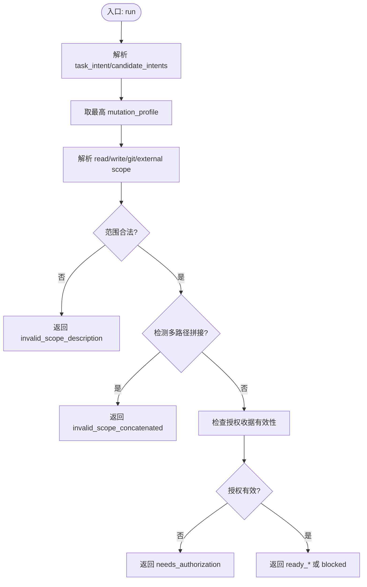
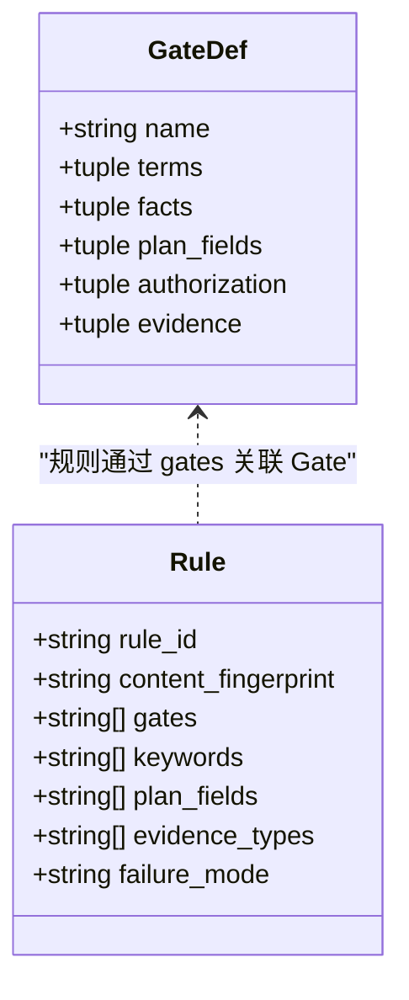
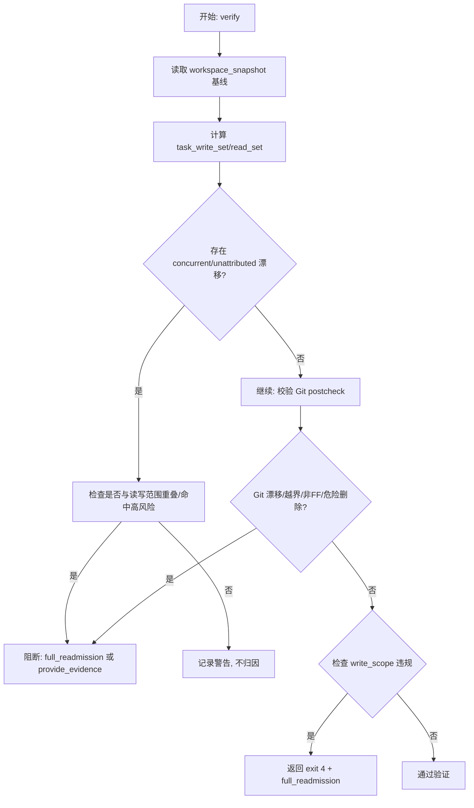
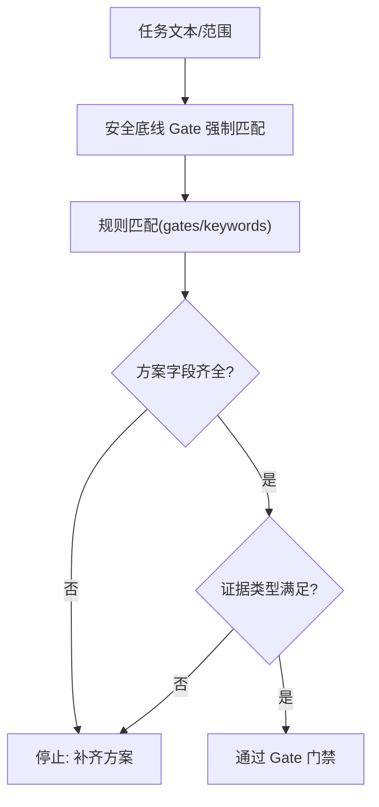
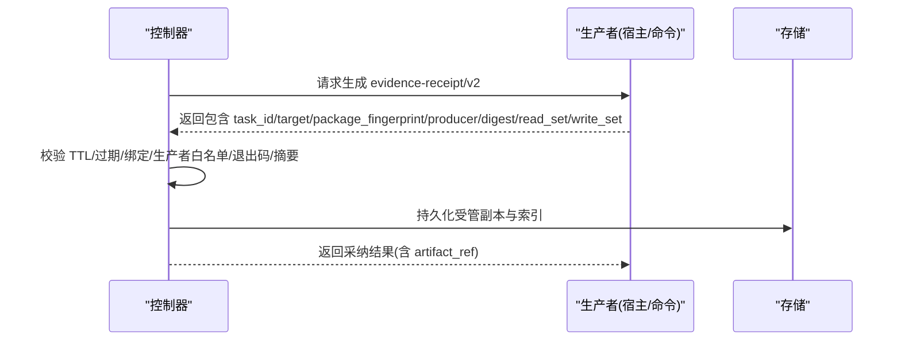
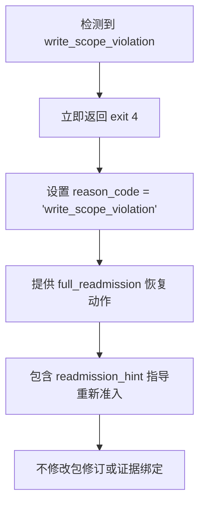
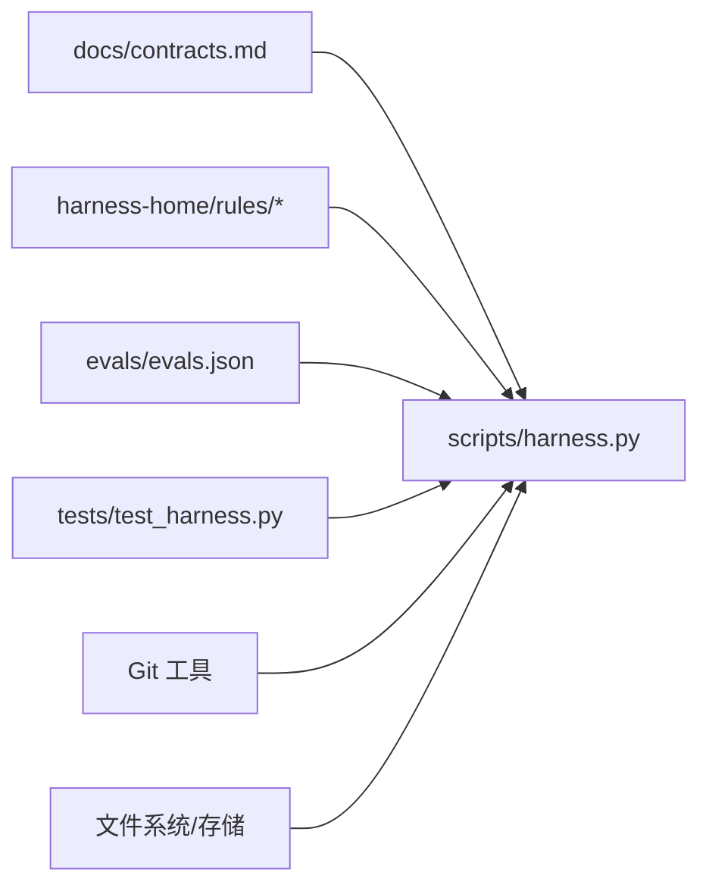

# 范围评估与授权

<cite>
**本文引用的文件**   
- [scripts/harness.py](file://scripts/harness.py)
- [docs/contracts.md](file://docs/contracts.md)
- [SKILL.md](file://SKILL.md)
- [harness-home/rules/INDEX.md](file://harness-home/rules/INDEX.md)
- [harness-home/rules/external-input-security.md](file://harness-home/rules/external-input-security.md)
- [harness-home/rules/scope-change-readmission.md](file://harness-home/rules/scope-change-readmission.md)
- [harness-home/rules/release-authorization-rollback.md](file://harness-home/rules/release-authorization-rollback.md)
- [evals/evals.json](file://evals/evals.json)
- [tests/test_harness.py](file://tests/test_harness.py)
</cite>

## 更新摘要
**变更内容**   
- **重要变更**：完全移除了验证过程中的自动范围扩展机制 - 任何 write_scope_violation 现在都会立即退出并返回退出码 4，要求完整重新准入，不再修改包修订或重新绑定旧证据
- 增强了write_scope验证机制，新增多路径拼接检测（invalid_scope_concatenated错误）
- 更新了范围评估算法，包含更严格的输入验证和智能扩展逻辑
- 完善了故障排查指南，涵盖新的错误类型和处理流程

## 目录
1. [简介](#简介)
2. [项目结构](#项目结构)
3. [核心组件](#核心组件)
4. [架构总览](#架构总览)
5. [详细组件分析](#详细组件分析)
6. [依赖关系分析](#依赖关系分析)
7. [性能考量](#性能考量)
8. [故障排查指南](#故障排查指南)
9. [结论](#结论)
10. [附录：权限矩阵与示例](#附录权限矩阵与示例)

## 简介
本文件面向 Docs Harness 的"范围评估与授权系统"，系统性阐述写作用户域控制、权限验证、范围评估算法、安全门控机制、授权收据生成与验证，以及规则配置与自定义策略开发。文档以控制器源码与合同定义为依据，辅以规则目录与测试用例，帮助读者从概念到实现全面理解该系统的行为与边界。

**重要更新** 本次更新完全移除了验证过程中的自动范围扩展机制，任何 write_scope_violation 都会立即导致退出码 4 并要求完整重新准入，不再支持增量扩围或自动修改包修订。

## 项目结构
Docs Harness 的核心由控制器脚本、合同文档、规则快照与评估用例组成：
- scripts/harness.py：任务控制器，负责意图编译、Gate 判定、范围与授权、证据与验收、Git 预检/后检、后台治理等。
- docs/contracts.md：对外契约，定义任务包、证据收据、上下文与授权收据、Git 状态、退出码等。
- harness-home/rules/*：受管规则快照，按 Gate 与关键词匹配激活，约束方案字段与证据类型。
- evals/evals.json：覆盖范围评估、授权、Git 校验、证据收据等关键场景的期望断言。
- SKILL.md：高层使用说明，强调 run/verify 流程、Gate 声明与底线、幂等复用等。

**图表来源**
- [scripts/harness.py:1-200](file://scripts/harness.py#L1-L200)
- [docs/contracts.md:1-120](file://docs/contracts.md#L1-L120)
- [harness-home/rules/INDEX.md:1-41](file://harness-home/rules/INDEX.md#L1-L41)
- [evals/evals.json:1-175](file://evals/evals.json#L1-L175)
- [SKILL.md:1-105](file://SKILL.md#L1-L105)
- [tests/test_harness.py:1-100](file://tests/test_harness.py#L1-L100)

章节来源
- [scripts/harness.py:1-200](file://scripts/harness.py#L1-L200)
- [docs/contracts.md:1-120](file://docs/contracts.md#L1-L120)
- [harness-home/rules/INDEX.md:1-41](file://harness-home/rules/INDEX.md#L1-L41)
- [evals/evals.json:1-175](file://evals/evals.json#L1-L175)
- [SKILL.md:1-105](file://SKILL.md#L1-L105)
- [tests/test_harness.py:1-100](file://tests/test_harness.py#L1-L100)

## 核心组件
- 意图与变更面（Mutation Profile）：query/audit/git_inspect/git_fetch/git_sync/modify/external_write，映射到 read_only/git_metadata_write/workspace_write/external_write。
- Gate 体系：product-change、architecture-contract、security-sensitive、destructive-data、release-external、frontend-design、diagnosis-fix、testing-acceptance、review-audit、code-edit、document-edit；其中 security-sensitive、destructive-data、release-external 为强制安全底线。
- 范围与授权：read_scope/write_scope/git_scope/external_scope；授权收据绑定 package fingerprint，跨修订不复用。
- 证据与收据：evidence-receipt/v2、verification-command-receipt/v1、context-receipt/v2、authorization-receipt/v2；支持自动归因与命令缓存。
- Git 预检/后检：git_preflight_contract/git_postcheck，冻结远端 OID、refs 命名空间、工作区指纹，检测漂移与危险操作。
- 后台治理：background-job/v2，数据面与控制面分离，复杂路线需 prepare/dispatched/running/progress/verify。

**重要变更** 移除了增量的write_scope扩展机制，不再支持在验证过程中智能扩展任务范围。

章节来源
- [scripts/harness.py:197-231](file://scripts/harness.py#L197-L231)
- [scripts/harness.py:260-342](file://scripts/harness.py#L260-L342)
- [scripts/harness.py:677-791](file://scripts/harness.py#L677-L791)
- [docs/contracts.md:9-133](file://docs/contracts.md#L9-L133)
- [docs/contracts.md:165-221](file://docs/contracts.md#L165-L221)
- [docs/contracts.md:303-348](file://docs/contracts.md#L303-L348)

## 架构总览
下图展示控制器在 run/verify 主路径中的关键交互：意图编译、Gate 判定、范围与授权、证据与验收、Git 校验与后台治理。

**图表来源**
- [scripts/harness.py:197-231](file://scripts/harness.py#L197-L231)
- [scripts/harness.py:260-342](file://scripts/harness.py#L260-L342)
- [scripts/harness.py:677-791](file://scripts/harness.py#L677-L791)
- [docs/contracts.md:9-133](file://docs/contracts.md#L9-L133)
- [docs/contracts.md:165-221](file://docs/contracts.md#L165-L221)

## 详细组件分析

### 写作用户域控制与权限验证
- 意图到变更面的映射决定默认路由与授权强度；混合意图取最高变更面。
- 范围字段仅接受项目内相对路径、glob 或受控 Git 资源；自然语言边界返回 invalid_scope_description。
- **新增** 多路径拼接检测：当检测到使用分号、逗号、制表符等符号拼接多个路径时，返回 invalid_scope_concatenated 错误，要求每个路径必须是独立条目。
- 授权收据始终绑定当前 package fingerprint，跨修订不复用；上下文收据需满足 task_id/target/stage/compiler_contract/content_set_fingerprint 全命中。
- 只读查询允许空 write_scope；Git inspect/fetch/sync 分别使用不同合同与风险等级。

**图表来源**
- [scripts/harness.py:197-231](file://scripts/harness.py#L197-L231)
- [scripts/harness.py:2728-2760](file://scripts/harness.py#L2728-L2760)
- [docs/contracts.md:9-48](file://docs/contracts.md#L9-L48)
- [docs/contracts.md:222-234](file://docs/contracts.md#L222-L234)

章节来源
- [scripts/harness.py:197-231](file://scripts/harness.py#L197-L231)
- [scripts/harness.py:2728-2760](file://scripts/harness.py#L2728-L2760)
- [docs/contracts.md:9-48](file://docs/contracts.md#L9-L48)
- [docs/contracts.md:222-234](file://docs/contracts.md#L222-L234)

### Gate 与规则匹配
- Gate 顺序与定义固定，安全底线 Gate 不可豁免；宿主可提交 gate_assessment 进行权威语义判断，但底线仍强制并入。
- 规则按 status: active、唯一 rule_id、content_fingerprint 与完整合同字段生效；缺失或变化失败关闭。
- 规则通过 gates/keywords 触发，要求 plan_fields 与 evidence_types，failure_mode 明确失败处理。

**图表来源**
- [scripts/harness.py:260-342](file://scripts/harness.py#L260-L342)
- [harness-home/rules/INDEX.md:1-41](file://harness-home/rules/INDEX.md#L1-L41)
- [harness-home/rules/external-input-security.md:1-29](file://harness-home/rules/external-input-security.md#L1-L29)
- [harness-home/rules/scope-change-readmission.md:1-29](file://harness-home/rules/scope-change-readmission.md#L1-L29)
- [harness-home/rules/release-authorization-rollback.md:1-29](file://harness-home/rules/release-authorization-rollback.md#L1-L29)

章节来源
- [scripts/harness.py:260-342](file://scripts/harness.py#L260-L342)
- [harness-home/rules/INDEX.md:1-41](file://harness-home/rules/INDEX.md#L1-L41)
- [harness-home/rules/external-input-security.md:1-29](file://harness-home/rules/external-input-security.md#L1-L29)
- [harness-home/rules/scope-change-readmission.md:1-29](file://harness-home/rules/scope-change-readmission.md#L1-L29)
- [harness-home/rules/release-authorization-rollback.md:1-29](file://harness-home/rules/release-authorization-rollback.md#L1-L29)

### 范围评估算法（文件变更影响分析与依赖评估）
- 首次基线 freeze.json.workspace_snapshot 用于漂移检测；verify 输出 task_write_set/read_set/concurrent_drift/unattributed_drift。
- 阻断规则包括超出 write_scope、读取事实漂移、concurrent/unattributed 与读写范围重叠、命中高风险边界、新增风险 Gate/规则指纹变化。
- **重要变更** 完全移除了增量扩展机制：当检测到越界写入时，系统不再尝试自动扩展 write_scope，而是直接返回 write_scope_violation 错误并退出码 4，要求完整重新准入。
- Git 预检生成 snapshot 并冻结目标 OID、controlled_refs_namespace、worktree_fingerprint；后检比对差异与危险删除阈值。

**图表来源**
- [docs/contracts.md:134-163](file://docs/contracts.md#L134-L163)
- [scripts/harness.py:6416-6552](file://scripts/harness.py#L6416-L6552)
- [scripts/harness.py:7587-7607](file://scripts/harness.py#L7587-L7607)

章节来源
- [docs/contracts.md:134-163](file://docs/contracts.md#L134-L163)
- [scripts/harness.py:6416-6552](file://scripts/harness.py#L6416-L6552)
- [scripts/harness.py:7587-7607](file://scripts/harness.py#L7587-L7607)

### 安全门控机制（敏感操作拦截、外部系统集成限制、数据访问控制）
- 安全底线 Gate：security-sensitive、destructive-data、release-external；文本触发使用精确词表与否定守卫，避免误报。
- 外部输入安全规则要求信任边界、最小权限、秘密处理、数据留存与负向路径证明。
- 发布授权与回滚规则要求冻结外部目标、产物身份、授权范围、发布步骤、观测窗口与回滚路径。

**图表来源**
- [scripts/harness.py:381-389](file://scripts/harness.py#L381-L389)
- [harness-home/rules/external-input-security.md:1-29](file://harness-home/rules/external-input-security.md#L1-L29)
- [harness-home/rules/release-authorization-rollback.md:1-29](file://harness-home/rules/release-authorization-rollback.md#L1-L29)

章节来源
- [scripts/harness.py:381-389](file://scripts/harness.py#L381-L389)
- [harness-home/rules/external-input-security.md:1-29](file://harness-home/rules/external-input-security.md#L1-L29)
- [harness-home/rules/release-authorization-rollback.md:1-29](file://harness-home/rules/release-authorization-rollback.md#L1-L29)

### 授权收据生成与验证（不可抵赖性）
- 授权收据 schema_version=docs-harness/authorization-receipt/v2，始终绑定当前 package fingerprint，不跨修订复用。
- 上下文收据需满足 task_id/target/stage/compiler_contract/content_set_fingerprint 全命中；跨任一条件重载。
- 证据收据 v2 要求可信生产者、TTL、cwd、exit_code、digest、read_set/write_set；报告型旧证据不满足高风险证据要求。

**图表来源**
- [docs/contracts.md:165-221](file://docs/contracts.md#L165-221)
- [docs/contracts.md:222-234](file://docs/contracts.md#L222-L234)
- [scripts/harness.py:4279-4314](file://scripts/harness.py#L4279-L4314)

章节来源
- [docs/contracts.md:165-221](file://docs/contracts.md#L165-221)
- [docs/contracts.md:222-234](file://docs/contracts.md#L222-L234)
- [scripts/harness.py:4279-4314](file://scripts/harness.py#L4279-L4314)

### 自定义授权策略开发指南
- 规则文件必须包含 status: active、唯一 rule_id、content_fingerprint、gates/keywords/plan_fields/evidence_types/failure_mode。
- 规则加载约定：安装时复制固定快照，记录逐文件指纹；缺失/增加/变化均失败关闭，需通过升级或人工 preserve-and-merge。
- 建议将策略与 Gate 对齐，明确触发关键词、必需方案字段与证据类型，确保失败模式清晰可审计。

章节来源
- [harness-home/rules/INDEX.md:1-41](file://harness-home/rules/INDEX.md#L1-L41)
- [harness-home/rules/external-input-security.md:1-29](file://harness-home/rules/external-input-security.md#L1-L29)
- [harness-home/rules/scope-change-readmission.md:1-29](file://harness-home/rules/scope-change-readmission.md#L1-L29)
- [harness-home/rules/release-authorization-rollback.md:1-29](file://harness-home/rules/release-authorization-rollback.md#L1-L29)

### 范围扩展机制变更说明（重要更新）
**重要变更** 系统已完全移除自动范围扩展功能：

- **移除的功能**：`incrementally_extend_write_scope` 函数已被完全移除
- **新的行为**：任何 write_scope_violation 都会立即返回退出码 4，要求完整重新准入
- **不再支持**：增量扩围、自动修改包修订、重新绑定旧证据
- **测试保证**：所有测试用例都验证了自动范围扩展功能的移除

**图表来源**
- [scripts/harness.py:6545](file://scripts/harness.py#L6545)
- [scripts/harness.py:7989-8004](file://scripts/harness.py#L7989-L8004)
- [tests/test_harness.py:7211-7212](file://tests/test_harness.py#L7211-L7212)

章节来源
- [scripts/harness.py:6545](file://scripts/harness.py#L6545)
- [scripts/harness.py:7989-8004](file://scripts/harness.py#L7989-L8004)
- [tests/test_harness.py:7211-7212](file://tests/test_harness.py#L7211-L7212)

## 依赖关系分析
- 控制器依赖契约定义、规则快照、Git 工具与文件系统；证据与收据依赖受管存储。
- 规则与 Gate 一一对应，Gate 顺序与安全底线保证强约束。
- 评估用例覆盖意图编译、范围合同、Git 预检/后检、证据收据、上下文完成、迁移与回滚等关键路径。

**图表来源**
- [docs/contracts.md:1-120](file://docs/contracts.md#L1-L120)
- [harness-home/rules/INDEX.md:1-41](file://harness-home/rules/INDEX.md#L1-L41)
- [evals/evals.json:1-175](file://evals/evals.json#L1-L175)
- [tests/test_harness.py:1-100](file://tests/test_harness.py#L1-L100)
- [scripts/harness.py:1-200](file://scripts/harness.py#L1-L200)

章节来源
- [docs/contracts.md:1-120](file://docs/contracts.md#L1-L120)
- [harness-home/rules/INDEX.md:1-41](file://harness-home/rules/INDEX.md#L1-L41)
- [evals/evals.json:1-175](file://evals/evals.json#L1-L175)
- [tests/test_harness.py:1-100](file://tests/test_harness.py#L1-L100)
- [scripts/harness.py:1-200](file://scripts/harness.py#L1-L200)

## 性能考量
- 验证命令缓存：相同 argv 与输入指纹直接复用收据，减少重复执行；可通过配置整体关闭。
- 自动归因：write_scope 内未归因写入可由控制器代铸 workspace_attribution 收据，避免补证循环。
- **重要变更** 移除了增量准入机制：不再有增量 package revision 和同轮证据继承，所有范围变更都需要完整重新准入。
- Git 预检/后检冻结 OID 与 refs 命名空间，避免重复计算与漂移误判。

章节来源
- [docs/contracts.md:165-221](file://docs/contracts.md#L165-L221)
- [docs/contracts.md:134-163](file://docs/contracts.md#L134-L163)
- [scripts/harness.py:6416-6552](file://scripts/harness.py#L6416-L6552)
- [scripts/harness.py:677-791](file://scripts/harness.py#L677-L791)

## 故障排查指南
- 常见退出码：0 成功；1 项目检查失败；2 输入/合同无效；3 需要方案/授权/证据/迁移/用户输入/Git 交付；4 范围/漂移/Gate/远端/授权/规则变化需重新准入。
- Git 相关失败：remote_unavailable、ref_missing、non-fast-forward、dirty-overlap、LFS/Submodule 不可用等。
- 证据问题：过期、跨任务/目标、不可信生产者、非零退出、摘要无效；高风险证据必须由可信 v2 生产者提供。
- 规则问题：指纹漂移或缺失导致失败关闭；需通过升级或人工 preserve-and-merge。
- **新增** 范围验证错误：
  - `invalid_scope_concatenated`：检测到多路径拼接，需将每个路径作为独立条目传入
  - **重要变更** `write_scope_violation`：任何范围违规现在都要求完整重新准入，不再支持自动扩围

章节来源
- [docs/contracts.md:359-370](file://docs/contracts.md#L359-L370)
- [scripts/harness.py:677-791](file://scripts/harness.py#L677-L791)
- [scripts/harness.py:2728-2760](file://scripts/harness.py#L2728-L2760)
- [scripts/harness.py:7587-7607](file://scripts/harness.py#L7587-L7607)
- [docs/contracts.md:165-221](file://docs/contracts.md#L165-221)
- [harness-home/rules/INDEX.md:1-41](file://harness-home/rules/INDEX.md#L1-L41)

## 结论
Docs Harness 的范围评估与授权系统以契约为中心，结合 Gate 与规则、严格的范围与授权收据、Git 预检/后检与证据收据，构建了高可靠、可审计、可扩展的任务执行与验收框架。**重要变更**：完全移除了自动范围扩展机制，任何 write_scope_violation 都会立即要求完整重新准入，这进一步增强了系统的安全性和一致性。通过安全底线、严格范围控制和命令缓存等机制，在保证安全性的同时提升效率。遵循规则与合同，可实现稳定的授权策略与自定义扩展。

## 附录：权限矩阵与示例

### 权限矩阵（意图→变更面→典型 Gate）
- query → read_only → 通常无高风险 Gate
- audit → read_only（高风险可升级） → review-audit/code-edit/testing-acceptance
- git_inspect → read_only → 无高风险 Gate
- git_fetch → git_metadata_write → 无高风险 Gate
- git_sync → workspace_write → testing-acceptance/code-edit/document-edit（视范围）
- modify → workspace_write → code-edit/testing-acceptance/document-edit（视范围）
- external_write → external_write → release-external/security-sensitive/destructive-data（视语义）

章节来源
- [scripts/harness.py:197-231](file://scripts/harness.py#L197-L231)
- [scripts/harness.py:260-342](file://scripts/harness.py#L260-L342)

### 实际授权场景示例
- 只读查询：read_only + write_scope=[]，直接准入，无需额外证据。
- 代码修改：workspace_write，需测试验收证据；若涉及 API/Schema，触发 architecture-contract。
- 发布上线：external_write，强制 release-external Gate，需外部状态证据与回滚能力。
- 安全鉴权：security-sensitive Gate，需安全边界与负向路径证据。
- 范围变化：scope-change-readmission，需新范围进入新任务包版本，旧上下文不得错误复用。
- **重要变更** 范围违规：任何 write_scope_violation 现在都立即要求完整重新准入，不再支持自动扩围。

章节来源
- [docs/contracts.md:9-133](file://docs/contracts.md#L9-L133)
- [harness-home/rules/scope-change-readmission.md:1-29](file://harness-home/rules/scope-change-readmission.md#L1-L29)
- [harness-home/rules/release-authorization-rollback.md:1-29](file://harness-home/rules/release-authorization-rollback.md#L1-L29)
- [harness-home/rules/external-input-security.md:1-29](file://harness-home/rules/external-input-security.md#L1-L29)
- [scripts/harness.py:6416-6552](file://scripts/harness.py#L6416-L6552)
- [tests/test_harness.py:6885-6996](file://tests/test_harness.py#L6885-L6996)