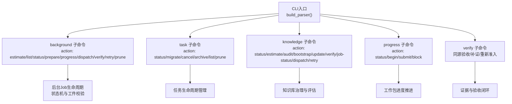
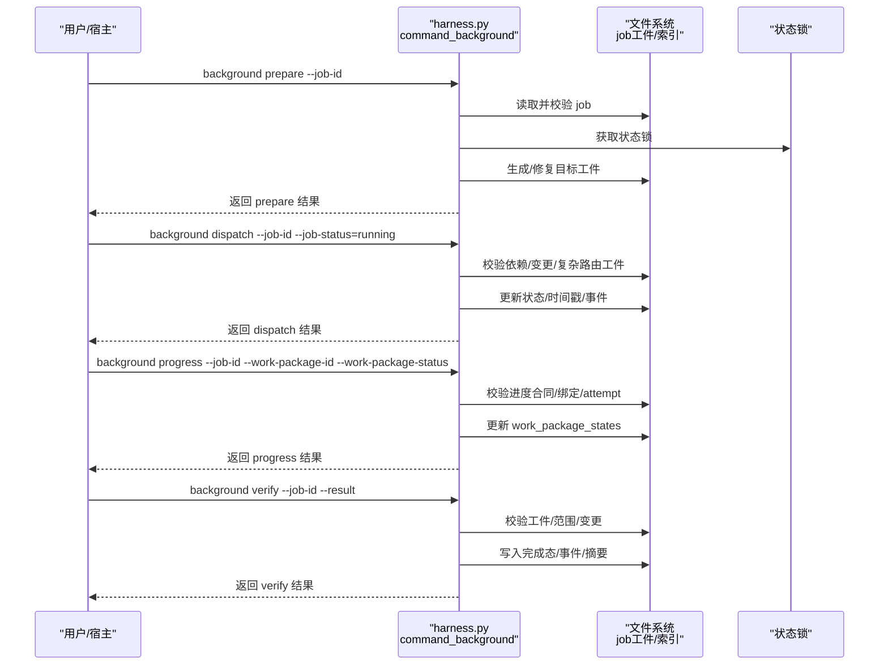
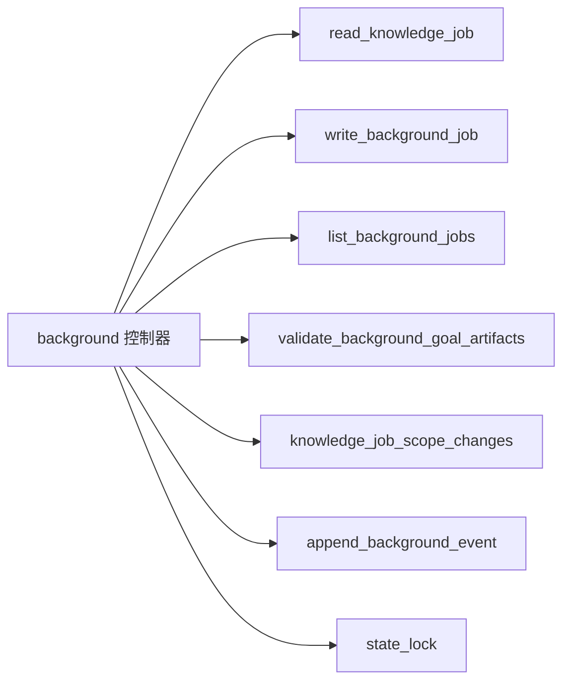

# CLI命令参考

<cite>
**本文引用的文件**   
- [scripts/harness.py](file://scripts/harness.py)
- [tests/test_harness.py](file://tests/test_harness.py)
- [package.json](file://package.json)
</cite>

## 目录
1. [简介](#简介)
2. [项目结构](#项目结构)
3. [核心组件](#核心组件)
4. [架构总览](#架构总览)
5. [详细命令说明](#详细命令说明)
6. [依赖关系分析](#依赖关系分析)
7. [性能与可靠性](#性能与可靠性)
8. [故障排除指南](#故障排除指南)
9. [结论](#结论)
10. [附录：错误码速查](#附录错误码速查)

## 简介
本参考文档面向 Docs Harness 的后台任务 CLI，聚焦 background 子命令集（estimate、list、status、prepare、progress、dispatch、verify、retry、prune），以及与之配套的 task、knowledge、progress、verify 等通用命令。文档基于源码实现梳理命令语法、参数、输出字段、状态机与常见工作流，并提供最佳实践与排错建议。所有命令行为与选项均以 scripts/harness.py 中的解析器与处理逻辑为准。

## 项目结构
- 入口脚本：scripts/harness.py 提供完整的 argparse 子命令定义与业务实现。
- 测试用例：tests/test_harness.py 覆盖典型使用路径与边界条件。
- 包元数据：package.json 声明版本与自测脚本。

图表来源
- [scripts/harness.py:10175-10294](file://scripts/harness.py#L10175-L10294)
- [scripts/harness.py:8644-9000](file://scripts/harness.py#L8644-L9000)

章节来源
- [scripts/harness.py:10175-10294](file://scripts/harness.py#L10175-L10294)
- [package.json:1-23](file://package.json#L1-L23)

## 核心组件
- CLI 解析器：统一注册子命令与公共参数 --target、--json。
- background 控制器：负责后台 Job 的估计、清单、状态、准备、进度、分发、验收、重试与清理。
- 任务与知识控制器：task/knowledge 与 background 协同完成治理与知识维护。
- 进度与验收：progress/verify 驱动工作包状态流转与证据验收。

章节来源
- [scripts/harness.py:10175-10294](file://scripts/harness.py#L10175-L10294)
- [scripts/harness.py:8644-9000](file://scripts/harness.py#L8644-L9000)

## 架构总览
下图展示 background 命令的核心调用链与状态流转要点。

图表来源
- [scripts/harness.py:8644-9000](file://scripts/harness.py#L8644-L9000)
- [scripts/harness.py:7107-7120](file://scripts/harness.py#L7107-L7120)
- [scripts/harness.py:7452-7480](file://scripts/harness.py#L7452-L7480)

## 详细命令说明

### 公共参数
- --target：项目根目录（默认当前目录）。
- --json：以 JSON 格式输出。

章节来源
- [scripts/harness.py:10170-10173](file://scripts/harness.py#L10170-L10173)

### background 子命令
- action 枚举：estimate、list、status、prepare、progress、dispatch、verify、retry、prune。
- 常用参数：--candidate、--job-id、--job-status、--work-package-id、--work-package-status、--reason-code、--repair、--assessment、--result、--older-than、--apply、--dry-run。

#### background estimate
- 作用：估算工作量并持久化估计结果。
- 输入：--candidate（可选，候选项 JSON 文件）。
- 输出：包含 action、估算详情与 estimate_ref 字段。
- 注意：若 schema 无效将报错。

章节来源
- [scripts/harness.py:8656-8669](file://scripts/harness.py#L8656-L8669)

#### background list
- 作用：列出后台 Job 清单。
- 输出：jobs 数组（含 job_id、task_kind、parent_task_id、status、execution_route、attempt、max_attempts、created_at、updated_at）与 count。

章节来源
- [scripts/harness.py:8670-8685](file://scripts/harness.py#L8670-L8685)

#### background status
- 作用：查询指定 Job 的状态与完整信息。
- 必需：--job-id。
- 输出：action 与 job 对象。

章节来源
- [scripts/harness.py:8725-8726](file://scripts/harness.py#L8725-L8726)

#### background prepare
- 作用：为复杂路由 Job 准备目标工件（goal artifacts），支持修复模式。
- 必需：--job-id；可选 --repair。
- 输出：prepare 动作的结果，包含工件指纹等信息。
- 注意：复杂路由在后续 dispatch 前必须完成 prepare。

章节来源
- [scripts/harness.py:8749-8750](file://scripts/harness.py#L8749-L8750)

#### background progress
- 作用：推进 extended 工作包状态（begin/submit/block/status）。
- 必需：--job-id、--work-package-id、--work-package-status。
- 可选：--evidence、--reason、--scope-changed、--handoff。
- 输出：progress 动作结果，包含状态更新与事件记录。
- 注意：进度合同需绑定当前 Job 且 attempt 一致。

章节来源
- [scripts/harness.py:8751-8756](file://scripts/harness.py#L8751-L8756)
- [scripts/harness.py:7337-7383](file://scripts/harness.py#L7337-L7383)

#### background dispatch
- 作用：受控地切换 Job 状态（如 contract_ready→dispatched→running 等）。
- 必需：--job-id、--job-status（需在允许的状态转移集合内）。
- 输出：dispatch 动作结果，可能包含 next_action 与 next_command_argv 提示下一步操作。
- 注意：
  - 复杂路由需要 goal_contract 与已准备的工件。
  - running 前会检查知识变更并加锁。
  - 非法转移将记录事件并返回错误码。

章节来源
- [scripts/harness.py:8757-8834](file://scripts/harness.py#L8757-L8834)

#### background verify
- 作用：对运行中 Job 进行验收，支持 updated/no_change/completed_with_finding。
- 必需：--job-id、--result。
- 可选：--assessment（重大发现或知识更新验收报告）。
- 输出：verify 动作结果，包含 blocked_work_package_ids、critical_followup_job_id、knowledge_status 等。
- 注意：
  - 仅 running 状态可验收。
  - 复杂路由需全部工作包 completed 才能 updated/no_change。
  - no_change 时若知识未就绪将进入 needs_user_input。

章节来源
- [scripts/harness.py:8877-8998](file://scripts/harness.py#L8877-L8998)

#### background retry
- 作用：对可重试状态的 Job 进行重试，重置工件并递增 attempt。
- 必需：--job-id。
- 输出：retry 动作结果，包含 attempt 与 requires_prepare 标志。
- 注意：超过最大尝试次数将直接失败。

章节来源
- [scripts/harness.py:8835-8876](file://scripts/harness.py#L8835-L8876)

#### background prune
- 作用：按时间阈值清理已完成/终态的旧 Job 工件。
- 必需：--older-than（非负天数）。
- 可选：--apply（应用删除）、--dry-run（仅生成候选）。
- 输出：mode（dry_run/apply）、candidates、removed 列表。
- 注意：--apply 与 --dry-run 不可同时使用。

章节来源
- [scripts/harness.py:8686-8721](file://scripts/harness.py#L8686-L8721)

### task 子命令（与后台任务相关）
- action：status、migrate、cancel、archive、list、prune。
- 常用参数：--task-id、--apply、--reason-code、--older-than、--dry-run、--include-archived。
- 用途：查询、取消、归档、清理任务或迁移 v1 在途任务。

章节来源
- [scripts/harness.py:10239-10248](file://scripts/harness.py#L10239-L10248)

### knowledge 子命令（与后台任务相关）
- action：status、estimate、audit、bootstrap、update、verify、job-status、dispatch、retry。
- 常用参数：--assessment、--consent、--job-id、--job-status、--result。
- 用途：功能知识库审查、评估与后台入口。

章节来源
- [scripts/harness.py:10261-10268](file://scripts/harness.py#L10261-L10268)

### progress 子命令（工作包进度）
- action：status、begin、submit、block。
- 必需：--task-id；begin/submit/block 还需 --work-package；submit 还需 --evidence。
- 用途：推进工作包状态与提交证据。

章节来源
- [scripts/harness.py:10215-10227](file://scripts/harness.py#L10215-L10227)

### verify 子命令（同源验收）
- 必需：--task-id。
- 可选：--evidence（可重复）。
- 用途：对任务进行同源验收、补证或重新准入。

章节来源
- [scripts/harness.py:10229-10237](file://scripts/harness.py#L10229-L10237)

## 依赖关系分析
- background 控制器依赖：
  - 作业读写：read_knowledge_job/write_background_job。
  - 作业清单与索引：list_background_jobs/background_indexed_keys。
  - 工件校验：validate_background_goal_artifacts。
  - 变更检测：knowledge_job_scope_changes。
  - 事件记录：append_background_event。
  - 状态锁：state_lock。
- 与 knowledge/task/progress/verify 的协作通过统一的 CLI 入口与 next_step_payload 机制衔接。

图表来源
- [scripts/harness.py:7107-7120](file://scripts/harness.py#L7107-L7120)
- [scripts/harness.py:7452-7480](file://scripts/harness.py#L7452-L7480)
- [scripts/harness.py:8644-9000](file://scripts/harness.py#L8644-L9000)

章节来源
- [scripts/harness.py:7107-7120](file://scripts/harness.py#L7107-L7120)
- [scripts/harness.py:7452-7480](file://scripts/harness.py#L7452-L7480)
- [scripts/harness.py:8644-9000](file://scripts/harness.py#L8644-L9000)

## 性能与可靠性
- 原子写入与快照：JSON 写入采用原子替换，工作区快照忽略敏感目录与大文件哈希，避免阻塞。
- 并发控制：状态锁防止同一 Job 被多进程并发修改，过期锁检测避免死锁。
- 事件审计：关键动作均追加事件到 events.jsonl，便于回溯与诊断。
- 预检与后验：Git 操作（fetch/sync）前后均有预检与后验，确保引用与内容一致性。

章节来源
- [scripts/harness.py:419-434](file://scripts/harness.py#L419-L434)
- [scripts/harness.py:1008-1029](file://scripts/harness.py#L1008-L1029)
- [scripts/harness.py:1031-1071](file://scripts/harness.py#L1031-L1071)
- [scripts/harness.py:677-876](file://scripts/harness.py#L677-L876)

## 故障排除指南
- 常见错误场景
  - 缺少必要参数：如 background progress 未提供 --work-package-id/--work-package-status。
  - 非法状态转移：dispatch 传入的 --job-status 不在允许转移集合。
  - 工件校验失败：complex route 缺少 goal_contract 或工件指纹不一致。
  - 知识变更冲突：dispatch 前检测到知识变更导致 rebase。
  - 验收不满足条件：completed_with_finding 未提供 --assessment 或 no_change 但知识未就绪。
- 排查步骤
  - 使用 background status 查看当前状态与时间戳。
  - 检查 events.jsonl 定位最近事件与 reason_code。
  - 确认工件完整性与指纹是否匹配。
  - 对于知识类 Job，确保 knowledge 评估 ready。
  - 必要时执行 background retry 或 prepare 修复工件。

章节来源
- [scripts/harness.py:8751-8756](file://scripts/harness.py#L8751-L8756)
- [scripts/harness.py:8757-8834](file://scripts/harness.py#L8757-L8834)
- [scripts/harness.py:8877-8998](file://scripts/harness.py#L8877-L8998)
- [scripts/harness.py:1031-1071](file://scripts/harness.py#L1031-L1071)

## 结论
background 子命令提供了完整的后台任务治理能力，涵盖从估算、清单、状态、准备、进度、分发、验收到重试与清理的全生命周期。结合 task/knowledge/progress/verify 等命令，可实现端到端的可控、可审计、可恢复的任务编排。遵循本文的命令规范与最佳实践，可有效降低误操作风险并提升运维效率。

## 附录：错误码速查
- missing_background_progress：background progress 缺少必要参数。
- invalid_background_job_status：dispatch 的 --job-status 无效。
- invalid_background_job_transition：非法状态转移或运行态限制。
- invalid_background_retry：当前状态不允许重试。
- max_attempts_reached：达到最大重试次数。
- incomplete_background_work_packages：复杂路由验收要求全部工作包完成。
- invalid_background_assessment：重大发现或知识评估报告无效。
- missing_background_assessment：重大发现验收缺少 --assessment。
- missing_knowledge_input：知识 Job 更新验收缺少 --assessment。
- invalid_background_scope：知识 Job 未授权写入知识地图。
- state_locked/stale_lock：状态锁冲突或过期。
- git_remote_drift/git_preflight_failed：Git 预检/后验失败。
- invalid_json/missing_file：JSON 无效或文件缺失。
- invalid_task_id：任务 ID 格式无效。

章节来源
- [scripts/harness.py:8644-9000](file://scripts/harness.py#L8644-L9000)
- [scripts/harness.py:1031-1071](file://scripts/harness.py#L1031-L1071)
- [scripts/harness.py:677-876](file://scripts/harness.py#L677-L876)