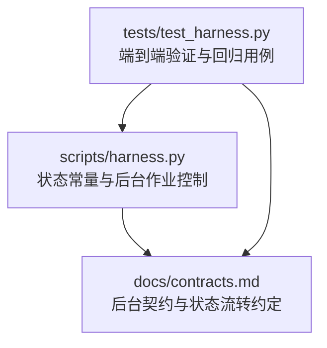
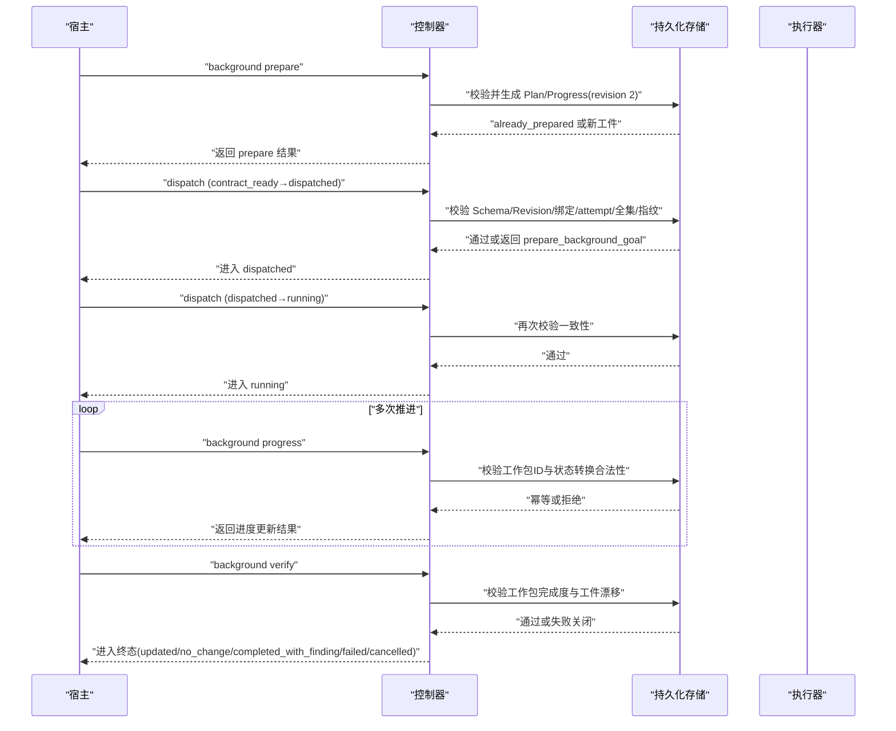
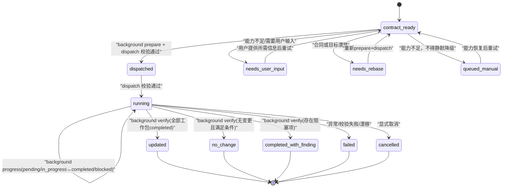
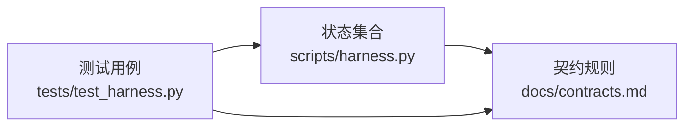

# 作业状态机

<cite>
**本文引用的文件**   
- [scripts/harness.py](file://scripts/harness.py)
- [docs/contracts.md](file://docs/contracts.md)
- [tests/test_harness.py](file://tests/test_harness.py)
</cite>

## 目录
1. [简介](#简介)
2. [项目结构](#项目结构)
3. [核心组件](#核心组件)
4. [架构总览](#架构总览)
5. [详细组件分析](#详细组件分析)
6. [依赖关系分析](#依赖关系分析)
7. [性能考量](#性能考量)
8. [故障排查指南](#故障排查指南)
9. [结论](#结论)
10. [附录](#附录)

## 简介
本文件为 Docs Harness 的“后台作业状态机”提供系统化文档，聚焦后台任务（background job）的完整生命周期与状态转换规则。内容涵盖：
- 核心状态：contract_ready、dispatched、running、completed、failed、cancelled、updated、no_change、completed_with_finding、needs_user_input、needs_rebase、queued_manual 等
- 成功与失败转换条件、幂等性与重试策略
- 终端状态含义与触发条件
- 可重试状态的处理逻辑
- 状态转换图与实际使用示例

## 项目结构
- scripts/harness.py：实现状态集合、校验与后台作业控制流程的核心代码
- docs/contracts.md：定义后台作业契约、状态流转与验收规则
- tests/test_harness.py：通过测试用例覆盖关键路径与边界行为

**图表来源** 
- [scripts/harness.py:97-124](file://scripts/harness.py#L97-L124)
- [docs/contracts.md:300-370](file://docs/contracts.md#L300-L370)

**章节来源**
- [scripts/harness.py:97-124](file://scripts/harness.py#L97-L124)
- [docs/contracts.md:300-370](file://docs/contracts.md#L300-L370)

## 核心组件
- 状态集合与分类
  - 终端状态集合：updated、no_change、completed_with_finding、failed、cancelled
  - 已知状态集合：在终端状态基础上扩展出 contract_ready、dispatched、running、waiting_for_dependency、waiting_for_bootstrap_merge、needs_user_input、needs_rebase、queued_manual
  - 可重试状态集合：needs_user_input、needs_rebase、queued_manual
- 后台工作包进度状态：pending、in_progress、completed、blocked
- 主任务终态：complete、cancelled、failed；blocked 不参与幂等复用

上述集合与常量是状态机决策的基础，贯穿 prepare、dispatch、progress、verify 等阶段。

**章节来源**
- [scripts/harness.py:97-124](file://scripts/harness.py#L97-L124)
- [scripts/harness.py:3770-3772](file://scripts/harness.py#L3770-L3772)

## 架构总览
后台作业的标准序列与关键约束如下：
- 标准序列：contract_ready → background prepare → dispatched → running → background progress（一次或多次）→ background verify → 终态
- 前置校验：prepare 仅在 contract_ready 或在途 dispatched（v1.6.0）下使用；从冻结 goal_contract、work_packages、job_id、idempotency_key 与 attempt 确定性生成 revision 2 Plan/Progress
- 转换校验：contract_ready → dispatched 与 dispatched → running 均校验 Schema、revision、Job 绑定、attempt、工作包全集、进度全集与已记录指纹；缺失工件返回下一步准备动作
- 进度更新：仅允许 running 的复杂 Job；合法转换 pending → in_progress|blocked 与 in_progress → completed|blocked；相同状态幂等，倒退、跳过执行、未知 ID 或自由文本原因失败关闭
- 完成验证：对 updated/no_change 要求全部工作包 completed；completed_with_finding 只允许 completed 或 blocked 并返回 blocked ID；revision 2 工件漂移失败关闭；旧工件仅当前 attempt 可走一次 legacy verify，retry 后必须重新 prepare

**图表来源** 
- [docs/contracts.md:325-338](file://docs/contracts.md#L325-L338)

**章节来源**
- [docs/contracts.md:325-338](file://docs/contracts.md#L325-L338)

## 详细组件分析

### 状态集合与分类
- 终端状态：updated、no_change、completed_with_finding、failed、cancelled
- 已知状态：terminal + {contract_ready, dispatched, running, waiting_for_dependency, waiting_for_bootstrap_merge, needs_user_input, needs_rebase, queued_manual}
- 可重试状态：needs_user_input、needs_rebase、queued_manual
- 工作包进度状态：pending、in_progress、completed、blocked

这些集合用于：
- 判断是否可继续推进（非终态）
- 决定是否需要用户输入或重新基线
- 限制能力不足时的降级策略（不得静默降级）

**章节来源**
- [scripts/harness.py:97-124](file://scripts/harness.py#L97-L124)

### 状态转换图（后台作业）

**图表来源** 
- [docs/contracts.md:325-338](file://docs/contracts.md#L325-L338)
- [scripts/harness.py:97-124](file://scripts/harness.py#L97-L124)

### 成功转换与失败处理
- 成功转换
  - contract_ready → dispatched：校验 Schema、revision、Job 绑定、attempt、工作包全集、进度全集与已记录指纹
  - dispatched → running：同上校验通过后进入运行
  - running → updated/no_change：background verify 确认全部工作包 completed 且工件未漂移
  - running → completed_with_finding：存在阻塞项时返回 blocked ID
- 失败处理
  - 缺失工件：返回 prepare_background_goal 下一步
  - 工件漂移：失败关闭，禁止沿用旧工件
  - 能力不足：进入 queued_manual，不得静默降级
  - 范围/合同漂移：进入 needs_rebase 或 needs_user_input

**章节来源**
- [docs/contracts.md:332-338](file://docs/contracts.md#L332-L338)

### 终端状态的含义与触发条件
- updated：业务数据面写入成功，所有工作包 completed
- no_change：无变更但满足验收条件，所有工作包 completed
- completed_with_finding：存在发现项或阻塞项，返回 blocked ID
- failed：执行异常、校验失败或漂移导致失败
- cancelled：显式取消

**章节来源**
- [scripts/harness.py:97-103](file://scripts/harness.py#L97-L103)
- [docs/contracts.md:336-338](file://docs/contracts.md#L336-L338)

### 可重试状态的处理逻辑
- needs_user_input：需要用户提供必要信息或授权；重试前需归档当前 attempt 工件、推进 attempt、清空准备引用并刷新基线
- needs_rebase：合同或目标发生漂移；需重新 prepare 与 dispatch
- queued_manual：能力不足时进入，不得静默降级；能力恢复后可重试

重试通用规则：
- 仅归档当前 attempt 工件、推进 attempt、清空准备引用并刷新基线
- 不生成新工件；事件仅保存有界状态、attempt、工作包 ID、原因码和指纹
- 连续相同拒绝幂等去重；终态摘要以 (job_id, attempt, status) 为键

**章节来源**
- [scripts/harness.py:114-114](file://scripts/harness.py#L114-L114)
- [docs/contracts.md:340-341](file://docs/contracts.md#L340-L341)

### 实际使用示例
- 初始化与准备
  - 调用 background prepare 生成 revision 2 Plan/Progress；重复调用在内容、绑定与指纹完全一致时返回 already_prepared
- 分发与运行
  - 依次执行 contract_ready → dispatched → running，每次转换均需严格校验
- 进度推进
  - 多次调用 background progress，仅允许 running 的复杂 Job；合法转换 pending ↔ in_progress 与 in_progress ↔ completed/blocked
- 完成验证
  - 调用 background verify；对 updated/no_change 要求全部工作包 completed；对 completed_with_finding 只允许 completed 或 blocked

**章节来源**
- [docs/contracts.md:325-338](file://docs/contracts.md#L325-L338)

## 依赖关系分析
- 状态集合依赖：终端状态集合与已知状态集合共同决定流转方向
- 契约依赖：prepare/dispatch/progress/verify 的校验规则来自 contracts.md
- 测试依赖：test_harness.py 覆盖关键路径与边界行为，确保状态机正确性

**图表来源** 
- [scripts/harness.py:97-124](file://scripts/harness.py#L97-L124)
- [docs/contracts.md:325-338](file://docs/contracts.md#L325-L338)
- [tests/test_harness.py:165-196](file://tests/test_harness.py#L165-L196)

**章节来源**
- [scripts/harness.py:97-124](file://scripts/harness.py#L97-L124)
- [docs/contracts.md:325-338](file://docs/contracts.md#L325-L338)
- [tests/test_harness.py:165-196](file://tests/test_harness.py#L165-L196)

## 性能考量
- 幂等与去重：重复 prepare 在内容、绑定与指纹一致时直接返回 already_prepared，避免重复计算
- 事件精简：后台事件仅保存有界状态、attempt、工作包 ID、原因码与指纹，减少 I/O 与存储压力
- 工件校验：revision 2 工件漂移失败关闭，避免无效重试带来的额外开销

[本节为通用指导，无需特定文件引用]

## 故障排查指南
- 常见失败原因
  - 缺失工件：返回 prepare_background_goal 下一步
  - 工件漂移：失败关闭，需重新 prepare
  - 能力不足：进入 queued_manual，不得静默降级
  - 范围/合同漂移：进入 needs_rebase 或 needs_user_input
- 调试建议
  - 检查 prepare/dispatch/progress/verify 的返回值与原因码
  - 确认工作包 ID 来自冻结 Plan，状态转换合法
  - 验证工件指纹与绑定一致性

**章节来源**
- [docs/contracts.md:332-338](file://docs/contracts.md#L332-L338)

## 结论
Docs Harness 的后台作业状态机通过严格的契约与校验机制，确保作业从准备到完成的每一步都可追溯、可验证、可重试。终端状态明确、可重试状态清晰，配合幂等与去重策略，提升了系统的稳定性与效率。

[本节为总结，无需特定文件引用]

## 附录
- 退出码说明：0 成功；1 检查/自检失败；2 输入/合同/状态无效；3 需要方案/授权/证据/迁移/用户输入/Git 交付；4 范围/漂移/Gate/远端/授权/规则变化需重新准入
- Runtime 与隐私：Runtime、锁、迁移 journal、收据与本地质量账本不进入 Git；真实知识、ADR、Changelog 与 TODO 按项目规则进入交付面

**章节来源**
- [docs/contracts.md:350-370](file://docs/contracts.md#L350-L370)