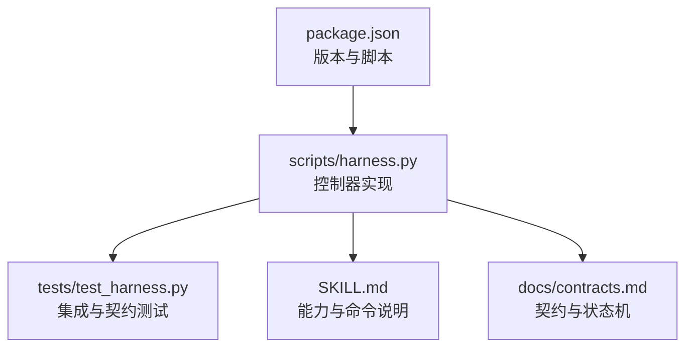
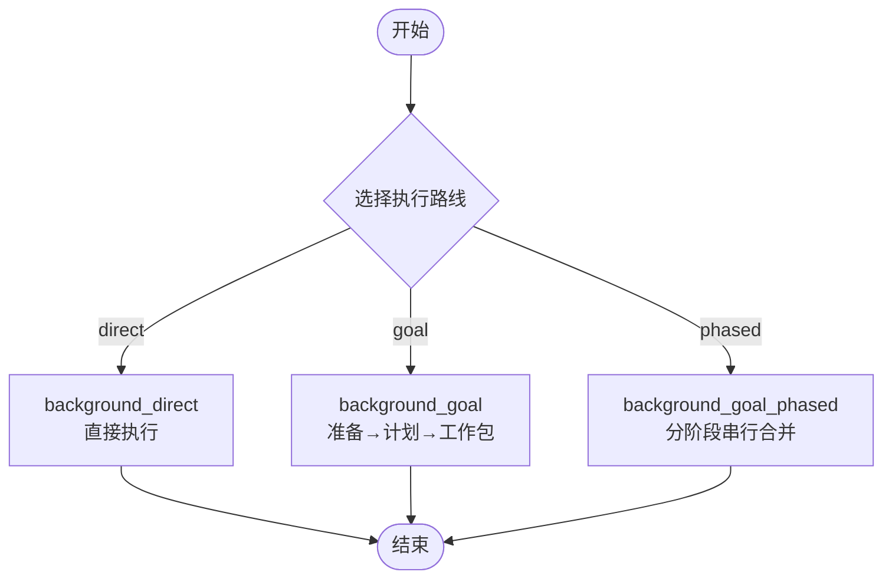
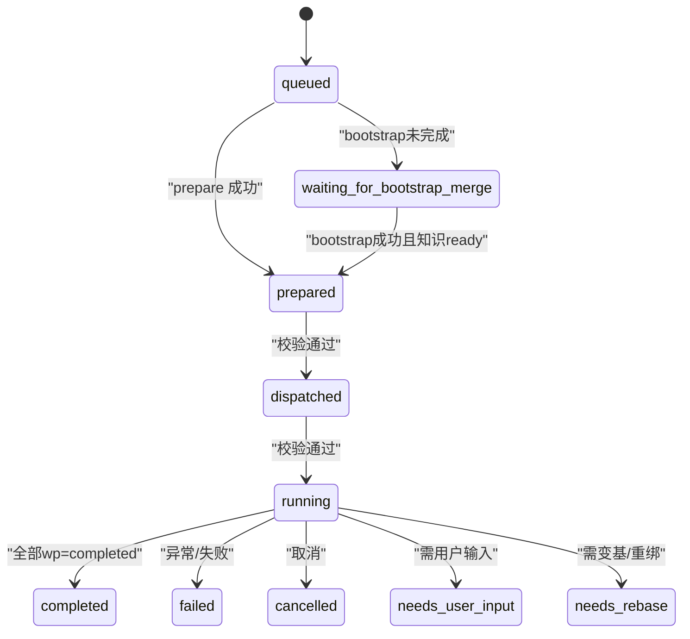
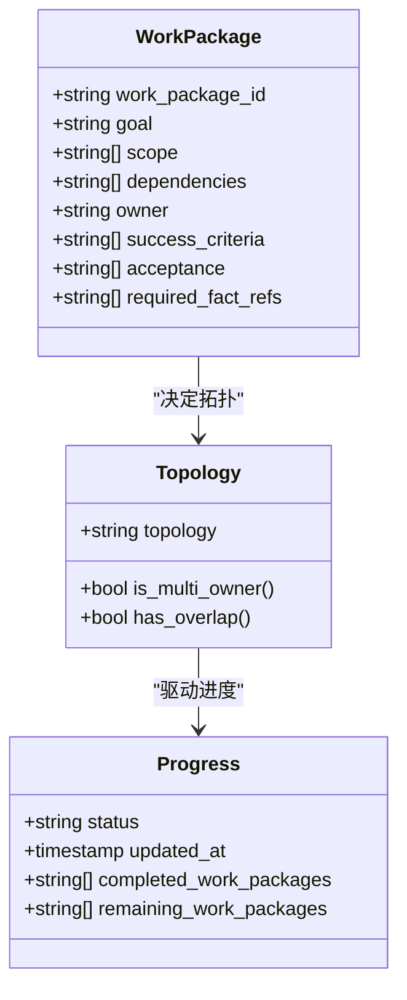
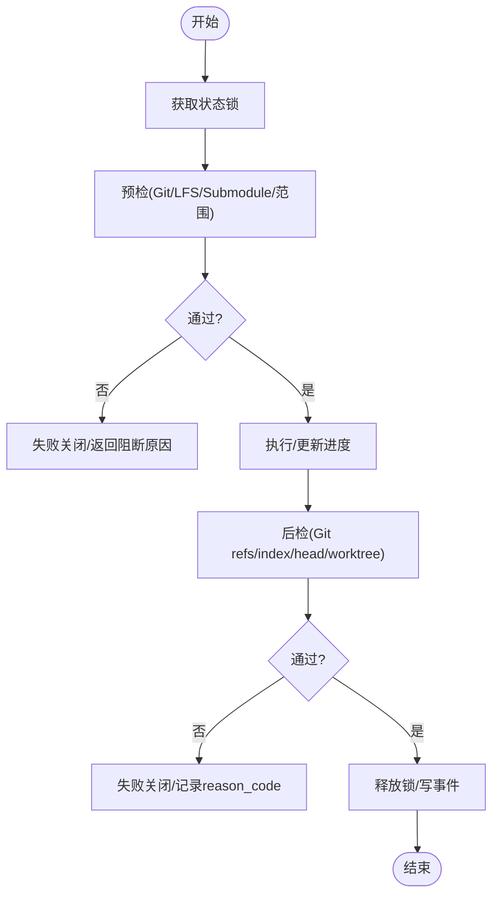
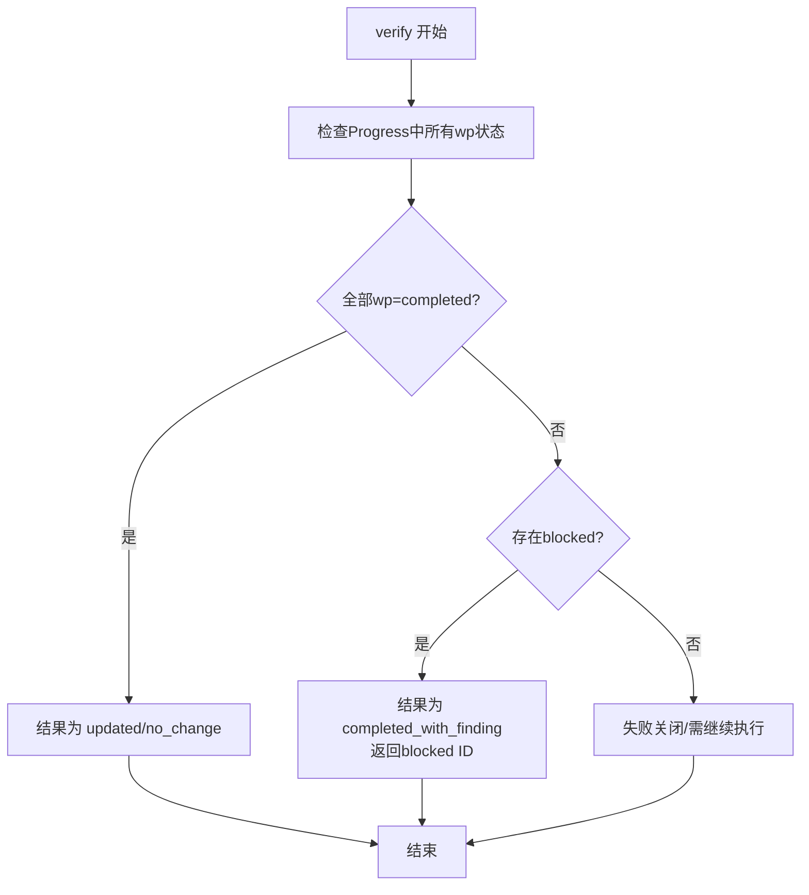
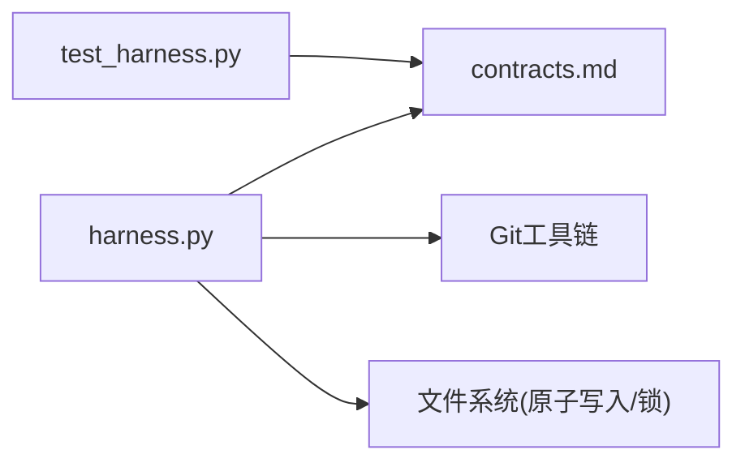

# 后台任务治理

<cite>
**本文引用的文件**   
- [scripts/harness.py](file://scripts/harness.py)
- [tests/test_harness.py](file://tests/test_harness.py)
- [SKILL.md](file://SKILL.md)
- [docs/contracts.md](file://docs/contracts.md)
- [package.json](file://package.json)
</cite>

## 目录
1. [简介](#简介)
2. [项目结构](#项目结构)
3. [核心组件](#核心组件)
4. [架构总览](#架构总览)
5. [详细组件分析](#详细组件分析)
6. [依赖关系分析](#依赖关系分析)
7. [性能考量](#性能考量)
8. [故障排除指南](#故障排除指南)
9. [结论](#结论)
10. [附录：CLI命令参考与示例](#附录cli命令参考与示例)

## 简介
本文件面向 Docs Harness 的后台任务治理系统，系统性阐述三种执行路线（background_direct、background_goal、background_goal_phased）的区别与应用场景；完整说明作业状态机（queued、prepared、dispatched、running、completed 等）的状态转换逻辑；解释工作包的创建与管理机制（生命周期与进度跟踪）；给出异步任务的调度策略（并发控制、资源管理、错误恢复）；明确验收流程（updated、no_change、completed_with_finding 的判定条件）；并提供完整的 CLI 命令参考与实际使用示例与故障排除指南。

## 项目结构
- scripts/harness.py：控制器主实现，包含后台 Job 状态机、工作包管理、验收与重试、Git 预检/后检、事件记录、锁与原子写入等核心能力。
- tests/test_harness.py：覆盖后台 prepare/dispatch/progress/verify/retry 的典型路径与边界用例。
- SKILL.md：对外能力说明，含后台治理入口命令与约束。
- docs/contracts.md：契约文档，定义后台治理状态机、prepare/dispatch/progress/verify 语义与不变量。
- package.json：版本与脚本入口，便于本地测试与自检。



**图表来源** 
- [scripts/harness.py](file://scripts/harness.py)
- [tests/test_harness.py](file://tests/test_harness.py)
- [SKILL.md](file://SKILL.md)
- [docs/contracts.md](file://docs/contracts.md)
- [package.json](file://package.json)

**章节来源**
- [scripts/harness.py](file://scripts/harness.py)
- [tests/test_harness.py](file://tests/test_harness.py)
- [SKILL.md](file://SKILL.md)
- [docs/contracts.md](file://docs/contracts.md)
- [package.json](file://package.json)

## 核心组件
- 执行路线选择与路由
  - background_direct：有界后台子智能体，直接执行，无需复杂计划工件。
  - background_goal：目标型后台子智能体，先建立持续目标与正式方案，再执行工作包。
  - background_goal_phased：单一目标 Owner 分阶段推进，公共层与知识地图串行合并。
- 作业状态机
  - queued → prepared → dispatched → running → completed（或 failed/cancelled/needs_user_input/needs_rebase 等中间态）。
  - 关键校验点：contract_ready 到 dispatched、dispatched 到 running 均校验 Schema、revision、绑定、attempt、工作包全集与指纹。
- 工作包管理
  - 规范化 work_packages，校验 ID、依赖环、Owner 隔离与拓扑（single_owner/single_owner_with_verifier/multi_owner）。
  - 进度状态转换：pending → in_progress|blocked；in_progress → completed|blocked；幂等与倒退保护。
- 验收与重试
  - updated/no_change：要求 revision 2 Progress 的所有工作包为 completed。
  - completed_with_finding：仅允许 completed|blocked，并返回 blocked ID。
  - retry：归档旧 attempt 工件并要求重新 prepare，不继承完成进度。
- Git 预检/后检
  - git_preflight_contract：生成快照、范围、LFS/Submodule 可用性、fast-forward 检查等。
  - git_postcheck：验证远端目标未漂移、受控 ref 变更、index/head/worktree 一致性。

**章节来源**
- [SKILL.md:59-89](file://SKILL.md#L59-L89)
- [docs/contracts.md:303-338](file://docs/contracts.md#L303-L338)
- [scripts/harness.py:95-124](file://scripts/harness.py#L95-L124)
- [scripts/harness.py:677-876](file://scripts/harness.py#L677-L876)
- [scripts/harness.py:2383-2426](file://scripts/harness.py#L2383-L2426)
- [scripts/harness.py:2428-2486](file://scripts/harness.py#L2428-L2486)

## 架构总览
后台治理由“宿主应用”与“Harness 控制器”协作完成：
- 宿主负责业务数据面写入（受限 scope），不得触碰控制面文件（job.json、plan.json、progress.json、events.jsonl 等）。
- 控制器通过 CLI 提供 prepare、dispatch、progress、verify、retry 等能力，确保状态机与工件一致性。
- 复杂路线（goal/goal_phased）在 dispatched/running 前进行多次复验，防止漂移与篡改。

```mermaid
sequenceDiagram
participant Host as "宿主应用"
participant CLI as "Harness CLI"
participant Ctrl as "控制器(harness.py)"
participant FS as "文件系统(.docs-harness/background/jobs)"
participant Git as "Git仓库"
Host->>CLI : background prepare --job-id <id>
CLI->>Ctrl : 解析goal_contract/work_packages/idempotency_key
Ctrl->>FS : 生成revision 2 plan/progress(确定性,无时间戳)
Ctrl-->>Host : already_prepared/created
Host->>CLI : background dispatch --job-status dispatched
Ctrl->>Ctrl : 校验schema/revision/binding/attempt/wp全集/指纹
Ctrl->>FS : 更新job状态=dispatched
Ctrl-->>Host : ok
Host->>CLI : background progress --work-package-id <wp> --status in_progress/completed
Ctrl->>Ctrl : 仅允许running且wp来自冻结plan; 合法转换幂等
Ctrl->>FS : 更新progress.json
Ctrl-->>Host : ok
Host->>CLI : background verify --assessment <file>
Ctrl->>Ctrl : 校验updated/no_change(全部wp=completed)或completed_with_finding
Ctrl->>FS : 写入终态/失败/发现
Ctrl-->>Host : 结果
```

**图表来源** 
- [docs/contracts.md:325-338](file://docs/contracts.md#L325-L338)
- [SKILL.md:71-81](file://SKILL.md#L71-L81)
- [scripts/harness.py:677-876](file://scripts/harness.py#L677-L876)

## 详细组件分析

### 执行路线对比与应用场景
- background_direct
  - 适用：简单、有界的后台任务，无需持久目标与正式方案。
  - 特点：跳过 prepare/plan，直接进入运行；适合一次性治理或轻量任务。
- background_goal
  - 适用：需要持续目标与正式方案的复杂任务，按工作包逐步交付。
  - 特点：必须 prepare 生成 revision 2 工件；支持多 Owner 与独立验证者拓扑。
- background_goal_phased
  - 适用：单一目标 Owner 分阶段推进，公共层与知识地图串行合并。
  - 特点：强调阶段性合并与顺序性，避免并行冲突。



**图表来源** 
- [SKILL.md:59-66](file://SKILL.md#L59-L66)
- [docs/contracts.md:315-322](file://docs/contracts.md#L315-L322)

**章节来源**
- [SKILL.md:59-66](file://SKILL.md#L59-L66)
- [docs/contracts.md:315-322](file://docs/contracts.md#L315-L322)

### 作业状态机与转换逻辑
- 已知状态集合与终态
  - 终态：updated、no_change、completed_with_finding、failed、cancelled。
  - 其他已知态：contract_ready、dispatched、running、waiting_for_dependency、waiting_for_bootstrap_merge、needs_user_input、needs_rebase、queued_manual。
- 关键转换
  - contract_ready → prepared（prepare 生成 revision 2 工件）
  - prepared → dispatched（校验绑定/attempt/wp全集/指纹）
  - dispatched → running（再次校验，进入执行）
  - running → completed（所有 wp 为 completed）
  - running → failed/cancelled（异常/取消）
  - waiting_for_bootstrap_merge（等待 bootstrap 成功且知识 ready）



**图表来源** 
- [scripts/harness.py:97-114](file://scripts/harness.py#L97-L114)
- [docs/contracts.md:325-338](file://docs/contracts.md#L325-L338)

**章节来源**
- [scripts/harness.py:97-114](file://scripts/harness.py#L97-L114)
- [docs/contracts.md:325-338](file://docs/contracts.md#L325-L338)

### 工作包创建与管理机制
- 规范化与校验
  - 校验 work_package_id 唯一性与格式；依赖环检测；必填字段 goal/scope/success_criteria/acceptance。
- 拓扑决策
  - single_owner / single_owner_with_verifier / multi_owner；multi_owner 要求独立交付、Owner 不同、范围不重叠。
- 进度跟踪
  - pending → in_progress|blocked；in_progress → completed|blocked；相同状态幂等，倒退/未知ID/自由文本原因失败关闭。
- 完成派生
  - 完成列表与剩余列表由控制器派生，宿主不得自行计算。



**图表来源** 
- [scripts/harness.py:2383-2426](file://scripts/harness.py#L2383-L2426)
- [scripts/harness.py:2428-2486](file://scripts/harness.py#L2428-L2486)

**章节来源**
- [scripts/harness.py:2383-2426](file://scripts/harness.py#L2383-L2426)
- [scripts/harness.py:2428-2486](file://scripts/harness.py#L2428-L2486)

### 异步任务调度策略
- 并发控制
  - 状态锁：同一任务在同一时刻仅一个进程可更新状态；超过 5 分钟锁视为过期，需人工清理。
  - 路径锁与文档类别锁：prepare/dispatch/verify 前复验路由指纹，防止配置切换绕过。
- 资源管理
  - Git LFS/Submodule 可用性检查；非 fast-forward 阻止 git_sync；脏工作区与同步范围重叠阻断。
  - 工作区快照限制：非 Git 环境文件数上限，超限拒绝截断基线。
- 错误恢复
  - 失败关闭：非法状态转换、未知 ID、自由文本原因、工件损坏/篡改均失败关闭。
  - 修复路径：显式 repair 归档旧工件再生成；retry 不继承完成进度。



**图表来源** 
- [scripts/harness.py:1008-1029](file://scripts/harness.py#L1008-L1029)
- [scripts/harness.py:677-876](file://scripts/harness.py#L677-L876)

**章节来源**
- [scripts/harness.py:1008-1029](file://scripts/harness.py#L1008-L1029)
- [scripts/harness.py:677-876](file://scripts/harness.py#L677-L876)

### 验收流程与判定条件
- updated/no_change
  - 要求 revision 2 Progress 的所有工作包均为 completed。
  - 对于知识 Job，updated/no_change 还要求最终知识状态为 ready。
- completed_with_finding
  - 仅允许 completed 或 blocked，并返回 blocked ID。
- 工件漂移
  - revision 2 工件漂移失败关闭；升级前已在 running 且有绑定指纹的旧工件仅当前 attempt 可走一次 legacy verify，retry 后必须重新 prepare。



**图表来源** 
- [docs/contracts.md:336-338](file://docs/contracts.md#L336-L338)
- [SKILL.md:83-89](file://SKILL.md#L83-L89)

**章节来源**
- [docs/contracts.md:336-338](file://docs/contracts.md#L336-L338)
- [SKILL.md:83-89](file://SKILL.md#L83-L89)

## 依赖关系分析
- 控制器与契约
  - harness.py 严格遵循 contracts.md 定义的后台治理状态机与语义。
- 测试与契约
  - test_harness.py 覆盖 prepare/dispatch/progress/verify/retry 的关键路径，确保契约落地。
- 外部依赖
  - Git 操作（fetch/sync/ls-remote/diff/status）；LFS/Submodule 可用性；文件系统原子写入与锁。



**图表来源** 
- [scripts/harness.py](file://scripts/harness.py)
- [docs/contracts.md](file://docs/contracts.md)
- [tests/test_harness.py](file://tests/test_harness.py)

**章节来源**
- [scripts/harness.py](file://scripts/harness.py)
- [docs/contracts.md](file://docs/contracts.md)
- [tests/test_harness.py](file://tests/test_harness.py)

## 性能考量
- 验证命令缓存
  - 默认开启逐项缓存，可通过 verification.command_cache_enabled 整体关闭；已通过收据复用，失败或输入变化才重跑。
- 临时副产物过滤
  - 已知缓存目录/后缀/文件名不计入额外写入，仅进入 volatile_write_set；项目可追加白名单。
- 上下文复用
  - 内容寻址复用跨 stage 正文，减少重复加载；增量 Gate 仅追加新增上下文。
- 快照与限制
  - 非 Git 环境文件快照上限，超限拒绝截断基线；Git 操作超时保护。

[本节为通用指导，不直接分析具体文件]

## 故障排除指南
- 常见失败码与处理
  - git_remote_drift：远端目标漂移，需重新 fetch/sync 并校验。
  - git_ref_scope_violation：受控 ref 越界，检查 git_scope 与 controlled_ref。
  - state_locked/stale_lock：状态锁冲突或过期，确认是否有进程占用并清理。
  - invalid_state/invalid_json：状态文件或 JSON 损坏，尝试 repair 或重建。
- 诊断步骤
  - 查看 events.jsonl 定位最近事件与 reason_code。
  - 检查 job.json/plan.json/progress.json 一致性（Schema、revision、绑定、attempt）。
  - 使用 background status 与 list 观察队列与状态。
  - 对 Git 相关失败，执行 git_preflight_contract 与 git_postcheck 复现问题。

**章节来源**
- [scripts/harness.py:801-876](file://scripts/harness.py#L801-L876)
- [scripts/harness.py:1008-1029](file://scripts/harness.py#L1008-L1029)

## 结论
Docs Harness 的后台任务治理系统以严格的契约与状态机为核心，结合 Git 预检/后检、原子写入与锁机制，确保复杂后台任务的可审计、可恢复与高可靠性。三种执行路线覆盖从简单到分阶段的多样化场景；工作包管理与进度跟踪提供细粒度控制；验收流程与重试机制保障最终一致性。通过 CLI 暴露的标准接口，宿主应用可在安全边界内可靠地编排与监控后台治理任务。

[本节为总结，不直接分析具体文件]

## 附录：CLI命令参考与示例
- 基本命令
  - background list：列出后台 Job。
  - background status：查询指定 Job 状态。
  - background prepare：准备 revision 2 工件（plan/progress）。
  - background dispatch：将 Job 置为 dispatched 或 running。
  - background progress：更新工作包进度（in_progress/completed）。
  - background verify：验收（updated/no_change/completed_with_finding）。
  - background retry：重试（归档旧 attempt 并重新 prepare）。
- 典型流程示例
  - 初始化项目并准备知识：project init → knowledge estimate → 生成 knowledge_bootstrap 后台合同。
  - 复杂后台任务：run → 准入 → background prepare → 宿主 Goal/Plan → background dispatch → background progress → background verify → 终态。
  - Git 同步：run（git_sync）→ 预检通过 → 提交计划 → 执行 merge → verify 通过后自动归因。

**章节来源**
- [SKILL.md:71-81](file://SKILL.md#L71-L81)
- [tests/test_harness.py:165-195](file://tests/test_harness.py#L165-L195)
- [tests/test_harness.py:597-684](file://tests/test_harness.py#L597-L684)