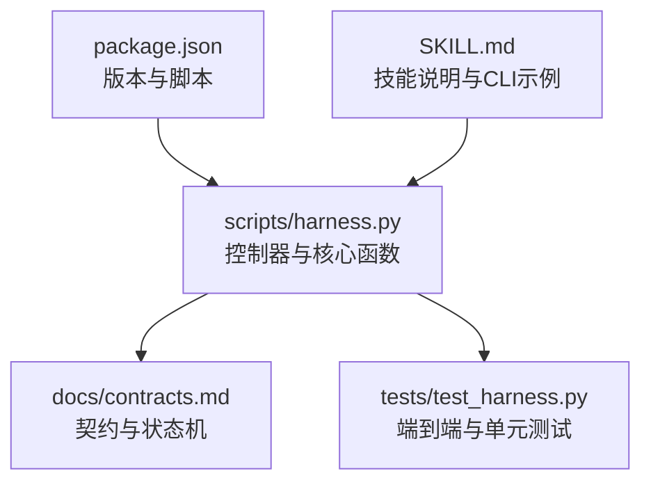
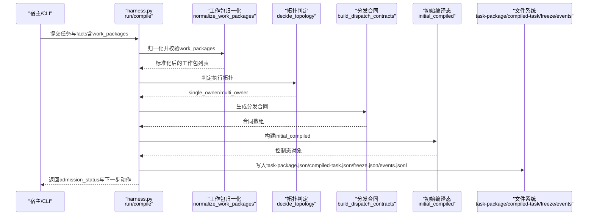
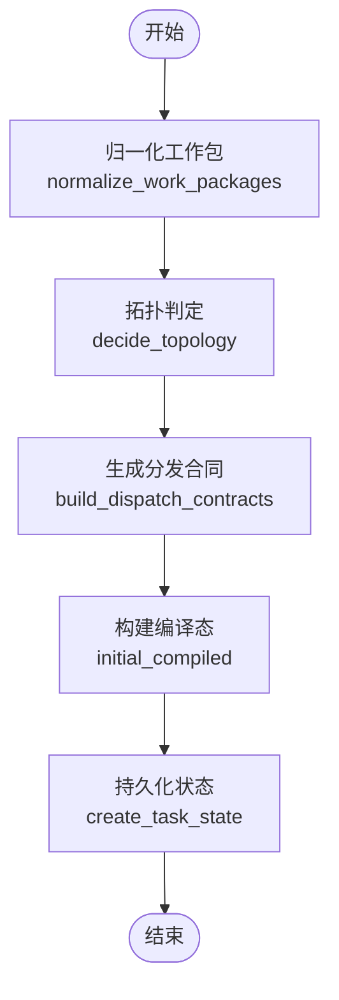

# 工作包创建

<cite>
**本文引用的文件**   
- [scripts/harness.py](file://scripts/harness.py)
- [tests/test_harness.py](file://tests/test_harness.py)
- [docs/contracts.md](file://docs/contracts.md)
- [package.json](file://package.json)
- [SKILL.md](file://SKILL.md)
</cite>

## 目录
1. [简介](#简介)
2. [项目结构](#项目结构)
3. [核心组件](#核心组件)
4. [架构总览](#架构总览)
5. [详细组件分析](#详细组件分析)
6. [依赖关系分析](#依赖关系分析)
7. [性能考量](#性能考量)
8. [故障排查指南](#故障排查指南)
9. [结论](#结论)
10. [附录：CLI命令与JSON规范](#附录cli命令与json规范)

## 简介
本文件面向 Docs Harness 的“工作包（Work Package）”能力，系统化说明从任务包到编译任务的转换流程、工作包结构与字段约束、版本管理与向后兼容策略、初始化参数与默认值、错误处理与异常恢复机制，并提供完整的 CLI 使用示例与 JSON 格式规范。文档内容严格基于仓库源码与契约文档进行提炼与归纳，确保读者既能快速上手，也能深入理解实现细节。

## 项目结构
Docs Harness 以 Python 脚本为核心控制器，配合测试套件与契约文档共同构成完整的工作包生命周期管理能力。关键位置如下：
- 控制器主逻辑与常量定义位于 scripts/harness.py
- 契约与行为约定详见 docs/contracts.md
- 测试用例覆盖工作包归一化、拓扑判定、Git 预检/后检、证据收据等关键路径，见 tests/test_harness.py
- 项目元信息与脚本入口在 package.json
- 技能使用说明与高层流程在 SKILL.md

图表来源
- [scripts/harness.py:1-120](file://scripts/harness.py#L1-L120)
- [docs/contracts.md:1-120](file://docs/contracts.md#L1-L120)
- [tests/test_harness.py:1-120](file://tests/test_harness.py#L1-L120)
- [package.json:1-23](file://package.json#L1-L23)
- [SKILL.md:1-60](file://SKILL.md#L1-L60)

章节来源
- [scripts/harness.py:1-120](file://scripts/harness.py#L1-L120)
- [docs/contracts.md:1-120](file://docs/contracts.md#L1-L120)
- [package.json:1-23](file://package.json#L1-L23)
- [SKILL.md:1-60](file://SKILL.md#L1-L60)

## 核心组件
围绕工作包创建的核心由以下组件协作完成：
- 任务包编译与准入：将用户任务与事实（facts）编译为 task-package/v2，并生成 initial_compiled 控制态
- 工作包归一化与校验：normalize_work_packages 对 work_packages 数组进行 ID、依赖、必填字段与环检测
- 拓扑判定与分发合同：decide_topology 与 build_dispatch_contracts 决定 single_owner/multi_owner 拓扑并生成分发合同
- 范围与授权合同指纹：scope_contract_fingerprint、authorization_contract_fingerprint、plan_contract_fingerprint 用于变更处置决策
- Git 预检/后检：git_preflight_contract 与 git_postcheck 保障 fetch/sync 安全边界
- 证据收据与验证：evidence-receipt/v2 与 verification-command-receipt/v1 支持受管副本与缓存复用
- 事件与冻结快照：events.jsonl、freeze.json 记录不可变审计轨迹与工作区基线

章节来源
- [scripts/harness.py:2380-2486](file://scripts/harness.py#L2380-L2486)
- [scripts/harness.py:2840-3100](file://scripts/harness.py#L2840-L3100)
- [scripts/harness.py:3033-3096](file://scripts/harness.py#L3033-L3096)
- [docs/contracts.md:1-220](file://docs/contracts.md#L1-L220)

## 架构总览
下图展示了从 run 到 compiled-task 的关键调用链，以及工作包在其中的角色与数据流转。

图表来源
- [scripts/harness.py:2380-2486](file://scripts/harness.py#L2380-L2486)
- [scripts/harness.py:2840-3100](file://scripts/harness.py#L2840-L3100)
- [scripts/harness.py:3033-3096](file://scripts/harness.py#L3033-L3096)

## 详细组件分析

### 工作包结构与字段要求
- 每个工作包必须包含：
  - work_package_id：唯一标识，正则匹配字母数字开头，长度限制，禁止重复
  - goal：目标描述（字符串）
  - scope：作用域（相对路径或 glob），经 validate_scope 规范化
  - dependencies：依赖的工作包 ID 集合，需存在且无环
  - owner：负责人（默认 main）
  - success_criteria：成功标准（字符串数组）
  - acceptance：验收条件（字符串数组）
  - required_fact_refs：必需事实引用（可选）
- 校验规则：
  - 类型与必填检查
  - 依赖存在性检查
  - 环检测（拓扑排序）
  - scope 合法性与去重

章节来源
- [scripts/harness.py:2383-2425](file://scripts/harness.py#L2383-L2425)

### 拓扑判定与分发合同
- decide_topology：
  - 允许 requested 值为 single_owner/single_owner_with_verifier/multi_owner
  - 若请求 multi_owner，需满足至少两个 Owner 且作用域不重叠
  - 否则自动选择 single_owner 或 multi_owner
- build_dispatch_contracts：
  - multi_owner：为每个工作包生成 implementation_owner 合同
  - single_owner_with_verifier：生成独立验证者合同，输入包含 evidence-index 与实际差异

章节来源
- [scripts/harness.py:2428-2486](file://scripts/harness.py#L2428-L2486)

### 任务包到编译任务的转换
- compile_plan_contract：根据 Gates、规则与 scope_required 生成 plan_fields 与骨架
- plan_contract_payload：输出 allowed/read/write/git/external scope、allowed_actions 等
- build_completion_manifest：按意图与 mutation_profile 推导 required_receipts、conditional_reviews/evidence
- initial_compiled：构建 control_status、work_package_states、next_action、blockers、verification_status 等
- create_task_state：原子写入 task-package.json、compiled-task.json、evidence-index.json、freeze.json、events.jsonl 等

章节来源
- [scripts/harness.py:2509-2579](file://scripts/harness.py#L2509-L2579)
- [scripts/harness.py:2840-3100](file://scripts/harness.py#L2840-L3100)
- [scripts/harness.py:3033-3096](file://scripts/harness.py#L3033-L3096)

### 版本管理与向后兼容
- 任务包 Schema：docs-harness/task-package/v2；旧版 v1 通过迁移函数转换为 v2
- 编译任务 Schema：docs-harness/compiled-task/v2
- 证据收据：docs-harness/evidence-receipt/v2；支持简化声明草案 docs-harness/evidence-declaration/v1
- 背景 Job：docs-harness/background-job/v2；v1 只读兼容并在 upgrade 中幂等迁移
- 回滚与迁移：v1→v2 迁移需显式 apply，失败时全量回滚；活动 v2 任务阻断回滚

章节来源
- [docs/contracts.md:236-282](file://docs/contracts.md#L236-L282)
- [scripts/harness.py:3103-3146](file://scripts/harness.py#L3103-L3146)
- [scripts/harness.py:3205-3233](file://scripts/harness.py#L3205-L3233)

### 初始化参数配置与默认值
- 默认拓扑：未指定时根据 Owner 数量与作用域重叠情况自动选择
- 默认 owner：未指定时为 main
- 默认 next_action：direct 路由且无上下文加载需求时直接 execute，否则 load_plan_context
- 默认 required_receipts：read_only 需要 read_set，workspace_write/external_write 需要 write_set，git 操作额外需要 git_state_snapshot
- 默认 completion_protocol：incremental_receipts_single_final

章节来源
- [scripts/harness.py:2428-2486](file://scripts/harness.py#L2428-L2486)
- [scripts/harness.py:2545-2579](file://scripts/harness.py#L2545-L2579)
- [docs/contracts.md:63-78](file://docs/contracts.md#L63-L78)

### 错误处理与异常恢复机制
- 统一异常类 HarnessError：携带 code、exit_code，便于结构化错误传播
- 常见错误码：missing_file、invalid_json、invalid_target、unsafe_target、invalid_task_id、git_preflight_timeout、git_remote_unavailable、invalid_git_scope、git_sync_scope_ambiguous、invalid_work_packages、invalid_topology、unsafe_topology 等
- 恢复策略：
  - 文件型参数大小/编码/类型校验失败返回结构化错误
  - Git 预检失败（LFS/Submodule 不可用、非 fast-forward、脏工作区、删除阈值）阻断并给出 blockers
  - 工作包依赖环或缺少必填字段返回 invalid_work_packages
  - 拓扑不满足 multi_owner 条件返回 unsafe_topology
  - 事件文件行无效返回 invalid_state
  - 任务已存在返回 task_exists

章节来源
- [scripts/harness.py:392-543](file://scripts/harness.py#L392-L543)
- [scripts/harness.py:572-791](file://scripts/harness.py#L572-L791)
- [scripts/harness.py:2383-2425](file://scripts/harness.py#L2383-L2425)
- [scripts/harness.py:3062-3096](file://scripts/harness.py#L3062-L3096)

### Git 预检与后检流程
- git_preflight_contract：
  - 仅对 git_fetch/git_sync 生效
  - 计算 repo_identity、remote refspec、index_tree、worktree_fingerprint、controlled_refs_namespace
  - 检查 LFS/Submodule 可用性、fast-forward、脏工作区、删除阈值
  - 返回 snapshot、sync_scope、blockers
- git_postcheck：
  - 校验远端引用变化是否超出声明范围
  - HEAD、索引、工作区一致性检查
  - 记录 changed_refs、outside_refs 等

章节来源
- [scripts/harness.py:677-791](file://scripts/harness.py#L677-L791)
- [scripts/harness.py:793-800](file://scripts/harness.py#L793-L800)

### 证据收据与验证命令
- evidence-receipt/v2：绑定 task_id、target_identity、package_fingerprint、producer、cwd、起止时间、ttl、exit_code、digests、read_set/write_set
- verification-command-receipt/v1：按 argv、produces、输入指纹缓存复用，减少重复执行
- 自动归因：write_scope 内未归因写入可自动生成 workspace_attribution 收据（可配置关闭）

章节来源
- [docs/contracts.md:165-221](file://docs/contracts.md#L165-L221)

## 依赖关系分析
工作包创建涉及多模块耦合与外部依赖：
- 内部依赖：normalize_work_packages → decide_topology → build_dispatch_contracts → initial_compiled → create_task_state
- 外部依赖：Git（fetch/sync）、文件系统（原子写入）、JSON 解析、哈希计算
- 风险点：Git 远程不可用、LFS/Submodule 缺失、工作区脏、依赖环、拓扑冲突

图表来源
- [scripts/harness.py:2383-2486](file://scripts/harness.py#L2383-L2486)
- [scripts/harness.py:3033-3096](file://scripts/harness.py#L3033-L3096)

章节来源
- [scripts/harness.py:2383-2486](file://scripts/harness.py#L2383-L2486)
- [scripts/harness.py:3033-3096](file://scripts/harness.py#L3033-L3096)

## 性能考量
- 原子写入与 fsync：atomic_write_text/atomic_write_json 保证写入原子性与持久性
- 哈希与指纹：canonical_json + sha256 用于幂等键与变更检测，避免重复计算
- 事件追加：append_jsonl 顺序追加并 fsync，保证审计轨迹完整性
- Git 操作超时：git_command 设置 timeout，防止阻塞
- 证据缓存：verification-command-receipt 复用通过命令结果，减少重复执行

章节来源
- [scripts/harness.py:419-435](file://scripts/harness.py#L419-L435)
- [scripts/harness.py:507-529](file://scripts/harness.py#L507-L529)
- [scripts/harness.py:572-583](file://scripts/harness.py#L572-L583)
- [docs/contracts.md:220-221](file://docs/contracts.md#L220-L221)

## 故障排查指南
- 输入错误：检查 JSON 格式、文件大小、UTF-8 编码、路径有效性
- Git 问题：确认 remote 可用、LFS/Submodule 安装、分支 fast-forward、工作区干净
- 工作包错误：核对 ID 唯一性、依赖存在性、必填字段、作用域合法性、依赖环
- 拓扑冲突：multi_owner 需满足 Owner 数量与作用域隔离
- 证据问题：确认 producer 可信、digest 有效、cwd 有界、exit_code=0
- 权限与范围：write_scope 越界、读取事实漂移、concurrent/unattributed 漂移命中高风险边界

章节来源
- [scripts/harness.py:392-543](file://scripts/harness.py#L392-L543)
- [scripts/harness.py:677-791](file://scripts/harness.py#L677-L791)
- [scripts/harness.py:2383-2425](file://scripts/harness.py#L2383-L2425)
- [docs/contracts.md:134-164](file://docs/contracts.md#L134-L164)

## 结论
Docs Harness 的工作包创建流程通过严格的归一化、拓扑判定、分发合同生成与编译态构建，确保了任务执行的边界可控、可审计与可恢复。结合 Git 预检/后检、证据收据与验证命令缓存，系统在安全性、性能与可维护性之间取得平衡。遵循本文档的结构定义、字段要求与错误处理建议，可有效提升工作包创建的稳定性与可预测性。

## 附录：CLI命令与JSON规范

### CLI 命令示例
- 项目初始化（新建最小知识骨架，不等待知识生成）
  - python3 scripts/harness.py project init --target <project> --json
- 运行任务（幂等复用活动任务，--new-task 强制新建）
  - python3 scripts/harness.py run --target . --task "<原始用户任务>" --json
- 后台治理（prepare/dispatch/progress/verify/retry）
  - python3 scripts/harness.py background prepare --target . --job-id <job-id> --json
  - python3 scripts/harness.py background dispatch --target . --job-id <job-id> --job-status dispatched --json
  - python3 scripts/harness.py background progress --target . --job-id <job-id> --work-package-id <wp-id> --work-package-status in_progress --json
  - python3 scripts/harness.py background verify --target . --job-id <job-id> --assessment <file> --json
  - python3 scripts/harness.py background retry --target . --job-id <job-id> --json
- 最终验收（父任务完成标志 verify.result=完成）
  - python3 scripts/harness.py verify --target . --task-id <task-id> --evidence <evidence.json> --json

章节来源
- [SKILL.md:15-55](file://SKILL.md#L15-L55)

### JSON 格式规范
- 任务包 schema_version：docs-harness/task-package/v2
  - 关键字段：task_intent、candidate_intents、deferred_intents、mutation_profile、read_scope、write_scope、git_scope、external_scope、allowed_actions、work_packages、dispatch_contracts、completion_manifest、context_schedule
- 工作包字段：
  - work_package_id、goal、scope、dependencies、owner、success_criteria、acceptance、required_fact_refs
- 证据收据 schema_version：docs-harness/evidence-receipt/v2
  - 必填绑定：task_id、target_identity、package_fingerprint、producer、command_argv_digest、cwd、started_at、ended_at、ttl、exit_code、output_or_artifact_digest、read_set、write_set
- 验证命令收据 schema_version：docs-harness/verification-command-receipt/v1
  - 字段：argv、produces、输入指纹、缓存命中标记

章节来源
- [docs/contracts.md:9-78](file://docs/contracts.md#L9-L78)
- [docs/contracts.md:165-221](file://docs/contracts.md#L165-L221)
- [scripts/harness.py:2840-3100](file://scripts/harness.py#L2840-L3100)