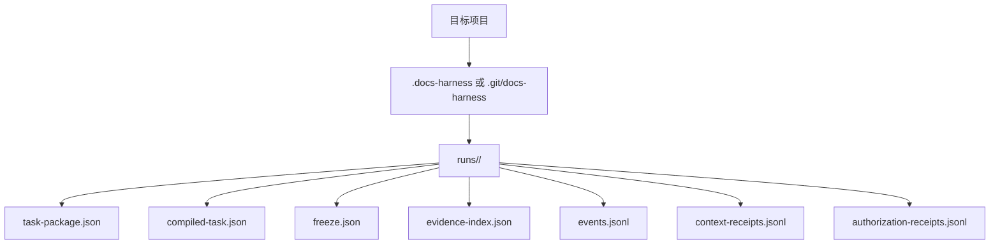
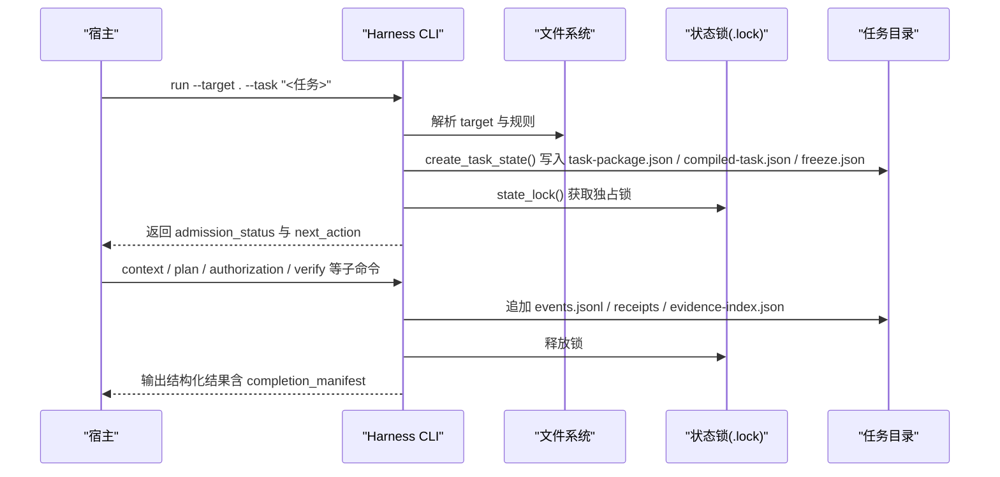
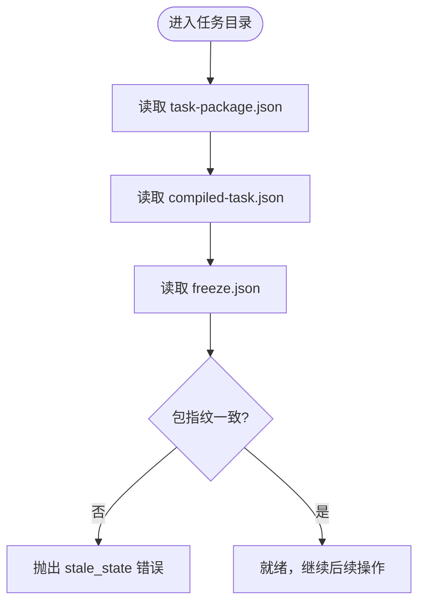
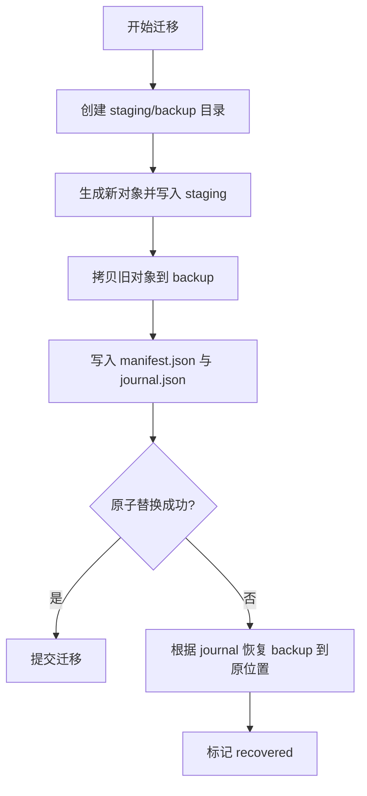
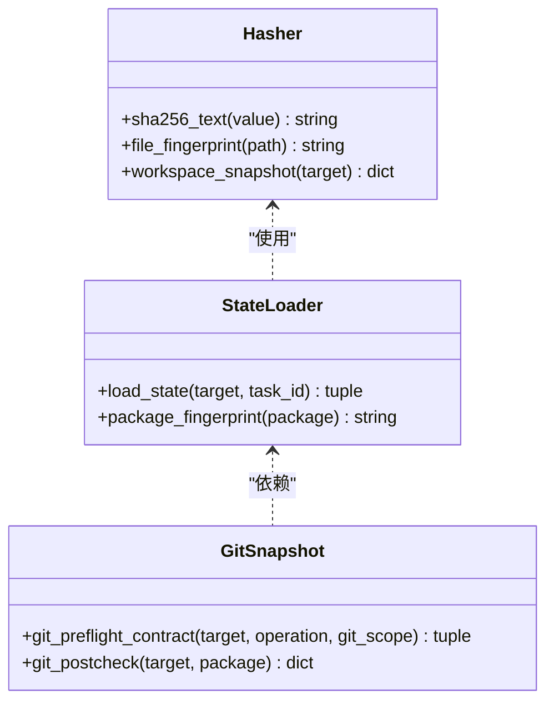
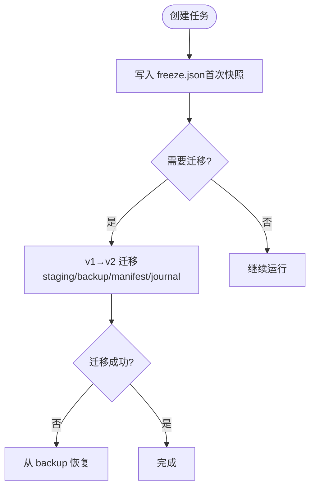
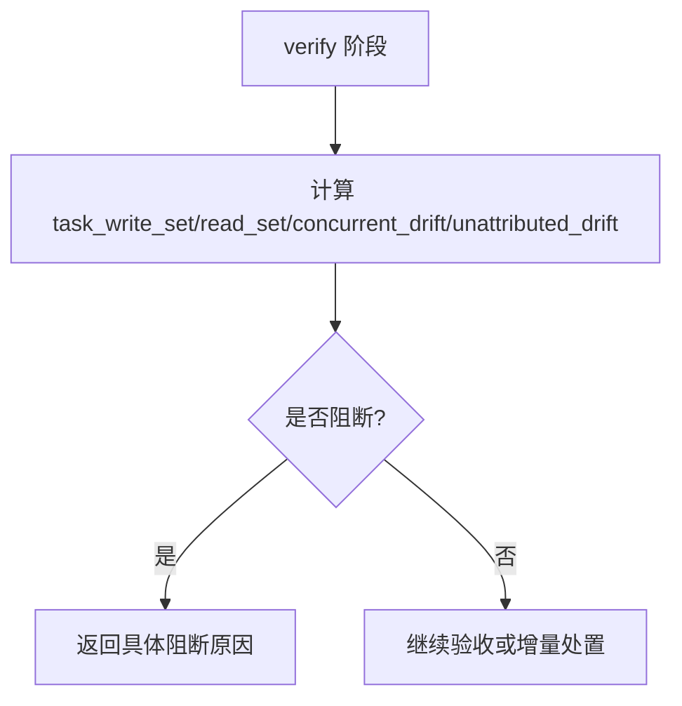
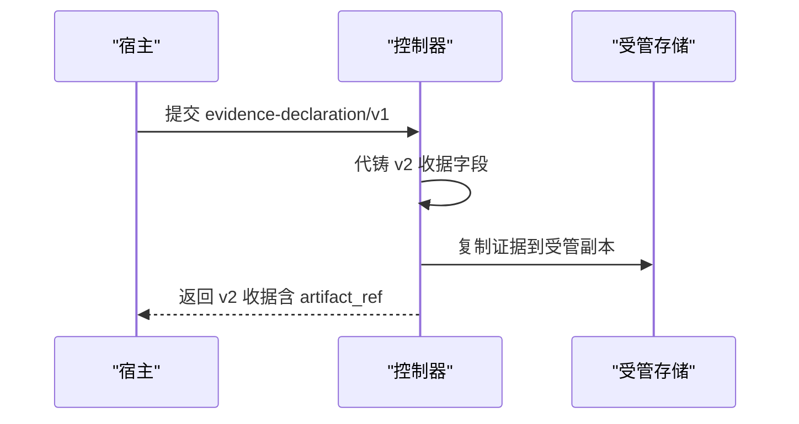
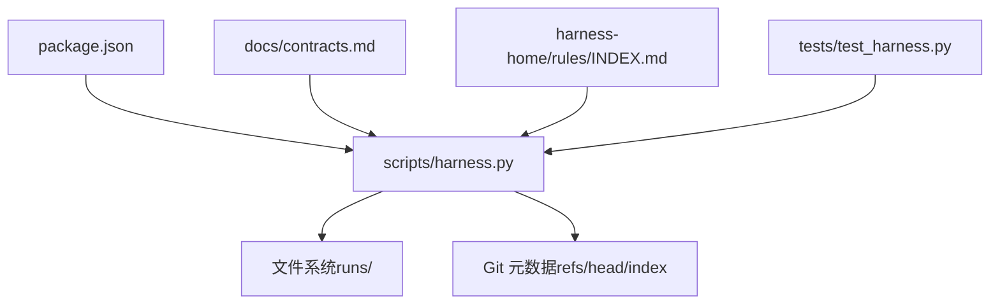

# 工作包存储

<cite>
**本文引用的文件**   
- [scripts/harness.py](file://scripts/harness.py)
- [docs/contracts.md](file://docs/contracts.md)
- [harness-home/rules/INDEX.md](file://harness-home/rules/INDEX.md)
- [tests/test_harness.py](file://tests/test_harness.py)
- [package.json](file://package.json)
</cite>

## 目录
1. [简介](#简介)
2. [项目结构](#项目结构)
3. [核心组件](#核心组件)
4. [架构总览](#架构总览)
5. [详细组件分析](#详细组件分析)
6. [依赖关系分析](#依赖关系分析)
7. [性能与空间管理](#性能与空间管理)
8. [故障排查指南](#故障排查指南)
9. [结论](#结论)
10. [附录：存储格式规范与迁移指南](#附录存储格式规范与迁移指南)

## 简介
本文件面向 Docs Harness 的工作包（任务）存储系统，系统性阐述其存储结构、持久化机制、完整性验证、备份恢复策略、性能优化与空间管理实践，以及存储格式的完整规范与迁移路径。内容基于仓库中的控制器实现与合同文档，确保读者既能快速上手，也能深入理解底层实现细节。

## 项目结构
Docs Harness 将任务运行时数据统一落盘到“Runtime”目录中，Git 仓库与非 Git 仓库的根位置不同：
- Git 仓库：在 .git/docs-harness/runs 下按 task_id 分目录存放任务状态与工件
- 非 Git 仓库：在项目根下的 .docs-harness/runs 下按 task_id 分目录存放

每个任务目录包含以下关键文件：
- task-package.json：任务包（v2），描述意图、范围、动作、路线与工作包等
- compiled-task.json：编译态，驱动控制面状态机与下一步动作
- freeze.json：冻结快照，记录首次工作区快照、环境指纹与 Git 状态快照
- evidence-index.json：证据索引，维护已采纳的证据条目
- events.jsonl：事件日志（不可变追加）
- context-receipts.jsonl：上下文收据（不可变追加）
- authorization-receipts.jsonl：授权收据（不可变追加）

**图表来源** 
- [scripts/harness.py:906-922](file://scripts/harness.py#L906-L922)

**章节来源**
- [scripts/harness.py:906-922](file://scripts/harness.py#L906-L922)
- [docs/contracts.md:350-358](file://docs/contracts.md#L350-L358)

## 核心组件
- 任务包（task-package/v2）：声明意图、候选意图、变更面、读写范围、Git 范围、允许动作、执行路线与工作包集合
- 编译态（compiled-task）：由控制器生成，驱动状态机流转（admission_status → control_status → verification_status）
- 冻结快照（freeze.json）：固定首次工作区快照与环境指纹，作为漂移校验基线
- 证据索引（evidence-index.json）：集中索引 v2 证据收据，支持受管副本引用
- 事件与收据（events.jsonl、context-receipts.jsonl、authorization-receipts.jsonl）：不可变追加，用于审计与幂等复用
- 锁机制（.lock）：单进程并发保护，避免同一任务被多进程同时更新

**章节来源**
- [docs/contracts.md:9-48](file://docs/contracts.md#L9-L48)
- [scripts/harness.py:3062-3095](file://scripts/harness.py#L3062-L3095)
- [scripts/harness.py:1008-1029](file://scripts/harness.py#L1008-L1029)

## 架构总览
下图展示任务从创建到验收的关键流程与存储交互：

**图表来源** 
- [scripts/harness.py:3062-3095](file://scripts/harness.py#L3062-L3095)
- [scripts/harness.py:1008-1029](file://scripts/harness.py#L1008-L1029)
- [docs/contracts.md:50-78](file://docs/contracts.md#L50-L78)

## 详细组件分析

### 存储结构与目录布局
- 任务根目录：runtime_root(target)/task_id
- 关键文件职责：
  - task-package.json：任务包（v2），包含意图、范围、动作、路线、工作包、完成清单等
  - compiled-task.json：编译态，包含控制状态、执行拓扑、工作包状态、证据引用、计划引用等
  - freeze.json：冻结快照，包含首次工作区快照、环境指纹、Git 状态快照、创建时间等
  - evidence-index.json：证据索引，包含 schema_version 与 evidence 列表
  - events.jsonl：事件日志，每条为 JSON 对象，记录阶段、耗时、原因码、包修订等
  - context-receipts.jsonl：上下文收据，按 stage 与 compiler contract 复用
  - authorization-receipts.jsonl：授权收据，绑定当前 package fingerprint

**图表来源** 
- [scripts/harness.py:3098-3113](file://scripts/harness.py#L3098-L3113)

**章节来源**
- [scripts/harness.py:906-922](file://scripts/harness.py#L906-L922)
- [scripts/harness.py:3062-3095](file://scripts/harness.py#L3062-L3095)
- [scripts/harness.py:3098-3113](file://scripts/harness.py#L3098-L3113)

### 持久化机制：状态保存、增量更新与事务处理
- 原子写入：所有 JSON 文本通过临时文件 + fsync + os.replace 原子替换，保证写一致性
- 追加式日志：events.jsonl、receipts 使用 append_jsonl，逐行追加并 fsync，保证顺序与可恢复性
- 事务回滚：v1→v2 迁移采用 staging + backup + manifest + journal 模式，失败自动回滚
- 锁保护：state_lock 以 .lock 文件实现互斥，超时检测防止死锁

**图表来源** 
- [scripts/harness.py:3194-3297](file://scripts/harness.py#L3194-L3297)

**章节来源**
- [scripts/harness.py:419-434](file://scripts/harness.py#L419-L434)
- [scripts/harness.py:507-529](file://scripts/harness.py#L507-L529)
- [scripts/harness.py:3175-3192](file://scripts/harness.py#L3175-L3192)
- [scripts/harness.py:3194-3297](file://scripts/harness.py#L3194-L3297)
- [scripts/harness.py:1008-1029](file://scripts/harness.py#L1008-L1029)

### 完整性验证：哈希计算、签名验证与数据一致性检查
- 哈希计算：sha256_text、file_fingerprint、workspace_snapshot 等用于对象与内容指纹
- 指纹一致性：load_state 校验 package_fingerprint 在 package/compiled/freeze 三者间一致
- Git 状态快照：git_preflight_contract 捕获 remote、refspec、head、index_tree、worktree_fingerprint 等
- 后检验证：git_postcheck 对比 preflight 快照，检查 ref 变化、HEAD/index/worktree 是否一致

**图表来源** 
- [scripts/harness.py:407-416](file://scripts/harness.py#L407-L416)
- [scripts/harness.py:2911-2912](file://scripts/harness.py#L2911-L2912)
- [scripts/harness.py:677-788](file://scripts/harness.py#L677-L788)
- [scripts/harness.py:793-855](file://scripts/harness.py#L793-L855)

**章节来源**
- [scripts/harness.py:407-416](file://scripts/harness.py#L407-L416)
- [scripts/harness.py:2911-2912](file://scripts/harness.py#L2911-L2912)
- [scripts/harness.py:677-788](file://scripts/harness.py#L677-L788)
- [scripts/harness.py:793-855](file://scripts/harness.py#L793-L855)
- [scripts/harness.py:3098-3113](file://scripts/harness.py#L3098-L3113)

### 备份与恢复：快照管理与版本回滚
- 首次快照：create_task_state 写入 freeze.json，固定 workspace_snapshot 与 environment fingerprint
- 迁移快照：v1→v2 迁移时生成 manifest.json 与 journal.json，失败自动回滚
- 清理与归档：task prune 提供保留期清理，task archive 对 v1 对象归档至独立索引

**图表来源** 
- [scripts/harness.py:3062-3095](file://scripts/harness.py#L3062-L3095)
- [scripts/harness.py:3194-3297](file://scripts/harness.py#L3194-L3297)

**章节来源**
- [scripts/harness.py:3062-3095](file://scripts/harness.py#L3062-L3095)
- [scripts/harness.py:3194-3297](file://scripts/harness.py#L3194-L3297)
- [docs/contracts.md:236-282](file://docs/contracts.md#L236-L282)

### 工作包完整性与漂移归因
- 冻结基线：freeze.json.workspace_snapshot 作为首次基线，重新准入不刷新
- 验收输出：task_write_set、read_set、concurrent_drift、unattributed_drift
- 阻断规则：越界写入、读取事实漂移、并发/未归因漂移与读写范围重叠、命中高风险边界、新增 Gate/规则指纹变化

**图表来源** 
- [docs/contracts.md:134-163](file://docs/contracts.md#L134-L163)

**章节来源**
- [docs/contracts.md:134-163](file://docs/contracts.md#L134-L163)

### 证据与收据：受管副本与命令缓存
- 证据收据：evidence-receipt/v2 必填字段绑定 task_id、target_identity、package_fingerprint、producer、cwd、起止时间、ttl、exit_code、digests、read_set/write_set
- 受管副本：宿主提交的证据文件复制进受管 artifact store，准入只依赖副本
- 验证命令收据：verification-command-receipt/v1 逐项收据，输入不变则复用

**图表来源** 
- [docs/contracts.md:165-221](file://docs/contracts.md#L165-L221)

**章节来源**
- [docs/contracts.md:165-221](file://docs/contracts.md#L165-L221)

## 依赖关系分析
- 控制器脚本 scripts/harness.py 为核心实现，定义 Runtime 路径、任务状态目录、原子写入、事件追加、锁机制、Git 快照与后检、v1→v2 迁移等
- 合同文档 docs/contracts.md 定义存储格式、语义约束、退出码与验收层
- 规则索引 harness-home/rules/INDEX.md 规定生效规则与加载约定
- 测试用例 tests/test_harness.py 覆盖安装、Git 预检/后检、漂移、权限、迁移等场景
- package.json 提供脚本入口与版本信息

**图表来源** 
- [package.json:1-23](file://package.json#L1-L23)
- [scripts/harness.py:906-922](file://scripts/harness.py#L906-L922)
- [docs/contracts.md:1-10](file://docs/contracts.md#L1-L10)
- [harness-home/rules/INDEX.md:1-41](file://harness-home/rules/INDEX.md#L1-L41)
- [tests/test_harness.py:1-800](file://tests/test_harness.py#L1-L800)

**章节来源**
- [package.json:1-23](file://package.json#L1-L23)
- [scripts/harness.py:906-922](file://scripts/harness.py#L906-L922)
- [docs/contracts.md:1-10](file://docs/contracts.md#L1-L10)
- [harness-home/rules/INDEX.md:1-41](file://harness-home/rules/INDEX.md#L1-L41)
- [tests/test_harness.py:1-800](file://tests/test_harness.py#L1-L800)

## 性能与空间管理
- 原子写入与 fsync：确保崩溃恢复能力，避免部分写入导致的状态不一致
- 追加式日志：events.jsonl/receipts 使用追加模式，减少随机写放大
- 证据与命令缓存：验证命令收据与证据受管副本减少重复执行与 IO
- 空间清理：task prune 支持按保留期清理终态对象，避免 Runtime 膨胀
- 排除路径：excluded_workspace_path 排除 .docs-harness/runs、quality-ledger、knowledge 等，避免纳入工作区快照

**章节来源**
- [scripts/harness.py:419-434](file://scripts/harness.py#L419-L434)
- [scripts/harness.py:507-529](file://scripts/harness.py#L507-L529)
- [scripts/harness.py:1073-1083](file://scripts/harness.py#L1073-L1083)
- [docs/contracts.md:274-282](file://docs/contracts.md#L274-L282)

## 故障排查指南
- 常见错误码：
  - 2：输入/合同/绑定/状态无效（如 invalid_json、missing_file、invalid_task_id）
  - 3：需要方案/授权/证据/迁移/用户输入（如 provide_evidence、refresh_evidence、legacy_task_requires_migration）
  - 4：范围/漂移/Gate/远端/授权/规则变化，需重新准入（如 full_readmission、git_remote_drift）
- 锁冲突：检测到 .lock 超过 5 分钟视为 stale_lock，需人工确认清理
- Git 预检失败：LFS/Submodule 不可用、非 fast-forward、脏工作区重叠、删除数量超阈值等
- 指纹不一致：package/compiled/freeze 指纹不一致触发 stale_state

**章节来源**
- [docs/contracts.md:359-370](file://docs/contracts.md#L359-L370)
- [scripts/harness.py:1008-1029](file://scripts/harness.py#L1008-L1029)
- [scripts/harness.py:677-788](file://scripts/harness.py#L677-L788)
- [scripts/harness.py:3098-3113](file://scripts/harness.py#L3098-L3113)

## 结论
Docs Harness 的工作包存储系统以“原子写入 + 追加日志 + 指纹一致性 + 锁保护”为核心，结合冻结快照与受管副本，实现了高可靠的任务状态持久化与完整性保障。通过 v1→v2 迁移的事务化设计与 task prune 的空间治理，系统在演进性与可维护性上具备良好平衡。建议在生产环境中严格遵循合同规范，合理配置验证命令缓存与证据白名单，并结合 Git 预检/后检确保交付安全。

## 附录：存储格式规范与迁移指南

### 存储格式规范
- task-package/v2：包含 task_intent、candidate_intents、mutation_profile、read_scope、write_scope、git_scope、external_scope、allowed_actions、execution_route、work_packages、completion_manifest 等
- compiled-task：包含 schema_version、task_id、package_revision、control_status、execution_route、work_package_states、next_action、blockers、evidence_refs、plan_ref、authorization_status、verification_status 等
- freeze.json：包含 schema_version、task_id、package_revision、package_fingerprint、task_snapshot_ref、workspace_snapshot、workspace_fingerprint、git_state_snapshot、environment、created_at
- evidence-index.json：包含 schema_version、evidence（数组）、legacy_evidence（可选）
- events.jsonl/context-receipts.jsonl/authorization-receipts.jsonl：JSON Lines，每条为对象，不可变追加

**章节来源**
- [docs/contracts.md:9-48](file://docs/contracts.md#L9-L48)
- [docs/contracts.md:165-221](file://docs/contracts.md#L165-L221)
- [scripts/harness.py:3033-3059](file://scripts/harness.py#L3033-L3059)
- [scripts/harness.py:3062-3095](file://scripts/harness.py#L3062-L3095)

### 迁移指南（v1→v2）
- 预览模式：task migrate --task-id <id> 仅显示影响对象与步骤
- 应用模式：task migrate --task-id <id> --apply 执行 staging/backup/manifest/journal 事务
- 回滚机制：journal 记录 objects 列表，失败时从 backup 恢复
- 迁移后状态：任务进入 needs_readmission，必须按 v2 合同重新准入

**章节来源**
- [docs/contracts.md:236-282](file://docs/contracts.md#L236-L282)
- [scripts/harness.py:3194-3297](file://scripts/harness.py#L3194-L3297)