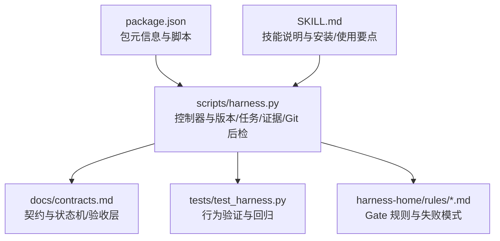
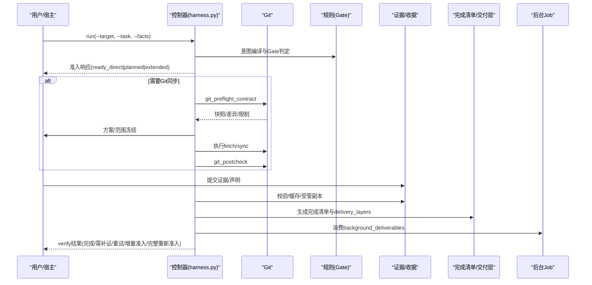
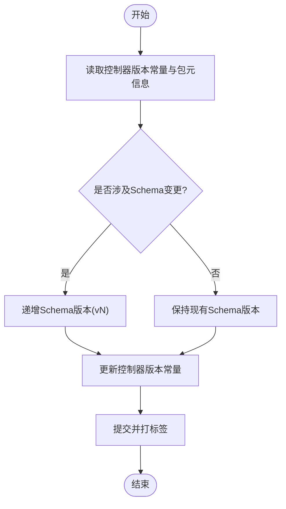
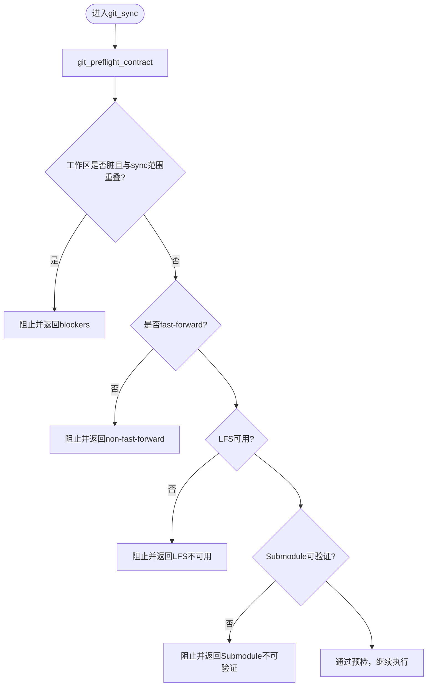
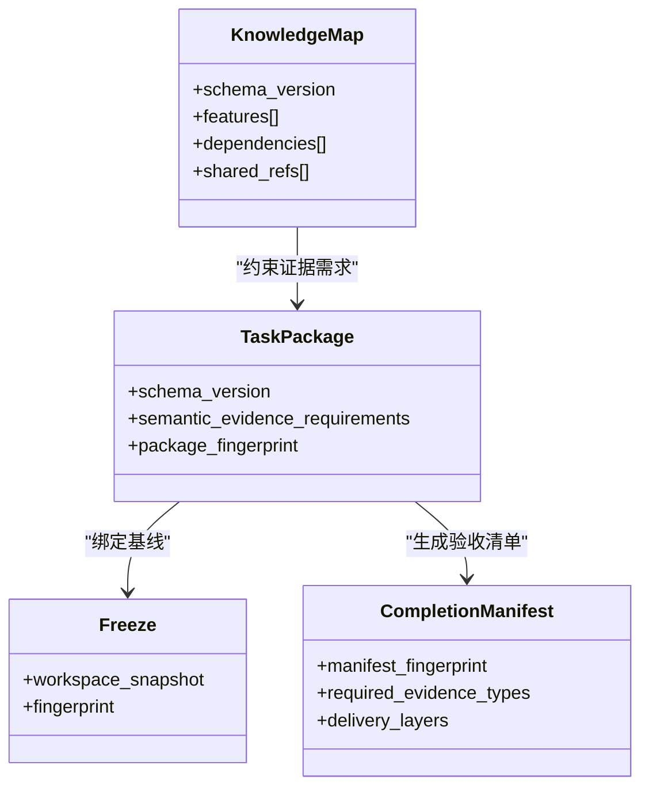
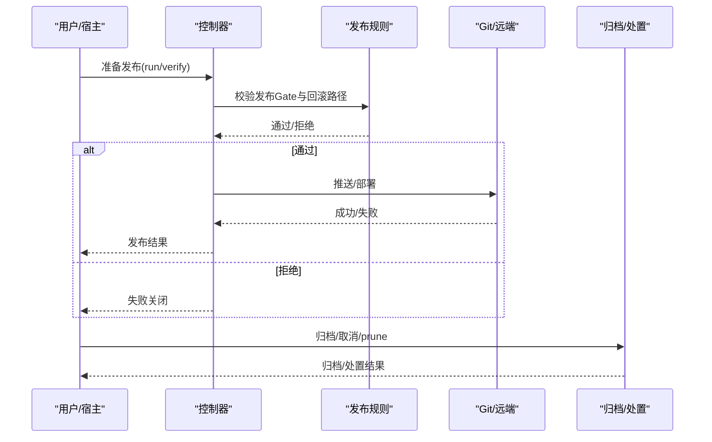
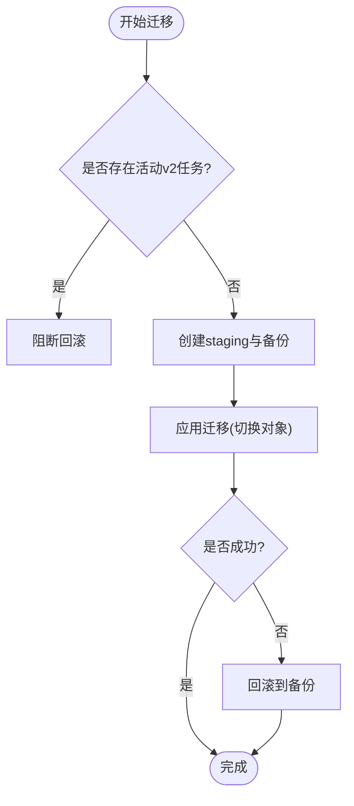
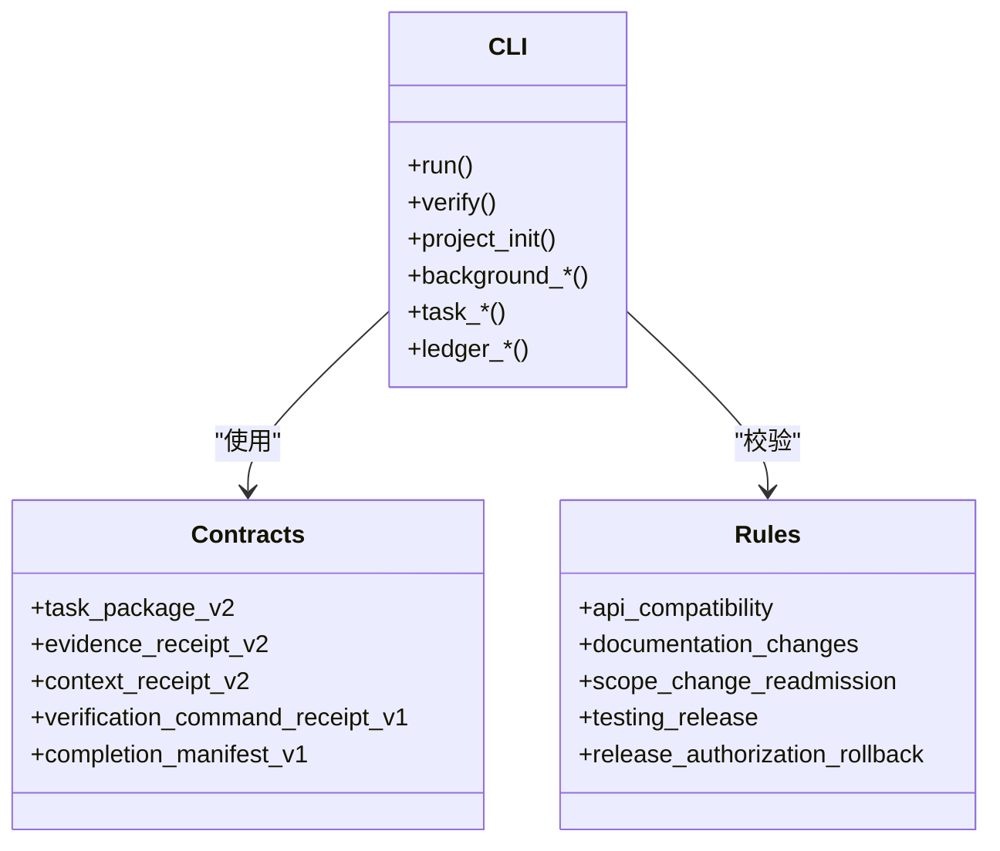
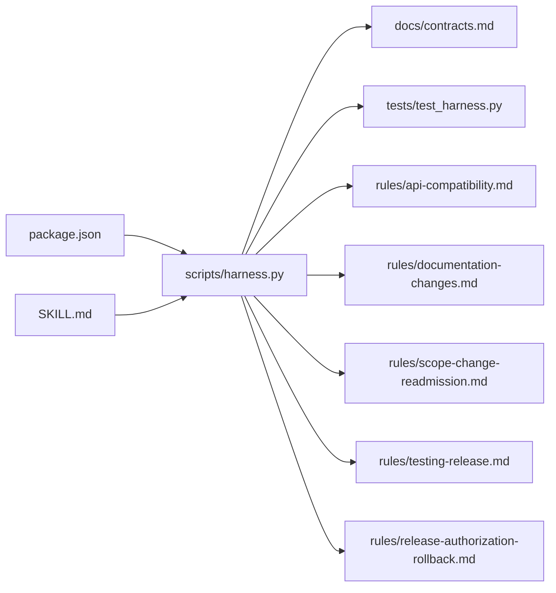

# 工作包版本控制

<cite>
**本文引用的文件**
- [scripts/harness.py](file://scripts/harness.py)
- [tests/test_harness.py](file://tests/test_harness.py)
- [package.json](file://package.json)
- [SKILL.md](file://SKILL.md)
- [docs/contracts.md](file://docs/contracts.md)
- [harness-home/rules/release-authorization-rollback.md](file://harness-home/rules/release-authorization-rollback.md)
- [harness-home/rules/testing-release.md](file://harness-home/rules/testing-release.md)
- [harness-home/rules/api-compatibility.md](file://harness-home/rules/api-compatibility.md)
- [harness-home/rules/documentation-changes.md](file://harness-home/rules/documentation-changes.md)
- [harness-home/rules/scope-change-readmission.md](file://harness-home/rules/scope-change-readmission.md)
</cite>

## 目录
1. [引言](#引言)
2. [项目结构](#项目结构)
3. [核心组件](#核心组件)
4. [架构总览](#架构总览)
5. [详细组件分析](#详细组件分析)
6. [依赖关系分析](#依赖关系分析)
7. [性能考量](#性能考量)
8. [故障排查指南](#故障排查指南)
9. [结论](#结论)
10. [附录](#附录)

## 引言
本文件面向 Docs Harness 的工作包版本控制系统，聚焦以下目标：
- 明确工作包的版本命名规则与语义化版本管理策略
- 阐述版本冲突检测与解决策略（合并算法、冲突标记处理）
- 说明版本依赖关系管理（依赖解析、循环依赖检测、版本锁定）
- 描述版本的发布与归档流程（版本标签、发布说明生成）
- 提供版本迁移工具与升级路径规划
- 给出版本控制的 CLI 操作参考与 API 接口规范

该文档以仓库中的控制器脚本、测试套件、合同文档与规则集为依据，确保所有实现细节均可追溯。

## 项目结构
Docs Harness 的核心由 Python 控制器脚本、测试用例、合同文档与规则集组成。版本控制相关能力主要分布在控制器脚本与合同文档中，并通过规则集对发布、测试、API 兼容等关键 Gate 进行约束。

**图示来源**
- [scripts/harness.py:1-120](file://scripts/harness.py#L1-L120)
- [docs/contracts.md:1-120](file://docs/contracts.md#L1-L120)
- [tests/test_harness.py:1-120](file://tests/test_harness.py#L1-L120)
- [package.json:1-23](file://package.json#L1-L23)
- [SKILL.md:1-40](file://SKILL.md#L1-L40)

**章节来源**
- [scripts/harness.py:1-120](file://scripts/harness.py#L1-L120)
- [docs/contracts.md:1-120](file://docs/contracts.md#L1-L120)
- [tests/test_harness.py:1-120](file://tests/test_harness.py#L1-L120)
- [package.json:1-23](file://package.json#L1-L23)
- [SKILL.md:1-40](file://SKILL.md#L1-L40)

## 核心组件
- 版本常量与 Schema 定义：控制器内集中声明任务包、事件、证据、冻结、授权、配置等 Schema 名称与版本号，以及当前控制器版本常量。
- 任务包与编译态：v2 任务包与编译任务对象，包含意图、变更面、范围、Git 作用域、允许动作等。
- 证据与收据：evidence-receipt/v2、context-receipt/v2、verification-command-receipt/v1 等，用于可审计的证据链与命令缓存。
- Git 预检与后检：git_preflight_contract、git_postcheck 等，保障 fetch/sync 的受控性与一致性。
- 准入与完成清单：completion-manifest/v1 与 delivery_layers，统一验收层级与阻断项。
- 后台治理：background-job/v2，支持 direct/goal/phased 路线与进度验收。

**章节来源**
- [scripts/harness.py:26-106](file://scripts/harness.py#L26-L106)
- [docs/contracts.md:9-120](file://docs/contracts.md#L9-L120)
- [docs/contracts.md:165-220](file://docs/contracts.md#L165-L220)
- [docs/contracts.md:97-133](file://docs/contracts.md#L97-L133)
- [docs/contracts.md:303-348](file://docs/contracts.md#L303-L348)

## 架构总览
下图展示版本控制相关的关键交互：任务入口、意图编译、Git 预检/后检、证据与收据、完成清单与交付层、后台 Job 协调。

**图示来源**
- [scripts/harness.py:680-794](file://scripts/harness.py#L680-L794)
- [docs/contracts.md:9-120](file://docs/contracts.md#L9-L120)
- [docs/contracts.md:165-220](file://docs/contracts.md#L165-L220)
- [docs/contracts.md:303-348](file://docs/contracts.md#L303-L348)

## 详细组件分析

### 版本命名与语义化版本管理
- 控制器版本常量：在脚本顶部声明当前版本，便于自描述与兼容性判断。
- 包元信息：package.json 中维护包名、版本与脚本；SKILL.md 中记录技能版本与状态。
- 语义化版本策略：通过 Schema 版本后缀（如 v2、v4）与控制器版本常量区分协议与实现演进；任务包、证据、上下文、冻结等均采用独立 Schema 版本，避免耦合。

**图示来源**
- [scripts/harness.py:26-30](file://scripts/harness.py#L26-L30)
- [package.json:1-23](file://package.json#L1-L23)
- [SKILL.md:1-10](file://SKILL.md#L1-L10)

**章节来源**
- [scripts/harness.py:26-30](file://scripts/harness.py#L26-L30)
- [package.json:1-23](file://package.json#L1-L23)
- [SKILL.md:1-10](file://SKILL.md#L1-L10)

### 版本冲突检测与解决策略
- 冲突检测：基于 Git 预检快照（head、index_tree、worktree_fingerprint、controlled_refs_namespace）、远端漂移检查与非 fast-forward 判定。
- 解决策略：
  - 脏工作区重叠：要求清理或限定范围
  - 非 fast-forward：强制 rebase/fast-forward 或创建新分支
  - LFS/Submodule 不可用：环境修复后再试
  - 远端漂移：触发重新准入，复用已冻结方案指纹时直接回到 ready_planned

**图示来源**
- [scripts/harness.py:680-794](file://scripts/harness.py#L680-L794)

**章节来源**
- [scripts/harness.py:680-794](file://scripts/harness.py#L680-L794)

### 版本依赖关系管理
- 依赖解析：知识地图 features.dependencies 字段与 knowledge-map.json 共同约束功能依赖；任务包与编译态不直接声明外部依赖，而是通过 Gate 与证据类型约束。
- 循环依赖检测：knowledge-map 构建阶段按实际 changed_paths 与 selected features 路由，避免环状引用；bootstrap 与增量 Job 共享过滤器与库存指纹，降低误判。
- 版本锁定：通过 package_fingerprint、content_set_fingerprint、freeze.json.workspace_snapshot 与 completion-manifest 的 manifest_fingerprint 锁定上下文与证据基线。

**图示来源**
- [tests/test_harness.py:125-144](file://tests/test_harness.py#L125-L144)
- [docs/contracts.md:63-95](file://docs/contracts.md#L63-L95)
- [docs/contracts.md:134-164](file://docs/contracts.md#L134-L164)

**章节来源**
- [tests/test_harness.py:125-144](file://tests/test_harness.py#L125-L144)
- [docs/contracts.md:63-95](file://docs/contracts.md#L63-L95)
- [docs/contracts.md:134-164](file://docs/contracts.md#L134-L164)

### 版本的发布与归档流程
- 发布 Gate：release-authorization-rollback 规则要求外部目标、产物身份、授权范围、发布步骤、观测窗口与回滚路径冻结；失败模式为外部写入前停止。
- 测试放行：testing-release 规则要求区分静态检查、源码测试、运行时验证、产物验证与真实产品验收。
- 归档：v1 任务通过 task archive 写入处置索引；v2 任务取消通过 task cancel 原子写入并记录事件；prune 清理终态对象。

**图示来源**
- [harness-home/rules/release-authorization-rollback.md:1-29](file://harness-home/rules/release-authorization-rollback.md#L1-L29)
- [harness-home/rules/testing-release.md:1-29](file://harness-home/rules/testing-release.md#L1-L29)
- [docs/contracts.md:236-282](file://docs/contracts.md#L236-L282)

**章节来源**
- [harness-home/rules/release-authorization-rollback.md:1-29](file://harness-home/rules/release-authorization-rollback.md#L1-L29)
- [harness-home/rules/testing-release.md:1-29](file://harness-home/rules/testing-release.md#L1-L29)
- [docs/contracts.md:236-282](file://docs/contracts.md#L236-L282)

### 版本迁移工具与升级路径规划
- v1→v2 迁移：task migrate 仅允许预览与应用；apply 在 staging 目录创建备份与 journal，切换 task-package、compiled-task、freeze、evidence-index、context/authorization receipts；中断即回滚。
- 回滚检查：存在活动 v2 任务时 rollback-check 阻断；无活动任务表示回滚窗口可用。
- 升级路径：project upgrade preserve-and-merge 合法 document_routes；非法路由或缺少路由合同的旧治理 Job 返回 needs_manual_migration，不覆盖真源配置或旧 Job scope。

**图示来源**
- [docs/contracts.md:236-282](file://docs/contracts.md#L236-L282)
- [SKILL.md:20-24](file://SKILL.md#L20-L24)

**章节来源**
- [docs/contracts.md:236-282](file://docs/contracts.md#L236-L282)
- [SKILL.md:20-24](file://SKILL.md#L20-L24)

### CLI 操作参考与 API 接口规范
- CLI 入口：run、verify、project init/upgrade、background、task、ledger 等；参数只接受文件路径，错误结构化输出。
- API 规范：task-package/v2、evidence-receipt/v2、context-receipt/v2、verification-command-receipt/v1、completion-manifest/v1 等；退出码约定 0/1/2/3/4。
- 规则集成：active rules 列表与 rule_id 映射，内容指纹校验，failure_mode 决定失败关闭点。

**图示来源**
- [SKILL.md:25-56](file://SKILL.md#L25-L56)
- [docs/contracts.md:9-120](file://docs/contracts.md#L9-L120)
- [docs/contracts.md:165-220](file://docs/contracts.md#L165-L220)
- [docs/contracts.md:359-370](file://docs/contracts.md#L359-L370)
- [harness-home/rules/api-compatibility.md:1-29](file://harness-home/rules/api-compatibility.md#L1-L29)
- [harness-home/rules/documentation-changes.md:1-29](file://harness-home/rules/documentation-changes.md#L1-L29)
- [harness-home/rules/scope-change-readmission.md:1-29](file://harness-home/rules/scope-change-readmission.md#L1-L29)
- [harness-home/rules/testing-release.md:1-29](file://harness-home/rules/testing-release.md#L1-L29)
- [harness-home/rules/release-authorization-rollback.md:1-29](file://harness-home/rules/release-authorization-rollback.md#L1-L29)

**章节来源**
- [SKILL.md:25-56](file://SKILL.md#L25-L56)
- [docs/contracts.md:9-120](file://docs/contracts.md#L9-L120)
- [docs/contracts.md:165-220](file://docs/contracts.md#L165-L220)
- [docs/contracts.md:359-370](file://docs/contracts.md#L359-L370)
- [harness-home/rules/api-compatibility.md:1-29](file://harness-home/rules/api-compatibility.md#L1-L29)
- [harness-home/rules/documentation-changes.md:1-29](file://harness-home/rules/documentation-changes.md#L1-L29)
- [harness-home/rules/scope-change-readmission.md:1-29](file://harness-home/rules/scope-change-readmission.md#L1-L29)
- [harness-home/rules/testing-release.md:1-29](file://harness-home/rules/testing-release.md#L1-L29)
- [harness-home/rules/release-authorization-rollback.md:1-29](file://harness-home/rules/release-authorization-rollback.md#L1-L29)

## 依赖关系分析
- 控制器与契约：控制器严格遵循 contracts.md 定义的 Schema 与状态机；测试用例覆盖关键路径与边界条件。
- 规则与 Gate：规则文件定义关键词、必需方案字段、证据类型与失败模式；控制器在执行前进行 Gate 判定与失败关闭。
- 包元数据：package.json 与 SKILL.md 提供版本与脚本入口，便于自动化与安装。

**图示来源**
- [package.json:1-23](file://package.json#L1-L23)
- [SKILL.md:1-40](file://SKILL.md#L1-L40)
- [scripts/harness.py:1-120](file://scripts/harness.py#L1-L120)
- [docs/contracts.md:1-120](file://docs/contracts.md#L1-L120)
- [tests/test_harness.py:1-120](file://tests/test_harness.py#L1-L120)
- [harness-home/rules/*.md:1-29](file://harness-home/rules/api-compatibility.md#L1-L29)

**章节来源**
- [package.json:1-23](file://package.json#L1-L23)
- [SKILL.md:1-40](file://SKILL.md#L1-L40)
- [scripts/harness.py:1-120](file://scripts/harness.py#L1-L120)
- [docs/contracts.md:1-120](file://docs/contracts.md#L1-L120)
- [tests/test_harness.py:1-120](file://tests/test_harness.py#L1-L120)
- [harness-home/rules/api-compatibility.md:1-29](file://harness-home/rules/api-compatibility.md#L1-L29)
- [harness-home/rules/documentation-changes.md:1-29](file://harness-home/rules/documentation-changes.md#L1-L29)
- [harness-home/rules/scope-change-readmission.md:1-29](file://harness-home/rules/scope-change-readmission.md#L1-L29)
- [harness-home/rules/testing-release.md:1-29](file://harness-home/rules/testing-release.md#L1-L29)
- [harness-home/rules/release-authorization-rollback.md:1-29](file://harness-home/rules/release-authorization-rollback.md#L1-L29)

## 性能考量
- 事件脱敏：event/v2 仅保存有界字段，避免大日志与敏感信息影响 I/O 与存储。
- 证据缓存：verification-command-receipt/v1 支持命令级缓存，输入不变则复用收据，减少重复执行。
- 快照与指纹：workspace_snapshot、manifest_fingerprint、package_fingerprint 等指纹计算避免重复加载与比较开销。
- Git 操作限流：git_command 超时与阈值（如删除数量阈值）防止长时间阻塞与大规模破坏性操作。

[本节为通用指导，无需具体文件分析]

## 故障排查指南
- 常见错误码：
  - 0：成功
  - 1：项目检查/自检失败
  - 2：输入/合同/绑定/状态无效
  - 3：需要方案/授权/证据/迁移/用户输入/Git 交付
  - 4：范围/漂移/Gate/远端/授权/规则变化，需重新准入
- 典型问题定位：
  - Git 预检失败：检查脏工作区、LFS/Submodule、非 fast-forward
  - 证据校验失败：核对 producer、exit_code、digest、read/write_set
  - Gate 阻断：查看 matched_gates 与 failure_mode，补充方案字段或证据
  - 迁移失败：检查 staging 备份与 journal，确认回滚路径

**章节来源**
- [docs/contracts.md:359-370](file://docs/contracts.md#L359-L370)
- [scripts/harness.py:680-794](file://scripts/harness.py#L680-L794)
- [docs/contracts.md:165-220](file://docs/contracts.md#L165-L220)

## 结论
Docs Harness 的版本控制系统以强契约、强规则与强审计为核心，通过语义化版本、严格的 Git 预检/后检、证据与收据链、完成清单与交付层、以及后台治理，实现了从开发到发布的可控闭环。迁移与回滚机制确保升级安全，CLI 与 API 规范提供一致的操作界面。建议在生产环境中严格遵循规则与退出码约定，结合测试与质量账本持续改进。

[本节为总结，无需具体文件分析]

## 附录
- 术语表：
  - 任务包：task-package/v2，描述意图、范围、Git 作用域与允许动作
  - 证据收据：evidence-receipt/v2，绑定任务、目标、包指纹与读写集合
  - 上下文收据：context-receipt/v2，跨阶段复用上下文正文
  - 验证命令收据：verification-command-receipt/v1，命令级缓存与复用
  - 完成清单：completion-manifest/v1，固定验收项与交付层
- 参考路径：
  - 控制器版本与 Schema：scripts/harness.py
  - 契约与状态机：docs/contracts.md
  - 规则与 Gate：harness-home/rules/*.md
  - 包元信息与脚本：package.json
  - 技能说明与安装：SKILL.md

[本节为附录，无需具体文件分析]