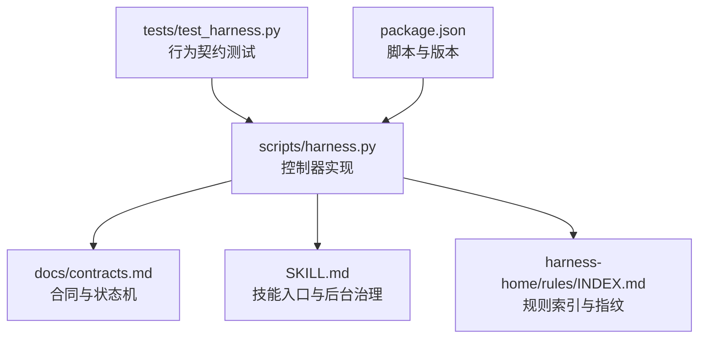
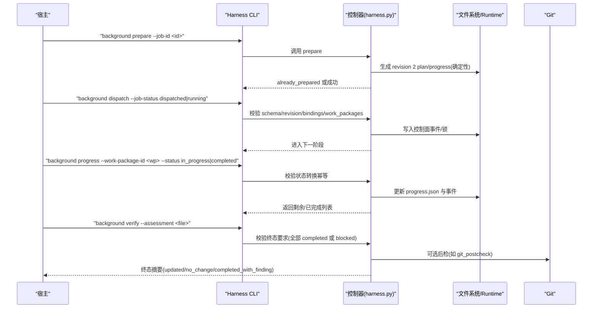
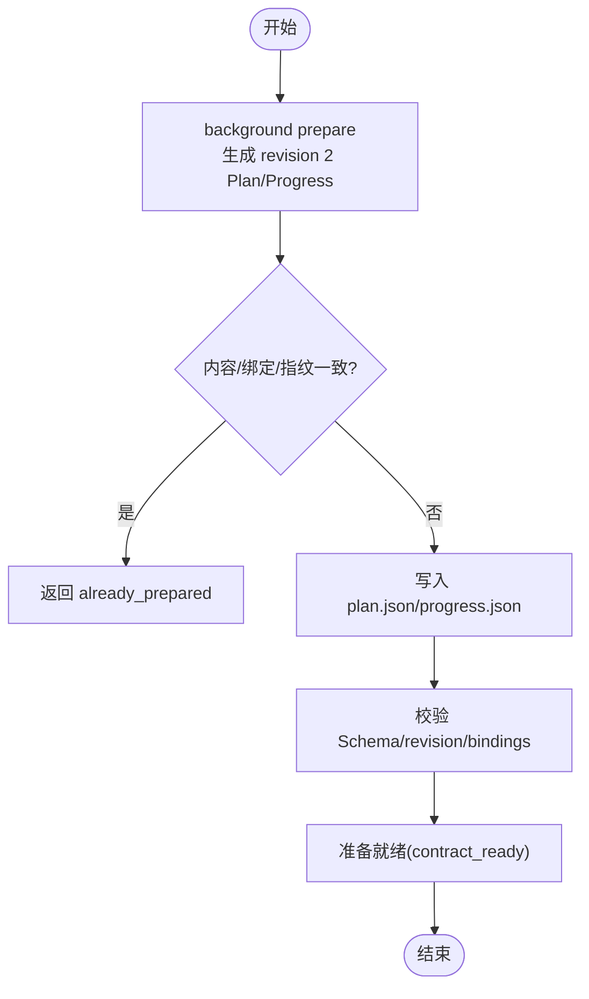
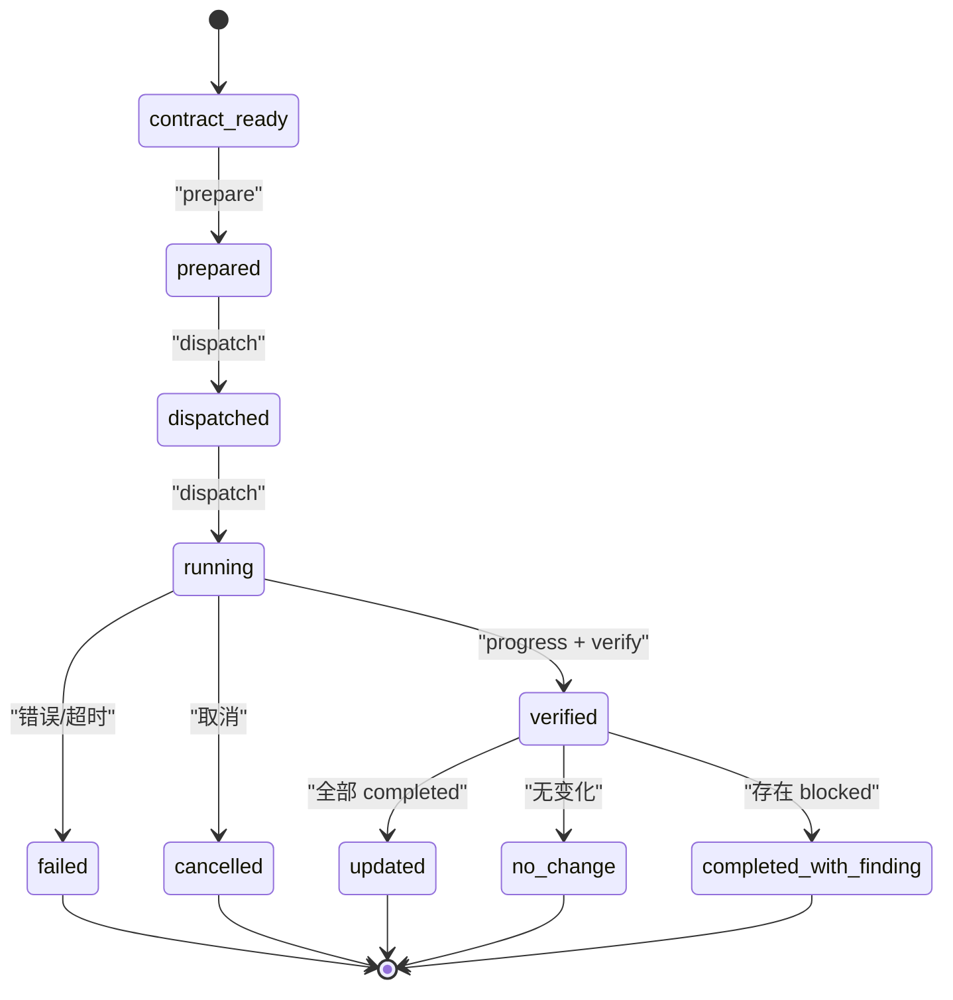
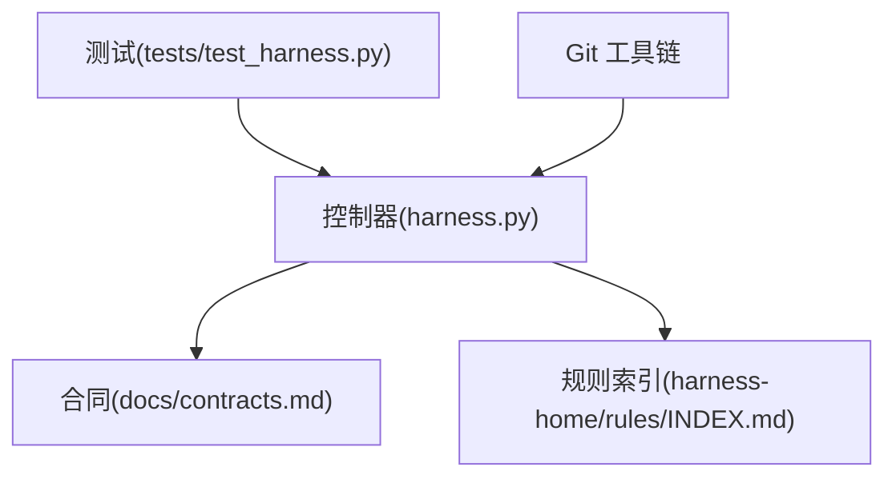

# 工作包管理

<cite>
**本文引用的文件**   
- [scripts/harness.py](file://scripts/harness.py)
- [docs/contracts.md](file://docs/contracts.md)
- [SKILL.md](file://SKILL.md)
- [package.json](file://package.json)
- [harness-home/rules/INDEX.md](file://harness-home/rules/INDEX.md)
- [tests/test_harness.py](file://tests/test_harness.py)
</cite>

## 目录
1. [简介](#简介)
2. [项目结构](#项目结构)
3. [核心组件](#核心组件)
4. [架构总览](#架构总览)
5. [详细组件分析](#详细组件分析)
6. [依赖关系分析](#依赖关系分析)
7. [性能考量](#性能考量)
8. [故障排除指南](#故障排除指南)
9. [结论](#结论)
10. [附录：CLI与接口规范](#附录cli与接口规范)

## 简介
本文件面向 Docs Harness 的工作包管理系统，系统性阐述工作包的创建、结构定义、生命周期管理、版本控制、存储格式、数据完整性验证、进度跟踪（更新频率、增量同步、状态持久化）、依赖管理与冲突解决策略，并给出最佳实践与故障排除指南。同时提供完整的 CLI 命令参考与 JSON 接口规范，帮助宿主与集成方正确对接 Harness 的控制面与数据面。

## 项目结构
- scripts/harness.py：控制器源码真源，负责任务准入、上下文、验收、知识生命周期与后台 Job 状态机；包含工作包相关常量、校验、事件与进度处理逻辑。
- docs/contracts.md：对外合同与状态机、证据收据、Git 状态合同、Runtime 与交付层等权威说明。
- SKILL.md：技能入口与后台治理流程、质量账本、按需读取的约定。
- package.json：项目元信息与脚本入口，用于安装与自检。
- harness-home/rules/INDEX.md：受管规则索引与激活条件，确保规则快照一致性。
- tests/test_harness.py：覆盖关键路径与边界条件的测试用例，体现工作包与后台 Job 的行为契约。

**图表来源** 
- [scripts/harness.py](file://scripts/harness.py)
- [docs/contracts.md](file://docs/contracts.md)
- [SKILL.md](file://SKILL.md)
- [harness-home/rules/INDEX.md](file://harness-home/rules/INDEX.md)
- [tests/test_harness.py](file://tests/test_harness.py)
- [package.json](file://package.json)

**章节来源**
- [scripts/harness.py](file://scripts/harness.py)
- [docs/contracts.md](file://docs/contracts.md)
- [SKILL.md](file://SKILL.md)
- [package.json](file://package.json)
- [harness-home/rules/INDEX.md](file://harness-home/rules/INDEX.md)
- [tests/test_harness.py](file://tests/test_harness.py)

## 核心组件
- 任务与工作包模型：task-package/v2 定义意图、变更面、范围、允许动作与 Gate 编译结果；工作包作为后台 Job 的最小执行单元，具有唯一 ID 与状态机。
- 后台 Job 与路线：background-job/v2 支持 background_direct、background_goal、background_goal_phased 三种路线；复杂路线由控制面生成 Plan/Progress 并严格校验。
- 证据与收据：evidence-receipt/v2 绑定 task/target/package fingerprint，支持受管副本与命令缓存；workspace_attribution 自动归因在范围内未证明写入。
- Git 状态合同：git_fetch/git_sync 预检与后检，锁定远端引用、LFS/Submodule 可用性、fast-forward 约束与漂移重新准入。
- Runtime 与持久化：任务与后台运行态分别位于 Git 元数据或非 Git 目录；事件采用 JSONL 追加写，原子写入保证一致性。

**章节来源**
- [docs/contracts.md](file://docs/contracts.md)
- [scripts/harness.py](file://scripts/harness.py)

## 架构总览
Docs Harness 以控制器为核心，围绕“任务—工作包—证据—验收—后台治理”的主线，形成严格的准入、授权与验收闭环。工作包是后台 Job 的执行粒度，其生命周期由 prepare→dispatched→running→progress→verify 驱动，所有控制面文件仅由 CLI 写入，业务数据面受 allowed_write_scope 约束。

**图表来源** 
- [scripts/harness.py](file://scripts/harness.py)
- [docs/contracts.md](file://docs/contracts.md)
- [SKILL.md](file://SKILL.md)

**章节来源**
- [scripts/harness.py](file://scripts/harness.py)
- [docs/contracts.md](file://docs/contracts.md)
- [SKILL.md](file://SKILL.md)

## 详细组件分析

### 工作包模型与创建过程
- 模型字段：工作包具备唯一 id、初始状态 pending、可转换至 in_progress/blocked/completed，并在 Progress 中维护 completed_work_packages 与 remaining_work_packages。
- 创建时机：后台 Job 通过 prepare 从冻结 goal_contract 与 work_packages 列表确定性生成 revision 2 Plan/Progress，不写入时间戳，重复调用在内容、绑定与指纹一致时返回 already_prepared。
- 幂等与修复：部分/无效/冲突/篡改工件不会被普通 prepare 覆盖，需显式 --repair 先归档再生成。

**图表来源** 
- [scripts/harness.py](file://scripts/harness.py)
- [docs/contracts.md](file://docs/contracts.md)

**章节来源**
- [scripts/harness.py](file://scripts/harness.py)
- [docs/contracts.md](file://docs/contracts.md)

### 工作包结构与存储格式
- 位置：后台 Job 的 job.json、plan.json、progress.json、events.jsonl 与控制锁属于控制面，位于 .docs-harness/background/<job-id>/ 或 Git 元数据下的对应目录。
- 格式：JSON/JSONL，使用原子写入与追加写，确保并发安全与可重放性。
- 指纹：计划与进度基于冻结目标与 idempotency_key 生成稳定指纹，避免漂移导致误判。

**章节来源**
- [scripts/harness.py](file://scripts/harness.py)
- [docs/contracts.md](file://docs/contracts.md)

### 生命周期与状态机
- 阶段：contract_ready → prepare → dispatched → running → progress → verify → 终态(updated/no_change/completed_with_finding/failed/cancelled)。
- 转换约束：
  - background progress 仅允许 pending→in_progress|blocked 与 in_progress→completed|blocked，相同状态幂等，倒退/跳过/未知 ID/自由文本原因失败关闭。
  - background verify 对 updated/no_change 要求全部工作包 completed；completed_with_finding 只允许 completed|blocked 并返回 blocked ID。
- 重试与修复：retry 归档旧 attempt 工件并要求重新 prepare，不继承完成进度；损坏/篡改需 --repair。

**图表来源** 
- [scripts/harness.py](file://scripts/harness.py)
- [docs/contracts.md](file://docs/contracts.md)

**章节来源**
- [scripts/harness.py](file://scripts/harness.py)
- [docs/contracts.md](file://docs/contracts.md)

### 版本控制与数据完整性
- 版本：task-package/v2、background-job/v2、evidence-receipt/v2 等，控制器按 schema_version 校验与迁移。
- 完整性：事件 JSONL 追加写，原子写入 JSON；指纹校验防止漂移；Git 后检锁定 ref 与对象，拒绝非 fast-forward、脏工作区重叠、危险删除等。
- 迁移：v1→v2 迁移需显式 apply，回滚检查在有活动 v2 任务时阻断。

**章节来源**
- [docs/contracts.md](file://docs/contracts.md)
- [scripts/harness.py](file://scripts/harness.py)

### 进度跟踪机制
- 更新频率：宿主在业务执行过程中按需调用 background progress 更新工作包状态；控制器派生完成与剩余列表。
- 增量同步：背景 Job 的 changed_paths 与 knowledge_flow 决定是否需要 bootstrap/增量；changed_paths=[] 时返回 no_write_no_sync，不创建 Job。
- 状态持久化：progress.json 与 events.jsonl 持久化，replay_progress 可从事件重建状态；控制锁保证并发安全。

**章节来源**
- [scripts/harness.py](file://scripts/harness.py)
- [docs/contracts.md](file://docs/contracts.md)

### 依赖管理与冲突解决
- 依赖：knowledge_map 与 feature 文档决定上下文加载；Gate 编译根据任务文本与路径触发不同 Gate，安全底线不可豁免。
- 冲突：
  - Git 漂移：远端漂移触发重新准入，git_sync_landed_scope 累积已落盘文件并入 write_scope。
  - 工作区脏读：dirty overlap 与 non-fast-forward 被预检阻断。
  - 规则指纹漂移：active 规则指纹不一致失败关闭，必须 preserve-and-merge。
- 解决策略：增量准入（仅追加普通 Gate 且合同不变）或完整重新准入（高风险/范围/合同变化）。

**章节来源**
- [docs/contracts.md](file://docs/contracts.md)
- [harness-home/rules/INDEX.md](file://harness-home/rules/INDEX.md)
- [scripts/harness.py](file://scripts/harness.py)

### 最佳实践
- 明确 scope：write_scope/read_scope/git_scope 精确声明，避免自然语言伪装为路径。
- 分步推进：复杂路线先 prepare，再建立 Goal/Plan，随后逐步 dispatch/progress/verify。
- 证据最小化：优先使用受管副本与命令缓存，减少重复执行与临时文件污染。
- 监控事件：关注 events.jsonl 与效率遥测字段，定位瓶颈与循环。

[本节为通用指导，不直接分析具体文件]

### 故障排除指南
- 常见错误码：
  - 2：输入/合同/绑定/状态无效
  - 3：需要方案/授权/证据/迁移/用户输入/Git 交付
  - 4：范围/漂移/Gate/远端/授权/规则变化，必须重新准入
- 排查步骤：
  - 检查 preflight/postcheck 返回值与 blockers
  - 核对 active 规则指纹与配置一致性
  - 查看 events.jsonl 与 progress.json 状态是否合法
  - 对于 Git 操作，确认 LFS/Submodule 可用性与 fast-forward 约束

**章节来源**
- [docs/contracts.md](file://docs/contracts.md)
- [scripts/harness.py](file://scripts/harness.py)

## 依赖关系分析
- 控制器依赖合同与规则：contracts.md 定义状态机与收据格式，rules INDEX.md 确保规则快照一致性。
- 测试覆盖契约：tests/test_harness.py 验证 run/verify/background 的关键路径与边界条件。
- 外部工具：Git 命令封装于 git_command，超时与错误统一转结构化错误。

**图表来源** 
- [scripts/harness.py](file://scripts/harness.py)
- [docs/contracts.md](file://docs/contracts.md)
- [harness-home/rules/INDEX.md](file://harness-home/rules/INDEX.md)
- [tests/test_harness.py](file://tests/test_harness.py)

**章节来源**
- [scripts/harness.py](file://scripts/harness.py)
- [docs/contracts.md](file://docs/contracts.md)
- [harness-home/rules/INDEX.md](file://harness-home/rules/INDEX.md)
- [tests/test_harness.py](file://tests/test_harness.py)

## 性能考量
- 上下文复用：同一 task/target/compiler contract 与内容指纹下正文不重复交付，跨阶段复用减少往返。
- 验证命令缓存：按 argv/produces/输入指纹缓存，输入不变则复用收据，避免重复执行。
- 增量准入：仅追加普通 Gate 且合同不变时走 incremental_admission，降低重新准入成本。
- 事件脱敏：事件仅保存有界字段，便于统计与审计而不泄露敏感信息。

[本节为通用指导，不直接分析具体文件]

## 故障排除指南
- 输入与合同：确保 JSON 类型、大小限制、UTF-8 编码与路径有效；文件型参数不接受内联内容。
- Git 操作：确认 remote 可达、ref 存在、LFS/Submodule 可用；非 fast-forward 或脏工作区重叠将阻断。
- 规则与配置：缺失 rules_root 或指纹漂移将失败关闭，需 preserve-and-merge。
- 后台 Job：prepare/progress/verify 前复验绑定与指纹；损坏/篡改需 --repair。

**章节来源**
- [docs/contracts.md](file://docs/contracts.md)
- [scripts/harness.py](file://scripts/harness.py)

## 结论
Docs Harness 的工作包管理系统以严格的合同与状态机为基础，结合证据收据、Git 后检与受管 Runtime，实现了高可靠的任务与工作包生命周期管理。通过增量准入、上下文与验证命令复用、事件脱敏与幂等设计，系统在安全性与效率之间取得平衡。宿主应遵循最佳实践，精准声明范围与证据，充分利用 CLI 与接口能力，确保任务与工作包的正确执行与验收。

[本节为总结，不直接分析具体文件]

## 附录：CLI与接口规范

### CLI 命令参考（节选）
- 项目初始化与检查
  - project init --target <project> --json
  - project check --target <project> --json
- 任务执行与验收
  - run --target . --task "<原始用户任务>" --json
  - verify --target . --task-id <task-id> --evidence <evidence.json> --json
- 后台治理
  - background list --target . --json
  - background status --target . --job-id <job-id> --json
  - background prepare --target . --job-id <job-id> --json
  - background dispatch --target . --job-id <job-id> --job-status dispatched|running --json
  - background progress --target . --job-id <job-id> --work-package-id <wp-id> --work-package-status in_progress|completed --json
  - background verify --target . --job-id <job-id> --assessment <file> --json
  - background retry --target . --job-id <job-id> --json

**章节来源**
- [SKILL.md](file://SKILL.md)
- [docs/contracts.md](file://docs/contracts.md)

### JSON 接口规范（节选）
- task-package/v2：包含 task_intent、candidate_intents、mutation_profile、read/write/git/external_scope、allowed_actions 等字段。
- evidence-receipt/v2：绑定 task_id、target_identity、package_fingerprint、producer、command_argv_digest、cwd、起止时间、ttl、exit_code、输出摘要、read_set/write_set 等。
- background-job/v2：execution_route、goal_contract、work_packages、host_dispatch_contract、allowed_write_scope 等。
- Git 状态合同：repo_identity、remote、preflight_target_oid、head、index_tree、worktree_fingerprint、controlled_refs_namespace、lfs_available、submodule_available、git_sync_scope 等。

**章节来源**
- [docs/contracts.md](file://docs/contracts.md)
- [scripts/harness.py](file://scripts/harness.py)