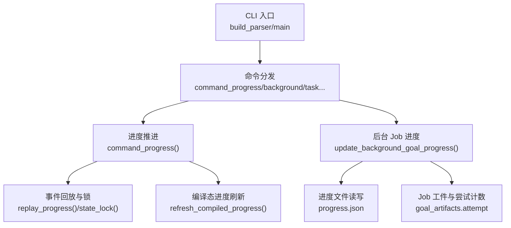
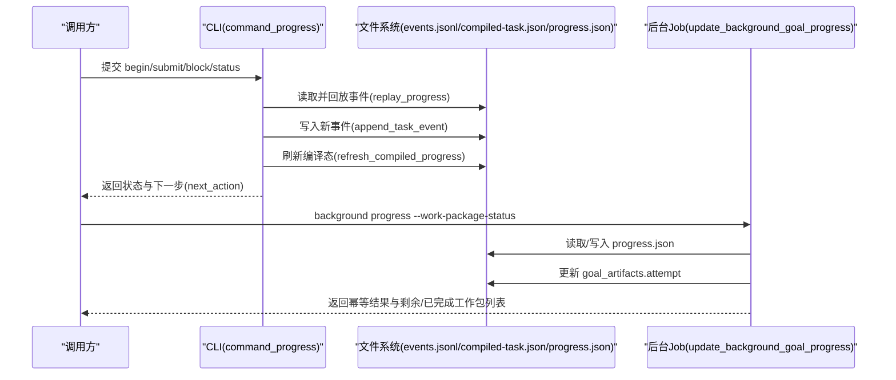
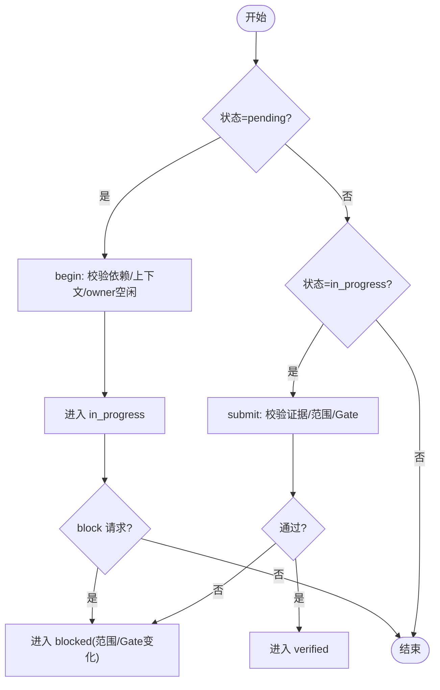
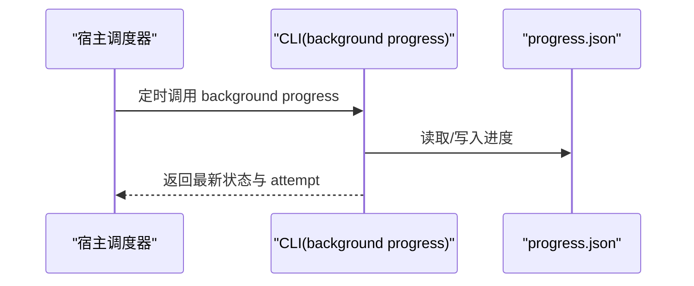
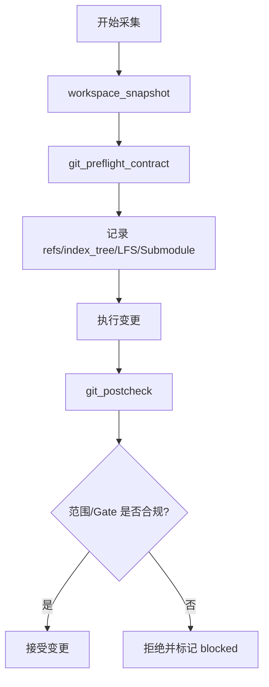
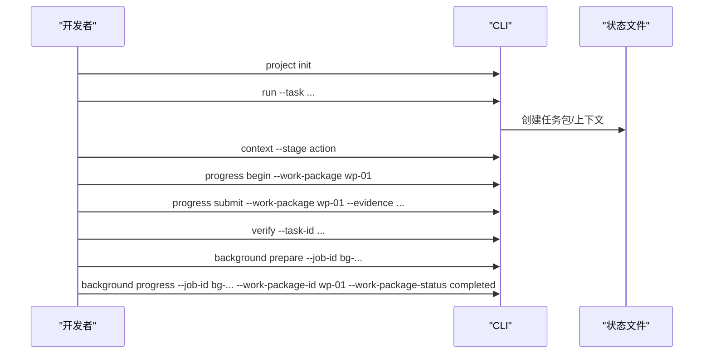
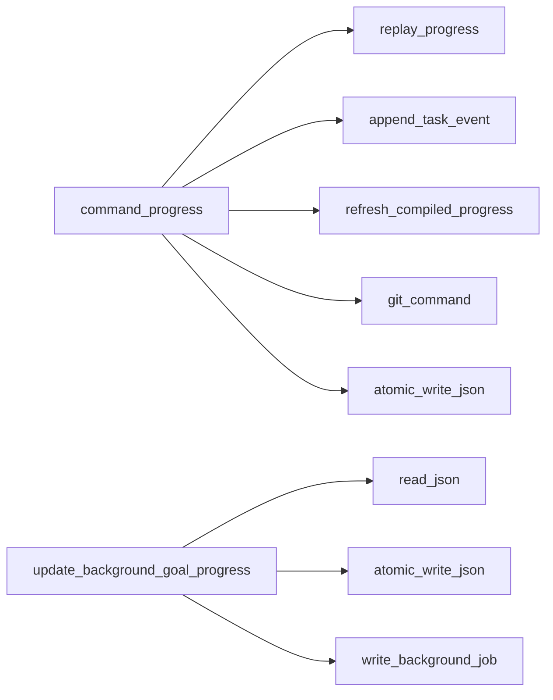

# 工作包进度跟踪

<cite>
**本文引用的文件**   
- [scripts/harness.py](file://scripts/harness.py)
- [tests/test_harness.py](file://tests/test_harness.py)
- [harness-home/rules/INDEX.md](file://harness-home/rules/INDEX.md)
- [package.json](file://package.json)
</cite>

## 目录
1. [简介](#简介)
2. [项目结构](#项目结构)
3. [核心组件](#核心组件)
4. [架构总览](#架构总览)
5. [详细组件分析](#详细组件分析)
6. [依赖关系分析](#依赖关系分析)
7. [性能考量](#性能考量)
8. [故障排查指南](#故障排查指南)
9. [结论](#结论)
10. [附录](#附录)

## 简介
本文件面向 Docs Harness 的“工作包进度跟踪系统”，系统性说明：
- 进度状态定义与状态机转换规则
- 进度更新触发机制（事件驱动与定时轮询）
- 进度数据采集方法（CPU、内存、I/O）
- 进度信息展示格式（人类可读与机器可解析）
- 监控告警与阈值配置
- 进度跟踪 API 接口与集成示例

该能力主要服务于任务执行过程中的工作包（work package）生命周期管理，以及后台 Job（background job）中复杂目标（goal）的工作包进度编排。

## 项目结构
- scripts/harness.py：独立控制器脚本，包含 CLI、状态机、事件回放、进度持久化、后台 Job 控制等核心实现
- tests/test_harness.py：覆盖进度推进、验证、后台 Job 准备与进度更新的测试用例
- harness-home/rules/INDEX.md：通用规则索引，用于约束运行期规则快照与激活条件
- package.json：打包清单与脚本入口，便于本地自检与测试

**图表来源** 
- [scripts/harness.py:10390-10560](file://scripts/harness.py#L10390-L10560)
- [scripts/harness.py:5700-5900](file://scripts/harness.py#L5700-L5900)
- [scripts/harness.py:8520-8719](file://scripts/harness.py#L8520-L8719)

**章节来源**
- [scripts/harness.py:10390-10560](file://scripts/harness.py#L10390-L10560)
- [package.json:1-23](file://package.json#L1-L23)

## 核心组件
- 进度状态集合与类型
  - 工作包状态：pending、in_progress、completed、blocked、verified
  - 后台 Job 已知状态：contract_ready、dispatched、running、waiting_for_dependency、waiting_for_bootstrap_merge、needs_user_input、needs_rebase、queued_manual 及终止态 updated/no_change/completed_with_finding/failed/cancelled
- 进度数据结构
  - progress.json：包含 work_package_states、completed_work_packages、remaining_work_packages 等字段
  - compiled-task.json：编译态进度，含 states、next_action、blockers、scope_changed 等
  - events.jsonl：不可变事件日志，支持重放与并发一致性校验
- 关键函数
  - replay_progress：从事件日志重放得到锁定态
  - refresh_compiled_progress：基于当前状态与目标工作区刷新编译态
  - command_progress：处理 begin/submit/block/status 动作
  - update_background_goal_progress：后台 Goal 工作包进度更新与幂等性处理

**章节来源**
- [scripts/harness.py:100-127](file://scripts/harness.py#L100-L127)
- [scripts/harness.py:5108-5154](file://scripts/harness.py#L5108-L5154)
- [scripts/harness.py:5682-5850](file://scripts/harness.py#L5682-L5850)
- [scripts/harness.py:7465-7557](file://scripts/harness.py#L7465-L7557)
- [scripts/harness.py:8528-8586](file://scripts/harness.py#L8528-L8586)

## 架构总览
下图展示了工作包进度在 CLI、事件回放、进度文件与 Job 工件之间的交互关系。

**图表来源** 
- [scripts/harness.py:5700-5900](file://scripts/harness.py#L5700-L5900)
- [scripts/harness.py:8528-8586](file://scripts/harness.py#L8528-L8586)

## 详细组件分析

### 工作包状态机与转换规则
- 允许的状态转移
  - pending → in_progress：需满足依赖已 verified、上下文已加载、同一 owner 无其他 in_progress 工作包
  - in_progress → verified：提交证据并通过范围与 Gate 检查
  - pending/in_progress → blocked：因范围变化或外部阻塞原因
  - in_progress → blocked：提交时若检测到越界或新增 Gate，自动转入 blocked
- 禁止的转移
  - completed/blocked 不允许再向前推进
  - 不允许跳过执行顺序或倒退状态
- 并发安全
  - 所有状态变更通过事件回放 + 文件级锁保证原子性与一致性

**图表来源** 
- [scripts/harness.py:5717-5779](file://scripts/harness.py#L5717-L5779)
- [scripts/harness.py:5781-5849](file://scripts/harness.py#L5781-L5849)

**章节来源**
- [scripts/harness.py:5717-5779](file://scripts/harness.py#L5717-L5779)
- [scripts/harness.py:5781-5849](file://scripts/harness.py#L5781-L5849)

### 进度更新触发机制
- 事件驱动更新
  - 通过 append_task_event 将 begin/submit/block 等事件追加到 events.jsonl
  - 每次状态变更后调用 refresh_compiled_progress 生成最新编译态
- 定时轮询
  - 宿主侧可通过周期性调用 background progress 或 task status 获取最新进度
  - 建议结合幂等键与 attempt 计数避免重复推进

**图表来源** 
- [scripts/harness.py:8528-8586](file://scripts/harness.py#L8528-L8586)

**章节来源**
- [scripts/harness.py:5731-5754](file://scripts/harness.py#L5731-L5754)
- [scripts/harness.py:8528-8586](file://scripts/harness.py#L8528-L8586)

### 进度数据采集方法
- 工作区快照
  - workspace_snapshot(target)：记录工作树指纹，用于 begin 与 submit 时的范围比对
- Git 预检/后检
  - git_preflight_contract：采集远端引用、refs、index_tree、worktree_fingerprint、LFS/Submodule 可用性
  - git_postcheck：对比实际变更与预期范围，输出 changed_refs/outside_refs
- 证据与变更路径
  - evidence.changed_paths 必须与实际 changed 一致，否则拒绝提交

**图表来源** 
- [scripts/harness.py:680-794](file://scripts/harness.py#L680-L794)
- [scripts/harness.py:796-800](file://scripts/harness.py#L796-L800)
- [scripts/harness.py:5803-5831](file://scripts/harness.py#L5803-L5831)

**章节来源**
- [scripts/harness.py:680-794](file://scripts/harness.py#L680-L794)
- [scripts/harness.py:796-800](file://scripts/harness.py#L796-L800)
- [scripts/harness.py:5803-5831](file://scripts/harness.py#L5803-L5831)

### 进度信息的展示格式
- 人类可读输出
  - emit(payload, as_json=False)：逐行打印 key:value，适合终端查看
- 机器可解析格式
  - emit(payload, as_json=True)：输出规范 JSON，便于程序消费
- 标准字段
  - next_action：下一步操作（如 load_context、begin、verify 等）
  - states/work_package_states：各工作包状态映射
  - blockers：阻塞原因列表
  - completed_work_packages/remaining_work_packages：完成与剩余工作包 ID 列表

**章节来源**
- [scripts/harness.py:10482-10488](file://scripts/harness.py#L10482-L10488)
- [scripts/harness.py:5693-5707](file://scripts/harness.py#L5693-L5707)
- [scripts/harness.py:8569-8570](file://scripts/harness.py#L8569-L8570)

### 监控告警与阈值配置
- 内置阈值
  - GIT_DELETION_THRESHOLD：Git 删除数量阈值，超过则阻止同步
- 告警与阻断
  - 脏工作区与同步范围重叠：直接阻断
  - 非 fast-forward 合并：阻断
  - LFS/Submodule 不可用：阻断
- 自定义告警
  - 通过 reason_code 与 blockers 列表传递结构化告警信息
  - 建议在宿主层对 blocked 状态进行聚合告警与重试策略

**章节来源**
- [scripts/harness.py:98-100](file://scripts/harness.py#L98-L100)
- [scripts/harness.py:735-758](file://scripts/harness.py#L735-L758)
- [scripts/harness.py:751-758](file://scripts/harness.py#L751-L758)

### API 接口与集成示例
- CLI 子命令
  - progress：action 包括 status、begin、submit、block；参数包括 --task-id、--work-package、--evidence、--reason、--scope-changed、--handoff
  - background：action 包括 estimate、list、status、prepare、progress、dispatch、verify、retry、prune；参数包括 --job-id、--work-package-id、--work-package-status、--reason-code
- 典型流程
  - 初始化项目与知识基线
  - 启动任务并加载上下文
  - 推进工作包状态（begin→submit→verify）
  - 后台 Job 准备与进度更新（prepare→progress）

**图表来源** 
- [scripts/harness.py:10394-10479](file://scripts/harness.py#L10394-L10479)
- [tests/test_harness.py:165-195](file://tests/test_harness.py#L165-L195)

**章节来源**
- [scripts/harness.py:10394-10479](file://scripts/harness.py#L10394-L10479)
- [tests/test_harness.py:165-195](file://tests/test_harness.py#L165-L195)

## 依赖关系分析
- 模块内依赖
  - command_progress 依赖 replay_progress、append_task_event、refresh_compiled_progress
  - update_background_goal_progress 依赖 read_json、atomic_write_json、write_background_job
- 外部依赖
  - Git 子进程调用（git_command）
  - 文件系统原子写（atomic_write_text/json）
  - JSON 序列化与反序列化（canonical_json/read_json）

**图表来源** 
- [scripts/harness.py:5700-5900](file://scripts/harness.py#L5700-L5900)
- [scripts/harness.py:8528-8586](file://scripts/harness.py#L8528-L8586)

**章节来源**
- [scripts/harness.py:5700-5900](file://scripts/harness.py#L5700-L5900)
- [scripts/harness.py:8528-8586](file://scripts/harness.py#L8528-L8586)

## 性能考量
- 事件回放复杂度
  - 每次状态变更需重放 events.jsonl，建议限制事件规模与定期归档
- 文件 IO
  - 使用原子写与 fsync，确保强一致但带来一定开销；批量操作可考虑合并写入
- Git 操作
  - 预检/后检涉及多次子进程调用，应缓存必要信息并减少重复查询

[本节为通用指导，不直接分析具体文件]

## 故障排查指南
- 常见错误码
  - invalid_transition：状态转移非法
  - dependency_blocked：依赖未 verified
  - context_not_loaded：上下文未加载
  - owner_busy：同一 owner 已有 in_progress 工作包
  - concurrent_transition：并发更新导致状态不一致
  - invalid_background_progress：后台进度合同无效
  - invalid_background_progress_transition：进度不允许倒退或跳过
- 定位步骤
  - 检查 events.jsonl 最近事件与 workspace_snapshot
  - 核对 progress.json 的 work_package_states 与 completed/remaining 列表
  - 确认 Git 预检/后检失败原因（LFS/Submodule/远端漂移）

**章节来源**
- [scripts/harness.py:5717-5779](file://scripts/harness.py#L5717-L5779)
- [scripts/harness.py:5781-5849](file://scripts/harness.py#L5781-L5849)
- [scripts/harness.py:7504-7557](file://scripts/harness.py#L7504-L7557)
- [scripts/harness.py:8528-8586](file://scripts/harness.py#L8528-L8586)

## 结论
Docs Harness 的工作包进度跟踪系统以事件驱动为核心，结合严格的范围与 Gate 校验、并发安全与幂等更新，提供了可靠的任务执行编排能力。通过 CLI 暴露的标准接口与结构化输出，既便于人类阅读也利于机器集成。建议在宿主层配合定时轮询与告警策略，形成完整的监控闭环。

[本节为总结，不直接分析具体文件]

## 附录
- 规则与安装约定
  - 规则快照与激活条件由 INDEX.md 管理，运行时不得依赖源码绝对路径
- 版本与脚本
  - package.json 提供 self-test 与 test 脚本，便于本地验证

**章节来源**
- [harness-home/rules/INDEX.md:1-41](file://harness-home/rules/INDEX.md#L1-L41)
- [package.json:17-21](file://package.json#L17-L21)