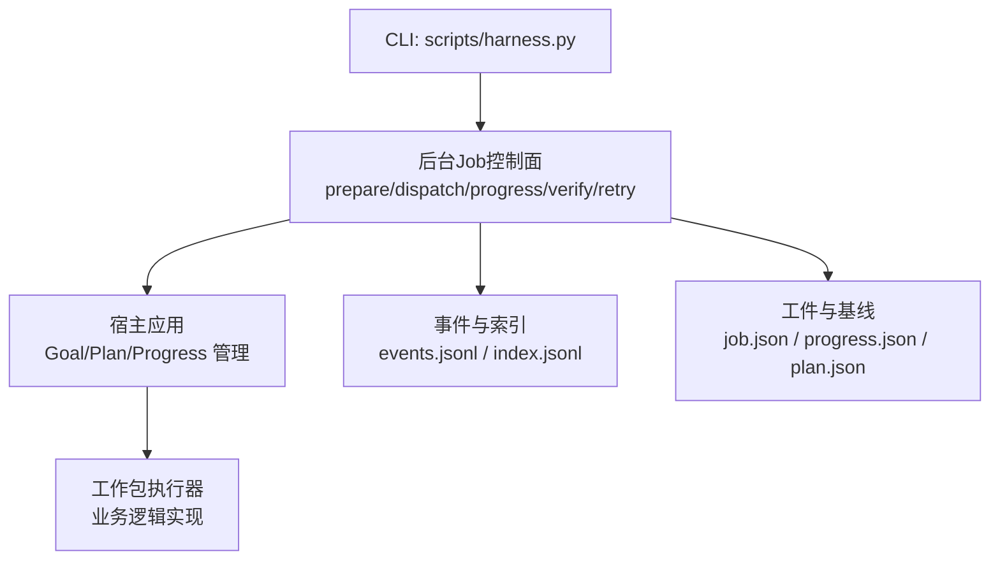
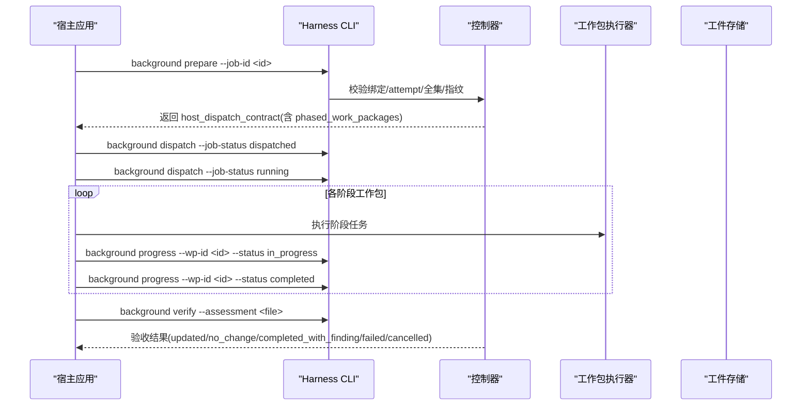
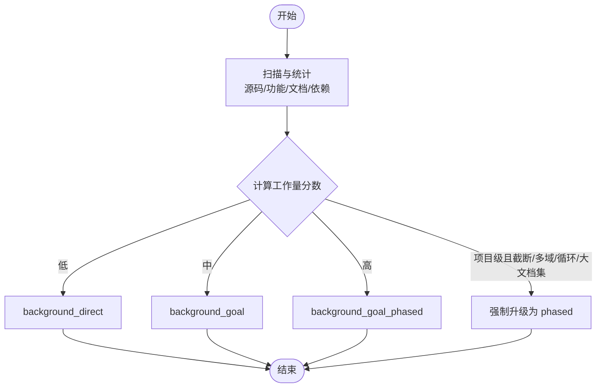
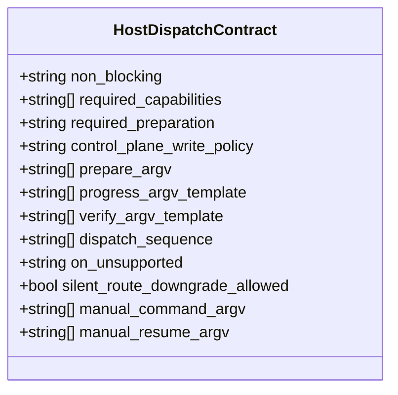
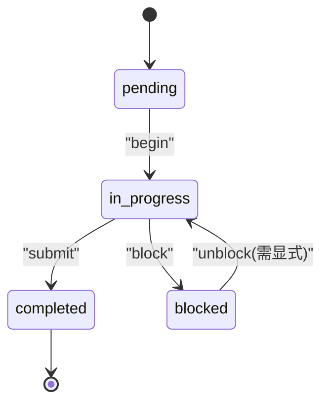
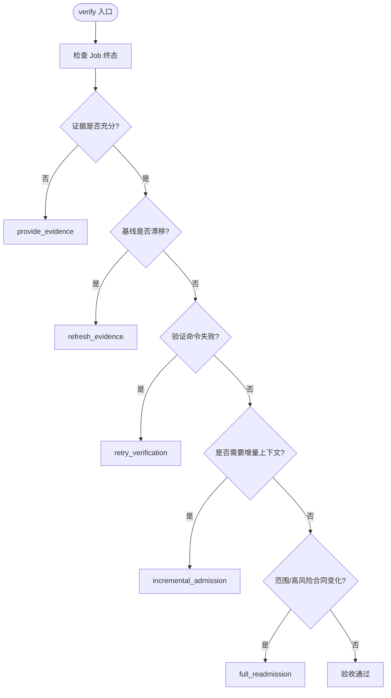
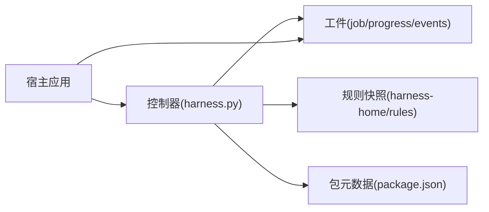

# 分阶段执行路线 (background_goal_phased)

<cite>
**本文引用的文件**   
- [SKILL.md](file://SKILL.md)
- [harness.py](file://scripts/harness.py)
- [package.json](file://package.json)
- [INDEX.md](file://harness-home/rules/INDEX.md)
- [test_harness.py](file://tests/test_harness.py)
</cite>

## 目录
1. [简介](#简介)
2. [项目结构](#项目结构)
3. [核心组件](#核心组件)
4. [架构总览](#架构总览)
5. [详细组件分析](#详细组件分析)
6. [依赖关系分析](#依赖关系分析)
7. [性能考量](#性能考量)
8. [故障排查指南](#故障排查指南)
9. [结论](#结论)
10. [附录](#附录)

## 简介
本文件为 Docs Harness 的 background_goal_phased（分阶段目标型后台任务）执行路线提供系统化文档。该模式适用于大型重构、多模块更新与需要逐步验证的复杂变更，通过“目标 Owner + 分阶段推进 + 公共层串行合并”的方式，确保变更可控、可审计、可回滚。文档涵盖阶段定义、里程碑管理、验证检查、回滚机制、阶段划分策略、依赖关系管理、进度跟踪与异常处理，并提供使用示例、配置验证规则以及性能调优与监控最佳实践。

## 项目结构
Docs Harness 以独立控制器脚本为核心，配合规则快照与测试套件共同构成完整控制面。背景任务（含 background_goal_phased）由 CLI 驱动，宿主应用负责创建并维护 Goal/Plan/Progress，控制器在关键生命周期节点进行复验与约束校验。

图表来源
- [harness.py:7580-7616](file://scripts/harness.py#L7580-L7616)
- [harness.py:8528-8586](file://scripts/harness.py#L8528-L8586)

章节来源
- [SKILL.md:59-89](file://SKILL.md#L59-L89)
- [package.json:1-23](file://package.json#L1-L23)
- [INDEX.md:1-41](file://harness-home/rules/INDEX.md#L1-L41)

## 核心组件
- 执行路线选择与估算：根据工作量、范围、依赖复杂度等自动选择 background_direct / background_goal / background_goal_phased。
- 宿主能力契约：host_dispatch_contract 声明所需能力（如 persistent_goal、phased_work_packages）、准备动作、控制面写入策略与降级行为。
- 进度与状态机：严格的工作包状态转换（pending → in_progress → completed/blocked），派生列表一致性校验，幂等更新。
- 验收与证据：verify 命令对 Job 终态进行验收，支持五级处置；知识 Job 需最终 ready 方可完成 updated/no_change。
- 回滚与重试：retry 归档旧 attempt 工件并要求重新 prepare；存在活动 v2 任务时阻断回滚。

章节来源
- [harness.py:8070-8154](file://scripts/harness.py#L8070-L8154)
- [harness.py:7580-7616](file://scripts/harness.py#L7580-L7616)
- [harness.py:8528-8586](file://scripts/harness.py#L8528-L8586)
- [SKILL.md:59-89](file://SKILL.md#L59-L89)

## 架构总览
background_goal_phased 的核心在于“目标 Owner”统一协调多个阶段（工作包），每个阶段聚焦特定子域或交付物，公共层（如知识地图、通用契约）串行合并，避免并发冲突与不一致。

图表来源
- [harness.py:7580-7616](file://scripts/harness.py#L7580-L7616)
- [harness.py:8528-8586](file://scripts/harness.py#L8528-L8586)
- [SKILL.md:71-81](file://SKILL.md#L71-L81)

## 详细组件分析

### 执行路线选择与估算
- 估算维度：源码文件数量、功能候选数、架构域与技术栈规模、文档覆盖度、跨功能依赖强度。
- 路由决策：简单任务→background_direct；复杂任务→background_goal；超大/多域/循环依赖/大量既有文档→background_goal_phased。
- 输出：workload_estimate 包含 execution_route、requires_plan、suggested_work_packages 等字段，供宿主生成 Plan。

图表来源
- [harness.py:8070-8154](file://scripts/harness.py#L8070-L8154)

章节来源
- [harness.py:8070-8154](file://scripts/harness.py#L8070-L8154)

### 宿主能力契约与准备流程
- required_capabilities：background_goal_phased 要求 persistent_goal 与 phased_work_packages。
- control_plane_write_policy：仅允许 harness_cli 写入控制面（job.json/plan.json/progress.json/events.jsonl）。
- dispatch_sequence：complex route 必须按 prepare → create_host_goal → dispatched → running 顺序推进。
- on_unsupported：宿主能力不足时置 queued_manual，保留原路线，不静默降级。

图表来源
- [harness.py:7580-7616](file://scripts/harness.py#L7580-L7616)

章节来源
- [harness.py:7580-7616](file://scripts/harness.py#L7580-L7616)

### 进度管理与状态机
- 工作包状态：pending → in_progress → completed/blocked，禁止倒退或跳过。
- 派生列表：completed_work_packages 与 remaining_work_packages 由控制器自动派生并校验一致性。
- 幂等性：重复提交相同状态将幂等返回，避免重复事件。
- 事件记录：每次状态变更写入 events.jsonl，便于审计与追踪。

图表来源
- [harness.py:8528-8586](file://scripts/harness.py#L8528-L8586)

章节来源
- [harness.py:8528-8586](file://scripts/harness.py#L8528-L8586)

### 验收与证据处置
- verify 命令对 Job 终态进行验收，支持五级处置：provide_evidence、refresh_evidence、retry_verification、incremental_admission、full_readmission。
- 知识 Job 要求最终知识状态为 ready 才能以 updated/no_change 完成。
- 证据采用受管副本保存，原始文件删除不影响准入；已通过的验证命令带逐项收据复用。

图表来源
- [SKILL.md:45-57](file://SKILL.md#L45-L57)

章节来源
- [SKILL.md:45-57](file://SKILL.md#L45-L57)

### 回滚与重试机制
- retry：归档旧 attempt 工件，要求重新 prepare，不继承已完成进度。
- 活动 v2 任务存在时，project rollback-check 必须阻断回滚。
- 工件损坏或被篡改时，仅允许显式 background prepare --repair 修复。

章节来源
- [SKILL.md:85-89](file://SKILL.md#L85-L89)

### 适用场景与阶段划分策略
- 适用场景：大型重构、多模块更新、跨功能依赖复杂、既有文档量大需 preserve-and-merge。
- 阶段划分建议：
  - 按功能域拆分工作包（如产品、研发、测试、设计）。
  - 公共层（知识地图、架构契约、安全策略）作为串行合并阶段。
  - 每阶段内包含“准备→执行→验证→归档”闭环。
- 依赖管理：明确工作包间依赖顺序，避免循环；必要时引入 dependency_job_ids 管理外部依赖。

章节来源
- [harness.py:8070-8154](file://scripts/harness.py#L8070-L8154)
- [SKILL.md:59-89](file://SKILL.md#L59-L89)

### 使用示例与配置验证规则
- 基本流程：
  1. background prepare：初始化控制面工件，返回 host_dispatch_contract。
  2. 宿主创建 Goal/Plan，按 dispatch_sequence 推进至 running。
  3. 逐个工作包执行并提交进度（in_progress → completed）。
  4. background verify：提交评估报告，获得验收结果。
- 配置验证规则：
  - allowed_write_scope 不得覆盖 .git/**、.docs-harness/** 或 Harness Runtime。
  - document-route contract 必须 resolved 后方可写入。
  - 知识 Job 的 assessment 状态必须为 ready/partial，且 gaps 与 status 一致。

章节来源
- [harness.py:8597-8749](file://scripts/harness.py#L8597-L8749)
- [harness.py:8206-8228](file://scripts/harness.py#L8206-L8228)
- [SKILL.md:71-81](file://SKILL.md#L71-L81)

## 依赖关系分析
- 控制器与宿主解耦：控制器仅通过 CLI 暴露控制面接口，宿主负责业务编排。
- 工件与事件强一致：job.json/progress.json/events.jsonl 由控制器原子写入，宿主不得直接修改。
- 规则与版本一致性：harness-home/rules 快照与 package.json 版本保持一致，安装时复制固定快照。

图表来源
- [package.json:1-23](file://package.json#L1-L23)
- [INDEX.md:1-41](file://harness-home/rules/INDEX.md#L1-L41)
- [harness.py:8597-8749](file://scripts/harness.py#L8597-L8749)

章节来源
- [package.json:1-23](file://package.json#L1-L23)
- [INDEX.md:1-41](file://harness-home/rules/INDEX.md#L1-L41)
- [harness.py:8597-8749](file://scripts/harness.py#L8597-L8749)

## 性能考量
- 估算优化：基于 change_scoped 而非全量扫描，减少不必要开销。
- 进度批处理：批量提交工作包状态，减少 CLI 调用次数。
- 证据缓存：已通过的验证命令带收据复用，避免重复执行。
- 资源限制：FALLBACK_SNAPSHOT_FILE_LIMIT、QUALITY_* 限制防止过大输入。

章节来源
- [harness.py:8109-8154](file://scripts/harness.py#L8109-L8154)
- [harness.py:179-184](file://scripts/harness.py#L179-L184)

## 故障排查指南
- 常见错误码：
  - invalid_background_progress：进度合同无效或状态非法。
  - invalid_background_progress_transition：状态转换不允许。
  - invalid_background_scope：写入范围越界或冲突。
  - knowledge_consent_stale：同意回执过期。
- 排查步骤：
  1. 检查 job.json 与 progress.json 的一致性。
  2. 查看 events.jsonl 定位失败点。
  3. 确认 host_dispatch_contract 能力是否满足。
  4. 验证 document-route contract 是否 resolved。
  5. 对于知识 Job，确认 assessment 状态与 gaps 一致性。

章节来源
- [harness.py:7504-7550](file://scripts/harness.py#L7504-L7550)
- [harness.py:8206-8228](file://scripts/harness.py#L8206-L8228)
- [harness.py:8528-8586](file://scripts/harness.py#L8528-L8586)

## 结论
background_goal_phased 通过“目标 Owner + 分阶段推进 + 公共层串行合并”的模式，为大型复杂变更提供了可控、可审计、可回滚的执行框架。结合严格的进度状态机、证据验收与回滚机制，确保变更质量与系统稳定性。在实际应用中，建议按功能域划分阶段、明确依赖关系、强化验证规则，并遵循性能与监控最佳实践。

## 附录
- 相关测试用例参考：tests/test_harness.py 中的 background goal/phased 场景。
- 规则快照与激活条件：harness-home/rules/INDEX.md 定义了生效规则与加载约定。

章节来源
- [test_harness.py:165-196](file://tests/test_harness.py#L165-L196)
- [INDEX.md:1-41](file://harness-home/rules/INDEX.md#L1-L41)