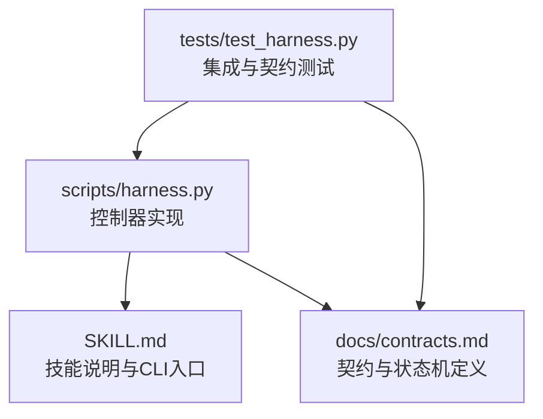
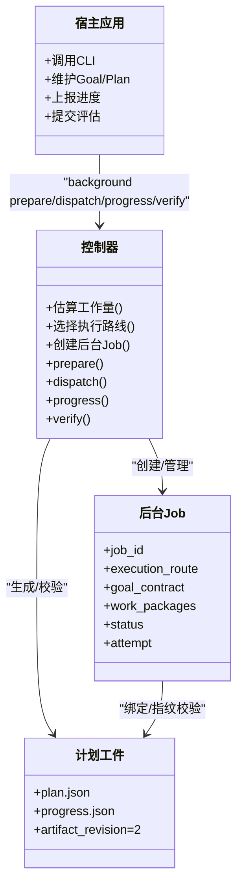
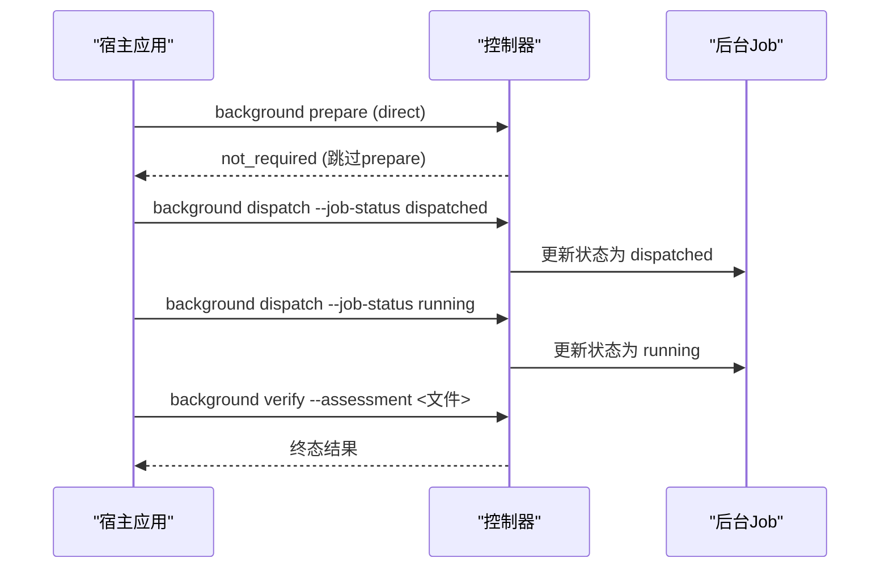
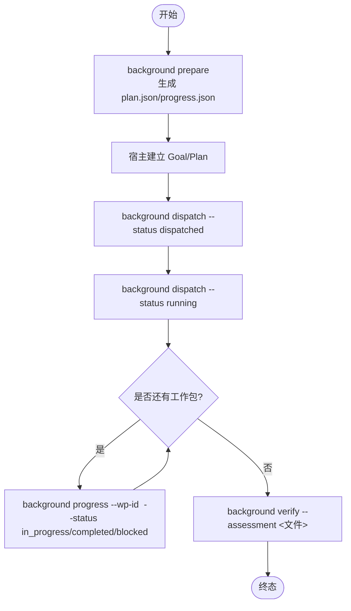
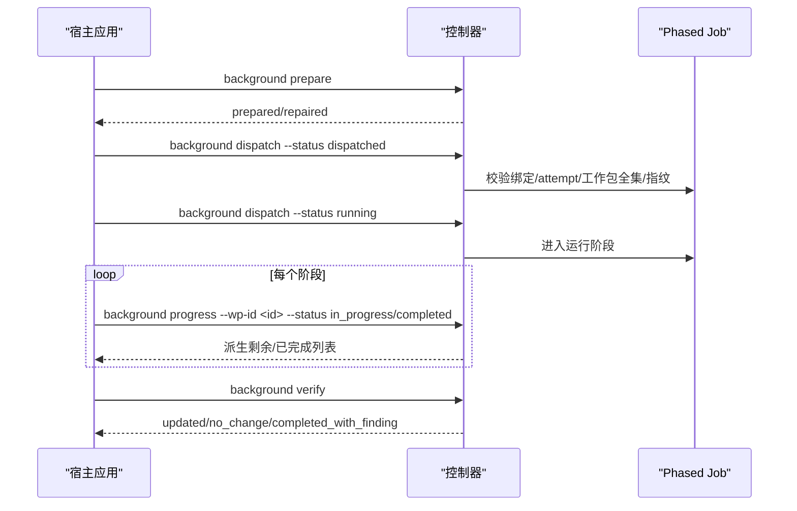
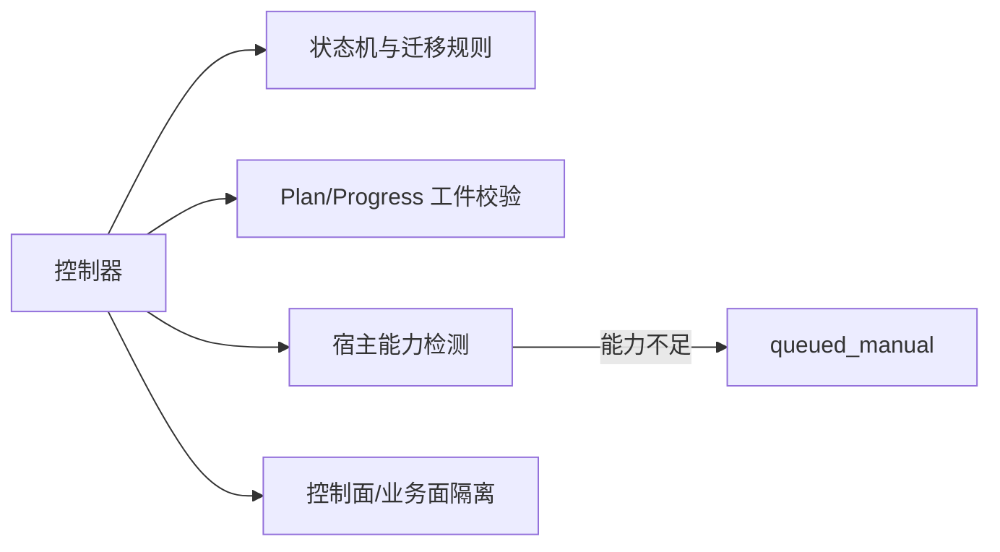

# 执行路线

<cite>
**本文引用的文件**   
- [scripts/harness.py](file://scripts/harness.py)
- [SKILL.md](file://SKILL.md)
- [docs/contracts.md](file://docs/contracts.md)
- [tests/test_harness.py](file://tests/test_harness.py)
</cite>

## 目录
1. [简介](#简介)
2. [项目结构](#项目结构)
3. [核心组件](#核心组件)
4. [架构总览](#架构总览)
5. [详细组件分析](#详细组件分析)
6. [依赖关系分析](#依赖关系分析)
7. [性能考量](#性能考量)
8. [故障排查指南](#故障排查指南)
9. [结论](#结论)
10. [附录：使用示例与最佳实践](#附录使用示例与最佳实践)

## 简介
本文件系统化阐述 Docs Harness 的后台任务执行路线，重点解释三种执行路线的区别与应用场景：
- background_direct：简单直接的任务执行
- background_goal：目标导向的复杂任务
- background_goal_phased：分阶段的渐进式任务

文档涵盖每种执行路线的工作流程、适用场景、配置选项、选择策略与自动路由机制，并提供具体使用示例与最佳实践建议。

## 项目结构
Docs Harness 的核心实现集中在 Python 脚本与合同文档中，测试用例覆盖关键路径与边界条件。后台治理相关能力由 CLI 命令暴露，供宿主编排调用。

图表来源 
- [scripts/harness.py:1-120](file://scripts/harness.py#L1-L120)
- [SKILL.md:59-81](file://SKILL.md#L59-L81)
- [docs/contracts.md:303-338](file://docs/contracts.md#L303-L338)

章节来源
- [scripts/harness.py:1-120](file://scripts/harness.py#L1-L120)
- [SKILL.md:59-81](file://SKILL.md#L59-L81)
- [docs/contracts.md:303-338](file://docs/contracts.md#L303-L338)

## 核心组件
- 执行路线集合与分类
  - BACKGROUND_ROUTES：包含 background_direct、background_goal、background_goal_phased
  - BACKGROUND_COMPLEX_ROUTES：包含 background_goal、background_goal_phased（需要 prepare、plan/progress 工件）
- 工作量估算与自动路由
  - 基于源码规模、功能候选、架构域、技术栈、知识缺口、跨功能依赖等维度打分，映射到 score_route
  - 在 project_wide 模式下，根据多独立域、循环依赖、已有文档数量等触发 route_override_reason，强制升级为 background_goal_phased
- 后台 Job 生命周期与状态迁移
  - 支持 contract_ready → dispatched → running → 终态（updated/no_change/completed_with_finding/failed/cancelled）
  - 复杂路线要求 prepare 生成 revision 2 的 plan.json 与 progress.json，并在 dispatched/running 前校验绑定、attempt、工作包全集与指纹
- 控制面与业务面分离
  - 控制面（job.json、plan.json、progress.json、events.jsonl、锁与索引）仅允许 CLI 写入
  - 业务数据面只允许 allowed_write_scope 范围内的写入，禁止覆盖 .git/**、.docs-harness/** 或实际 Runtime

章节来源
- [scripts/harness.py:121-124](file://scripts/harness.py#L121-L124)
- [scripts/harness.py:7880-7912](file://scripts/harness.py#L7880-L7912)
- [scripts/harness.py:8212-8224](file://scripts/harness.py#L8212-L8224)
- [docs/contracts.md:303-338](file://docs/contracts.md#L303-L338)

## 架构总览
下图展示三种执行路线在控制器中的角色分工与交互关系。

图表来源 
- [scripts/harness.py:7261-7369](file://scripts/harness.py#L7261-L7369)
- [scripts/harness.py:8269-8333](file://scripts/harness.py#L8269-L8333)
- [docs/contracts.md:303-338](file://docs/contracts.md#L303-L338)

## 详细组件分析

### background_direct（简单直接执行）
- 特点
  - 无需 prepare，不生成持久化 Plan/Progress 工件
  - 适合范围小、风险低、一次性完成的后台子智能体任务
- 工作流程
  - 控制器创建 Job，状态从 contract_ready 直接进入 dispatched → running → 终态
  - 宿主通过 background dispatch/verify 完成派发与验收
- 适用场景
  - 简单的文档整理、轻量级扫描、一次性清理任务
- 配置要点
  - goal_contract 为空对象
  - work_packages 可选或不提供
  - required_preparation 为 None

图表来源 
- [scripts/harness.py:8269-8278](file://scripts/harness.py#L8269-L8278)
- [docs/contracts.md:303-338](file://docs/contracts.md#L303-L338)

章节来源
- [scripts/harness.py:7229-7231](file://scripts/harness.py#L7229-L7231)
- [scripts/harness.py:8269-8278](file://scripts/harness.py#L8269-L8278)
- [docs/contracts.md:303-338](file://docs/contracts.md#L303-L338)

### background_goal（目标导向复杂任务）
- 特点
  - 需要正式的目标合同与持久化方案；控制器生成并校验 revision 2 的 plan.json 与 progress.json
  - 适合需要明确成功标准、可复用的目标型任务
- 工作流程
  - contract_ready → background prepare（生成 plan/progress）→ 宿主建立 Goal/Plan → dispatched → running → background progress（多次）→ background verify → 终态
- 适用场景
  - 跨模块文档补全、架构一致性治理、需分步骤推进且可审计的任务
- 配置要点
  - goal_contract 必须包含 objective、success_criteria、plan_required、progress_persistence、stop_conditions
  - work_packages 必须为非空列表，每项含 objective
  - required_preparation = "background_goal_artifacts"

图表来源 
- [scripts/harness.py:7261-7287](file://scripts/harness.py#L7261-L7287)
- [scripts/harness.py:8336-8394](file://scripts/harness.py#L8336-L8394)
- [docs/contracts.md:303-338](file://docs/contracts.md#L303-L338)

章节来源
- [scripts/harness.py:7229-7245](file://scripts/harness.py#L7229-L7245)
- [scripts/harness.py:7248-7287](file://scripts/harness.py#L7248-L7287)
- [scripts/harness.py:8336-8394](file://scripts/harness.py#L8336-L8394)
- [docs/contracts.md:303-338](file://docs/contracts.md#L303-L338)

### background_goal_phased（分阶段渐进式任务）
- 特点
  - 单一目标 Owner 分阶段推进，公共层与知识地图串行合并
  - 适用于超大规模、多独立域、存在循环依赖或已有大量文档的项目
- 自动路由触发条件
  - 扫描文件限制被截断（truncated）
  - 独立架构域数量 ≥ 5
  - 存在循环依赖或无主依赖
  - 已有文档数量 ≥ 50（preserve-and-merge）
  - 已有文档数量 ≥ 10 且原路由为 direct（升级为 goal）
  - 候选明确要求 plan（requires_plan=true）
- 工作流程
  - 同 background_goal，但强调“分阶段”与“串行合并”，控制器在 dispatched/running 前进行更严格的绑定与指纹校验
- 适用场景
  - 大型知识库构建、跨团队文档治理、增量同步与合并

图表来源 
- [scripts/harness.py:7880-7912](file://scripts/harness.py#L7880-L7912)
- [scripts/harness.py:7398-7434](file://scripts/harness.py#L7398-L7434)
- [docs/contracts.md:303-338](file://docs/contracts.md#L303-L338)

章节来源
- [scripts/harness.py:7880-7912](file://scripts/harness.py#L7880-L7912)
- [scripts/harness.py:7398-7434](file://scripts/harness.py#L7398-L7434)
- [docs/contracts.md:303-338](file://docs/contracts.md#L303-L338)

## 依赖关系分析
- 控制器对后台 Job 的生命周期管理强依赖状态机与工件校验
- 复杂路线（goal/goal_phased）依赖 plan.json 与 progress.json 的 revision 2 格式与指纹一致性
- 宿主能力不足时，控制器将 Job 置为 queued_manual，保留原路线，不静默降级
- 控制面与业务面严格隔离，防止越权写入

图表来源 
- [scripts/harness.py:8212-8224](file://scripts/harness.py#L8212-L8224)
- [scripts/harness.py:7398-7434](file://scripts/harness.py#L7398-L7434)
- [docs/contracts.md:303-338](file://docs/contracts.md#L303-L338)

章节来源
- [scripts/harness.py:8212-8224](file://scripts/harness.py#L8212-L8224)
- [scripts/harness.py:7398-7434](file://scripts/harness.py#L7398-L7434)
- [docs/contracts.md:303-338](file://docs/contracts.md#L303-L338)

## 性能考量
- 自动路由通过多维度打分降低不必要的复杂流程开销
- 复杂路线的 prepare/validate 仅在必要阶段执行，避免重复计算
- 事件记录采用有界字段，减少遥测成本
- 变更范围感知（change_scoped）可降低无关文件变化对幂等键的影响

[本节为通用指导，不直接分析具体文件]

## 故障排查指南
- 常见错误码与处理
  - invalid_background_job：Job 类型或参数无效
  - missing_background_goal_artifacts：复杂路线缺少 plan/progress 工件
  - background_goal_artifacts_tampered：工件指纹漂移或被篡改
  - invalid_background_progress：工作包状态非法或过渡不允许
  - unsafe_background_runtime：控制面路径不安全
- 恢复操作
  - background retry：归档当前 attempt 工件，推进 attempt，清空准备引用并刷新基线
  - background prepare --repair：显式修复损坏工件

章节来源
- [scripts/harness.py:7303-7369](file://scripts/harness.py#L7303-L7369)
- [scripts/harness.py:8240-8266](file://scripts/harness.py#L8240-L8266)
- [docs/contracts.md:303-338](file://docs/contracts.md#L303-L338)

## 结论
Docs Harness 的三种执行路线覆盖了从简单到复杂的后台任务场景。automatic routing 基于工作量与项目特征智能选择最优路径，确保效率与安全平衡。复杂路线通过严格的工件校验与状态机保障可审计性与可恢复性。宿主应依据任务语义与项目规模选择合适的路线，并遵循控制面与业务面分离原则。

[本节为总结，不直接分析具体文件]

## 附录：使用示例与最佳实践
- 选择策略
  - 简单一次性任务：background_direct
  - 目标明确、需分步推进：background_goal
  - 超大规模、多域、循环依赖或大量既有文档：background_goal_phased
- 最佳实践
  - 明确声明 gate_assessment，避免误升级 Gate
  - 使用 change_scoped 模式缩小影响范围，提升幂等性
  - 合理拆分 work_packages，便于进度追踪与失败定位
  - 控制面文件仅由 CLI 写入，业务写入限定在 allowed_write_scope
- 参考命令
  - background list/status/prepare/dispatch/progress/verify/retry
  - 详见 SKILL.md 与 contracts.md 中的 CLI 规范

章节来源
- [SKILL.md:59-81](file://SKILL.md#L59-L81)
- [docs/contracts.md:303-338](file://docs/contracts.md#L303-L338)
- [tests/test_harness.py:165-195](file://tests/test_harness.py#L165-L195)