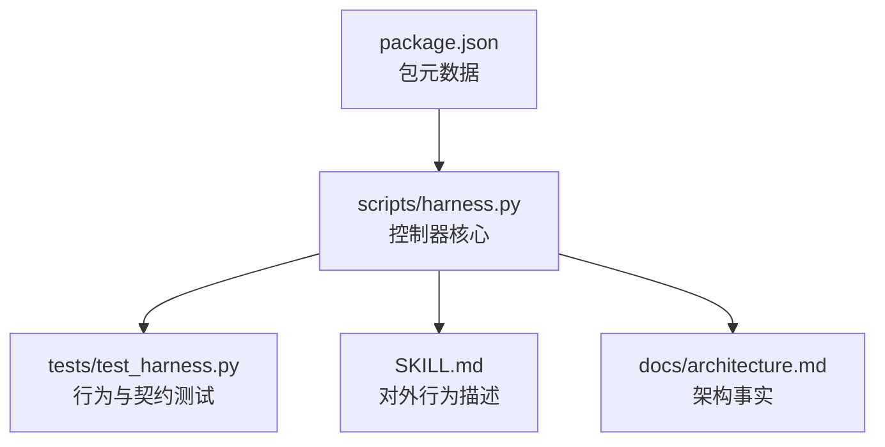
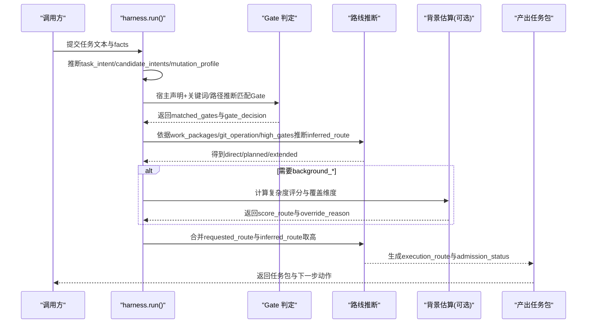
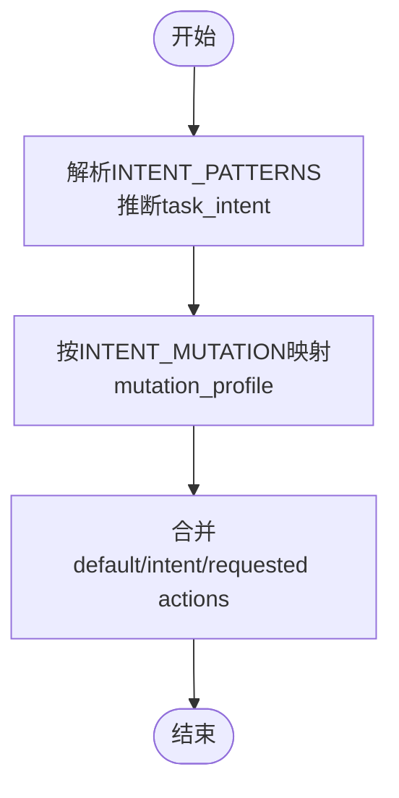
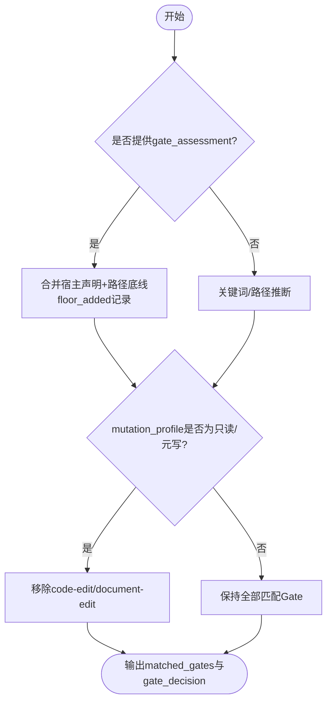
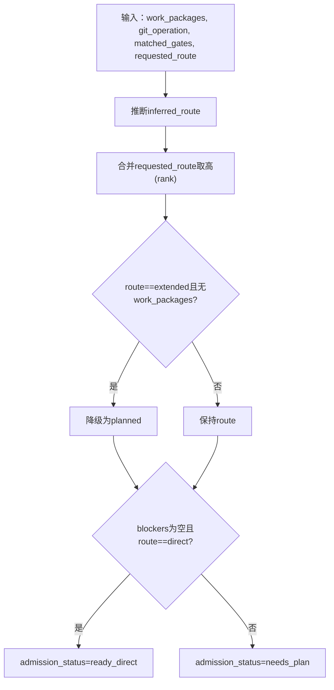
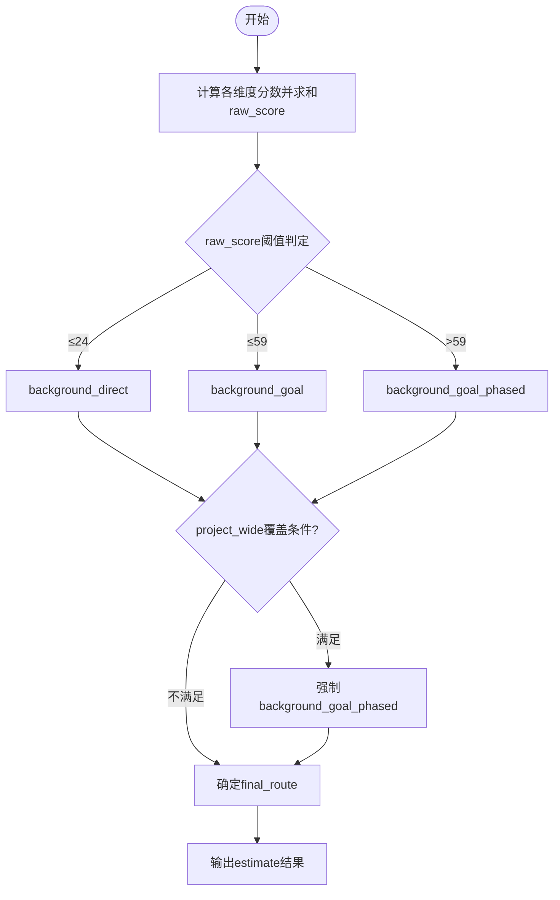
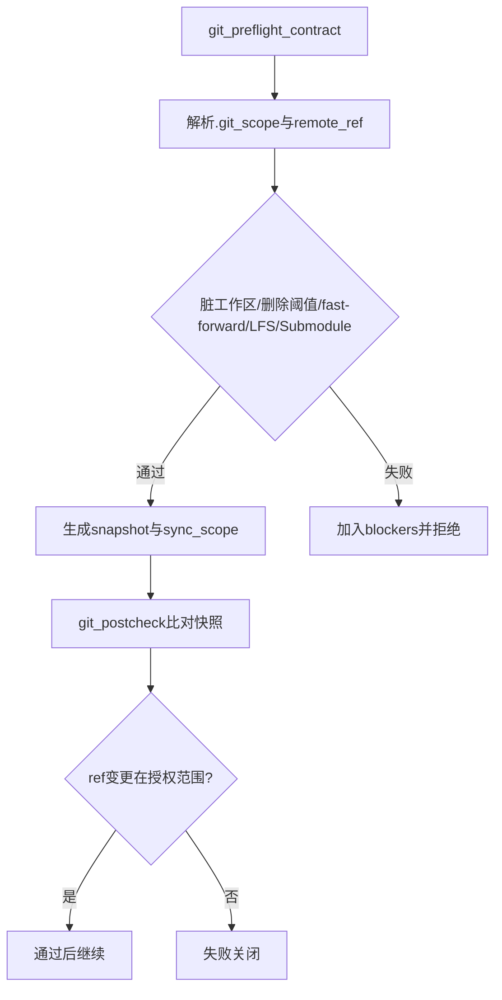
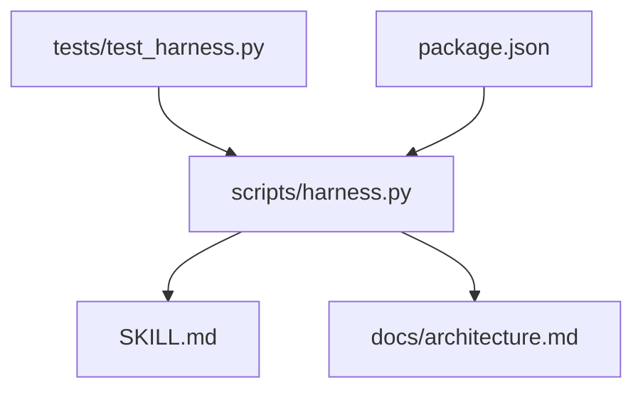

# 执行路线选择策略

<cite>
**本文引用的文件**   
- [scripts/harness.py](file://scripts/harness.py)
- [tests/test_harness.py](file://tests/test_harness.py)
- [SKILL.md](file://SKILL.md)
- [docs/architecture.md](file://docs/architecture.md)
- [package.json](file://package.json)
</cite>

## 目录
1. [简介](#简介)
2. [项目结构](#项目结构)
3. [核心组件](#核心组件)
4. [架构总览](#架构总览)
5. [详细组件分析](#详细组件分析)
6. [依赖关系分析](#依赖关系分析)
7. [性能考量](#性能考量)
8. [故障排查指南](#故障排查指南)
9. [结论](#结论)
10. [附录](#附录)

## 简介
本文件系统化阐述 Docs Harness 的执行路线自动选择机制，覆盖任务特征识别、复杂度评估与资源需求判断，以及最终路由决策的算法与规则。文档同时说明手动覆盖机制与优先级规则，提供不同任务类型的路由示例，并给出自定义选择策略的开发指南与调试方法。

## 项目结构
- scripts/harness.py：控制器源码真源，负责任务准入、上下文、验收、知识生命周期与后台 Job 状态机，包含执行路线选择的核心逻辑。
- tests/test_harness.py：覆盖大量路由与准入行为测试用例，验证意图推断、Gate 判定、Git 预检/后检、复杂后台 Job 流程等。
- SKILL.md：对外行为描述，包括 run/verify/background 等命令与执行路线语义。
- docs/architecture.md：架构事实，明确控制器职责与受管边界。
- package.json：包元数据与脚本入口。

**图表来源** 
- [scripts/harness.py](file://scripts/harness.py)
- [tests/test_harness.py](file://tests/test_harness.py)
- [SKILL.md](file://SKILL.md)
- [docs/architecture.md](file://docs/architecture.md)
- [package.json](file://package.json)

**章节来源**
- [docs/architecture.md:1-26](file://docs/architecture.md#L1-L26)
- [package.json:1-23](file://package.json#L1-L23)

## 核心组件
- 任务意图与变更强度推断：从任务文本与 facts 推断 task_intent、candidate_intents、mutation_profile，决定默认动作集合。
- Gate 判定与底线安全：基于宿主声明与关键词/路径推断匹配 Gate；对安全底线 Gate（security-sensitive、destructive-data、release-external）强制兜底。
- 执行路线推断：根据 work_packages、git_operation、high_gates 等推断 direct/planned/extended 三档路线，并与用户请求合并取高。
- 背景作业复杂度估算：针对 background_* 路线，通过源码规模、功能候选、架构域与技术栈、知识缺口、跨功能依赖等维度打分，决定 background_direct/goal/phased。
- Git 预检/后检：对 git_sync 等操作进行范围、快进、脏工作区、LFS/Submodule 等前置检查与后置校验。
- 证据与验收：构建 completion_manifest，管理验证命令缓存与证据收据，支持增量与全量重新准入。

**章节来源**
- [scripts/harness.py:200-233](file://scripts/harness.py#L200-L233)
- [scripts/harness.py:263-345](file://scripts/harness.py#L263-L345)
- [scripts/harness.py:2850-3100](file://scripts/harness.py#L2850-L3100)
- [scripts/harness.py:8050-8154](file://scripts/harness.py#L8050-L8154)
- [scripts/harness.py:680-794](file://scripts/harness.py#L680-L794)
- [SKILL.md:26-58](file://SKILL.md#L26-L58)

## 架构总览
下图展示“任务输入 → 意图/Gate → 路线推断 → 背景估算（如适用）→ 最终路线”的整体流程。

**图表来源** 
- [scripts/harness.py:2850-3100](file://scripts/harness.py#L2850-L3100)
- [scripts/harness.py:8050-8154](file://scripts/harness.py#L8050-L8154)

## 详细组件分析

### 任务意图与变更强度推断
- 意图模式匹配：通过 INTENT_PATTERNS 将自然语言映射到 query/audit/git_inspect/git_fetch/git_sync/modify/external_write。
- 变更强度等级：MUTATION_PROFILES 定义 read_only/git_metadata_write/workspace_write/external_write，并通过 INTENT_MUTATION 建立意图到等级的映射。
- 动作集合成：default_actions 由 mutation_profile 决定，intent_actions 由 task_intent 补充，requested_actions 来自 facts。

**图表来源** 
- [scripts/harness.py:200-233](file://scripts/harness.py#L200-L233)

**章节来源**
- [scripts/harness.py:200-233](file://scripts/harness.py#L200-L233)

### Gate 判定与安全底线
- 宿主权威模式：若提供 gate_assessment，则以宿主声明为准；代码仅对 SAFETY_FLOOR_GATES 做确定性兜底（security-sensitive、destructive-data、release-external）。
- 关键词与路径推断：未声明时回退到 infer_gates，结合任务文本与路径命中词表。
- 低写入强度降级：当 mutation_profile 为 read_only 或 git_metadata_write 时，剔除 code-edit/document-edit 等非必要 Gate。

**图表来源** 
- [scripts/harness.py:2850-2891](file://scripts/harness.py#L2850-L2891)

**章节来源**
- [scripts/harness.py:2850-2891](file://scripts/harness.py#L2850-L2891)

### 执行路线推断与手动覆盖
- 推断逻辑：
  - 存在 work_packages → inferred_route = extended
  - 否则，若 git_operation == "git_sync" 或 matched_gates 命中 high_gates → planned
  - 其他 → direct
- 手动覆盖：
  - requested_route 允许 direct/planned/extended，无效值直接报错
  - 最终 route = max(inferred_route, requested_route or "direct")，按 rank{"direct":0,"planned":1,"extended":2} 取高
  - 若 route=extended 但无 work_packages，则降级为 planned
- admission_status：
  - blockers 为空且 route=direct → ready_direct
  - 否则 → needs_plan

**图表来源** 
- [scripts/harness.py:2892-2903](file://scripts/harness.py#L2892-L2903)
- [scripts/harness.py:3011-3011](file://scripts/harness.py#L3011-L3011)

**章节来源**
- [scripts/harness.py:2892-2903](file://scripts/harness.py#L2892-L2903)
- [scripts/harness.py:3011-3011](file://scripts/harness.py#L3011-L3011)

### 背景作业复杂度估算与路线选择
- 评分维度：
  - source_files：估算范围内源码文件数量
  - feature_candidates：功能候选数量
  - architecture_domains：架构域数量
  - technology_stacks：技术栈数量
  - knowledge_gap：知识缺口（有 deliverables 时计分）
  - cross_feature_dependencies：跨功能依赖
- 初始路线：
  - raw_score ≤ 24 → background_direct
  - 24 < raw_score ≤ 59 → background_goal
  - > 59 → background_goal_phased
- 覆盖规则（estimate_basis 为 project_wide 时）：
  - 扫描文件限制触发 → background_goal_phased
  - 多独立领域（≥5）→ background_goal_phased
  - 循环/无主依赖 → background_goal_phased
  - 已有文档较多（≥50）→ background_goal_phased
  - 已有文档中等（≥10）且原为 direct → background_goal
  - 候选要求 plan 且原为 direct → background_goal
- 输出字段：workload_class、raw_score、score_route、route_override_reason、execution_route、requires_plan、reasons、score_dimensions 等。

**图表来源** 
- [scripts/harness.py:8050-8154](file://scripts/harness.py#L8050-L8154)

**章节来源**
- [scripts/harness.py:8050-8154](file://scripts/harness.py#L8050-L8154)

### Git 预检与后检（影响直连/计划路线）
- 预检要点：
  - git_sync 必须绑定单一远端分支，禁止模糊通配
  - 检测脏工作区与变化范围重叠、删除数量阈值、fast-forward 可行性
  - LFS/Submodule 可用性校验
- 后检要点：
  - 对比 preflight snapshot 与执行后状态，校验 ref 变更是否在授权范围内
  - 失败关闭：越界、漂移、不可用等

**图表来源** 
- [scripts/harness.py:680-794](file://scripts/harness.py#L680-L794)

**章节来源**
- [scripts/harness.py:680-794](file://scripts/harness.py#L680-L794)

### 证据与验收（影响后续准入与路线稳定性）
- completion_manifest：汇总任务意图、mutation_profile、gates、evidence_types、verification_commands，作为收尾真源。
- 验证命令缓存：已通过的命令带逐项收据复用，失败或输入变化重跑；可整体关闭。
- 增量与全量重新准入：普通 Gate 追加不改变路线/授权/范围/方案字段时走增量；高风险或合同变化走 full_readmission。

**章节来源**
- [SKILL.md:44-58](file://SKILL.md#L44-L58)

## 依赖关系分析
- 控制器与测试：tests/test_harness.py 通过导入 harness.py 模块执行端到端用例，覆盖 run/verify/background/self-test 等场景。
- 控制器与文档：SKILL.md 与 docs/architecture.md 描述对外行为与架构事实，约束实现一致性。
- 包元数据：package.json 提供版本与脚本入口，确保 CLI 使用一致。

**图表来源** 
- [tests/test_harness.py](file://tests/test_harness.py)
- [scripts/harness.py](file://scripts/harness.py)
- [SKILL.md](file://SKILL.md)
- [docs/architecture.md](file://docs/architecture.md)
- [package.json](file://package.json)

**章节来源**
- [tests/test_harness.py:1-120](file://tests/test_harness.py#L1-L120)
- [docs/architecture.md:1-26](file://docs/architecture.md#L1-L26)
- [package.json:1-23](file://package.json#L1-L23)

## 性能考量
- 背景估算阶段对大仓库采用文件计数与指纹压缩，避免重复扫描；source_fingerprint 用于缓存估计结果。
- Git 操作设置超时与最小化子进程调用，减少 IO 与网络开销。
- 验证命令缓存与证据收据复用降低重复执行成本。

[本节为通用指导，无需特定文件引用]

## 故障排查指南
- 常见错误码与原因：
  - invalid_route：requested_route 不在 {direct, planned, extended}
  - invalid_git_scope / git_remote_unavailable / git_preflight_failed：Git 预检失败
  - missing_file / invalid_json：输入文件缺失或格式错误
  - invalid_scope_description：scope 描述非法
- 定位步骤：
  - 查看 admission_status 与 blockers 列表
  - 检查 gate_decision.mode 与 floor_added 是否被强制添加
  - 核对 execution_route 与 score_route/route_override_reason
  - 对于 Git 相关错误，确认 .gitattributes/.gitmodules 与远端可达性

**章节来源**
- [scripts/harness.py:2892-2894](file://scripts/harness.py#L2892-L2894)
- [scripts/harness.py:680-794](file://scripts/harness.py#L680-L794)
- [tests/test_harness.py:485-502](file://tests/test_harness.py#L485-L502)

## 结论
Docs Harness 的执行路线选择以“意图优先、风险可控、证据可复用”为核心原则：先推断任务意图与变更强度，再结合 Gate 判定与宿主声明，最后通过复杂度估算与覆盖规则确定最终路线。该机制在保证安全底线的前提下，兼顾效率与可审计性，并提供完善的覆盖与降级策略。

[本节为总结，无需特定文件引用]

## 附录

### 选择算法与指标速览
- 意图与变更强度：INTENT_PATTERNS、MUTATION_PROFILES、INTENT_MUTATION
- Gate 判定：GATE_DEFS、SAFETY_FLOOR_GATES、FLOOR_TERMS、NEGATION_MARKERS
- 路线推断：inferred_route 与 requested_route 合并取高，rank{"direct":0,"planned":1,"extended":2}
- 背景估算：source_files、feature_candidates、architecture_domains、technology_stacks、knowledge_gap、cross_feature_dependencies；阈值 24/59；覆盖规则（project_wide）

**章节来源**
- [scripts/harness.py:200-233](file://scripts/harness.py#L200-L233)
- [scripts/harness.py:263-345](file://scripts/harness.py#L263-L345)
- [scripts/harness.py:2892-2903](file://scripts/harness.py#L2892-L2903)
- [scripts/harness.py:8050-8154](file://scripts/harness.py#L8050-L8154)

### 手动覆盖机制与优先级规则
- 手动覆盖：facts.execution_route 允许 direct/planned/extended；无效值报错
- 优先级：最终 route = max(inferred_route, requested_route or "direct")
- 特殊降级：route=extended 但无 work_packages → planned
- 背景作业：complex_route 在 host_dispatch_contract 中决定能力与准备步骤，不允许静默降级

**章节来源**
- [scripts/harness.py:2892-2903](file://scripts/harness.py#L2892-L2903)
- [scripts/harness.py:7580-7616](file://scripts/harness.py#L7580-L7616)

### 具体选择示例（不同任务类型）
- 只读查询：task_intent=query，mutation_profile=read_only，无 high_gates → direct
- 审计分支是否可删除：task_intent=audit，mutation_profile=read_only → direct
- 混合意图（先审计后修复）：最高 mutation_profile 决定 workspace_write → planned（需方案）
- Git fetch：task_intent=git_fetch，mutation_profile=git_metadata_write → direct（允许 git_fetch 动作）
- Git sync：task_intent=git_sync，mutation_profile=workspace_write → planned（需方案与范围）
- 背景作业简单变更：raw_score≤24 → background_direct
- 背景作业中等复杂度：24<raw_score≤59 → background_goal
- 背景作业超大/多领域/循环依赖：→ background_goal_phased

**章节来源**
- [tests/test_harness.py:429-448](file://tests/test_harness.py#L429-L448)
- [tests/test_harness.py:449-464](file://tests/test_harness.py#L449-L464)
- [tests/test_harness.py:465-484](file://tests/test_harness.py#L465-L484)
- [tests/test_harness.py:503-537](file://tests/test_harness.py#L503-L537)
- [tests/test_harness.py:597-618](file://tests/test_harness.py#L597-L618)
- [scripts/harness.py:8050-8154](file://scripts/harness.py#L8050-L8154)

### 自定义选择策略开发指南
- 扩展意图与变更强度：
  - 在 INTENT_PATTERNS 中添加新意图模式
  - 在 MUTATION_PROFILES 与 INTENT_MUTATION 中映射新的变更强度
- 扩展 Gate 判定：
  - 在 GATE_DEFS 中新增 Gate 定义（terms/facts/plan_fields/evidence/authorization）
  - 如需安全底线，谨慎修改 SAFETY_FLOOR_GATES 与 FLOOR_TERMS
- 调整路线推断：
  - 修改 inferred_route 的条件分支（work_packages/git_operation/high_gates）
  - 调整 route_rank 权重或增加新路线
- 调整背景估算：
  - 修改评分维度与阈值（source_files、feature_candidates、domains、stacks、knowledge_gap、dependencies）
  - 在覆盖规则中增加或调整 override_reason 条件
- 调试方法：
  - 使用 tests/test_harness.py 中的 run_harness 与 write_background_goal_artifacts 构造用例
  - 观察 admission_status、blocked_reason、execution_route、score_route、route_override_reason
  - 对 Git 相关逻辑，使用 mock.patch 模拟 lfs/submodule 不可用等场景

**章节来源**
- [scripts/harness.py:200-233](file://scripts/harness.py#L200-L233)
- [scripts/harness.py:263-345](file://scripts/harness.py#L263-L345)
- [scripts/harness.py:2892-2903](file://scripts/harness.py#L2892-L2903)
- [scripts/harness.py:8050-8154](file://scripts/harness.py#L8050-L8154)
- [tests/test_harness.py:736-757](file://tests/test_harness.py#L736-L757)