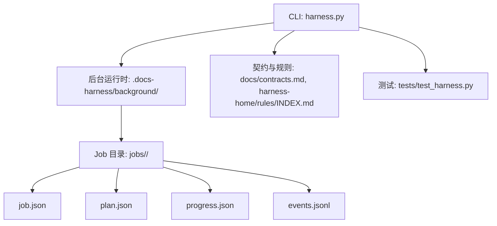
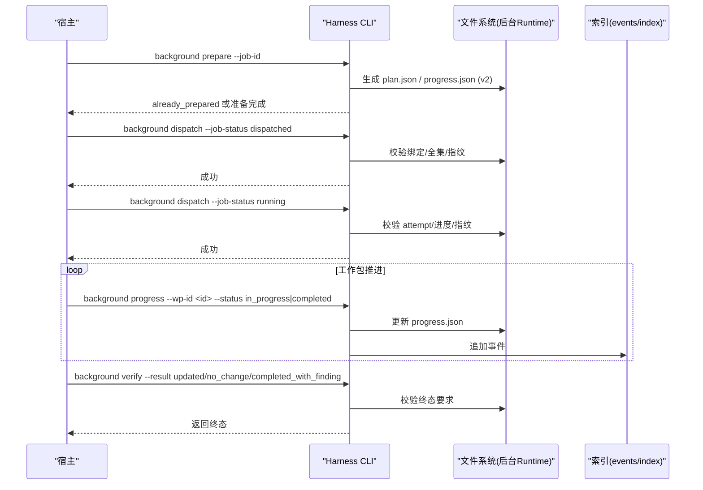
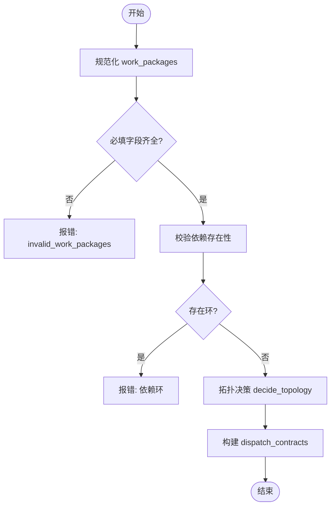
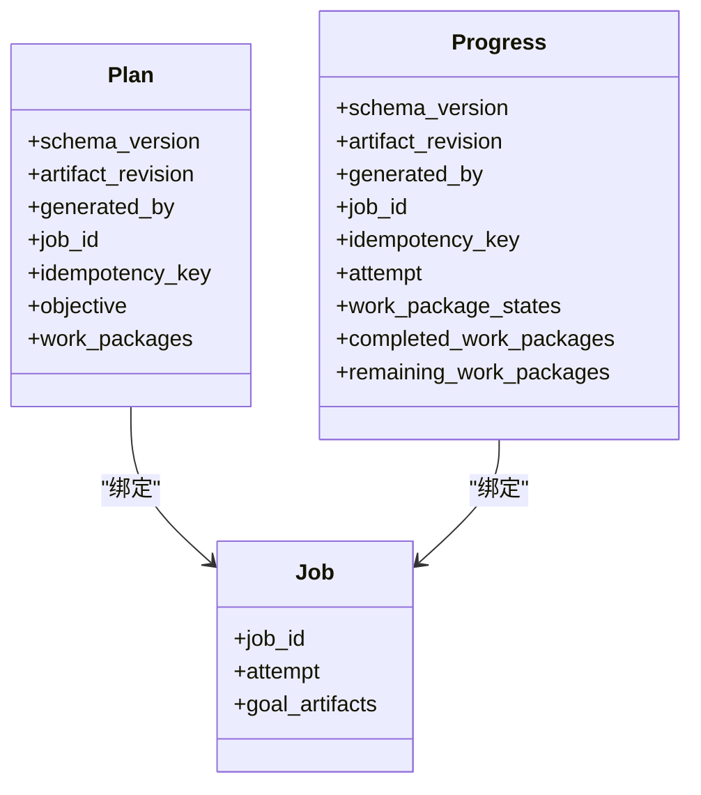
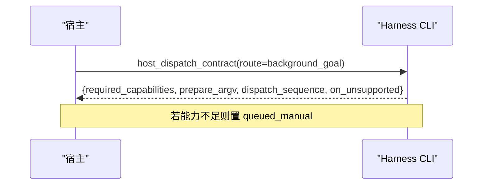
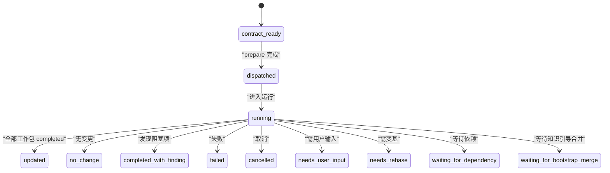
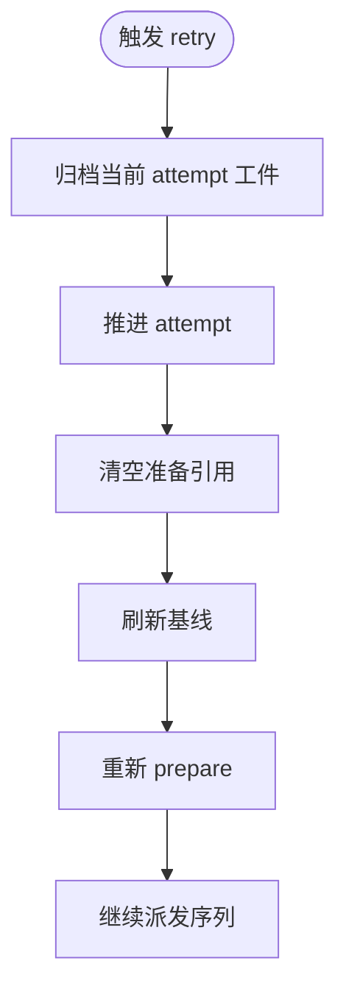
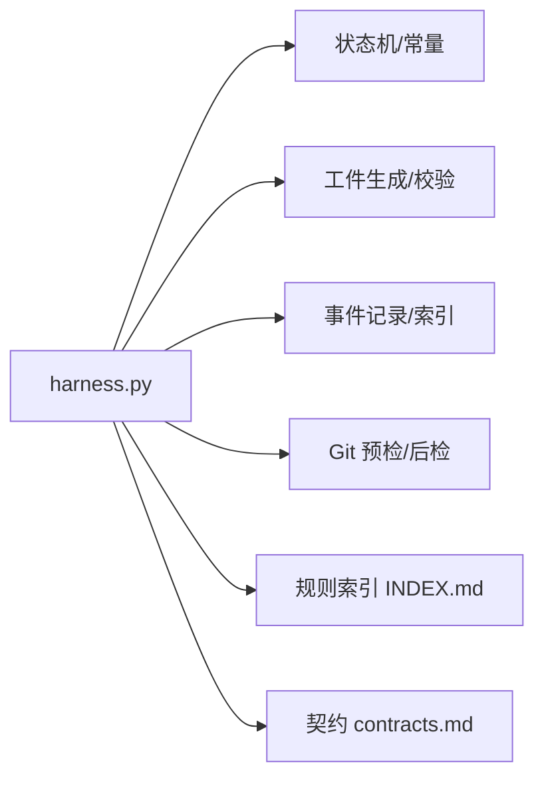

# 目标导向执行路线 (background_goal)

<cite>
**本文引用的文件**   
- [SKILL.md](file://SKILL.md)
- [harness.py](file://scripts/harness.py)
- [contracts.md](file://docs/contracts.md)
- [INDEX.md](file://harness-home/rules/INDEX.md)
- [test_harness.py](file://tests/test_harness.py)
</cite>

## 目录
1. [简介](#简介)
2. [项目结构](#项目结构)
3. [核心组件](#核心组件)
4. [架构总览](#架构总览)
5. [详细组件分析](#详细组件分析)
6. [依赖关系分析](#依赖关系分析)
7. [性能与可扩展性](#性能与可扩展性)
8. [故障排除指南](#故障排除指南)
9. [结论](#结论)
10. [附录：使用示例与最佳实践](#附录使用示例与最佳实践)

## 简介
本文件面向 Docs Harness 的 background_goal 执行路线，系统化阐述“目标导向”的复杂任务执行模式。该模式适用于需要多步骤协调、条件判断、资源管理与跨角色协作的任务场景。文档覆盖目标定义、路径规划、依赖管理、状态同步、冲突解决与重试机制，并提供可操作的配置示例、监控建议与故障排查方法。

## 项目结构
Docs Harness 以独立控制器（Python CLI）为核心，配合契约文档、规则索引与测试套件组织代码与行为约束。background_goal 属于后台治理的复杂执行路线之一，由控制器统一编排 Job 生命周期、工件校验与事件记录。

图表来源
- [harness.py:1485-1494](file://scripts/harness.py#L1485-L1494)
- [contracts.md:305-348](file://docs/contracts.md#L305-L348)
- [INDEX.md:1-41](file://harness-home/rules/INDEX.md#L1-L41)

章节来源
- [SKILL.md:59-90](file://SKILL.md#L59-L90)
- [harness.py:1485-1494](file://scripts/harness.py#L1485-L1494)
- [contracts.md:305-348](file://docs/contracts.md#L305-L348)
- [INDEX.md:1-41](file://harness-home/rules/INDEX.md#L1-L41)

## 核心组件
- 控制器与常量
  - 版本与 Schema 标识、后台状态集合、路由集合等集中定义，确保一致性与可审计性。
- 工作包规范化与拓扑决策
  - 对 work_packages 进行严格校验、去环、Owner 隔离与拓扑选择（单 Owner/多 Owner/带验证者）。
- 目标工件生成与校验
  - 基于 goal_contract 与 work_packages 生成 plan.json 与 progress.json，并进行强一致性校验。
- 派发序列与能力声明
  - host_dispatch_contract 明确 prepare、dispatched、running 等阶段与所需能力。
- 事件与索引
  - events.jsonl 记录有界事件；index.jsonl 维护摘要索引以便快速查询。

章节来源
- [harness.py:95-124](file://scripts/harness.py#L95-L124)
- [harness.py:2383-2450](file://scripts/harness.py#L2383-L2450)
- [harness.py:7276-7384](file://scripts/harness.py#L7276-L7384)
- [harness.py:7413-7449](file://scripts/harness.py#L7413-L7449)
- [harness.py:7484-7500](file://scripts/harness.py#L7484-L7500)

## 架构总览
background_goal 的执行遵循“先建立持续目标与正式方案，再执行工作包”的模式。控制器在 dispatched 与 running 前复验绑定、attempt、工作包全集与指纹，确保工件不可篡改且与 Job 绑定一致。

图表来源
- [harness.py:7276-7384](file://scripts/harness.py#L7276-L7384)
- [harness.py:7413-7449](file://scripts/harness.py#L7413-L7449)
- [harness.py:7387-7411](file://scripts/harness.py#L7387-L7411)

章节来源
- [contracts.md:315-348](file://docs/contracts.md#L315-L348)
- [harness.py:7276-7384](file://scripts/harness.py#L7276-L7384)
- [harness.py:7413-7449](file://scripts/harness.py#L7413-L7449)

## 详细组件分析

### 工作包分解与依赖管理
- 规范化与校验
  - ID 唯一、格式合法；必填字段 goal/scope/success_criteria/acceptance 齐全；依赖必须存在且无环。
- 拓扑决策
  - 根据 Owner 数量与范围重叠情况决定 single_owner/multi_owner/single_owner_with_verifier；强制 multi_owner 的安全前提（独立交付、Owner 隔离、范围不重叠）。
- 派发表达
  - 为每个工作包生成独立的 dispatch contract，包含输入引用、验收标准与停止条件。

图表来源
- [harness.py:2383-2450](file://scripts/harness.py#L2383-L2450)
- [harness.py:2452-2486](file://scripts/harness.py#L2452-L2486)

章节来源
- [harness.py:2383-2450](file://scripts/harness.py#L2383-L2450)
- [harness.py:2452-2486](file://scripts/harness.py#L2452-L2486)

### 目标工件生成与校验
- 工件内容
  - plan.json: schema_version=BACKGROUND_PLAN_SCHEMA，包含 objective、work_packages、artifact_revision、generated_by、job_id、idempotency_key。
  - progress.json: schema_version=BACKGROUND_PROGRESS_SCHEMA，包含 attempt、work_package_states、completed_work_packages、remaining_work_packages。
- 校验要点
  - 绑定 job_id/idempotency_key 一致；attempt 与 Job 一致；Plan 内容与冻结值完全匹配；Progress 状态集合法且派生列表一致；指纹漂移拒绝。

图表来源
- [harness.py:7276-7384](file://scripts/harness.py#L7276-L7384)

章节来源
- [harness.py:7276-7384](file://scripts/harness.py#L7276-L7384)

### 派发序列与能力声明
- host_dispatch_contract
  - 明确 required_capabilities（background_agent、persistent_goal、phased_work_packages）、prepare_argv、progress_argv_template、verify_argv_template、dispatch_sequence、on_unsupported=queued_manual。
- 复杂路线要求
  - background_goal 与 background_goal_phased 需要 persistent_goal 能力；未满足时进入 queued_manual，不得静默降级。

图表来源
- [harness.py:7413-7449](file://scripts/harness.py#L7413-L7449)

章节来源
- [harness.py:7413-7449](file://scripts/harness.py#L7413-L7449)

### 状态机与事件记录
- 已知状态集合
  - 终态：updated、no_change、completed_with_finding、failed、cancelled
  - 中间态：contract_ready、dispatched、running、waiting_for_dependency、waiting_for_bootstrap_merge、needs_user_input、needs_rebase、queued_manual
- 事件写入
  - append_background_event 仅允许白名单字段，幂等去重，追加到 events.jsonl。

图表来源
- [harness.py:97-114](file://scripts/harness.py#L97-L114)
- [harness.py:7387-7411](file://scripts/harness.py#L7387-L7411)

章节来源
- [harness.py:97-114](file://scripts/harness.py#L97-L114)
- [harness.py:7387-7411](file://scripts/harness.py#L7387-L7411)

### 重试与恢复机制
- retry 语义
  - 归档当前 attempt 工件、推进 attempt、清空准备引用并刷新基线，不继承已完成进度；旧工件损坏或被篡改需显式 repair。
- 幂等键与重复保护
  - background_idempotency_key 保证相同意图与范围的幂等；重复调用返回已准备结果。

图表来源
- [harness.py:7212-7229](file://scripts/harness.py#L7212-L7229)
- [contracts.md:332-348](file://docs/contracts.md#L332-L348)

章节来源
- [harness.py:7212-7229](file://scripts/harness.py#L7212-L7229)
- [contracts.md:332-348](file://docs/contracts.md#L332-L348)

## 依赖关系分析
- 模块内聚与耦合
  - 控制器集中管理状态机、工件校验与事件；业务数据面仅允许受控写入，控制面仅限 CLI 写入，降低耦合风险。
- 外部依赖
  - Git 预检/后检、知识地图与规则索引；这些依赖通过契约与错误码暴露，便于上层处理。

图表来源
- [harness.py:95-124](file://scripts/harness.py#L95-L124)
- [harness.py:7387-7411](file://scripts/harness.py#L7387-L7411)
- [INDEX.md:1-41](file://harness-home/rules/INDEX.md#L1-L41)
- [contracts.md:305-348](file://docs/contracts.md#L305-L348)

章节来源
- [harness.py:95-124](file://scripts/harness.py#L95-L124)
- [harness.py:7387-7411](file://scripts/harness.py#L7387-L7411)
- [INDEX.md:1-41](file://harness-home/rules/INDEX.md#L1-L41)
- [contracts.md:305-348](file://docs/contracts.md#L305-L348)

## 性能与可扩展性
- 幂等与缓存
  - 幂等键避免重复准备；验证命令收据缓存减少重复执行。
- 增量与冻结
  - 冻结工件与指纹校验避免全量重建；知识就绪后才释放等待者，减少无效等待。
- 扩展点
  - 拓扑策略与 dispatch contract 支持多 Owner 与独立验证者；规则与契约扩展不影响既有流程。

[本节为通用指导，无需源码引用]

## 故障排除指南
- 常见错误与定位
  - invalid_work_packages：检查 work_packages 必填字段、ID 唯一性与依赖环。
  - invalid_background_plan/invalid_background_progress：检查 schema_version、artifact_revision、attempt、工作包全集与状态合法性。
  - background_plan_binding_mismatch/background_progress_binding_mismatch：确认 job_id 与 idempotency_key 绑定一致。
  - background_goal_artifacts_tampered：工件指纹漂移，需重新 prepare。
  - queued_manual：能力不足，按 manual_command_argv 提示手动调度。
- 诊断步骤
  - 查看 events.jsonl 最近事件；核对 index.jsonl 摘要；确认 plan.json/progress.json 指纹与 job.goal_artifacts 一致。
- 恢复操作
  - 使用 background retry 推进 attempt；必要时 background prepare --repair 修复工件。

章节来源
- [harness.py:7318-7384](file://scripts/harness.py#L7318-L7384)
- [harness.py:7387-7411](file://scripts/harness.py#L7387-L7411)
- [harness.py:7413-7449](file://scripts/harness.py#L7413-L7449)

## 结论
background_goal 通过“目标—方案—工作包—进度—事件”的闭环设计，实现了复杂任务的稳定编排与强一致性保障。其严格的工件校验、幂等键与事件化状态机，使多步骤协调、条件判断与资源管理变得可控、可审计、可恢复。结合契约与规则体系，可在不侵入业务数据面的前提下，提供高可靠的后台治理能力。

[本节为总结，无需源码引用]

## 附录：使用示例与最佳实践
- 定义目标与工作包
  - 在 facts 中提供 execution_route="background_goal"、goal_contract（含 objective、success_criteria、plan_required、progress_persistence、stop_conditions）与 work_packages（每个包含 goal/scope/success_criteria/acceptance/dependencies/owner）。
- 执行序列
  - background prepare → 创建应用内 Goal/Plan → background dispatch dispatched → background dispatch running → 多次 background progress → background verify。
- 监控建议
  - 定期读取 background list/status；关注 events.jsonl 中的 transition_rejected/needs_user_input/needs_rebase；核对 index.jsonl 摘要是否一致。
- 最佳实践
  - 明确 Owner 与范围隔离，避免 multi_owner 不安全拓扑；保持 scope 精确与最小化；使用 gate_assessment 权威声明 Gate，减少误判；证据采用 v2 收据，避免临时副产物污染。

章节来源
- [SKILL.md:59-90](file://SKILL.md#L59-L90)
- [contracts.md:315-348](file://docs/contracts.md#L315-L348)
- [harness.py:7276-7384](file://scripts/harness.py#L7276-L7384)
- [harness.py:7413-7449](file://scripts/harness.py#L7413-L7449)
- [test_harness.py:165-196](file://tests/test_harness.py#L165-L196)