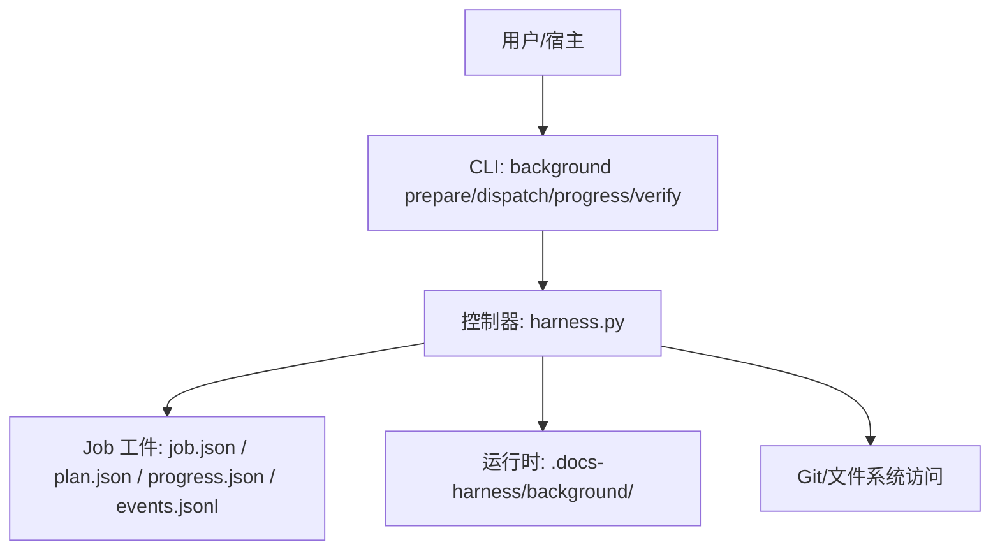
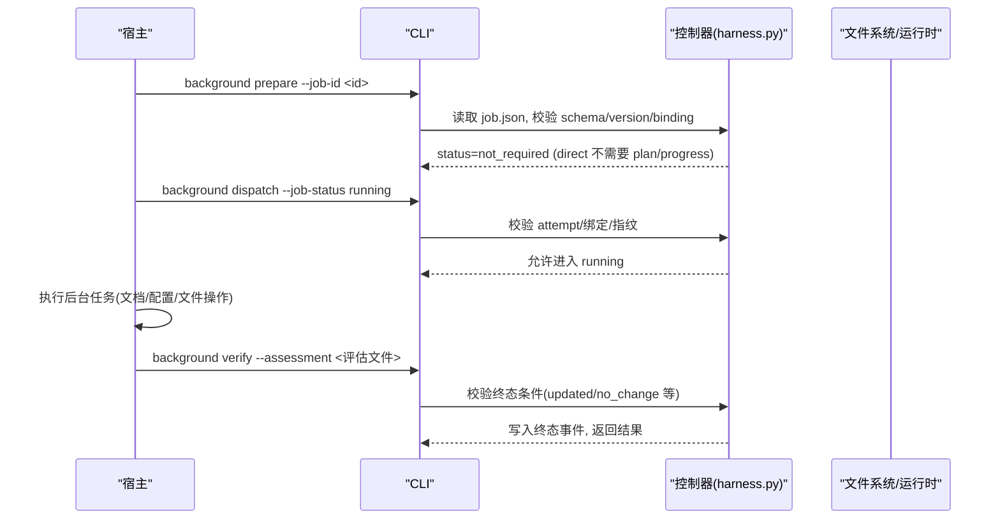
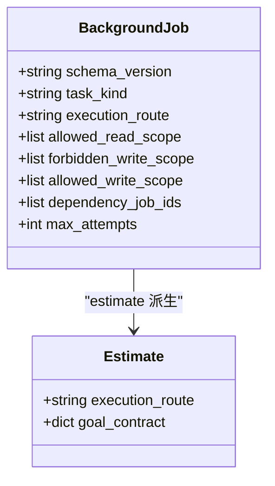
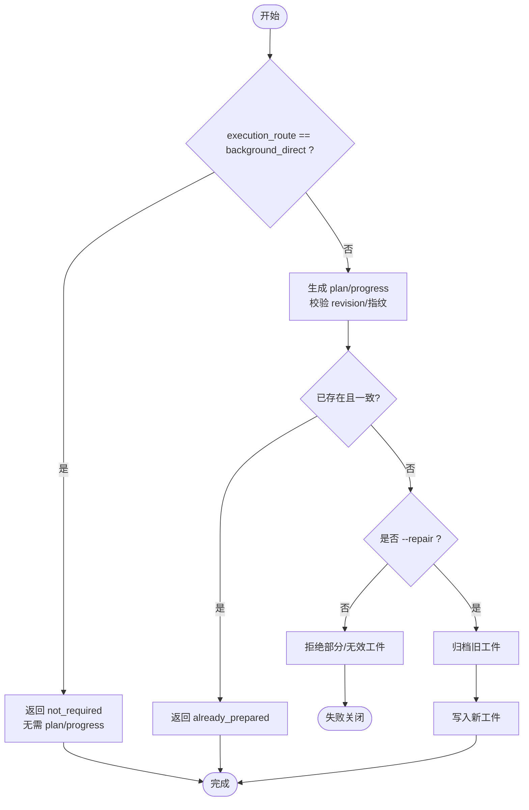
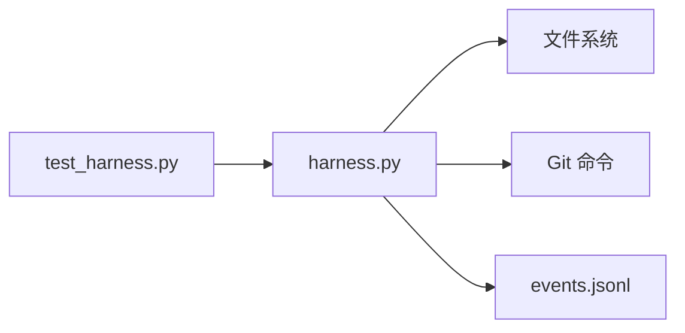

# 直接执行路线 (background_direct)

<cite>
**本文引用的文件**   
- [scripts/harness.py](file://scripts/harness.py)
- [tests/test_harness.py](file://tests/test_harness.py)
- [SKILL.md](file://SKILL.md)
- [docs/contracts.md](file://docs/contracts.md)
</cite>

## 目录
1. [简介](#简介)
2. [项目结构](#项目结构)
3. [核心组件](#核心组件)
4. [架构总览](#架构总览)
5. [详细组件分析](#详细组件分析)
6. [依赖关系分析](#依赖关系分析)
7. [性能考量](#性能考量)
8. [故障排查指南](#故障排查指南)
9. [结论](#结论)
10. [附录：使用示例与最佳实践](#附录使用示例与最佳实践)

## 简介
本章节面向 Docs Harness 的 background_direct 执行路线，解释其“简单直接”的任务执行模式：任务提交、执行流程与状态管理。该路线适用于无需复杂协调的轻量后台任务，如简单的文档更新、配置修改、文件操作等。它不要求宿主创建 Goal/Plan 工件，也不维护工作包进度，从而降低控制面复杂度与交互成本。

## 项目结构
- 控制器主逻辑集中在 scripts/harness.py，包含后台 Job 生命周期、路由选择、工件准备与校验、事件记录等。
- 测试用例 tests/test_harness.py 覆盖背景 Job 的创建、状态流转、prepare/dispatch/progress/verify 等行为。
- SKILL.md 提供高层使用说明，明确 background_direct 的定位与调用方式。
- docs/contracts.md 定义后台路线与契约，包括 direct/goal/goal_phased 的区别与约束。

图表来源
- [scripts/harness.py:7100-7300](file://scripts/harness.py#L7100-L7300)
- [docs/contracts.md:315-340](file://docs/contracts.md#L315-L340)

章节来源
- [scripts/harness.py:7100-7300](file://scripts/harness.py#L7100-L7300)
- [docs/contracts.md:315-340](file://docs/contracts.md#L315-L340)

## 核心组件
- 后台 Job 模型与读写范围
  - schema_version、task_kind、execution_route、allowed_read_scope、forbidden_write_scope、allowed_write_scope、dependency_job_ids、max_attempts 等字段用于描述 Job 能力边界与执行策略。
  - background_direct 默认 execution_route，不生成 goal_contract，也不需要 Plan/Progress。
- 工件准备与校验
  - prepare_background_goal_artifacts 对 complex routes 生成 plan/progress；对 background_direct 直接返回 not_required。
- 状态机与终态
  - BACKGROUND_TERMINAL_STATES 包含 updated/no_change/completed_with_finding/failed/cancelled 等终态。
  - background_direct 在 contract_ready → dispatched → running 后，由宿主推进至终态，无需中间进度。
- 事件与审计
  - append_background_event 记录有界状态、attempt、work_package_id（如有）、原因码与指纹，避免敏感信息泄露。

章节来源
- [scripts/harness.py:7100-7300](file://scripts/harness.py#L7100-L7300)
- [scripts/harness.py:8250-8449](file://scripts/harness.py#L8250-L8449)
- [scripts/harness.py:95-125](file://scripts/harness.py#L95-L125)

## 架构总览
background_direct 的执行路径强调“最小控制面”，宿主负责实际执行与结果上报，控制器仅做契约校验与审计。

图表来源
- [docs/contracts.md:315-340](file://docs/contracts.md#L315-L340)
- [scripts/harness.py:8284-8348](file://scripts/harness.py#L8284-L8348)

## 详细组件分析

### 后台 Job 模型与范围约束
- 关键字段
  - execution_route: 决定是否需要 Goal/Plan/Progress。background_direct 时为空对象 goal_contract_for_estimate 返回 {}。
  - allowed_read_scope/forbidden_write_scope/allowed_write_scope: 限定数据面读写范围，越界将拒绝。
  - task_kind: knowledge_bootstrap/knowledge_incremental_sync/delivery_governance/critical_followup 等。
- 兼容性
  - legacy_knowledge_job_dir/read_knowledge_job 兼容 v1 旧格式，自动补齐 execution_route 为 background_direct。

图表来源
- [scripts/harness.py:7118-7141](file://scripts/harness.py#L7118-L7141)
- [scripts/harness.py:7243-7260](file://scripts/harness.py#L7243-L7260)

章节来源
- [scripts/harness.py:7118-7141](file://scripts/harness.py#L7118-L7141)
- [scripts/harness.py:7243-7260](file://scripts/harness.py#L7243-L7260)

### 工件准备与校验（prepare）
- 对于 background_direct，prepare 直接返回 not_required，不生成 plan/progress。
- 对于复杂路线，prepare 会生成并校验 plan/progress，支持 repair 归档旧工件。

图表来源
- [scripts/harness.py:8284-8348](file://scripts/harness.py#L8284-L8348)

章节来源
- [scripts/harness.py:8284-8348](file://scripts/harness.py#L8284-L8348)

### 进度更新（progress）
- background_direct 不使用 progress；调用将返回 background_progress_not_required。
- 复杂路线才允许 pending→in_progress/blocked 与 in_progress→completed/blocked 的状态转换。

章节来源
- [scripts/harness.py:8351-8409](file://scripts/harness.py#L8351-L8409)

### 验收（verify）与终态
- 终态集合包含 updated/no_change/completed_with_finding/failed/cancelled。
- background_direct 的 verify 关注 Job 整体终态与事件审计，不检查工作包进度。

章节来源
- [scripts/harness.py:95-125](file://scripts/harness.py#L95-L125)
- [docs/contracts.md:315-340](file://docs/contracts.md#L315-L340)

### 错误处理与幂等性
- 输入/合同/绑定/状态无效返回结构化错误与退出码。
- 重复 prepare/progress/verify 具备幂等去重；损坏工件需显式 repair。
- Git 预检/远端漂移等场景通过 reason_code 与 blockers 反馈。

章节来源
- [docs/contracts.md:359-370](file://docs/contracts.md#L359-L370)
- [scripts/harness.py:8250-8348](file://scripts/harness.py#L8250-L8348)

## 依赖关系分析
- 控制器依赖文件系统与 Git 工具进行快照、指纹计算与变更检测。
- background_direct 对控制面工件依赖最少，仅需要 job.json 与事件日志。
- 测试用例验证了 direct 路线的准入、dispatch 与 verify 行为。

图表来源
- [scripts/harness.py:546-610](file://scripts/harness.py#L546-L610)
- [tests/test_harness.py:1859-1906](file://tests/test_harness.py#L1859-L1906)

章节来源
- [scripts/harness.py:546-610](file://scripts/harness.py#L546-L610)
- [tests/test_harness.py:1859-1906](file://tests/test_harness.py#L1859-L1906)

## 性能考量
- background_direct 跳过 plan/progress 生成与校验，减少 I/O 与 CPU 开销。
- 事件记录采用追加写与原子替换，避免并发竞争。
- Git 预检限制超时与批量操作，防止长时间阻塞。

[本节为通用指导，不直接分析具体文件]

## 故障排查指南
- 常见错误码与含义
  - invalid_background_job: Job 类型或字段无效
  - background_progress_not_required: direct 路线不应调用 progress
  - invalid_json/missing_file: 输入文件问题
  - git_preflight_failed/git_remote_unavailable: Git 环境或远端不可用
- 定位步骤
  - 检查 job.json 的 schema_version、execution_route、scope 字段
  - 查看 events.jsonl 中最近的事件与 reason_code
  - 确认目标目录非根目录或用户主目录，避免 unsafe_target

章节来源
- [scripts/harness.py:8250-8449](file://scripts/harness.py#L8250-L8449)
- [docs/contracts.md:359-370](file://docs/contracts.md#L359-L370)

## 结论
background_direct 以最小控制面实现“简单直接”的后台任务执行，适合无复杂协调需求的文档与配置类任务。通过严格的范围约束、幂等性与事件审计，确保执行安全与可追溯性。

[本节为总结，不直接分析具体文件]

## 附录：使用示例与最佳实践

### 适用场景
- 简单的文档更新（README、CHANGELOG、模块说明）
- 配置文件修改（项目配置、规则索引）
- 文件操作（清理缓存、整理目录结构）
- 只读查询与审计（git_inspect、audit）

### 参数与配置要点
- execution_route: 保持 background_direct（默认）
- allowed_read_scope/forbidden_write_scope/allowed_write_scope: 精确限定读写范围
- objective: 简要描述任务目标（用于估算与审计）
- assessment_ref: 验收评估文件路径（JSON），包含结论与证据摘要

### 执行流程示例
- 创建 Job
  - 使用 background prepare，direct 路线返回 not_required
- 启动执行
  - 使用 background dispatch 设置 running
- 执行任务
  - 宿主按 scope 执行文件/配置操作
- 验收
  - 使用 background verify 提交评估文件，控制器校验终态并记录事件

### 最佳实践
- 尽量缩小 allowed_write_scope，避免误改无关文件
- 使用幂等键与稳定 objective，便于重试与复用
- 事件与评估文件保持简洁，避免敏感信息
- 遇到 Git 漂移或权限问题，及时根据 reason_code 调整范围或修复环境

章节来源
- [SKILL.md:59-89](file://SKILL.md#L59-L89)
- [docs/contracts.md:315-340](file://docs/contracts.md#L315-L340)
- [scripts/harness.py:7100-7300](file://scripts/harness.py#L7100-L7300)
- [scripts/harness.py:8284-8348](file://scripts/harness.py#L8284-L8348)