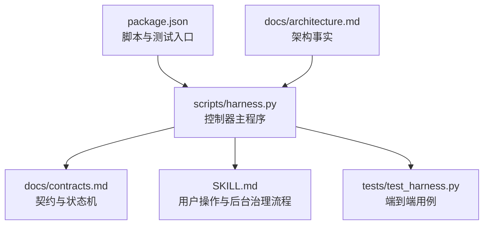
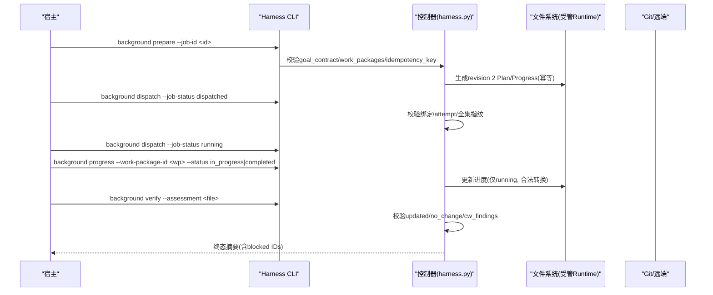
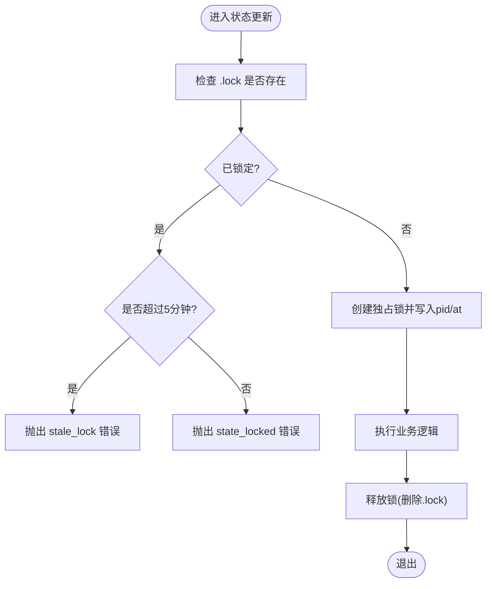
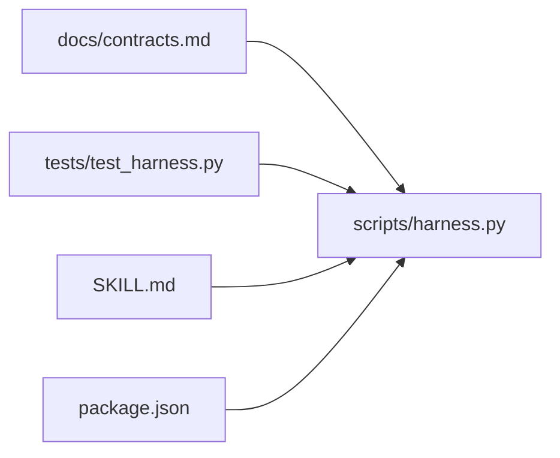

# 调度策略

<cite>
**本文引用的文件**   
- [scripts/harness.py](file://scripts/harness.py)
- [tests/test_harness.py](file://tests/test_harness.py)
- [SKILL.md](file://SKILL.md)
- [docs/contracts.md](file://docs/contracts.md)
- [docs/architecture.md](file://docs/architecture.md)
- [package.json](file://package.json)
</cite>

## 目录
1. [简介](#简介)
2. [项目结构](#项目结构)
3. [核心组件](#核心组件)
4. [架构总览](#架构总览)
5. [详细组件分析](#详细组件分析)
6. [依赖关系分析](#依赖关系分析)
7. [性能考量](#性能考量)
8. [故障排查指南](#故障排查指南)
9. [结论](#结论)
10. [附录：调度配置最佳实践](#附录：调度配置最佳实践)

## 简介
本文件面向 Docs Harness 的后台任务调度策略，聚焦并发控制、资源管理、优先级与公平性、错误恢复与重试、性能调优与监控指标，以及调度配置的最佳实践。内容基于控制器源码与合同文档进行系统化梳理，帮助读者在不深入代码细节的前提下理解并正确使用后台任务能力。

## 项目结构
Docs Harness 的核心实现位于 scripts/harness.py，对外行为与状态机由 docs/contracts.md 定义，SKILL.md 提供用户侧操作说明，tests/test_harness.py 覆盖关键路径与边界条件，package.json 描述脚本入口与测试命令。

**图示来源** 
- [scripts/harness.py](file://scripts/harness.py)
- [docs/contracts.md](file://docs/contracts.md)
- [SKILL.md](file://SKILL.md)
- [tests/test_harness.py](file://tests/test_harness.py)
- [package.json](file://package.json)
- [docs/architecture.md](file://docs/architecture.md)

**章节来源**
- [package.json:17-21](file://package.json#L17-L21)
- [docs/architecture.md:1-26](file://docs/architecture.md#L1-L26)

## 核心组件
- 后台任务模型与状态机
  - 使用 docs-harness/background-job/v2 作为 Job 模型；支持 background_direct、background_goal、background_goal_phased 三类执行路线。
  - 终态集合包含 updated、no_change、completed_with_finding、failed、cancelled 等；可重试状态包括 needs_user_input、needs_rebase、queued_manual。
- 工作包进度与验收
  - 复杂路线通过 prepare → dispatched → running → progress（多次）→ verify 的标准序列推进；progress 仅允许 running 的 Job 且 ID 必须来自冻结 Plan。
- 重试与最大尝试次数
  - 默认最大尝试次数为 3；retry 会归档旧 attempt 工件并要求重新 prepare，不继承完成进度。
- 知识引导与等待合并
  - 非终态 bootstrap 期间增量 Job 进入 waiting_for_bootstrap_merge；只有 bootstrap 成功且控制器复算知识 ready 才释放等待者。

**章节来源**
- [scripts/harness.py:53-60](file://scripts/harness.py#L53-L60)
- [scripts/harness.py:95-124](file://scripts/harness.py#L95-L124)
- [docs/contracts.md:303-348](file://docs/contracts.md#L303-L348)
- [SKILL.md:59-90](file://SKILL.md#L59-L90)

## 架构总览
后台任务在控制器内以“控制面”和“数据面”分离的方式运行：控制面由 CLI 写入 job.json、plan.json、progress.json、events.jsonl 等受管对象；业务数据面只能写 allowed_write_scope 内的范围，禁止触碰 .git/**、.docs-harness/** 或 Runtime。

**图示来源** 
- [docs/contracts.md:325-341](file://docs/contracts.md#L325-L341)
- [SKILL.md:71-86](file://SKILL.md#L71-L86)

## 详细组件分析

### 并发控制机制
- 进程级互斥锁
  - 每个任务状态目录存在 .lock 文件，采用 O_CREAT | O_EXCL 创建独占锁；超过 5 分钟视为过期锁，需人工清理。
- 任务复用与幂等
  - 同一 target、任务文本、事实与工作区快照命中活动任务时返回 active_task_reused，避免重复建立上下文与授权。
- 后台任务并发
  - 控制器未内置全局并发池；并发由宿主编排多个 background 调用并通过 .lock 保证单实例安全。

**图示来源** 
- [scripts/harness.py:1008-1029](file://scripts/harness.py#L1008-L1029)

**章节来源**
- [scripts/harness.py:1008-1029](file://scripts/harness.py#L1008-L1029)
- [docs/contracts.md:48-48](file://docs/contracts.md#L48-L48)

### 资源分配策略与负载均衡算法
- 资源隔离
  - 控制器将任务 Runtime 与后台 Runtime 分别置于 Git 目录或 .docs-harness 下，避免污染业务目录。
- 验证命令缓存与临时产物容忍
  - 验证命令逐项收据缓存；常见临时目录与后缀被容忍，避免误判交付写入。
- 负载均衡
  - 未实现集中式队列或负载感知调度；建议宿主按目标隔离（不同 project/target）与串行化关键路径来规避竞争。

**章节来源**
- [docs/contracts.md:350-358](file://docs/contracts.md#L350-L358)
- [scripts/harness.py:1142-1234](file://scripts/harness.py#L1142-L1234)

### 任务优先级管理与公平调度
- 优先级
  - 当前未实现显式优先级队列；可通过宿主编排顺序间接体现优先级（如先处理 critical_followup）。
- 公平性
  - 无抢占机制；所有 Job 共享相同约束与门禁，确保公平与安全。

[本节为概念性说明，不直接分析具体文件]

### 资源管理机制（内存/CPU/I/O）
- I/O 控制
  - 事件与收据追加采用原子写入与 fsync；工作区快照对大文件采用 size+mtime 指纹，限制扫描规模。
- 内存与 CPU
  - 控制器为 Python 单进程脚本，未内置资源配额；宿主应在系统层限制进程资源（ulimit/cgroups）。

**章节来源**
- [scripts/harness.py:507-530](file://scripts/harness.py#L507-L530)
- [scripts/harness.py:1112-1136](file://scripts/harness.py#L1112-L1136)

### 错误恢复策略（重试/超时/故障转移）
- 重试与最大尝试次数
  - 默认 BACKGROUND_MAX_ATTEMPTS=3；retry 归档旧 attempt 并强制重新 prepare。
- 超时处理
  - Git 预检与命令调用设置超时，失败转为结构化错误码。
- 故障转移
  - 宿主能力不足时将 Job 置为 queued_manual，保留原路线，不静默降级；bootstrap 失败则阻塞等待者。

**章节来源**
- [scripts/harness.py:95-95](file://scripts/harness.py#L95-L95)
- [scripts/harness.py:572-583](file://scripts/harness.py#L572-L583)
- [SKILL.md:69-70](file://SKILL.md#L69-L70)

### 后台任务状态机与验收
- 标准序列
  - contract_ready → prepare → dispatched → running → progress（多次）→ verify → 终态。
- 进度合法性
  - pending → in_progress|blocked；in_progress → completed|blocked；倒退、跳过、未知 ID 均失败关闭。
- 验收规则
  - updated/no_change 要求全部工作包 completed；completed_with_finding 只允许 completed/blocked 并返回 blocked ID。

**章节来源**
- [docs/contracts.md:325-341](file://docs/contracts.md#L325-L341)
- [SKILL.md:71-86](file://SKILL.md#L71-L86)

## 依赖关系分析
- 控制器与契约
  - harness.py 严格遵循 contracts.md 的状态机与字段约定，确保跨版本一致性。
- 测试与契约
  - tests/test_harness.py 覆盖 run/context/verify/background 等关键路径，保障契约落地。
- 安装与脚本
  - package.json 暴露 self-test 与测试入口，便于本地验证。

**图示来源** 
- [docs/contracts.md](file://docs/contracts.md)
- [scripts/harness.py](file://scripts/harness.py)
- [tests/test_harness.py](file://tests/test_harness.py)
- [SKILL.md](file://SKILL.md)
- [package.json](file://package.json)

**章节来源**
- [package.json:17-21](file://package.json#L17-L21)
- [tests/test_harness.py:1-800](file://tests/test_harness.py#L1-L800)

## 性能考量
- 减少重复工作
  - 利用 active task key 复用活动任务，避免重复上下文与授权。
- 验证命令缓存
  - 输入不变时复用已通过命令收据，降低昂贵命令重跑。
- 快照与扫描优化
  - 非 Git 工作区快照有文件大小与数量限制，避免巨量扫描。
- 事件遥测
  - events.jsonl 记录 context/evidence/readmission 计数，用于定位瓶颈。

**章节来源**
- [docs/contracts.md:48-48](file://docs/contracts.md#L48-L48)
- [scripts/harness.py:1031-1071](file://scripts/harness.py#L1031-L1071)
- [scripts/harness.py:1112-1136](file://scripts/harness.py#L1112-L1136)

## 故障排查指南
- 常见错误码与含义
  - state_locked/stale_lock：状态锁冲突或过期锁；需确认是否有其他进程占用或清理过期锁。
  - git_preflight_timeout/git_remote_unavailable：Git 预检超时或远端不可用；检查网络与权限。
  - invalid_document_route_config：文档路由配置非法；检查路径类型、安全性与存在性。
- 调试步骤
  - 查看 events.jsonl 与 evidence-index.json 定位最近一次失败原因与轮次。
  - 使用 background status/list 检查 Job 状态与 attempt 历史。
  - 对于 Git 相关错误，使用 git_command 辅助命令复现问题。

**章节来源**
- [scripts/harness.py:1008-1029](file://scripts/harness.py#L1008-L1029)
- [scripts/harness.py:572-583](file://scripts/harness.py#L572-L583)
- [scripts/harness.py:1287-1346](file://scripts/harness.py#L1287-L1346)

## 结论
Docs Harness 的后台任务调度以严格的契约与状态机为核心，通过进程级锁保证并发安全，通过重试与最大尝试次数提升鲁棒性，通过验证命令缓存与快照优化提升效率。由于未内置集中式并发与优先级调度，宿主应通过编排与隔离实现负载均衡与优先级控制。结合事件遥测与结构化错误码，可有效定位与修复问题。

## 附录：调度配置最佳实践
- 并发与隔离
  - 按项目/目标拆分 Runtime，避免跨任务竞争；对关键路径串行化调用。
- 重试与超时
  - 合理设置 Git 超时；必要时增加 BACKGROUND_MAX_ATTEMPTS 但需配合幂等 prepare。
- 验证与缓存
  - 保持 verification.command_cache_enabled=true 以提升性能；仅在调试时关闭。
- 文档路由
  - 显式声明 document_routes，确保类型与路径安全，避免歧义与符号链接风险。
- 监控与审计
  - 定期消费 events.jsonl，统计 readmission_count、evidence_round_count、host_receipt_count 等指标。

**章节来源**
- [docs/contracts.md:350-358](file://docs/contracts.md#L350-L358)
- [scripts/harness.py:1188-1214](file://scripts/harness.py#L1188-L1214)
- [scripts/harness.py:1287-1346](file://scripts/harness.py#L1287-L1346)