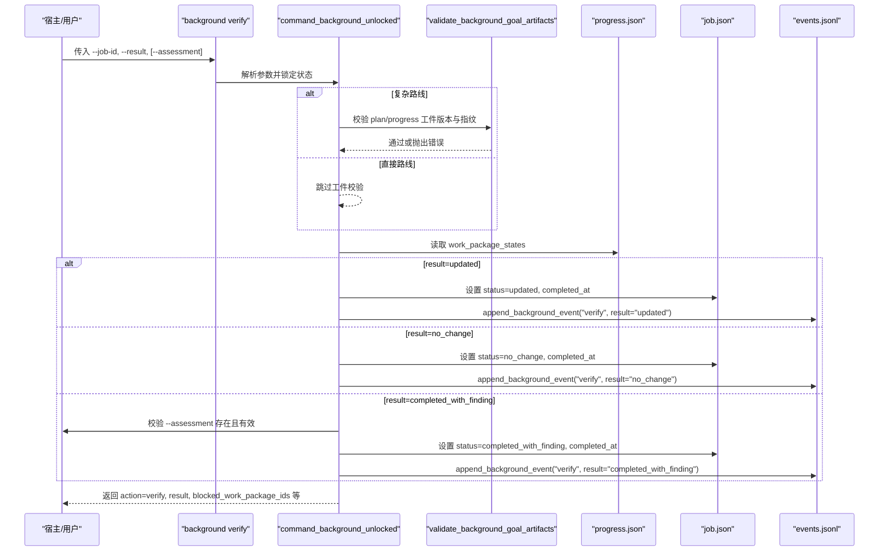
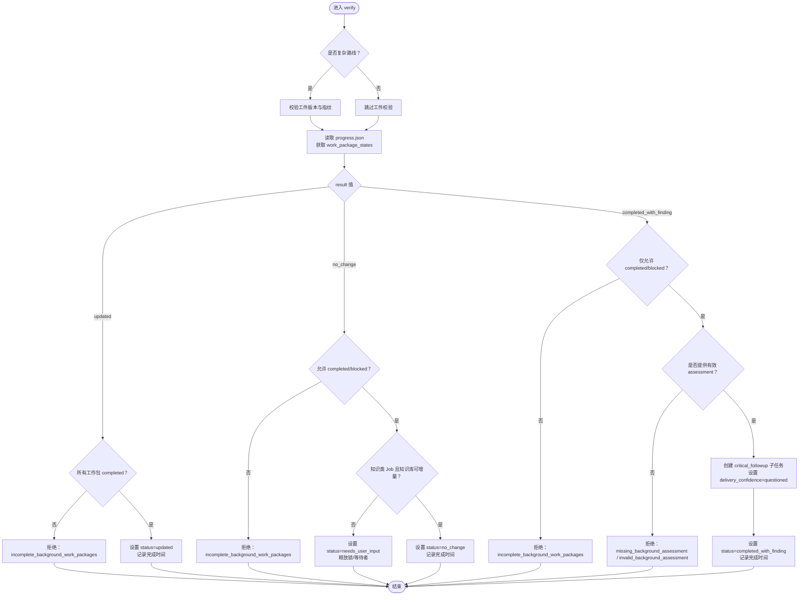
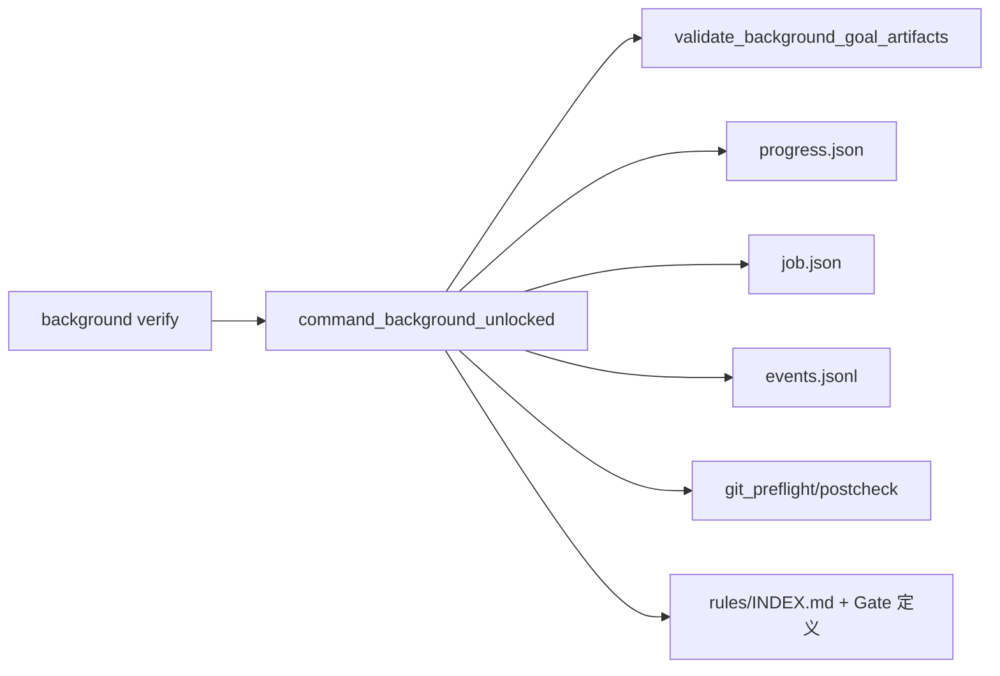

# 验收流程

<cite>
**本文引用的文件**   
- [scripts/harness.py](file://scripts/harness.py)
- [tests/test_harness.py](file://tests/test_harness.py)
- [SKILL.md](file://SKILL.md)
- [harness-home/rules/INDEX.md](file://harness-home/rules/INDEX.md)
</cite>

## 目录
1. [简介](#简介)
2. [项目结构](#项目结构)
3. [核心组件](#核心组件)
4. [架构总览](#架构总览)
5. [详细组件分析](#详细组件分析)
6. [依赖关系分析](#依赖关系分析)
7. [性能考量](#性能考量)
8. [故障排查指南](#故障排查指南)
9. [结论](#结论)
10. [附录](#附录)

## 简介
本文件面向 Docs Harness 的后台任务验收流程，聚焦以下目标：
- 明确三种验收结果判定条件与处理逻辑：updated、no_change、completed_with_finding。
- 说明验收标准的配置方法与自定义验收规则的编写要点。
- 阐述验收证据的收集与验证机制。
- 提供验收失败的诊断方法与修复建议。
- 给出验收流程的配置示例与调试技巧。

## 项目结构
本项目围绕独立控制器脚本展开，配合规则索引与测试用例共同构成验收能力：
- scripts/harness.py：控制器主实现，包含后台任务状态机、验收入口、证据校验、Git 预检/后检、工作区快照等。
- tests/test_harness.py：覆盖验收命令、状态流转、Git 同步、证据校验等关键路径。
- harness-home/rules/INDEX.md：生效规则清单与加载约定，用于 Gate 匹配与任务包准入。
- SKILL.md：高层使用说明，含后台治理与验收相关要点。

```mermaid
graph TB
A["CLI 入口<br/>background verify"] --> B["command_background_unlocked<br/>动作分发"]
B --> C{"执行路线类型？"}
C --> |复杂路线 background_goal / background_goal_phased| D["validate_background_goal_artifacts<br/>校验工件版本与指纹"]
C --> |直接路线 background_direct| E["跳过工件校验"]
D --> F["读取 progress.json<br/>检查 work_package_states"]
E --> F
F --> G{"result 值判断"}
G --> |"updated"|"H: 要求所有工作包 completed<br/>更新 job.status=updated"
G --> |"no_change"|"I: 允许 completed/blocked<br/>若知识类 Job 需 ready 否则转 needs_user_input"
G --> |"completed_with_finding"|"J: 仅允许 completed/blocked<br/>必须提交 assessment，创建 critical_followup"
H --> K["记录事件/摘要<br/>释放锁/等待者"]
I --> K
J --> K
```

**图表来源** 
- [scripts/harness.py:8877-9000](file://scripts/harness.py#L8877-L9000)
- [scripts/harness.py:8351-8410](file://scripts/harness.py#L8351-L8410)

**章节来源**
- [scripts/harness.py:8877-9000](file://scripts/harness.py#L8877-L9000)
- [SKILL.md:59-89](file://SKILL.md#L59-L89)

## 核心组件
- 后台任务状态机与终态集合
  - 终态包括 updated、no_change、completed_with_finding、failed、cancelled。
  - 已知状态集还包含 contract_ready、dispatched、running、waiting_for_dependency、waiting_for_bootstrap_merge、needs_user_input、needs_rebase、queued_manual。
- 验收入口与动作分发
  - background verify 是统一入口，内部根据 execution_route 决定是否需要校验 Goal 工件（plan/progress）。
- 工作包进度与工件校验
  - 复杂路线需要 validate_background_goal_artifacts 校验工件版本与指纹一致性。
  - progress.json 中的 work_package_states 决定是否满足验收前提。
- 结果分支与后续处理
  - updated：要求全部工作包为 completed；写入 knowledge_map（知识类）并更新 job 状态。
  - no_change：允许 completed/blocked；知识类 Job 若未就绪则转入 needs_user_input。
  - completed_with_finding：仅允许 completed/blocked；必须提交 assessment，生成 critical_followup 子任务。

**章节来源**
- [scripts/harness.py:97-114](file://scripts/harness.py#L97-L114)
- [scripts/harness.py:8877-9000](file://scripts/harness.py#L8877-L9000)
- [scripts/harness.py:8351-8410](file://scripts/harness.py#L8351-L8410)

## 架构总览
下图展示后台任务验收的关键调用链与数据流，从 CLI 到控制器再到状态持久化与事件记录。



**图表来源** 
- [scripts/harness.py:8877-9000](file://scripts/harness.py#L8877-L9000)
- [scripts/harness.py:8351-8410](file://scripts/harness.py#L8351-L8410)

## 详细组件分析

### 验收结果判定与处理逻辑
- updated
  - 前提：复杂路线下所有 work_package_states 均为 completed。
  - 行为：将 job.status 设置为 updated，记录完成时间，释放锁与等待者，追加事件与摘要。
  - 知识类 Job：若为 knowledge_bootstrap/knowledge_incremental_sync，需提供 assessment，校验通过后写入 knowledge-map 并更新指纹。
- no_change
  - 前提：允许 work_package_states 为 completed 或 blocked。
  - 行为：将 job.status 设置为 no_change，记录完成时间，释放锁与等待者，追加事件与摘要。
  - 知识类 Job：若当前知识库不可增量（knowledge_ready_for_incremental=false），则转入 needs_user_input，提示需人工确认。
- completed_with_finding
  - 前提：仅允许 work_package_states 为 completed 或 blocked。
  - 行为：必须提供 --assessment 且 schema 有效；创建 critical_followup 子任务，标记 delivery_confidence=questioned；最终状态为 completed_with_finding。



**图表来源** 
- [scripts/harness.py:8877-9000](file://scripts/harness.py#L8877-L9000)
- [scripts/harness.py:8351-8410](file://scripts/harness.py#L8351-L8410)

**章节来源**
- [scripts/harness.py:8877-9000](file://scripts/harness.py#L8877-L9000)
- [scripts/harness.py:8351-8410](file://scripts/harness.py#L8351-L8410)

### 验收标准配置与自定义规则
- 规则索引与激活
  - harness-home/rules/INDEX.md 声明 active_rules 列表与规则文件清单；控制器按 Gate 或关键词匹配规则，只有 status: active、规则 ID 唯一、正文指纹正确且合同字段完整的规则才能进入任务包。
- Gate 与风险底线
  - 安全底线 Gate（security-sensitive、destructive-data、release-external）由代码强制兜底，宿主可通过 gate_assessment 声明命中依据；漏判会被强制并入。
- 验收标准来源
  - 任务包的 semantic_evidence_requirements、verification_commands、completion_manifest 共同定义验收所需证据与命令；控制器在 verify 阶段逐项校验并缓存成功命令结果。

**章节来源**
- [harness-home/rules/INDEX.md:1-41](file://harness-home/rules/INDEX.md#L1-L41)
- [SKILL.md:25-57](file://SKILL.md#L25-L57)

### 验收证据收集与验证机制
- 证据收据格式
  - 使用 docs-harness/evidence-receipt/v2，绑定 task_id、target_identity、package_fingerprint、producer、ttl、changed_paths、read_set、write_set 等。
- 验证命令缓存
  - verification.command_cache_enabled 控制是否启用逐项缓存；失败或输入变化时重跑，成功则复用。
- 自动归因与临时产物
  - write_scope 内未归因写入默认由控制器自动归因（workspace_attribution），临时产物计入 volatile_write_set 不影响准入。
- Git 预检与后检
  - git_preflight_contract 与 git_postcheck 确保 fetch/sync 范围与远端目标不变，检测 ref 越界与工作区漂移。

**章节来源**
- [scripts/harness.py:800-876](file://scripts/harness.py#L800-L876)
- [scripts/harness.py:1203-1229](file://scripts/harness.py#L1203-L1229)
- [scripts/harness.py:1157-1249](file://scripts/harness.py#L1157-L1249)

### 验收失败的诊断与修复建议
- 常见错误码与含义
  - incomplete_background_work_packages：工作包未完成或状态不满足验收前提。
  - background_goal_artifacts_tampered：Goal 工件被篡改或不一致。
  - missing_background_assessment / invalid_background_assessment：重大发现缺少或无效评估。
  - knowledge_no_change_without_ready_knowledge：no_change 但知识库不可增量。
  - document_route_drift：文档路由合同漂移导致阻塞。
- 修复步骤
  - 补齐工作包状态至 completed/blocked。
  - 重新 prepare 工件（必要时 --repair）。
  - 提交有效的 assessment。
  - 重建文档路由合同或回滚变更。
  - 对知识类 Job，先完成知识库就绪再重试。

**章节来源**
- [scripts/harness.py:8877-9000](file://scripts/harness.py#L8877-L9000)
- [scripts/harness.py:8124-8194](file://scripts/harness.py#L8124-L8194)

### 验收流程配置示例与调试技巧
- 基本命令
  - background list/status/prepare/dispatch/progress/verify/retry/prune。
- 调试要点
  - 使用 --json 输出结构化结果，便于定位 reason_code 与 next_action。
  - 查看 events.jsonl 了解事件序列与耗时统计。
  - 对于复杂路线，先 prepare 再 dispatched 再 running，最后 verify。
  - 对知识类 Job，确保 assessment 与 inventory 指纹一致。

**章节来源**
- [SKILL.md:59-89](file://SKILL.md#L59-L89)
- [tests/test_harness.py:1974-2012](file://tests/test_harness.py#L1974-L2012)

## 依赖关系分析
- 控制器与状态文件
  - job.json、plan.json、progress.json、events.jsonl 为核心状态与审计文件。
- 外部依赖
  - Git 工具链（fetch/sync/lfs/submodule）、文件系统原子写入、JSON 序列化。
- 规则与 Gate
  - 规则索引与 Gate 定义影响任务包准入与证据需求。



**图表来源** 
- [scripts/harness.py:8877-9000](file://scripts/harness.py#L8877-L9000)
- [scripts/harness.py:8351-8410](file://scripts/harness.py#L8351-L8410)
- [harness-home/rules/INDEX.md:1-41](file://harness-home/rules/INDEX.md#L1-L41)

**章节来源**
- [scripts/harness.py:8877-9000](file://scripts/harness.py#L8877-L9000)
- [harness-home/rules/INDEX.md:1-41](file://harness-home/rules/INDEX.md#L1-L41)

## 性能考量
- 工作区快照缓存
  - workspace_snapshot 使用进程级缓存避免重复哈希；任何写入操作后需失效缓存。
- 验证命令缓存
  - 默认开启，减少重复执行成本；可按需关闭。
- 扫描限制
  - bounded_project_inventory 有文件大小与数量上限，避免大项目扫描超时。

[本节为通用指导，无需特定文件引用]

## 故障排查指南
- 快速定位
  - 查看 verify 返回的 reason_code 与 next_action。
  - 检查 progress.json 中 work_package_states 的状态分布。
  - 审查 events.jsonl 的事件序列与耗时。
- 常见问题
  - 工件不一致：重新 prepare 或使用 --repair。
  - 文档路由漂移：重建合同或回滚变更。
  - 知识库未就绪：先完成知识库构建或提供有效 assessment。
  - Git 漂移：确保远端目标未变，ref 在受控范围内。

**章节来源**
- [scripts/harness.py:8877-9000](file://scripts/harness.py#L8877-L9000)
- [scripts/harness.py:8124-8194](file://scripts/harness.py#L8124-L8194)

## 结论
Docs Harness 的后台任务验收流程以严格的状态机与工件校验为基础，通过 updated/no_change/completed_with_finding 三类结果精确表达任务执行效果。结合规则索引、Gate 与证据机制，形成可审计、可复用的验收闭环。实践中应关注工件一致性、工作包状态与知识库就绪度，借助事件日志与结构化输出进行高效诊断与修复。

[本节为总结性内容，无需特定文件引用]

## 附录
- 术语表
  - 工件：plan.json、progress.json 等用于复杂路线控制的契约与进度文件。
  - 证据收据：docs-harness/evidence-receipt/v2 格式的验收凭证。
  - Gate：风险门控，如安全敏感、破坏性数据、外部发布等。
- 参考命令
  - background verify --target . --job-id <id> --result <updated|no_change|completed_with_finding> [--assessment <file>] --json

[本节为补充信息，无需特定文件引用]