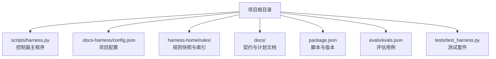
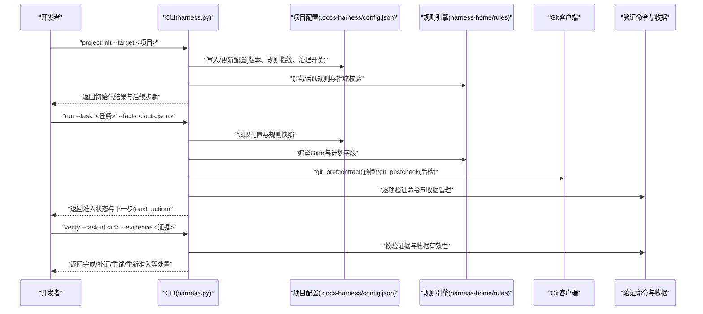
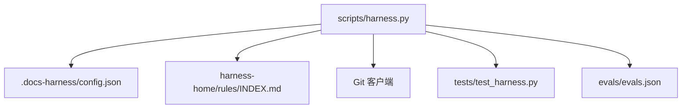

# 安装与配置

<cite>
**本文引用的文件**   
- [package.json](file://package.json)
- [SKILL.md](file://SKILL.md)
- [scripts/harness.py](file://scripts/harness.py)
- [harness-home/rules/INDEX.md](file://harness-home/rules/INDEX.md)
- [harness-home/rules/_rule-template.md](file://harness-home/rules/_rule-template.md)
- [evals/evals.json](file://evals/evals.json)
- [tests/test_harness.py](file://tests/test_harness.py)
- [docs/contracts.md](file://docs/contracts.md)
</cite>

## 目录
1. [简介](#简介)
2. [项目结构](#项目结构)
3. [核心组件](#核心组件)
4. [架构总览](#架构总览)
5. [详细组件分析](#详细组件分析)
6. [依赖分析](#依赖分析)
7. [性能考虑](#性能考虑)
8. [故障排除指南](#故障排除指南)
9. [结论](#结论)
10. [附录](#附录)

## 简介
本指南面向首次或二次使用 Docs Harness 的开发者与维护者，提供从环境准备、安装初始化到规则引擎配置的完整说明。内容覆盖：
- 环境与依赖要求（Python、Git、Node.js）
- 新项目初始化与现有项目集成流程
- 配置文件结构与关键选项
- 规则引擎激活与自定义规则添加
- 常见问题的排查与最佳实践

## 项目结构
Docs Harness 以 Python 脚本为核心入口，配合 Git 工作区与项目内配置进行任务治理与验收。关键目录与文件：
- scripts/harness.py：控制器主程序，包含 CLI、配置校验、Git 预检/后检、验证命令缓存、自动归因等核心逻辑
- harness-home/rules：随项目安装的通用规则快照与索引
- .docs-harness/config.json：项目级配置（由安装流程生成并维护）
- docs/*：知识文档与契约说明
- package.json：npm 脚本与版本元信息
- evals/evals.json：评估用例集合
- tests/test_harness.py：单元测试与契约测试

**图表来源** 
- [scripts/harness.py:1-120](file://scripts/harness.py#L1-L120)
- [harness-home/rules/INDEX.md:1-41](file://harness-home/rules/INDEX.md#L1-L41)
- [package.json:1-23](file://package.json#L1-L23)

**章节来源**
- [package.json:1-23](file://package.json#L1-L23)
- [SKILL.md:13-24](file://SKILL.md#L13-L24)

## 核心组件
- 控制器入口与命令集：通过 scripts/harness.py 暴露 project、run、verify、background、ledger 等子命令
- 项目配置：位于 .docs-harness/config.json，包含 schema_version、version、rules_root、installed_script_fingerprint、installed_rule_fingerprints、background_governance、knowledge、verification 等字段
- 规则引擎：基于 harness-home/rules 下的 INDEX.md 与规则文件，按 Gate 与关键词匹配激活
- Git 预检/后检：对 git_fetch/git_sync 等操作进行前置检查与后置校验，确保远端引用、LFS、Submodule 与工作区一致性
- 验证命令与收据：逐项执行、指纹缓存、受管副本存储，支持增量准入与重试

**章节来源**
- [scripts/harness.py:90-120](file://scripts/harness.py#L90-L120)
- [scripts/harness.py:1150-1200](file://scripts/harness.py#L1150-L1200)
- [scripts/harness.py:9540-9600](file://scripts/harness.py#L9540-L9600)
- [harness-home/rules/INDEX.md:1-41](file://harness-home/rules/INDEX.md#L1-L41)
- [docs/contracts.md:1-121](file://docs/contracts.md#L1-L121)

## 架构总览
Docs Harness 的工作流围绕“意图→范围→Gate→计划→上下文→执行→验证→完成”展开，结合后台治理与证据收据机制，确保可审计与失败关闭。

**图表来源** 
- [scripts/harness.py:546-791](file://scripts/harness.py#L546-L791)
- [scripts/harness.py:1150-1200](file://scripts/harness.py#L1150-L1200)
- [harness-home/rules/INDEX.md:1-41](file://harness-home/rules/INDEX.md#L1-L41)
- [docs/contracts.md:1-121](file://docs/contracts.md#L1-L121)

## 详细组件分析

### 环境要求与依赖项
- Python：需支持 Python 3（脚本以 shebang 指定 python3），建议最新稳定版
- Git 客户端：必须可用，用于仓库识别、远程引用读取、LFS/Submodule 检测
- Node.js：非运行时必需；但 package.json 中定义了 npm 脚本（如 self-test），便于本地自测与打包检查

最低建议：
- Python 3.9+
- Git 2.30+
- Node.js 18+（仅用于 npm 脚本）

**章节来源**
- [scripts/harness.py:1](file://scripts/harness.py#L1)
- [package.json:17-21](file://package.json#L17-L21)

### 安装步骤

#### 场景一：新项目初始化
- 在项目根目录执行初始化命令，将创建最小知识骨架、生成配置、复制规则快照，并启动异步知识引导 Job（不阻塞安装）
- 安装不会修改 .gitignore、提交或推送

参考命令路径：
- [SKILL.md:15-21](file://SKILL.md#L15-L21)

#### 场景二：现有项目集成
- 若已有 docs/ 目录，安装阶段零文档写入；先审查缺口，经用户同意后再创建后台 Job
- 升级时保留并合并合法的 document_routes；非法或缺少路由合同的在途治理 Job 返回 needs_manual_migration

参考命令路径：
- [SKILL.md:20-24](file://SKILL.md#L20-L24)

#### 运行任务与验收
- run：解析意图、编译候选意图、选择最高变更面与风险 Gate，进入 ready_direct|ready_planned|ready_extended 后执行
- verify：五级处置（provide_evidence、refresh_evidence、retry_verification、incremental_admission、full_readmission）

参考命令路径：
- [SKILL.md:25-57](file://SKILL.md#L25-L57)

**章节来源**
- [SKILL.md:13-57](file://SKILL.md#L13-L57)

### 配置文件结构（.docs-harness/config.json）
关键字段与作用：
- schema_version：配置合同版本（docs-harness/project-config/v4）
- version：控制器版本，需与当前脚本一致
- rules_root：规则根相对路径（默认 .docs-harness/harness-home/rules）
- installed_script_fingerprint：已安装脚本指纹，用于漂移检测
- installed_rule_fingerprints：规则文件指纹映射，用于快照一致性校验
- background_governance：后台治理开关与阈值、估算器、宿主调度策略
- knowledge：知识库根、映射文件、目标级别、是否允许降级准入、是否异步引导
- verification：验证相关开关（volatile_paths、command_cache_enabled、auto_attribute_in_scope）

生成与更新逻辑：
- 安装时原子写入配置，保留合法旧值（如 document_routes、inventory_include、volatile_paths）
- 版本不一致或指纹漂移会触发 findings 告警

参考实现路径：
- [scripts/harness.py:9540-9600](file://scripts/harness.py#L9540-L9600)
- [scripts/harness.py:1279-1285](file://scripts/harness.py#L1279-L1285)

**章节来源**
- [scripts/harness.py:9540-9600](file://scripts/harness.py#L9540-L9600)
- [scripts/harness.py:1279-1285](file://scripts/harness.py#L1279-L1285)

### 规则引擎配置与激活

#### 激活规则索引
- 规则索引位于 harness-home/rules/INDEX.md，声明 active_rules 列表与规则文件清单
- 控制器按 Gate 或关键词匹配规则，仅 status: active、ID 唯一、正文指纹正确且合同字段完整的规则生效
- 安装时复制固定规则快照并在配置中记录逐文件指纹；缺失、增加或变化均失败关闭

参考路径：
- [harness-home/rules/INDEX.md:1-41](file://harness-home/rules/INDEX.md#L1-L41)
- [scripts/harness.py:9709-9722](file://scripts/harness.py#L9709-L9722)

#### 自定义规则添加
- 使用模板 _rule-template.md 新建规则文件，填写 rule_id、gates、keywords、plan_fields、evidence_types、failure_mode 等元数据
- 将新规则加入 INDEX.md 的 active_rules 列表，并确保指纹一致

参考路径：
- [harness-home/rules/_rule-template.md:1-21](file://harness-home/rules/_rule-template.md#L1-L21)

**章节来源**
- [harness-home/rules/INDEX.md:1-41](file://harness-home/rules/INDEX.md#L1-L41)
- [harness-home/rules/_rule-template.md:1-21](file://harness-home/rules/_rule-template.md#L1-L21)
- [scripts/harness.py:9709-9722](file://scripts/harness.py#L9709-L9722)

### Git 预检与后检流程
- git_preflight_contract：对 git_fetch/git_sync 操作进行前置检查，包括远端 URL 指纹、refspec、HEAD、index_tree、worktree_fingerprint、LFS/Submodule 可用性、删除数量阈值、fast-forward 能力等
- git_postcheck：对操作结果进行后置校验，确保远端对象存在、引用一致、无脏工作区重叠等

参考路径：
- [scripts/harness.py:677-791](file://scripts/harness.py#L677-L791)
- [scripts/harness.py:793-800](file://scripts/harness.py#L793-L800)

**章节来源**
- [scripts/harness.py:677-791](file://scripts/harness.py#L677-L791)
- [scripts/harness.py:793-800](file://scripts/harness.py#L793-L800)

### 验证命令与证据收据
- 验证命令逐项执行，输入指纹缓存，支持 command_cache_enabled 整体开关
- volatile_paths 白名单用于忽略临时产物（如 __pycache__、.pytest_cache、.coverage 等），但同名已有文件的修改或删除仍失败关闭
- auto_attribute_in_scope 控制 write_scope 内未归因写入的自动归因行为

参考路径：
- [scripts/harness.py:1150-1200](file://scripts/harness.py#L1150-L1200)
- [scripts/harness.py:1202-1214](file://scripts/harness.py#L1202-L1214)

**章节来源**
- [scripts/harness.py:1150-1200](file://scripts/harness.py#L1150-L1200)
- [scripts/harness.py:1202-1214](file://scripts/harness.py#L1202-L1214)

## 依赖分析
- 控制器与配置：scripts/harness.py 依赖 .docs-harness/config.json 的版本与指纹一致性
- 规则引擎：harness-home/rules/INDEX.md 与规则文件指纹需与配置中的 installed_rule_fingerprints 一致
- Git 工具：必须可用，用于仓库识别、远端引用读取、LFS/Submodule 检测
- 测试与评估：tests/test_harness.py 与 evals/evals.json 提供契约与行为验证

**图表来源** 
- [scripts/harness.py:9540-9600](file://scripts/harness.py#L9540-L9600)
- [harness-home/rules/INDEX.md:1-41](file://harness-home/rules/INDEX.md#L1-L41)
- [tests/test_harness.py:1-200](file://tests/test_harness.py#L1-L200)
- [evals/evals.json:1-175](file://evals/evals.json#L1-L175)

**章节来源**
- [scripts/harness.py:9540-9600](file://scripts/harness.py#L9540-L9600)
- [harness-home/rules/INDEX.md:1-41](file://harness-home/rules/INDEX.md#L1-L41)
- [tests/test_harness.py:1-200](file://tests/test_harness.py#L1-L200)
- [evals/evals.json:1-175](file://evals/evals.json#L1-L175)

## 性能考虑
- 验证命令缓存：默认开启，可通过 verification.command_cache_enabled 整体关闭，减少重复执行
- 上下文复用：按 task/target/compiler contract 与内容指纹跨阶段复用，避免重复加载
- 后台治理：根据 workload_estimator 与阈值决定 direct/goal/phased 路线，避免不必要的复杂流程
- Git 预检优化：限制删除数量阈值、检测 LFS/Submodule 可用性，提前阻断高风险操作

[本节为通用指导，无需特定文件引用]

## 故障排除指南
常见问题与解决思路：
- 缺少有效项目配置：检查 .docs-harness/config.json 是否存在且 schema_version 正确
- 控制器版本不一致：确保 config.version 与脚本 VERSION 一致
- 规则快照漂移：核对 installed_rule_fingerprints 与实际规则文件指纹
- Git 预检失败：检查远端 URL、refspec、LFS/Submodule、工作区脏状态
- 验证命令失败：查看 command_cache_enabled 与 volatile_paths 白名单，确认输入指纹未变化
- 入口链缺失：确保 AGENTS.md/CLAUDE.md 包含受管入口标记与版本一致

参考路径：
- [scripts/harness.py:9588-9732](file://scripts/harness.py#L9588-L9732)
- [scripts/harness.py:1150-1200](file://scripts/harness.py#L1150-L1200)

**章节来源**
- [scripts/harness.py:9588-9732](file://scripts/harness.py#L9588-L9732)
- [scripts/harness.py:1150-1200](file://scripts/harness.py#L1150-L1200)

## 结论
Docs Harness 通过严格的配置指纹校验、规则快照一致性、Git 预检/后检与验证命令收据机制，实现了意图优先、证据可复用且失败关闭的任务治理体系。遵循本指南的环境准备、安装流程与配置规范，可有效降低集成成本与运维风险。

[本节为总结性内容，无需特定文件引用]

## 附录

### 实际配置示例与最佳实践
- 新项目：优先使用 project init 自动生成配置与规则快照，随后按需补充 knowledge-map.json 与共享文档
- 现有项目：先审查 docs/ 缺口，经用户同意后创建后台 Job，避免静默写入
- 规则管理：保持 INDEX.md 与规则文件指纹一致，新增规则需明确 gates、keywords、plan_fields、evidence_types
- 验证策略：合理设置 volatile_paths 白名单，启用 command_cache_enabled 提升效率，必要时关闭以调试
- Git 操作：明确 git_scope 绑定单一远端分支，避免模糊匹配导致的安全风险

[本节为概念性指导，无需特定文件引用]