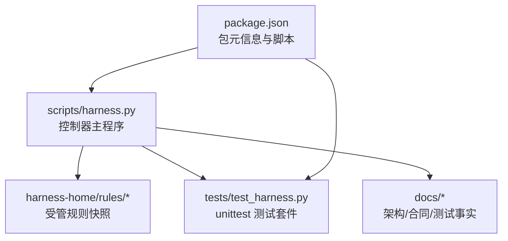
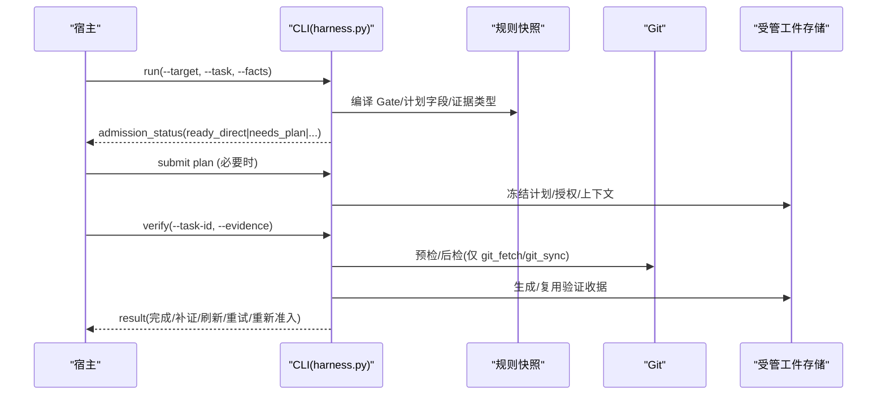
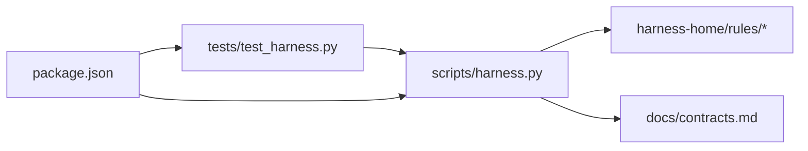

# 代码规范

<cite>
**本文引用的文件**   
- [SKILL.md](file://SKILL.md)
- [harness.py](file://scripts/harness.py)
- [test_harness.py](file://tests/test_harness.py)
- [package.json](file://package.json)
- [INDEX.md](file://harness-home/rules/INDEX.md)
- [_rule-template.md](file://harness-home/rules/_rule-template.md)
- [api-compatibility.md](file://harness-home/rules/api-compatibility.md)
- [external-input-security.md](file://harness-home/rules/external-input-security.md)
- [testing.md](file://docs/testing.md)
- [contracts.md](file://docs/contracts.md)
</cite>

## 目录
1. [简介](#简介)
2. [项目结构](#项目结构)
3. [核心组件](#核心组件)
4. [架构总览](#架构总览)
5. [详细组件分析](#详细组件分析)
6. [依赖关系分析](#依赖关系分析)
7. [性能与可维护性建议](#性能与可维护性建议)
8. [故障排查指南](#故障排查指南)
9. [结论](#结论)
10. [附录：检查清单与反模式](#附录检查清单与反模式)

## 简介
本规范面向 Docs Harness 的 Python 实现，覆盖以下方面：
- Python 代码风格约定（命名、缩进、注释、错误处理）
- 模块组织原则（文件结构、包管理、依赖声明）
- 测试编写规范（单元测试结构、断言方法、测试数据管理）
- 文档编写标准（Markdown、API 文档模板、变更日志格式）
- 代码审查检查清单与常见反模式
- 具体示例与最佳实践指引

本规范以仓库现有实现为依据，所有要求均可在脚本与测试中找到对应体现。

## 项目结构
Docs Harness 采用“单入口 CLI + 规则快照 + 测试驱动”的结构：
- scripts/harness.py：控制器主程序，包含版本常量、契约定义、工具函数、Git 操作、任务准入与验收流程等
- tests/test_harness.py：基于 unittest 的集成与契约测试，覆盖安装、任务流、Git 预检/后检、后台 Job、证据与验证命令等
- harness-home/rules/*：随包发布的受管规则快照，通过 INDEX.md 声明激活规则与加载约定
- docs/*：架构、合同、测试事实与计划文档
- package.json：包元信息、脚本与发布清单

图表来源
- [harness.py:1-120](file://scripts/harness.py#L1-L120)
- [test_harness.py:1-120](file://tests/test_harness.py#L1-L120)
- [package.json:1-23](file://package.json#L1-L23)

章节来源
- [SKILL.md:1-105](file://SKILL.md#L1-L105)
- [package.json:1-23](file://package.json#L1-L23)

## 核心组件
- 控制器主程序（scripts/harness.py）
  - 版本与契约常量集中声明，便于一致性校验
  - 统一的错误类型 HarnessError，携带 code 与 exit_code，保证结构化错误输出
  - 原子写入、JSON 读写、事件追加、Git 预检/后检、指纹计算等基础能力
  - 意图识别、Gate 编译、范围绑定、计划冻结、授权与证据流转、验证命令缓存与收据
- 测试套件（tests/test_harness.py）
  - 使用 unittest.TestCase，setUp/tearDown 管理临时目录
  - 子进程调用 CLI，统一 --json 输出解析
  - 固定装置：初始化项目、构建知识骨架、提交 Git、构造证据与质量评审
  - 覆盖安装、任务准入、Git fetch/sync、漂移检测、非 fast-forward、LFS/Submodule 可用性、验证命令与证据复用等
- 规则快照（harness-home/rules/*）
  - INDEX.md 声明激活规则与加载约定
  - _rule-template.md 提供规则模板
  - 各规则文件含 frontmatter（status、rule_id、content_fingerprint、gates、keywords、plan_fields、evidence_types、failure_mode）

章节来源
- [harness.py:1-120](file://scripts/harness.py#L1-L120)
- [harness.py:392-405](file://scripts/harness.py#L392-L405)
- [harness.py:419-435](file://scripts/harness.py#L419-L435)
- [harness.py:507-529](file://scripts/harness.py#L507-L529)
- [harness.py:532-544](file://scripts/harness.py#L532-L544)
- [harness.py:572-583](file://scripts/harness.py#L572-L583)
- [test_harness.py:47-107](file://tests/test_harness.py#L47-L107)
- [INDEX.md:1-41](file://harness-home/rules/INDEX.md#L1-L41)
- [_rule-template.md:1-21](file://harness-home/rules/_rule-template.md#L1-L21)

## 架构总览
Docs Harness 的任务流遵循“意图优先、证据可复用、失败关闭”的原则：
- run：编译意图与候选意图，确定最高 mutation_profile 与 Gate，生成计划合同并冻结
- context：按阶段交付上下文内容，支持正文跨阶段复用与增量差异返回
- verify：逐项执行验证命令，生成受管副本与收据，支持补证、刷新、重试与增量/完整重新准入
- background：后台 Job 状态机（prepare → dispatched → running → progress → verify），控制面由 CLI 写入

图表来源
- [harness.py:197-230](file://scripts/harness.py#L197-L230)
- [harness.py:677-791](file://scripts/harness.py#L677-L791)
- [contracts.md:199-214](file://docs/contracts.md#L199-L214)

章节来源
- [SKILL.md:25-57](file://SKILL.md#L25-L57)
- [contracts.md:123-131](file://docs/contracts.md#L123-L131)

## 详细组件分析

### Python 代码风格约定
- 命名规范
  - 模块与包：小写+下划线（如 scripts/harness.py）
  - 类名：大驼峰（如 HarnessError）
  - 函数与变量：小写+下划线（如 utc_now、canonical_json）
  - 常量：全大写+下划线（如 VERSION、TASK_SCHEMA、BACKGROUND_TERMINAL_STATES）
- 缩进与行宽
  - 使用 4 空格缩进；避免过长的行宽，保持可读性
- 注释与文档字符串
  - 模块级 docstring 说明职责与版本
  - 关键函数添加简明注释，解释输入、输出与副作用
- 导入顺序
  - 标准库、第三方库、本地模块分组清晰（当前为单文件，未显式分层）
- 类型提示
  - 广泛使用 typing 模块（Any、Iterator、Sequence）提升可读性与静态检查友好度
- 错误处理
  - 统一使用 HarnessError，附带 code 与 exit_code，便于上层分类处理
  - 文件读取、JSON 解析、Git 操作均捕获异常并转换为结构化错误

章节来源
- [harness.py:1-24](file://scripts/harness.py#L1-L24)
- [harness.py:392-405](file://scripts/harness.py#L392-L405)
- [harness.py:437-444](file://scripts/harness.py#L437-L444)
- [harness.py:507-529](file://scripts/harness.py#L507-L529)

### 模块组织原则
- 文件结构
  - 控制器源码集中于 scripts/harness.py，便于独立部署与版本对齐
  - 规则快照置于 harness-home/rules，随包分发并在目标项目内复制
  - 测试位于 tests/test_harness.py，使用 unittest discover 自动发现
- 包管理与依赖声明
  - 使用 package.json 描述名称、版本、描述与发布文件清单
  - 脚本命令：test、self-test、pack:check
  - 无外部运行时依赖（纯 Python 标准库）
- 配置与契约
  - 版本与契约常量集中在控制器中，确保 SKILL.md、package.json、VERSION 一致
  - 规则索引 INDEX.md 声明激活规则与加载约定，禁止运行时依赖绝对路径

章节来源
- [package.json:1-23](file://package.json#L1-L23)
- [INDEX.md:1-41](file://harness-home/rules/INDEX.md#L1-L41)
- [SKILL.md:1-24](file://SKILL.md#L1-L24)

### 测试编写规范
- 结构与组织
  - 继承 unittest.TestCase，使用 setUp/tearDown 管理临时工作区
  - 子进程调用 CLI，统一 --json 输出解析，便于断言结构化结果
- 断言方法
  - 使用 self.assertEqual、self.assertTrue、self.assertIn、self.assertRegex 等
  - 对返回值、退出码、文件存在性、JSON 结构进行断言
- 测试数据管理
  - 固定装置：init_project、bootstrap_knowledge、commit_project、init_git_remote
  - 证据构造：evidence() 生成 v2 收据，绑定 task/target/package fingerprint
  - 质量评审：quality_review() 生成质量记录
- 覆盖范围
  - 安装与升级、任务准入、知识生命周期、后台 Job、Git 预检/后检、漂移检测、验证命令与证据复用

章节来源
- [test_harness.py:47-107](file://tests/test_harness.py#L47-L107)
- [test_harness.py:108-163](file://tests/test_harness.py#L108-L163)
- [test_harness.py:248-304](file://tests/test_harness.py#L248-L304)
- [test_harness.py:339-354](file://tests/test_harness.py#L339-L354)

### 文档编写标准
- Markdown 格式
  - 使用 frontmatter 描述状态、ID、指纹、Gate、关键词、计划字段、证据类型、失败模式
  - 规则模板 _rule-template.md 提供统一结构
- API 文档模板
  - contracts.md 描述 CLI 行为、退出码、Git 约束、证据与验证命令
  - testing.md 描述自动化入口与验收分层
- 变更日志格式
  - 通过 package.json 的 version 与 SKILL.md metadata 保持一致
  - 计划文档（plans/*）记录演进目标与验收指标

章节来源
- [_rule-template.md:1-21](file://harness-home/rules/_rule-template.md#L1-L21)
- [api-compatibility.md:1-29](file://harness-home/rules/api-compatibility.md#L1-L29)
- [external-input-security.md:1-29](file://harness-home/rules/external-input-security.md#L1-L29)
- [contracts.md:359-370](file://docs/contracts.md#L359-L370)
- [testing.md:1-25](file://docs/testing.md#L1-L25)

## 依赖关系分析
- 内部依赖
  - 控制器主程序依赖规则快照与契约定义
  - 测试套件依赖控制器暴露的 CLI 接口与常量
- 外部依赖
  - Git 客户端（用于预检/后检、引用快照、diff 计算）
  - Python 标准库（json、subprocess、hashlib、pathlib 等）
- 耦合与内聚
  - 控制器高内聚：所有核心逻辑集中在单一文件，便于独立部署与审计
  - 规则快照低耦合：通过 INDEX.md 与模板解耦业务规则与控制面

图表来源
- [harness.py:1-120](file://scripts/harness.py#L1-L120)
- [test_harness.py:1-120](file://tests/test_harness.py#L1-L120)
- [package.json:1-23](file://package.json#L1-L23)

章节来源
- [harness.py:1-120](file://scripts/harness.py#L1-L120)
- [test_harness.py:1-120](file://tests/test_harness.py#L1-L120)

## 性能与可维护性建议
- 性能
  - 验证命令缓存：避免重复执行已通过命令，减少 I/O 与网络开销
  - 分段指纹：仅失效变化部分，降低上下文与授权重算成本
  - Git 预检/后检：限制超时与范围，避免长时间阻塞
- 可维护性
  - 统一错误类型与结构化输出，便于上层处理与监控
  - 原子写入与受管副本，保证状态一致性与可恢复性
  - 规则快照与模板化，降低变更风险与维护成本

[本节为通用建议，不直接分析具体文件]

## 故障排查指南
- 常见错误与定位
  - 输入无效：检查 JSON 结构、文件大小、UTF-8 编码
  - Git 操作失败：确认远端可用、分支 fast-forward、LFS/Submodule 状态
  - 证据缺失或漂移：根据 reason_code 选择补证、刷新或重新准入
- 调试步骤
  - 使用 --json 输出解析结构化错误
  - 查看 events.jsonl 与受管工件存储，定位失败轮次与原因
  - 复现最小场景，隔离问题范围

章节来源
- [harness.py:437-444](file://scripts/harness.py#L437-L444)
- [harness.py:572-583](file://scripts/harness.py#L572-L583)
- [contracts.md:359-370](file://docs/contracts.md#L359-L370)

## 结论
本规范基于 Docs Harness 的实际实现，明确了 Python 代码风格、模块组织、测试规范与文档标准。通过统一错误处理、原子写入、受管工件与规则快照，系统在安全性、可维护性与性能之间取得平衡。遵循本规范有助于提升代码质量、降低协作成本并确保系统稳定运行。

[本节为总结，不直接分析具体文件]

## 附录：检查清单与反模式

### 代码审查检查清单
- 命名与风格
  - 是否遵循小写+下划线、大驼峰、全大写常量命名
  - 是否使用 4 空格缩进与清晰的导入分组
- 错误处理
  - 是否统一使用 HarnessError 并附带 code 与 exit_code
  - 是否对文件、JSON、Git 操作进行异常捕获与结构化转换
- 模块组织
  - 控制器是否集中在 scripts/harness.py
  - 规则快照是否在 harness-home/rules 并通过 INDEX.md 声明
- 测试覆盖
  - 是否使用 unittest.TestCase 与 setUp/tearDown
  - 是否覆盖安装、任务流、Git 预检/后检、证据与验证命令
- 文档一致性
  - SKILL.md、package.json、控制器版本是否一致
  - 规则 frontmatter 是否完整且指纹正确

章节来源
- [harness.py:392-405](file://scripts/harness.py#L392-L405)
- [INDEX.md:1-41](file://harness-home/rules/INDEX.md#L1-L41)
- [test_harness.py:47-107](file://tests/test_harness.py#L47-L107)

### 常见反模式
- 硬编码路径与敏感信息
  - 避免在代码中硬编码绝对路径或包含密钥、token
- 忽略错误类型
  - 不要捕获 Exception 而不区分具体错误类型
- 跳过预检/后检
  - 对 Git 操作必须执行预检与后检，防止越界写入
- 证据与收据不一致
  - 确保证据类型、write_set、read_set 与实际变更一致
- 规则快照被篡改
  - 禁止运行时修改 harness-home/rules，必须通过升级或人工 preserve-and-merge

章节来源
- [harness.py:532-544](file://scripts/harness.py#L532-L544)
- [harness.py:677-791](file://scripts/harness.py#L677-L791)
- [contracts.md:199-214](file://docs/contracts.md#L199-L214)