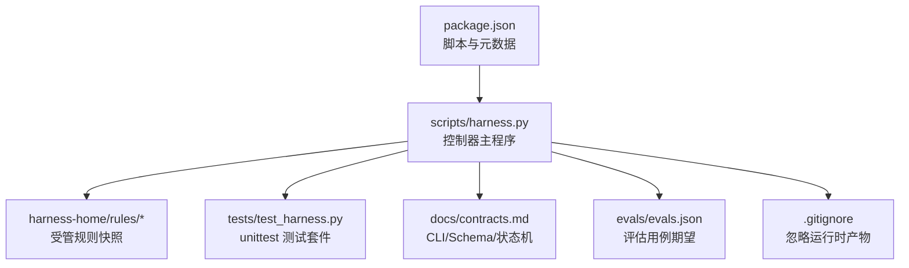
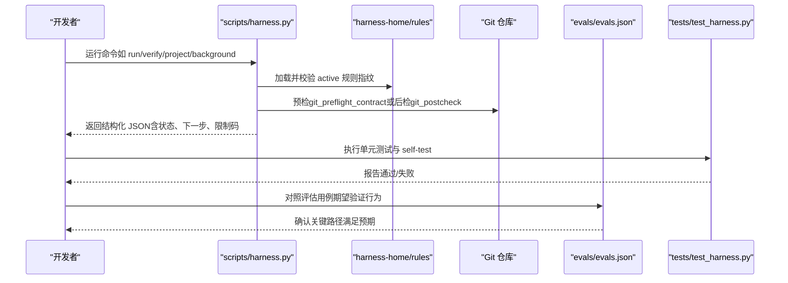
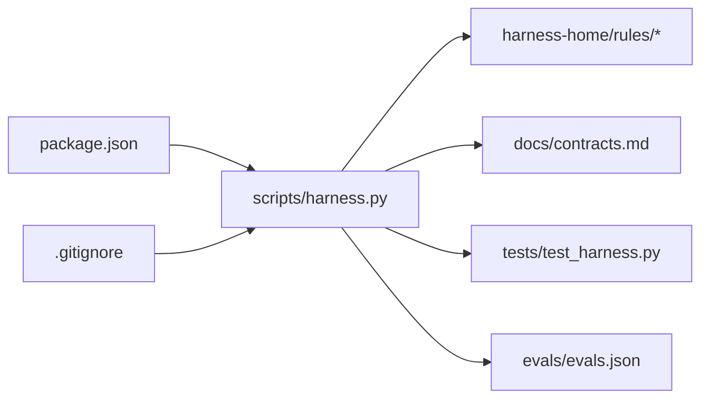

# 开发工作流

<cite>
**本文引用的文件**   
- [package.json](file://package.json)
- [SKILL.md](file://SKILL.md)
- [scripts/harness.py](file://scripts/harness.py)
- [tests/test_harness.py](file://tests/test_harness.py)
- [.gitignore](file://.gitignore)
- [harness-home/rules/INDEX.md](file://harness-home/rules/INDEX.md)
- [evals/evals.json](file://evals/evals.json)
- [docs/contracts.md](file://docs/contracts.md)
- [docs/architecture.md](file://docs/architecture.md)
</cite>

## 目录
1. [简介](#简介)
2. [项目结构](#项目结构)
3. [核心组件](#核心组件)
4. [架构总览](#架构总览)
5. [详细组件分析](#详细组件分析)
6. [依赖关系分析](#依赖关系分析)
7. [性能考量](#性能考量)
8. [故障排除指南](#故障排除指南)
9. [结论](#结论)
10. [附录](#附录)

## 简介
本文件面向 Docs Harness 的开发者与维护者，系统化说明本地开发环境搭建、版本控制与协作流程、调试与排障方法、发布与回滚流程，以及常用开发工具配置。内容基于仓库中的控制器脚本、测试套件、规则与合同文档整理而成，确保可操作且与实现一致。

## 项目结构
Docs Harness 是一个以 Python 为核心的独立控制器技能，通过 CLI 提供任务准入、上下文管理、证据与验收、后台治理与 Git 交付检查等能力。关键目录与职责：
- scripts/harness.py：控制器主程序，包含所有命令实现、状态机、Gate 判定、Git 预检/后检、事件与收据管理等。
- tests/test_harness.py：基于 unittest 的集成与契约测试，覆盖安装、Git 操作、验证、后台 Job、质量账本等场景。
- harness-home/rules：随包发布的受管规则快照与索引，运行时由控制器加载并校验指纹。
- docs：合同、架构、计划与测试策略等文档；其中 contracts.md 定义 CLI、Schema 与状态机。
- evals：评估用例清单，描述关键行为期望。
- package.json：元数据与 npm scripts（用于触发测试与自检）。
- .gitignore：忽略运行时产物与缓存目录。

图表来源
- [scripts/harness.py:1-100](file://scripts/harness.py#L1-L100)
- [harness-home/rules/INDEX.md:1-41](file://harness-home/rules/INDEX.md#L1-L41)
- [tests/test_harness.py:1-120](file://tests/test_harness.py#L1-L120)
- [docs/contracts.md:1-121](file://docs/contracts.md#L1-L121)
- [evals/evals.json:1-175](file://evals/evals.json#L1-L175)
- [.gitignore:1-10](file://.gitignore#L1-L10)
- [package.json:1-22](file://package.json#L1-L22)

章节来源
- [package.json:1-22](file://package.json#L1-L22)
- [docs/architecture.md:1-9](file://docs/architecture.md#L1-L9)

## 核心组件
- 控制器入口与命令集：run、verify、project、background、ledger、task 等子命令，均通过 scripts/harness.py 暴露。
- Gate 与意图识别：根据任务文本与 facts 推断意图、变更面与风险 Gate，决定执行路线与授权需求。
- Git 预检/后检：对 git_fetch/git_sync 进行范围锁定、远端指纹、工作区一致性校验与变更后审计。
- 证据与验收：支持多类证据类型与受管副本，按五级处置分类处理 verify 结果。
- 后台治理：background_* 命令管理复杂 Job 生命周期与工作包进度。
- 规则系统：harness-home/rules 下的 active 规则在任务包中生效，需指纹一致。
- 测试与评估：unittest 驱动端到端验证，evals 定义关键行为期望。

章节来源
- [scripts/harness.py:1-250](file://scripts/harness.py#L1-L250)
- [harness-home/rules/INDEX.md:1-41](file://harness-home/rules/INDEX.md#L1-L41)
- [docs/contracts.md:1-132](file://docs/contracts.md#L1-L132)
- [evals/evals.json:1-175](file://evals/evals.json#L1-L175)

## 架构总览
Docs Harness 采用“意图优先 + 失败关闭”的控制面设计，围绕任务包、证据收据、验证命令与后台 Job 形成闭环。

图表来源
- [scripts/harness.py:546-791](file://scripts/harness.py#L546-L791)
- [harness-home/rules/INDEX.md:1-41](file://harness-home/rules/INDEX.md#L1-L41)
- [tests/test_harness.py:59-87](file://tests/test_harness.py#L59-L87)
- [evals/evals.json:1-175](file://evals/evals.json#L1-L175)

## 详细组件分析

### 本地开发环境搭建
- Python 环境
  - 使用 python3 解释器运行控制器与测试。
  - 无需额外第三方依赖（控制器使用标准库），但建议启用虚拟环境隔离。
- 依赖安装
  - 本项目为 private 包，不依赖外部 Python 包；npm scripts 仅用于触发测试与自检。
- 项目初始化
  - 对新项目执行安装命令，生成最小知识骨架与规则快照，不阻塞等待知识生成。
  - 已有 docs 的项目在安装阶段不写入文档内容，先审计再按需创建后台 Job。
- 运行自检
  - 使用 npm scripts 或命令行直接调用 self-test，验证控制器与规则一致性。

章节来源
- [package.json:17-21](file://package.json#L17-L21)
- [SKILL.md:13-24](file://SKILL.md#L13-L24)
- [tests/test_harness.py:339-354](file://tests/test_harness.py#L339-L354)

### 版本控制流程
- 分支策略
  - 控制器与规则必须进入版本控制面；clone_ready=true 要求当前 HEAD 包含完整安装清单。
  - 复杂后台 Job 工件属于控制面，只能由 CLI 维护。
- 提交规范
  - 建议在提交前运行测试与 self-test，确保规则指纹与契约一致。
  - 涉及 Git 操作的变更需保证预检通过后提交。
- 代码审查
  - 遵循 active 规则约束，特别是 API 兼容、文档变更、外部输入安全、UI 完整状态、测试放行、发布授权与回滚、Windows PowerShell 兼容性等。
  - 评审时需核对规则指纹、合同字段完整性与 Gate 语义。

章节来源
- [harness-home/rules/INDEX.md:1-41](file://harness-home/rules/INDEX.md#L1-L41)
- [docs/architecture.md:1-9](file://docs/architecture.md#L1-L9)
- [tests/test_harness.py:339-354](file://tests/test_harness.py#L339-L354)

### 调试与故障排除
- 日志与事件
  - 控制器将每次 verify 尝试记录为结构化事件，便于复算轮次与原因。
  - 事件不包含原始输出、环境变量或凭证，仅保存计数、原因码、指纹与有界路径。
- 错误追踪
  - 常见退出码：3（可恢复：补证/重读/重试/增量准入）、4（完整重新准入）。
  - 限制码映射到具体层（源码、本地验证、远端交付、fresh clone、发布产物、UI、外部状态）。
- 性能分析
  - 关注验证命令缓存命中、上下文增量加载、readmission 分类与重复任务数量。
  - 通过 evals 指标与 Runtime 事件定位瓶颈。

章节来源
- [docs/contracts.md:134-162](file://docs/contracts.md#L134-L162)
- [scripts/harness.py:392-410](file://scripts/harness.py#L392-L410)
- [evals/evals.json:1-175](file://evals/evals.json#L1-L175)

### 发布流程
- 版本管理
  - 版本号在 package.json、SKILL.md frontmatter、控制器常量与 VERSION 文件中保持一致。
  - 发布包包含 CHANGELOG、README、SKILL、VERSION、docs、evals、harness-home、scripts、tests。
- 变更验证
  - 运行 npm test 与 self-test，确保规则与契约一致。
  - 对照 evals 用例期望验证关键路径。
- 部署步骤
  - 控制器不自动提交、推送、发布或修改 .gitignore；宿主负责这些操作。
  - 下游升级需单独授权，并核对 installed_script_fingerprint 与实际脚本哈希。

章节来源
- [package.json:1-22](file://package.json#L1-L22)
- [SKILL.md:1-10](file://SKILL.md#L1-L10)
- [docs/architecture.md:1-9](file://docs/architecture.md#L1-L9)

### 开发工具配置
- IDE 设置
  - 使用 Python 解释器指向 python3，启用 unittest 发现模式。
  - 配置脚本运行参数（如 --target、--json）以便快速调试。
- 调试器配置
  - 针对 scripts/harness.py 设置断点，观察状态机迁移与 Git 预检/后检。
  - 使用 tests/test_harness.py 的 run_harness 辅助函数模拟 CLI 调用。
- 代码格式化
  - 遵循 PEP8 与统一缩进；确保 JSON 与 Markdown 格式一致。
  - 规则文件需保持 status、rule_id、content_fingerprint 等字段完整。

章节来源
- [tests/test_harness.py:59-87](file://tests/test_harness.py#L59-L87)
- [harness-home/rules/INDEX.md:1-41](file://harness-home/rules/INDEX.md#L1-L41)

## 依赖关系分析
控制器与规则、合同、测试与评估之间的依赖如下：

图表来源
- [scripts/harness.py:1-100](file://scripts/harness.py#L1-L100)
- [harness-home/rules/INDEX.md:1-41](file://harness-home/rules/INDEX.md#L1-L41)
- [docs/contracts.md:1-121](file://docs/contracts.md#L1-L121)
- [tests/test_harness.py:1-120](file://tests/test_harness.py#L1-L120)
- [evals/evals.json:1-175](file://evals/evals.json#L1-L175)
- [package.json:1-22](file://package.json#L1-L22)
- [.gitignore:1-10](file://.gitignore#L1-L10)

章节来源
- [scripts/harness.py:1-100](file://scripts/harness.py#L1-L100)
- [harness-home/rules/INDEX.md:1-41](file://harness-home/rules/INDEX.md#L1-L41)
- [docs/contracts.md:1-121](file://docs/contracts.md#L1-L121)
- [tests/test_harness.py:1-120](file://tests/test_harness.py#L1-L120)
- [evals/evals.json:1-175](file://evals/evals.json#L1-L175)
- [package.json:1-22](file://package.json#L1-L22)
- [.gitignore:1-10](file://.gitignore#L1-L10)

## 性能考量
- 验证命令缓存：逐项快照与收据复用，避免重复执行已通过命令。
- 上下文增量加载：按内容指纹跨阶段复用，减少重复传输。
- readmission 分类：区分 scope_bound、incremental_gate 与 full_readmission，降低不必要重入。
- 后台 Job 幂等：无关文件变化不影响 Job idempotency key，避免冗余派发。

章节来源
- [docs/contracts.md:134-162](file://docs/contracts.md#L134-L162)
- [evals/evals.json:1-175](file://evals/evals.json#L1-L175)

## 故障排除指南
- 常见问题
  - 规则缺失或指纹漂移：运行 project check 并修复 missing_harness_home。
  - Git 预检失败：检查脏工作区、非 fast-forward、LFS/Submodule 可用性。
  - 验证命令失败：根据 reason_code 选择 retry_verification 或 refresh_evidence。
  - 远端漂移：执行 run --task-id 完成重新准入并复用已冻结方案。
- 诊断步骤
  - 查看 events.jsonl 中的 verification_attempt 事件。
  - 核对 active 规则指纹与 INDEX.md 一致。
  - 使用 evals 用例定位行为偏差。

章节来源
- [tests/test_harness.py:356-376](file://tests/test_harness.py#L356-L376)
- [scripts/harness.py:546-791](file://scripts/harness.py#L546-L791)
- [docs/contracts.md:134-162](file://docs/contracts.md#L134-L162)

## 结论
Docs Harness 通过严格的 Gate、证据与验收机制，结合 Git 预检/后检与后台治理，构建了意图优先、失败关闭的开发控制面。遵循本文档的环境搭建、版本控制、调试与发布流程，可显著提升开发与交付效率与可靠性。

## 附录
- 常用命令参考
  - 项目初始化：python3 scripts/harness.py project init --target <project> --json
  - 任务执行：python3 scripts/harness.py run --target . --task "<任务>" --json
  - 证据验证：python3 scripts/harness.py verify --target . --task-id <id> --evidence <file> --json
  - 后台治理：python3 scripts/harness.py background list/status/prepare/dispatch/progress/verify/retry --target . --job-id <id> --json
  - 质量账本：python3 scripts/harness.py ledger add --target . --task-id <id> --review <file> --json

章节来源
- [SKILL.md:25-105](file://SKILL.md#L25-L105)
- [package.json:17-21](file://package.json#L17-L21)