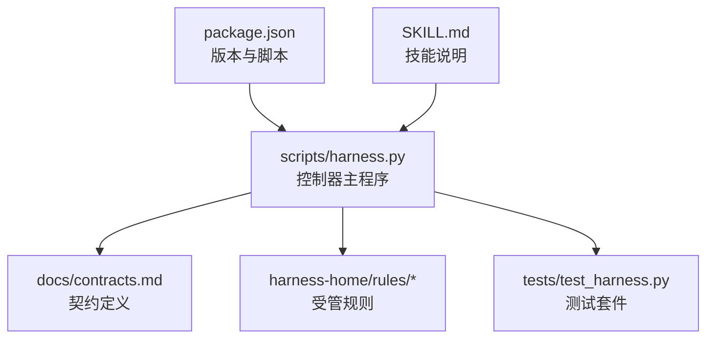
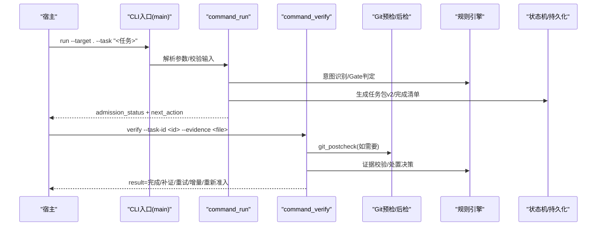
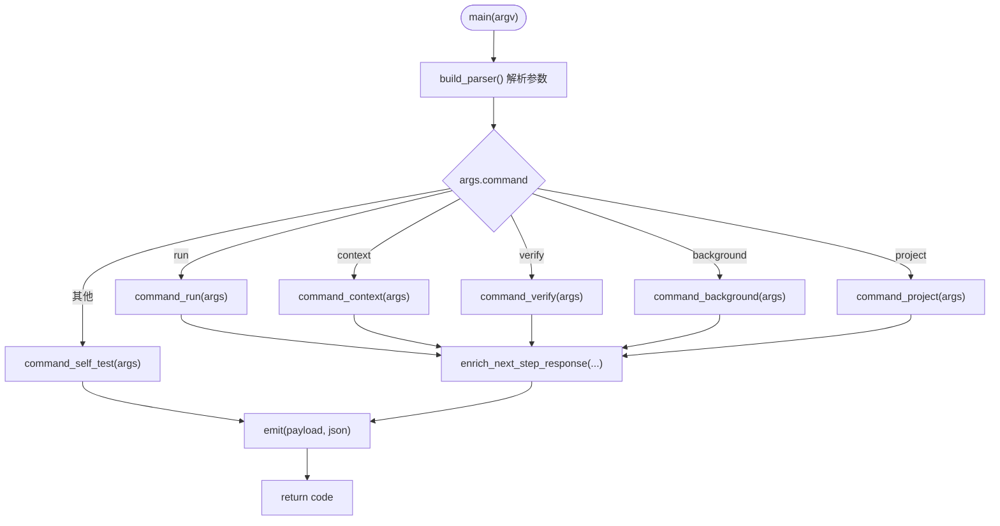
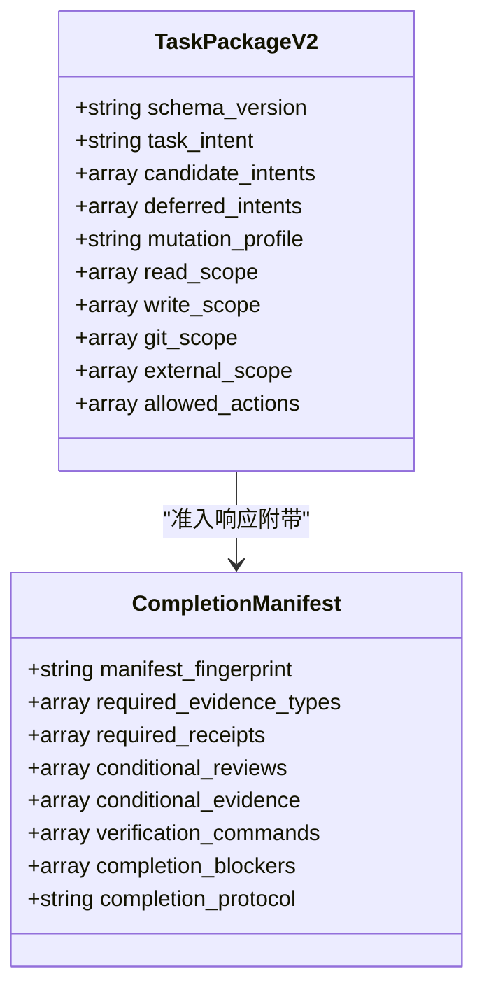
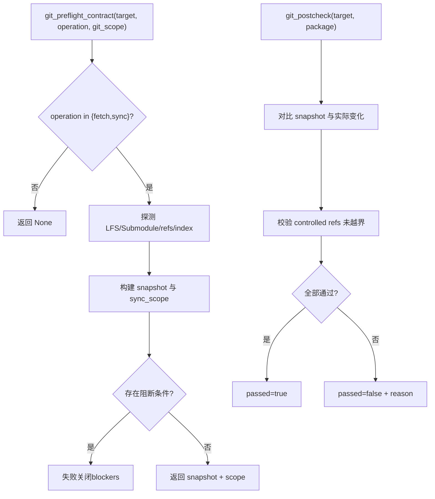
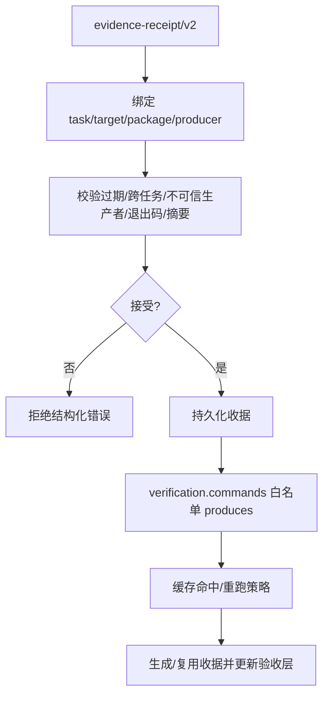
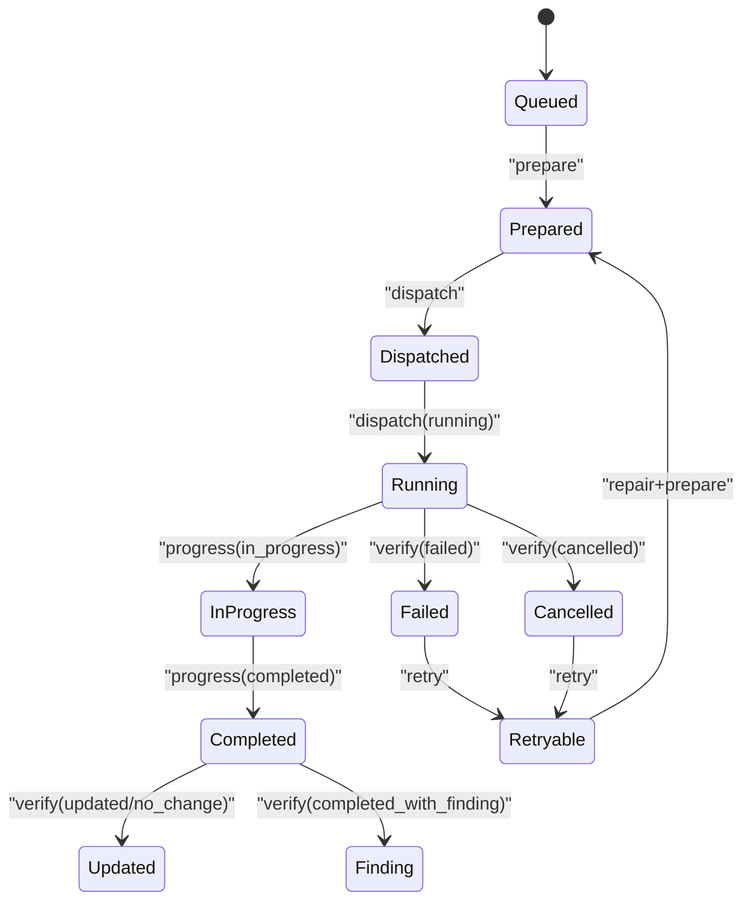
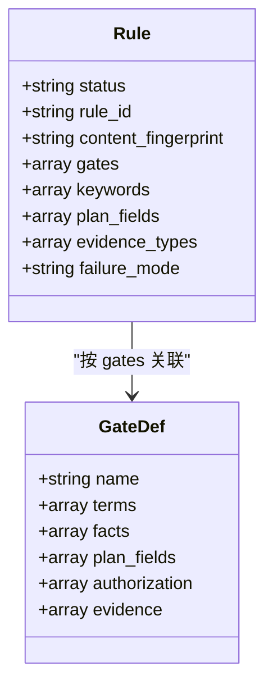
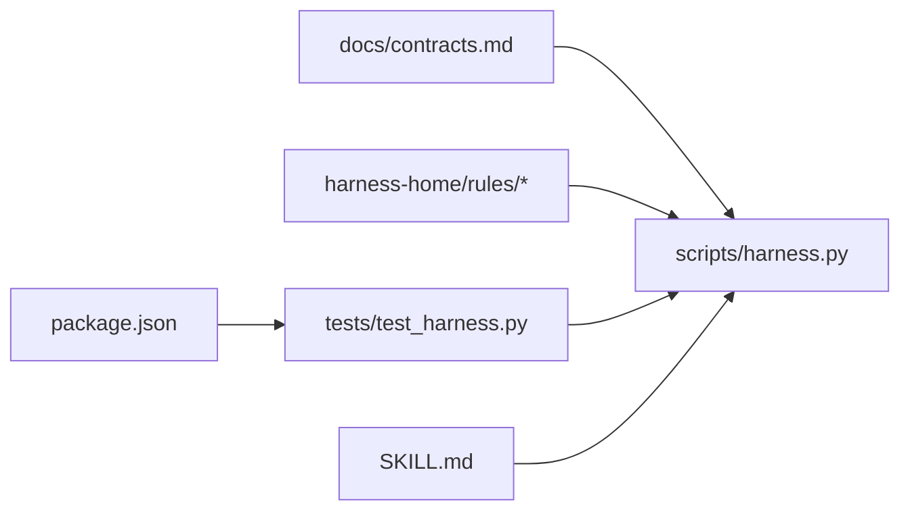

# 开发者指南

<cite>
**本文引用的文件**   
- [package.json](file://package.json)
- [SKILL.md](file://SKILL.md)
- [scripts/harness.py](file://scripts/harness.py)
- [tests/test_harness.py](file://tests/test_harness.py)
- [docs/architecture.md](file://docs/architecture.md)
- [docs/contracts.md](file://docs/contracts.md)
- [docs/testing.md](file://docs/testing.md)
- [harness-home/rules/INDEX.md](file://harness-home/rules/INDEX.md)
- [harness-home/rules/_rule-template.md](file://harness-home/rules/_rule-template.md)
- [harness-home/rules/external-input-security.md](file://harness-home/rules/external-input-security.md)
</cite>

## 目录
1. [简介](#简介)
2. [项目结构](#项目结构)
3. [核心组件](#核心组件)
4. [架构总览](#架构总览)
5. [详细组件分析](#详细组件分析)
6. [依赖关系分析](#依赖关系分析)
7. [性能与可观测性](#性能与可观测性)
8. [测试策略与实践](#测试策略与实践)
9. [代码规范与开发约定](#代码规范与开发约定)
10. [贡献流程与协作](#贡献流程与协作)
11. [调试与开发工具](#调试与开发工具)
12. [扩展开发指南](#扩展开发指南)
13. [故障排查](#故障排查)
14. [结论](#结论)

## 简介
Docs Harness 是一个独立的任务控制器，负责任务意图识别、风险 Gate、范围与上下文管理、证据与验收、后台治理以及 Git 交付检查。它不自动提交、推送或发布，也不将源码、本地 Runtime、当前 HEAD、远端、fresh clone、发布产物和真实 UI 合并为单一完成结论。通过严格的合同与状态机，确保任务执行的可审计、可回滚与失败关闭。

## 项目结构
- scripts/harness.py：控制器源码真源，实现 CLI、任务准入、上下文、验收、知识生命周期与后台 Job 状态机。
- harness-home/rules：受管规则快照，随项目安装到目标项目的 .docs-harness/harness-home/rules/。
- docs/contracts.md：对外行为与数据契约定义。
- SKILL.md：技能描述、安装与任务入口说明。
- package.json：版本、脚本与打包清单。
- tests/test_harness.py：单元测试与集成测试套件。

图表来源
- [scripts/harness.py:10322-10360](file://scripts/harness.py#L10322-L10360)
- [docs/contracts.md:1-200](file://docs/contracts.md#L1-L200)
- [harness-home/rules/INDEX.md:1-41](file://harness-home/rules/INDEX.md#L1-L41)
- [package.json:1-23](file://package.json#L1-L23)
- [SKILL.md:1-51](file://SKILL.md#L1-L51)

章节来源
- [docs/architecture.md:1-26](file://docs/architecture.md#L1-L26)
- [package.json:1-23](file://package.json#L1-L23)
- [SKILL.md:1-51](file://SKILL.md#L1-L51)

## 核心组件
- CLI 命令路由：run、context、verify、task、background、project、knowledge、ledger、self-test。
- 任务包 v2：intent、mutation_profile、write_scope、git_scope、allowed_actions、candidate_intents、deferred_intents。
- 准入与路线：blocked、needs_plan、needs_authorization、ready_direct、ready_planned、ready_extended。
- 证据收据 v2：绑定 task_id、target_identity、package_fingerprint、producer、读写集合等。
- Git 预检与后检：fetch/sync 的 ref 控制、工作区指纹、LFS/Submodule 可用性校验。
- 后台 Job：prepare → dispatched → running → progress → verify，支持 goal/goal_phased 复杂路线。
- 规则系统：按 Gate/关键词匹配，active 规则需唯一 ID、指纹正确且字段完整。

章节来源
- [scripts/harness.py:197-230](file://scripts/harness.py#L197-L230)
- [docs/contracts.md:9-80](file://docs/contracts.md#L9-L80)
- [docs/contracts.md:97-133](file://docs/contracts.md#L97-L133)
- [docs/contracts.md:165-200](file://docs/contracts.md#L165-L200)
- [harness-home/rules/INDEX.md:1-41](file://harness-home/rules/INDEX.md#L1-L41)

## 架构总览
Docs Harness 以控制器为中心，围绕“契约—任务包—证据—验收”的闭环运行。CLI 解析参数并分发至各命令处理器；任务准入阶段编译意图与 Gate，生成任务包与完成清单；执行阶段由宿主在允许范围内写入，控制器通过证据收据与验证命令进行验收；后台 Job 由控制器维护控制面工件，业务面仅写声明范围。

图表来源
- [scripts/harness.py:10322-10360](file://scripts/harness.py#L10322-L10360)
- [docs/contracts.md:50-80](file://docs/contracts.md#L50-L80)
- [docs/contracts.md:97-133](file://docs/contracts.md#L97-L133)

## 详细组件分析

### CLI 与命令路由
- main(argv) 构建解析器并分发到 command_* 函数，统一输出 JSON，异常转为结构化错误。
- 支持的命令包括 run、context、verify、task、background、project、knowledge、ledger、self-test。

图表来源
- [scripts/harness.py:10322-10360](file://scripts/harness.py#L10322-L10360)

章节来源
- [scripts/harness.py:10322-10360](file://scripts/harness.py#L10322-L10360)

### 任务包 v2 与准入流程
- 任务包 schema_version 为 docs-harness/task-package/v2，包含 intent、mutation_profile、write_scope、git_scope、allowed_actions 等。
- 准入状态机：blocked → needs_plan → needs_authorization → ready_direct/planned/extended。
- 完成清单 completion_manifest 固定验收项与 delivery_layers 分层。

图表来源
- [docs/contracts.md:9-80](file://docs/contracts.md#L9-L80)

章节来源
- [docs/contracts.md:9-80](file://docs/contracts.md#L9-L80)

### Git 预检与后检
- git_preflight_contract：对 fetch/sync 做前置校验，计算 repo_identity、remote refs、index_tree、worktree_fingerprint、controlled_refs_namespace 等。
- git_postcheck：对比预检快照与实际变化，限制只允许声明的 ref 变更，拒绝非 fast-forward、脏工作区重叠、危险删除等。

图表来源
- [scripts/harness.py:677-791](file://scripts/harness.py#L677-L791)
- [scripts/harness.py:793-800](file://scripts/harness.py#L793-L800)

章节来源
- [scripts/harness.py:677-791](file://scripts/harness.py#L677-L791)
- [scripts/harness.py:793-800](file://scripts/harness.py#L793-L800)

### 证据收据 v2 与验证命令
- evidence-receipt/v2 必须绑定 task_id、target_identity、package_fingerprint、producer、时间戳、退出码、摘要与读写集合。
- 验证命令 produces 白名单控制证据类型；新建临时副产物进入 volatile_write_set，不影响验收。

图表来源
- [docs/contracts.md:165-200](file://docs/contracts.md#L165-L200)

章节来源
- [docs/contracts.md:165-200](file://docs/contracts.md#L165-L200)

### 后台 Job 状态机
- 支持 background_direct、background_goal、background_goal_phased 三种路线。
- 控制面工件 job.json、plan.json、progress.json、events.jsonl 由 CLI 维护；业务面仅写 allowed_write_scope。
- 终态 updated/no_change/completed_with_finding/failed/cancelled；retry 归档旧 attempt 并重建 prepare。

图表来源
- [SKILL.md:59-89](file://SKILL.md#L59-L89)

章节来源
- [SKILL.md:59-89](file://SKILL.md#L59-L89)

### 规则系统与 Gate
- 规则文件位于 harness-home/rules，INDEX.md 声明 active_rules；每条规则含 rule_id、content_fingerprint、gates、keywords、plan_fields、evidence_types、failure_mode。
- Gate 顺序与定义在控制器中集中管理，安全底线 Gate 强制兜底。

图表来源
- [harness-home/rules/_rule-template.md:1-21](file://harness-home/rules/_rule-template.md#L1-L21)
- [harness-home/rules/external-input-security.md:1-29](file://harness-home/rules/external-input-security.md#L1-L29)
- [scripts/harness.py:260-342](file://scripts/harness.py#L260-L342)

章节来源
- [harness-home/rules/INDEX.md:1-41](file://harness-home/rules/INDEX.md#L1-L41)
- [harness-home/rules/_rule-template.md:1-21](file://harness-home/rules/_rule-template.md#L1-L21)
- [harness-home/rules/external-input-security.md:1-29](file://harness-home/rules/external-input-security.md#L1-L29)
- [scripts/harness.py:260-342](file://scripts/harness.py#L260-L342)

## 依赖关系分析
- 控制器依赖契约文档与规则快照，测试套件通过子进程调用 CLI 并断言 JSON 输出。
- package.json 提供测试与自检脚本，便于 CI 集成。

图表来源
- [package.json:17-21](file://package.json#L17-L21)
- [tests/test_harness.py:59-87](file://tests/test_harness.py#L59-L87)
- [docs/contracts.md:1-200](file://docs/contracts.md#L1-L200)

章节来源
- [package.json:17-21](file://package.json#L17-L21)
- [tests/test_harness.py:59-87](file://tests/test_harness.py#L59-L87)

## 性能与可观测性
- 原子写入与 fsync：atomic_write_text/atomic_write_json 保证文件写入原子性与持久化。
- 事件追加：append_jsonl 使用追加模式并 fsync，避免丢失。
- Git 操作超时保护：git_command 设置 timeout，防止阻塞。
- 指纹与哈希：sha256_text/file_fingerprint 用于稳定标识与去重。

章节来源
- [scripts/harness.py:419-435](file://scripts/harness.py#L419-L435)
- [scripts/harness.py:507-529](file://scripts/harness.py#L507-L529)
- [scripts/harness.py:572-583](file://scripts/harness.py#L572-L583)
- [scripts/harness.py:403-417](file://scripts/harness.py#L403-L417)

## 测试策略与实践
- 完整回归：npm test（Python unittest discover）。
- 控制器自检：npm run self-test。
- 发布包检查：npm run pack:check。
- 测试覆盖：init/upgrade、任务准入、知识生命周期、后台 Job、兼容迁移、幂等路径；复杂路线覆盖 prepare→dispatched→running→progress→verify。
- 下游层：安装控制器、项目知识状态、宿主派发；Git 交付与 fresh clone 需独立证据。

章节来源
- [docs/testing.md:1-25](file://docs/testing.md#L1-L25)
- [package.json:17-21](file://package.json#L17-L21)
- [tests/test_harness.py:339-354](file://tests/test_harness.py#L339-L354)

## 代码规范与开发约定
- 命名约定：模块与函数采用小写下划线；常量全大写；正则表达式命名清晰；错误类 HarnessError 携带 code 与 exit_code。
- 注释标准：关键函数与数据结构需有 docstring；契约与状态机变更需在 docs/contracts.md 同步更新。
- 代码风格：JSON 序列化使用 canonical_json（排序键、紧凑分隔）；文件 I/O 使用 atomic 写入；错误处理统一抛出 HarnessError。
- 规则文件：遵循 _rule-template.md 的 frontmatter 与章节结构；rule_id 唯一、content_fingerprint 正确、status=active。

章节来源
- [scripts/harness.py:392-405](file://scripts/harness.py#L392-L405)
- [scripts/harness.py:403-417](file://scripts/harness.py#L403-L417)
- [harness-home/rules/_rule-template.md:1-21](file://harness-home/rules/_rule-template.md#L1-L21)

## 贡献流程与协作
- 代码审查：所有变更需通过 npm test 与 self-test；新增规则需 INDEX.md 同步并保证指纹一致。
- 版本发布：package.json 版本与 SKILL.md frontmatter、控制器 VERSION 保持一致；pack:check 验证打包清单。
- 社区协作：遵循失败关闭原则；任何破坏性变更需完整重新准入；保留历史契约与迁移路径。

章节来源
- [package.json:1-23](file://package.json#L1-L23)
- [SKILL.md:1-7](file://SKILL.md#L1-L7)
- [harness-home/rules/INDEX.md:34-41](file://harness-home/rules/INDEX.md#L34-L41)

## 调试与开发工具
- 调试器配置：使用 Python 标准调试器（pdb/IDE 断点），在 main(argv) 与 command_* 处设置断点。
- 日志输出：通过 emit(payload, args.json) 输出结构化 JSON；异常统一捕获并输出 code/message。
- 性能分析：利用 append_jsonl 记录事件；使用 sha256 指纹定位重复与漂移；Git 操作超时与 LFS/Submodule 检测辅助定位环境问题。

章节来源
- [scripts/harness.py:10322-10360](file://scripts/harness.py#L10322-L10360)
- [scripts/harness.py:507-529](file://scripts/harness.py#L507-L529)
- [scripts/harness.py:572-583](file://scripts/harness.py#L572-L583)

## 扩展开发指南
- 插件开发：通过新增规则文件（遵循模板）扩展 Gate/关键词/证据类型；确保 INDEX.md 同步与指纹正确。
- 自定义适配器：在 evidence-receipt/v2 的 producer 字段声明 adapter/capability；控制器信任白名单 TRUSTED_EVIDENCE_PRODUCERS。
- 适配器实现：遵循 contracts.md 的证据与验证命令规范；produces 白名单控制证据类型；volatile_paths 配置临时文件容忍。

章节来源
- [harness-home/rules/_rule-template.md:1-21](file://harness-home/rules/_rule-template.md#L1-L21)
- [harness-home/rules/INDEX.md:1-41](file://harness-home/rules/INDEX.md#L1-L41)
- [docs/contracts.md:165-200](file://docs/contracts.md#L165-L200)
- [scripts/harness.py:240-258](file://scripts/harness.py#L240-L258)

## 故障排查
- 常见错误码：
  - 0：成功；verify.result=完成表示父任务完成。
  - 1：项目检查、自检或完整性读取失败。
  - 2：输入、合同、绑定或状态无效。
  - 3：需要方案、授权、证据（含 provide_evidence/refresh_evidence）、迁移、用户输入或 Git 交付。
  - 4：范围、漂移、Gate、远端、授权或规则变化，必须重新准入。
- 排查步骤：
  - 检查 CLI 输出 JSON 中的 code/message。
  - 核对任务包与证据收据字段是否完整。
  - 验证 Git 预检/后检结果与 blockers。
  - 确认规则指纹与 active 列表一致。

章节来源
- [docs/contracts.md:359-370](file://docs/contracts.md#L359-L370)
- [scripts/harness.py:10353-10356](file://scripts/harness.py#L10353-L10356)

## 结论
Docs Harness 通过严格的契约、状态机与证据体系，实现了意图优先、失败关闭与可审计的任务控制。开发者应遵循代码规范与测试策略，谨慎扩展规则与适配器，确保变更的可追溯与可回滚。借助调试工具与性能优化实践，可在复杂项目中稳定运行并持续演进。