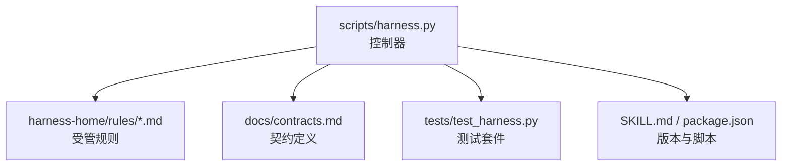
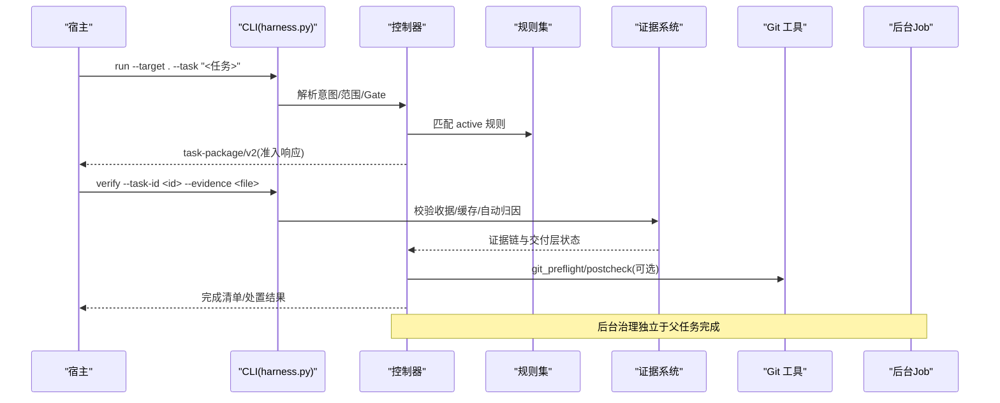
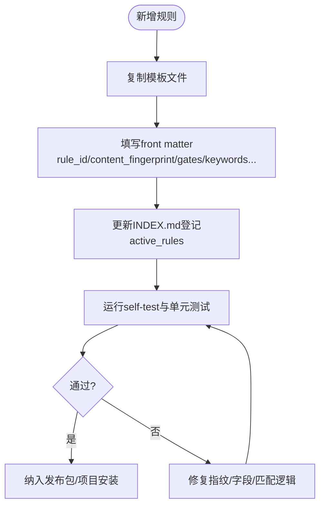
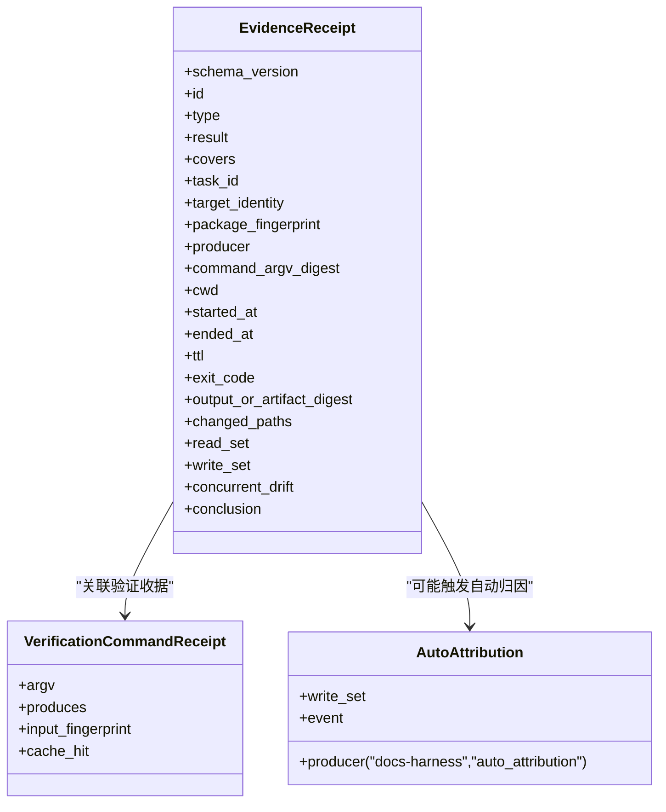
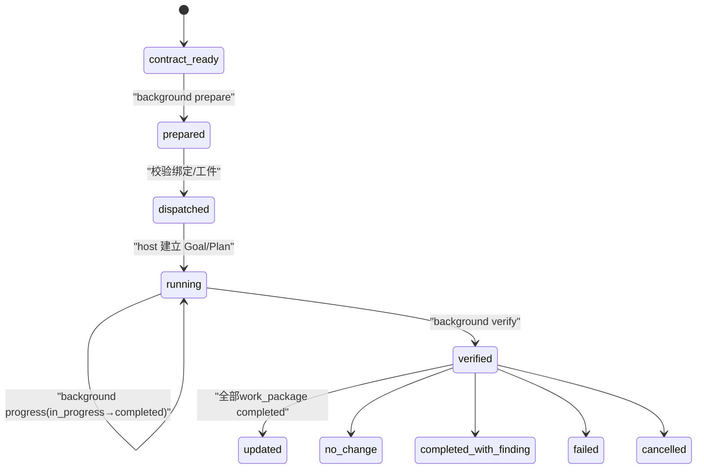
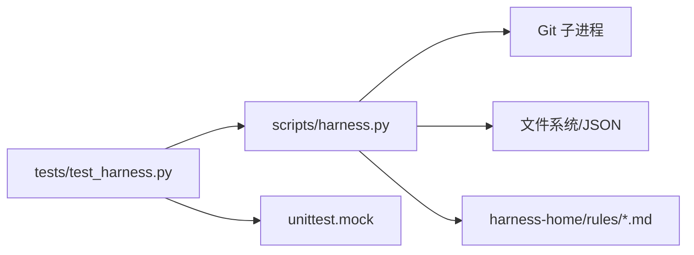

# 扩展开发

<cite>
**本文引用的文件**   
- [SKILL.md](file://SKILL.md)
- [package.json](file://package.json)
- [harness-home/rules/INDEX.md](file://harness-home/rules/INDEX.md)
- [harness-home/rules/_rule-template.md](file://harness-home/rules/_rule-template.md)
- [harness-home/rules/api-compatibility.md](file://harness-home/rules/api-compatibility.md)
- [harness-home/rules/documentation-changes.md](file://harness-home/rules/documentation-changes.md)
- [harness-home/rules/external-input-security.md](file://harness-home/rules/external-input-security.md)
- [harness-home/rules/testing-release.md](file://harness-home/rules/testing-release.md)
- [scripts/harness.py](file://scripts/harness.py)
- [tests/test_harness.py](file://tests/test_harness.py)
- [docs/contracts.md](file://docs/contracts.md)
- [docs/architecture.md](file://docs/architecture.md)
</cite>

## 目录
1. [简介](#简介)
2. [项目结构](#项目结构)
3. [核心组件](#核心组件)
4. [架构总览](#架构总览)
5. [详细组件分析](#详细组件分析)
6. [依赖关系分析](#依赖关系分析)
7. [性能考量](#性能考量)
8. [故障排查指南](#故障排查指南)
9. [结论](#结论)
10. [附录：扩展点与配置清单](#附录扩展点与配置清单)

## 简介
本文件面向希望为 Docs Harness 编写扩展的开发者，涵盖插件化规则、证据适配器、背景作业（后台治理）等扩展点的架构设计、生命周期、依赖注入方式、注册与配置方法，并提供从简单规则到复杂适配器的完整示例路径与最佳实践。内容严格基于仓库中的控制器源码、合同文档与测试用例进行提炼，确保可落地与可验证。

## 项目结构
Docs Harness 以单文件控制器为核心，配合受管规则集、契约文档与测试套件组织。关键目录与职责如下：
- scripts/harness.py：控制器主程序，负责任务准入、上下文、验收、知识生命周期、后台 Job 状态机与 Git 交付检查等。
- harness-home/rules：发布包内受管规则快照；项目安装时复制到目标项目的 .docs-harness/harness-home/rules。
- docs/contracts.md：对外行为与数据合同定义，包括任务包、证据收据、Git 状态、完成清单、后台治理等。
- tests/test_harness.py：覆盖 CLI、规则、Git 预检/后检、证据与后台流程的端到端测试。
- SKILL.md 与 package.json：版本、脚本入口与打包清单。

图表来源
- [scripts/harness.py:1-200](file://scripts/harness.py#L1-L200)
- [docs/contracts.md:1-120](file://docs/contracts.md#L1-L120)
- [harness-home/rules/INDEX.md:1-41](file://harness-home/rules/INDEX.md#L1-L41)
- [tests/test_harness.py:1-120](file://tests/test_harness.py#L1-L120)

章节来源
- [docs/architecture.md:1-26](file://docs/architecture.md#L1-L26)
- [package.json:1-23](file://package.json#L1-L23)

## 核心组件
- 任务与意图：控制器对自然语言任务进行意图编译，生成 task-package/v2，包含意图集合、变更面、范围与允许动作。
- Gate 与风险：内置 Gate 定义与安全底线，支持宿主 gate_assessment 权威声明，结合精确词表与否定守卫判定。
- 证据系统：evidence-receipt/v2 统一收据格式，支持命令验证收据缓存、自动归因、受管副本存储与简化声明草案。
- Git 交付检查：git_fetch/git_sync 预检与后检，远端漂移、非快进、脏工作区、LFS/Submodule 校验与失败关闭。
- 后台治理：background-job/v2，三种执行路线，prepare/dispatch/progress/verify 状态机，控制面与业务面分离。
- 规则系统：受管规则索引与指纹校验，active 规则按 Gate/关键词匹配进入任务包。

章节来源
- [docs/contracts.md:1-370](file://docs/contracts.md#L1-L370)
- [scripts/harness.py:1-250](file://scripts/harness.py#L1-L250)
- [harness-home/rules/INDEX.md:1-41](file://harness-home/rules/INDEX.md#L1-L41)

## 架构总览
Docs Harness 采用“控制器 + 受管规则 + 契约”的解耦架构。控制器提供统一的 CLI 与运行时管理，规则以 Markdown 描述约束与验收条件，契约文档定义数据结构与状态机。扩展点通过以下机制接入：
- 规则扩展：新增规则文件并登记至 INDEX.md，保持唯一 rule_id 与 content_fingerprint。
- 证据适配器：实现可信生产者（adapter/capability），产出 v2 收据或提交声明草案由控制器代铸。
- 背景作业：遵循 background-job/v2，使用 prepare/dispatch/progress/verify 序列，控制面仅由 CLI 写入。

图表来源
- [scripts/harness.py:1-200](file://scripts/harness.py#L1-L200)
- [docs/contracts.md:1-200](file://docs/contracts.md#L1-L200)
- [tests/test_harness.py:1-120](file://tests/test_harness.py#L1-L120)

## 详细组件分析

### 插件架构与规则扩展
- 规则文件格式：每个规则为 Markdown，包含 YAML front matter（status、rule_id、content_fingerprint、gates、keywords、plan_fields、evidence_types、failure_mode）。
- 激活与加载：控制器在任务准入阶段扫描 active 规则，按 Gate/关键词匹配，要求指纹一致且字段完整。
- 自定义规则开发步骤：
  - 复制模板 _rule-template.md 为新文件。
  - 填写 front matter，确保 rule_id 唯一、content_fingerprint 正确。
  - 在 harness-home/rules/INDEX.md 中登记 active_rules。
  - 通过 self-test 与单元测试验证规则生效。

图表来源
- [harness-home/rules/_rule-template.md:1-21](file://harness-home/rules/_rule-template.md#L1-L21)
- [harness-home/rules/INDEX.md:1-41](file://harness-home/rules/INDEX.md#L1-L41)
- [tests/test_harness.py:339-354](file://tests/test_harness.py#L339-L354)

章节来源
- [harness-home/rules/api-compatibility.md:1-29](file://harness-home/rules/api-compatibility.md#L1-L29)
- [harness-home/rules/documentation-changes.md:1-29](file://harness-home/rules/documentation-changes.md#L1-L29)
- [harness-home/rules/external-input-security.md:1-29](file://harness-home/rules/external-input-security.md#L1-L29)
- [harness-home/rules/testing-release.md:1-29](file://harness-home/rules/testing-release.md#L1-L29)

### 证据适配器开发
- 收据格式：evidence-receipt/v2 必填绑定字段包括 task_id、target_identity、package_fingerprint、producer、command_argv_digest、cwd、时间戳、exit_code、digests、read_set/write_set。
- 命令验证收据：verification-command-receipt/v1，按 argv、produces 与输入指纹缓存，命中则复用不重跑。
- 自动归因：write_scope 内未归因写入默认由控制器代铸 workspace_attribution 收据，可通过配置开关恢复补证据流程。
- 简化声明：evidence-declaration/v1 宿主只提交 type/write_set/read_set/conclusion，控制器代铸其余字段并同等校验。

图表来源
- [docs/contracts.md:165-218](file://docs/contracts.md#L165-L218)
- [scripts/harness.py:1-200](file://scripts/harness.py#L1-L200)

章节来源
- [docs/contracts.md:165-218](file://docs/contracts.md#L165-L218)
- [tests/test_harness.py:248-304](file://tests/test_harness.py#L248-L304)

### 背景作业扩展（后台治理）
- 作业类型：knowledge_bootstrap、knowledge_incremental_sync、delivery_governance、critical_followup。
- 执行路线：background_direct、background_goal、background_goal_phased。
- 状态机：contract_ready → prepare → dispatched → running → progress(多次) → verify → 终态(updated/no_change/completed_with_finding/failed/cancelled)。
- 控制面与业务面：job.json、plan.json、progress.json、events.jsonl 属于控制面，仅 CLI 写入；业务数据面限定 allowed_write_scope。

图表来源
- [docs/contracts.md:303-348](file://docs/contracts.md#L303-L348)
- [scripts/harness.py:1-200](file://scripts/harness.py#L1-L200)

章节来源
- [docs/contracts.md:303-348](file://docs/contracts.md#L303-L348)
- [tests/test_harness.py:165-195](file://tests/test_harness.py#L165-L195)

### 依赖注入与生命周期管理
- 依赖注入：控制器通过函数与模块级常量暴露能力（如 git_command、sha256_text、atomic_write_json），测试通过 mock 替换行为。
- 生命周期：run → context(stage: action/plan) → verify；后台 job 遵循 prepare/dispatch/progress/verify 序列；所有状态变更均落盘事件日志。
- 幂等与缓存：任务按 active task key 幂等复用；context 与授权收据按 task/target/stage/compiler_contract/content_set_fingerprint 复用；验证命令收据按 argv/produces/input_fingerprint 缓存。

章节来源
- [scripts/harness.py:1-200](file://scripts/harness.py#L1-L200)
- [docs/contracts.md:222-234](file://docs/contracts.md#L222-L234)
- [tests/test_harness.py:1-120](file://tests/test_harness.py#L1-L120)

## 依赖关系分析
- 控制器依赖 Git 工具、文件系统、JSON 序列化与哈希计算。
- 规则集作为静态资源被控制器读取与校验指纹。
- 测试套件通过 subprocess 调用 CLI 并断言输出，同时 mock 控制器内部函数模拟环境。

图表来源
- [scripts/harness.py:1-200](file://scripts/harness.py#L1-L200)
- [tests/test_harness.py:1-120](file://tests/test_harness.py#L1-L120)

章节来源
- [docs/architecture.md:1-26](file://docs/architecture.md#L1-L26)

## 性能考量
- 进程级缓存：target_identity 与 git_remote_target 单次 CLI 调用内缓存，减少重复子进程与网络往返。
- 证据与上下文复用：context/authorization receipts 与 verification command receipts 命中即复用，避免重复加载与执行。
- 批量操作限制：删除阈值、事件行大小限制、质量账本条目上限等防止过大负载。

章节来源
- [scripts/harness.py:598-666](file://scripts/harness.py#L598-L666)
- [docs/contracts.md:190-221](file://docs/contracts.md#L190-L221)

## 故障排查指南
- 常见错误码：
  - 2：输入、合同、绑定或状态无效。
  - 3：需要方案、授权、证据、迁移、用户输入或 Git 交付。
  - 4：范围、漂移、Gate、远端、授权或规则变化，必须重新准入。
- 典型问题定位：
  - 规则缺失或指纹漂移：检查 harness-home/rules 与 INDEX.md 登记。
  - 证据过期或跨任务：核对 evidence-receipt/v2 绑定字段与 TTL。
  - Git 同步失败：检查 preflight blockers（脏工作区、非 fast-forward、LFS/Submodule）。
  - 后台作业状态异常：确认 prepare/dispatch/progress/verify 序列与工件一致性。

章节来源
- [docs/contracts.md:359-370](file://docs/contracts.md#L359-L370)
- [tests/test_harness.py:356-375](file://tests/test_harness.py#L356-L375)
- [tests/test_harness.py:685-734](file://tests/test_harness.py#L685-L734)

## 结论
Docs Harness 的扩展体系以契约驱动、受管规则与控制器解耦为核心。通过规则文件、证据收据与后台作业标准，开发者可在不侵入控制器的前提下实现丰富的扩展能力。建议遵循契约与测试用例，确保扩展的稳定性和可维护性。

## 附录：扩展点与配置清单
- 规则扩展
  - 新增规则文件，填写 front matter 并登记 INDEX.md。
  - 使用 self-test 与单元测试验证。
- 证据适配器
  - 实现可信生产者（adapter/capability），产出 v2 收据或提交声明草案。
  - 利用验证命令收据缓存提升效率。
- 背景作业
  - 遵循 background-job/v2，按 prepare/dispatch/progress/verify 序列推进。
  - 控制面与业务面分离，禁止越界写入。
- 配置项
  - verification.volatile_paths：追加临时副产物白名单。
  - verification.auto_attribute_in_scope：切换自动归因行为。
  - verification.command_cache_enabled：整体关闭命令收据缓存。

章节来源
- [docs/contracts.md:190-221](file://docs/contracts.md#L190-L221)
- [harness-home/rules/INDEX.md:1-41](file://harness-home/rules/INDEX.md#L1-L41)
- [tests/test_harness.py:339-354](file://tests/test_harness.py#L339-L354)