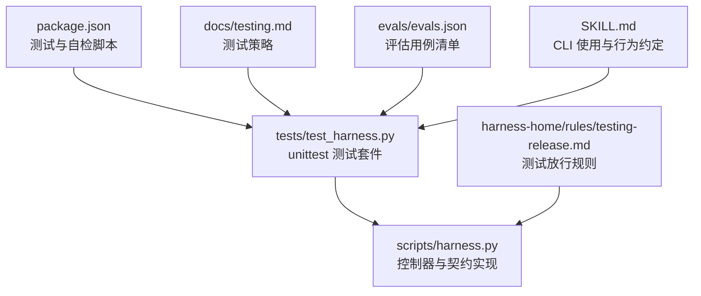
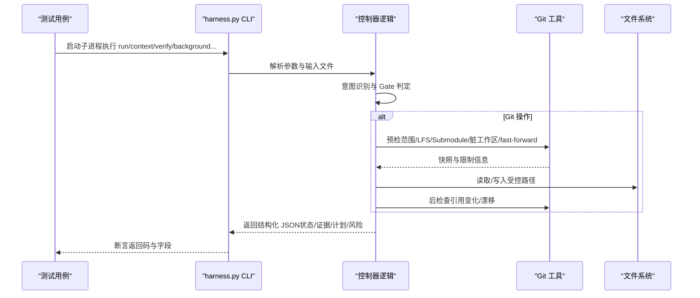
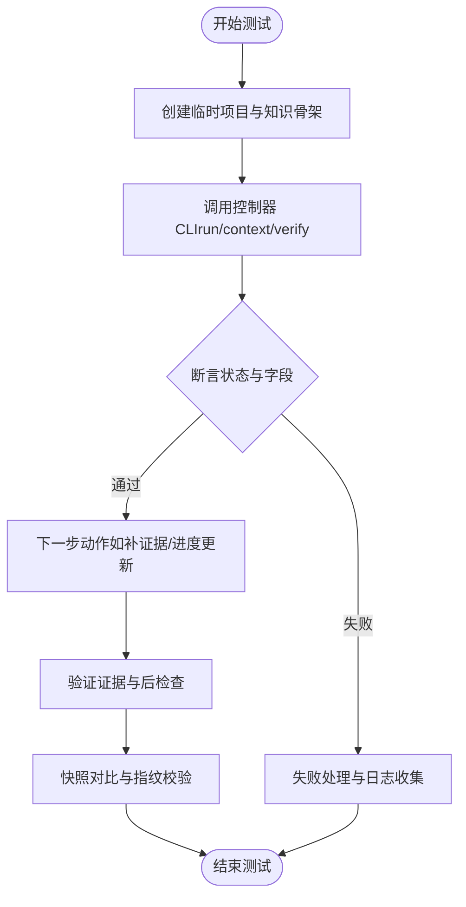
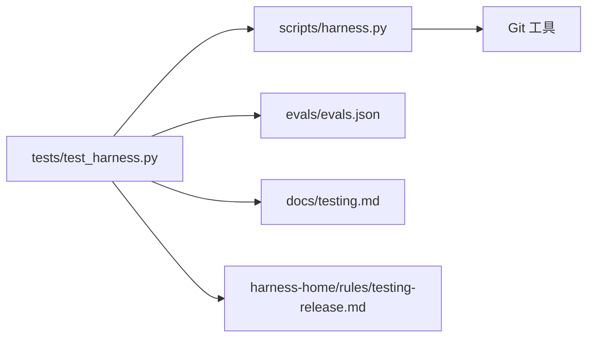

# 扩展测试与调试

<cite>
**本文引用的文件**   
- [tests/test_harness.py](file://tests/test_harness.py)
- [scripts/harness.py](file://scripts/harness.py)
- [package.json](file://package.json)
- [docs/testing.md](file://docs/testing.md)
- [harness-home/rules/testing-release.md](file://harness-home/rules/testing-release.md)
- [evals/evals.json](file://evals/evals.json)
- [SKILL.md](file://SKILL.md)
</cite>

## 目录
1. [简介](#简介)
2. [项目结构](#项目结构)
3. [核心组件](#核心组件)
4. [架构总览](#架构总览)
5. [详细组件分析](#详细组件分析)
6. [依赖关系分析](#依赖关系分析)
7. [性能考量](#性能考量)
8. [故障排查指南](#故障排查指南)
9. [结论](#结论)
10. [附录](#附录)

## 简介
本指南面向希望扩展 Docs Harness 的测试与调试能力的工程师，覆盖单元测试、集成测试、端到端流程、性能基准、调试技巧、测试数据管理与隔离、常见问题诊断、最佳实践与质量保证流程，以及自动化测试与持续集成的配置方法。文档基于仓库现有实现与测试用例进行系统化总结，确保读者能够安全、高效地扩展测试套件并建立可靠的发布前质量门禁。

## 项目结构
仓库采用“控制器脚本 + Python 单元测试 + 规则与评估”的结构：
- scripts/harness.py：Docs Harness 独立控制器，定义任务生命周期、Gate 校验、Git 预检/后检查、证据收据、后台 Job 等核心逻辑。
- tests/test_harness.py：基于 unittest 的完整回归测试，覆盖安装、知识引导、任务准入、Git 操作、证据与验证、后台 Job、迁移与幂等性、遥测与隐私等。
- package.json：npm 脚本入口，统一运行测试、自检与打包检查。
- docs/testing.md：测试策略与验收分层说明。
- harness-home/rules/testing-release.md：测试放行规则（Gate 与证据类型约束）。
- evals/evals.json：评估用例清单，用于特性级断言与回归基线。
- SKILL.md：技能使用说明，包含 CLI 命令与关键行为约定。

**图表来源** 
- [package.json:17-21](file://package.json#L17-L21)
- [tests/test_harness.py:17-24](file://tests/test_harness.py#L17-L24)
- [scripts/harness.py:26-55](file://scripts/harness.py#L26-L55)
- [docs/testing.md:1-25](file://docs/testing.md#L1-L25)
- [harness-home/rules/testing-release.md:1-29](file://harness-home/rules/testing-release.md#L1-L29)
- [evals/evals.json:1-175](file://evals/evals.json#L1-L175)
- [SKILL.md:1-106](file://SKILL.md#L1-L106)

**章节来源**
- [package.json:17-21](file://package.json#L17-L21)
- [docs/testing.md:1-25](file://docs/testing.md#L1-L25)

## 核心组件
- 控制器（scripts/harness.py）
  - 版本与 Schema 常量：任务包、事件、证据、冻结、授权、质量账本、知识库、后台 Job 等。
  - 意图与变更等级映射：query/audit/git_inspect/git_fetch/git_sync/modify/external_write 对应 read_only/git_metadata_write/workspace_write/external_write。
  - Gate 体系：产品、架构、安全、破坏性数据、发布外部、前端设计、诊断修复、测试验收、审查审计、代码编辑、文档编辑。
  - Git 预检与后检查：范围约束、LFS/Submodule 可用性、脏工作区检测、fast-forward 校验、引用快照与指纹。
  - 证据收据与验证：v2 收据格式、可信生产者、TTL、白名单 produces、自动归因、并发漂移处理。
  - 后台 Job：prepare/dispatched/running/progress/verify/retry，复杂路由与工件管理。
  - 错误模型：HarnessError 携带 code 与 exit_code，失败关闭策略贯穿各阶段。
- 测试套件（tests/test_harness.py）
  - 基于 unittest.TestCase，提供临时项目环境、子进程调用控制器、JSON 载荷断言、快照树对比、背景目标工件准备、Git 远端模拟、证据与质量评审构造、任务完成闭环等。
  - 大量 mock.patch.object 对控制器内部函数进行替换，以模拟 LFS/Submodule 不可用、远程漂移、只读查询、混合意图等场景。
  - 覆盖 v1/v2 迁移、遥测边界、隐私脱敏、幂等复用、上下文缓存、内容集指纹、证据绑定与过期、未归因漂移与高风险漂移阻断等。
- 测试策略与规则（docs/testing.md, harness-home/rules/testing-release.md）
  - 分层验收：源码层、临时项目层、后台控制面专项、工作量专项、文档路由专项、安装升级专项、下游层。
  - 测试放行规则：静态检查、源码测试、运行时验证、产物验证、真实产品验收；失败关闭与证据闭合要求。
- 评估用例（evals/evals.json）
  - 用例 ID 与期望关键字集合，用于特性级回归与行为一致性校验。

**章节来源**
- [scripts/harness.py:26-55](file://scripts/harness.py#L26-L55)
- [scripts/harness.py:200-233](file://scripts/harness.py#L200-L233)
- [scripts/harness.py:263-345](file://scripts/harness.py#L263-L345)
- [scripts/harness.py:680-794](file://scripts/harness.py#L680-L794)
- [scripts/harness.py:395-400](file://scripts/harness.py#L395-L400)
- [tests/test_harness.py:47-88](file://tests/test_harness.py#L47-L88)
- [tests/test_harness.py:748-756](file://tests/test_harness.py#L748-L756)
- [docs/testing.md:1-25](file://docs/testing.md#L1-L25)
- [harness-home/rules/testing-release.md:1-29](file://harness-home/rules/testing-release.md#L1-L29)
- [evals/evals.json:1-175](file://evals/evals.json#L1-L175)

## 架构总览
Docs Harness 的任务执行与控制流由控制器驱动，测试通过子进程调用 CLI，并以 JSON 输出进行断言。Git 操作受严格预检与后检查约束，证据收据作为可复用的验收凭证，后台 Job 支持异步治理与目标推进。

**图表来源** 
- [tests/test_harness.py:59-87](file://tests/test_harness.py#L59-L87)
- [scripts/harness.py:680-794](file://scripts/harness.py#L680-L794)
- [scripts/harness.py:200-233](file://scripts/harness.py#L200-L233)

## 详细组件分析

### 单元测试编写与扩展
- 环境搭建
  - 使用 tempfile.TemporaryDirectory 创建隔离项目根，避免污染宿主环境。
  - 通过 subprocess.run 调用控制器，设置 --json 输出，捕获 stdout/stderr 并解析为字典。
  - 提供 init_project/bootstrap_knowledge/write_json/snapshot_tree 等辅助方法，快速构建最小可行项目与知识骨架。
- 测试数据准备
  - 证据收据：构造符合 v2 格式的 evidence-receipt，指定 covers、changed_paths、read_set、producer、ttl 等。
  - 质量评审：构造 quality-review JSON，记录经验与教训。
  - Git 远端：初始化裸仓库、推送分支、模拟远端漂移与冲突。
- 断言验证
  - 返回码与状态：expected 参数控制预期退出码，断言 admission_status/mutation_profile/evidence_types/control_status 等。
  - 快照对比：snapshot_tree 生成文件树哈希，比较安装前后或同步前后的差异。
  - 事件与收据：读取 events.jsonl 与 context-receipts.jsonl，校验阶段流转与缓存命中。
- 常见模式
  - mock.patch.object 替换 git_command 或其他内部函数，模拟不可用或异常路径。
  - complete_code_task/evidence/quality_review 封装典型任务完成与证据提交流程。
  - force_complex_background_job 构造复杂后台 Job 的工作包与合同。

**图表来源** 
- [tests/test_harness.py:50-87](file://tests/test_harness.py#L50-L87)
- [tests/test_harness.py:108-163](file://tests/test_harness.py#L108-L163)
- [tests/test_harness.py:248-304](file://tests/test_harness.py#L248-L304)
- [tests/test_harness.py:324-337](file://tests/test_harness.py#L324-L337)

**章节来源**
- [tests/test_harness.py:47-87](file://tests/test_harness.py#L47-L87)
- [tests/test_harness.py:108-163](file://tests/test_harness.py#L108-L163)
- [tests/test_harness.py:248-304](file://tests/test_harness.py#L248-L304)
- [tests/test_harness.py:324-337](file://tests/test_harness.py#L324-L337)

### 集成测试策略
- 组件间交互测试
  - 控制器与 Git：通过 git_preflight_contract/git_postcheck 验证范围、LFS/Submodule、脏工作区、fast-forward、引用快照。
  - 控制器与文件系统：原子写入、快照指纹、volatile 后缀过滤、读写集合与并发漂移。
  - 控制器与证据系统：v2 收据绑定、可信生产者、TTL、白名单 produces、未归因漂移与高风险漂移阻断。
- 端到端流程测试
  - 安装与升级：project init/upgrade 的幂等性与 preserve-and-merge。
  - 任务生命周期：run → context → verify 的完整闭环，包括计划、证据补充、增量准入。
  - 后台 Job：prepare → dispatched → running → progress → verify 的全链路，含重试与工件损坏修复。
- 性能基准测试
  - 通过 evals/evals.json 的用例 ID 与期望关键字，建立回归基线；结合事件 duration_ms 与上下文加载次数进行性能观测。
  - 在测试中注入大文件或复杂 Git 历史，观察预检/后检查耗时与内存占用。

**章节来源**
- [scripts/harness.py:680-794](file://scripts/harness.py#L680-L794)
- [scripts/harness.py:1149](file://scripts/harness.py#L1149)
- [evals/evals.json:1-175](file://evals/evals.json#L1-L175)
- [docs/testing.md:10-18](file://docs/testing.md#L10-L18)

### 调试技巧与工具使用
- 日志分析
  - 控制器输出 JSON 包含 reason_code、blockers、evidence_types、control_status 等字段，便于定位问题。
  - events.jsonl 记录阶段流转、时长、证据轮次、上下文加载次数等，适合时序分析与性能剖析。
- 断点调试
  - 在测试中使用 mock.patch.object 替换关键函数，打印中间状态或抛出异常，快速验证分支路径。
  - 通过 expected 参数控制子进程退出码，配合 stderr 输出定位失败原因。
- 性能剖析
  - 利用 evals 用例中的期望关键字与事件字段，统计 phase-duration、context_load_count、evidence_round_count 等指标。
  - 针对 Git 操作与文件扫描，增加超时与阈值断言，防止慢路径影响整体吞吐。

**章节来源**
- [tests/test_harness.py:748-756](file://tests/test_harness.py#L748-L756)
- [scripts/harness.py:1239](file://scripts/harness.py#L1239)
- [evals/evals.json:38-40](file://evals/evals.json#L38-L40)

### 测试数据管理与隔离策略
- 隔离原则
  - 每个测试使用独立的临时目录，避免共享状态；Git 远端也使用临时裸仓库。
  - 控制器运行时文件（task-package.json、events.jsonl、evidence-index.json 等）位于 .docs-harness 或 runs 目录，测试结束后自动清理。
- 数据构造
  - bootstrap_knowledge 生成最小知识骨架与 knowledge-map.json。
  - write_json/evidence/quality_review 构造结构化输入与证据收据。
  - snapshot_tree 生成文件树快照，用于安装前后或同步前后对比。
- 幂等与回滚
  - project init/upgrade 幂等复用活动任务；v1/v2 迁移需显式 apply，失败时回滚 journal。
  - 后台 Job 重试归档旧 attempt，不继承完成进度，保证可恢复性。

**章节来源**
- [tests/test_harness.py:50-57](file://tests/test_harness.py#L50-L57)
- [tests/test_harness.py:108-163](file://tests/test_harness.py#L108-L163)
- [tests/test_harness.py:197-222](file://tests/test_harness.py#L197-L222)
- [tests/test_harness.py:1052-1100](file://tests/test_harness.py#L1052-L1100)

### 常见问题诊断与解决方案
- 缺少 rules_root 或规则缺失
  - 现象：project check 失败，reason_code=missing_harness_home。
  - 解决：确保 .docs-harness/harness-home/rules 存在且包含 active 规则。
- Git 预检失败（LFS/Submodule 不可用、脏工作区、非 fast-forward）
  - 现象：admission_status=blocked，blockers 包含具体原因。
  - 解决：安装 LFS/Submodule、清理工作区、合并或 rebase 分支。
- 证据过期或绑定不匹配
  - 现象：verify 返回 evidence_expired 或 evidence_binding_mismatch。
  - 解决：重新生成证据，确保 covers、producer、TTL 正确。
- 未归因漂移与高风险漂移
  - 现象：workspace_attribution.unattributed_drift 或 high_risk_drift 阻断。
  - 解决：补充证据或调整 write_scope，避免敏感路径变更。
- v1/v2 迁移失败
  - 现象：legacy_task_requires_migration 或 migration_interrupted。
  - 解决：执行 task migrate --apply，检查 journal 回滚状态。

**章节来源**
- [tests/test_harness.py:356-375](file://tests/test_harness.py#L356-L375)
- [tests/test_harness.py:736-756](file://tests/test_harness.py#L736-L756)
- [tests/test_harness.py:984-1050](file://tests/test_harness.py#L984-L1050)
- [tests/test_harness.py:808-875](file://tests/test_harness.py#L808-L875)
- [tests/test_harness.py:1052-1100](file://tests/test_harness.py#L1052-L1100)

## 依赖关系分析
- 测试套件依赖控制器模块
  - tests/test_harness.py 通过 importlib.util.spec_from_file_location 动态加载 scripts/harness.py，直接访问 VERSION、git_command、file_fingerprint、utc_now 等符号。
- 控制器依赖 Git 工具与环境
  - 通过 subprocess 调用 git 命令，依赖 Git 客户端、LFS、Submodule 可用。
- 测试与评估数据
  - evals/evals.json 提供用例期望，docs/testing.md 提供策略指导，harness-home/rules/testing-release.md 提供 Gate 与证据约束。

**图表来源** 
- [tests/test_harness.py:17-24](file://tests/test_harness.py#L17-L24)
- [scripts/harness.py:575-586](file://scripts/harness.py#L575-L586)
- [evals/evals.json:1-175](file://evals/evals.json#L1-L175)
- [docs/testing.md:1-25](file://docs/testing.md#L1-L25)
- [harness-home/rules/testing-release.md:1-29](file://harness-home/rules/testing-release.md#L1-L29)

**章节来源**
- [tests/test_harness.py:17-24](file://tests/test_harness.py#L17-L24)
- [scripts/harness.py:575-586](file://scripts/harness.py#L575-L586)

## 性能考量
- 事件与遥测
  - events.jsonl 记录 phase、duration_ms、context_load_count、evidence_round_count 等，可用于性能基线与瓶颈定位。
- Git 操作优化
  - 预检阶段批量获取 refs、diff、status，减少多次子进程调用；对大仓使用 change_scoped 增量扫描。
- 文件扫描与快照
  - workspace_snapshot 与 file_fingerprint 使用分块读取与哈希，避免大文件阻塞；volatile 后缀过滤减少无关文件。
- 上下文缓存
  - context_cache_hit 表明内容集已缓存，重复 context 调用应命中缓存，降低 I/O 与解析开销。

**章节来源**
- [tests/test_harness.py:1122-1163](file://tests/test_harness.py#L1122-L1163)
- [scripts/harness.py:1149](file://scripts/harness.py#L1149)
- [scripts/harness.py:1239](file://scripts/harness.py#L1239)

## 故障排查指南
- 快速定位
  - 查看控制器返回的 reason_code、blockers、evidence_types、control_status。
  - 读取 events.jsonl 与 context-receipts.jsonl，确认阶段流转与缓存命中。
- 常见错误
  - missing_harness_home：rules_root 缺失或规则不完整。
  - git_preflight_failed：Git 命令失败或 LFS/Submodule 不可用。
  - evidence_expired：证据 TTL 过期。
  - unattributed_drift_overlap：未归因写入与 write_scope 重叠。
- 修复步骤
  - 安装/修复缺失依赖（Git LFS/Submodule）。
  - 清理工作区或合并分支，确保 fast-forward。
  - 重新生成证据，确保 covers、producer、TTL 正确。
  - 补充证据或调整 write_scope，避免敏感路径变更。

**章节来源**
- [tests/test_harness.py:356-375](file://tests/test_harness.py#L356-L375)
- [tests/test_harness.py:736-756](file://tests/test_harness.py#L736-L756)
- [tests/test_harness.py:984-1050](file://tests/test_harness.py#L984-L1050)
- [tests/test_harness.py:808-875](file://tests/test_harness.py#L808-L875)

## 结论
通过系统化扩展单元测试与集成测试，结合严格的 Git 预检/后检查、证据收据与 Gate 机制，Docs Harness 能够在复杂协作环境中提供高可靠的任务控制与验收能力。遵循本指南的实践，可以显著提升测试覆盖率、缩短问题定位时间、保障发布质量，并为持续集成与自动化流水线奠定坚实基础。

## 附录
- 自动化测试与持续集成
  - 使用 npm test 运行 unittest 发现测试，npm run self-test 执行控制器自检，npm run pack:check 检查打包清单。
  - 在 CI 中安装 Git LFS/Submodule，初始化临时远端仓库，执行完整回归与评估用例。
  - 收集 events.jsonl 与 JSON 输出，生成报告与告警。

**章节来源**
- [package.json:17-21](file://package.json#L17-L21)
- [docs/testing.md:1-8](file://docs/testing.md#L1-L8)
- [SKILL.md:1-106](file://SKILL.md#L1-L106)