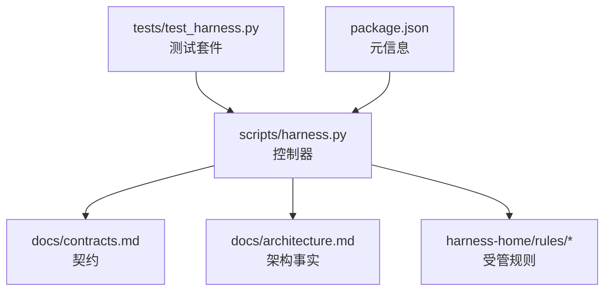
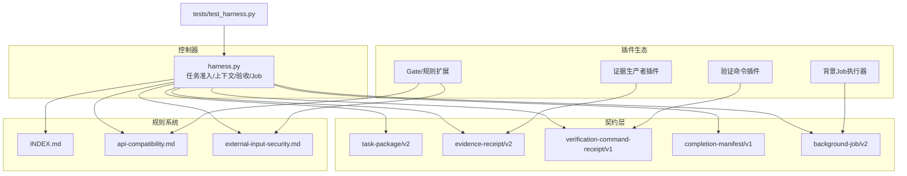
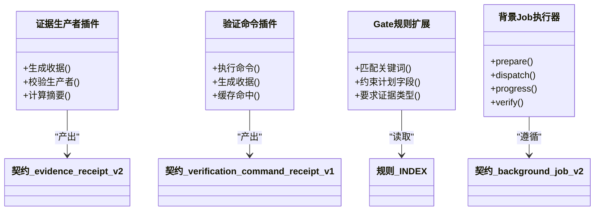
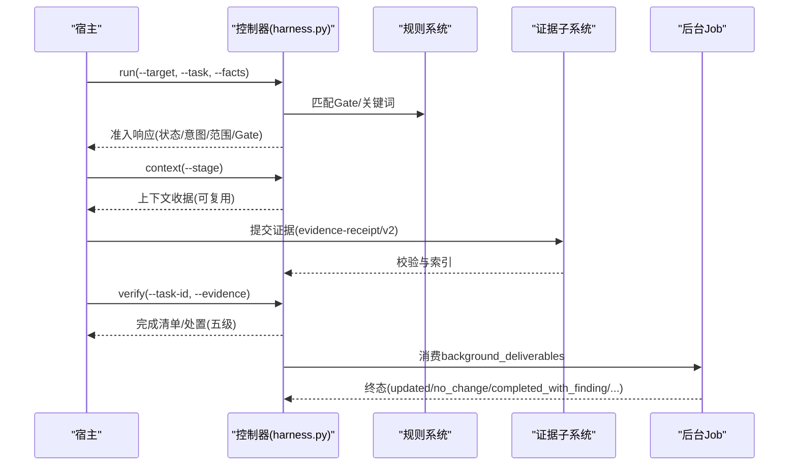
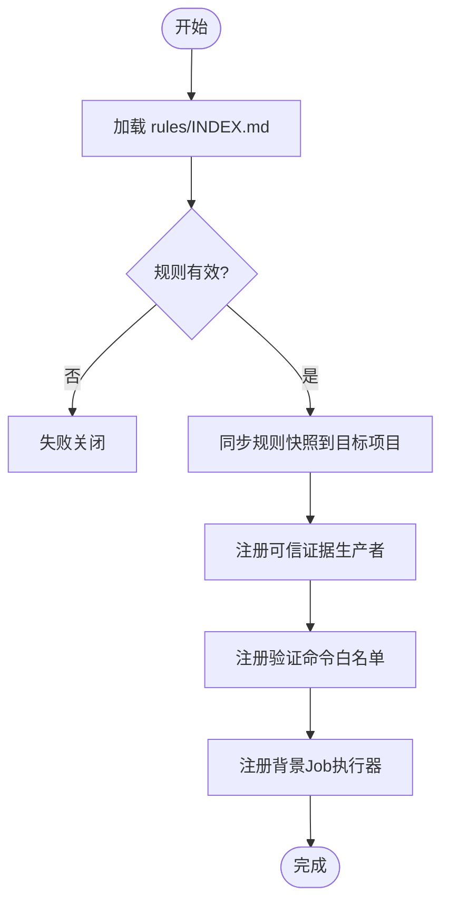
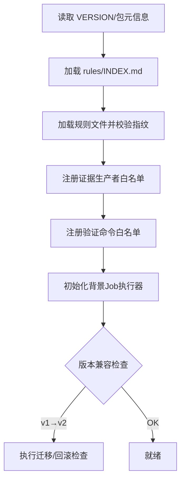
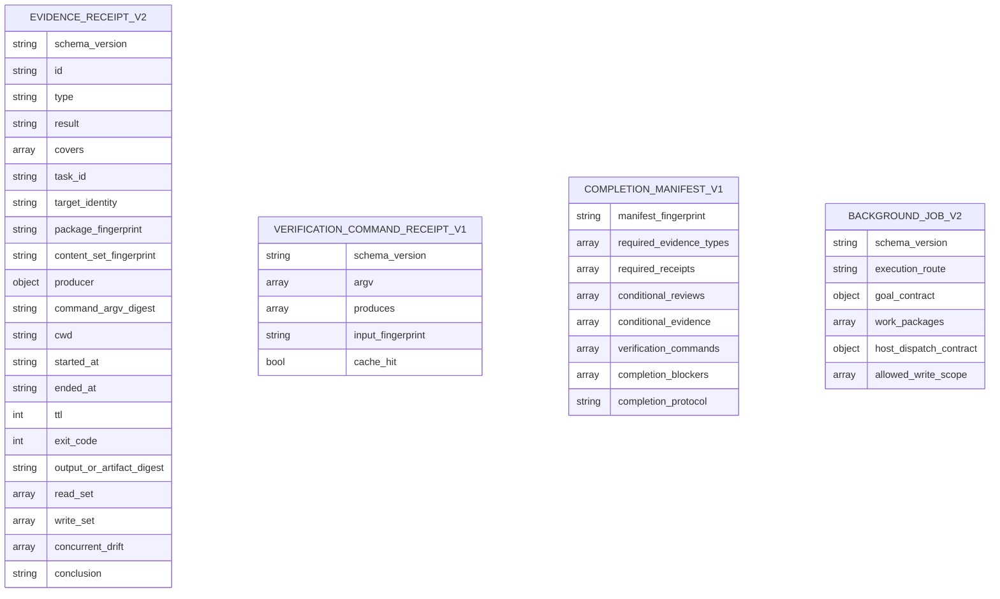
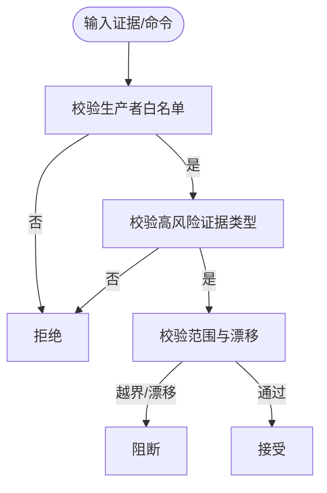
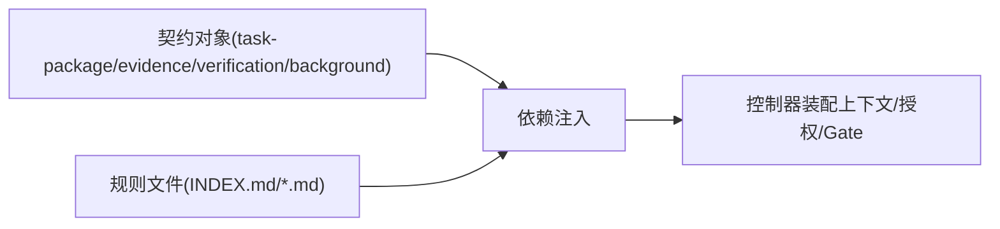
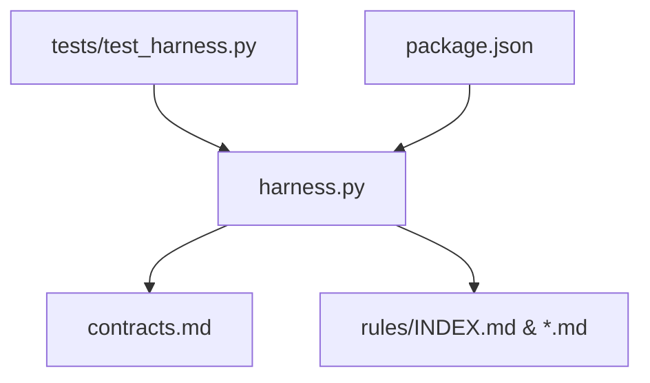

# 插件架构设计

<cite>
**本文引用的文件**   
- [scripts/harness.py](file://scripts/harness.py)
- [docs/contracts.md](file://docs/contracts.md)
- [docs/architecture.md](file://docs/architecture.md)
- [harness-home/rules/INDEX.md](file://harness-home/rules/INDEX.md)
- [harness-home/rules/api-compatibility.md](file://harness-home/rules/api-compatibility.md)
- [harness-home/rules/external-input-security.md](file://harness-home/rules/external-input-security.md)
- [tests/test_harness.py](file://tests/test_harness.py)
- [package.json](file://package.json)
</cite>

## 目录
1. [引言](#引言)
2. [项目结构](#项目结构)
3. [核心组件](#核心组件)
4. [架构总览](#架构总览)
5. [详细组件分析](#详细组件分析)
6. [依赖关系分析](#依赖关系分析)
7. [性能考量](#性能考量)
8. [故障排查指南](#故障排查指南)
9. [结论](#结论)
10. [附录](#附录)

## 引言
本文件面向“Docs Harness”的插件化扩展需求，基于仓库现有控制器与契约文档，提炼出可落地的插件架构设计方案。该方案以“契约优先、证据可复用、失败关闭”为核心原则，围绕插件接口规范、生命周期管理、依赖注入机制、注册与发现、加载顺序、版本兼容、通信协议与安全模型展开，并提供扩展点与最佳实践，帮助开发者设计与实现高质量的插件。

## 项目结构
- scripts/harness.py：控制器源码真源，负责任务准入、上下文、验收、知识生命周期、后台 Job 状态机与 Git 交付检查等。
- docs/contracts.md：对外行为与数据契约（任务包、证据收据、Git 状态、完成清单、退出码等）。
- docs/architecture.md：架构事实与边界说明（Runtime、锁、治理 Job、升级策略等）。
- harness-home/rules/*：受管规则快照与索引，用于 Gate 匹配、计划字段约束与证据类型要求。
- tests/test_harness.py：覆盖关键流程与契约断言，验证安装、迁移、Git 预检/后检、证据与验收等。
- package.json：元信息与脚本入口，定义版本与自检命令。

**图表来源** 
- [scripts/harness.py:1-100](file://scripts/harness.py#L1-L100)
- [docs/contracts.md:1-120](file://docs/contracts.md#L1-L120)
- [docs/architecture.md:1-26](file://docs/architecture.md#L1-L26)
- [harness-home/rules/INDEX.md:1-41](file://harness-home/rules/INDEX.md#L1-L41)
- [tests/test_harness.py:1-120](file://tests/test_harness.py#L1-L120)
- [package.json:1-23](file://package.json#L1-L23)

**章节来源**
- [docs/architecture.md:1-26](file://docs/architecture.md#L1-L26)
- [package.json:1-23](file://package.json#L1-L23)

## 核心组件
- 控制器与运行时：统一的任务编排、准入判定、上下文装配、证据校验、验收与后台 Job 状态机。
- 契约层：task-package/v2、evidence-receipt/v2、verification-command-receipt/v1、completion-manifest/v1、background-job/v2 等。
- 规则系统：Gate 定义、关键词匹配、计划字段约束、证据类型要求与失败模式。
- 安全与信任：可信生产者白名单、高风险证据类型、底线 Gate 强制兜底、范围与漂移阻断。
- 测试与自检：覆盖安装、迁移、Git 预检/后检、证据与验收、规则激活与指纹一致性。

**章节来源**
- [scripts/harness.py:240-439](file://scripts/harness.py#L240-L439)
- [docs/contracts.md:1-370](file://docs/contracts.md#L1-L370)
- [harness-home/rules/INDEX.md:1-41](file://harness-home/rules/INDEX.md#L1-L41)

## 架构总览
下图展示控制器、契约、规则与测试之间的交互关系，以及插件在其中的接入位置。

**图表来源** 
- [scripts/harness.py:1-120](file://scripts/harness.py#L1-L120)
- [docs/contracts.md:1-200](file://docs/contracts.md#L1-L200)
- [harness-home/rules/INDEX.md:1-41](file://harness-home/rules/INDEX.md#L1-L41)
- [tests/test_harness.py:1-120](file://tests/test_harness.py#L1-L120)

## 详细组件分析

### 插件接口规范
- 证据生产者插件
  - 输出符合 evidence-receipt/v2 的收据；必须包含 task_id、target_identity、package_fingerprint、producer(adapter,capability)、时间戳、TTL、exit_code、digests、read_set/write_set 等。
  - 生产者需位于可信白名单 TRUSTED_EVIDENCE_PRODUCERS；否则拒绝。
  - 高风险证据类型需来自可信 v2 生产者。
- 验证命令插件
  - 通过 verification-command-receipt/v1 逐项收据绑定 argv、produces 与输入指纹；支持缓存命中与增量重跑。
- Gate/规则扩展
  - 通过规则文件声明 rule_id、content_fingerprint、gates、keywords、plan_fields、evidence_types、failure_mode；控制器按 Gate 或关键词匹配并约束计划字段与证据类型。
- 背景 Job 执行器
  - 遵循 background-job/v2；控制面由 CLI 写入，业务数据面仅允许 allowed_write_scope；复杂路线需 prepare→dispatched→running→progress→verify 序列。

**图表来源** 
- [scripts/harness.py:5180-5228](file://scripts/harness.py#L5180-L5228)
- [docs/contracts.md:165-221](file://docs/contracts.md#L165-L221)
- [harness-home/rules/INDEX.md:1-41](file://harness-home/rules/INDEX.md#L1-L41)

**章节来源**
- [docs/contracts.md:165-221](file://docs/contracts.md#L165-L221)
- [scripts/harness.py:5180-5228](file://scripts/harness.py#L5180-L5228)
- [harness-home/rules/api-compatibility.md:1-29](file://harness-home/rules/api-compatibility.md#L1-L29)
- [harness-home/rules/external-input-security.md:1-29](file://harness-home/rules/external-input-security.md#L1-L29)

### 生命周期管理与准入流程
- 任务准入：run 编译意图、候选意图与延迟意图，确定 mutation_profile 与风险 Gate；幂等复用活动任务；blocked/needs_plan/needs_authorization/ready_* 状态流转。
- 上下文装配：context-receipt/v2 跨阶段复用，按 compiler_contract 与内容集合指纹决定重载。
- 证据收集与验收：evidence-receipt/v2 校验与索引；verification-command-receipt/v1 缓存命中；完成清单 completion-manifest/v1 固定验收项。
- 后台 Job：contract_ready→prepare→dispatched→running→progress→verify→终态；能力不足时 queued_manual，不静默降级。

**图表来源** 
- [docs/contracts.md:1-164](file://docs/contracts.md#L1-L164)
- [docs/contracts.md:165-221](file://docs/contracts.md#L165-L221)
- [docs/contracts.md:303-349](file://docs/contracts.md#L303-L349)

**章节来源**
- [docs/contracts.md:1-164](file://docs/contracts.md#L1-L164)
- [docs/contracts.md:303-349](file://docs/contracts.md#L303-L349)

### 插件注册与发现机制
- 规则注册与发现
  - 通过 harness-home/rules/INDEX.md 声明 active_rules；每个规则文件需 status: active、唯一 rule_id、content_fingerprint 与完整合同字段。
  - 控制器在安装/升级时将固定快照同步到目标项目的 .docs-harness/harness-home/rules/，缺失或指纹漂移失败关闭。
- 证据生产者注册
  - 通过 TRUSTED_EVIDENCE_PRODUCERS 白名单进行注册；未列入的生产者被拒绝。
- 验证命令插件注册
  - 通过 verification-command-receipt/v1 的 produces 白名单与 argv 绑定；缓存命中避免重复执行。
- 背景 Job 插件注册
  - 通过 background-job/v2 的 execution_route 与工作包冻结 Plan/Progress；控制面只允许 CLI 写入。

**图表来源** 
- [harness-home/rules/INDEX.md:1-41](file://harness-home/rules/INDEX.md#L1-L41)
- [scripts/harness.py:240-249](file://scripts/harness.py#L240-L249)
- [docs/contracts.md:190-221](file://docs/contracts.md#L190-L221)
- [docs/contracts.md:303-349](file://docs/contracts.md#L303-L349)

**章节来源**
- [harness-home/rules/INDEX.md:1-41](file://harness-home/rules/INDEX.md#L1-L41)
- [scripts/harness.py:240-249](file://scripts/harness.py#L240-L249)
- [docs/contracts.md:190-221](file://docs/contracts.md#L190-L221)

### 加载顺序与版本兼容性
- 加载顺序
  - 先加载 INDEX.md 中的 active_rules；再加载各规则文件；随后注册证据生产者与验证命令；最后初始化背景 Job 执行器。
- 版本兼容性
  - 控制器版本与 package.json、SKILL.md frontmatter、VERSION 常量一致；v1→v2 迁移提供显式迁移命令与回滚窗口；旧对象保持只读，新控制器遇到 v2 对象失败关闭。
  - 证据收据与验证命令收据均向后兼容；background-job/v1 只读兼容并在升级中幂等迁移。

**图表来源** 
- [package.json:1-23](file://package.json#L1-L23)
- [docs/contracts.md:236-282](file://docs/contracts.md#L236-L282)
- [docs/contracts.md:303-349](file://docs/contracts.md#L303-L349)

**章节来源**
- [docs/contracts.md:236-282](file://docs/contracts.md#L236-L282)
- [package.json:1-23](file://package.json#L1-L23)

### 插件间通信协议与数据交换格式
- 证据收据：evidence-receipt/v2，包含任务绑定、生产者、时间戳、TTL、exit_code、digests、read_set/write_set、concurrent_drift、conclusion 等。
- 验证命令收据：verification-command-receipt/v1，绑定 argv、produces 与输入指纹，支持缓存命中。
- 完成清单：completion-manifest/v1，固定 required_evidence_types、required_receipts、conditional_reviews/evidence、verification_commands、completion_blockers、completion_protocol。
- 背景 Job：background-job/v2，execution_route、goal_contract、work_packages、host_dispatch_contract、allowed_write_scope 等。

**图表来源** 
- [docs/contracts.md:165-221](file://docs/contracts.md#L165-L221)
- [docs/contracts.md:63-95](file://docs/contracts.md#L63-L95)
- [docs/contracts.md:303-349](file://docs/contracts.md#L303-L349)

**章节来源**
- [docs/contracts.md:165-221](file://docs/contracts.md#L165-L221)
- [docs/contracts.md:63-95](file://docs/contracts.md#L63-L95)
- [docs/contracts.md:303-349](file://docs/contracts.md#L303-L349)

### 安全模型与权限控制
- 可信生产者白名单：TRUSTED_EVIDENCE_PRODUCERS；未列入的生产者拒绝。
- 高风险证据类型：security_acceptance、external_state、recovery_acceptance、remote_delivery、fresh_clone_verification、release_acceptance 必须来自可信 v2 生产者。
- 底线 Gate：security-sensitive、destructive-data、release-external 由控制器强制兜底，宿主只能加不能减；文本触发使用精确词表与否定守卫。
- 范围与漂移阻断：write_scope 越界、read_set 漂移、concurrent/unattributed 重叠、高风险路径变更均失败关闭。
- 验证命令白名单：produces 仅允许白名单类型；临时副产物容忍列表与配置开关。

**图表来源** 
- [scripts/harness.py:240-249](file://scripts/harness.py#L240-L249)
- [scripts/harness.py:5180-5228](file://scripts/harness.py#L5180-L5228)
- [docs/contracts.md:134-164](file://docs/contracts.md#L134-L164)
- [docs/contracts.md:190-221](file://docs/contracts.md#L190-L221)

**章节来源**
- [scripts/harness.py:240-249](file://scripts/harness.py#L240-L249)
- [scripts/harness.py:5180-5228](file://scripts/harness.py#L5180-L5228)
- [docs/contracts.md:134-164](file://docs/contracts.md#L134-L164)
- [docs/contracts.md:190-221](file://docs/contracts.md#L190-L221)

### 依赖注入机制与扩展点
- 依赖注入
  - 通过契约对象注入：task-package/v2、evidence-receipt/v2、verification-command-receipt/v1、background-job/v2；控制器按契约解析并装配上下文与授权。
  - 规则与 Gate 通过规则文件注入；控制器按关键词与路径推断 Gate，结合宿主 gate_assessment 权威语义判断。
- 扩展点
  - 证据生产者：新增 adapter/capability 组合进入白名单。
  - 验证命令：新增 produces 类型与 argv 模板。
  - 规则扩展：新增规则文件并更新 INDEX.md。
  - 背景 Job：新增 execution_route 与工作包模板。

**图表来源** 
- [docs/contracts.md:1-164](file://docs/contracts.md#L1-L164)
- [harness-home/rules/INDEX.md:1-41](file://harness-home/rules/INDEX.md#L1-L41)

**章节来源**
- [docs/contracts.md:1-164](file://docs/contracts.md#L1-L164)
- [harness-home/rules/INDEX.md:1-41](file://harness-home/rules/INDEX.md#L1-L41)

## 依赖关系分析
- 控制器对契约与规则的强依赖；测试对控制器的行为断言；包元信息对版本一致性约束。
- 插件通过契约与规则间接耦合控制器，降低直接依赖。

**图表来源** 
- [scripts/harness.py:1-120](file://scripts/harness.py#L1-L120)
- [docs/contracts.md:1-120](file://docs/contracts.md#L1-L120)
- [harness-home/rules/INDEX.md:1-41](file://harness-home/rules/INDEX.md#L1-L41)
- [tests/test_harness.py:1-120](file://tests/test_harness.py#L1-L120)
- [package.json:1-23](file://package.json#L1-L23)

**章节来源**
- [scripts/harness.py:1-120](file://scripts/harness.py#L1-L120)
- [docs/contracts.md:1-120](file://docs/contracts.md#L1-L120)
- [harness-home/rules/INDEX.md:1-41](file://harness-home/rules/INDEX.md#L1-L41)
- [tests/test_harness.py:1-120](file://tests/test_harness.py#L1-L120)
- [package.json:1-23](file://package.json#L1-L23)

## 性能考量
- 证据与验证命令收据缓存命中减少重复执行；workspace_snapshot 与 freeze.json 基线复用避免重复计算。
- Git 预检/后检限制 LFS/Submodule 可用性检查与删除阈值，防止大规模操作阻塞。
- 规则与契约指纹校验确保快速失败与一致性。

[本节为通用指导，无需特定文件引用]

## 故障排查指南
- 常见错误码与处置
  - 输入/合同/绑定无效：退出码 2；检查 JSON 类型、文件大小、UTF-8 编码。
  - 需要方案/授权/证据/迁移/用户输入/Git 交付：退出码 3；按提示补齐。
  - 范围/漂移/Gate/远端/授权/规则变化：退出码 4；重新准入。
- 证据问题
  - 生产者不可信：检查 TRUSTED_EVIDENCE_PRODUCERS；高风险证据类型需可信 v2 生产者。
  - 收据过期/摘要无效/exit_code 非零：修正 TTL、digests、执行结果。
- Git 问题
  - 远端漂移/非 fast-forward/脏工作区/LFS/Submodule 不可用：按 preflight/postcheck 提示修复。
- 规则问题
  - 规则缺失/指纹漂移/无效：恢复快照或人工 preserve-and-merge。

**章节来源**
- [docs/contracts.md:359-370](file://docs/contracts.md#L359-L370)
- [scripts/harness.py:5180-5228](file://scripts/harness.py#L5180-L5228)
- [tests/test_harness.py:339-376](file://tests/test_harness.py#L339-L376)

## 结论
本插件架构以契约为中心、规则为约束、证据为纽带，形成可扩展、可审计、可回滚的控制系统。通过可信生产者白名单、高风险证据类型、底线 Gate 与范围漂移阻断，确保安全与稳定。建议插件开发者严格遵循契约与规则，最小化副作用，最大化可复用性与可观测性。

[本节为总结，无需特定文件引用]

## 附录
- 最佳实践
  - 插件职责单一：证据生产、验证命令、规则扩展、背景 Job 各司其职。
  - 契约先行：先定义收据与指令，再实现插件逻辑。
  - 安全优先：遵循白名单与高风险类型，避免越界写入与漂移。
  - 可观测性：记录有界事件与原因码，便于审计与复算效率。
  - 版本兼容：遵循 v1→v2 迁移与回滚窗口，避免静默破坏。

[本节为通用指导，无需特定文件引用]