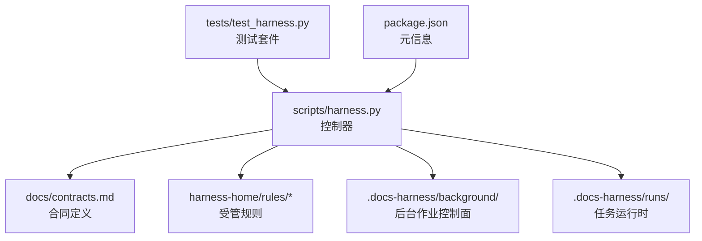
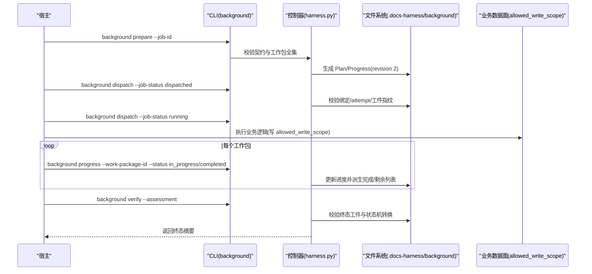
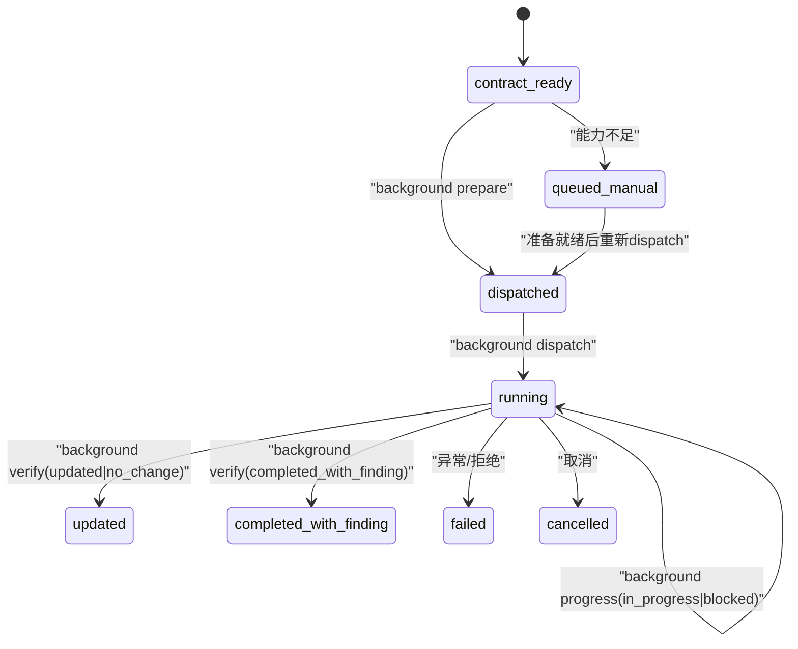
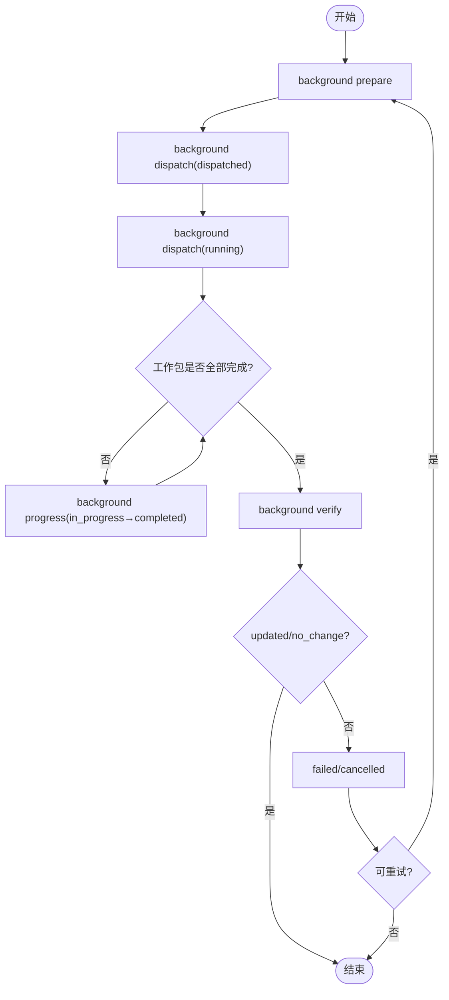
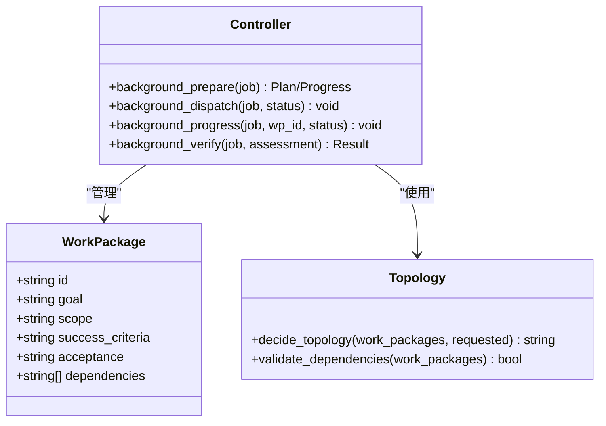
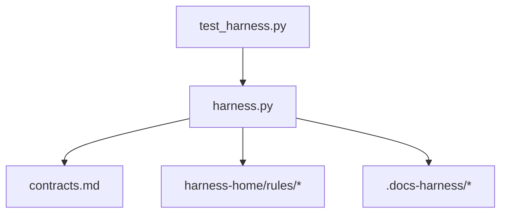

# 背景作业扩展

<cite>
**本文引用的文件**   
- [SKILL.md](file://SKILL.md)
- [package.json](file://package.json)
- [architecture.md](file://docs/architecture.md)
- [contracts.md](file://docs/contracts.md)
- [harness.py](file://scripts/harness.py)
- [test_harness.py](file://tests/test_harness.py)
</cite>

## 目录
1. [简介](#简介)
2. [项目结构](#项目结构)
3. [核心组件](#核心组件)
4. [架构总览](#架构总览)
5. [详细组件分析](#详细组件分析)
6. [依赖关系分析](#依赖关系分析)
7. [性能考虑](#性能考虑)
8. [故障排查指南](#故障排查指南)
9. [结论](#结论)
10. [附录](#附录)

## 简介
本指南面向“背景作业扩展”的开发与集成，聚焦以下目标：
- 作业类型的定义方法（继承、方法重写、状态机实现）
- 作业生命周期管理（初始化、执行、进度跟踪、错误处理、清理资源）
- 工作包的创建与调度机制（任务分解、依赖管理、并发控制）
- 作业状态同步与持久化策略
- 作业监控与调试工具使用方法
- 复杂作业场景示例（多阶段数据处理、分布式任务协调）
- 性能优化与故障恢复最佳实践

本仓库为独立技能控制器，负责任务准入、上下文、证据、验收与后台治理。后台作业通过 CLI 命令在受管 Runtime 内由控制器维护控制面工件，业务数据面仅写入声明范围。

**章节来源**
- [SKILL.md:1-106](file://SKILL.md#L1-L106)
- [architecture.md:1-26](file://docs/architecture.md#L1-L26)

## 项目结构
- scripts/harness.py：控制器源码真源，负责项目安装与升级、任务准入、上下文、验收、知识生命周期和后台 Job 状态机。
- harness-home/rules：发布包内的受管规则真源；project init/upgrade 将固定快照同步到目标项目的 .docs-harness/harness-home/rules。
- docs/contracts.md：对外行为与合同定义（任务包、证据、Git 状态、后台治理等）。
- package.json：版本与脚本入口。
- tests/test_harness.py：覆盖后台作业、Git 同步、证据与验收等关键路径的测试用例。

**图表来源**
- [architecture.md:1-26](file://docs/architecture.md#L1-L26)
- [harness.py:1-200](file://scripts/harness.py#L1-L200)

**章节来源**
- [architecture.md:1-26](file://docs/architecture.md#L1-L26)
- [package.json:1-23](file://package.json#L1-L23)

## 核心组件
- 任务包与编译态：v2 任务包、编译态、冻结快照、事件日志、证据索引、上下文与授权收据。
- 准入与路线：按意图与 Gate 决定 direct/planned/extended 路线；支持混合意图与延迟子句。
- Git 状态合同：fetch/sync 的预检与后检查，远端漂移与 ref 越界处理。
- 证据与验收：evidence-receipt/v2、验证命令缓存、自动归因、五级处置。
- 后台治理：background-job/v2，三种执行路线（direct/goal/goal_phased），prepare/dispatched/running/progress/verify/retry 标准序列。
- 质量账本与效率事件：只记录脱敏字段，禁止敏感输出。

**章节来源**
- [contracts.md:1-372](file://docs/contracts.md#L1-L372)
- [harness.py:1-200](file://scripts/harness.py#L1-L200)

## 架构总览
后台作业采用“控制面/数据面”分离：
- 控制面：job.json、plan.json、progress.json、events.jsonl、锁与索引，仅 CLI 写入。
- 数据面：allowed_write_scope 内的业务数据，不得包含 .git/**、.docs-harness/** 或 Runtime。

**图表来源**
- [contracts.md:305-342](file://docs/contracts.md#L305-L342)
- [harness.py:100-127](file://scripts/harness.py#L100-L127)

**章节来源**
- [contracts.md:305-342](file://docs/contracts.md#L305-L342)
- [harness.py:100-127](file://scripts/harness.py#L100-L127)

## 详细组件分析

### 作业类型定义与状态机
- 作业类型与路由：
  - background_direct：有界后台执行
  - background_goal：持久目标与正式方案
  - background_goal_phased：单一目标 Owner 分阶段推进
- 状态机：
  - 已知状态集合包含终态与非终态，重试态包括 needs_user_input、needs_rebase、queued_manual
  - 终态集合包含 updated、no_change、completed_with_finding、failed、cancelled
- 工作包拓扑：
  - 标准化 work_packages，校验 ID 唯一性、依赖存在性与环检测
  - 拓扑决策函数根据请求的工作包选择执行顺序

**图表来源**
- [harness.py:100-127](file://scripts/harness.py#L100-L127)
- [contracts.md:315-342](file://docs/contracts.md#L315-L342)

**章节来源**
- [harness.py:100-127](file://scripts/harness.py#L100-L127)
- [contracts.md:315-342](file://docs/contracts.md#L315-L342)

### 生命周期管理（初始化、执行、进度、错误、清理）
- 初始化：
  - background prepare：从冻结 goal_contract、work_packages、job_id、idempotency_key 与 attempt 确定性生成 revision 2 Plan/Progress，重复调用仅在内容、绑定与指纹完全一致时返回 already_prepared
  - 部分/无效/冲突/篡改工件需显式 repair
- 执行：
  - dispatched → running：校验 Schema、revision、Job 绑定、attempt、工作包全集、进度全集与已记录指纹
  - 宿主建立应用内 Goal/Plan，控制器在进入 dispatched/running 前复验绑定、attempt、工作包全集与指纹
- 进度跟踪：
  - background progress：仅允许 running 的复杂 Job，合法转换 pending→in_progress/blocked，in_progress→completed/blocked
  - 相同状态幂等，倒退/跳过执行/未知 ID/自由文本原因失败关闭
- 错误处理：
  - retry：归档当前 attempt 工件、推进 attempt、清空准备引用并刷新基线，不生成新工件
  - 连续相同拒绝幂等去重，终态摘要以 (job_id, attempt, status) 为键
- 清理资源：
  - 控制面工件由 CLI 维护，业务数据面仅写 allowed_write_scope
  - 事件只保存脱敏字段，禁止敏感输入

**图表来源**
- [contracts.md:325-342](file://docs/contracts.md#L325-L342)
- [harness.py:2549-2594](file://scripts/harness.py#L2549-L2594)

**章节来源**
- [contracts.md:325-342](file://docs/contracts.md#L325-L342)
- [harness.py:2549-2594](file://scripts/harness.py#L2549-L2594)

### 工作包创建与调度机制
- 工作包规范化：
  - normalize_work_packages：校验数组、对象、ID 唯一性、依赖存在性、必需字段（goal/scope/success_criteria/acceptance）
  - 依赖环检测与拓扑决策 decide_topology
- 并发控制：
  - 控制器在同一 Job 控制锁下重读并更新状态（prepare、progress、dispatch、retry、verify）
  - 治理 Job 同时持有路径锁与稳定文档类别锁
- 任务分解：
  - 宿主提供 work_packages，控制器派生完成与剩余列表
  - 复杂路线的标准序列：contract_ready → prepare → 宿主 Goal/Plan → dispatched → running → progress → verify → 终态

**图表来源**
- [harness.py:2549-2594](file://scripts/harness.py#L2549-L2594)
- [contracts.md:325-342](file://docs/contracts.md#L325-L342)

**章节来源**
- [harness.py:2549-2594](file://scripts/harness.py#L2549-L2594)
- [contracts.md:325-342](file://docs/contracts.md#L325-L342)

### 作业状态同步与持久化策略
- 控制面工件：
  - job.json、plan.json、progress.json、events.jsonl、锁与索引属于 Harness 控制面，只能由 CLI 写入受管 Runtime
- 数据面约束：
  - 业务数据面只允许后台 Job 写入 allowed_write_scope，不得包含 .git/**、.docs-harness/** 或实际 Runtime
- 状态一致性：
  - 所有状态变更在同一控制锁下原子更新
  - 工件损坏或被篡改时只允许显式 repair 修复

**章节来源**
- [contracts.md:315-342](file://docs/contracts.md#L315-L342)
- [architecture.md:11-18](file://docs/architecture.md#L11-L18)

### 作业监控与调试工具
- CLI 命令：
  - background list/status/prepare/dispatch/progress/verify/retry
  - task status/migrate/cancel/prune
- 事件与收据：
  - events.jsonl 只记录脱敏字段
  - evidence-receipt/v2、verification-command-receipt/v1、context-receipt/v2、authorization-receipt/v2
- 测试与自检：
  - self-test 验证规则与控制器一致性
  - 测试套件覆盖后台作业、Git 同步、证据与验收等路径

**章节来源**
- [SKILL.md:60-91](file://SKILL.md#L60-L91)
- [contracts.md:283-302](file://docs/contracts.md#L283-L302)
- [test_harness.py:339-354](file://tests/test_harness.py#L339-L354)

### 复杂作业场景示例
- 多阶段数据处理：
  - 使用 background_goal_phased，单一目标 Owner 分阶段推进，公共层与知识地图串行合并
  - 每个阶段作为工作包，依赖关系明确，控制器派生完成与剩余列表
- 分布式任务协调：
  - 通过 allowed_write_scope 隔离不同节点的数据面
  - 使用 background_goal 持久目标与正式方案，宿主协调各节点执行，控制器校验绑定与工件指纹

**章节来源**
- [contracts.md:315-342](file://docs/contracts.md#L315-L342)

## 依赖关系分析
- 控制器依赖：
  - contracts.md：任务包、证据、Git 状态、后台治理合同
  - harness-home/rules：受管规则，active 规则指纹校验
  - 文件系统：.docs-harness/background、runs、quality-ledger
- 测试依赖：
  - test_harness.py：模拟 Git、远程、证据、验收等场景

**图表来源**
- [architecture.md:1-26](file://docs/architecture.md#L1-L26)
- [harness.py:1-200](file://scripts/harness.py#L1-L200)

**章节来源**
- [architecture.md:1-26](file://docs/architecture.md#L1-L26)
- [harness.py:1-200](file://scripts/harness.py#L1-L200)

## 性能考虑
- 证据与验证命令缓存：
  - verification.command_cache_enabled=false 可整体关闭复用
  - 只重跑失败或输入变化的命令，其余沿用通过收据
- 上下文与授权收据复用：
  - 同一 task_id、target_identity、stage、compiler_contract、content_set_fingerprint 命中时不重复加载
- 工作区漂移归因：
  - 控制器默认代铸 workspace_attribution 收据自动认领 write_scope 内未归因写入
- 事件脱敏：
  - 只保存脱敏字段，避免敏感输出影响性能与安全

**章节来源**
- [contracts.md:190-221](file://docs/contracts.md#L190-L221)
- [contracts.md:222-234](file://docs/contracts.md#L222-L234)
- [contracts.md:283-302](file://docs/contracts.md#L283-L302)

## 故障排查指南
- 常见退出码：
  - 0：成功；只有 verify.result=完成表示父任务完成
  - 1：项目检查、自检或完整性读取失败
  - 2：输入、合同、绑定或状态无效
  - 3：需要方案、授权、证据、迁移、用户输入或 Git 交付
  - 4：范围、漂移、Gate、远端、授权或规则变化，必须重新准入
- 后台作业重试：
  - retry 归档当前 attempt 工件、推进 attempt、清空准备引用并刷新基线
  - 连续相同拒绝幂等去重，终态摘要以 (job_id, attempt, status) 为键
- 工件损坏或篡改：
  - 只允许显式 background prepare --repair 修复

**章节来源**
- [contracts.md:361-372](file://docs/contracts.md#L361-L372)
- [contracts.md:338-342](file://docs/contracts.md#L338-L342)

## 结论
本指南系统阐述了背景作业扩展的定义、生命周期、调度机制、状态同步与持久化策略，以及监控调试工具的使用方法。通过遵循控制器合同与受管规则，开发者可实现高可靠、可审计、高性能的背景作业流程。复杂场景建议采用 background_goal_phased 进行分阶段推进，并通过 allowed_write_scope 严格隔离数据面。

## 附录
- 参考命令：
  - python3 scripts/harness.py background list/status/prepare/dispatch/progress/verify/retry
  - python3 scripts/harness.py run/verify/task status/migrate/cancel/prune
- 关键文件：
  - scripts/harness.py：控制器实现
  - docs/contracts.md：合同定义
  - harness-home/rules/*：受管规则
  - tests/test_harness.py：测试用例

**章节来源**
- [SKILL.md:60-91](file://SKILL.md#L60-L91)
- [contracts.md:305-342](file://docs/contracts.md#L305-L342)
- [test_harness.py:165-196](file://tests/test_harness.py#L165-L196)