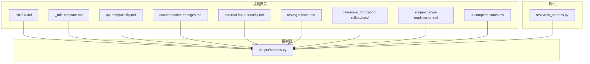
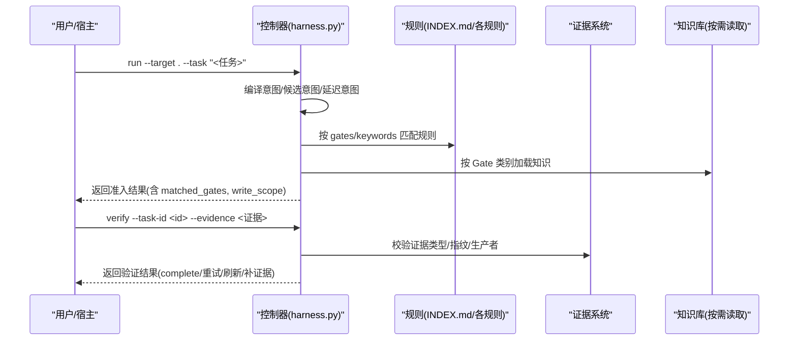
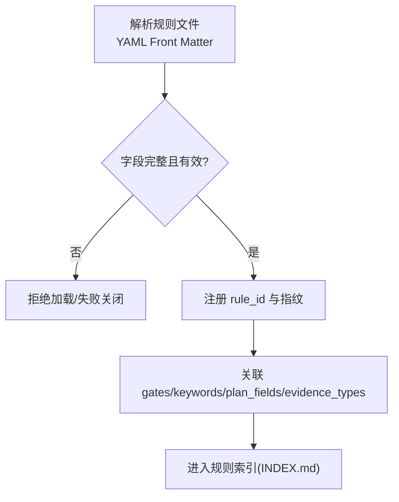
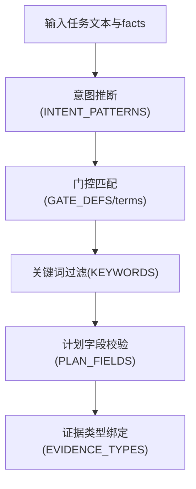
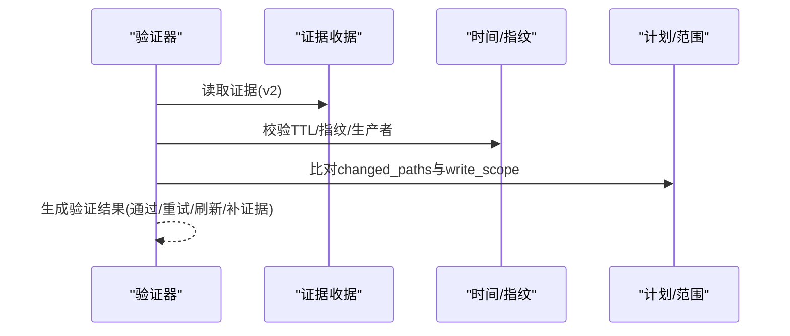
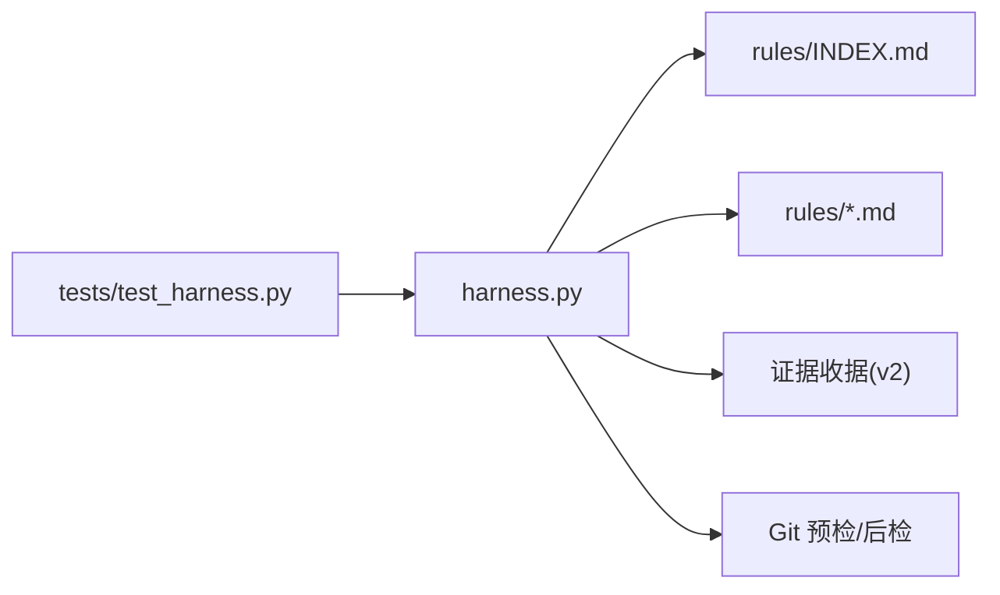

# 自定义规则开发

<cite>
**本文引用的文件**   
- [harness.py](file://scripts/harness.py)
- [INDEX.md](file://harness-home/rules/INDEX.md)
- [_rule-template.md](file://harness-home/rules/_rule-template.md)
- [api-compatibility.md](file://harness-home/rules/api-compatibility.md)
- [documentation-changes.md](file://harness-home/rules/documentation-changes.md)
- [external-input-security.md](file://harness-home/rules/external-input-security.md)
- [testing-release.md](file://harness-home/rules/testing-release.md)
- [release-authorization-rollback.md](file://harness-home/rules/release-authorization-rollback.md)
- [scope-change-readmission.md](file://harness-home/rules/scope-change-readmission.md)
- [ui-complete-states.md](file://harness-home/rules/ui-complete-states.md)
- [test_harness.py](file://tests/test_harness.py)
- [SKILL.md](file://SKILL.md)
</cite>

## 目录
1. [简介](#简介)
2. [项目结构](#项目结构)
3. [核心组件](#核心组件)
4. [架构总览](#架构总览)
5. [详细组件分析](#详细组件分析)
6. [依赖关系分析](#依赖关系分析)
7. [性能考量](#性能考量)
8. [故障排查指南](#故障排查指南)
9. [结论](#结论)
10. [附录：规则模板与示例清单](#附录：规则模板与示例清单)

## 简介
本指南面向需要为 Docs Harness 编写“自定义规则”的开发者，系统性说明规则文件的结构与语法、匹配模式、验证逻辑、证据要求以及测试调试方法。通过本指南，你可以从零开始创建一条从简单语法检查到复杂业务逻辑验证的规则，并确保其可被控制器稳定加载、匹配与执行。

## 项目结构
Docs Harness 的规则系统位于 harness-home/rules 目录，采用 Markdown 文档作为规则载体，配合 YAML Front Matter 声明元数据。控制器在启动或任务准入阶段会读取并校验这些规则，结合 Gate 与关键词进行匹配，并在验证阶段依据证据类型进行验收。

图表来源 
- [INDEX.md:1-41](file://harness-home/rules/INDEX.md#L1-L41)
- [_rule-template.md:1-21](file://harness-home/rules/_rule-template.md#L1-L21)
- [api-compatibility.md:1-29](file://harness-home/rules/api-compatibility.md#L1-L29)
- [documentation-changes.md:1-29](file://harness-home/rules/documentation-changes.md#L1-L29)
- [external-input-security.md:1-29](file://harness-home/rules/external-input-security.md#L1-L29)
- [testing-release.md:1-29](file://harness-home/rules/testing-release.md#L1-L29)
- [release-authorization-rollback.md:1-29](file://harness-home/rules/release-authorization-rollback.md#L1-L29)
- [scope-change-readmission.md:1-29](file://harness-home/rules/scope-change-readmission.md#L1-L29)
- [ui-complete-states.md:1-29](file://harness-home/rules/ui-complete-states.md#L1-L29)
- [harness.py:1-200](file://scripts/harness.py#L1-L200)
- [test_harness.py:1-120](file://tests/test_harness.py#L1-L120)

章节来源
- [INDEX.md:1-41](file://harness-home/rules/INDEX.md#L1-L41)
- [harness.py:1-200](file://scripts/harness.py#L1-L200)

## 核心组件
- 规则文件（Markdown + YAML Front Matter）
  - 关键字段：status、rule_id、content_fingerprint、gates、keywords、plan_fields、evidence_types、failure_mode
  - 正文部分：适用条件、必需的方案字段、验收条件、失败处理方式
- 控制器常量与配置
  - GATE_ORDER、GATE_DEFS、PLAN_FIELDS、INTENT_PATTERNS、MUTATION_PROFILES、DELIVERY_LAYER_ORDER 等
  - 安全底线 SAFETY_FLOOR_GATES、FLOOR_TERMS、NEGATION_MARKERS
- 证据体系
  - 证据收据 schema、受信任生产者、高风险证据类型、命令缓存与自动归因
- 测试套件
  - 规则自测、安装快照一致性、Git 预检/后检、意图与门控判定

章节来源
- [_rule-template.md:1-21](file://harness-home/rules/_rule-template.md#L1-L21)
- [harness.py:263-392](file://scripts/harness.py#L263-L392)
- [harness.py:243-261](file://scripts/harness.py#L243-L261)
- [test_harness.py:339-355](file://tests/test_harness.py#L339-L355)

## 架构总览
规则系统在“任务准入—上下文装配—验证—完成”的全链路中发挥作用：
- 准入阶段：根据任务语义与 facts 推断意图、风险 Gate 与授权；规则通过 gates 与 keywords 参与匹配。
- 上下文装配：按 Gate 类别选择知识分类，减少无关信息。
- 验证阶段：依据规则的 evidence_types 与 plan_fields 约束，驱动证据收集与验收。
- 完成阶段：控制器原子增量更新，继承已冻结方案与证据，保证幂等与可审计。

图表来源 
- [harness.py:200-346](file://scripts/harness.py#L200-L346)
- [SKILL.md:25-56](file://SKILL.md#L25-L56)

## 详细组件分析

### 规则文件结构与语法
- Front Matter 字段
  - status: 规则状态（如 active、scaffold）
  - rule_id: 唯一标识（建议以 DH- 前缀）
  - content_fingerprint: 内容指纹（sha256），用于变更检测
  - gates: 触发的门控（如 architecture-contract、security-sensitive）
  - keywords: 触发关键词列表（中英文均可）
  - plan_fields: 必需的方案字段（如 兼容策略、迁移与回滚）
  - evidence_types: 必需的证据类型（如 contract_acceptance、security_acceptance）
  - failure_mode: 失败处理策略（停止并重新准入/补齐等）
- 正文结构
  - 适用条件：何时生效
  - 必需的方案字段：方案必须包含哪些字段
  - 验收条件：如何证明完成
  - 失败处理方式：遇到异常时的处置

图表来源 
- [_rule-template.md:1-21](file://harness-home/rules/_rule-template.md#L1-L21)
- [INDEX.md:1-41](file://harness-home/rules/INDEX.md#L1-L41)

章节来源
- [_rule-template.md:1-21](file://harness-home/rules/_rule-template.md#L1-L21)
- [INDEX.md:1-41](file://harness-home/rules/INDEX.md#L1-L41)

### 规则匹配模式
- 文件路径匹配
  - 控制器通过 Git 工作树快照与 diff 范围识别变更路径，规则可通过 plan_fields 与 evidence_types 约束影响范围。
- 内容模式匹配
  - 使用 INTENT_PATTERNS 与 GATE_DEFS 中的 terms 词表进行自然语言意图与门控匹配；否定守卫 NEGATION_MARKERS 抑制误报。
- 上下文感知匹配
  - 基于 Gate 类别动态选择知识分类（GATE_KNOWLEDGE_CATEGORIES），仅加载相关事实，降低噪声。

图表来源 
- [harness.py:225-233](file://scripts/harness.py#L225-L233)
- [harness.py:276-345](file://scripts/harness.py#L276-L345)
- [harness.py:384-392](file://scripts/harness.py#L384-L392)

章节来源
- [harness.py:225-233](file://scripts/harness.py#L225-L233)
- [harness.py:276-345](file://scripts/harness.py#L276-L345)
- [harness.py:384-392](file://scripts/harness.py#L384-L392)

### 验证逻辑实现
- 条件判断
  - 控制器对证据类型、生产者白名单、命令缓存、时间戳 TTL 等进行校验；高风险证据类型需额外关注。
- 数据提取
  - 从证据收据中提取 changed_paths、read_set、write_set、conclusion 等字段，并与任务包范围比对。
- 错误报告
  - 提供明确的 reason_code（如 git_remote_drift、invalid_json、missing_file）与退出码，便于宿主定位问题。

图表来源 
- [harness.py:243-261](file://scripts/harness.py#L243-L261)
- [SKILL.md:43-56](file://SKILL.md#L43-L56)

章节来源
- [harness.py:243-261](file://scripts/harness.py#L243-L261)
- [SKILL.md:43-56](file://SKILL.md#L43-L56)

### 证据收集要求
- 必需的证据类型
  - 由 rules 的 evidence_types 指定（如 contract_acceptance、security_acceptance、test_result、ui_acceptance、external_state、document_review、review_result）。
- 验收标准
  - 证据需包含 schema_version、id、type、result、covers、task_id、target_identity、package_fingerprint、producer、command_argv_digest、cwd、started_at、ended_at、ttl、exit_code、output_or_artifact_digest、changed_paths、read_set、write_set、concurrent_drift、conclusion。
- 失败处理策略
  - 未满足证据类型、指纹漂移、生产者不可信、TTL 过期将触发重试、刷新或补证据流程；高风险证据需严格审查。

章节来源
- [api-compatibility.md:1-29](file://harness-home/rules/api-compatibility.md#L1-L29)
- [external-input-security.md:1-29](file://harness-home/rules/external-input-security.md#L1-L29)
- [testing-release.md:1-29](file://harness-home/rules/testing-release.md#L1-L29)
- [release-authorization-rollback.md:1-29](file://harness-home/rules/release-authorization-rollback.md#L1-L29)
- [ui-complete-states.md:1-29](file://harness-home/rules/ui-complete-states.md#L1-L29)
- [documentation-changes.md:1-29](file://harness-home/rules/documentation-changes.md#L1-L29)
- [scope-change-readmission.md:1-29](file://harness-home/rules/scope-change-readmission.md#L1-L29)
- [test_harness.py:248-304](file://tests/test_harness.py#L248-L304)

### 完整的规则开发示例
- 简单语法检查规则
  - 目标：确保文档存在必要标题与段落结构
  - 步骤：定义 rule_id、keywords、evidence_types=document_review；在验收条件中描述结构检查要点；failure_mode 设置为停止并补齐。
- 复杂业务逻辑验证规则
  - 目标：API 兼容性变更需覆盖消费者与回滚
  - 步骤：绑定 gates=architecture-contract；plan_fields 要求兼容策略、迁移与回滚；evidence_types=contract_acceptance；验收条件强调新旧消费者与失败路径验证。

章节来源
- [_rule-template.md:1-21](file://harness-home/rules/_rule-template.md#L1-L21)
- [api-compatibility.md:1-29](file://harness-home/rules/api-compatibility.md#L1-L29)
- [documentation-changes.md:1-29](file://harness-home/rules/documentation-changes.md#L1-L29)

### 规则测试与调试方法
- 自测入口
  - 使用 self-test 命令校验规则完整性与指纹一致性。
- 安装快照一致性
  - 验证 installed rules_root 与 ACTIVE_RULE_FILES/ACTIVE_RULE_IDS 一致。
- Git 预检/后检
  - 验证 git_preflight_contract 与 git_postcheck 的行为（脏工作区、非快进、LFS/Submodule 可用性）。
- 意图与门控
  - 验证 read_only、git_inspect、git_fetch、git_sync 等意图路由与 mutation_profile 提升。

章节来源
- [test_harness.py:339-355](file://tests/test_harness.py#L339-L355)
- [test_harness.py:356-376](file://tests/test_harness.py#L356-L376)
- [test_harness.py:651-757](file://tests/test_harness.py#L651-L757)
- [test_harness.py:758-794](file://tests/test_harness.py#L758-L794)

## 依赖关系分析
- 控制器与规则
  - 控制器读取 INDEX.md 与规则文件，校验 status、rule_id、content_fingerprint，并按 gates/keywords 匹配。
- 控制器与证据
  - 控制器依据 evidence_types 与受信任生产者白名单校验证据收据，支持命令缓存与自动归因。
- 控制器与 Git
  - 控制器通过 git_preflight_contract 与 git_postcheck 保障远端引用与工作区一致性。

图表来源 
- [harness.py:1-200](file://scripts/harness.py#L1-L200)
- [INDEX.md:1-41](file://harness-home/rules/INDEX.md#L1-L41)
- [test_harness.py:1-120](file://tests/test_harness.py#L1-L120)

章节来源
- [harness.py:1-200](file://scripts/harness.py#L1-L200)
- [INDEX.md:1-41](file://harness-home/rules/INDEX.md#L1-L41)
- [test_harness.py:1-120](file://tests/test_harness.py#L1-L120)

## 性能考量
- 规则加载与匹配
  - 规则数量与关键词规模影响匹配开销；建议精简 keywords 与 gates，避免过度泛化。
- 证据校验
  - 命令缓存可减少重复执行；合理设置 TTL 与 command_argv_digest 以降低 IO 压力。
- Git 操作
  - 预检阶段批量获取 refs/diff，避免多次子进程调用；阈值控制删除数量与大对象扫描。

[本节为通用指导，不直接分析具体文件]

## 故障排查指南
- 常见错误码
  - missing_file、invalid_json、invalid_task_id、git_preflight_failed、git_remote_unavailable、git_remote_ref_missing、git_sync_scope_ambiguous、git_remote_drift
- 排查步骤
  - 检查规则指纹与 INDEX 一致性；确认证据类型与生产者白名单；验证 Git 环境（LFS/Submodule）；核对任务意图与 write_scope。
- 日志与输出
  - 使用 --json 输出结构化响应，结合 reason_code 与 blockers 快速定位问题。

章节来源
- [harness.py:395-447](file://scripts/harness.py#L395-L447)
- [test_harness.py:620-650](file://tests/test_harness.py#L620-L650)

## 结论
通过遵循本指南的规则结构与匹配规范，结合控制器提供的证据体系与 Git 安全保障，你可以构建稳定、可审计、可扩展的自定义规则。建议在开发过程中充分利用测试套件与自测工具，确保规则在真实环境中可靠运行。

[本节为总结性内容，不直接分析具体文件]

## 附录：规则模板与示例清单
- 模板文件
  - _rule-template.md：规则骨架，包含 Front Matter 与正文结构
- 示例规则
  - api-compatibility.md：API 兼容性与迁移回滚
  - documentation-changes.md：文档真源与索引治理
  - external-input-security.md：外部输入与安全边界
  - testing-release.md：测试与验收放行
  - release-authorization-rollback.md：发布授权与回滚
  - scope-change-readmission.md：范围变化重新准入
  - ui-complete-states.md：UI 完整状态验收

章节来源
- [_rule-template.md:1-21](file://harness-home/rules/_rule-template.md#L1-L21)
- [api-compatibility.md:1-29](file://harness-home/rules/api-compatibility.md#L1-L29)
- [documentation-changes.md:1-29](file://harness-home/rules/documentation-changes.md#L1-L29)
- [external-input-security.md:1-29](file://harness-home/rules/external-input-security.md#L1-L29)
- [testing-release.md:1-29](file://harness-home/rules/testing-release.md#L1-L29)
- [release-authorization-rollback.md:1-29](file://harness-home/rules/release-authorization-rollback.md#L1-L29)
- [scope-change-readmission.md:1-29](file://harness-home/rules/scope-change-readmission.md#L1-L29)
- [ui-complete-states.md:1-29](file://harness-home/rules/ui-complete-states.md#L1-L29)