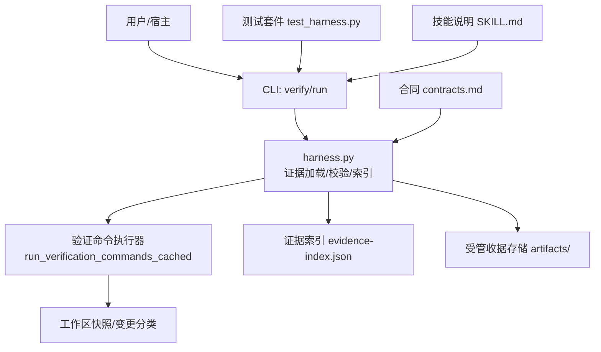
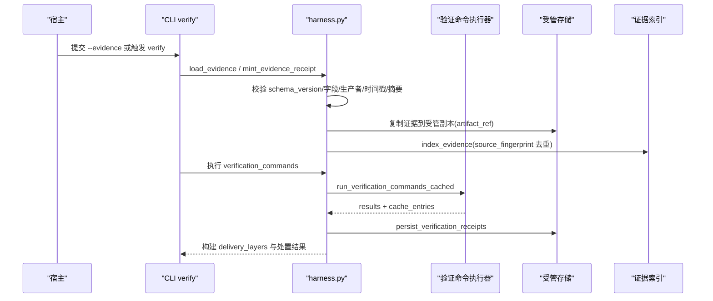
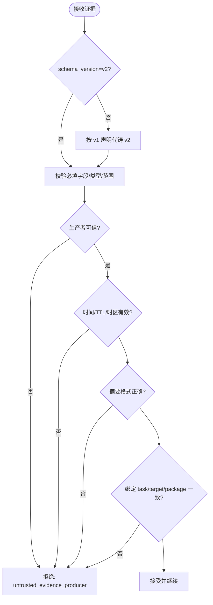
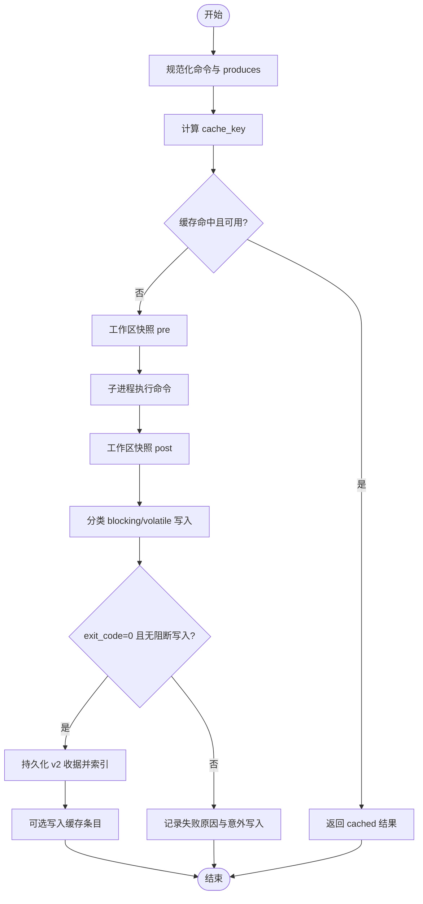
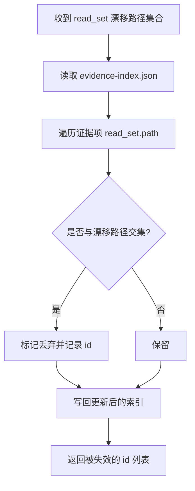
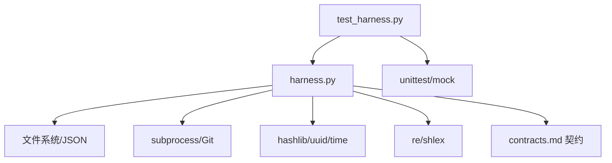

# 证据适配器开发

<cite>
**本文档引用的文件**   
- [SKILL.md](file://SKILL.md)
- [package.json](file://package.json)
- [scripts/harness.py](file://scripts/harness.py)
- [tests/test_harness.py](file://tests/test_harness.py)
- [docs/contracts.md](file://docs/contracts.md)
</cite>

## 目录
1. [简介](#简介)
2. [项目结构](#项目结构)
3. [核心组件](#核心组件)
4. [架构总览](#架构总览)
5. [详细组件分析](#详细组件分析)
6. [依赖关系分析](#依赖关系分析)
7. [性能考虑](#性能考虑)
8. [故障排查指南](#故障排查指南)
9. [结论](#结论)
10. [附录](#附录)

## 简介
本文件面向“证据适配器”开发者，系统性阐述证据在 Docs Harness 中的收集、验证与收据生成机制，并给出接口规范、适配策略、缓存与优化策略、高级验证特性以及完整开发与测试示例。证据是任务验收的关键契约：宿主通过声明或命令产出证据，控制器校验并生成受管收据，最终驱动准入与完成流程。

## 项目结构
- 控制脚本与核心逻辑位于 scripts/harness.py，包含证据加载、校验、索引、验证命令执行与收据持久化等能力。
- 合同与行为约定详见 docs/contracts.md，明确证据 v2 收据格式、验证命令、交付层与处置策略。
- SKILL.md 描述任务入口、verify 流程、后台治理与质量账本等高层行为。
- tests/test_harness.py 提供端到端用例，覆盖证据构造、验证命令、Git 后检、漂移处理等。
- package.json 定义包元数据与测试脚本。

**图表来源** 
- [scripts/harness.py:5203-5395](file://scripts/harness.py#L5203-L5395)
- [scripts/harness.py:5962-6071](file://scripts/harness.py#L5962-L6071)
- [scripts/harness.py:6085-6132](file://scripts/harness.py#L6085-L6132)
- [docs/contracts.md:165-221](file://docs/contracts.md#L165-L221)
- [tests/test_harness.py:248-304](file://tests/test_harness.py#L248-L304)
- [SKILL.md:44-56](file://SKILL.md#L44-L56)

**章节来源**
- [SKILL.md:26-56](file://SKILL.md#L26-L56)
- [package.json:1-23](file://package.json#L1-L23)
- [docs/contracts.md:1-12](file://docs/contracts.md#L1-L12)

## 核心组件
- 证据收据 v2（evidence-receipt/v2）：绑定任务、目标、包指纹、可信生产者、时间戳与摘要，作为验收最小单元。
- 证据声明草案（evidence-declaration/v1）：宿主仅提交 type/write_set/read_set/conclusion 等，控制器代铸为 v2 收据。
- 验证命令（verification-command-receipt/v1）：按 argv、produces 与输入指纹绑定，支持缓存复用。
- 证据索引（evidence-index/v2）：以 source_fingerprint 去重索引所有已摄取证据。
- 验证命令执行器：执行白名单命令，隔离 volatile 写入，失败关闭或返回可重试处置。
- 交付层（delivery_layers）：source/local_verification/git_head/remote_delivery/fresh_clone/release_artifact/ui/external_state，逐层判定是否 required/not_requested/not_applicable 与 verified。

**章节来源**
- [docs/contracts.md:165-221](file://docs/contracts.md#L165-L221)
- [scripts/harness.py:5203-5395](file://scripts/harness.py#L5203-L5395)
- [scripts/harness.py:5962-6071](file://scripts/harness.py#L5962-L6071)
- [scripts/harness.py:6085-6132](file://scripts/harness.py#L6085-L6132)
- [scripts/harness.py:6229-6240](file://scripts/harness.py#L6229-L6240)

## 架构总览
证据生命周期从宿主声明或命令开始，经控制器校验、受管副本保存、索引归档，再到交付层聚合与最终验收。

**图表来源** 
- [scripts/harness.py:5203-5395](file://scripts/harness.py#L5203-L5395)
- [scripts/harness.py:5962-6071](file://scripts/harness.py#L5962-L6071)
- [scripts/harness.py:6085-6132](file://scripts/harness.py#L6085-L6132)
- [docs/contracts.md:165-221](file://docs/contracts.md#L165-L221)

## 详细组件分析

### 证据收据 v2 与声明草案
- 声明草案（v1）：宿主提供 type/write_set/read_set/concurrent_drift/conclusion；控制器代铸 task_id/target_identity/package_fingerprint/cwd/started_at/ended_at/ttl/exit_code/digests 等，producer 记为 ("docs-harness","host_declaration")。
- 收据 v2：必须包含 schema_version/type/result/covers/task_id/target_identity/package_fingerprint/producer/command_argv_digest/cwd/started_at/ended_at/ttl/exit_code/output_or_artifact_digest/read_set/write_set 等；过期、跨任务/目标/包指纹、不可信生产者、非零退出或摘要无效均拒绝。
- 可信生产者白名单：包括 git_postcheck、verification_command、auto_attribution、host_declaration 及若干外部审查者。

**图表来源** 
- [scripts/harness.py:5203-5395](file://scripts/harness.py#L5203-L5395)
- [docs/contracts.md:165-221](file://docs/contracts.md#L165-L221)

**章节来源**
- [scripts/harness.py:5203-5395](file://scripts/harness.py#L5203-L5395)
- [docs/contracts.md:165-221](file://docs/contracts.md#L165-L221)

### 验证命令执行与缓存
- 命令规范化：仅允许安全可执行与受限参数（如 git diff/status、npm test/run 等），防止危险操作。
- 执行模型：命令前快照→执行→命令后快照→区分 blocking_write_set 与 volatile_write_set；仅允许已知临时副产物。
- 缓存键：由 task_id、target_identity、command_argv_digest、cwd、input_fingerprint、contract_digest 组成；命中则直接复用通过收据。
- 输出：成功且无阻断写入时，按 produces 生成 v2 收据并索引；失败返回 reason_code 与 unexpected_write_set。

**图表来源** 
- [scripts/harness.py:5856-5900](file://scripts/harness.py#L5856-L5900)
- [scripts/harness.py:5962-6071](file://scripts/harness.py#L5962-L6071)
- [scripts/harness.py:6085-6132](file://scripts/harness.py#L6085-L6132)

**章节来源**
- [scripts/harness.py:5856-5900](file://scripts/harness.py#L5856-L5900)
- [scripts/harness.py:5962-6071](file://scripts/harness.py#L5962-L6071)
- [scripts/harness.py:6085-6132](file://scripts/harness.py#L6085-L6132)

### 证据索引与失效
- 索引规则：按 source_fingerprint 去重追加；read_set 漂移时仅失效引用这些路径的证据，返回被失效的 id 列表。
- 使用场景：当读取基线漂移时，控制器只失效相关证据并提示 refresh_evidence，避免全量重跑。

**图表来源** 
- [scripts/harness.py:5510-5536](file://scripts/harness.py#L5510-L5536)

**章节来源**
- [scripts/harness.py:5510-5536](file://scripts/harness.py#L5510-L5536)

### 交付层与验收
- 交付层期望与状态：source/local_verification/git_head/remote_delivery/fresh_clone/release_artifact/ui/external_state，每层含 expectation 与 status 与 evidence_refs。
- 默认策略：query/audit/git_inspect 将 remote_delivery 与 fresh_clone 标记 not_applicable；本地 modify 未声明 Git/外部交付时标记 not_requested；git_sync/external_write 或明确要求远端/发布/安装/fresh clone 时标记 required。
- 限制码：known_limit_codes 仅从 required 且未验证的层派生，不再无条件默认 remote_delivery_not_verified。

**章节来源**
- [docs/contracts.md:82-95](file://docs/contracts.md#L82-L95)

### 适配器接口规范
- 必需实现（宿主侧）：
  - 生成 v1 声明草案或 v2 收据：type、write_set/read_set/conclusion 至少齐全；v2 需满足全部必填字段与约束。
  - 指定 producer：adapter/capability 必须在可信白名单内。
  - 提供 command_argv_digest 与 output_or_artifact_digest（sha256 格式）。
  - 保证 cwd 指向目标项目根，exit_code=0 表示通过。
- 参数格式：
  - changed_paths/write_set/read_set：相对路径或受控 Git 资源；read_set 可为字符串或 {path,fingerprint}。
  - concurrent_drift：并发进程产生的变化路径。
  - ttl：秒级正整数，最大不超过一周；ended_at 不得早于 started_at。
- 返回值结构：
  - 控制器返回五类处置：provide_evidence/refresh_evidence/retry_verification/incremental_admission/full_readmission，对应不同退出码与后续动作。

**章节来源**
- [docs/contracts.md:165-221](file://docs/contracts.md#L165-L221)
- [scripts/harness.py:5203-5395](file://scripts/harness.py#L5203-L5395)

### 不同类型证据的适配策略
- 文件证据：
  - 宿主提交 changed_paths 与 write_set，控制器复制到受管存储并建立 artifact_ref/source_fingerprint。
  - 若 write_scope 内存在未归因写入，默认自动代铸 workspace_attribution 收据认领；可通过配置恢复 provide_evidence。
- API 响应证据：
  - 使用 verification_command 产生 test_result 或 release_acceptance 等类型；命令输出摘要作为 output_or_artifact_digest。
  - 禁止危险参数与远程推送；仅允许白名单命令与受限子集。
- 数据库查询证据：
  - 通过本地检查命令（如 pytest/sqlalchemy check）生成 test_result；read_set 包含查询涉及的文档或 schema 文件指纹。
  - 若涉及外部状态，需额外 external_state 证据类型并由可信生产者签发。

**章节来源**
- [docs/contracts.md:165-221](file://docs/contracts.md#L165-L221)
- [scripts/harness.py:5856-5900](file://scripts/harness.py#L5856-L5900)
- [scripts/harness.py:6085-6132](file://scripts/harness.py#L6085-L6132)

### 证据缓存机制与性能优化
- 验证命令缓存：cache_key 基于任务、目标、命令、cwd、输入指纹与合同摘要；命中则跳过执行，显著降低重复验证成本。
- 证据索引去重：source_fingerprint 去重避免重复索引；read_set 漂移局部失效减少不必要重验。
- 增量准入：新增普通 Gate 且合同不变时，原子增量重新编译并继承同轮证据，避免完整重新准入。
- 可控开关：verification.command_cache_enabled=false 整体关闭缓存；verification.auto_attribute_in_scope=false 恢复补证据流程。

**章节来源**
- [scripts/harness.py:5962-6071](file://scripts/harness.py#L5962-L6071)
- [scripts/harness.py:5539-5679](file://scripts/harness.py#L5539-L5679)
- [docs/contracts.md:153-163](file://docs/contracts.md#L153-L163)

### 高级验证特性
- 模糊匹配：scope 支持 glob；路径段精确匹配，自然语言边界不被接受。
- 版本兼容检查：v1 在途任务仅允许有限操作，迁移至 v2 后旧证据只读；v2 任务不接受旧证据。
- 依赖关系验证：knowledge_map 与 feature 依赖用于知识上下文选择；交付层独立证据类型确保各层不互相替代。
- 风险 Gate：security-sensitive/destructive-data/release-external 等底线 Gate 强制并入，宿主只能加不能减。

**章节来源**
- [docs/contracts.md:42-48](file://docs/contracts.md#L42-L48)
- [docs/contracts.md:236-248](file://docs/contracts.md#L236-L248)
- [docs/contracts.md:82-95](file://docs/contracts.md#L82-L95)

### 完整的适配器开发示例与测试方法
- 步骤概览：
  1) 准备任务与范围：run 获取 task_id 与 package fingerprint。
  2) 生成证据：构造 v1 声明或 v2 收据，确保 producer 可信、字段齐全、摘要正确。
  3) 提交证据：verify --evidence 提交，控制器校验并索引。
  4) 运行验证命令：在 facts 中声明 verification_commands，控制器执行并生成收据。
  5) 查看交付层：确认 required 层均已 verified。
- 测试要点（参考测试套件）：
  - 构造证据函数与断言：覆盖 covers、changed_paths、read_set、producer 等。
  - Git 后检与漂移：验证 git_fetch/git_sync 的预检与后检、远端漂移导致重新准入。
  - 脏工作区与非 fast-forward 阻断：preflight 阶段失败关闭。
  - LFS/Submodule 可用性：不可用时阻断。
  - 自测与规则激活：self-test 与 active rules 一致性。

**章节来源**
- [tests/test_harness.py:248-304](file://tests/test_harness.py#L248-L304)
- [tests/test_harness.py:503-576](file://tests/test_harness.py#L503-L576)
- [tests/test_harness.py:597-734](file://tests/test_harness.py#L597-L734)
- [tests/test_harness.py:736-756](file://tests/test_harness.py#L736-L756)
- [tests/test_harness.py:339-354](file://tests/test_harness.py#L339-L354)

## 依赖关系分析
- harness.py 依赖：
  - 文件系统与 JSON：读写证据、索引、收据与状态。
  - subprocess：执行验证命令与 Git 操作。
  - hashlib/uuid/time：摘要、ID 与时间戳。
  - re/shlex：命令解析与安全校验。
- 合同依赖：
  - evidence-receipt/v2、verification-command-receipt/v1、task-package/v2、context-receipt/v2、authorization-receipt/v2。
- 测试依赖：
  - unittest、subprocess、tempfile、mock。

**图表来源** 
- [scripts/harness.py:1-100](file://scripts/harness.py#L1-L100)
- [docs/contracts.md:1-12](file://docs/contracts.md#L1-L12)
- [tests/test_harness.py:1-45](file://tests/test_harness.py#L1-L45)

**章节来源**
- [scripts/harness.py:1-100](file://scripts/harness.py#L1-L100)
- [docs/contracts.md:1-12](file://docs/contracts.md#L1-L12)
- [tests/test_harness.py:1-45](file://tests/test_harness.py#L1-L45)

## 性能考虑
- 验证命令缓存：命中即跳过执行，显著降低重复验证开销。
- 证据索引去重：避免重复索引与存储膨胀。
- 增量准入：新增普通 Gate 时原子增量重新编译并继承证据，避免完整重新准入。
- 只读意图与最小上下文：query/audit/git_inspect 默认最小化上下文加载与交付层要求。

[本节为通用指导，无需具体文件分析]

## 故障排查指南
- 常见错误码与含义：
  - invalid_evidence/evidence_not_passed：证据类型或 result 不合法。
  - invalid_evidence_type：type 不在白名单。
  - evidence_binding_mismatch：task/target/package 绑定不一致。
  - untrusted_evidence_producer：生产者不可信。
  - evidence_expired：证据过期。
  - unsafe_verification_command：命令或参数不安全。
  - verification_command_workspace_write：验证命令产生阻断写入。
  - stale_evidence：changed_paths 与实际工作区变化不一致。
  - git_remote_drift/git_preflight_failed：Git 预检失败或远端漂移。
- 定位建议：
  - 检查证据 schema_version 与必填字段；核对 producer 白名单。
  - 确认 cwd、exit_code、摘要格式与 TTL。
  - 查看验证命令日志与 unexpected_write_set。
  - 对 Git 操作检查 preflight snapshot 与 blockers。

**章节来源**
- [scripts/harness.py:5203-5395](file://scripts/harness.py#L5203-L5395)
- [scripts/harness.py:5856-5900](file://scripts/harness.py#L5856-L5900)
- [scripts/harness.py:5962-6071](file://scripts/harness.py#L5962-L6071)
- [docs/contracts.md:153-163](file://docs/contracts.md#L153-L163)

## 结论
证据适配器是 Docs Harness 验收体系的核心：宿主通过声明或命令产出证据，控制器严格校验并生成受管收据，结合交付层与风险 Gate 完成可审计的验收。遵循接口规范、利用缓存与增量准入、合理设计验证命令与证据类型，可显著提升效率与可靠性。

[本节为总结性内容，无需具体文件分析]

## 附录
- 关键常量与模式：
  - 证据模式：EVIDENCE_RECEIPT_SCHEMA、EVIDENCE_DECLARATION_SCHEMA。
  - 可信生产者：TRUSTED_EVIDENCE_PRODUCERS。
  - 高风险证据类型：HIGH_RISK_EVIDENCE_TYPES。
  - 交付层顺序：DELIVERY_LAYER_ORDER。
- 常用 CLI：
  - run/verify/background/ledger 等命令参见 SKILL.md。

**章节来源**
- [scripts/harness.py:243-260](file://scripts/harness.py#L243-L260)
- [scripts/harness.py:146-178](file://scripts/harness.py#L146-L178)
- [SKILL.md:26-56](file://SKILL.md#L26-L56)