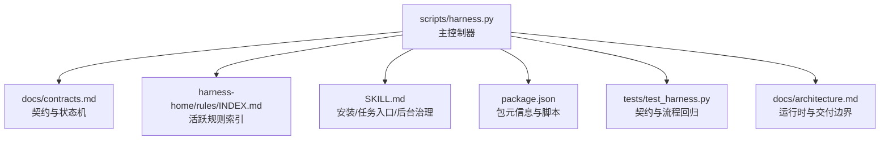
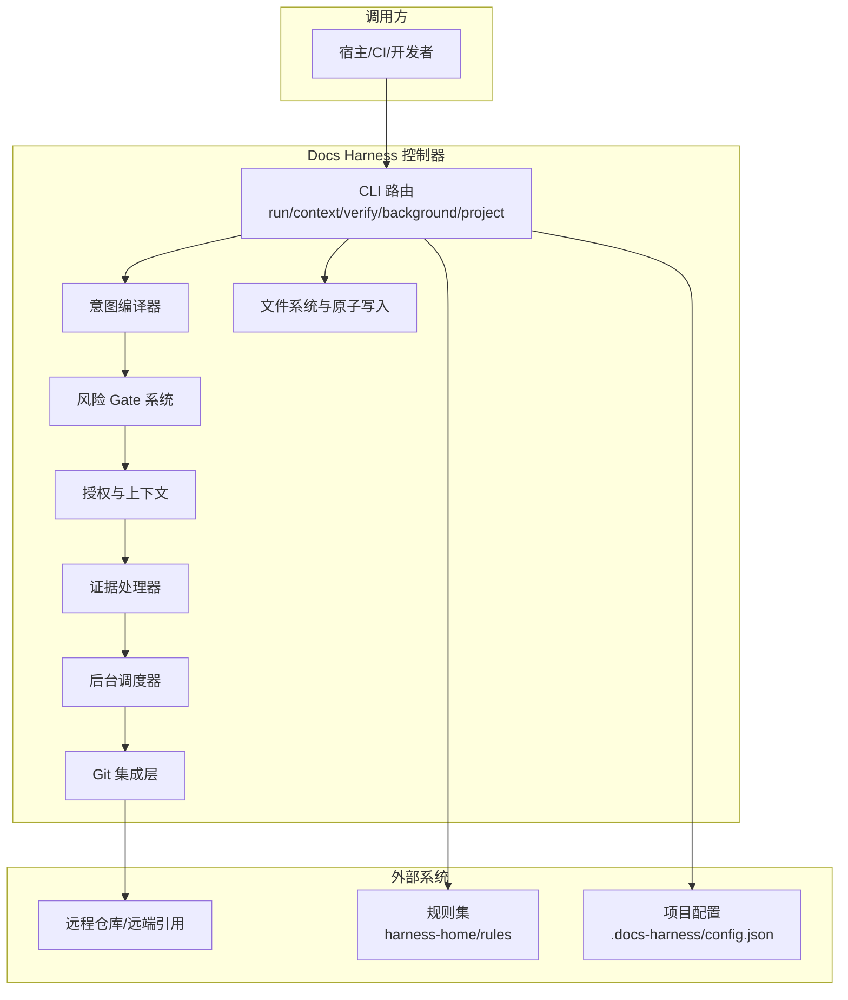
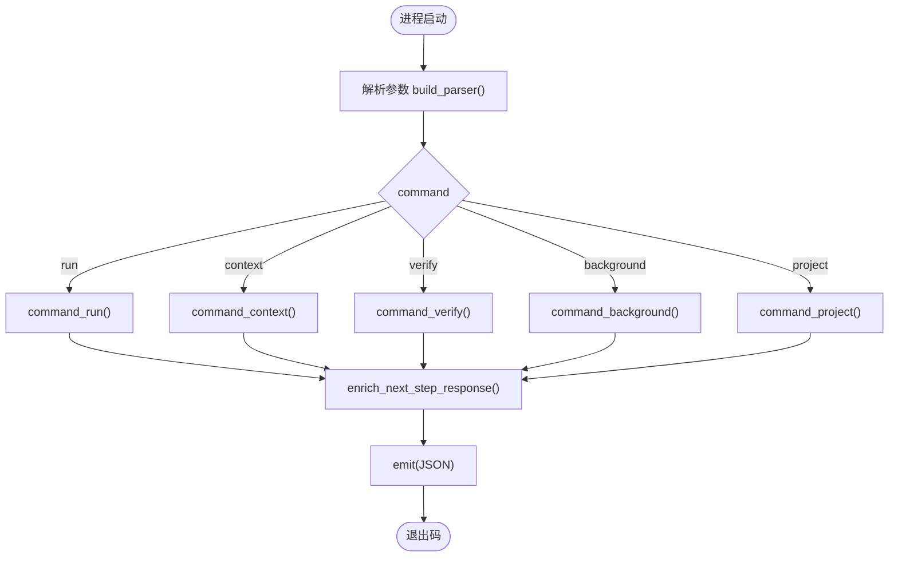
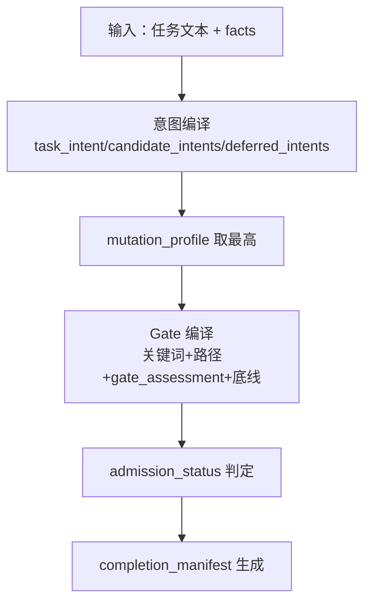
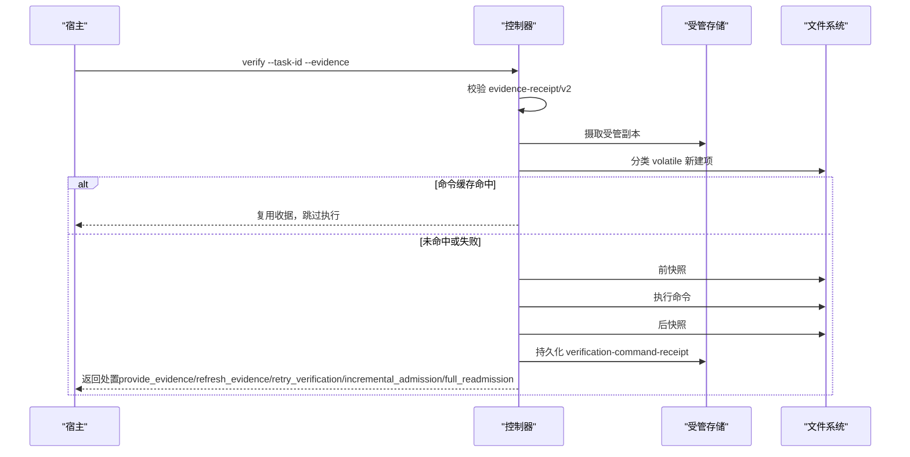
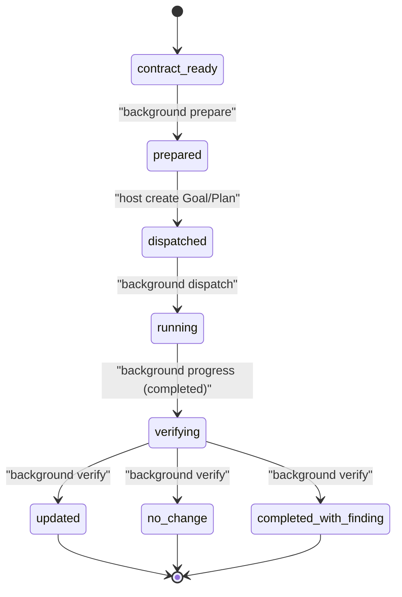
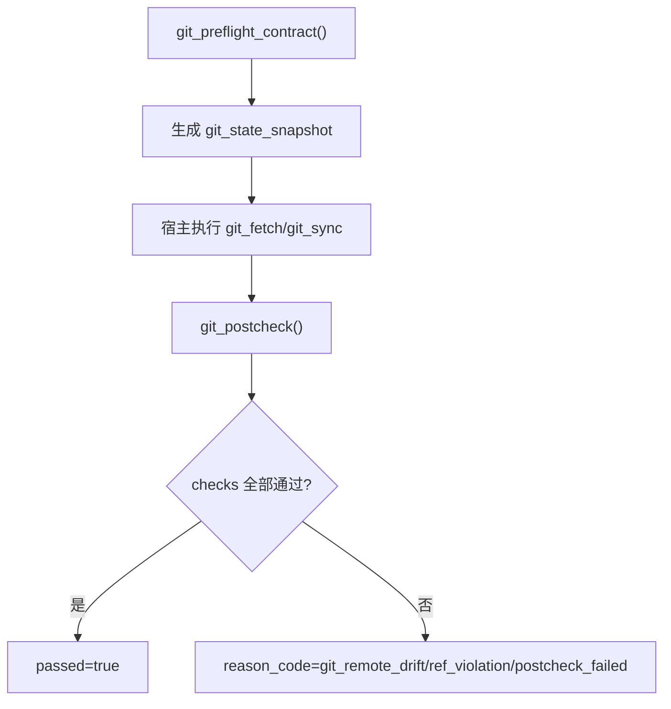
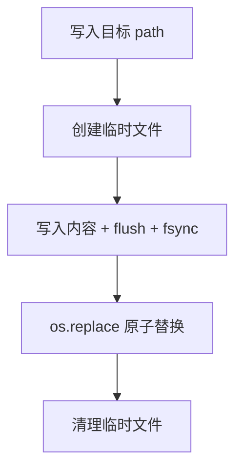
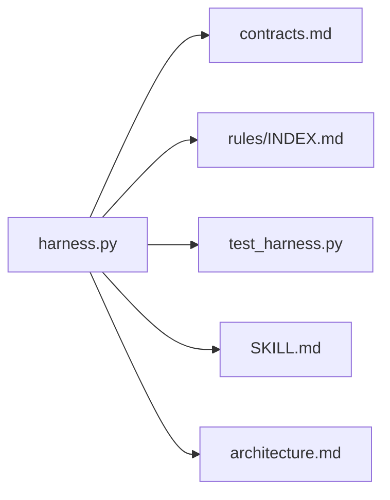

# 架构设计

<cite>
**本文引用的文件**   
- [scripts/harness.py](file://scripts/harness.py)
- [docs/contracts.md](file://docs/contracts.md)
- [SKILL.md](file://SKILL.md)
- [package.json](file://package.json)
- [harness-home/rules/INDEX.md](file://harness-home/rules/INDEX.md)
- [tests/test_harness.py](file://tests/test_harness.py)
- [docs/architecture.md](file://docs/architecture.md)
</cite>

## 目录
1. [引言](#引言)
2. [项目结构](#项目结构)
3. [核心组件](#核心组件)
4. [架构总览](#架构总览)
5. [详细组件分析](#详细组件分析)
6. [依赖关系分析](#依赖关系分析)
7. [性能考量](#性能考量)
8. [故障排查指南](#故障排查指南)
9. [结论](#结论)
10. [附录](#附录)

## 引言
Docs Harness 是一个“意图优先、证据可复用且失败关闭”的独立控制器，负责任务准入、风险 Gate、范围与授权、上下文装配、证据与验收、Git 交付检查以及后台文档治理。其目标是把“做什么（意图）—允许做（Gate/授权）—怎么做（计划/上下文）—如何证明（证据/验收）—如何收尾（后台治理）”全链路标准化、可审计、可回滚。

本架构文档面向技术与非技术读者，提供系统边界、组件职责、数据与控制流、外部集成点、技术决策与权衡、扩展点与插件机制说明，并给出架构图与关键流程图。

## 项目结构
- 控制器源码真源：scripts/harness.py
- 规则集与索引：harness-home/rules/INDEX.md 及若干 .md 规则文件
- 对外行为与版本元信息：SKILL.md、package.json
- 合同与状态机：docs/contracts.md
- 测试套件：tests/test_harness.py
- 架构事实与约束：docs/architecture.md

**图表来源** 
- [scripts/harness.py:10322-10360](file://scripts/harness.py#L10322-L10360)
- [docs/contracts.md:1-370](file://docs/contracts.md#L1-L370)
- [harness-home/rules/INDEX.md:1-41](file://harness-home/rules/INDEX.md#L1-L41)
- [SKILL.md:1-105](file://SKILL.md#L1-L105)
- [package.json:1-23](file://package.json#L1-L23)
- [tests/test_harness.py:1-800](file://tests/test_harness.py#L1-L800)
- [docs/architecture.md:1-26](file://docs/architecture.md#L1-L26)

**章节来源**
- [scripts/harness.py:10322-10360](file://scripts/harness.py#L10322-L10360)
- [docs/contracts.md:1-370](file://docs/contracts.md#L1-L370)
- [SKILL.md:1-105](file://SKILL.md#L1-L105)
- [package.json:1-23](file://package.json#L1-L23)
- [harness-home/rules/INDEX.md:1-41](file://harness-home/rules/INDEX.md#L1-L41)
- [tests/test_harness.py:1-800](file://tests/test_harness.py#L1-L800)
- [docs/architecture.md:1-26](file://docs/architecture.md#L1-L26)

## 核心组件
- 主控制器（CLI 与命令路由）：统一入口、参数解析、子命令分发、错误封装与 JSON 输出
- 意图编译器：从用户任务文本与 facts 编译 task_intent、candidate_intents、deferred_intents 与 mutation_profile
- 风险门控系统（Gate）：基于关键词与路径推断、宿主 gate_assessment 与安全底线强制合并
- 证据处理器：evidence-receipt/v2 校验、受管副本摄取、验证命令逐项收据与缓存、自动归因
- 后台任务调度器：background 命令族，prepare/dispatched/running/progress/verify/retry 状态机
- Git 集成层：git_preflight_contract、git_postcheck、refs 快照、工作区指纹、漂移检测
- 文件系统与原子写入：atomic_write_*、JSONL 追加、锁与事件日志
- 知识地图与治理：knowledge-map、document-routes、bootstrap/audit/estimate 流程

**章节来源**
- [scripts/harness.py:197-390](file://scripts/harness.py#L197-L390)
- [scripts/harness.py:677-876](file://scripts/harness.py#L677-L876)
- [scripts/harness.py:10000-10101](file://scripts/harness.py#L10000-L10101)
- [docs/contracts.md:165-221](file://docs/contracts.md#L165-L221)
- [docs/contracts.md:303-348](file://docs/contracts.md#L303-L348)
- [docs/architecture.md:1-26](file://docs/architecture.md#L1-L26)

## 架构总览
Docs Harness 采用“单进程 CLI + 文件型 Runtime + 契约驱动”的事件驱动架构。控制面通过严格的 schema 与指纹校验保证幂等与可追溯；数据面由业务侧在受限范围内写入。Git 作为唯一可信远端与变更基线，Runtime 与质量账本不进入版本控制。

**图表来源** 
- [scripts/harness.py:10322-10360](file://scripts/harness.py#L10322-L10360)
- [docs/contracts.md:1-370](file://docs/contracts.md#L1-L370)
- [harness-home/rules/INDEX.md:1-41](file://harness-home/rules/INDEX.md#L1-L41)

## 详细组件分析

### 主控制器（CLI 与命令路由）
- 职责：参数解析、子命令分发、错误封装、JSON 输出、下一步命令拼装
- 关键点：
  - build_parser 定义 run/context/progress/verify/task/ledger/knowledge/background/project/self-test
  - main 统一捕获 HarnessError，返回结构化错误与退出码
  - enrich_next_step_response 为 next_action 生成可直接执行的命令行片段

**图表来源** 
- [scripts/harness.py:10160-10279](file://scripts/harness.py#L10160-L10279)
- [scripts/harness.py:10322-10360](file://scripts/harness.py#L10322-L10360)

**章节来源**
- [scripts/harness.py:10160-10279](file://scripts/harness.py#L10160-L10279)
- [scripts/harness.py:10322-10360](file://scripts/harness.py#L10322-L10360)

### 意图编译器与风险 Gate
- 意图编译：根据任务文本与 facts 推导 task_intent、candidate_intents、deferred_intents，计算最高 mutation_profile
- Gate 编译：关键词匹配 + 路径分词 + 宿主 gate_assessment + 安全底线强制并入
- 结果：admission_status（blocked/needs_plan/needs_authorization/ready_direct/ready_planned/ready_extended）

**图表来源** 
- [scripts/harness.py:197-390](file://scripts/harness.py#L197-L390)
- [docs/contracts.md:9-48](file://docs/contracts.md#L9-L48)

**章节来源**
- [scripts/harness.py:197-390](file://scripts/harness.py#L197-L390)
- [docs/contracts.md:9-48](file://docs/contracts.md#L9-L48)

### 证据处理器与验证命令
- 证据 v2：校验 producer、绑定 task/target/package fingerprint、读写集合、TTL、摘要
- 验证命令：逐项快照、输入指纹、缓存命中、只容忍已知临时副产物
- 自动归因：write_scope 内未归因写入默认 auto_attribute_in_scope 接管

**图表来源** 
- [docs/contracts.md:165-221](file://docs/contracts.md#L165-L221)
- [scripts/harness.py:1142-1234](file://scripts/harness.py#L1142-L1234)

**章节来源**
- [docs/contracts.md:165-221](file://docs/contracts.md#L165-L221)
- [scripts/harness.py:1142-1234](file://scripts/harness.py#L1142-L1234)

### 后台任务调度器（Background Job）
- 路线：background_direct / background_goal / background_goal_phased
- 状态机：contract_ready → prepare → dispatched → running → progress → verify → 终态
- 限制：may_mutate_parent=false、may_spawn_child_jobs=false、suppress_post_completion=true

**图表来源** 
- [docs/contracts.md:303-348](file://docs/contracts.md#L303-L348)
- [SKILL.md:59-90](file://SKILL.md#L59-L90)

**章节来源**
- [docs/contracts.md:303-348](file://docs/contracts.md#L303-L348)
- [SKILL.md:59-90](file://SKILL.md#L59-L90)

### Git 集成层
- 预检：git_preflight_contract 生成 snapshot（remote、refspec、head、index_tree、worktree_fingerprint、controlled_refs_namespace）
- 后检：git_postcheck 校验 remote_target_unchanged、refs_within_contract、fast-forward、LFS/Submodule
- 漂移处理：git_sync_landed_scope 累积 pull 落盘文件，自动归因

**图表来源** 
- [scripts/harness.py:677-876](file://scripts/harness.py#L677-L876)

**章节来源**
- [scripts/harness.py:677-876](file://scripts/harness.py#L677-L876)

### 文件系统与原子写入
- 原子写：atomic_write_text/atomic_write_json 使用临时文件 + os.replace
- JSONL 追加：append_jsonl 用于 events.jsonl
- 锁：state_lock 基于独占文件，带超时与 stale 清理提示

**图表来源** 
- [scripts/harness.py:419-435](file://scripts/harness.py#L419-L435)
- [scripts/harness.py:507-530](file://scripts/harness.py#L507-L530)
- [scripts/harness.py:1008-1029](file://scripts/harness.py#L1008-L1029)

**章节来源**
- [scripts/harness.py:419-435](file://scripts/harness.py#L419-L435)
- [scripts/harness.py:507-530](file://scripts/harness.py#L507-L530)
- [scripts/harness.py:1008-1029](file://scripts/harness.py#L1008-L1029)

### 知识地图与文档治理
- knowledge-map：功能维度（product/development/testing/design）、scope_patterns、shared_refs
- document-routes：architecture/changelog/todo/adr_root/reviews_root 显式配置或自动候选
- bootstrap/audit/estimate：按 knowledge_flow 推进，阻塞增量 Job 直到 ready

**章节来源**
- [scripts/harness.py:1287-1457](file://scripts/harness.py#L1287-L1457)
- [docs/contracts.md:303-348](file://docs/contracts.md#L303-L348)

## 依赖关系分析
- 控制器强依赖契约与规则：schema_version、content_fingerprint、active_rules 必须一致
- Git 作为唯一可信远端，Runtime 与质量账本隔离于版本控制面
- 测试覆盖契约与流程回归，确保 CLI、状态机、证据与后台一致性

**图表来源** 
- [scripts/harness.py:10322-10360](file://scripts/harness.py#L10322-L10360)
- [docs/contracts.md:1-370](file://docs/contracts.md#L1-L370)
- [harness-home/rules/INDEX.md:1-41](file://harness-home/rules/INDEX.md#L1-L41)
- [tests/test_harness.py:1-800](file://tests/test_harness.py#L1-L800)
- [SKILL.md:1-105](file://SKILL.md#L1-L105)
- [docs/architecture.md:1-26](file://docs/architecture.md#L1-L26)

**章节来源**
- [scripts/harness.py:10322-10360](file://scripts/harness.py#L10322-L10360)
- [docs/contracts.md:1-370](file://docs/contracts.md#L1-L370)
- [harness-home/rules/INDEX.md:1-41](file://harness-home/rules/INDEX.md#L1-L41)
- [tests/test_harness.py:1-800](file://tests/test_harness.py#L1-L800)
- [SKILL.md:1-105](file://SKILL.md#L1-L105)
- [docs/architecture.md:1-26](file://docs/architecture.md#L1-L26)

## 性能考量
- 幂等复用：同一 target、任务文本、facts 与工作区快照命中活动任务直接复用，避免重复上下文与授权
- 验证命令缓存：按 argv、cwd、verification_input_fingerprint 与 produces 白名单缓存，仅重跑失败或输入变化命令
- 快照与指纹：workspace_snapshot 对大文件使用 size+mtime 指纹，减少 I/O；Git 路径优先扫描
- 原子写入与事件追加：fsync 保障一致性，避免中间态污染
- 后台 Job 去重：change-scoped 模式仅绑定相关路径指纹，无关文件变化不影响幂等键

[本节为通用指导，无需代码来源]

## 故障排查指南
- 常见退出码：0 成功；1 完整性读取失败；2 输入/合同无效；3 需要方案/证据/迁移；4 范围/Gate/远端变化需重新准入
- 典型阻断原因：git_remote_drift、git_ref_scope_violation、invalid_document_route_config、missing_feature_knowledge、stale_lock
- 定位步骤：
  - 查看 events.jsonl 中最近一次 verification_attempt 事件
  - 检查 git_postcheck 的 checks 与 reason_code
  - 核对 active rules 指纹与 INDEX.md 是否一致
  - 确认 evidence-receipt/v2 的 producer、fingerprint、read_set/write_set

**章节来源**
- [docs/contracts.md:359-370](file://docs/contracts.md#L359-L370)
- [scripts/harness.py:800-876](file://scripts/harness.py#L800-L876)
- [harness-home/rules/INDEX.md:1-41](file://harness-home/rules/INDEX.md#L1-L41)

## 结论
Docs Harness 以契约驱动与失败关闭为核心，将任务意图、风险 Gate、范围授权、上下文装配、证据验收与后台治理串联成一条可审计、可回滚、可扩展的控制面。通过 Python 标准库实现最小依赖、确定性行为与高可移植性；事件驱动与文件型 Runtime 使系统在单机与 CI 环境中稳定运行。未来可通过规则与文档路由扩展能力，同时保持安全底线与契约稳定性。

[本节为总结，无需代码来源]

## 附录
- 技术决策与权衡
  - 选择 Python 标准库：降低依赖、提升可移植性与可调试性，满足 CLI 工具场景
  - 事件驱动与文件型契约：便于幂等、可观测与跨进程协作
  - Git 作为唯一可信远端：简化一致性模型，避免多源冲突
  - 失败关闭策略：以严格校验与有限恢复动作保障安全性与可控性
- 扩展点与插件机制
  - 规则扩展：新增 .md 规则文件，更新 INDEX.md，保持 content_fingerprint 与 rule_id 唯一
  - 文档路由扩展：在 project config 的 background_governance.document_routes 声明新类别
  - 证据类型扩展：在 completion_manifest 与验证命令 produces 白名单中声明
  - 后台路线扩展：在 BACKGROUND_ROUTES 与状态机中增加新路线与转换

**章节来源**
- [harness-home/rules/INDEX.md:1-41](file://harness-home/rules/INDEX.md#L1-L41)
- [scripts/harness.py:1287-1457](file://scripts/harness.py#L1287-L1457)
- [docs/contracts.md:165-221](file://docs/contracts.md#L165-L221)