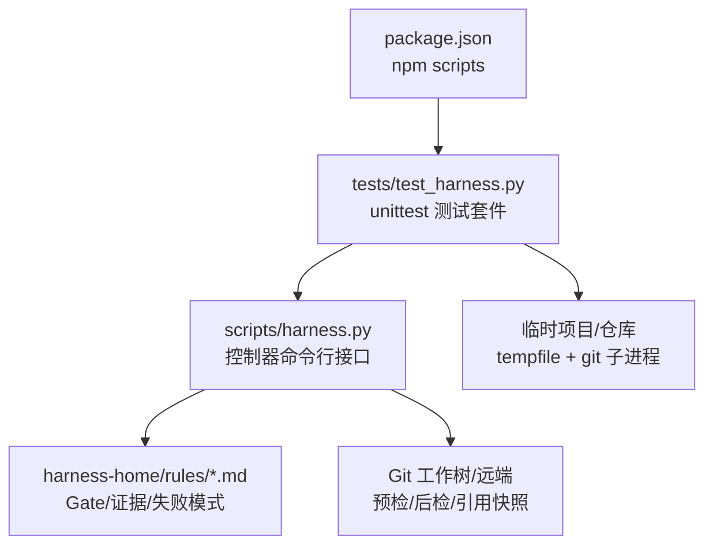
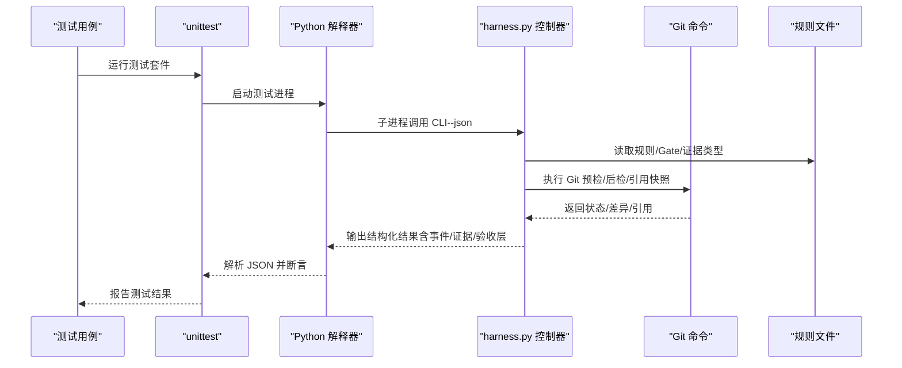
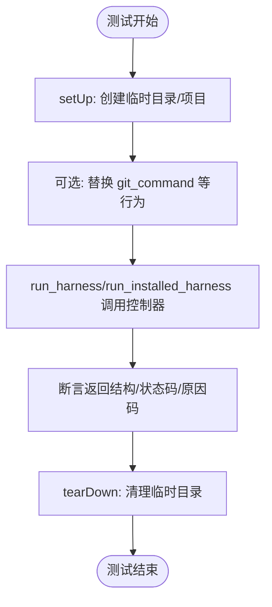
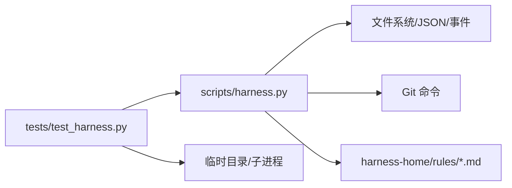

# 测试策略

<cite>
**本文引用的文件**   
- [tests/test_harness.py](file://tests/test_harness.py)
- [scripts/harness.py](file://scripts/harness.py)
- [package.json](file://package.json)
- [docs/testing.md](file://docs/testing.md)
- [harness-home/rules/testing-release.md](file://harness-home/rules/testing-release.md)
- [harness-home/rules/api-compatibility.md](file://harness-home/rules/api-compatibility.md)
- [harness-home/rules/documentation-changes.md](file://harness-home/rules/documentation-changes.md)
</cite>

## 目录
1. [引言](#引言)
2. [项目结构](#项目结构)
3. [核心组件](#核心组件)
4. [架构总览](#架构总览)
5. [详细组件分析](#详细组件分析)
6. [依赖分析](#依赖分析)
7. [性能考虑](#性能考虑)
8. [故障排查指南](#故障排查指南)
9. [结论](#结论)
10. [附录](#附录)

## 引言
本测试策略文档面向 Docs Harness 的测试体系，围绕“测试金字塔”分层（单元测试、集成测试、端到端测试）展开，明确测试框架选择与使用方式（unittest、mock、临时目录等）、测试数据管理（固定装置、用例定义、快照/指纹）、自动化流程（CI/CD、并行执行、覆盖率统计），以及性能与负载测试方法。同时总结最佳实践与常见问题解决方案，确保在复杂任务编排、Git 操作、证据链校验与 Gate 准入等关键路径上具备高可靠性和可观测性。

## 项目结构
- 测试入口与脚本
  - 通过 npm scripts 统一触发：完整回归、控制器自检、打包检查。
  - Python 测试由 unittest discover 自动发现 tests 目录下以 test_ 开头的模块。
- 被测控制器
  - scripts/harness.py 为独立任务控制器，提供 run/context/verify/task/background/project 等命令，贯穿任务生命周期与验收链路。
- 规则与门禁
  - harness-home/rules 下的规则文件定义了 Gate、证据类型、失败模式等约束，测试需覆盖这些规则的生效与失效路径。
- 测试事实与分层要求
  - docs/testing.md 明确了自动化入口、验收分层与事实来源，指导测试覆盖范围与断言要点。

**图示来源** 
- [package.json:17-21](file://package.json#L17-L21)
- [tests/test_harness.py:17-24](file://tests/test_harness.py#L17-L24)
- [scripts/harness.py:1-100](file://scripts/harness.py#L1-L100)
- [docs/testing.md:1-25](file://docs/testing.md#L1-L25)

**章节来源**
- [package.json:17-21](file://package.json#L17-L21)
- [docs/testing.md:1-25](file://docs/testing.md#L1-L25)

## 核心组件
- 测试基类与夹具
  - DocsHarnessContractTest 提供 setUp/tearDown、run_harness/run_installed_harness、snapshot_tree、bootstrap_knowledge、init_project、evidence、quality_review 等通用能力，支撑各层测试快速构建隔离环境。
- 控制器与契约
  - harness.py 暴露 VERSION、TASK_SCHEMA、事件/证据/计划/背景作业等常量与函数族，承担意图识别、Gate 匹配、范围绑定、上下文缓存、验证收据、Git 预检/后检、遥测事件等职责。
- 规则与门禁
  - testing-release.md、api-compatibility.md、documentation-changes.md 等规则文件定义 Gate、证据类型、失败模式，测试需覆盖其生效条件与拒绝路径。

**章节来源**
- [tests/test_harness.py:47-163](file://tests/test_harness.py#L47-L163)
- [scripts/harness.py:26-100](file://scripts/harness.py#L26-L100)
- [harness-home/rules/testing-release.md:1-29](file://harness-home/rules/testing-release.md#L1-L29)
- [harness-home/rules/api-compatibility.md:1-29](file://harness-home/rules/api-compatibility.md#L1-L29)
- [harness-home/rules/documentation-changes.md:1-29](file://harness-home/rules/documentation-changes.md#L1-L29)

## 架构总览
Docs Harness 的测试架构遵循“测试金字塔”：
- 单元测试：针对控制器内部函数（如 Git 预检/后检、输入加载、JSON 读写、哈希计算、安全底线推断等）进行快速、隔离验证。
- 集成测试：通过 subprocess 调用控制器 CLI，驱动 run/context/verify/task 等命令，验证多阶段协作、证据链、授权与 Gate 决策。
- 端到端测试：基于临时 Git 仓库与真实命令（git fetch/pull/merge），覆盖安装、升级、知识引导、后台 Job、路由治理、交付层级等全链路场景。

**图示来源** 
- [tests/test_harness.py:59-87](file://tests/test_harness.py#L59-L87)
- [scripts/harness.py:572-583](file://scripts/harness.py#L572-L583)
- [scripts/harness.py:677-791](file://scripts/harness.py#L677-L791)
- [harness-home/rules/testing-release.md:1-29](file://harness-home/rules/testing-release.md#L1-L29)

## 详细组件分析

### 测试金字塔与分层策略
- 单元测试
  - 目标：验证纯函数与工具方法（如 sha256_text、atomic_write_json、load_input_file、sanitized_remote_fingerprint、infer_floor_gates 等）。
  - 方法：直接 import harness 模块中的函数，构造输入并断言返回值或异常。
  - 关注点：边界条件、错误码、大小限制、非法输入、正则匹配、时间戳格式。
- 集成测试
  - 目标：验证 run/context/verify/task 等命令的组合行为、证据链完整性、Gate 决策与授权、上下文缓存命中、遥测事件。
  - 方法：通过 run_harness/run_installed_harness 调用 CLI，构造 facts/plan/evidence，断言返回结构与 reason_code。
  - 关注点：admission_status、mutation_profile、matched_gates、completion_manifest、delivery_layers、known_limit_codes。
- 端到端测试
  - 目标：覆盖安装/升级、知识引导、后台 Job、文档路由、Git 同步、交付层级、归档/修剪、取消幂等性等全链路。
  - 方法：创建临时项目与裸仓库，模拟远端变更、脏工作区、非快进合并、LFS/Submodule 不可用等场景。
  - 关注点：快照一致性、引用不变性、漂移检测、失败关闭、幂等性与回滚窗口。

**章节来源**
- [tests/test_harness.py:47-163](file://tests/test_harness.py#L47-L163)
- [tests/test_harness.py:5000-5730](file://tests/test_harness.py#L5000-L5730)
- [scripts/harness.py:421-435](file://scripts/harness.py#L421-L435)
- [scripts/harness.py:446-504](file://scripts/harness.py#L446-L504)
- [scripts/harness.py:585-610](file://scripts/harness.py#L585-L610)

### 测试框架与工具使用
- unittest 框架
  - 使用 TestCase 子类组织测试，setUp/tearDown 管理临时目录与项目初始化。
  - maxDiff 用于大对象对比，assertEqual/assertIn/assertRegex 等断言覆盖结构化输出。
- mock 对象
  - 对 git_command 等外部依赖进行替换，模拟 LFS/Submodule 不可用、超时、失败路径。
- 临时目录与文件系统
  - tempfile.TemporaryDirectory 保证隔离；Path.write_text/read_text 写入 JSON/Markdown；snapshot_tree 生成目录快照（含符号链接与文件哈希）。
- 子进程与 Git
  - subprocess.run 调用 python 解释器与 git 命令，设置环境变量 PYTHONDONTWRITEBYTECODE 避免字节码干扰。

**图示来源** 
- [tests/test_harness.py:50-57](file://tests/test_harness.py#L50-L57)
- [tests/test_harness.py:59-87](file://tests/test_harness.py#L59-L87)
- [tests/test_harness.py:94-106](file://tests/test_harness.py#L94-L106)
- [scripts/harness.py:572-583](file://scripts/harness.py#L572-L583)

**章节来源**
- [tests/test_harness.py:47-163](file://tests/test_harness.py#L47-L163)
- [tests/test_harness.py:736-757](file://tests/test_harness.py#L736-L757)

### 测试数据管理
- 固定装置（Fixtures）
  - bootstrap_knowledge：生成 features/shared/knowledge-map 等基础内容。
  - init_project：初始化项目结构、默认配置、背景 Job 基线。
  - evidence/quality_review：构造证据与质量审查记录，支持 covers、changed_paths、read_set、concurrent_drift、producer 等字段。
- 用例定义
  - 每个测试方法聚焦单一场景（如只读查询、审计、Git fetch/sync、分支删除、混合意图、安全审计、漂移处理、v1/v2 迁移、遥测有界性、Gate 评估、归档/修剪、取消幂等、交付层级、自动归因、声明草稿等）。
- 快照与指纹
  - snapshot_tree：递归遍历目录，生成相对路径到内容摘要的映射（目录、符号链接、文件 sha256）。
  - file_fingerprint/sha256_text：用于文件与文本指纹，保障幂等与一致性。

**章节来源**
- [tests/test_harness.py:108-163](file://tests/test_harness.py#L108-L163)
- [tests/test_harness.py:248-304](file://tests/test_harness.py#L248-L304)
- [tests/test_harness.py:94-106](file://tests/test_harness.py#L94-L106)
- [scripts/harness.py:407-417](file://scripts/harness.py#L407-L417)

### 自动化测试流程（CI/CD）
- 入口命令
  - npm test：discover 模式运行 tests 下所有 test_*.py。
  - npm run self-test：调用控制器 self-test 校验规则与版本。
  - npm run pack:check：dry-run 打包检查，确保发布清单正确。
- 并行执行
  - unittest discover 支持 -p 参数与并发选项（可通过 pytest/unittest 扩展实现并行，当前脚本未显式启用）。
- 覆盖率统计
  - 可在 CI 中引入 coverage.py 收集覆盖率，结合 .coverage 与报告生成步骤。
- 建议
  - 将 npm test/self-test/pack:check 作为 PR 必检流水线；按需增加覆盖率阈值与慢测试隔离。

**章节来源**
- [package.json:17-21](file://package.json#L17-L21)
- [docs/testing.md:3-8](file://docs/testing.md#L3-L8)

### 性能与负载测试方法
- 性能关注点
  - 上下文缓存命中（context_cache_hit）、验证命令复用、事件计数（verification_attempt/evidence_round_count）、package revision 变化导致的重新准入。
- 指标采集
  - 通过 events.jsonl 与 verified.delivery_layers/known_limit_codes 复算 verify 轮次、命令缓存命中与 readmission 分类。
- 负载测试
  - 批量创建任务与证据，观察 verify 耗时与事件增长；模拟远端漂移与脏工作区，验证失败关闭与重试路径。
- 优化建议
  - 减少不必要的上下文重加载；按命令粒度缓存已通过收据；限制遥测体积与敏感信息泄露。

**章节来源**
- [tests/test_harness.py:950-972](file://tests/test_harness.py#L950-L972)
- [tests/test_harness.py:1122-1163](file://tests/test_harness.py#L1122-L1163)
- [scripts/harness.py:153-175](file://scripts/harness.py#L153-L175)

### 最佳实践与常见问题
- 最佳实践
  - 使用临时目录与最小化 fixtures，确保测试隔离与可重复性。
  - 对 Git 操作进行预检/后检断言，避免隐式状态污染。
  - 严格断言 reason_code、admission_status、matched_gates、delivery_layers 等关键字段。
  - 使用 snapshot_tree/file_fingerprint 保障快照一致性与幂等。
  - 对高风险 Gate（security-sensitive/destructive-data/release-external）进行失败关闭验证。
- 常见问题
  - 证据过期/跨包绑定/不受信生产者：应断言对应 code（如 evidence_expired/evidence_binding_mismatch/untrusted_evidence_producer）。
  - Git 漂移/非快进/脏工作区：应断言 blocked 原因与 git_postcheck 检查结果。
  - v1/v2 迁移：预览/应用/回滚路径需覆盖，确保事务性与可恢复。
  - 遥测泄漏：确保事件不包含敏感文本，仅保留受控原因码与指纹。

**章节来源**
- [tests/test_harness.py:984-1051](file://tests/test_harness.py#L984-L1051)
- [tests/test_harness.py:685-735](file://tests/test_harness.py#L685-L735)
- [tests/test_harness.py:1052-1121](file://tests/test_harness.py#L1052-L1121)
- [tests/test_harness.py:1122-1163](file://tests/test_harness.py#L1122-L1163)

## 依赖分析
- 测试套件依赖控制器 CLI 与 Git 命令，间接依赖规则文件。
- 控制器依赖文件系统、subprocess、hashlib、datetime、re、urllib.parse 等标准库。
- 规则文件通过 Gate/证据类型/失败模式影响控制器行为，测试需覆盖其生效与拒绝路径。

**图示来源** 
- [tests/test_harness.py:59-87](file://tests/test_harness.py#L59-L87)
- [scripts/harness.py:1-100](file://scripts/harness.py#L1-L100)
- [harness-home/rules/testing-release.md:1-29](file://harness-home/rules/testing-release.md#L1-L29)

**章节来源**
- [tests/test_harness.py:59-87](file://tests/test_harness.py#L59-L87)
- [scripts/harness.py:1-100](file://scripts/harness.py#L1-L100)

## 性能考虑
- 上下文缓存：同一 stage 多次 context 调用应命中缓存，减少重复加载。
- 验证命令复用：已通过命令不应因补证而重跑，按输入指纹与 TTL 控制失效。
- 事件与遥测：限制事件大小与字段，避免敏感信息泄露，便于复算与诊断。
- Git 操作：预检/后检应尽早失败，减少不必要的工作树变更。

[本节为通用指导，不直接分析具体文件]

## 故障排查指南
- 常见错误码与原因
  - evidence_expired：证据过期，需刷新或重新生成。
  - evidence_binding_mismatch：证据与任务包绑定不一致。
  - untrusted_evidence_producer：不受信的生产者。
  - git_preflight_timeout/git_remote_unavailable：Git 预检超时或远端不可用。
  - invalid_scope_description：范围描述非法。
  - git_remote_drift/unattributed_drift_overlap：远端漂移或未归因漂移重叠。
  - legacy_task_requires_migration：旧版任务需要迁移。
- 排查步骤
  - 查看控制器输出 JSON 的 reason_code 与 blockers。
  - 检查 events.jsonl 与 evidence-index.json 定位失败轮次与证据缺失。
  - 使用 snapshot_tree 对比工作树差异，确认漂移来源。
  - 对 Git 相关失败，检查 remote URL、refs 快照与工作区状态。

**章节来源**
- [tests/test_harness.py:984-1051](file://tests/test_harness.py#L984-L1051)
- [tests/test_harness.py:685-735](file://tests/test_harness.py#L685-L735)
- [tests/test_harness.py:1052-1121](file://tests/test_harness.py#L1052-L1121)

## 结论
本测试策略以 unittest 为核心框架，结合临时目录、mock 与子进程调用，构建了覆盖单元、集成与端到端的完整测试金字塔。通过规则驱动的 Gate/证据/失败模式，确保在复杂任务编排、Git 操作与证据链校验上的高可靠性。建议在 CI/CD 中统一入口命令，逐步引入并行执行与覆盖率统计，并结合性能与负载测试持续优化控制器效率与稳定性。

[本节为总结性内容，不直接分析具体文件]

## 附录
- 参考命令
  - npm test：运行全部测试。
  - npm run self-test：控制器自检。
  - npm run pack:check：打包检查。
- 关键断言要点
  - admission_status/mutation_profile/matched_gates/delivery_layers/known_limit_codes。
  - reason_code/blockers/events/evidence-index。
  - snapshot_tree/file_fingerprint/git_postcheck。

**章节来源**
- [package.json:17-21](file://package.json#L17-L21)
- [docs/testing.md:1-25](file://docs/testing.md#L1-L25)