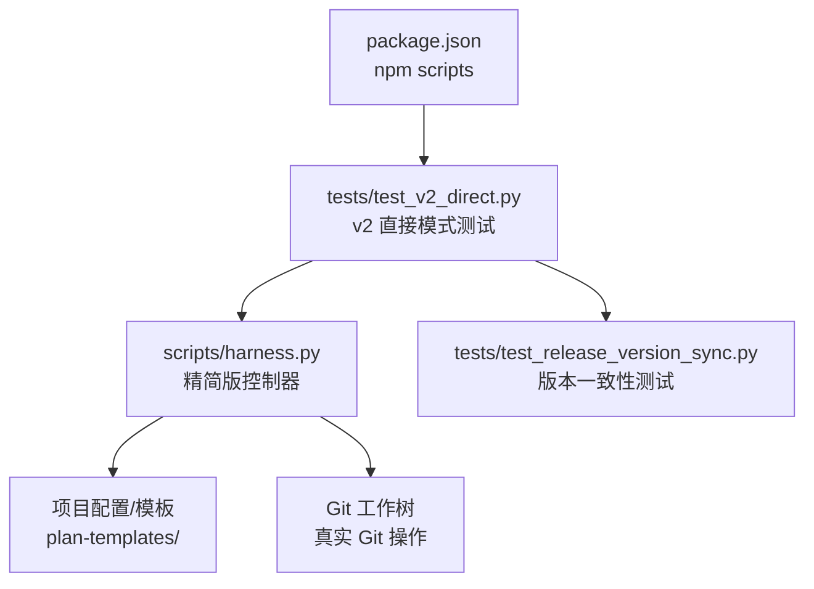
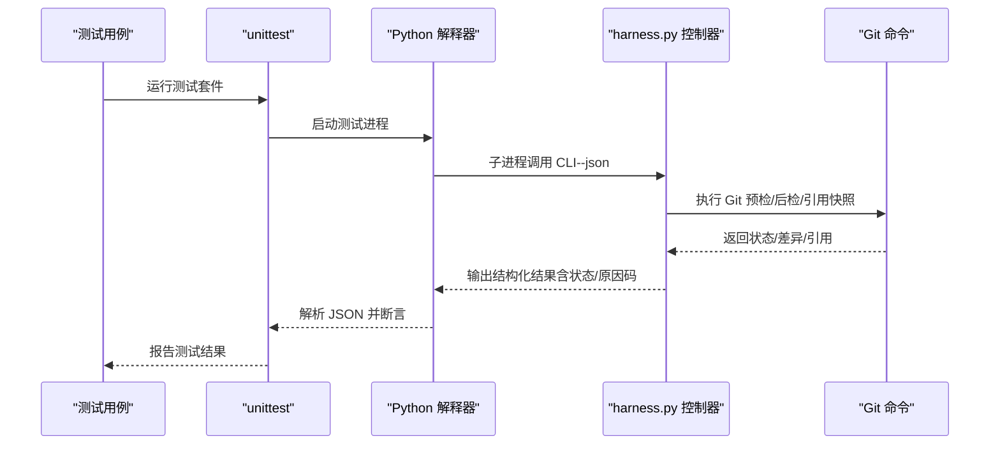
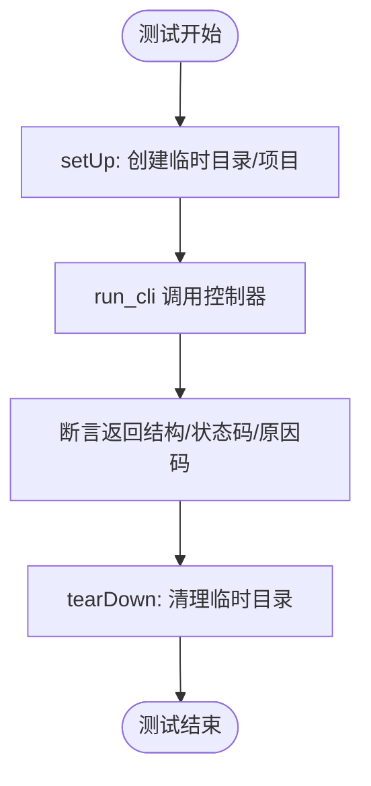
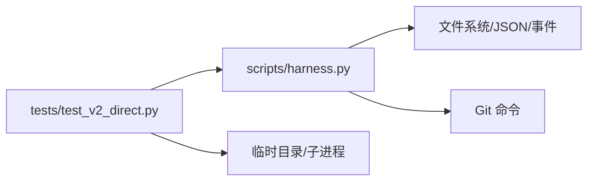

# 测试策略

<cite>
**本文引用的文件**   
- [tests/test_v2_direct.py](file://tests/test_v2_direct.py)
- [tests/test_release_version_sync.py](file://tests/test_release_version_sync.py)
- [scripts/harness.py](file://scripts/harness.py)
- [package.json](file://package.json)
- [docs/testing.md](file://docs/testing.md)
</cite>

## 更新摘要
**所做更改**
- 移除了对已删除的综合测试套件 tests/test_harness.py 的所有引用
- 更新了测试架构描述以反映新的直接模式优先架构
- 简化了测试金字塔描述，聚焦于 v2 直接模式的测试策略
- 更新了自动化测试流程以反映当前测试结构
- 调整了性能与负载测试方法以适应新的架构

## 目录
1. [引言](#引言)
2. [项目结构](#项目结构)
3. [核心组件](#核心组件)
4. [架构总览](#架构总览)
5. [详细组件分析](#详细组件分析)
6. [依赖分析](#依赖分析)
7. [性能考虑](#性能考虑)
8. [故障排查指南](#故障排查指南)
9. [结论](#结论)
10. [附录](#附录)

## 引言
本测试策略文档面向 Docs Harness 2.0.0 的直接模式优先架构，围绕精简化的测试体系展开。新版本移除了复杂的任务编排和状态机逻辑，转而采用更直接的命令执行方式。测试重点集中在知识查询、方案管理、验收记录、项目初始化和迁移清理等核心功能上，确保在简化架构下仍具备高可靠性和可观测性。

## 项目结构
- **测试入口与脚本**
  - 通过 npm scripts 统一触发：完整回归、控制器自检、打包检查。
  - Python 测试由 unittest discover 自动发现 tests 目录下以 test_ 开头的模块。
- **被测控制器**
  - scripts/harness.py 为精简版控制器，提供 knowledge/plan/acceptance/project/release/self-test 等命令，专注于直接模式下的文档处理。
- **测试分层要求**
  - docs/testing.md 明确了聚焦测试、完整回归、控制器自检、发布包清单和版本一致性验证的入口点。

**图示来源** 
- [package.json:25-29](file://package.json#L25-L29)
- [tests/test_v2_direct.py:17-108](file://tests/test_v2_direct.py#L17-L108)
- [scripts/harness.py:1-50](file://scripts/harness.py#L1-L50)
- [docs/testing.md:9-15](file://docs/testing.md#L9-L15)

**章节来源**
- [package.json:25-29](file://package.json#L25-L29)
- [docs/testing.md:9-15](file://docs/testing.md#L9-L15)

## 核心组件
- **测试基类与夹具**
  - DocsHarnessV2DirectTest 提供 setUp/tearDown、run_cli、write_json、snapshot_project、write_v5_install 等通用能力，支撑 v2 直接模式测试快速构建隔离环境。
- **控制器契约**
  - harness.py 暴露 VERSION、CONFIG_SCHEMA、PLAN_TEMPLATE_SCHEMA、ACCEPTANCE_INPUT_SCHEMA 等常量，承担知识查询、方案选择、验收记录、项目初始化、升级迁移等职责。
- **测试数据管理**
  - 使用临时目录和项目快照确保测试隔离，支持 v5 到 v6 配置的迁移测试。

**章节来源**
- [tests/test_v2_direct.py:17-108](file://tests/test_v2_direct.py#L17-L108)
- [scripts/harness.py:22-31](file://scripts/harness.py#L22-L31)

## 架构总览
Docs Harness 2.0.0 的测试架构遵循精简化的"测试金字塔"：
- **单元测试**：针对控制器内部函数（如 JSON 读写、哈希计算、路径验证、安全边界检查等）进行快速、隔离验证。
- **集成测试**：通过 subprocess 调用控制器 CLI，驱动 knowledge/plan/acceptance/project 等命令，验证直接模式下的核心功能。
- **端到端测试**：基于临时 Git 仓库与真实命令，覆盖安装、升级、知识引导、验收记录等全链路场景。

**图示来源** 
- [tests/test_v2_direct.py:98-108](file://tests/test_v2_direct.py#L98-L108)
- [scripts/harness.py:105-164](file://scripts/harness.py#L105-L164)

## 详细组件分析

### 测试金字塔与分层策略
- **单元测试**
  - 目标：验证纯函数与工具方法（如 sha256_bytes、sha256_json、read_json、atomic_write_text、safe_target 等）。
  - 方法：直接 import harness 模块中的函数，构造输入并断言返回值或异常。
  - 关注点：边界条件、错误码、大小限制、非法输入、路径验证。
- **集成测试**
  - 目标：验证 knowledge/plan/acceptance/project 等命令的行为，确保直接模式下的核心功能正确性。
  - 方法：通过 run_cli 调用控制器 CLI，构造输入参数，断言返回结构与状态码。
  - 关注点：admission_status、reason_code、status、changes 等关键字段。
- **端到端测试**
  - 目标：覆盖安装/升级、知识查询、方案创建、验收记录、Git 同步等全链路场景。
  - 方法：创建临时项目与裸仓库，模拟真实用户场景和边界情况。
  - 关注点：幂等性、安全性、冲突检测、权限控制。

**章节来源**
- [tests/test_v2_direct.py:110-133](file://tests/test_v2_direct.py#L110-L133)
- [tests/test_v2_direct.py:135-179](file://tests/test_v2_direct.py#L135-L179)
- [tests/test_v2_direct.py:308-349](file://tests/test_v2_direct.py#L308-L349)

### 测试框架与工具使用
- **unittest 框架**
  - 使用 TestCase 子类组织测试，setUp/tearDown 管理临时目录与项目初始化。
  - maxDiff 用于大对象对比，assertEqual/assertIn/assertRegex 等断言覆盖结构化输出。
- **子进程与 Git**
  - subprocess.run 调用 python 解释器与 git 命令，设置环境变量 PYTHONDONTWRITEBYTECODE 避免字节码干扰。
- **临时目录与文件系统**
  - tempfile.TemporaryDirectory 保证隔离；Path.write_text/read_text 写入 JSON/Markdown；snapshot_project 生成项目快照。

**图示来源** 
- [tests/test_v2_direct.py:37-43](file://tests/test_v2_direct.py#L37-L43)
- [tests/test_v2_direct.py:98-108](file://tests/test_v2_direct.py#L98-L108)

**章节来源**
- [tests/test_v2_direct.py:37-43](file://tests/test_v2_direct.py#L37-L43)
- [tests/test_v2_direct.py:98-108](file://tests/test_v2_direct.py#L98-L108)

### 测试数据管理
- **固定装置（Fixtures）**
  - write_v5_install：生成 v5 版本的安装配置，用于测试升级到 v6 的场景。
  - write_json：创建测试所需的 JSON 配置文件。
  - snapshot_project：生成项目快照，用于验证变更和幂等性。
- **用例定义**
  - 每个测试方法聚焦单一场景（如知识查询、方案选择、验收记录、项目初始化、升级迁移等）。
- **快照与指纹**
  - snapshot_project：递归遍历目录，生成相对路径到内容摘要的映射（目录、符号链接、文件 sha256）。
  - file_fingerprint/sha256_bytes：用于文件与文本指纹，保障幂等与一致性。

**章节来源**
- [tests/test_v2_direct.py:45-61](file://tests/test_v2_direct.py#L45-L61)
- [tests/test_v2_direct.py:63-96](file://tests/test_v2_direct.py#L63-L96)
- [scripts/harness.py:113-122](file://scripts/harness.py#L113-L122)

### 自动化测试流程（CI/CD）
- **入口命令**
  - npm test：discover 模式运行 tests 下所有 test_*.py。
  - npm run self-test：调用控制器 self-test 校验规则与版本。
  - npm run pack:check：dry-run 打包检查，确保发布清单正确。
- **并行执行**
  - unittest discover 支持并发选项，可通过 pytest/unittest 扩展实现并行执行。
- **覆盖率统计**
  - 可在 CI 中引入 coverage.py 收集覆盖率，结合 .coverage 与报告生成步骤。
- **建议**
  - 将 npm test/self-test/pack:check 作为 PR 必检流水线；按需增加覆盖率阈值与慢测试隔离。

**章节来源**
- [package.json:25-29](file://package.json#L25-L29)
- [docs/testing.md:9-15](file://docs/testing.md#L9-L15)

### 性能与负载测试方法
- **性能关注点**
  - 知识查询的有界性（limit、max-chars）、方案选择的效率、验收记录的验证速度。
- **指标采集**
  - 通过控制器输出的状态码、原因码和执行时间评估性能。
- **负载测试**
  - 批量创建方案和验收记录，观察控制器响应时间和资源消耗。
- **优化建议**
  - 减少不必要的文件扫描和 Git 操作；按命令粒度缓存已通过的结果；限制遥测体积。

**章节来源**
- [tests/test_v2_direct.py:135-179](file://tests/test_v2_direct.py#L135-L179)
- [scripts/harness.py:105-164](file://scripts/harness.py#L105-L164)

### 最佳实践与常见问题
- **最佳实践**
  - 使用临时目录与最小化 fixtures，确保测试隔离与可重复性。
  - 对 Git 操作进行预检/后检断言，避免隐式状态污染。
  - 严格断言 status、reason_code、changes 等关键字段。
  - 使用 snapshot_project/file_fingerprint 保障快照一致性与幂等。
  - 对安全风险（符号链接、路径越界、外部引用）进行失败关闭验证。
- **常见问题**
  - 无效输入：应断言对应 code（如 invalid_json、invalid_target、invalid_plan_selection）。
  - 权限冲突：应断言 install_conflict、legacy_document_cleanup_conflict 等错误码。
  - 迁移失败：预览/应用/回滚路径需覆盖，确保事务性与可恢复。
  - 版本不一致：确保 VERSION、package.json、SKILL.md、evals.json 保持一致。

**章节来源**
- [tests/test_v2_direct.py:110-133](file://tests/test_v2_direct.py#L110-L133)
- [tests/test_v2_direct.py:308-349](file://tests/test_v2_direct.py#L308-L349)
- [tests/test_release_version_sync.py:22-31](file://tests/test_release_version_sync.py#L22-L31)

## 依赖分析
- **测试套件依赖控制器 CLI 与 Git 命令**。
- **控制器依赖文件系统、subprocess、hashlib、datetime、re 等标准库**。
- **测试数据依赖项目配置、模板文件和 Git 仓库状态**。

**图示来源** 
- [tests/test_v2_direct.py:98-108](file://tests/test_v2_direct.py#L98-L108)
- [scripts/harness.py:1-50](file://scripts/harness.py#L1-L50)

**章节来源**
- [tests/test_v2_direct.py:98-108](file://tests/test_v2_direct.py#L98-L108)
- [scripts/harness.py:1-50](file://scripts/harness.py#L1-L50)

## 性能考虑
- **知识查询优化**：限制查询结果数量和字符数，避免过度扫描文档。
- **方案选择效率**：基于复杂度和服务面快速筛选合适的方案模板。
- **验收记录验证**：轻量级验证证据文件存在性和格式正确性。
- **Git 操作优化**：预检/后检应尽早失败，减少不必要的工作树变更。

## 故障排查指南
- **常见错误码与原因**
  - invalid_json：JSON 格式错误。
  - invalid_target：目标目录不存在或不是有效目录。
  - invalid_plan_selection：方案选择不合法。
  - install_conflict：安装冲突，检测到外部文件或符号链接。
  - legacy_document_cleanup_conflict：遗留文档清理冲突。
  - acceptance_evidence_missing：验收证据缺失。
  - user_confirmation_required：需要用户确认。
- **排查步骤**
  - 查看控制器输出 JSON 的 reason_code 与 blockers。
  - 检查临时项目结构和 Git 状态。
  - 使用 snapshot_project 对比工作区差异，确认变更来源。
  - 对 Git 相关失败，检查 remote URL、refs 快照与工作区状态。

**章节来源**
- [tests/test_v2_direct.py:110-133](file://tests/test_v2_direct.py#L110-L133)
- [tests/test_v2_direct.py:308-349](file://tests/test_v2_direct.py#L308-L349)
- [tests/test_v2_direct.py:606-769](file://tests/test_v2_direct.py#L606-L769)

## 结论
Docs Harness 2.0.0 的测试策略已从复杂的状态机驱动架构转向精简的直接模式优先架构。通过移除 7,984 行的综合测试套件，替换为 772 行的聚焦测试，新架构更加清晰、易于维护且性能更优。测试重点集中在知识查询、方案管理、验收记录和项目初始化等核心功能上，确保在简化架构下仍具备高可靠性和可观测性。建议在 CI/CD 中统一入口命令，逐步引入并行执行与覆盖率统计，并结合性能测试持续优化控制器效率与稳定性。

## 附录
- **参考命令**
  - npm test：运行全部测试。
  - npm run self-test：控制器自检。
  - npm run pack:check：打包检查。
- **关键断言要点**
  - status/reason_code/changes/accepted_layer。
  - snapshot_project/file_fingerprint/git_postcheck。
  - 版本一致性：VERSION、package.json、SKILL.md、evals.json。

**章节来源**
- [package.json:25-29](file://package.json#L25-L29)
- [docs/testing.md:9-15](file://docs/testing.md#L9-L15)
- [tests/test_release_version_sync.py:22-31](file://tests/test_release_version_sync.py#L22-L31)