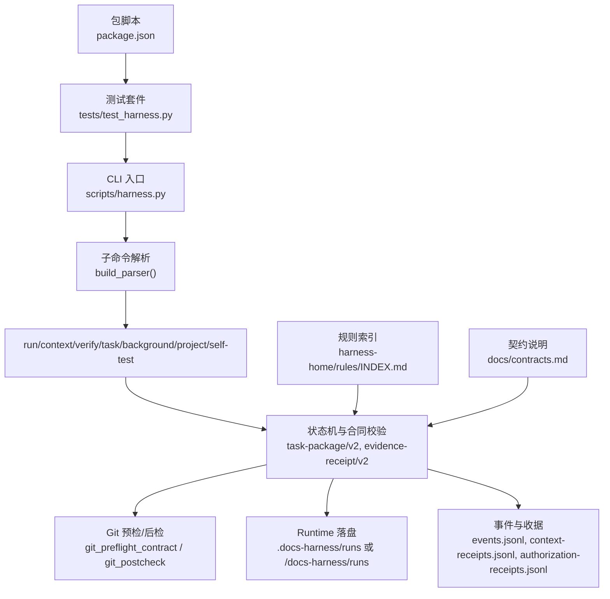
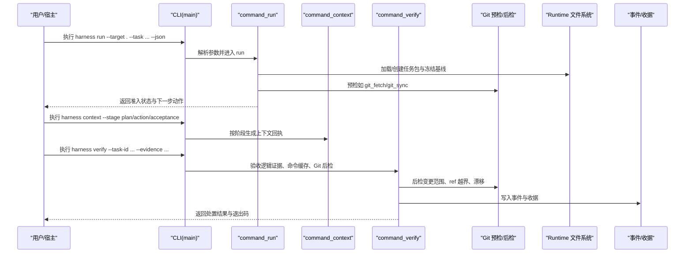
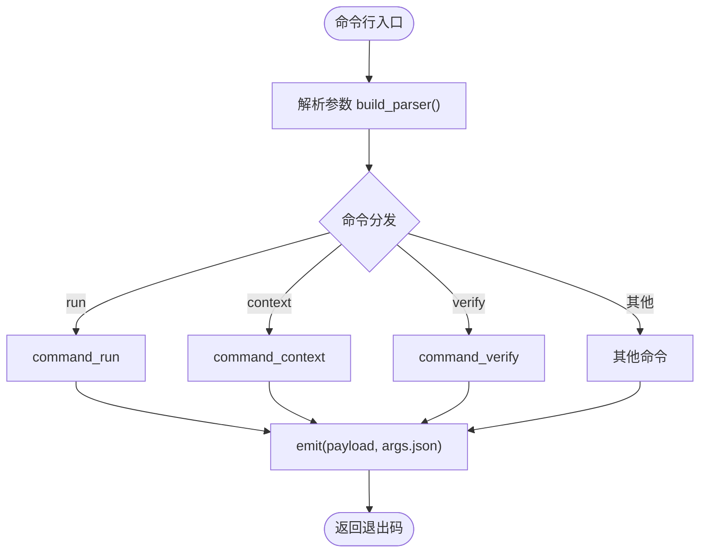
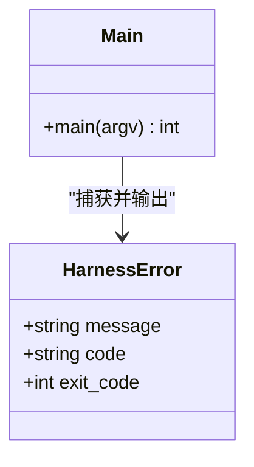
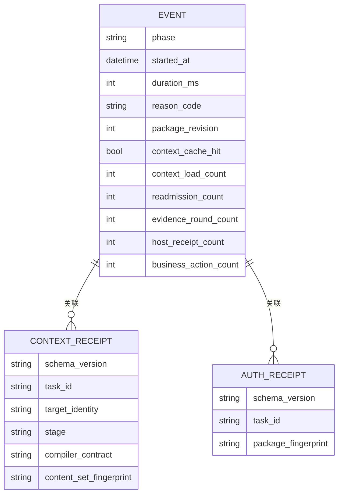
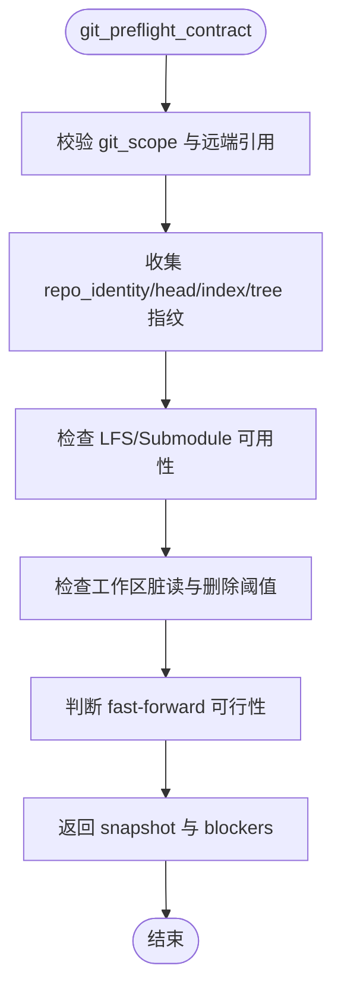
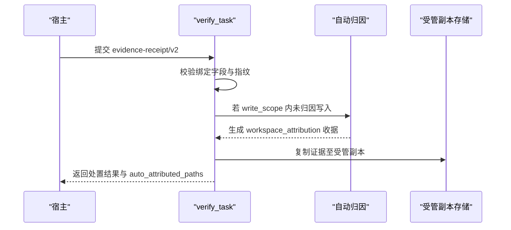
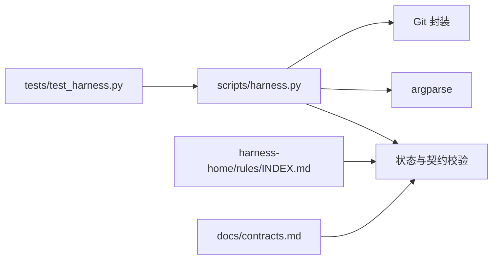

# 调试工具

<cite>
**本文引用的文件**   
- [scripts/harness.py](file://scripts/harness.py)
- [tests/test_harness.py](file://tests/test_harness.py)
- [package.json](file://package.json)
- [SKILL.md](file://SKILL.md)
- [docs/contracts.md](file://docs/contracts.md)
- [harness-home/rules/INDEX.md](file://harness-home/rules/INDEX.md)
</cite>

## 目录
1. [简介](#简介)
2. [项目结构](#项目结构)
3. [核心组件](#核心组件)
4. [架构总览](#架构总览)
5. [详细组件分析](#详细组件分析)
6. [依赖关系分析](#依赖关系分析)
7. [性能考虑](#性能考虑)
8. [故障排除指南](#故障排除指南)
9. [结论](#结论)
10. [附录](#附录)

## 简介
本文件面向 Docs Harness 的调试与排障，聚焦以下能力：
- 内置调试输出与结构化错误：统一 JSON 输出、退出码约定、错误码与原因码。
- 日志分析方法：事件与收据的结构化字段、关键信息提取、问题定位技巧。
- 调试器使用建议：Python 调试器集成、断点设置、变量检查（基于通用 Python 调试实践）。
- 性能分析建议：CPU、内存、I/O 监控思路与常用工具（通用指导）。
- 常见问题流程：从 CLI 到 Runtime 的端到端排查路径。
- 辅助脚本与命令：self-test、任务与后台 Job 管理、质量账本等。

## 项目结构
Docs Harness 以独立 Python 控制器为核心，配合测试、规则与文档契约，形成“意图优先、证据可复用且失败关闭”的控制面。

图表来源
- [scripts/harness.py:10175-10375](file://scripts/harness.py#L10175-L10375)
- [docs/contracts.md:1-370](file://docs/contracts.md#L1-L370)
- [harness-home/rules/INDEX.md:1-41](file://harness-home/rules/INDEX.md#L1-L41)
- [tests/test_harness.py:1-120](file://tests/test_harness.py#L1-L120)
- [package.json:1-23](file://package.json#L1-L23)

章节来源
- [scripts/harness.py:10175-10375](file://scripts/harness.py#L10175-L10375)
- [docs/contracts.md:1-370](file://docs/contracts.md#L1-L370)
- [harness-home/rules/INDEX.md:1-41](file://harness-home/rules/INDEX.md#L1-L41)
- [tests/test_harness.py:1-120](file://tests/test_harness.py#L1-L120)
- [package.json:1-23](file://package.json#L1-L23)

## 核心组件
- CLI 与命令路由：统一的 argparse 构建与分发，支持 --json 结构化输出。
- 任务生命周期：run → context → verify → task（status/cancel/archive/list/prune）→ background（estimate/list/status/prepare/progress/dispatch/verify/retry/prune）。
- Git 控制面：pre/post check、ref 受控范围、漂移检测、fast-forward 约束。
- 证据与上下文：evidence-receipt/v2、context-receipt/v2、authorization-receipt/v2。
- 规则与契约：active 规则快照、文档契约、版本与指纹一致性。

章节来源
- [scripts/harness.py:10175-10375](file://scripts/harness.py#L10175-L10375)
- [docs/contracts.md:1-370](file://docs/contracts.md#L1-L370)
- [harness-home/rules/INDEX.md:1-41](file://harness-home/rules/INDEX.md#L1-L41)

## 架构总览
下图展示一次典型 run → verify 的调用链与数据流，便于理解调试切入点。

图表来源
- [scripts/harness.py:10337-10375](file://scripts/harness.py#L10337-L10375)
- [docs/contracts.md:1-370](file://docs/contracts.md#L1-L370)

## 详细组件分析

### CLI 与调试输出
- 所有命令均支持 --json，输出为结构化 JSON；非 JSON 模式逐行打印键值对。
- 错误通过 HarnessError 抛出，统一以 {"status":"error","code":...,"message":...} 输出，并返回对应退出码。
- 常见退出码：0 成功；1 项目检查失败；2 输入/合同无效；3 需要方案/授权/证据/Git 交付；4 必须重新准入。

图表来源
- [scripts/harness.py:10175-10375](file://scripts/harness.py#L10175-L10375)

章节来源
- [scripts/harness.py:10175-10375](file://scripts/harness.py#L10175-L10375)

### 错误处理与堆栈信息
- 所有异常统一包装为 HarnessError，包含 code、exit_code、message。
- 文件读取、JSON 解析、Git 操作、目标目录校验等均抛出带语义 code 的错误。
- 主入口捕获 HarnessError，输出结构化错误并返回 exit_code。

图表来源
- [scripts/harness.py:392-397](file://scripts/harness.py#L392-L397)
- [scripts/harness.py:10337-10375](file://scripts/harness.py#L10337-L10375)

章节来源
- [scripts/harness.py:392-397](file://scripts/harness.py#L392-L397)
- [scripts/harness.py:10337-10375](file://scripts/harness.py#L10337-L10375)

### 日志与事件分析
- 事件采用 docs-harness/event/v2，仅保存有界字段（phase、started_at、duration_ms、reason_code、package_revision、各计数等），不记录敏感内容。
- 收据包括 context-receipts.jsonl、authorization-receipts.jsonl、evidence-index.json 等，用于审计与溯源。
- 验证命令收据 docs-harness/verification-command-receipt/v1 支持缓存命中，避免重复执行。

图表来源
- [docs/contracts.md:283-301](file://docs/contracts.md#L283-L301)
- [docs/contracts.md:222-234](file://docs/contracts.md#L222-L234)

章节来源
- [docs/contracts.md:283-301](file://docs/contracts.md#L283-L301)
- [docs/contracts.md:222-234](file://docs/contracts.md#L222-L234)

### Git 预检与后检（调试关键点）
- preflight：校验远端 refs、index、工作区、LFS/Submodule、删除阈值、fast-forward 等，返回 blockers 列表。
- postcheck：对比 ref 变化、工作区差异、是否越界，提供 passed 与 changed_refs/outside_refs。

图表来源
- [scripts/harness.py:677-791](file://scripts/harness.py#L677-L791)

章节来源
- [scripts/harness.py:677-791](file://scripts/harness.py#L677-L791)

### 证据与自动归因
- evidence-receipt/v2 绑定 task_id、target_identity、package_fingerprint、producer、cwd、起止时间、ttl、exit_code、digest、read/write_set。
- 在 write_scope 内未归因写入时，默认由控制器代铸 workspace_attribution 收据自动认领，可通过配置开关恢复补证据流程。

图表来源
- [docs/contracts.md:165-218](file://docs/contracts.md#L165-L218)

章节来源
- [docs/contracts.md:165-218](file://docs/contracts.md#L165-L218)

### 后台 Job 调试
- background 子命令覆盖 estimate/list/status/prepare/progress/dispatch/verify/retry/prune。
- 复杂路线需严格遵循 prepare → dispatched → running → progress → verify 序列。
- 工件损坏或被篡改时需显式 repair 修复。

章节来源
- [scripts/harness.py:10270-10284](file://scripts/harness.py#L10270-L10284)
- [docs/contracts.md:303-348](file://docs/contracts.md#L303-L348)

### 质量账本与自检
- ledger add/read：人工触发个人本地质量账本，支持按任务 ID 或文本检索。
- self-test：运行内置合同自检，验证 active 规则与版本一致性。

章节来源
- [scripts/harness.py:10249-10259](file://scripts/harness.py#L10249-L10259)
- [tests/test_harness.py:339-354](file://tests/test_harness.py#L339-L354)

## 依赖关系分析
- CLI 依赖 argparse 解析参数，命令函数依赖状态加载、契约校验、Git 工具封装。
- 测试套件通过 subprocess 调用 harness.py 并以 --json 输出进行断言。
- 规则索引与契约文档作为运行时约束依据。

图表来源
- [scripts/harness.py:10175-10375](file://scripts/harness.py#L10175-L10375)
- [tests/test_harness.py:1-120](file://tests/test_harness.py#L1-L120)
- [harness-home/rules/INDEX.md:1-41](file://harness-home/rules/INDEX.md#L1-L41)
- [docs/contracts.md:1-370](file://docs/contracts.md#L1-L370)

章节来源
- [scripts/harness.py:10175-10375](file://scripts/harness.py#L10175-L10375)
- [tests/test_harness.py:1-120](file://tests/test_harness.py#L1-L120)
- [harness-home/rules/INDEX.md:1-41](file://harness-home/rules/INDEX.md#L1-L41)
- [docs/contracts.md:1-370](file://docs/contracts.md#L1-L370)

## 性能考虑
- 事件与收据仅保留有界字段，避免大对象落盘，降低 I/O 压力。
- 验证命令收据缓存可减少重复执行成本。
- Git 预检/后检限制扫描范围与阈值，防止大规模 diff 与危险操作。
- 建议结合系统级工具（如 perf、py-spy、memory_profiler、iostat）进行 CPU/内存/I/O 观测（通用指导）。

[本节为通用性能建议，不直接分析具体文件]

## 故障排除指南
- 快速定位步骤
  - 使用 --json 获取结构化输出，关注 status、code、message、next_action、blockers。
  - 检查退出码含义：0/1/2/3/4 分别对应不同失败场景。
  - 查看 events.jsonl 与各类 receipts，确认阶段、耗时、原因码与计数。
- 常见问题
  - Git 预检失败：检查远端 URL、refs、LFS/Submodule、工作区脏读、删除阈值、fast-forward。
  - 证据未归因：确认 write_scope 与 auto_attribute_in_scope 配置，必要时补证据。
  - 规则缺失或指纹漂移：确保 harness-home/rules 完整且指纹一致。
  - 后台 Job 工件损坏：使用 background prepare --repair 修复。
- 调试器使用建议（通用 Python 调试实践）
  - 在 main() 或 command_* 函数处设置断点，观察 args、payload、state、package。
  - 使用 pdb 或 IDE 调试器附加进程，逐步执行 verify_task、git_preflight_contract 等关键函数。
  - 检查环境变量与临时文件，避免泄露敏感信息。

章节来源
- [scripts/harness.py:10337-10375](file://scripts/harness.py#L10337-L10375)
- [docs/contracts.md:359-370](file://docs/contracts.md#L359-L370)
- [tests/test_harness.py:59-87](file://tests/test_harness.py#L59-L87)

## 结论
Docs Harness 通过结构化输出、严格的契约与证据机制、以及完善的 Git 控制面，提供了可靠的调试与排障基础。结合事件与收据分析、CLI 命令与测试套件，可高效定位问题并优化流程。

[本节为总结性内容，不直接分析具体文件]

## 附录
- 常用命令参考
  - self-test：npm run self-test 或 python3 scripts/harness.py self-test --target . --json
  - run/context/verify/task/background/project：见 CLI 定义
- 相关文件
  - SKILL.md：安装与任务入口说明
  - package.json：测试与自检脚本
  - tests/test_harness.py：端到端用例与断言

章节来源
- [SKILL.md:1-105](file://SKILL.md#L1-L105)
- [package.json:1-23](file://package.json#L1-L23)
- [tests/test_harness.py:1-120](file://tests/test_harness.py#L1-L120)