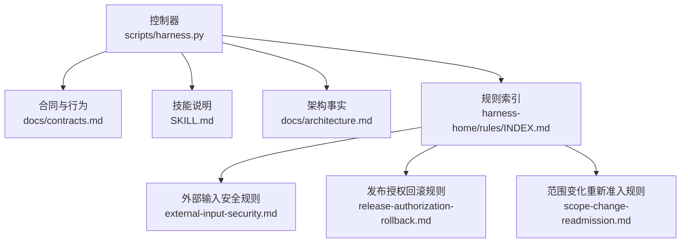
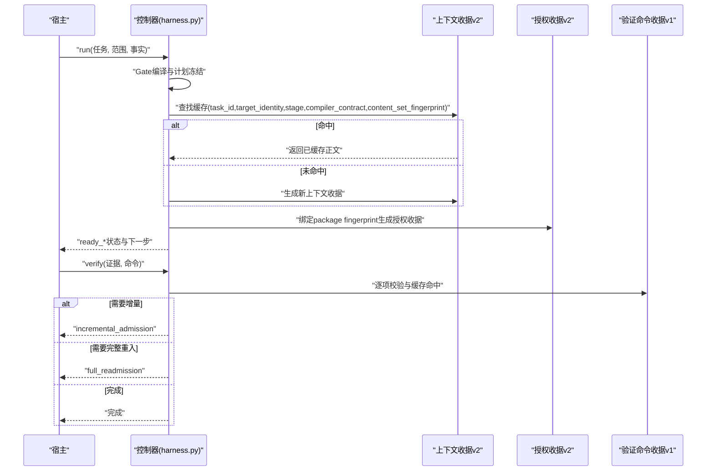
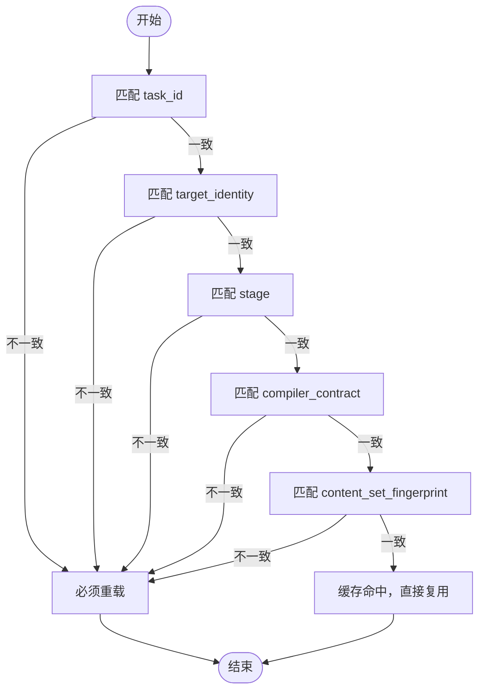
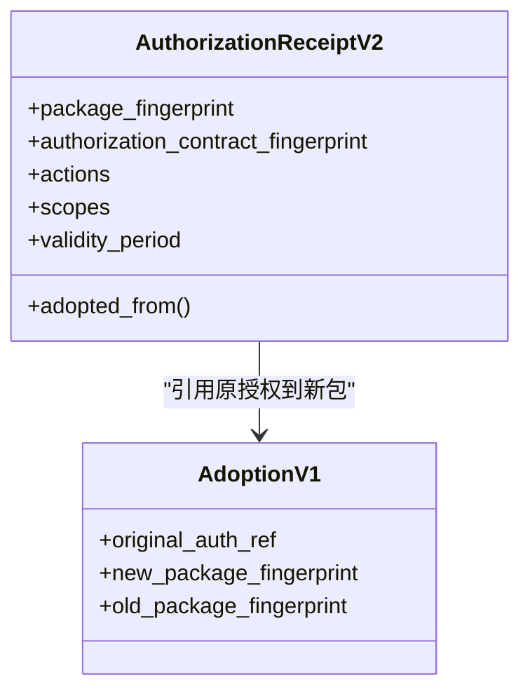
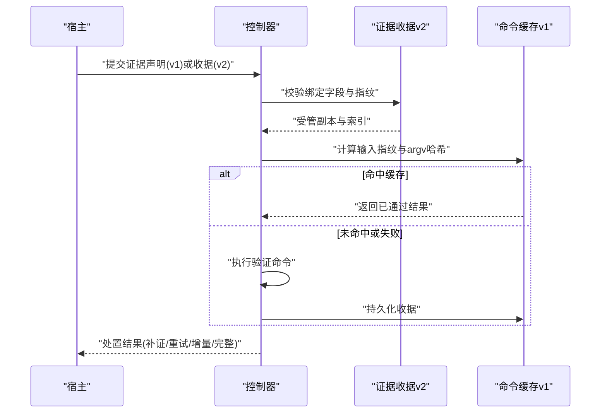
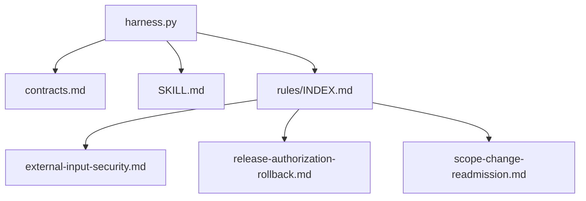

# 上下文与授权

<cite>
**本文引用的文件**
- [SKILL.md](file://SKILL.md)
- [architecture.md](file://docs/architecture.md)
- [contracts.md](file://docs/contracts.md)
- [INDEX.md](file://harness-home/rules/INDEX.md)
- [external-input-security.md](file://harness-home/rules/external-input-security.md)
- [release-authorization-rollback.md](file://harness-home/rules/release-authorization-rollback.md)
- [scope-change-readmission.md](file://harness-home/rules/scope-change-readmission.md)
- [harness.py](file://scripts/harness.py)
</cite>

## 目录
1. [简介](#简介)
2. [项目结构](#项目结构)
3. [核心组件](#核心组件)
4. [架构总览](#架构总览)
5. [详细组件分析](#详细组件分析)
6. [依赖关系分析](#依赖关系分析)
7. [性能考量](#性能考量)
8. [故障排除指南](#故障排除指南)
9. [结论](#结论)
10. [附录](#附录)

## 简介
本文件聚焦 Docs Harness 的“上下文与授权”系统，系统性阐述：
- 上下文收据 v2（context-receipt/v2）的结构、复用条件与匹配规则（task_id、target_identity、stage、compiler_contract、content_set_fingerprint）。
- 授权收据（authorization-receipt/v2）的生成与管理机制，以及 package fingerprint 绑定与跨修订复用的限制。
- 上下文加载的性能优化策略，包括缓存命中检测与重复加载避免。
- 授权检查的安全保证，涵盖权限验证与访问控制实现要点。
- 配置最佳实践与常见问题排查路径。

## 项目结构
Docs Harness 的核心控制器与合同定义位于以下位置：
- 控制器源码真源：scripts/harness.py
- 对外行为与合同：docs/contracts.md、SKILL.md
- 架构事实：docs/architecture.md
- 受管规则索引与具体规则：harness-home/rules/INDEX.md 及对应规则文件

图表来源
- [harness.py:1-200](file://scripts/harness.py#L1-L200)
- [contracts.md:1-370](file://docs/contracts.md#L1-L370)
- [SKILL.md:1-105](file://SKILL.md#L1-L105)
- [architecture.md:1-26](file://docs/architecture.md#L1-L26)
- [INDEX.md:1-41](file://harness-home/rules/INDEX.md#L1-L41)

章节来源
- [architecture.md:1-26](file://docs/architecture.md#L1-L26)
- [contracts.md:1-370](file://docs/contracts.md#L1-L370)
- [SKILL.md:1-105](file://SKILL.md#L1-L105)
- [INDEX.md:1-41](file://harness-home/rules/INDEX.md#L1-L41)

## 核心组件
- 上下文收据 v2（context-receipt/v2）：用于承载任务执行所需的规则与项目事实正文，支持按内容指纹跨阶段复用，减少重复加载。
- 授权收据 v2（authorization-receipt/v2）：用于承载当前包版本下的授权边界与权限集合，严格绑定 package fingerprint，禁止跨修订复用。
- 编译器合约（compiler contract）：决定上下文内容的编译方式与可复用性，是上下文复用的关键维度之一。
- 证据收据 v2（evidence-receipt/v2）与声明草案（evidence-declaration/v1）：为验收提供结构化证据与自动归因能力。
- 验证命令收据（verification-command-receipt/v1）：对验证命令进行逐项快照与缓存复用，提升 verify 效率。

章节来源
- [contracts.md:165-234](file://docs/contracts.md#L165-L234)
- [contracts.md:222-234](file://docs/contracts.md#L222-L234)
- [harness.py:27-56](file://scripts/harness.py#L27-L56)

## 架构总览
上下文与授权在任务生命周期中的交互如下：
- run 阶段：根据任务意图与范围编译 Gate，冻结计划后进入上下文加载；若命中上下文缓存则直接复用，否则生成新的 context-receipt/v2。
- 授权阶段：基于当前 package fingerprint 生成 authorization-receipt/v2，并记录授权动作与范围；后续修订需通过 adoption 或重新准入。
- verify 阶段：逐项验证命令与证据，使用 verification-command-receipt/v1 缓存命中；必要时增量或完整重新准入。

图表来源
- [contracts.md:222-234](file://docs/contracts.md#L222-L234)
- [contracts.md:165-234](file://docs/contracts.md#L165-L234)
- [harness.py:27-56](file://scripts/harness.py#L27-L56)

## 详细组件分析

### 上下文收据 v2 结构与复用条件
- 关键字段与匹配规则：
  - task_id：同一任务标识，跨任务不可复用。
  - target_identity：目标项目身份指纹，跨目标不可复用。
  - stage：阶段（如 plan/action），不同阶段各自保留确认收据。
  - compiler_contract：编译器合约版本，合约变化必须重载。
  - content_set_fingerprint：内容集合指纹，内容变化必须重载。
- 缓存命中时不重复返回规则与项目事实正文；任一维度变化均触发重载。
- 上下文正文按 task、stage、compiler contract 与内容指纹跨阶段复用，不随 package revision 重复加载。

图表来源
- [contracts.md:222-234](file://docs/contracts.md#L222-L234)

章节来源
- [contracts.md:222-234](file://docs/contracts.md#L222-L234)

### 授权收据 v2 生成与管理机制
- 始终绑定当前 package fingerprint，禁止按内容集合跨修订复用。
- 当 package revision 变化但授权合同完全相同时，可通过 authorization-adoption/v1 引用原授权与新 package，避免重复授权流程。
- 任何授权动作、授权范围、Git scope、外部目标或有效期变化时禁止继承，必须完整重新准入。
- 在 adoption 合同实现前，带授权要求的任务不得走会要求下一轮 verify 的增量 Gate 路径，避免先增量后再次失败。

图表来源
- [contracts.md:222-234](file://docs/contracts.md#L222-L234)
- [contracts.md:248-251](file://docs/contracts.md#L248-L251)

章节来源
- [contracts.md:222-234](file://docs/contracts.md#L222-L234)
- [contracts.md:248-251](file://docs/contracts.md#L248-L251)

### 证据与验证命令收据
- evidence-receipt/v2：绑定 task_id、target_identity、package_fingerprint、producer、cwd、时间戳、TTL、退出码、输出摘要、read_set/write_set；过期、跨任务/目标/package、不可信生产者、非零退出或摘要无效均拒绝。
- evidence-declaration/v1：宿主仅提交声明草案，控制器代铸装订字段与 read_set 指纹，信任等级与自铸收据持平。
- verification-command-receipt/v1：按 argv、produces 与输入指纹绑定；输入不变且上次通过则复用（cache_hit=true），失败或输入变化才重跑。

图表来源
- [contracts.md:165-218](file://docs/contracts.md#L165-L218)

章节来源
- [contracts.md:165-218](file://docs/contracts.md#L165-L218)

### 工作区漂移与自动归因
- freeze.json.workspace_snapshot 作为首次基线，重新准入不刷新。
- 控制器默认在 write_scope 内未归因写入时，代铸 workspace_attribution 收据并记录 auto_attribution 事件，响应包含 auto_attributed_paths。
- 项目可通过配置关闭自动归因，恢复 provide_evidence 补证据流程。

章节来源
- [contracts.md:216-218](file://docs/contracts.md#L216-L218)

### Gate 与风险边界
- 安全底线 Gate（security-sensitive、destructive-data、release-external）由控制器强制并入，宿主只能加不能减。
- 文本触发使用精确词表并带否定守卫，避免误判。
- 相关规则文件明确适用条件、必需方案字段、验收条件与失败处理方式。

章节来源
- [external-input-security.md:1-29](file://harness-home/rules/external-input-security.md#L1-L29)
- [release-authorization-rollback.md:1-29](file://harness-home/rules/release-authorization-rollback.md#L1-L29)
- [scope-change-readmission.md:1-29](file://harness-home/rules/scope-change-readmission.md#L1-L29)

## 依赖关系分析
- 控制器依赖合同定义（task-package/v2、context-receipt/v2、authorization-receipt/v2、evidence-receipt/v2、verification-command-receipt/v1）。
- 规则索引与具体规则影响 Gate 推断与准入决策。
- SKILL.md 描述入口与幂等复用、最终验收与后台治理。

图表来源
- [harness.py:1-200](file://scripts/harness.py#L1-L200)
- [contracts.md:1-370](file://docs/contracts.md#L1-L370)
- [SKILL.md:1-105](file://SKILL.md#L1-L105)
- [INDEX.md:1-41](file://harness-home/rules/INDEX.md#L1-L41)

章节来源
- [harness.py:1-200](file://scripts/harness.py#L1-L200)
- [contracts.md:1-370](file://docs/contracts.md#L1-L370)
- [SKILL.md:1-105](file://SKILL.md#L1-L105)
- [INDEX.md:1-41](file://harness-home/rules/INDEX.md#L1-L41)

## 性能考量
- 上下文缓存命中检测：按 task_id、target_identity、stage、compiler_contract、content_set_fingerprint 五维匹配，命中即复用，避免重复加载。
- 重复加载避免：上下文正文按内容与合约指纹跨阶段复用，不随 package revision 重复加载；授权按 package fingerprint 绑定，禁止跨修订复用。
- 验证命令缓存：按 argv 与输入指纹缓存，输入不变则复用通过结果，仅失败或输入变化重跑。
- 自动归因减少补证往返：write_scope 内未归因写入自动认领，降低人工补证成本。

章节来源
- [contracts.md:222-234](file://docs/contracts.md#L222-L234)
- [contracts.md:165-218](file://docs/contracts.md#L165-L218)
- [contracts.md:216-218](file://docs/contracts.md#L216-L218)

## 故障排除指南
- 上下文未命中：检查 task_id/target_identity/stage/compiler_contract/content_set_fingerprint 是否一致；任一变化将导致重载。
- 授权失效：确认 package fingerprint 是否变化；若变化且授权合同相同，应使用 authorization-adoption/v1 引用原授权。
- 证据被拒：核对 producer 可信度、TTL、退出码、摘要有效性；高风险证据必须来自可信 v2 生产者。
- 验证命令重复执行：检查输入指纹是否变化；可通过配置整体关闭命令缓存以定位问题。
- 自动归因被关闭：若 verification.auto_attribute_in_scope=false，将退回 provide_evidence 流程，需手动补充收据。

章节来源
- [contracts.md:165-218](file://docs/contracts.md#L165-L218)
- [contracts.md:216-218](file://docs/contracts.md#L216-L218)
- [contracts.md:222-234](file://docs/contracts.md#L222-L234)

## 结论
Docs Harness 的上下文与授权系统通过严格的指纹匹配与受管收据机制，在保证安全与一致性的前提下实现了高效的缓存复用与增量准入。上下文按内容与合约维度复用，授权按包版本绑定并通过 adoption 平滑迁移；验证命令逐项缓存显著降低 verify 成本。配合自动归因与五级处置策略，系统在性能与安全之间取得平衡。

## 附录
- 入口与幂等复用、最终验收与后台治理参考 SKILL.md。
- 架构事实与 Runtime 边界参考 docs/architecture.md。
- 规则生效与 Gate 推断参考 harness-home/rules/INDEX.md 与各规则文件。

章节来源
- [SKILL.md:1-105](file://SKILL.md#L1-L105)
- [architecture.md:1-26](file://docs/architecture.md#L1-L26)
- [INDEX.md:1-41](file://harness-home/rules/INDEX.md#L1-L41)