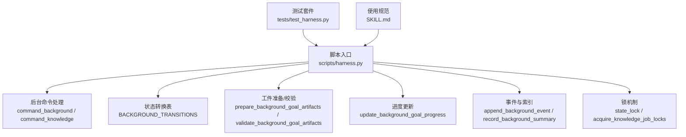
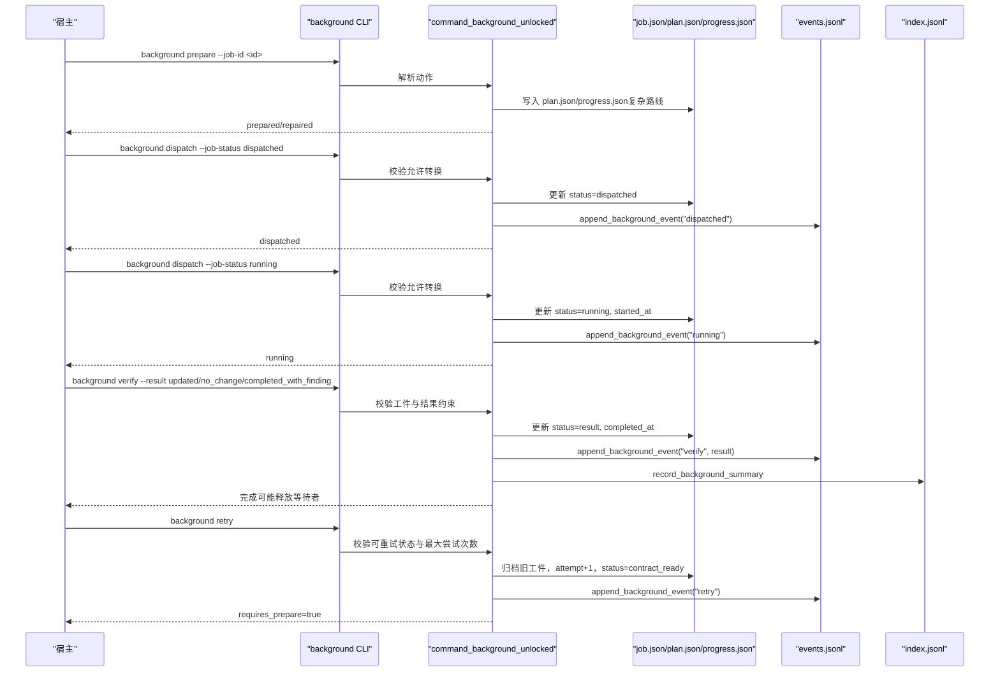
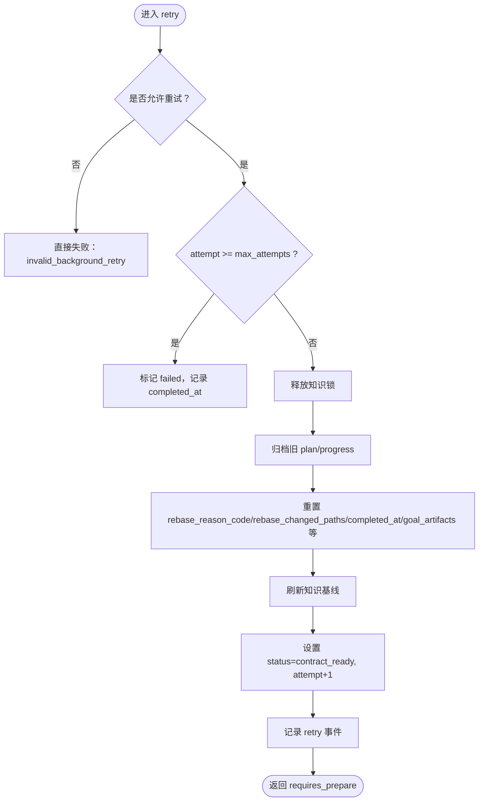
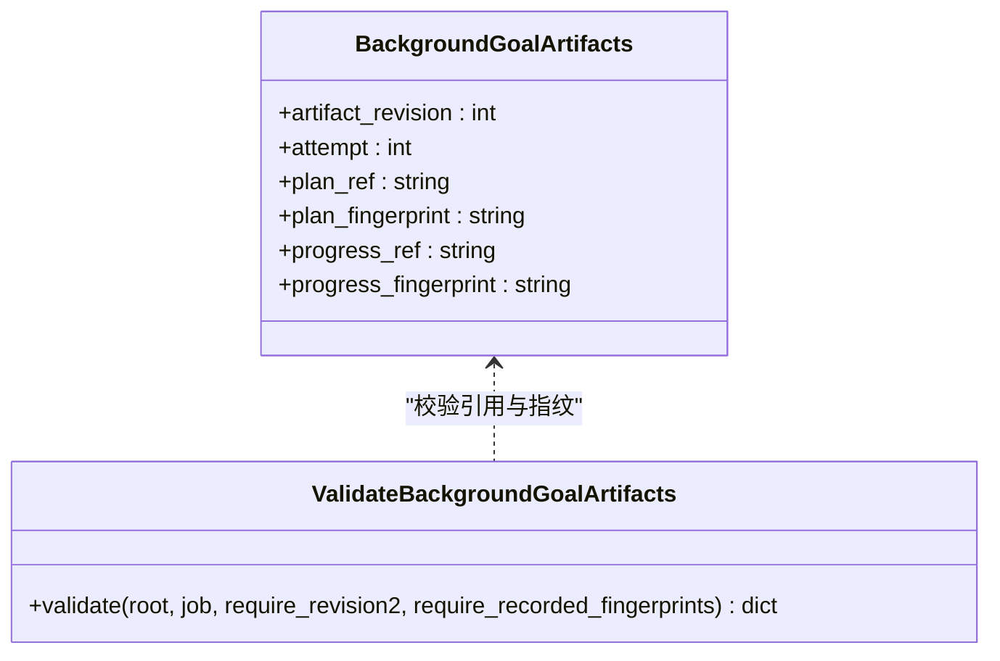
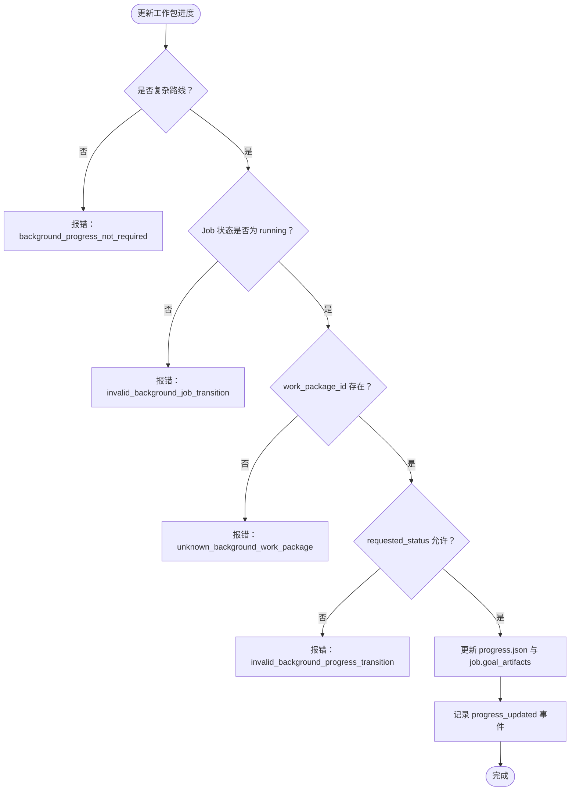
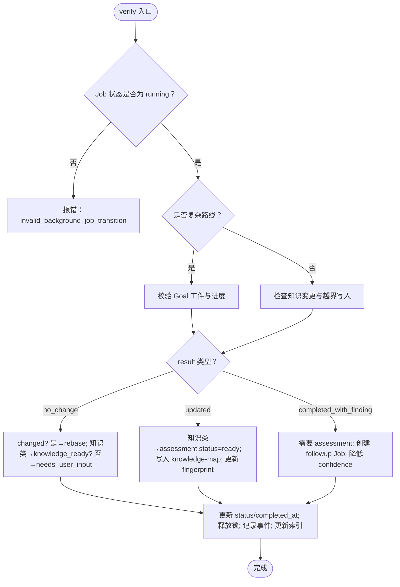
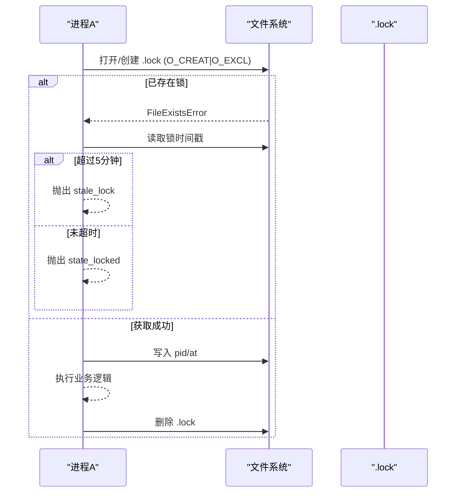
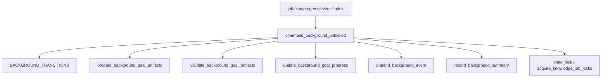

# 作业状态机

<cite>
**本文引用的文件**   
- [harness.py](file://scripts/harness.py)
- [test_harness.py](file://tests/test_harness.py)
- [SKILL.md](file://SKILL.md)
</cite>

## 目录
1. [简介](#简介)
2. [项目结构](#项目结构)
3. [核心组件](#核心组件)
4. [架构总览](#架构总览)
5. [详细组件分析](#详细组件分析)
6. [依赖关系分析](#依赖关系分析)
7. [性能考量](#性能考量)
8. [故障排查指南](#故障排查指南)
9. [结论](#结论)
10. [附录](#附录)

## 简介
本文件为 Docs Harness 的后台作业状态机提供系统化文档，覆盖以下要点：
- 状态转换规则与触发条件：contract_ready、dispatched、running、updated、no_change、completed_with_finding 等。
- attempt 机制：推进策略、重试条件与幂等性保证。
- 状态验证机制：Schema 校验、revision 检查、Job 绑定验证、指纹一致性检查。
- 并发控制：状态锁与知识 Job 锁，防止状态冲突和数据竞争。
- 完整流程图与常见场景示例，帮助宿主或运维人员正确编排后台治理流程。

## 项目结构
Docs Harness 的核心实现位于 scripts/harness.py，包含后台作业状态机、attempt 管理、工件归档与校验、事件记录、索引维护等能力；测试用例在 tests/test_harness.py 中覆盖关键路径；SKILL.md 提供高层使用说明与入口约定。

**图表来源** 
- [harness.py:8227-8239](file://scripts/harness.py#L8227-L8239)
- [harness.py:8284-8348](file://scripts/harness.py#L8284-L8348)
- [harness.py:7318-7384](file://scripts/harness.py#L7318-L7384)
- [harness.py:8351-8400](file://scripts/harness.py#L8351-L8400)
- [harness.py:7387-7411](file://scripts/harness.py#L7387-L7411)
- [harness.py:1008-1029](file://scripts/harness.py#L1008-L1029)
- [harness.py:8204-8225](file://scripts/harness.py#L8204-L8225)

**章节来源**
- [harness.py:8227-8239](file://scripts/harness.py#L8227-L8239)
- [harness.py:8284-8348](file://scripts/harness.py#L8284-L8348)
- [harness.py:7318-7384](file://scripts/harness.py#L7318-L7384)
- [harness.py:8351-8400](file://scripts/harness.py#L8351-L8400)
- [harness.py:7387-7411](file://scripts/harness.py#L7387-L7411)
- [harness.py:1008-1029](file://scripts/harness.py#L1008-L1029)
- [harness.py:8204-8225](file://scripts/harness.py#L8204-L8225)
- [SKILL.md:59-89](file://SKILL.md#L59-L89)

## 核心组件
- 状态转换表 BACKGROUND_TRANSITIONS：定义所有允许的状态迁移集合。
- 后台命令处理 command_background_unlocked：解析 background prepare/progress/dispatch/retry/verify 动作，执行状态转换与校验。
- 工件准备与校验：prepare_background_goal_artifacts 生成 plan.json/progress.json 并记录指纹；validate_background_goal_artifacts 校验 Schema、revision、绑定与指纹一致性。
- 进度更新 update_background_goal_progress：工作包状态推进（pending→in_progress→completed/blocked），幂等与顺序约束。
- 事件与索引：append_background_event 持久化事件；record_background_summary 维护 (job_id, attempt, status) 三元组索引。
- 锁机制：state_lock 任务级原子写入；acquire_knowledge_job_locks 功能知识范围锁，避免并发写冲突。

**章节来源**
- [harness.py:8227-8239](file://scripts/harness.py#L8227-L8239)
- [harness.py:8644-9000](file://scripts/harness.py#L8644-L9000)
- [harness.py:8284-8348](file://scripts/harness.py#L8284-L8348)
- [harness.py:7318-7384](file://scripts/harness.py#L7318-L7384)
- [harness.py:8351-8400](file://scripts/harness.py#L8351-L8400)
- [harness.py:7387-7411](file://scripts/harness.py#L7387-L7411)
- [harness.py:7484-7500](file://scripts/harness.py#L7484-L7500)
- [harness.py:1008-1029](file://scripts/harness.py#L1008-L1029)
- [harness.py:8204-8225](file://scripts/harness.py#L8204-L8225)

## 架构总览
下图展示后台作业从创建到终态的关键调用链与数据流，包括 prepare、dispatched、running、verify 以及 retry 分支。

**图表来源** 
- [harness.py:8284-8348](file://scripts/harness.py#L8284-L8348)
- [harness.py:8644-9000](file://scripts/harness.py#L8644-L9000)
- [harness.py:7387-7411](file://scripts/harness.py#L7387-L7411)
- [harness.py:7484-7500](file://scripts/harness.py#L7484-L7500)

## 详细组件分析

### 状态转换规则与触发条件
- contract_ready → dispatched/queued_manual/cancelled：进入派发阶段或人工队列。
- dispatched → running/queued_manual/failed/cancelled：开始运行或失败/取消。
- running → updated/no_change/completed_with_finding/needs_user_input/needs_rebase/failed/cancelled/waiting_for_dependency/waiting_for_bootstrap_merge：业务验收、阻塞依赖、需用户输入、需重新基线等。
- waiting_for_dependency → contract_ready/failed/cancelled：依赖就绪后回到 contract_ready，或失败/取消。
- waiting_for_bootstrap_merge → contract_ready/needs_user_input/cancelled：bootstrap 成功释放等待者，否则需用户介入。
- needs_user_input/needs_rebase/queued_manual → contract_ready/cancelled：修复后重试或取消。

上述转换由 command_background_unlocked 中的 dispatch 分支严格校验，非法转换将拒绝并记录事件。

**章节来源**
- [harness.py:8227-8239](file://scripts/harness.py#L8227-L8239)
- [harness.py:8757-8834](file://scripts/harness.py#L8757-L8834)

### Attempt 机制与幂等性
- 最大尝试次数：BACKGROUND_MAX_ATTEMPTS 限制重试上限，达到上限时置为 failed。
- 重试流程：release 知识锁 → 归档旧 plan/progress → attempt+1 → 重置部分字段 → refresh baseline → status=contract_ready → 复杂路线 requires_prepare=true。
- 幂等性：同一 job_id + attempt + status 的摘要键用于去重；事件追加对重复 transition_rejected 进行合并；prepare/progress 支持 idempotent 返回。

**图表来源** 
- [harness.py:8835-8876](file://scripts/harness.py#L8835-L8876)
- [harness.py:8255-8282](file://scripts/harness.py#L8255-L8282)
- [harness.py:7484-7500](file://scripts/harness.py#L7484-L7500)

**章节来源**
- [harness.py:8835-8876](file://scripts/harness.py#L8835-L8876)
- [harness.py:8255-8282](file://scripts/harness.py#L8255-L8282)
- [harness.py:7484-7500](file://scripts/harness.py#L7484-L7500)

### 状态验证机制（Schema、Revision、绑定、指纹）
- Schema 校验：plan.json/progress.json 必须匹配 BACKGROUND_PLAN_SCHEMA/BACKGROUND_PROGRESS_SCHEMA。
- Revision 检查：artifact_revision 必须等于 BACKGROUND_ARTIFACT_REVISION（v2），否则拒绝新派发或新 attempt。
- Job 绑定验证：plan/progress 的 job_id 与 idempotency_key 必须与当前 job 一致。
- 指纹一致性：controller 记录的 goal_artifacts.plan_fingerprint/progress_fingerprint 必须与磁盘文件指纹一致，漂移即视为篡改。

**图表来源** 
- [harness.py:7305-7315](file://scripts/harness.py#L7305-L7315)
- [harness.py:7318-7384](file://scripts/harness.py#L7318-L7384)

**章节来源**
- [harness.py:7318-7384](file://scripts/harness.py#L7318-L7384)

### 进度推进与工作包状态机
- 工作包状态：pending → in_progress → completed/blocked，禁止倒退或跳过。
- 幂等性：相同 work_package_id + requested_status 返回 idempotent。
- 完整性：completed_work_packages/remaining_work_packages 派生列表必须与 states 一致。

**图表来源** 
- [harness.py:8351-8400](file://scripts/harness.py#L8351-L8400)

**章节来源**
- [harness.py:8351-8400](file://scripts/harness.py#L8351-L8400)

### 验收逻辑（updated/no_change/completed_with_finding）
- updated：知识类 Job 需提供 assessment，且 knowledge_status 必须 ready；随后写入 knowledge-map.json 并更新 fingerprint。
- no_change：若 changed 非空则强制 rebase；知识类 no_change 要求最终知识 ready，否则进入 needs_user_input。
- completed_with_finding：需提供 assessment 报告 critical_finding，控制器创建 followup Job 并降低 delivery_confidence。

**图表来源** 
- [harness.py:8877-8999](file://scripts/harness.py#L8877-L8999)

**章节来源**
- [harness.py:8877-8999](file://scripts/harness.py#L8877-L8999)

### 并发控制与锁机制
- 任务级锁 state_lock：基于 .lock 文件，超过 5 分钟视为 stale_lock，需人工清理。
- 知识 Job 锁 acquire_knowledge_job_locks：按功能维度命名锁文件，写入 job_id 作为所有者，冲突时报错 knowledge_feature_locked。
- 释放锁：进入 failed/needs_user_input/needs_rebase/cancelled 时释放知识锁；verify 完成后释放。

**图表来源** 
- [harness.py:1008-1029](file://scripts/harness.py#L1008-L1029)
- [harness.py:8204-8225](file://scripts/harness.py#L8204-L8225)

**章节来源**
- [harness.py:1008-1029](file://scripts/harness.py#L1008-L1029)
- [harness.py:8204-8225](file://scripts/harness.py#L8204-L8225)

### 常见状态转换场景示例
- 正常流水线：contract_ready → dispatched → running → updated/no_change → 完成。
- 重大发现：running → completed_with_finding → 创建 followup Job → 降低 confidence。
- 依赖阻塞：running → waiting_for_dependency → 依赖就绪 → contract_ready → 继续。
- Bootstrap 等待：running → waiting_for_bootstrap_merge → bootstrap 成功 → contract_ready。
- 重试失败：running → failed → retry → attempt+1 → contract_ready（直至达到最大尝试次数）。

**章节来源**
- [harness.py:8227-8239](file://scripts/harness.py#L8227-L8239)
- [harness.py:8877-8999](file://scripts/harness.py#L8877-L8999)
- [harness.py:8609-8641](file://scripts/harness.py#L8609-L8641)
- [harness.py:8835-8876](file://scripts/harness.py#L8835-L8876)

## 依赖关系分析
- 命令层：command_background_unlocked 依赖状态转换表、工件准备/校验、事件与索引、锁机制。
- 数据层：job.json/plan.json/progress.json/events.jsonl/index.jsonl 构成持久化状态集。
- 外部依赖：Git 操作、文件系统原子写入、时间戳与哈希指纹。

**图表来源** 
- [harness.py:8227-8239](file://scripts/harness.py#L8227-L8239)
- [harness.py:8284-8348](file://scripts/harness.py#L8284-L8348)
- [harness.py:7318-7384](file://scripts/harness.py#L7318-L7384)
- [harness.py:8351-8400](file://scripts/harness.py#L8351-L8400)
- [harness.py:7387-7411](file://scripts/harness.py#L7387-L7411)
- [harness.py:7484-7500](file://scripts/harness.py#L7484-L7500)
- [harness.py:1008-1029](file://scripts/harness.py#L1008-L1029)
- [harness.py:8204-8225](file://scripts/harness.py#L8204-L8225)

**章节来源**
- [harness.py:8227-8239](file://scripts/harness.py#L8227-L8239)
- [harness.py:8284-8348](file://scripts/harness.py#L8284-L8348)
- [harness.py:7318-7384](file://scripts/harness.py#L7318-L7384)
- [harness.py:8351-8400](file://scripts/harness.py#L8351-L8400)
- [harness.py:7387-7411](file://scripts/harness.py#L7387-L7411)
- [harness.py:7484-7500](file://scripts/harness.py#L7484-L7500)
- [harness.py:1008-1029](file://scripts/harness.py#L1008-L1029)
- [harness.py:8204-8225](file://scripts/harness.py#L8204-L8225)

## 性能考量
- 事件追加与索引更新采用追加式 JSONL，避免全量重写，提升高并发写入性能。
- 工件指纹计算仅对必要文件进行，大文件采用 size+mtime 快速指纹，减少 IO。
- 锁粒度细化：任务级锁与知识范围锁分离，降低热点竞争。
- 重试与归档仅在必要时触发，避免不必要的磁盘拷贝。

[本节为通用指导，不直接分析具体文件]

## 故障排查指南
- 非法状态转换：检查 BACKGROUND_TRANSITIONS 与请求的 from_status/requested_status；查看 events.jsonl 中 transition_rejected 事件。
- 工件漂移：对比 goal_artifacts 指纹与磁盘文件指纹；必要时使用 --repair 重建工件。
- 知识锁冲突：确认是否有其他进程持有知识锁；清理 stale lock 或等待释放。
- 依赖阻塞：检查 dependency_job_ids 对应 Job 状态；确保依赖处于 updated/no_change/completed_with_finding。
- 重试上限：确认 attempt 与 BACKGROUND_MAX_ATTEMPTS；达到上限后需人工干预。

**章节来源**
- [harness.py:8757-8834](file://scripts/harness.py#L8757-L8834)
- [harness.py:7318-7384](file://scripts/harness.py#L7318-L7384)
- [harness.py:8204-8225](file://scripts/harness.py#L8204-L8225)
- [harness.py:8835-8876](file://scripts/harness.py#L8835-L8876)

## 结论
Docs Harness 的作业状态机通过严格的转换表、工件校验、attempt 管理与细粒度锁机制，确保了后台治理流程的可预测性与安全性。宿主应遵循 prepare→dispatched→running→verify 的标准序列，并在异常路径上依据 reason_code 与事件日志进行定位与恢复。

[本节为总结，不直接分析具体文件]

## 附录
- 常用命令参考：background list/status/prepare/progress/dispatch/retry/verify。
- 验收要求：updated/no_change 要求全部工作包 completed；completed_with_finding 仅允许 completed/blocked。
- 幂等性保障：同一 job_id + attempt + status 的摘要键去重；事件合并与进度幂等返回。

**章节来源**
- [SKILL.md:59-89](file://SKILL.md#L59-L89)
- [harness.py:8877-8999](file://scripts/harness.py#L8877-L8999)
- [harness.py:7484-7500](file://scripts/harness.py#L7484-L7500)