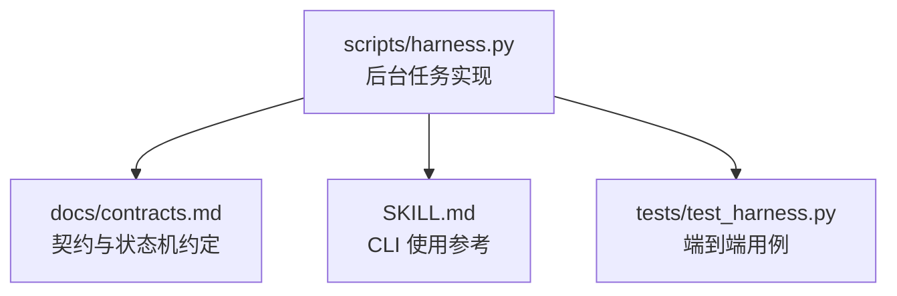
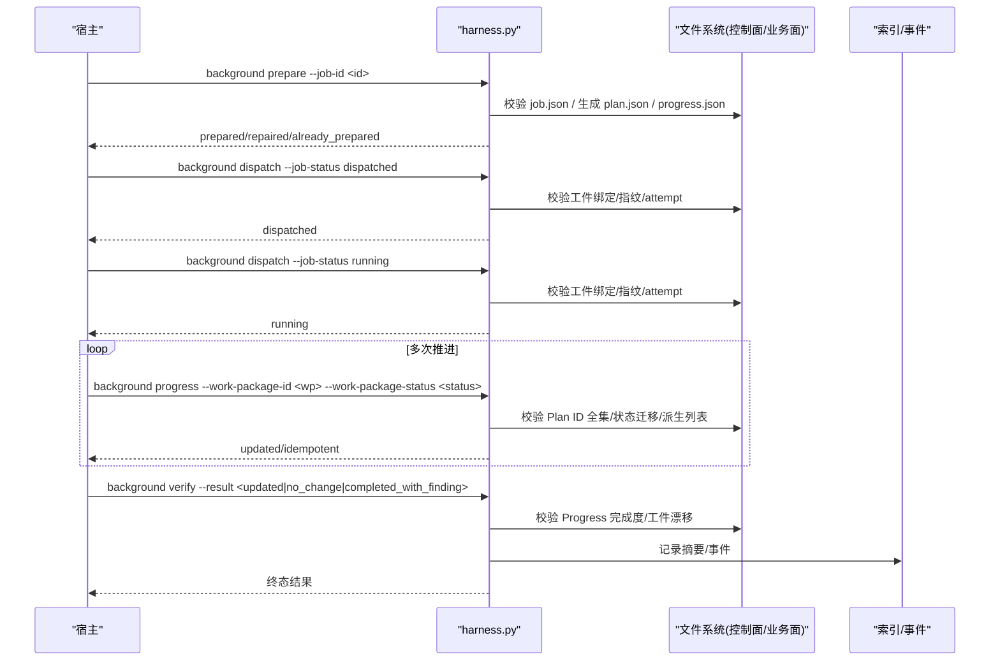
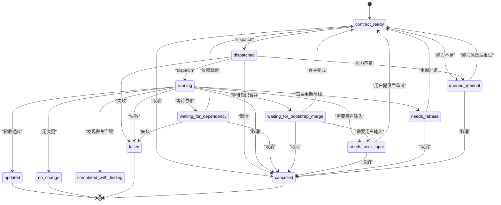
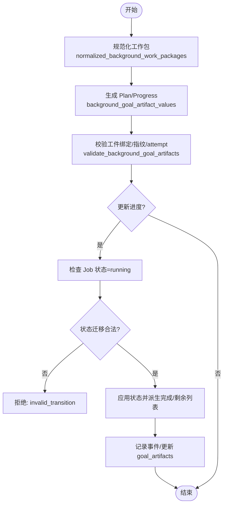
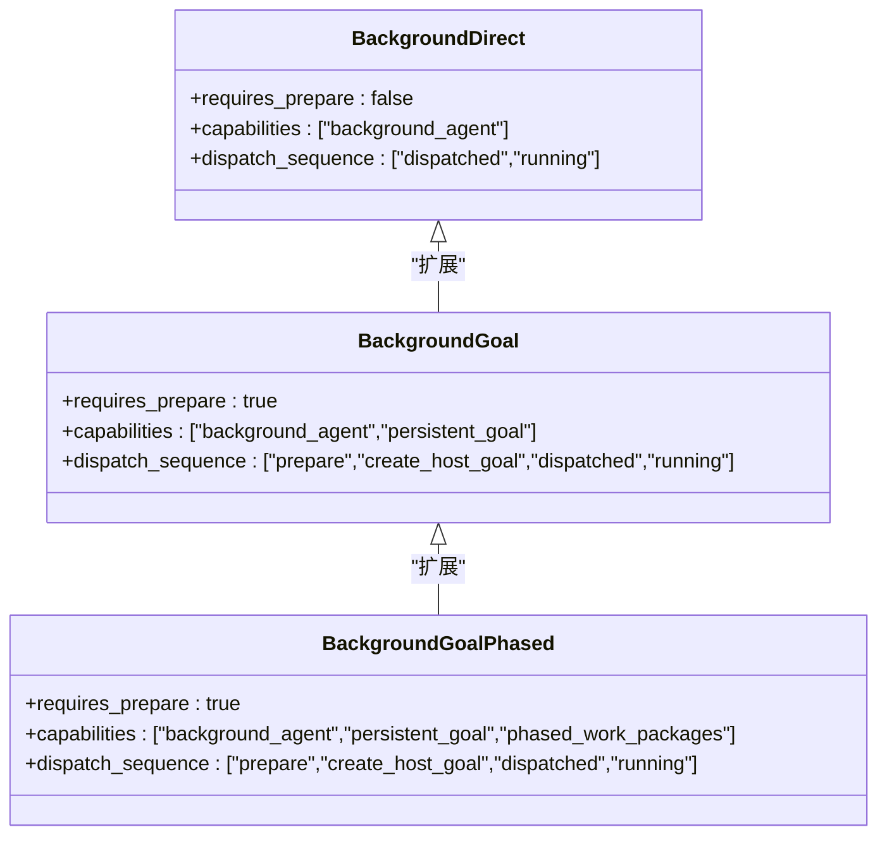
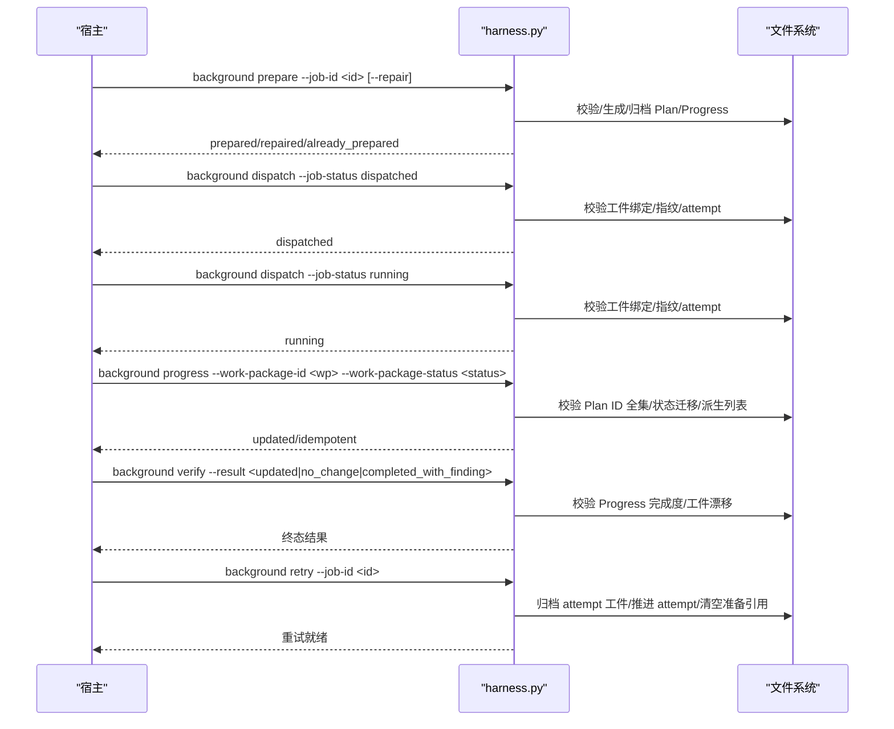
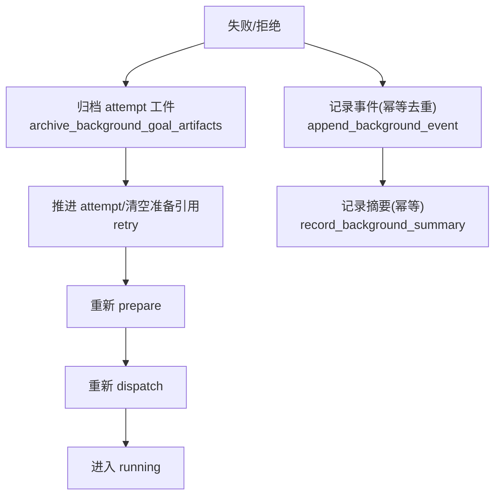
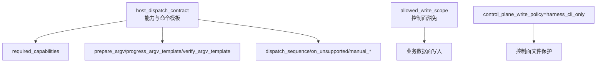
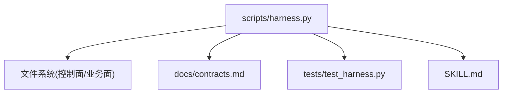

# 后台任务模型

<cite>
**本文引用的文件**   
- [scripts/harness.py](file://scripts/harness.py)
- [docs/contracts.md](file://docs/contracts.md)
- [SKILL.md](file://SKILL.md)
- [tests/test_harness.py](file://tests/test_harness.py)
</cite>

## 目录
1. [简介](#简介)
2. [项目结构](#项目结构)
3. [核心组件](#核心组件)
4. [架构总览](#架构总览)
5. [详细组件分析](#详细组件分析)
6. [依赖关系分析](#依赖关系分析)
7. [性能考量](#性能考量)
8. [故障排查指南](#故障排查指南)
9. [结论](#结论)
10. [附录](#附录)

## 简介
本文件面向 Docs Harness 的后台任务模型，系统性阐述作业状态机、工作包管理机制、三种后台路线（background_direct、background_goal、background_goal_phased）的使用场景与限制、作业生命周期命令流程（prepare、progress、verify、retry）、失败处理与重试机制，以及调度配置与最佳实践。内容以源码与契约文档为依据，确保读者既能理解高层设计，也能定位到具体实现位置。

## 项目结构
- 控制器主程序位于 scripts/harness.py，包含后台任务的状态机、工件准备、进度更新、验证与归档等全部实现。
- 契约与行为约定在 docs/contracts.md 中明确定义，包括状态转换、命令语义、工件版本与校验规则。
- SKILL.md 提供面向宿主与运维的快速参考，涵盖 CLI 调用序列与能力声明。
- tests/test_harness.py 覆盖典型用例，如 prepare、progress、dispatch、verify 与 retry 的流程验证。

**图表来源** 
- [scripts/harness.py](file://scripts/harness.py)
- [docs/contracts.md](file://docs/contracts.md)
- [SKILL.md](file://SKILL.md)
- [tests/test_harness.py](file://tests/test_harness.py)

**章节来源**
- [scripts/harness.py](file://scripts/harness.py)
- [docs/contracts.md](file://docs/contracts.md)
- [SKILL.md](file://SKILL.md)
- [tests/test_harness.py](file://tests/test_harness.py)

## 核心组件
- 作业状态机：定义已知状态集合、终态集合与可重试状态集合，并限定合法迁移。
- 工作包管理：冻结 Plan/Progress，严格校验 ID 全集、attempt、指纹与派生列表。
- 后台路线：
  - background_direct：有界后台执行，无需复杂工件。
  - background_goal：持久目标与正式方案，需 prepare 生成 revision 2 工件。
  - background_goal_phased：单一目标 Owner 分阶段推进，要求 phased_work_packages 能力。
- 生命周期命令：prepare、dispatch、progress、verify、retry，分别负责工件准备、派发、进度推进、验收与重试。
- 失败处理与重试：attempt 推进、事件记录、工件归档、幂等去重与恢复策略。

**章节来源**
- [scripts/harness.py:97-124](file://scripts/harness.py#L97-L124)
- [scripts/harness.py:7248-7369](file://scripts/harness.py#L7248-L7369)
- [scripts/harness.py:8212-8224](file://scripts/harness.py#L8212-L8224)
- [docs/contracts.md:303-338](file://docs/contracts.md#L303-L338)
- [SKILL.md:59-81](file://SKILL.md#L59-L81)

## 架构总览
后台任务由控制器统一编排，宿主通过 CLI 驱动状态迁移与工件操作。复杂路线需要宿主先创建 Goal/Plan，再由控制器校验并进入 running；简单路线可直接派发。所有控制面文件仅允许 CLI 写入，业务数据面受 allowed_write_scope 约束。

**图表来源** 
- [scripts/harness.py:8269-8333](file://scripts/harness.py#L8269-L8333)
- [scripts/harness.py:8336-8394](file://scripts/harness.py#L8336-L8394)
- [docs/contracts.md:325-338](file://docs/contracts.md#L325-L338)

## 详细组件分析

### 作业状态机与转换规则
- 已知状态集合包含 contract_ready、dispatched、running、waiting_for_dependency、waiting_for_bootstrap_merge、needs_user_input、needs_rebase、queued_manual 及终态 updated、no_change、completed_with_finding、failed、cancelled。
- 可重试状态为 needs_user_input、needs_rebase、queued_manual。
- 合法迁移由 BACKGROUND_TRANSITIONS 限定，例如：
  - contract_ready → dispatched / queued_manual / cancelled
  - dispatched → running / queued_manual / failed / cancelled
  - running → updated / no_change / completed_with_finding / needs_user_input / needs_rebase / failed / cancelled 等

**图表来源** 
- [scripts/harness.py:97-114](file://scripts/harness.py#L97-L114)
- [scripts/harness.py:8212-8224](file://scripts/harness.py#L8212-L8224)

**章节来源**
- [scripts/harness.py:97-114](file://scripts/harness.py#L97-L114)
- [scripts/harness.py:8212-8224](file://scripts/harness.py#L8212-L8224)
- [docs/contracts.md:303-338](file://docs/contracts.md#L303-L338)

### 工作包管理机制（定义、进度跟踪、完成验证）
- 工作包由 normalized_background_work_packages 规范化为 id 与 objective，ID 格式 wp-NN。
- Plan/Progress 由 background_goal_artifact_values 确定性生成，artifact_revision=2，generated_by="docs-harness"，attempt 来自 job。
- validate_background_goal_artifacts 校验：
  - schema_version、artifact_revision、generated_by
  - job_id 与 idempotency_key 绑定
  - attempt 一致性
  - work_package_states 全集与唯一性
  - 状态值合法性与派生列表一致性
- update_background_goal_progress 只允许 running 状态，状态迁移受限 pending→in_progress/blocked、in_progress→completed/blocked，相同状态幂等，倒退或跳过执行失败关闭。

**图表来源** 
- [scripts/harness.py:7248-7287](file://scripts/harness.py#L7248-L7287)
- [scripts/harness.py:7303-7369](file://scripts/harness.py#L7303-L7369)
- [scripts/harness.py:8336-8394](file://scripts/harness.py#L8336-L8394)

**章节来源**
- [scripts/harness.py:7248-7287](file://scripts/harness.py#L7248-L7287)
- [scripts/harness.py:7303-7369](file://scripts/harness.py#L7303-L7369)
- [scripts/harness.py:8336-8394](file://scripts/harness.py#L8336-L8394)
- [docs/contracts.md:332-338](file://docs/contracts.md#L332-L338)

### 三种后台路线的区别与限制
- background_direct：
  - 有界后台执行，不需要 prepare 生成 Plan/Progress。
  - 兼容旧别名 knowledge job-status|dispatch|verify|retry，contract_ready 直达 running。
- background_goal：
  - 需要持久目标与正式方案，必须 prepare 生成 revision 2 工件。
  - 需要 persistent_goal 能力。
- background_goal_phased：
  - 单一目标 Owner 分阶段推进，需要 phased_work_packages 能力。
  - 公共层与知识地图串行合并。

**图表来源** 
- [scripts/harness.py:7398-7434](file://scripts/harness.py#L7398-L7434)
- [SKILL.md:59-81](file://SKILL.md#L59-L81)
- [docs/contracts.md:315-323](file://docs/contracts.md#L315-L323)

**章节来源**
- [scripts/harness.py:7398-7434](file://scripts/harness.py#L7398-L7434)
- [SKILL.md:59-81](file://SKILL.md#L59-L81)
- [docs/contracts.md:315-323](file://docs/contracts.md#L315-L323)

### 作业生命周期命令流程与参数要求
- prepare：
  - 仅在 contract_ready 或在途 dispatched 使用。
  - 从 goal_contract、work_packages、job_id、idempotency_key、attempt 确定性生成 revision 2 Plan/Progress。
  - 重复调用且内容/绑定/指纹一致返回 already_prepared；否则需要显式 --repair 先归档再生成。
- dispatch：
  - contract_ready → dispatched 与 dispatched → running 均校验 Schema、revision、Job 绑定、attempt、工作包全集、进度全集与已记录指纹。
  - 缺失工件返回 prepare_background_goal 下一步。
- progress：
  - 仅允许 running 的复杂 Job，工作包 ID 必须来自冻结 Plan。
  - 合法转换 pending→in_progress/blocked、in_progress→completed/blocked；相同状态幂等，倒退/跳过执行/未知 ID/自由文本原因失败关闭。
- verify：
  - updated/no_change 要求全部工作包 completed；completed_with_finding 只允许 completed/blocked，并返回 blocked ID。
  - revision 2 工件漂移失败关闭；升级前已在 running 且有绑定指纹的旧工件仅当前 attempt 可走一次 legacy verify，retry 后必须重新 prepare。
- retry：
  - 归档当前 attempt 工件、推进 attempt、清空准备引用并刷新基线，不生成新工件。
  - 事件仅保存有界状态、attempt、工作包 ID、原因码和指纹，连续相同拒绝幂等去重。

**图表来源** 
- [scripts/harness.py:8269-8333](file://scripts/harness.py#L8269-L8333)
- [scripts/harness.py:8336-8394](file://scripts/harness.py#L8336-L8394)
- [docs/contracts.md:332-338](file://docs/contracts.md#L332-L338)

**章节来源**
- [scripts/harness.py:8269-8333](file://scripts/harness.py#L8269-L8333)
- [scripts/harness.py:8336-8394](file://scripts/harness.py#L8336-L8394)
- [docs/contracts.md:332-338](file://docs/contracts.md#L332-L338)

### 失败处理与重试机制
- 事件记录：append_background_event 记录 status、from_status、requested_status、reason_code、work_package_id、work_package_status、artifact、指纹等字段，transition_rejected 连续相同幂等去重。
- 工件归档：archive_background_goal_artifacts 将 plan.json/progress.json 归档至 attempts/attempt-NNN/archive-NNN，并记录指纹与 reason_code。
- 重试策略：retry 推进 attempt、清空准备引用、刷新基线；旧工件仅当前 attempt 可走一次 legacy verify，之后必须重新 prepare。
- 索引与摘要：record_background_summary 以 (job_id, attempt, status) 为键记录摘要，避免重复。

**图表来源** 
- [scripts/harness.py:7372-7396](file://scripts/harness.py#L7372-L7396)
- [scripts/harness.py:8240-8267](file://scripts/harness.py#L8240-L8267)
- [scripts/harness.py:7469-7486](file://scripts/harness.py#L7469-L7486)

**章节来源**
- [scripts/harness.py:7372-7396](file://scripts/harness.py#L7372-L7396)
- [scripts/harness.py:8240-8267](file://scripts/harness.py#L8240-L8267)
- [scripts/harness.py:7469-7486](file://scripts/harness.py#L7469-L7486)
- [docs/contracts.md:338-341](file://docs/contracts.md#L338-L341)

### 后台任务调度的配置示例与最佳实践
- 能力声明：host_dispatch_contract 根据 execution_route 声明 required_capabilities（background_agent、persistent_goal、phased_work_packages），并给出 prepare_argv、progress_argv_template、verify_argv_template、dispatch_sequence、on_unsupported、manual_command_argv、manual_resume_argv。
- 控制面写策略：control_plane_write_policy=harness_cli_only，禁止宿主直接写入 job.json、plan.json、progress.json、events.jsonl。
- 写入范围：业务数据面只允许 allowed_write_scope，不得覆盖 .git/**、.docs-harness/** 或实际 Runtime。
- 建议：
  - 复杂路线必须先 prepare，再建立宿主 Goal/Plan，然后按序列 dispatch 到 running。
  - 能力不足时进入 queued_manual，不得静默降级。
  - 使用 --repair 修复损坏工件后再继续流程。
  - 合理设置 reason_code，遵循长度与字符集限制。

**图表来源** 
- [scripts/harness.py:7398-7434](file://scripts/harness.py#L7398-L7434)
- [docs/contracts.md:323-324](file://docs/contracts.md#L323-L324)

**章节来源**
- [scripts/harness.py:7398-7434](file://scripts/harness.py#L7398-L7434)
- [docs/contracts.md:323-324](file://docs/contracts.md#L323-L324)
- [SKILL.md:83-89](file://SKILL.md#L83-L89)

## 依赖关系分析
- 控制器对文件系统强依赖：job.json、plan.json、progress.json、events.jsonl、index.jsonl 等。
- 契约文档对状态机与命令语义进行约束，控制器实现与之保持一致。
- 测试用例覆盖关键路径，确保 prepare、progress、dispatch、verify、retry 的行为符合预期。

**图表来源** 
- [scripts/harness.py](file://scripts/harness.py)
- [docs/contracts.md](file://docs/contracts.md)
- [tests/test_harness.py](file://tests/test_harness.py)
- [SKILL.md](file://SKILL.md)

**章节来源**
- [scripts/harness.py](file://scripts/harness.py)
- [docs/contracts.md](file://docs/contracts.md)
- [tests/test_harness.py](file://tests/test_harness.py)
- [SKILL.md](file://SKILL.md)

## 性能考量
- 确定性生成 Plan/Progress，避免时间戳，提高幂等性与缓存命中。
- 事件记录与索引采用追加模式，减少锁竞争与重写开销。
- 工件归档与校验基于文件指纹，避免全量比较。
- 建议批量更新进度时合并事件，减少 I/O 次数。

[本节为通用指导，不直接分析具体文件]

## 故障排查指南
- 常见错误码与含义：
  - invalid_background_job：Job 结构无效或缺少必要字段。
  - missing_background_goal_artifacts：缺少 Plan/Progress 工件。
  - invalid_background_plan/invalid_background_progress：工件 Schema 或内容无效。
  - background_plan_binding_mismatch/background_progress_binding_mismatch：工件未绑定当前 Job。
  - background_goal_artifacts_tampered：工件指纹漂移或被篡改。
  - invalid_background_progress_transition：工作包状态迁移非法。
  - unsafe_background_runtime：控制面路径不安全或存在符号链接。
- 排查步骤：
  - 检查 job.json 的 execution_route、status、attempt、goal_contract、work_packages。
  - 确认 plan.json/progress.json 的 artifact_revision、generated_by、job_id、idempotency_key、attempt。
  - 查看 events.jsonl 中的 transition_rejected/progress_rejected 事件，定位原因码。
  - 必要时使用 --repair 修复工件后再继续。

**章节来源**
- [scripts/harness.py:7303-7369](file://scripts/harness.py#L7303-L7369)
- [scripts/harness.py:8212-8238](file://scripts/harness.py#L8212-L8238)
- [scripts/harness.py:7372-7396](file://scripts/harness.py#L7372-L7396)

## 结论
Docs Harness 的后台任务模型通过严格的状态机、确定的工件生成与校验、受控的写入范围与能力声明，实现了高可靠、可审计、可重试的后台治理流程。正确理解 prepare、dispatch、progress、verify、retry 的语义与约束，是稳定运行复杂后台任务的关键。

[本节为总结，不直接分析具体文件]

## 附录
- CLI 快速参考：
  - background list/status/prepare/dispatch/progress/verify/retry
  - 参数：--target、--job-id、--work-package-id、--work-package-status、--result、--reason-code、--repair
- 运行时目录：
  - Git 项目：<git-dir>/docs-harness/background/
  - 非 Git 项目：<project>/.docs-harness/background/

**章节来源**
- [SKILL.md:71-81](file://SKILL.md#L71-L81)
- [docs/contracts.md:352-357](file://docs/contracts.md#L352-L357)