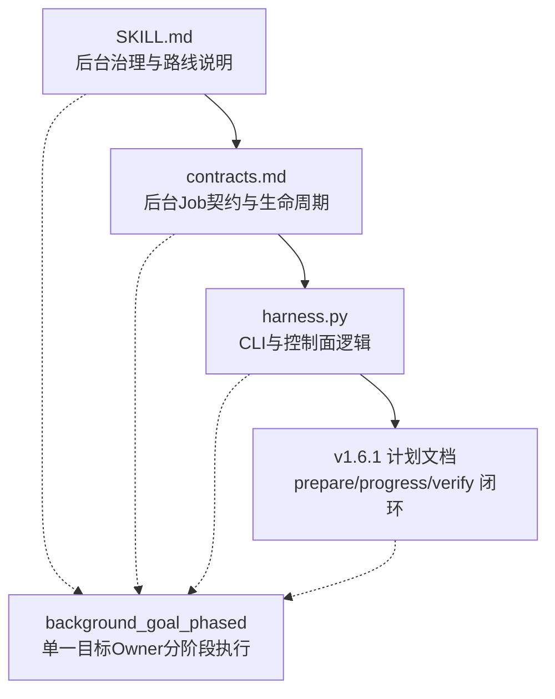
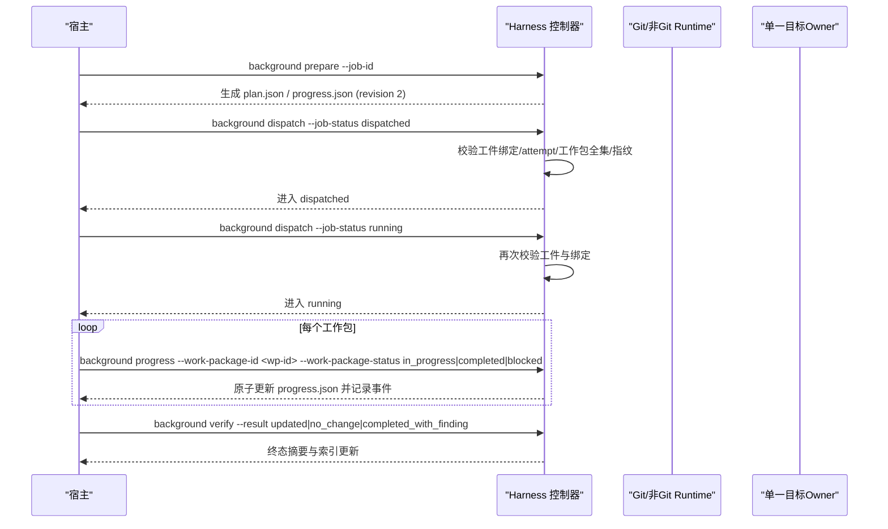
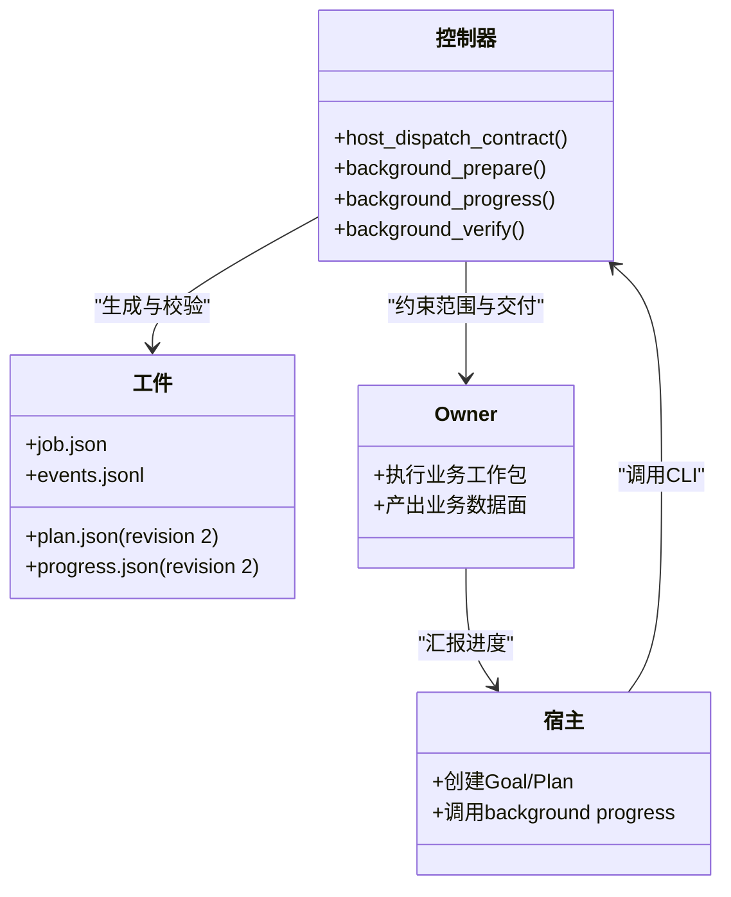

# 分阶段路线

<cite>
**本文引用的文件**   
- [SKILL.md](file://SKILL.md)
- [contracts.md](file://docs/contracts.md)
- [harness.py](file://scripts/harness.py)
- [v1.6.1-background-goal-host-bridge-implementation-plan.md](file://docs/plans/v1.6.1-background-goal-host-bridge-implementation-plan.md)
</cite>

## 目录
1. [引言](#引言)
2. [项目结构](#项目结构)
3. [核心组件](#核心组件)
4. [架构总览](#架构总览)
5. [详细组件分析](#详细组件分析)
6. [依赖分析](#依赖分析)
7. [性能考虑](#性能考虑)
8. [故障排查指南](#故障排查指南)
9. [结论](#结论)
10. [附录：规划模板与配置示例](#附录：规划模板与配置示例)

## 引言
本文件围绕 background_goal_phased 路线，系统化阐述“单一目标 Owner 的分阶段执行”模式。内容涵盖阶段划分原则、里程碑定义、阶段间数据传递、Owner 职责分离与权限控制、状态同步与一致性保证、监控与调试方法、错误处理与回滚策略，以及可复用的规划模板与配置要点。读者无需深入源码即可理解该路线的设计意图与使用方式。

## 项目结构
- 技能入口与使用说明位于 SKILL.md，明确 background_goal_phased 的语义与与其他后台路线的差异。
- 合同文档 docs/contracts.md 定义了后台 Job 的生命周期、工作包、进度验收、能力要求与派发序列等关键契约。
- 实现脚本 scripts/harness.py 提供 CLI 与内部逻辑，包含复杂路线的能力声明、prepare/dispatched/running 序列、phased_work_packages 能力标记及路由选择逻辑。
- 方案文档 v1.6.1-background-goal-host-bridge-implementation-plan.md 对 prepare/progress/verify 的控制面闭环、工件生成与校验、事件脱敏与幂等、在途兼容与重试策略进行了详尽说明。

图表来源 
- [SKILL.md:60-90](file://SKILL.md#L60-L90)
- [contracts.md:303-342](file://docs/contracts.md#L303-L342)
- [harness.py:7580-7616](file://scripts/harness.py#L7580-L7616)
- [v1.6.1-background-goal-host-bridge-implementation-plan.md:108-166](file://docs/plans/v1.6.1-background-goal-host-bridge-implementation-plan.md#L108-L166)

章节来源
- [SKILL.md:60-90](file://SKILL.md#L60-L90)
- [contracts.md:303-342](file://docs/contracts.md#L303-L342)
- [harness.py:7580-7616](file://scripts/harness.py#L7580-L7616)
- [v1.6.1-background-goal-host-bridge-implementation-plan.md:108-166](file://docs/plans/v1.6.1-background-goal-host-bridge-implementation-plan.md#L108-L166)

## 核心组件
- 单一目标 Owner：一个后台 Job 对应一个持久目标（Goal），由控制器通过契约约束其范围、交付物与工作包集合。
- 分阶段执行：将大目标拆分为若干工作包（Work Packages），按串行或受控并行推进，公共层与知识地图采用串行合并，确保一致性与可审计性。
- 控制面与业务面分离：控制面（job.json、plan.json、progress.json、events.jsonl）仅由 Harness CLI 写入；业务面允许后台 Job 在受限范围内写入。
- 工件与进度：prepare 生成 revision 2 的 plan.json 与 progress.json，后续通过 background progress 原子更新工作包状态，最终由 background verify 完成验收。

章节来源
- [contracts.md:303-342](file://docs/contracts.md#L303-L342)
- [v1.6.1-background-goal-host-bridge-implementation-plan.md:108-166](file://docs/plans/v1.6.1-background-goal-host-bridge-implementation-plan.md#L108-L166)
- [harness.py:7580-7616](file://scripts/harness.py#L7580-L7616)

## 架构总览
background_goal_phased 的核心流程遵循“准备 → 宿主建立 Goal/Plan → 派发 → 运行 → 进度检查点 → 验收”的标准序列。控制器在 dispatched 与 running 前进行绑定、attempt、工作包全集与指纹复验，确保工件未被篡改且与当前 Job 绑定一致。

图表来源 
- [contracts.md:325-342](file://docs/contracts.md#L325-L342)
- [v1.6.1-background-goal-host-bridge-implementation-plan.md:194-222](file://docs/plans/v1.6.1-background-goal-host-bridge-implementation-plan.md#L194-L222)
- [harness.py:7580-7616](file://scripts/harness.py#L7580-L7616)

## 详细组件分析

### 阶段划分原则与里程碑定义
- 阶段划分原则：
  - 以功能边界与依赖关系为依据，优先拆分出无外部依赖的独立子任务。
  - 公共层（如共享模块、通用文档、知识地图）作为前置阶段，确保后续阶段可串行合并。
  - 高风险或跨域变更单独成阶段，便于隔离验证与回滚。
- 里程碑定义：
  - 每个工作包对应一个里程碑，需满足输入契约、输出产物与验收条件。
  - 公共层里程碑必须通过“串行合并”门禁，确保知识地图与公共文档一致性。
  - 阶段间数据传递通过冻结的工作包契约与进度工件（plan.json、progress.json）保障。

章节来源
- [contracts.md:325-342](file://docs/contracts.md#L325-L342)
- [v1.6.1-background-goal-host-bridge-implementation-plan.md:131-166](file://docs/plans/v1.6.1-background-goal-host-bridge-implementation-plan.md#L131-L166)

### 单一目标 Owner 的职责分离与权限控制
- 职责分离：
  - Owner 负责执行业务工作包，产出业务数据面内容。
  - Harness 控制面负责工件生成、状态迁移、事件记录与验收。
- 权限控制：
  - 业务写入范围由 allowed_write_scope 与 forbidden_write_scope 限定，禁止覆盖 .git/**、.docs-harness/** 或实际 Runtime。
  - 控制面路径由 safe_target/git_dir/knowledge_job_dir 等安全函数解析，调用者不得传入输出路径。
  - 所有控制面写入必须由 Harness CLI 发起，宿主不得直接写 job.json、plan.json、progress.json、events.jsonl。

章节来源
- [v1.6.1-background-goal-host-bridge-implementation-plan.md:92-107](file://docs/plans/v1.6.1-background-goal-host-bridge-implementation-plan.md#L92-L107)
- [contracts.md:323-324](file://docs/contracts.md#L323-L324)

### 阶段间状态同步与一致性保证
- 工件确定性：prepare 基于 goal_contract、work_packages、job_id、idempotency_key 确定性生成 plan.json 与 progress.json（artifact_revision=2）。
- 进度原子更新：background progress 在 Job 级控制锁内原子重写 progress.json，派生 completed/remaining 列表，避免竞争态。
- 门禁校验：dispatched→running 与 verify 前均重新校验 Schema、绑定、attempt、工作包全集与指纹，防止篡改。
- 事件脱敏与幂等：统一 append_background_event 记录最小字段，连续相同拒绝幂等去重，不记录正文与敏感信息。

章节来源
- [v1.6.1-background-goal-host-bridge-implementation-plan.md:131-166](file://docs/plans/v1.6.1-background-goal-host-bridge-implementation-plan.md#L131-L166)
- [v1.6.1-background-goal-host-bridge-implementation-plan.md:167-192](file://docs/plans/v1.6.1-background-goal-host-bridge-implementation-plan.md#L167-L192)
- [v1.6.1-background-goal-host-bridge-implementation-plan.md:261-285](file://docs/plans/v1.6.1-background-goal-host-bridge-implementation-plan.md#L261-L285)

### 分阶段路线的监控与调试
- 进度跟踪：
  - 通过 background status 查看 Job 状态与 attempt。
  - 读取 progress.json 获取工作包状态、剩余与已完成列表。
- 事件审计：
  - events.jsonl 记录 transition_rejected、prepared、progress_updated、verify_result 等事件，支持事后复算。
- 调试建议：
  - 若进入 queued_manual，检查宿主是否具备 persistent_goal 与 phased_work_packages 能力。
  - 若 prepare 失败，确认工件未部分存在或绑定冲突，必要时使用 repair。
  - 若 verify 被拒，检查工作包是否全部 completed 或 blocked 且有 critical assessment。

章节来源
- [contracts.md:325-342](file://docs/contracts.md#L325-L342)
- [v1.6.1-background-goal-host-bridge-implementation-plan.md:261-285](file://docs/plans/v1.6.1-background-goal-host-bridge-implementation-plan.md#L261-L285)

### 错误处理与回滚策略
- 常见错误码：
  - missing_background_goal_artifacts：缺少工件，下一步 prepare。
  - invalid_background_progress_transition：非法状态转换。
  - background_goal_artifacts_tampered：工件被篡改。
  - invalid_background_scope：业务范围越界。
- 重试与修复：
  - retry 归档旧工件、推进 attempt、清空引用，不继承完成进度。
  - prepare --repair 先归档再重建 revision 2 工件，记录 repair 事件。
- 回滚窗口：
  - project rollback-check 在有活动 v2 任务时阻断回滚；无活动任务表示窗口可用。
  - 回滚后 v2 对象只读保留，旧控制器遇到 v2 对象失败关闭。

章节来源
- [v1.6.1-background-goal-host-bridge-implementation-plan.md:286-304](file://docs/plans/v1.6.1-background-goal-host-bridge-implementation-plan.md#L286-L304)
- [contracts.md:236-249](file://docs/contracts.md#L236-L249)

### 路由选择与估算修正
- 路由选择：
  - background_goal_phased 适用于大仓库、多领域依赖、循环依赖或文档数量较多的场景。
  - change_scoped 模式下仅因实际变化面无法有界才硬升级，避免小增量被无条件提升为 phased。
- 估算基础：
  - project_wide：用于 bootstrap、全项目审查与 preserve-and-merge。
  - change_scoped：用于增量知识与交付治理，输入 changed_paths、selected_features、deliverables。

章节来源
- [harness.py:8074-8092](file://scripts/harness.py#L8074-L8092)
- [v1.6.1-background-goal-host-bridge-implementation-plan.md:305-336](file://docs/plans/v1.6.1-background-goal-host-bridge-implementation-plan.md#L305-L336)

## 依赖分析
background_goal_phased 依赖以下组件与契约：
- 控制器能力：persistent_goal、phased_work_packages。
- 工件契约：background-plan/v1、background-progress/v1（artifact_revision=2）。
- 控制面路径：safe_target/git_dir/knowledge_job_dir。
- 事件契约：统一 append_background_event，脱敏与幂等。

图表来源 
- [harness.py:7580-7616](file://scripts/harness.py#L7580-L7616)
- [v1.6.1-background-goal-host-bridge-implementation-plan.md:131-166](file://docs/plans/v1.6.1-background-goal-host-bridge-implementation-plan.md#L131-L166)

章节来源
- [harness.py:7580-7616](file://scripts/harness.py#L7580-L7616)
- [v1.6.1-background-goal-host-bridge-implementation-plan.md:131-166](file://docs/plans/v1.6.1-background-goal-host-bridge-implementation-plan.md#L131-L166)

## 性能考虑
- 串行合并公共层：减少并发冲突与重复计算，提升整体稳定性。
- 原子更新与锁：Job 级控制锁避免竞态，降低重试与修复成本。
- 事件脱敏与幂等：减少 I/O 与存储压力，提高审计效率。
- 估算修正：change_scoped 避免小增量误判为大任务，降低不必要的 phased 开销。

[本节为通用指导，不直接分析具体文件]

## 故障排查指南
- 快速定位：
  - 检查 background status 与 progress.json 的工作包状态。
  - 查看 events.jsonl 中的 transition_rejected 与 reason_code。
- 常见问题：
  - 缺少工件：执行 background prepare，必要时 --repair。
  - 非法进度转换：确保仅在 running 状态更新，且状态转换合法。
  - 业务范围越界：调整 allowed_write_scope，不得包含 .git/** 或 .docs-harness/**。
- 恢复步骤：
  - retry 归档旧工件并推进 attempt。
  - prepare --repair 重建工件并记录事件。
  - 如需回滚，先检查是否有活动 v2 任务。

章节来源
- [v1.6.1-background-goal-host-bridge-implementation-plan.md:261-304](file://docs/plans/v1.6.1-background-goal-host-bridge-implementation-plan.md#L261-L304)
- [contracts.md:325-342](file://docs/contracts.md#L325-L342)

## 结论
background_goal_phased 通过单一目标 Owner 与分阶段执行，结合严格的控制面契约与工件校验，实现了大型、复杂目标的可靠治理。其设计强调职责分离、状态一致性、可审计性与可恢复性，配合估算修正与监控调试手段，可在保证质量的前提下高效推进多阶段任务。

[本节为总结性内容，不直接分析具体文件]

## 附录：规划模板与配置示例
- 规划模板要点：
  - 明确目标 objective 与交付物 deliverables。
  - 拆分工作包 work_packages，标注依赖与合并顺序。
  - 定义 allowed_read_scope、allowed_write_scope、forbidden_write_scope。
  - 指定 execution_route 为 background_goal_phased。
- 配置示例字段（参考契约与计划文档）：
  - goal_contract.objective、goal_contract.deliverables
  - work_packages[].id、objective、dependencies
  - host_dispatch_contract.required_capabilities、dispatch_sequence
  - knowledge_context.selected_features、categories
  - estimate_basis=change_scoped 或 project_wide

章节来源
- [contracts.md:303-342](file://docs/contracts.md#L303-L342)
- [v1.6.1-background-goal-host-bridge-implementation-plan.md:131-166](file://docs/plans/v1.6.1-background-goal-host-bridge-implementation-plan.md#L131-L166)
- [v1.6.1-background-goal-host-bridge-implementation-plan.md:305-336](file://docs/plans/v1.6.1-background-goal-host-bridge-implementation-plan.md#L305-L336)