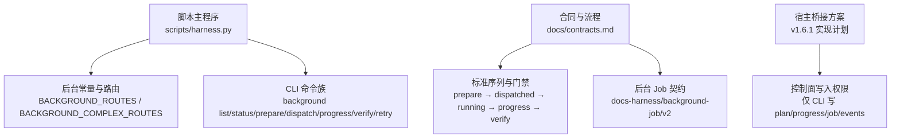
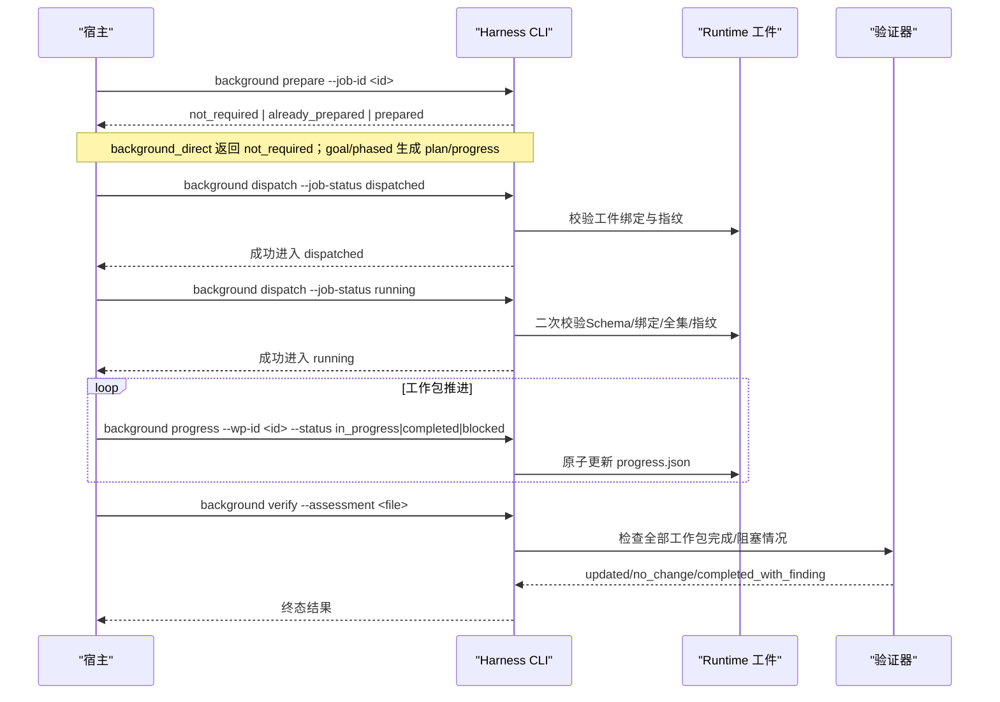
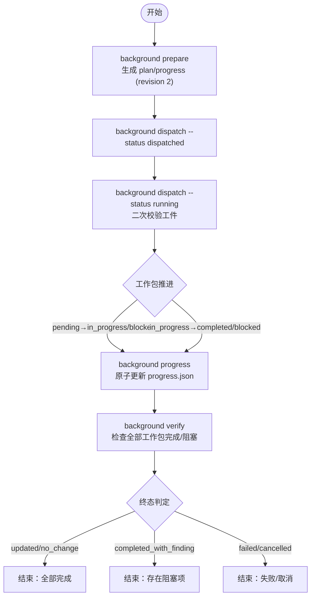
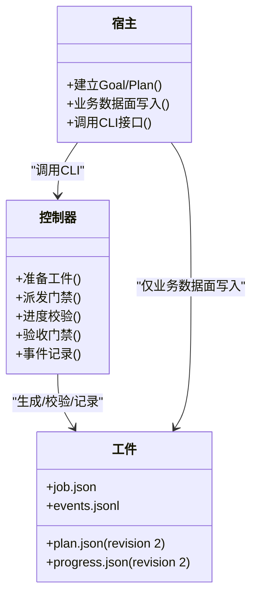

# 后台路线类型

<cite>
**本文引用的文件**   
- [SKILL.md](file://SKILL.md)
- [contracts.md](file://docs/contracts.md)
- [v1.6.1-background-goal-host-bridge-implementation-plan.md](file://docs/plans/v1.6.1-background-goal-host-bridge-implementation-plan.md)
- [harness.py](file://scripts/harness.py)
</cite>

## 目录
1. [简介](#简介)
2. [项目结构](#项目结构)
3. [核心组件](#核心组件)
4. [架构总览](#架构总览)
5. [详细组件分析](#详细组件分析)
6. [依赖关系分析](#依赖关系分析)
7. [性能考量](#性能考量)
8. [故障排查指南](#故障排查指南)
9. [结论](#结论)
10. [附录：配置示例与最佳实践](#附录配置示例与最佳实践)

## 简介
本文件面向 Docs Harness 的三种后台路线类型，系统性阐述其适用场景、执行流程、约束条件与资源特征，并给出迁移策略与最佳实践。三种路线分别为：
- background_direct：有界后台子智能体，适合简单、可明确限定范围的后台任务。
- background_goal：持久目标与正式方案，先建立持续目标与计划，再按工作包推进，适合复杂工作流。
- background_goal_phased：单一目标 Owner 分阶段推进，公共层与知识地图串行合并，适合大仓库或跨域变更。

## 项目结构
- 入口与常量定义位于脚本主程序，包含后台状态集、路由集合、进度状态等关键常量。
- 合同文档定义了后台治理、双通道语义、文档真源路由与标准序列。
- 实现方案明确了 prepare/progress/verify 的控制面闭环、工件校验、事件脱敏与兼容路径。

**图表来源** 
- [harness.py:124-126](file://scripts/harness.py#L124-L126)
- [contracts.md:315-336](file://docs/contracts.md#L315-L336)
- [v1.6.1-background-goal-host-bridge-implementation-plan.md:90-130](file://docs/plans/v1.6.1-background-goal-host-bridge-implementation-plan.md#L90-L130)

**章节来源**
- [harness.py:124-126](file://scripts/harness.py#L124-L126)
- [contracts.md:315-336](file://docs/contracts.md#L315-L336)

## 核心组件
- 后台路由集合与复杂度分类：
  - 路由集合包含三种类型；其中 goal 与 phased 属于复杂路线，需要 prepare/progress/verify 完整流程。
- 后台状态机：
  - 终态集合包括 updated/no_change/completed_with_finding/failed/cancelled 等；已知状态还包括 contract_ready/dispatched/running/waiting_for_bootstrap_merge 等。
- 进度状态：
  - pending/in_progress/completed/blocked，且受严格转换规则约束。
- 控制面与数据面分离：
  - 业务数据面由后台 Job 写入 allowed_write_scope；控制面（job.json/plan.json/progress.json/events.jsonl）仅允许 Harness CLI 写入。

**章节来源**
- [harness.py:100-127](file://scripts/harness.py#L100-L127)
- [contracts.md:323-336](file://docs/contracts.md#L323-L336)

## 架构总览
后台治理采用“父任务完成 + 后台独立验收”的双通道设计。复杂路线的标准序列为：contract_ready → background prepare → 宿主 Goal/Plan → dispatched → running → background progress（一次或多次）→ background verify → 终态。所有控制面工件由控制器生成与校验，宿主不得直接写控制面文件。

**图表来源** 
- [contracts.md:325-336](file://docs/contracts.md#L325-L336)
- [v1.6.1-background-goal-host-bridge-implementation-plan.md:108-130](file://docs/plans/v1.6.1-background-goal-host-bridge-implementation-plan.md#L108-L130)

## 详细组件分析

### background_direct：有界后台子智能体
- 适用场景：
  - 简单、范围明确、无需持久目标与工作包的后台任务。
- 限制条件：
  - 不创建 Goal/Plan 工件；prepare 返回 not_required。
  - 仍受后台写入边界约束（allowed_write_scope），禁止越界到 .git/** 或 .docs-harness/**。
- 执行流程：
  - 从 contract_ready 可直接派发至 running（保留旧别名兼容）。
  - 验收行为保持现有逻辑，不要求 progress 工件。
- 性能与资源：
  - 开销最小，无额外工件维护与校验成本。

**章节来源**
- [SKILL.md:63-65](file://SKILL.md#L63-L65)
- [contracts.md:317-321](file://docs/contracts.md#L317-L321)
- [v1.6.1-background-goal-host-bridge-implementation-plan.md:121-128](file://docs/plans/v1.6.1-background-goal-host-bridge-implementation-plan.md#L121-L128)

### background_goal：持久目标与正式方案
- 特点：
  - 先通过 prepare 确定性生成 revision 2 的 plan.json 与 progress.json，绑定 job_id 与 idempotency_key。
  - 支持正式方案生成与工作包管理，适合复杂工作流。
- 执行流程：
  - contract_ready → prepare → 宿主建立 Goal/Plan → dispatched → running → progress（多次）→ verify → 终态。
  - 两道门禁：dispatched 前必须 prepare；running 前再次校验工件完整性与指纹。
- 进度管理：
  - 仅允许 running 状态更新进度；合法转换受限（pending→in_progress/blocked，in_progress→completed/blocked）。
  - completed_work_packages 与 remaining_work_packages 由控制器派生，调用者不可单独指定。
- 验收门禁：
  - updated/no_change 要求全部工作包 completed；completed_with_finding 只允许 completed/blocked 并返回 blocked ID。
- 资源与性能：
  - 相比 direct 增加工件物化、校验与事件记录开销；但具备更强的可审计性与可恢复性。

**图表来源** 
- [v1.6.1-background-goal-host-bridge-implementation-plan.md:108-130](file://docs/plans/v1.6.1-background-goal-host-bridge-implementation-plan.md#L108-L130)
- [contracts.md:332-338](file://docs/contracts.md#L332-L338)

**章节来源**
- [v1.6.1-background-goal-host-bridge-implementation-plan.md:108-130](file://docs/plans/v1.6.1-background-goal-host-bridge-implementation-plan.md#L108-L130)
- [contracts.md:332-338](file://docs/contracts.md#L332-L338)

### background_goal_phased：单一目标 Owner 分阶段执行
- 机制要点：
  - 单一目标 Owner 模式，公共层与知识地图串行合并，避免并发冲突。
  - 适用于大仓库或跨域变更，按实际变化面估算，降低被整仓规模误升级的风险。
- 执行流程：
  - 同 goal 路线的 prepare/dispatch/running/progress/verify 序列；在 change_scoped 模式下更精细地评估工作量。
- 里程碑管理：
  - 通过 work_package_states 驱动阶段推进；控制器派生剩余与已完成列表，确保一致性。
- 性能与资源：
  - 相较 goal 路线，phased 强调分阶段与串行合并，减少大规模并行带来的冲突与重试成本。

**章节来源**
- [SKILL.md:65](file://SKILL.md#L65)
- [contracts.md:319](file://docs/contracts.md#L319)
- [v1.6.1-background-goal-host-bridge-implementation-plan.md:306-336](file://docs/plans/v1.6.1-background-goal-host-bridge-implementation-plan.md#L306-L336)

### 三种路线对比
- 适用场景：
  - background_direct：简单、有界、无需持久目标的后台任务。
  - background_goal：复杂工作流，需正式方案与工作包管理。
  - background_goal_phased：大仓库或跨域变更，需分阶段串行合并。
- 性能特征：
  - direct 开销最低；goal/phased 增加工件管理与校验成本，但提升可审计性与可恢复性。
- 资源消耗：
  - goal/phased 需要维护 plan.json/progress.json 与事件日志；direct 仅需基础状态流转。

**章节来源**
- [harness.py:124-126](file://scripts/harness.py#L124-L126)
- [contracts.md:315-321](file://docs/contracts.md#L315-L321)

## 依赖关系分析
- 控制器与宿主职责分离：
  - 控制器负责控制面工件（job/plan/progress/events）的生成、校验与事件记录；宿主负责应用内 Goal/Plan 的建立与业务数据面写入。
- 兼容入口统一校验：
  - 废弃别名（knowledge job-status|dispatch|verify|retry）不再绕过安全不变量，复杂路线一律走 prepare/dispatched/running 序列。
- 工件版本与判别：
  - revision 2 工件通过 artifact_revision=2 与 generated_by=docs-harness 判别；旧工件仅在特定条件下走 legacy verify 豁免。

**图表来源** 
- [v1.6.1-background-goal-host-bridge-implementation-plan.md:90-106](file://docs/plans/v1.6.1-background-goal-host-bridge-implementation-plan.md#L90-L106)
- [contracts.md:323-336](file://docs/contracts.md#L323-L336)

**章节来源**
- [v1.6.1-background-goal-host-bridge-implementation-plan.md:90-106](file://docs/plans/v1.6.1-background-goal-host-bridge-implementation-plan.md#L90-L106)
- [contracts.md:323-336](file://docs/contracts.md#L323-L336)

## 性能考量
- 估算基础：
  - project_wide：用于 bootstrap、全项目审查与明确要求的全量 preserve-and-merge。
  - change_scoped：用于增量知识与交付治理，基于 changed_paths、selected features、deliverables 与允许写入范围。
- 路由修正：
  - scan_truncated → background_goal_phased 硬升级仅保留给 project_wide；change_scoped 下仅降低 confidence，除非实际变化面无法有界才硬升级。
- 幂等键与指纹：
  - source_fingerprint 与 background_idempotency_key 保持稳定，避免在途 Job 重复创建。

**章节来源**
- [v1.6.1-background-goal-host-bridge-implementation-plan.md:306-336](file://docs/plans/v1.6.1-background-goal-host-bridge-implementation-plan.md#L306-L336)

## 故障排查指南
- 常见错误与处理：
  - missing_background_goal_artifacts：缺少 Goal 工件，需执行 background prepare。
  - invalid_background_progress_transition：非法进度转换，检查状态机规则。
  - background_goal_artifacts_tampered：工件被篡改，需 repair 并重新 prepare。
  - invalid_background_scope：业务范围越界，调整 allowed_write_scope。
- 事件脱敏与去重：
  - 拒绝事件仅记录 reason_code、状态、attempt 与指纹，不记录正文、异常详情或会话信息；连续相同拒绝幂等去重。
- 重试与修复：
  - retry 仅归档旧工件、推进 attempt 与清理引用；prepare --repair 专门处理部分/无效/绑定冲突工件。

**章节来源**
- [v1.6.1-background-goal-host-bridge-implementation-plan.md:194-220](file://docs/plans/v1.6.1-background-goal-host-bridge-implementation-plan.md#L194-L220)
- [v1.6.1-background-goal-host-bridge-implementation-plan.md:261-304](file://docs/plans/v1.6.1-background-goal-host-bridge-implementation-plan.md#L261-L304)

## 结论
- background_direct 适合简单有界任务，开销低、流程短。
- background_goal 提供持久目标与正式方案，适合复杂工作流，具备强可审计性与可恢复性。
- background_goal_phased 通过单一目标 Owner 与分阶段串行合并，优化大仓库与跨域变更的执行效率。
- 选择依据包括任务复杂度、变更范围、宿主能力与可观测性需求；迁移时应遵循 prepare/dispatched/running/progress/verify 标准序列，避免静默降级。

## 附录：配置示例与最佳实践
- 配置要点：
  - 明确 execution_route 与 document_routes；确保 allowed_write_scope 不包含 .git/** 或 .docs-harness/**。
  - 使用 change_scoped 估算时传入 changed_paths、selected features 与 deliverables。
- 最佳实践：
  - 复杂路线务必先 prepare，再建立宿主 Goal/Plan，随后 dispatched → running。
  - 进度更新仅在 running 状态进行，遵循合法状态转换。
  - 验收前确保全部工作包 completed 或合理 blocked，并保留必要证据。
  - 遇到工件错误或基线漂移，优先使用 prepare --repair 修复。

**章节来源**
- [contracts.md:307-321](file://docs/contracts.md#L307-L321)
- [v1.6.1-background-goal-host-bridge-implementation-plan.md:108-130](file://docs/plans/v1.6.1-background-goal-host-bridge-implementation-plan.md#L108-L130)