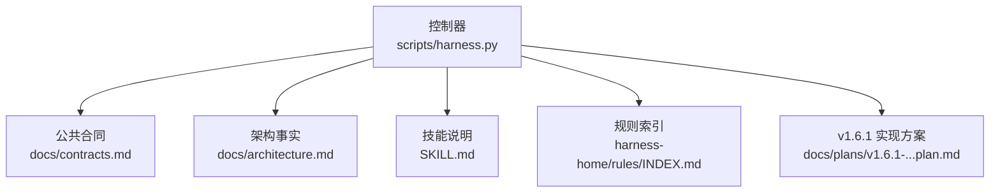
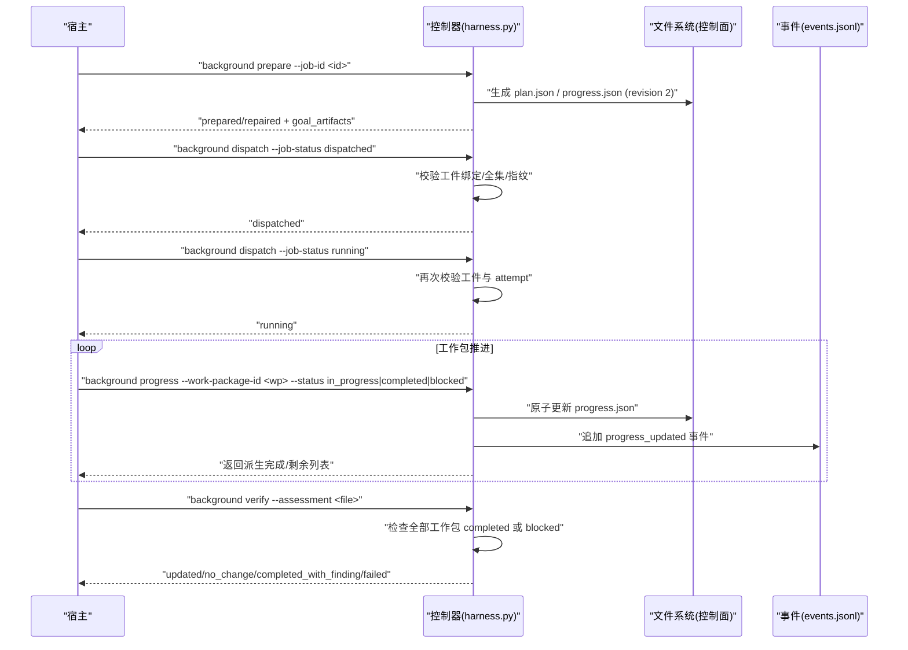
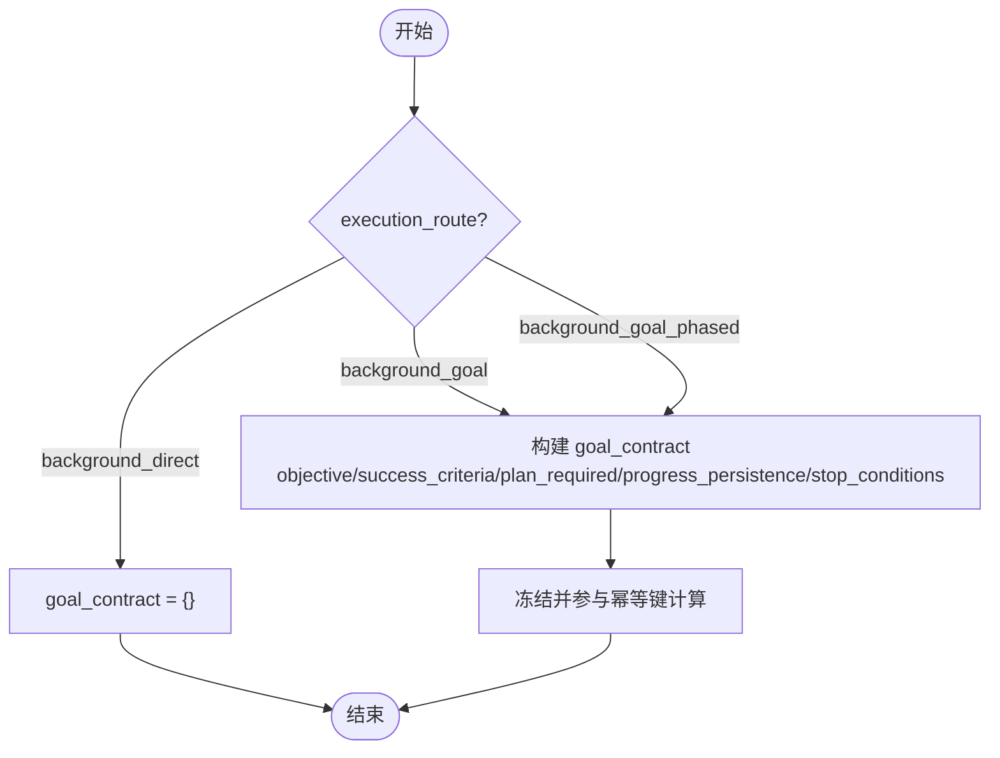
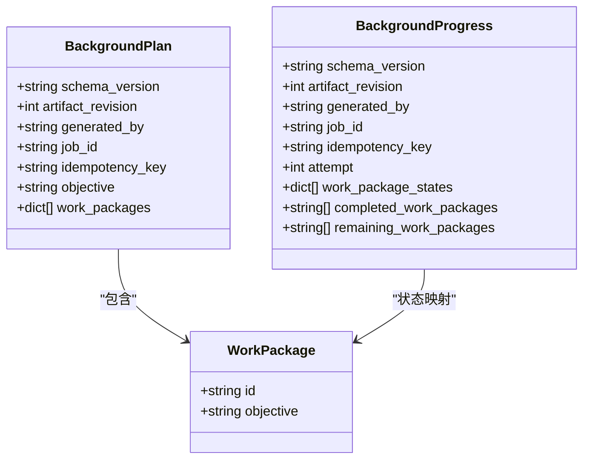
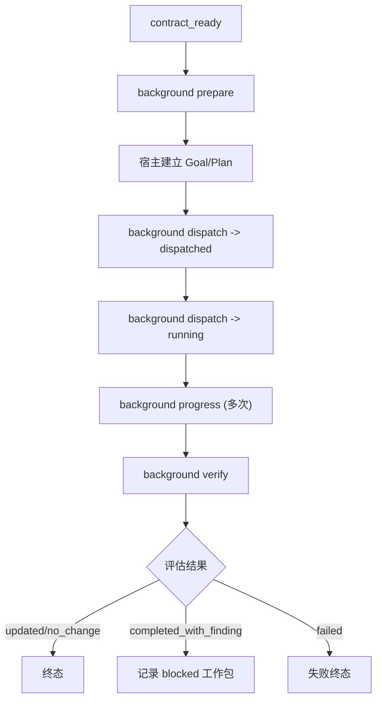
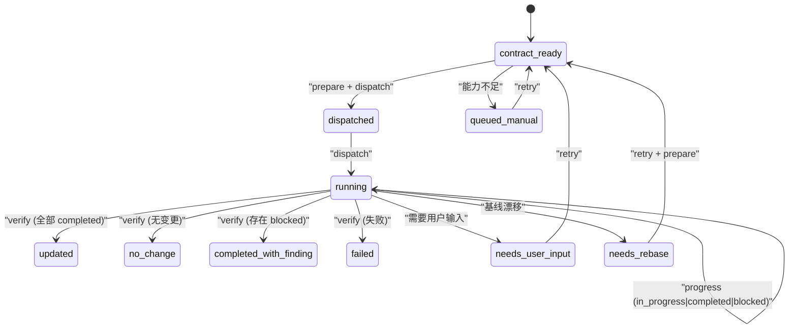
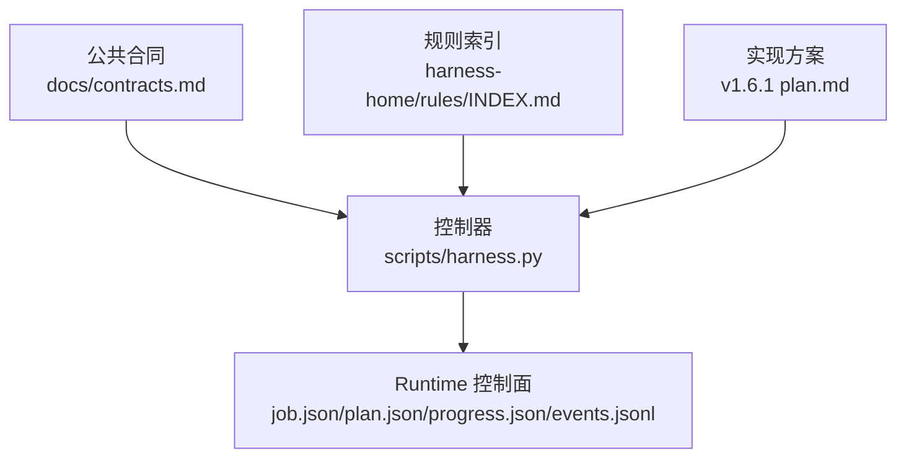

# 目标路线

<cite>
**本文引用的文件**   
- [scripts/harness.py](file://scripts/harness.py)
- [docs/contracts.md](file://docs/contracts.md)
- [docs/architecture.md](file://docs/architecture.md)
- [SKILL.md](file://SKILL.md)
- [harness-home/rules/INDEX.md](file://harness-home/rules/INDEX.md)
- [docs/plans/v1.6.1-background-goal-host-bridge-implementation-plan.md](file://docs/plans/v1.6.1-background-goal-host-bridge-implementation-plan.md)
</cite>

## 目录
1. [引言](#引言)
2. [项目结构](#项目结构)
3. [核心组件](#核心组件)
4. [架构总览](#架构总览)
5. [详细组件分析](#详细组件分析)
6. [依赖关系分析](#依赖关系分析)
7. [性能考量](#性能考量)
8. [故障排查指南](#故障排查指南)
9. [结论](#结论)
10. [附录](#附录)

## 引言
本文件围绕 background_goal 路线，系统化阐述 Docs Harness 的“持久目标管理机制”与“正式方案生成流程”，并解释复杂工作流的编排能力、扩展性与可定制性。文档面向不同技术背景的读者，提供从概念到代码级的完整说明，包括状态机管理、进度跟踪与故障恢复机制，以及配置示例与最佳实践。

## 项目结构
- 控制器源码真源位于 scripts/harness.py，负责任务准入、上下文、验收、知识生命周期与后台 Job 状态机。
- 公共合同与行为约定在 docs/contracts.md；架构事实与边界在 docs/architecture.md；技能使用说明在 SKILL.md。
- 规则索引在 harness-home/rules/INDEX.md，用于 Gate 与规则生效控制。
- v1.6.1 背景目标宿主桥接实现方案在 docs/plans/v1.6.1-background-goal-host-bridge-implementation-plan.md，定义了 prepare/progress/verify 等关键流程与约束。

**图表来源** 
- [scripts/harness.py:1-120](file://scripts/harness.py#L1-L120)
- [docs/contracts.md:1-120](file://docs/contracts.md#L1-L120)
- [docs/architecture.md:1-26](file://docs/architecture.md#L1-L26)
- [SKILL.md:1-60](file://SKILL.md#L1-L60)
- [harness-home/rules/INDEX.md:1-41](file://harness-home/rules/INDEX.md#L1-L41)
- [docs/plans/v1.6.1-background-goal-host-bridge-implementation-plan.md:1-120](file://docs/plans/v1.6.1-background-goal-host-bridge-implementation-plan.md#L1-L120)

**章节来源**
- [docs/architecture.md:1-26](file://docs/architecture.md#L1-L26)
- [docs/contracts.md:1-120](file://docs/contracts.md#L1-L120)
- [SKILL.md:1-60](file://SKILL.md#L1-L60)
- [harness-home/rules/INDEX.md:1-41](file://harness-home/rules/INDEX.md#L1-L41)

## 核心组件
- 后台 Job 类型与路由：background_direct、background_goal、background_goal_phased。
- Goal 工件：plan.json（正式方案）、progress.json（持久化进度）。
- 控制器命令：background prepare、background dispatch、background progress、background verify、background retry。
- 事件系统：events.jsonl 记录有界、脱敏的状态转换与拒绝原因。
- 控制面与数据面分离：业务写入范围不得覆盖 .git/** 与 .docs-harness/** 控制面路径。

**章节来源**
- [docs/contracts.md:300-360](file://docs/contracts.md#L300-L360)
- [SKILL.md:60-90](file://SKILL.md#L60-L90)
- [scripts/harness.py:100-130](file://scripts/harness.py#L100-L130)

## 架构总览
background_goal 路线的核心是“契约就绪 → 准备工件 → 宿主建立 Goal/Plan → 派发 → 运行 → 进度更新 → 验证 → 终态”。控制器通过严格校验 Goal 工件（plan.json、progress.json）与 Job 绑定、attempt、工作包全集与指纹，确保复杂任务的执行安全与可审计。

**图表来源** 
- [scripts/harness.py:7400-7600](file://scripts/harness.py#L7400-L7600)
- [scripts/harness.py:8461-8525](file://scripts/harness.py#L8461-L8525)
- [scripts/harness.py:8528-8586](file://scripts/harness.py#L8528-L8586)
- [docs/plans/v1.6.1-background-goal-host-bridge-implementation-plan.md:100-220](file://docs/plans/v1.6.1-background-goal-host-bridge-implementation-plan.md#L100-L220)

## 详细组件分析

### 目标合同 goal_contract 的定义、版本与变更管理
- goal_contract 由控制器根据估算结果生成，包含 objective、success_criteria、plan_required、progress_persistence、stop_conditions 等字段。
- 对于 background_direct 路由，goal_contract 为空对象；对于 background_goal 与 background_goal_phased，必须包含上述字段。
- 变更管理：当 package revision 变化时，控制器生成 contract_delta，归档至 package-history；新增 Gate 仅缺方案字段时返回 plan_delta_contract，宿主只需补充缺失字段，不重做完整方案。

**图表来源** 
- [scripts/harness.py:7410-7428](file://scripts/harness.py#L7410-L7428)
- [docs/contracts.md:300-360](file://docs/contracts.md#L300-L360)

**章节来源**
- [scripts/harness.py:7410-7428](file://scripts/harness.py#L7410-L7428)
- [docs/contracts.md:300-360](file://docs/contracts.md#L300-L360)

### 正式方案的生成过程：plan.json 结构与工作包分解
- plan.json 使用 docs-harness/background-plan/v1，artifact_revision=2，generated_by="docs-harness"，包含 job_id、idempotency_key、objective、work_packages。
- work_packages 由 job.work_packages 规范化生成，每个工作包具有 id（wp-01, wp-02...）与 objective。
- progress.json 使用 docs-harness/background-progress/v1，包含 attempt、work_package_states（初始均为 pending）、completed_work_packages、remaining_work_packages。

**图表来源** 
- [scripts/harness.py:7443-7469](file://scripts/harness.py#L7443-L7469)
- [scripts/harness.py:7472-7482](file://scripts/harness.py#L7472-L7482)

**章节来源**
- [scripts/harness.py:7443-7469](file://scripts/harness.py#L7443-L7469)
- [scripts/harness.py:7472-7482](file://scripts/harness.py#L7472-L7482)

### 复杂工作流编排：多阶段协调、依赖管理与资源调度
- 标准序列：contract_ready → background prepare → 宿主 Goal/Plan → dispatched → running → background progress（一次或多次）→ background verify → 终态。
- 依赖管理：knowledge bootstrap 未完成时，增量 Job 进入 waiting_for_bootstrap_merge；只有 bootstrap 成功且控制器复算知识 ready 才释放等待者。
- 资源调度：控制面路径由控制器解析，禁止业务写入范围覆盖 .git/** 与 .docs-harness/**；Job 级控制锁保证并发安全。

**图表来源** 
- [docs/contracts.md:320-360](file://docs/contracts.md#L320-L360)
- [SKILL.md:60-90](file://SKILL.md#L60-L90)

**章节来源**
- [docs/contracts.md:320-360](file://docs/contracts.md#L320-L360)
- [SKILL.md:60-90](file://SKILL.md#L60-L90)

### 状态机管理、进度跟踪与故障恢复
- 状态机：contract_ready、dispatched、running、waiting_for_dependency、waiting_for_bootstrap_merge、needs_user_input、needs_rebase、queued_manual、updated、no_change、completed_with_finding、failed、cancelled。
- 进度跟踪：progress.json 中 work_package_states 驱动 completed_work_packages 与 remaining_work_packages 派生；每次更新原子写入并追加事件。
- 故障恢复：retry 归档旧工件、推进 attempt、清空引用；prepare --repair 处理部分/无效/篡改工件；legacy verify 一次性豁免在途旧工件。

**图表来源** 
- [scripts/harness.py:100-130](file://scripts/harness.py#L100-L130)
- [scripts/harness.py:8528-8586](file://scripts/harness.py#L8528-L8586)
- [docs/plans/v1.6.1-background-goal-host-bridge-implementation-plan.md:280-320](file://docs/plans/v1.6.1-background-goal-host-bridge-implementation-plan.md#L280-L320)

**章节来源**
- [scripts/harness.py:100-130](file://scripts/harness.py#L100-L130)
- [scripts/harness.py:8528-8586](file://scripts/harness.py#L8528-L8586)
- [docs/plans/v1.6.1-background-goal-host-bridge-implementation-plan.md:280-320](file://docs/plans/v1.6.1-background-goal-host-bridge-implementation-plan.md#L280-L320)

### 扩展性与可定制性
- 路由选择：background_direct、background_goal、background_goal_phased 支持不同复杂度与分阶段执行。
- 估算基础：project_wide 与 change_scoped 两种模式，小范围变化避免强制 phased。
- 文档路由：document_routes 显式声明 architecture、changelog、todo、adr_root、reviews_root，路径链不得包含符号链接，未知键或非法配置返回 invalid_document_route_config。

**章节来源**
- [docs/contracts.md:300-360](file://docs/contracts.md#L300-L360)
- [docs/plans/v1.6.1-background-goal-host-bridge-implementation-plan.md:300-360](file://docs/plans/v1.6.1-background-goal-host-bridge-implementation-plan.md#L300-L360)

### 配置示例与最佳实践
- 最小配置：创建后台 Job 时指定 allowed_read_scope、allowed_write_scope、forbidden_write_scope，确保业务范围不覆盖控制面。
- 推荐实践：
  - 始终使用 background prepare 生成 plan.json 与 progress.json，避免宿主直接写控制面。
  - 使用受控 reason_code 更新进度，避免自由文本。
  - 利用 events.jsonl 进行审计与复算，不记录敏感信息。
  - 在 change_scoped 模式下，基于 changed_paths 精确估算，避免大仓误判。

**章节来源**
- [scripts/harness.py:8597-8699](file://scripts/harness.py#L8597-L8699)
- [docs/plans/v1.6.1-background-goal-host-bridge-implementation-plan.md:100-220](file://docs/plans/v1.6.1-background-goal-host-bridge-implementation-plan.md#L100-L220)

## 依赖关系分析
- 控制器依赖公共合同定义 Schema、状态码与错误码。
- 规则索引影响 Gate 与准入逻辑，规则指纹漂移将导致失败关闭。
- 实现方案为控制器行为提供设计依据，确保 prepare/progress/verify 的安全不变量。

**图表来源** 
- [docs/contracts.md:1-120](file://docs/contracts.md#L1-L120)
- [harness-home/rules/INDEX.md:1-41](file://harness-home/rules/INDEX.md#L1-L41)
- [docs/plans/v1.6.1-background-goal-host-bridge-implementation-plan.md:1-120](file://docs/plans/v1.6.1-background-goal-host-bridge-implementation-plan.md#L1-L120)
- [scripts/harness.py:1-120](file://scripts/harness.py#L1-L120)

**章节来源**
- [docs/contracts.md:1-120](file://docs/contracts.md#L1-L120)
- [harness-home/rules/INDEX.md:1-41](file://harness-home/rules/INDEX.md#L1-L41)
- [docs/plans/v1.6.1-background-goal-host-bridge-implementation-plan.md:1-120](file://docs/plans/v1.6.1-background-goal-host-bridge-implementation-plan.md#L1-L120)
- [scripts/harness.py:1-120](file://scripts/harness.py#L1-L120)

## 性能考量
- 幂等复用：同一 target、任务文本、事实与工作区快照重复 run 时幂等复用活动任务，避免重复建立上下文与授权。
- 证据缓存：验证命令收据缓存命中时跳过执行，仅失败或输入变化的命令重跑。
- 事件去重：连续相同拒绝事件幂等去重，避免事件洪泛。

**章节来源**
- [SKILL.md:30-60](file://SKILL.md#L30-L60)
- [docs/contracts.md:180-220](file://docs/contracts.md#L180-L220)
- [scripts/harness.py:7554-7578](file://scripts/harness.py#L7554-L7578)

## 故障排查指南
- 常见错误码：
  - missing_background_goal_artifacts：未准备 Goal 工件。
  - invalid_background_plan/progress：工件 Schema 或内容无效。
  - background_goal_artifacts_tampered：工件指纹漂移。
  - invalid_background_progress_transition：进度状态倒退或跳过。
  - unknown_background_work_package：工作包 ID 不在冻结方案中。
- 排查步骤：
  - 检查 job.goal_artifacts 是否指向有效的 plan.json 与 progress.json。
  - 确认 attempt 一致且工件未被外部篡改。
  - 查看 events.jsonl 中的 transition_rejected 或 progress_rejected 事件。
  - 必要时使用 background prepare --repair 修复工件。

**章节来源**
- [scripts/harness.py:7485-7551](file://scripts/harness.py#L7485-L7551)
- [scripts/harness.py:8528-8586](file://scripts/harness.py#L8528-L8586)
- [scripts/harness.py:7554-7578](file://scripts/harness.py#L7554-L7578)

## 结论
background_goal 路线通过严格的 Goal 工件管理、状态机控制与事件审计，实现了复杂后台任务的可信编排。其扩展性体现在路由选择、估算基础与文档路由的灵活配置，最佳实践强调控制面所有权、幂等性与安全性。遵循本文档的流程与约束，可构建稳定、可审计、可恢复的目标导向型后台治理体系。

## 附录
- CLI 参考：background prepare、dispatch、progress、verify、retry。
- 事件字段：event、job_id、attempt、from_status、requested_status、reason_code、at。
- 风险 Gate：security-sensitive、destructive-data、release-external 为安全底线，不可豁免。

**章节来源**
- [SKILL.md:70-90](file://SKILL.md#L70-L90)
- [docs/contracts.md:30-60](file://docs/contracts.md#L30-L60)
- [scripts/harness.py:7554-7578](file://scripts/harness.py#L7554-L7578)