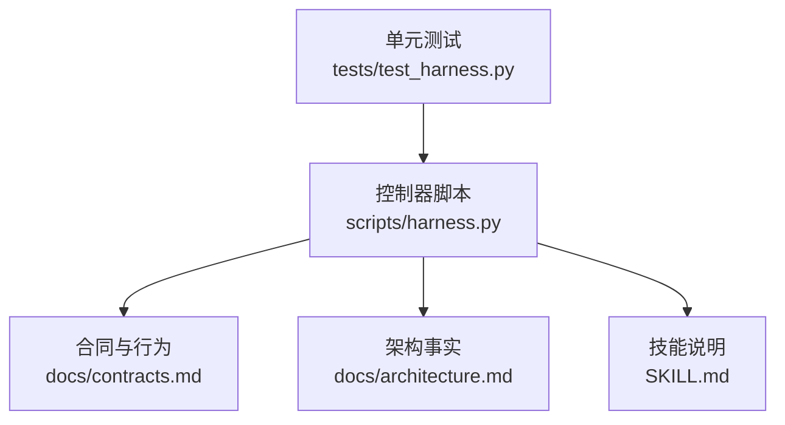
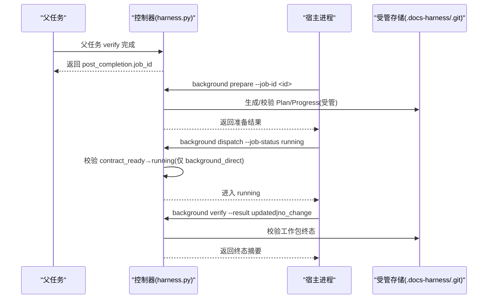
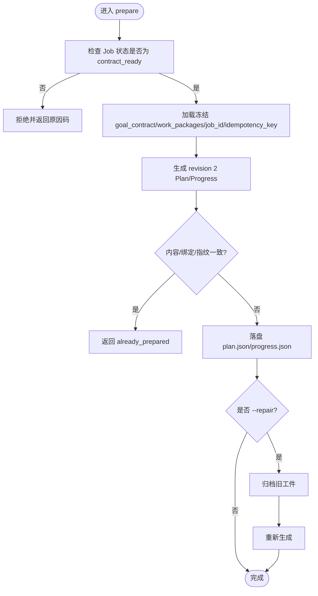
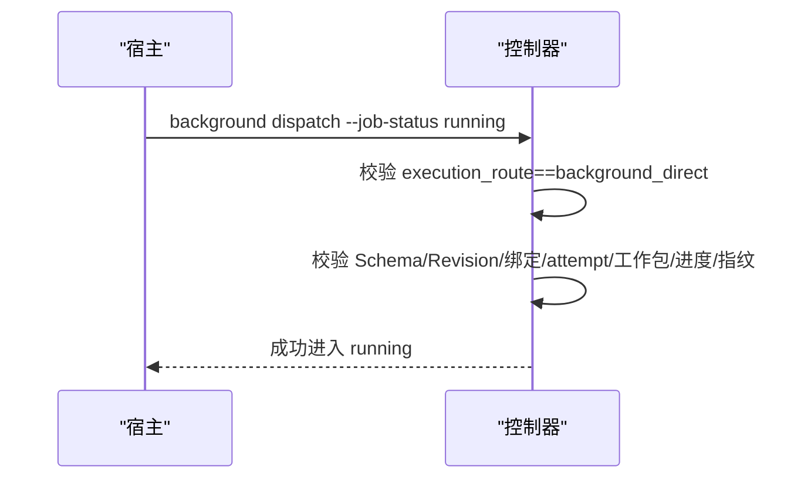
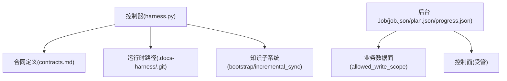

# 直接路线

<cite>
**本文引用的文件**
- [SKILL.md](file://SKILL.md)
- [architecture.md](file://docs/architecture.md)
- [contracts.md](file://docs/contracts.md)
- [harness.py](file://scripts/harness.py)
- [test_harness.py](file://tests/test_harness.py)
</cite>

## 目录
1. [简介](#简介)
2. [项目结构](#项目结构)
3. [核心组件](#核心组件)
4. [架构总览](#架构总览)
5. [详细组件分析](#详细组件分析)
6. [依赖关系分析](#依赖关系分析)
7. [性能考量](#性能考量)
8. [故障排查指南](#故障排查指南)
9. [结论](#结论)
10. [附录](#附录)

## 简介
本文件面向 background_direct 路线，解释其“简单直接”的执行模型：适用于不需要复杂状态管理、无需计划与进度编排的后台任务。重点说明 prepare 命令在 contract_ready 状态下的使用方式与参数要求；阐述从 contract_ready 直达 running 的转换流程与简化验证步骤；说明与旧版 knowledge 命令别名的兼容性处理；给出适合 direct 路线的任务场景与配置示例；并总结错误处理机制、性能特征与资源消耗特点。

## 项目结构
- 控制器源码真源位于 scripts/harness.py，负责后台 Job 的状态机、prepare/dispatch/progress/verify/retry 等控制面操作。
- 对外行为与合同定义见 docs/contracts.md；架构事实见 docs/architecture.md；技能使用说明见 SKILL.md。
- 测试用例覆盖 direct 路由、后台 Job 生命周期与兼容别名等关键路径。

**图表来源**
- [harness.py:1-120](file://scripts/harness.py#L1-L120)
- [contracts.md:303-345](file://docs/contracts.md#L303-L345)
- [architecture.md:1-26](file://docs/architecture.md#L1-L26)
- [SKILL.md:60-90](file://SKILL.md#L60-L90)

**章节来源**
- [harness.py:1-120](file://scripts/harness.py#L1-L120)
- [contracts.md:303-345](file://docs/contracts.md#L303-L345)
- [architecture.md:1-26](file://docs/architecture.md#L1-L26)
- [SKILL.md:60-90](file://SKILL.md#L60-L90)

## 核心组件
- 后台 Job 类型与路由：background_direct、background_goal、background_goal_phased。其中 background_direct 为有界后台执行，不强制 Plan/Progress 编排。
- 状态集合：contract_ready、dispatched、running 以及若干终态（updated/no_change/completed_with_finding/failed/cancelled）。
- 控制面命令：background list/status/prepare/dispatch/progress/verify/retry。
- 旧版兼容：knowledge job-status|dispatch|verify|retry 作为弃用别名，仅 background_direct 允许 contract_ready 直达 running 的兼容路径。

**章节来源**
- [harness.py:100-127](file://scripts/harness.py#L100-L127)
- [contracts.md:315-334](file://docs/contracts.md#L315-L334)
- [SKILL.md:72-86](file://SKILL.md#L72-L86)

## 架构总览
background_direct 的简化执行流如下：
- 父任务完成时，若声明了后台交付物，控制器创建 background_job/v2，execution_route=background_direct。
- 宿主调用 background prepare 生成受管工件（Plan/Progress），但 direct 路线对工件的要求较宽松，且允许跳过复杂编排。
- 对于 background_direct，控制器允许从 contract_ready 直接跳转到 running（兼容旧 knowledge 别名路径），无需先经 dispatched。
- 运行完成后，通过 background verify 进行验收；对 updated/no_change 要求所有工作包 completed；completed_with_finding 仅允许 completed/blocked。

**图表来源**
- [contracts.md:315-334](file://docs/contracts.md#L315-L334)
- [harness.py:8944-8960](file://scripts/harness.py#L8944-L8960)

## 详细组件分析

### 1) 执行模型与适用场景
- 模型特点：有界后台子智能体，不强制 Plan/Progress 复杂编排；适合无状态或弱状态的后台任务（如文档治理、知识增量同步、轻量数据整理等）。
- 准入与路由：estimate 阶段可评分出 score_route=background_direct；当 requires_plan=false 且规模较小、复杂度低时倾向 direct。
- 典型场景：
  - 基于已冻结方案的纯读取/只写范围明确的后台任务
  - 知识增量同步（change_scoped）且无需分阶段合并
  - 交付治理中不涉及跨层目标拆解的任务

**章节来源**
- [harness.py:8070-8139](file://scripts/harness.py#L8070-L8139)
- [contracts.md:315-322](file://docs/contracts.md#L315-L322)

### 2) prepare 在 contract_ready 的使用与参数
- 触发时机：仅在 contract_ready（或 v1.6.0 在途 dispatched）时使用。
- 输入约束：从冻结的 goal_contract、work_packages、job_id、idempotency_key 与 attempt 确定性生成 revision 2 Plan/Progress；重复调用需内容、绑定与指纹完全一致才返回 already_prepared。
- 修复模式：部分/无效/冲突/篡改工件不会被普通 prepare 覆盖，必须显式 --repair 先归档再生成。
- 输出：生成 plan.json、progress.json 及受管引用，供后续 dispatch/verify 校验。

**图表来源**
- [contracts.md:325-334](file://docs/contracts.md#L325-L334)
- [harness.py:8461-8480](file://scripts/harness.py#L8461-L8480)

**章节来源**
- [contracts.md:325-334](file://docs/contracts.md#L325-L334)
- [harness.py:8461-8480](file://scripts/harness.py#L8461-L8480)

### 3) 从 contract_ready 直达 running 的转换与简化验证
- 兼容规则：仅 background_direct 允许 contract_ready → running 的直接跳转（旧 knowledge 别名共享相同安全不变量）。
- 校验要点：Schema、revision、Job 绑定、attempt、工作包全集、进度全集与已记录指纹；缺失工件返回下一步提示。
- 简化验证：direct 路线不强制中间 dispatched 状态，减少一次状态切换与校验开销。

**图表来源**
- [contracts.md:334-334](file://docs/contracts.md#L334-L334)
- [harness.py:8944-8960](file://scripts/harness.py#L8944-L8960)

**章节来源**
- [contracts.md:334-334](file://docs/contracts.md#L334-L334)
- [harness.py:8944-8960](file://scripts/harness.py#L8944-L8960)

### 4) 与旧版 knowledge 命令别名的兼容性
- 兼容入口：knowledge job-status|dispatch|verify|retry 仍可用，但与 background 共享相同安全不变量。
- 限制：仅 background_direct 保留 contract_ready 直达 running 的兼容；其他复杂路线不得跳过 prepare、dispatched、running 或进度验收。
- 行为一致性：别名路径不会放宽校验或绕过 Gate。

**章节来源**
- [contracts.md:334-334](file://docs/contracts.md#L334-L334)
- [SKILL.md:88-90](file://SKILL.md#L88-L90)

### 5) 适合 direct 路线的任务场景与配置示例
- 场景建议：
  - 变更范围明确、无需多阶段合并的知识增量同步
  - 交付治理中仅涉及单一类别的文档更新
  - 后台任务仅需有限写入范围且不依赖外部系统交互
- 配置要点：
  - estimate 阶段确保 requires_plan=false 且规模/复杂度较低
  - allowed_write_scope 严格限定业务数据面，禁止 .git/**、.docs-harness/** 与控制面路径
  - 保持 job 固定 may_mutate_parent=false、may_spawn_child_jobs=false、suppress_post_completion_dispatch=true

**章节来源**
- [harness.py:8070-8139](file://scripts/harness.py#L8070-L8139)
- [contracts.md:315-322](file://docs/contracts.md#L315-L322)

### 6) 错误处理机制
- 常见失败关闭条件：
  - 非法状态转换（非 background_direct 尝试 contract_ready→running）
  - 工件损坏或被篡改（需 --repair）
  - 越界写入（invalid_background_scope）
  - 缺少必要工件（missing_background_goal_artifacts）
  - 重试策略：仅允许特定可重试状态（needs_user_input、needs_rebase、queued_manual）
- 退出码约定：0 成功；1 项目检查失败；2 输入/合同/状态无效；3 需要方案/证据/用户输入；4 范围/漂移/Gate/授权变化需重新准入。

**章节来源**
- [harness.py:100-127](file://scripts/harness.py#L100-L127)
- [harness.py:8944-8960](file://scripts/harness.py#L8944-L8960)
- [contracts.md:361-372](file://docs/contracts.md#L361-L372)

### 7) 性能特征与资源消耗
- 性能优势：
  - 跳过复杂编排与多次状态切换，降低控制面开销
  - 避免不必要的 Plan/Progress 重算与校验
- 资源消耗：
  - 控制面文件最小化（仅必要的 plan.json/progress.json 与事件日志）
  - 业务数据面写入受限，避免污染控制面
- 缓存与幂等：
  - prepare 重复调用在内容与指纹一致时返回 already_prepared
  - 验证命令支持收据复用，减少重复执行

**章节来源**
- [contracts.md:325-334](file://docs/contracts.md#L325-L334)
- [harness.py:8461-8480](file://scripts/harness.py#L8461-L8480)

## 依赖关系分析
- 控制器依赖合同定义（background-job/v2、event/v2、completion-manifest/v1 等）与运行时路径（Git 或非 Git 项目的 .docs-harness 目录）。
- 后台 Job 控制面与业务数据面分离：控制面由 CLI 写入，业务面仅限 allowed_write_scope。
- 与知识系统的耦合：bootstrap 未完成会阻塞增量 Job；external_consume_only 模式下知识相关 Job 短路。

**图表来源**
- [harness.py:1-120](file://scripts/harness.py#L1-L120)
- [contracts.md:303-345](file://docs/contracts.md#L303-L345)
- [architecture.md:1-26](file://docs/architecture.md#L1-L26)

**章节来源**
- [harness.py:1-120](file://scripts/harness.py#L1-L120)
- [contracts.md:303-345](file://docs/contracts.md#L303-L345)
- [architecture.md:1-26](file://docs/architecture.md#L1-L26)

## 性能考量
- 直接路线的优势在于减少状态机跳转与工件校验次数，适合高频、短时的后台任务。
- 建议在 estimate 阶段合理选择 execution_route，避免将本可直接执行的任务误判为复杂路线。
- 合理使用 verification.command_cache_enabled 与 evidence-receipt 复用，降低重复执行成本。

[本节为通用指导，不直接分析具体文件]

## 故障排查指南
- 常见问题定位：
  - 状态转换失败：检查 execution_route 是否为 background_direct，确认当前状态与请求状态合法
  - 工件问题：使用 background prepare --repair 修复损坏工件
  - 越界写入：核对 allowed_write_scope，排除 .git/**、.docs-harness/** 与控制面路径
  - 重试限制：仅允许 needs_user_input、needs_rebase、queued_manual 等可重试状态
- 诊断工具：
  - background list/status 查看 Job 状态
  - background verify 获取详细失败原因与阻断路径
  - 事件日志 events.jsonl 追踪状态变迁

**章节来源**
- [harness.py:100-127](file://scripts/harness.py#L100-L127)
- [contracts.md:361-372](file://docs/contracts.md#L361-L372)

## 结论
background_direct 路线以“简单直接”为核心，提供低开销、易用的后台任务执行模型。通过 prepare 在 contract_ready 下的确定性工件生成，以及 contract_ready→running 的简化转换，显著降低复杂状态管理的负担。配合严格的错误处理与资源边界控制，适合大多数无需复杂编排的后台任务场景。

[本节为总结性内容，不直接分析具体文件]

## 附录
- 命令速查：
  - background list/status/prepare/dispatch/progress/verify/retry
  - knowledge 别名（仅 background_direct 支持 contract_ready→running）
- 关键常量与状态：
  - BACKGROUND_TERMINAL_STATES、BACKGROUND_KNOWN_STATES、BACKGROUND_RETRYABLE_STATES
  - 退出码 0/1/2/3/4 含义

**章节来源**
- [harness.py:100-127](file://scripts/harness.py#L100-L127)
- [contracts.md:361-372](file://docs/contracts.md#L361-L372)
- [SKILL.md:72-86](file://SKILL.md#L72-L86)