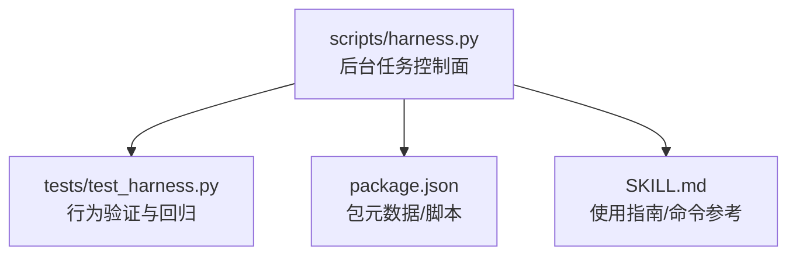
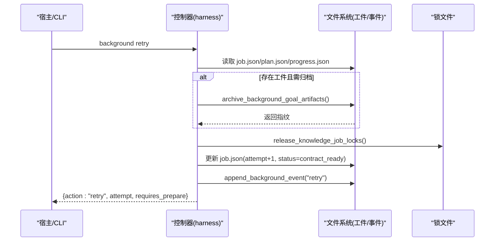
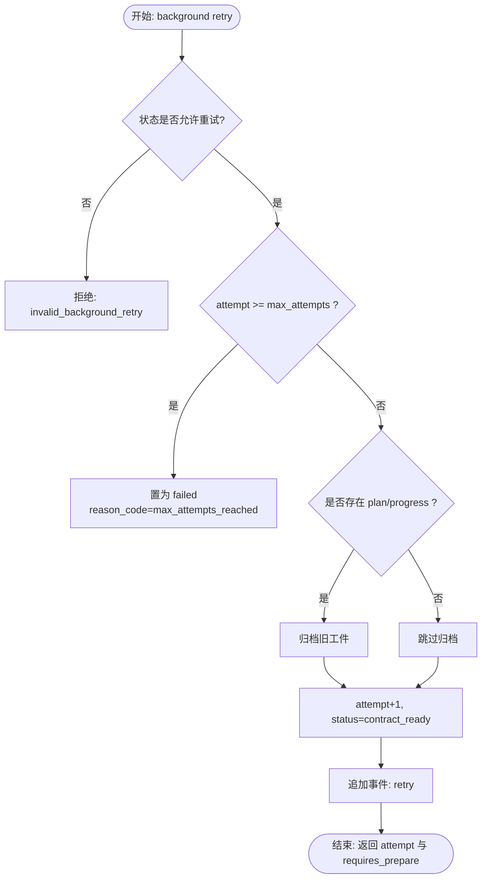
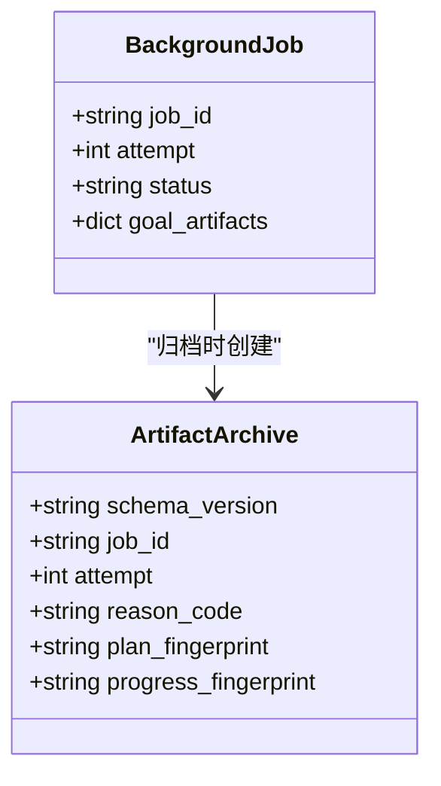
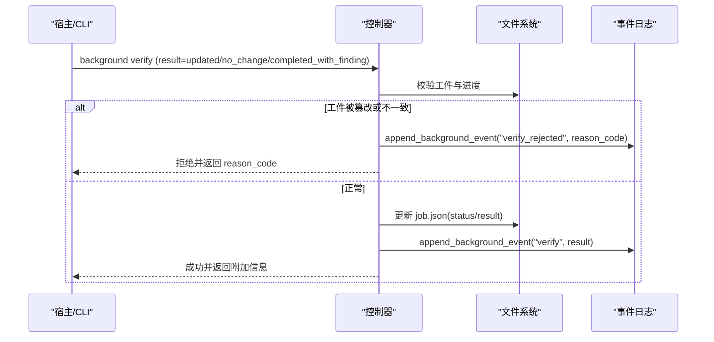
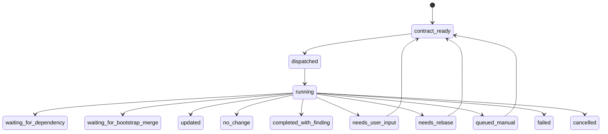
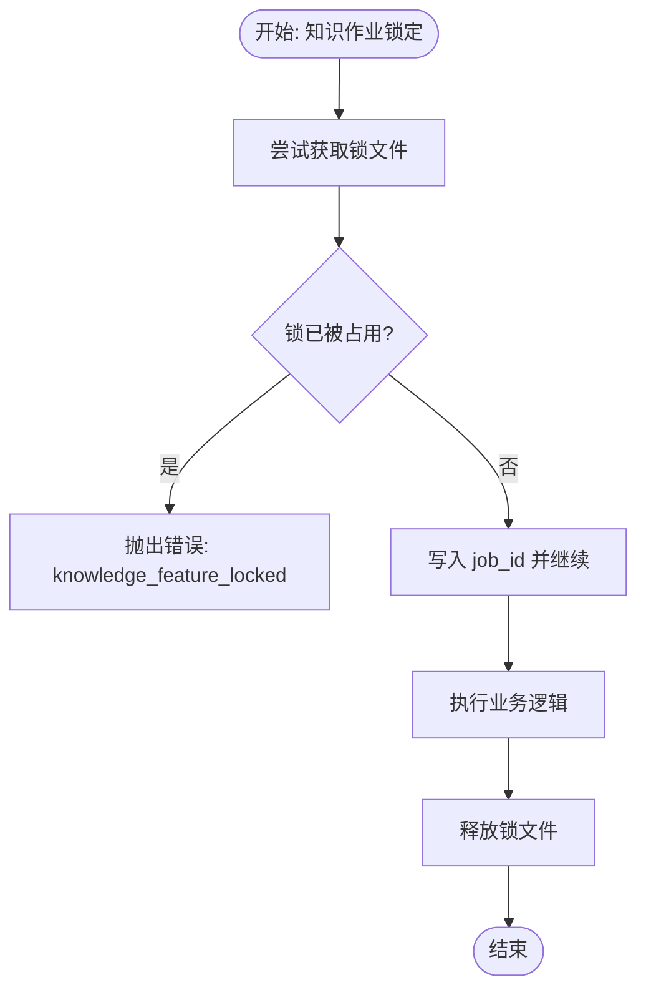
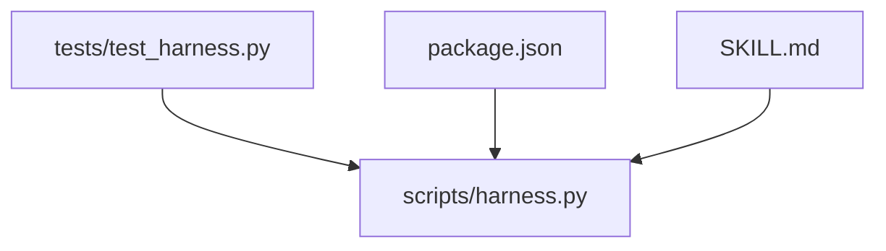

# 失败处理与恢复

<cite>
**本文引用的文件**   
- [scripts/harness.py](file://scripts/harness.py)
- [tests/test_harness.py](file://tests/test_harness.py)
- [package.json](file://package.json)
- [SKILL.md](file://SKILL.md)
</cite>

## 目录
1. [简介](#简介)
2. [项目结构](#项目结构)
3. [核心组件](#核心组件)
4. [架构总览](#架构总览)
5. [详细组件分析](#详细组件分析)
6. [依赖关系分析](#依赖关系分析)
7. [性能考量](#性能考量)
8. [故障诊断指南](#故障诊断指南)
9. [结论](#结论)
10. [附录](#附录)

## 简介
本文件聚焦 Docs Harness 后台任务（Background Job）的失败处理与恢复机制，系统性阐述以下主题：
- Attempt 推进策略：失败检测、重试次数限制与退避策略
- 工件归档机制：attempt 工件版本管理、存储空间优化与清理策略
- 错误恢复流程：错误分类、根因分析与自动恢复尝试
- 阻塞状态管理：blocked 原因分类、持续监控与人工干预点
- 故障隔离机制：防止单个任务失败影响其他任务
- 故障诊断工具、日志分析方法与恢复操作指南

## 项目结构
Docs Harness 以独立 Python 控制器为核心，配合测试套件与说明文档共同构成完整能力。关键位置如下：
- scripts/harness.py：主控制器，实现后台任务生命周期、重试、归档、验收、事件记录等
- tests/test_harness.py：覆盖重试上限、工件修复、阻塞与重大发现等场景
- package.json：包元数据与脚本入口
- SKILL.md：面向使用者的能力说明与命令参考

**图表来源** 
- [scripts/harness.py:1-120](file://scripts/harness.py#L1-L120)
- [tests/test_harness.py:1-120](file://tests/test_harness.py#L1-L120)
- [package.json:1-23](file://package.json#L1-L23)
- [SKILL.md:1-106](file://SKILL.md#L1-L106)

**章节来源**
- [scripts/harness.py:1-120](file://scripts/harness.py#L1-L120)
- [package.json:1-23](file://package.json#L1-L23)
- [SKILL.md:1-106](file://SKILL.md#L1-L106)

## 核心组件
围绕失败处理与恢复的关键常量与数据结构：
- BACKGROUND_MAX_ATTEMPTS：默认最大重试次数
- BACKGROUND_TERMINAL_STATES：终态集合（updated/no_change/completed_with_finding/failed/cancelled）
- BACKGROUND_RETRYABLE_STATES：允许重试的状态集合（needs_user_input/needs_rebase/queued_manual）
- BACKGROUND_PROGRESS_STATUSES：工作包进度状态（pending/in_progress/completed/blocked）
- BACKGROUND_ARTIFACT_REVISION：工件版本修订号（v2）

这些常量贯穿重试判定、状态机转换、工件校验与归档逻辑。

**章节来源**
- [scripts/harness.py:98-127](file://scripts/harness.py#L98-L127)

## 架构总览
后台任务失败处理与恢复的整体流程如下：
- 失败检测：在 dispatch/verify/retry 等动作中检查状态与工件一致性，识别可重试与不可重试情形
- 重试推进：按 attempt 递增推进，达到 max_attempts 后进入 failed 终态
- 工件归档：每次 retry 或合同重建前，将 plan/progress 归档到 attempts/<attempt>/archive-NNN
- 阻塞与人工干预：needs_user_input/needs_rebase/queued_manual 等状态需要宿主或人工介入
- 隔离与锁：通过 locks 文件与 baseline 快照确保并发安全与一致性

**图表来源** 
- [scripts/harness.py:9012-9053](file://scripts/harness.py#L9012-L9053)
- [scripts/harness.py:8432-8458](file://scripts/harness.py#L8432-L8458)
- [scripts/harness.py:8373-8402](file://scripts/harness.py#L8373-L8402)

**章节来源**
- [scripts/harness.py:9012-9053](file://scripts/harness.py#L9012-L9053)
- [scripts/harness.py:8432-8458](file://scripts/harness.py#L8432-L8458)
- [scripts/harness.py:8373-8402](file://scripts/harness.py#L8373-L8402)

## 详细组件分析

### Attempt 推进策略（失败检测、重试限制与退避）
- 失败检测
  - 在 retry 分支中，若当前状态不在可重试集合或已处于终态，则拒绝并返回错误码
  - 对治理类 Job（delivery_governance），仅允许特定状态重试
- 重试次数限制
  - 读取 job.max_attempts（默认 BACKGROUND_MAX_ATTEMPTS），当 attempt >= maximum 时直接置为 failed，并记录 reason_code=max_attempts_reached
- 退避算法
  - 代码未实现指数退避；退避由上层调度器或宿主根据 reason_code 决定等待时长
  - 可通过外部策略（如队列延迟、指数退避）在 CLI 调用层实现

**图表来源** 
- [scripts/harness.py:9012-9053](file://scripts/harness.py#L9012-L9053)
- [scripts/harness.py:8337-8344](file://scripts/harness.py#L8337-L8344)

**章节来源**
- [scripts/harness.py:9012-9053](file://scripts/harness.py#L9012-L9053)
- [scripts/harness.py:8337-8344](file://scripts/harness.py#L8337-L8344)
- [tests/test_harness.py:1922-1943](file://tests/test_harness.py#L1922-L1943)

### 工件归档机制（版本管理、存储优化与清理）
- 版本管理
  - 每次 retry 或合同重建前，调用 archive_background_goal_artifacts，生成 attempts/<attempt>/archive-NNN
  - 归档内容包含 plan.json 与 progress.json 的副本及指纹，以及 archive.json 元信息（schema_version、job_id、attempt、reason_code、fingerprint）
- 存储优化
  - 归档后删除源文件以减少重复占用
  - 使用 file_fingerprint 计算稳定指纹，避免不必要复制
- 清理策略
  - 代码未内置自动清理；建议基于时间窗口或数量阈值的外部清理策略
  - 可通过 task prune 相关能力清理历史任务状态（非后台工件）

**图表来源** 
- [scripts/harness.py:8432-8458](file://scripts/harness.py#L8432-L8458)

**章节来源**
- [scripts/harness.py:8432-8458](file://scripts/harness.py#L8432-L8458)
- [tests/test_harness.py:2177-2177](file://tests/test_harness.py#L2177-L2177)

### 错误恢复流程（错误分类、根因分析与自动恢复）
- 错误分类
  - 状态机定义明确的可转移状态与终态，结合 reason_code 区分具体错误类型
  - 治理路线漂移（document_route_drift）、知识写入越界（knowledge_write_outside_allowed_scope）、工件篡改（background_goal_artifacts_tampered）等
- 根因分析
  - 通过 events.jsonl 记录 transition_rejected、verify_rejected、retry 等事件，附带 reason_code 与上下文指纹
  - 对于知识 Job，评估 candidate_knowledge_status/gaps 定位缺口
- 自动恢复
  - 对可重试状态执行 retry，必要时先 prepare 重新绑定工件
  - 对治理路线漂移，rebuild_governance_route_contract 重建合同并释放等待者

**图表来源** 
- [scripts/harness.py:9054-9176](file://scripts/harness.py#L9054-L9176)

**章节来源**
- [scripts/harness.py:9054-9176](file://scripts/harness.py#L9054-L9176)
- [tests/test_harness.py:2055-2119](file://tests/test_harness.py#L2055-L2119)

### 阻塞状态管理（blocked 原因、持续监控与人工干预）
- blocked 原因分类
  - 工作包级别：work_package_states 中的 status=blocked，伴随 reason_code（如 critical_contract_conflict）
  - 任务级别：needs_user_input/needs_rebase/queued_manual 等需要宿主或人工介入
- 持续监控
  - 通过 background status 查询当前状态与 blocked_work_package_ids
  - 事件日志记录状态变更与拒绝原因
- 人工干预点
  - 提供 manual_resume_argv 指导宿主如何继续
  - 对知识 Job，需提供 assessment 并通过 knowledge_ready 检查

**图表来源** 
- [scripts/harness.py:8404-8416](file://scripts/harness.py#L8404-L8416)

**章节来源**
- [scripts/harness.py:8404-8416](file://scripts/harness.py#L8404-L8416)
- [tests/test_harness.py:1987-2027](file://tests/test_harness.py#L1987-L2027)

### 故障隔离机制（防止单任务失败影响其他任务）
- 锁机制
  - acquire_knowledge_job_locks/release_knowledge_job_locks 使用 .lock 文件确保功能知识更新互斥
- 基线快照与指纹
  - background_goal_artifact_values 与 validate_background_goal_artifacts 保证 plan/progress 一致性
  - 指纹变化触发重新准入或拒绝
- 等待者释放
  - release_bootstrap_waiters 在 bootstrap 完成后释放依赖该任务的后续 Job

**图表来源** 
- [scripts/harness.py:8381-8402](file://scripts/harness.py#L8381-L8402)

**章节来源**
- [scripts/harness.py:8381-8402](file://scripts/harness.py#L8381-L8402)

## 依赖关系分析
- 控制器与测试
  - tests/test_harness.py 通过导入 harness.py 模块进行断言与端到端验证
- 控制器与配置
  - package.json 提供版本与脚本入口，SKILL.md 提供命令参考
- 内部依赖
  - 大量函数与常量集中在 harness.py，形成高内聚的控制面

**图表来源** 
- [tests/test_harness.py:1-25](file://tests/test_harness.py#L1-L25)
- [package.json:1-23](file://package.json#L1-L23)
- [SKILL.md:1-106](file://SKILL.md#L1-L106)

**章节来源**
- [tests/test_harness.py:1-25](file://tests/test_harness.py#L1-L25)
- [package.json:1-23](file://package.json#L1-L23)
- [SKILL.md:1-106](file://SKILL.md#L1-L106)

## 性能考量
- 事件追加采用原子写入与 fsync，确保持久化但可能带来 I/O 开销
- 工件归档涉及文件复制与指纹计算，建议在批量重试时合并或异步化
- 锁文件与状态检查为轻量级操作，但在高并发下需注意锁竞争

[本节为通用指导，不直接分析具体文件]

## 故障诊断指南
- 查看后台任务状态
  - background status --target . --job-id <job-id> --json
- 触发重试
  - background retry --target . --job-id <job-id> --json
- 准备工件（复杂路线）
  - background prepare --target . --job-id <job-id> --json
- 验收结果
  - background verify --target . --job-id <job-id> --assessment <file> --json
- 事件日志
  - 读取 .docs-harness/background/jobs/<job-id>/events.jsonl，关注 transition_rejected/verify_rejected/retry 等事件

**章节来源**
- [SKILL.md:60-90](file://SKILL.md#L60-L90)
- [scripts/harness.py:9054-9176](file://scripts/harness.py#L9054-L9176)

## 结论
Docs Harness 的后台任务失败处理与恢复机制以严格的状态机、工件指纹校验与事件审计为核心，结合锁机制与基线快照保障并发安全与一致性。重试策略通过 attempt 推进与 max_attempts 限制实现可控恢复，工件归档确保历史可追溯。阻塞状态与人工干预点清晰，便于宿主或运维人员快速定位与处置。整体设计强调“失败关闭”与“证据可复用”，在保障安全性的同时提升可维护性与可观测性。

[本节为总结性内容，不直接分析具体文件]

## 附录
- 相关常量与状态定义见 harness.py 顶部常量区
- 测试用例覆盖重试上限、工件修复、阻塞与重大发现等关键路径
- 使用指南与命令参考见 SKILL.md

[本节为补充信息，不直接分析具体文件]