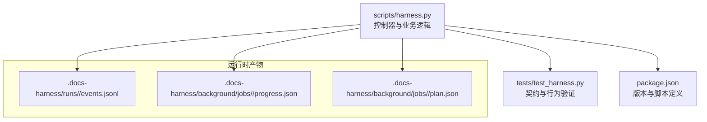
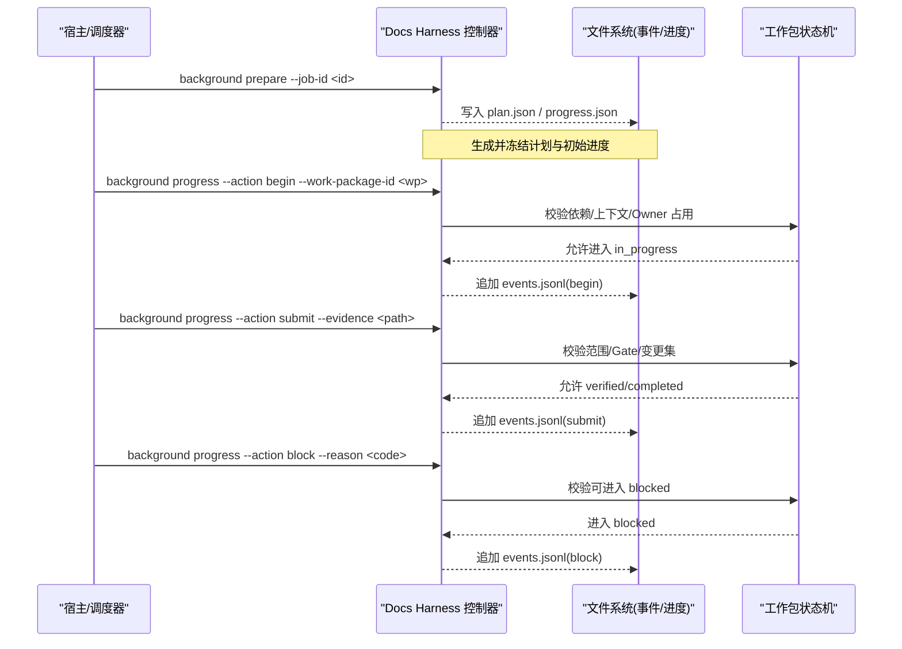
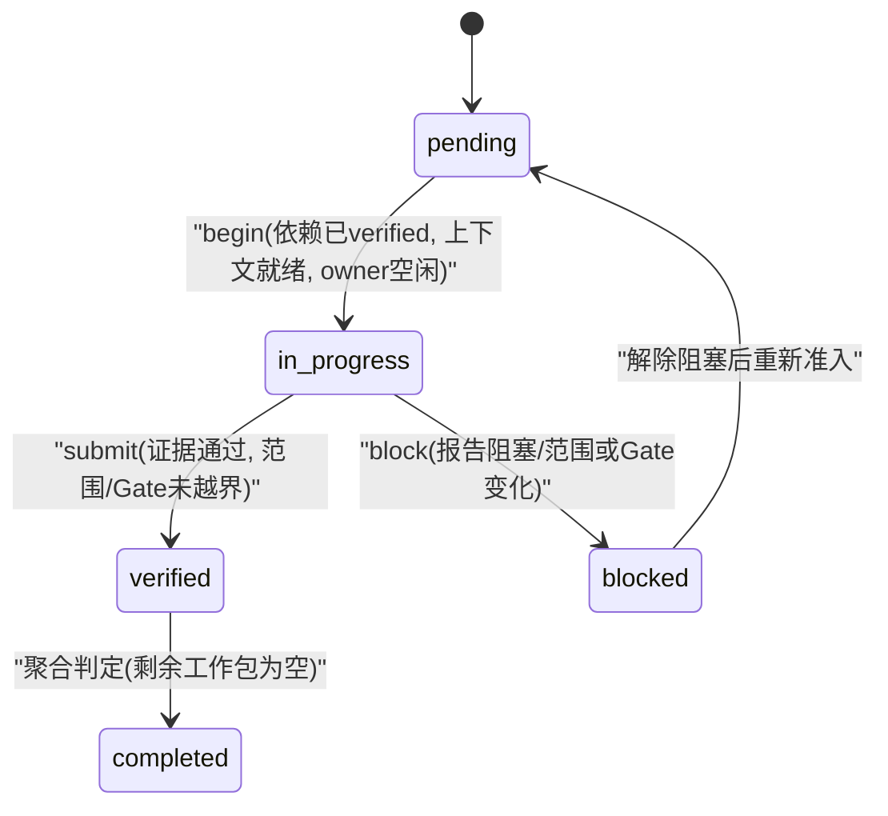
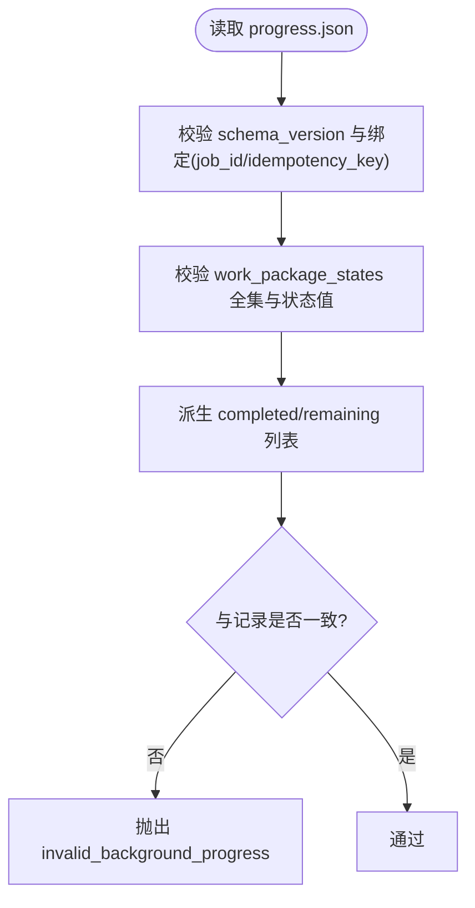
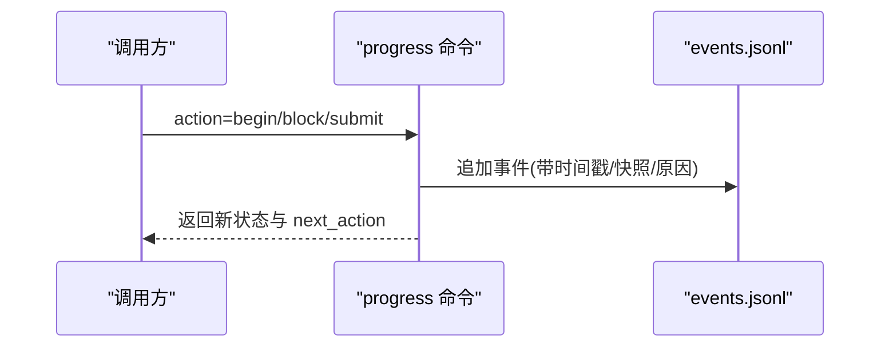
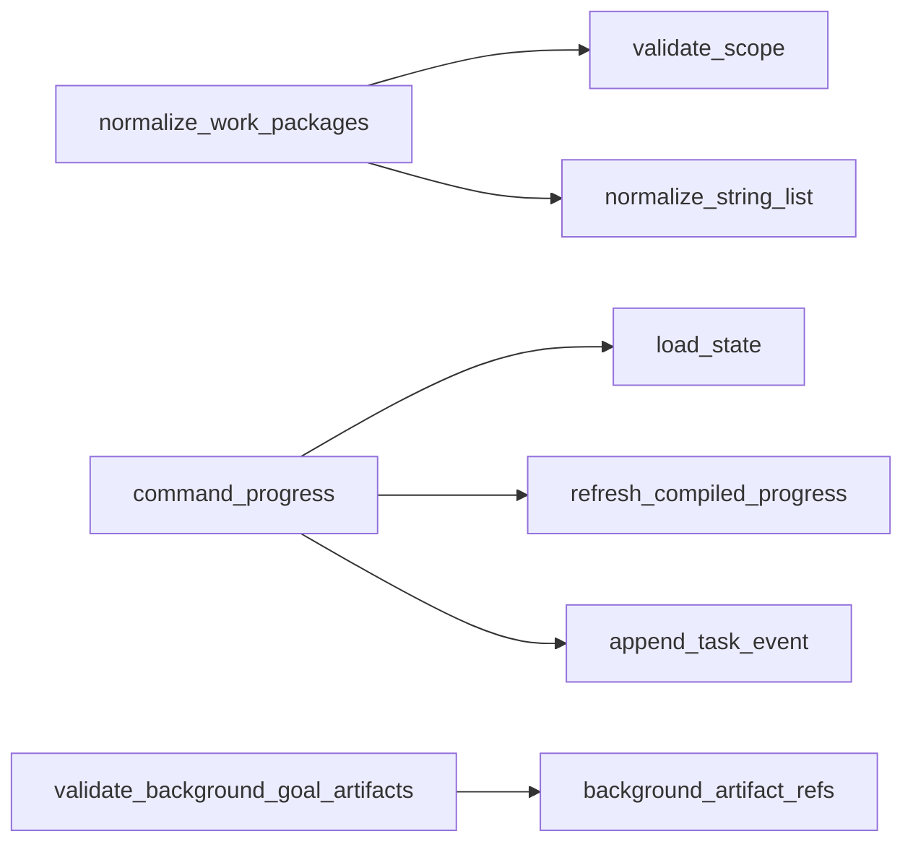

# 工作包管理

<cite>
**本文引用的文件**   
- [harness.py](file://scripts/harness.py)
- [test_harness.py](file://tests/test_harness.py)
- [package.json](file://package.json)
</cite>

## 目录
1. [简介](#简介)
2. [项目结构](#项目结构)
3. [核心组件](#核心组件)
4. [架构总览](#架构总览)
5. [详细组件分析](#详细组件分析)
6. [依赖关系分析](#依赖关系分析)
7. [性能考量](#性能考量)
8. [故障排查指南](#故障排查指南)
9. [结论](#结论)
10. [附录](#附录)

## 简介
本文件为 Docs Harness 的工作包管理系统提供系统化文档，聚焦以下目标：
- 明确工作包的定义结构与关键字段（id、status、progress、blocked_reason 等）
- 阐述工作包生命周期与状态转换规则（pending → in_progress → completed/blocked 等）
- 说明进度跟踪机制（更新格式、完成度计算、剩余工作量估算）
- 解释依赖关系管理与执行顺序控制
- 给出错误处理与恢复策略（blocked 原因分类与处置）
- 总结最佳实践与常见问题解决方案

## 项目结构
Docs Harness 的核心实现位于 scripts/harness.py，测试用例位于 tests/test_harness.py，元数据与脚本入口在 package.json。工作包管理主要围绕后台任务（background jobs）与工作包进度（background progress）展开，通过 CLI 命令进行编排与推进。

**图表来源**
- [harness.py:906-912](file://scripts/harness.py#L906-L912)
- [harness.py:1485-1495](file://scripts/harness.py#L1485-L1495)
- [package.json:1-23](file://package.json#L1-L23)

**章节来源**
- [harness.py:906-912](file://scripts/harness.py#L906-L912)
- [harness.py:1485-1495](file://scripts/harness.py#L1485-L1495)
- [package.json:1-23](file://package.json#L1-L23)

## 核心组件
- 工作包归一化与校验：确保 ID 唯一、依赖存在且无环，必填字段完整
- 拓扑决策：根据 Owner 与范围冲突决定 single_owner / multi_owner 模式
- 派发合同：按拓扑生成每个工作包的输入/验收/停止条件
- 进度事件与状态机：记录 begin/block/submit 等事件，驱动状态迁移
- 完成度与剩余工作量：基于 work_package_states 派生 completed/remaining 列表
- 背景作业工件校验：绑定 job_id/idempotency_key，校验 plan/progress 一致性

**章节来源**
- [harness.py:2383-2425](file://scripts/harness.py#L2383-L2425)
- [harness.py:2428-2449](file://scripts/harness.py#L2428-L2449)
- [harness.py:2452-2485](file://scripts/harness.py#L2452-L2485)
- [harness.py:5515-5682](file://scripts/harness.py#L5515-L5682)
- [harness.py:7318-7384](file://scripts/harness.py#L7318-L7384)

## 架构总览
下图展示了从“准备”到“提交证据”的端到端流程，以及状态机与事件落盘的关系。

**图表来源**
- [harness.py:7318-7384](file://scripts/harness.py#L7318-L7384)
- [harness.py:5515-5682](file://scripts/harness.py#L5515-L5682)

## 详细组件分析

### 工作包数据结构与约束
- 标识与归属
  - id：工作包唯一标识，需符合命名规范且不重复
  - owner：负责人，用于并发限制（同一 owner 不可同时多个 in_progress）
- 目标与范围
  - goal：工作包目标描述
  - scope：受控路径集合（支持通配），用于范围校验与审计
- 依赖与顺序
  - dependencies：依赖的工作包 id 列表，必须存在且无环
- 成功标准与验收
  - success_criteria：成功标准列表
  - acceptance：验收条目列表
- 事实引用
  - required_fact_refs：需要加载的项目事实引用

上述字段由归一化函数统一校验，缺失或非法将直接拒绝。

**章节来源**
- [harness.py:2383-2425](file://scripts/harness.py#L2383-L2425)

### 拓扑决策与派发合同
- 拓扑类型
  - single_owner：单负责人模式
  - single_owner_with_verifier：单负责人 + 独立验证者
  - multi_owner：多负责人模式（要求至少两个不同 owner，且范围不重叠）
- 派发合同
  - role/owner/goal/scope/input_refs/acceptance/stop_condition 等字段，按拓扑生成

**章节来源**
- [harness.py:2428-2449](file://scripts/harness.py#L2428-L2449)
- [harness.py:2452-2485](file://scripts/harness.py#L2452-L2485)

### 工作包状态机与生命周期
- 状态集合
  - pending：待开始
  - in_progress：进行中
  - verified：已提交并通过校验（中间态）
  - completed：已完成
  - blocked：被阻塞
- 合法转换
  - pending → in_progress：依赖全部 verified，上下文已加载，owner 未占用
  - in_progress → verified：提交证据，范围/Gate 未越界
  - in_progress → blocked：报告阻塞或检测到范围/Gate 变化
  - verified → completed：由上层聚合判定（例如 remaining_work_packages 为空）
- 禁止倒退或跳跃：任何非法转换均会报错

**图表来源**
- [harness.py:5515-5682](file://scripts/harness.py#L5515-L5682)

**章节来源**
- [harness.py:5515-5682](file://scripts/harness.py#L5515-L5682)

### 进度跟踪与完成度计算
- 进度文件
  - progress.json：包含 schema_version、job_id、attempt、work_package_states、completed_work_packages、remaining_work_packages 等
- 完成度计算
  - completed_work_packages：所有 status=completed 的工作包 id 列表
  - remaining_work_packages：非 completed 的工作包 id 列表
- 派生一致性校验
  - 控制器会校验 completed/remaining 是否与 work_package_states 一致，不一致即报错

**图表来源**
- [harness.py:7318-7384](file://scripts/harness.py#L7318-L7384)

**章节来源**
- [harness.py:7318-7384](file://scripts/harness.py#L7318-L7384)

### 依赖关系与执行顺序控制
- 依赖解析
  - 构建依赖图并进行拓扑排序，检测环与缺失依赖
- 执行顺序
  - 仅当依赖全部 verified 时，方可 begin 当前工作包
  - multi_owner 模式下，同 owner 不可并行 in_progress

**章节来源**
- [harness.py:2383-2425](file://scripts/harness.py#L2383-L2425)
- [harness.py:5515-5682](file://scripts/harness.py#L5515-L5682)

### 错误处理与恢复策略（blocked 原因分类）
- 常见 reason_code
  - dependency_blocked：依赖尚未 verified
  - context_not_loaded：工作包上下文未通过 harness context 加载
  - owner_busy：同一 owner 已有 in_progress 工作包
  - write_scope_violation：实际变更超出授权范围或触发新 Gate
  - reported_blocker：外部报告阻塞（如资源不可用、外部依赖失败）
- 恢复建议
  - 修复依赖或等待上游完成
  - 先运行 harness context 加载上下文
  - 释放 owner 占用或拆分任务
  - 修正范围/Gate 配置，必要时重新准入
  - 解决外部依赖后重试

**章节来源**
- [harness.py:5515-5682](file://scripts/harness.py#L5515-L5682)

### 进度更新接口与事件模型
- 关键动作
  - begin：标记工作包开始，记录 workspace_snapshot
  - block：标记阻塞，记录 reason/scope_changed
  - submit：提交证据，校验 changed_paths 与实际差异
- 事件落盘
  - events.jsonl：追加事件，支持并发回放与锁保护

**图表来源**
- [harness.py:5515-5682](file://scripts/harness.py#L5515-L5682)

**章节来源**
- [harness.py:5515-5682](file://scripts/harness.py#L5515-L5682)

## 依赖关系分析
- 模块内依赖
  - normalize_work_packages 依赖 validate_scope、normalize_string_list
  - command_progress 依赖 load_state、refresh_compiled_progress、append_task_event
  - validate_background_goal_artifacts 依赖 read_json、background_artifact_refs
- 外部交互
  - Git 操作（fetch/sync）、文件系统原子写、JSONL 追加
- 潜在循环
  - 通过依赖图检测环，避免死锁

**图表来源**
- [harness.py:2383-2425](file://scripts/harness.py#L2383-L2425)
- [harness.py:5515-5682](file://scripts/harness.py#L5515-L5682)
- [harness.py:7318-7384](file://scripts/harness.py#L7318-L7384)

**章节来源**
- [harness.py:2383-2425](file://scripts/harness.py#L2383-L2425)
- [harness.py:5515-5682](file://scripts/harness.py#L5515-L5682)
- [harness.py:7318-7384](file://scripts/harness.py#L7318-L7384)

## 性能考量
- 事件追加采用原子写入与 fsync，保证持久性
- 验证命令结果缓存减少重复执行
- 工作区快照对大文件使用 size+mtime 指纹，降低 IO
- 并发通过状态锁与事件回放避免竞态

[本节为通用指导，无需特定文件引用]

## 故障排查指南
- 常见错误码与含义
  - invalid_work_packages：工作包结构/依赖/ID 问题
  - invalid_transition：状态转换非法
  - missing_reason：block 缺少原因
  - stale_evidence：证据声明的 changed_paths 与实际不符
  - invalid_background_progress：进度文件结构/一致性校验失败
- 定位步骤
  - 查看 events.jsonl 最近事件，确认 last event 与 reason_code
  - 检查 progress.json 中 work_package_states 与派生列表一致性
  - 核对范围/Gate 配置与授权是否覆盖
  - 若涉及 Git 同步，检查预检/后检结果与远端漂移

**章节来源**
- [harness.py:5515-5682](file://scripts/harness.py#L5515-L5682)
- [harness.py:7318-7384](file://scripts/harness.py#L7318-L7384)

## 结论
Docs Harness 的工作包管理以强约束的结构化定义、严格的状态机与事件溯源为核心，确保复杂任务的可靠推进与可审计性。通过依赖拓扑、范围/Gate 校验与进度派生一致性检查，系统能够在多负责人、多依赖场景下保持正确性与安全性。实践中应遵循最小范围原则、及时报告阻塞、合理拆分任务与复用上下文，以获得更高的交付效率与稳定性。

[本节为总结，无需特定文件引用]

## 附录
- 术语表
  - 工作包（Work Package）：可独立交付的最小任务单元
  - 拓扑（Topology）：single_owner / single_owner_with_verifier / multi_owner
  - 进度（Progress）：work_package_states 与派生列表
  - 事件（Event）：begin/block/submit 等状态变更记录
- 参考测试用例
  - 后台 Job 准备与完成工作包的典型用法见测试套件

**章节来源**
- [test_harness.py:165-196](file://tests/test_harness.py#L165-L196)