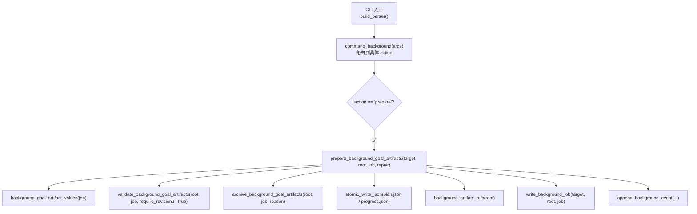
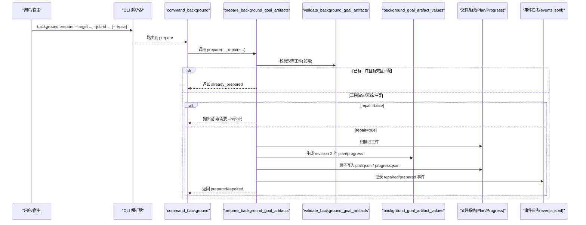
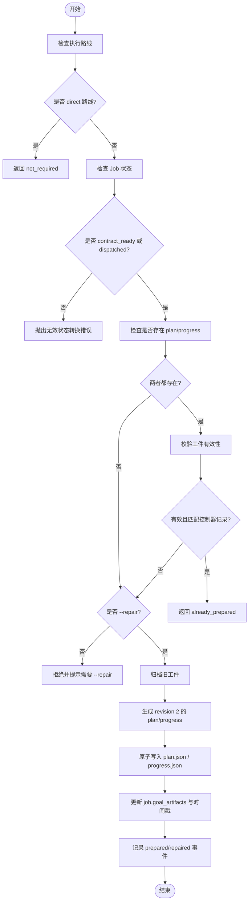
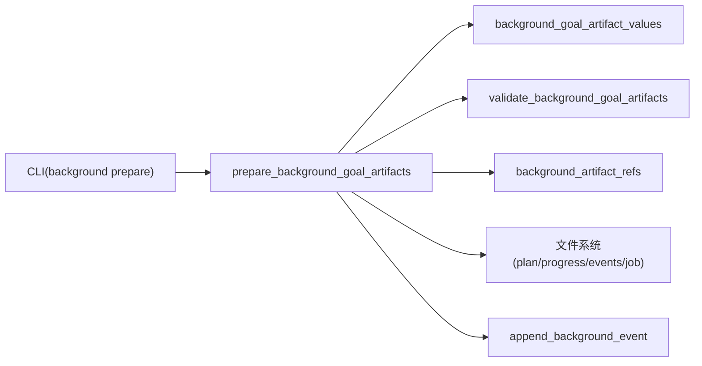

# 准备命令

<cite>
**本文引用的文件**   
- [scripts/harness.py](file://scripts/harness.py)
- [tests/test_harness.py](file://tests/test_harness.py)
</cite>

## 目录
1. [简介](#简介)
2. [项目结构](#项目结构)
3. [核心组件](#核心组件)
4. [架构总览](#架构总览)
5. [详细组件分析](#详细组件分析)
6. [依赖关系分析](#依赖关系分析)
7. [性能考虑](#性能考虑)
8. [故障排除指南](#故障排除指南)
9. [结论](#结论)
10. [附录：命令与参数](#附录命令与参数)

## 简介
本文件为 background prepare 命令的权威文档，聚焦其在 contract_ready 状态下的职责与行为。该命令用于从冻结的 goal_contract、work_packages、job_id、idempotency_key 与 attempt 等确定性输入，生成 revision 2 的 Plan/Progress 工件，并保证幂等性与可修复性。同时说明 --repair 修复模式与 --dry-run 预览模式的语义差异，以及部分、无效、冲突或篡改工件的处理策略。

## 项目结构
- 入口脚本位于 scripts/harness.py，包含 CLI 解析、后台任务控制逻辑与工具函数。
- 测试用例位于 tests/test_harness.py，覆盖 prepare 的典型路径、幂等返回与修复流程。

图表来源
- [scripts/harness.py:10450-10475](file://scripts/harness.py#L10450-L10475)
- [scripts/harness.py:8821-8927](file://scripts/harness.py#L8821-L8927)
- [scripts/harness.py:8461-8525](file://scripts/harness.py#L8461-L8525)
- [scripts/harness.py:7443-7469](file://scripts/harness.py#L7443-L7469)
- [scripts/harness.py:7472-7482](file://scripts/harness.py#L7472-L7482)
- [scripts/harness.py:7485-7551](file://scripts/harness.py#L7485-L7551)

章节来源
- [scripts/harness.py:10450-10475](file://scripts/harness.py#L10450-L10475)
- [scripts/harness.py:8821-8927](file://scripts/harness.py#L8821-L8927)

## 核心组件
- prepare_background_goal_artifacts：prepare 的核心实现，负责校验 Job 状态、生成/校验/归档 Plan/Progress、更新事件与 Job 元数据。
- background_goal_artifact_values：基于 job 的确定性字段生成 revision 2 的 plan 与 progress 内容。
- validate_background_goal_artifacts：校验工件版本、绑定、指纹与一致性，支持 require_revision2 与指纹漂移检测。
- background_artifact_refs：计算当前 plan/progress 的文件引用与指纹，供记录与比对。
- append_background_event：追加事件日志（prepared/repaired/prepare_rejected 等）。
- atomic_write_json：原子写入 JSON 文件，避免并发写破坏。

章节来源
- [scripts/harness.py:8461-8525](file://scripts/harness.py#L8461-L8525)
- [scripts/harness.py:7443-7469](file://scripts/harness.py#L7443-L7469)
- [scripts/harness.py:7472-7482](file://scripts/harness.py#L7472-L7482)
- [scripts/harness.py:7485-7551](file://scripts/harness.py#L7485-L7551)
- [scripts/harness.py:7554-7578](file://scripts/harness.py#L7554-L7578)
- [scripts/harness.py:436-438](file://scripts/harness.py#L436-L438)

## 架构总览
prepare 在复杂后台路线（background_goal / background_goal_phased）下生效；direct 路线无需 prepare。其关键约束包括：
- 仅允许 contract_ready 或在途 dispatched 状态的 Job 执行 prepare。
- 若已存在工件且与期望一致且与控制器记录匹配，则幂等返回 already_prepared。
- 若工件不完整、无效或与控制器记录冲突，需要显式 --repair 才能继续。
- 生成 revision 2 的 Plan/Progress，并通过文件指纹与控制器中的 goal_artifacts 绑定，防止篡改。

图表来源
- [scripts/harness.py:10450-10475](file://scripts/harness.py#L10450-L10475)
- [scripts/harness.py:8821-8927](file://scripts/harness.py#L8821-L8927)
- [scripts/harness.py:8461-8525](file://scripts/harness.py#L8461-L8525)
- [scripts/harness.py:7443-7469](file://scripts/harness.py#L7443-L7469)
- [scripts/harness.py:7485-7551](file://scripts/harness.py#L7485-L7551)

## 详细组件分析

### 状态机与前置条件
- 允许的 Job 状态：contract_ready 或 dispatched。
- 直接路线（background_direct）：不需要 prepare，直接返回 not_required。
- 其他非复杂路线：视为非法背景 Job。

章节来源
- [scripts/harness.py:8461-8474](file://scripts/harness.py#L8461-L8474)

### 工件生成与校验
- 生成依据：goal_contract.objective、normalized work_packages、job_id、idempotency_key、attempt。
- 产物：plan.json（BACKGROUND_PLAN_SCHEMA）、progress.json（BACKGROUND_PROGRESS_SCHEMA），均为 revision 2。
- 校验要点：schema_version、generated_by、artifact_revision、绑定字段、attempt、工作包全集与顺序、派生列表一致性。
- 指纹绑定：通过 file_fingerprint 计算 plan/progress 指纹，并与 job.goal_artifacts 中记录的指纹比对，防止篡改。

章节来源
- [scripts/harness.py:7443-7469](file://scripts/harness.py#L7443-L7469)
- [scripts/harness.py:7472-7482](file://scripts/harness.py#L7472-L7482)
- [scripts/harness.py:7485-7551](file://scripts/harness.py#L7485-L7551)

### 幂等性与重复调用
- 当 plan.json 与 progress.json 均存在且内容与期望完全一致，且 job.goal_artifacts 中记录的 artifact_revision、attempt、plan_fingerprint、progress_fingerprint 与当前一致时，返回 already_prepared，不改变任何文件。

章节来源
- [scripts/harness.py:8489-8498](file://scripts/harness.py#L8489-L8498)

### 修复模式 --repair
- 当工件不完整、无效或与控制器记录冲突时，若未提供 --repair，将拒绝并提示需要显式修复。
- 提供 --repair 时，先归档旧工件（保留历史指纹），再重新生成 revision 2 的工件，并记录 repaired 事件。

章节来源
- [scripts/harness.py:8499-8505](file://scripts/harness.py#L8499-L8505)
- [scripts/harness.py:8514-8525](file://scripts/harness.py#L8514-L8525)

### 部分、无效、冲突与篡改处理
- 部分工件（仅 plan 或仅 progress）：无 --repair 时拒绝，错误码 partial_background_goal_artifacts。
- 无效工件（schema/version/内容不一致）：无 --repair 时拒绝，错误码 invalid_background_goal_artifacts。
- 冲突工件（与控制器记录不匹配）：无 --repair 时拒绝，错误码 background_goal_artifacts_conflict。
- 篡改工件（指纹漂移）：校验失败，错误码 background_goal_artifacts_tampered。

章节来源
- [scripts/harness.py:8499-8504](file://scripts/harness.py#L8499-L8504)
- [scripts/harness.py:7520-7526](file://scripts/harness.py#L7520-L7526)

### 事件与审计
- 成功准备：记录 prepared 事件，附带 status、goal_artifacts、changed 等。
- 修复后准备：记录 repaired 事件，附带 old_plan_fingerprint、old_progress_fingerprint。
- 被拒绝：记录 prepare_rejected 事件，附带 reason_code。

章节来源
- [scripts/harness.py:8514-8520](file://scripts/harness.py#L8514-L8520)
- [scripts/harness.py:7554-7578](file://scripts/harness.py#L7554-L7578)

### 与宿主调度契约的集成
- host_dispatch_contract 会注入 prepare_argv，要求复杂路线在执行序列中包含 prepare，确保工件就绪后再进入 dispatched/running。

章节来源
- [scripts/harness.py:7580-7616](file://scripts/harness.py#L7580-L7616)

### 流程图：prepare 决策路径

图表来源
- [scripts/harness.py:8461-8525](file://scripts/harness.py#L8461-L8525)
- [scripts/harness.py:7443-7469](file://scripts/harness.py#L7443-L7469)
- [scripts/harness.py:7485-7551](file://scripts/harness.py#L7485-L7551)

## 依赖关系分析
- 输入依赖：目标项目路径 target、Job ID job_id、可选 --repair。
- 内部依赖：
  - background_goal_artifact_values：生成确定性工件内容。
  - validate_background_goal_artifacts：校验工件完整性与一致性。
  - background_artifact_refs：计算文件引用与指纹。
  - atomic_write_json：安全持久化。
  - append_background_event：事件审计。
- 外部依赖：文件系统（plan.json、progress.json、events.jsonl、job.json）。

图表来源
- [scripts/harness.py:8461-8525](file://scripts/harness.py#L8461-L8525)
- [scripts/harness.py:7443-7469](file://scripts/harness.py#L7443-L7469)
- [scripts/harness.py:7472-7482](file://scripts/harness.py#L7472-L7482)
- [scripts/harness.py:7485-7551](file://scripts/harness.py#L7485-L7551)
- [scripts/harness.py:7554-7578](file://scripts/harness.py#L7554-L7578)

章节来源
- [scripts/harness.py:8461-8525](file://scripts/harness.py#L8461-L8525)

## 性能考虑
- 原子写入避免并发竞争导致的中间态损坏。
- 指纹计算采用流式哈希，适合大文件。
- 事件追加使用 JSONL 格式，顺序追加开销低。
- 幂等路径直接返回，避免重复 IO。

[本节为通用指导，不直接分析具体文件]

## 故障排除指南
- 常见错误与原因
  - 无效状态转换：仅在 contract_ready 或 dispatched 允许 prepare。
  - 工件不完整：缺少 plan 或 progress。
  - 工件无效：schema/version/内容不一致。
  - 工件冲突：与控制器记录不匹配。
  - 工件篡改：指纹漂移。
- 解决建议
  - 确认 Job 状态正确。
  - 若无 --repair，请先修复工件或提供 --repair 以归档并重建。
  - 检查计划与进度是否与冻结的 goal_contract 与 work_packages 一致。
  - 查看 events.jsonl 获取最近事件与原因码。
- 参考测试用例
  - 幂等返回 already_prepared 的行为验证。
  - --repair 修复无效工件的流程验证。
  - 直接路线返回 not_required 的行为验证。

章节来源
- [scripts/harness.py:8461-8525](file://scripts/harness.py#L8461-L8525)
- [tests/test_harness.py:165-168](file://tests/test_harness.py#L165-L168)
- [tests/test_harness.py:2097-2100](file://tests/test_harness.py#L2097-L2100)
- [tests/test_harness.py:2119-2125](file://tests/test_harness.py#L2119-L2125)
- [tests/test_harness.py:2156-2173](file://tests/test_harness.py#L2156-L2173)

## 结论
background prepare 通过严格的工件校验与指纹绑定，确保在 contract_ready/dispatched 状态下生成确定性的 revision 2 Plan/Progress，并提供幂等与修复能力。结合事件日志与宿主调度契约，形成可审计、可恢复的后台治理流水线。

[本节为总结，不直接分析具体文件]

## 附录：命令与参数
- 基本用法
  - background prepare --target <项目路径> --job-id <作业ID>
- 选项
  - --repair：显式归档并修复无效 Goal 工件。
  - --dry-run：在 background prune 子命令中使用，表示仅生成候选而不应用；prepare 本身不使用 --dry-run。
- 典型示例
  - 首次准备：background prepare --target . --job-id bg-...
  - 幂等重跑：再次执行相同命令，返回 already_prepared。
  - 修复模式：background prepare --target . --job-id bg-... --repair

章节来源
- [scripts/harness.py:10456-10469](file://scripts/harness.py#L10456-L10469)
- [scripts/harness.py:8461-8525](file://scripts/harness.py#L8461-L8525)
- [tests/test_harness.py:165-168](file://tests/test_harness.py#L165-L168)
- [tests/test_harness.py:2097-2100](file://tests/test_harness.py#L2097-L2100)
- [tests/test_harness.py:2119-2125](file://tests/test_harness.py#L2119-L2125)
- [tests/test_harness.py:2156-2173](file://tests/test_harness.py#L2156-L2173)