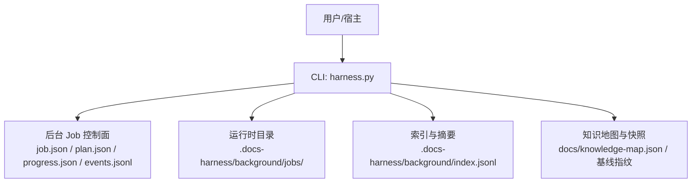
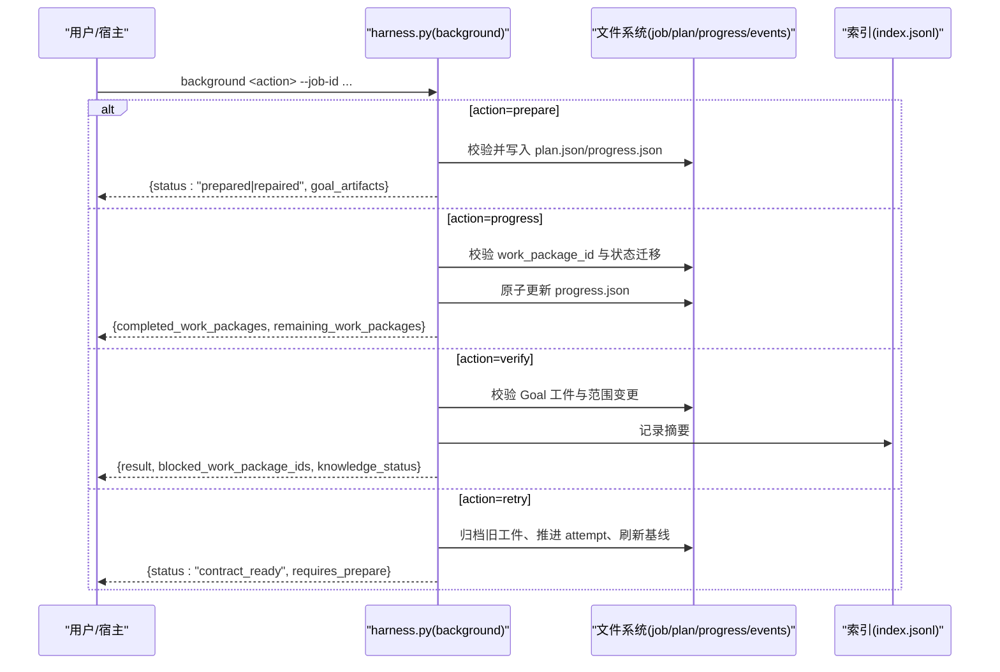
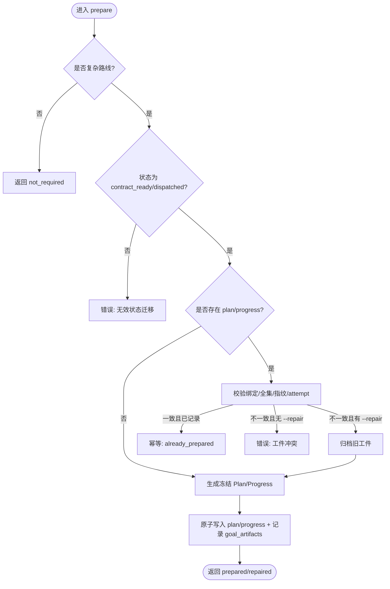
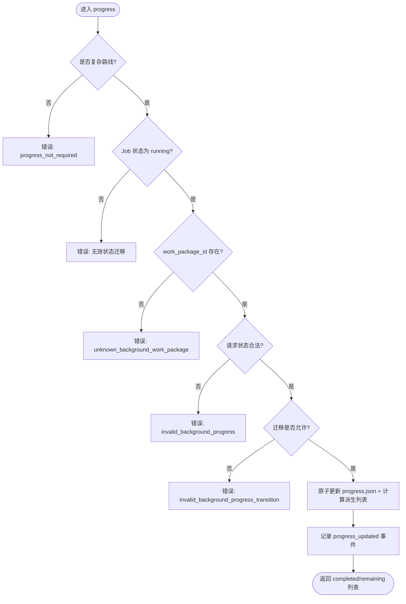
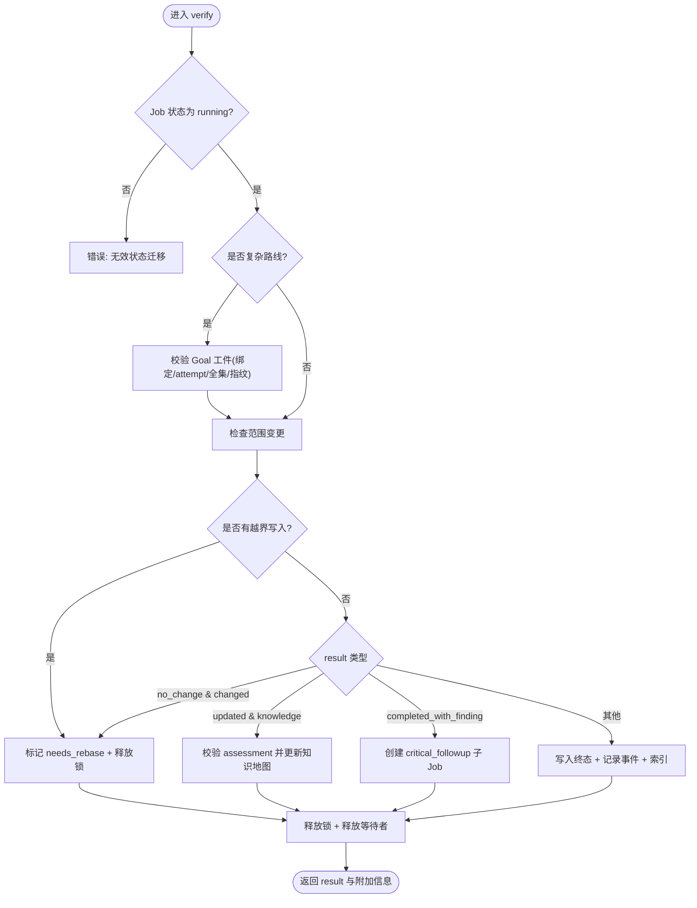
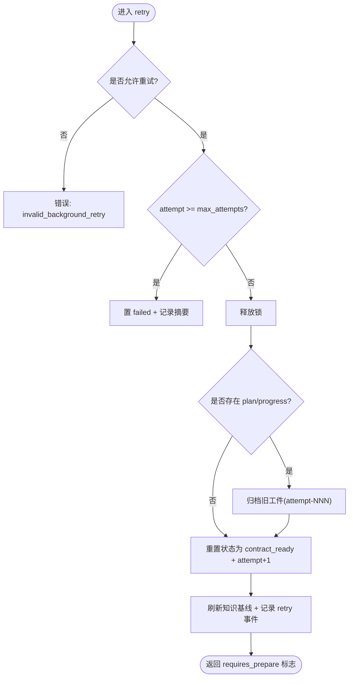
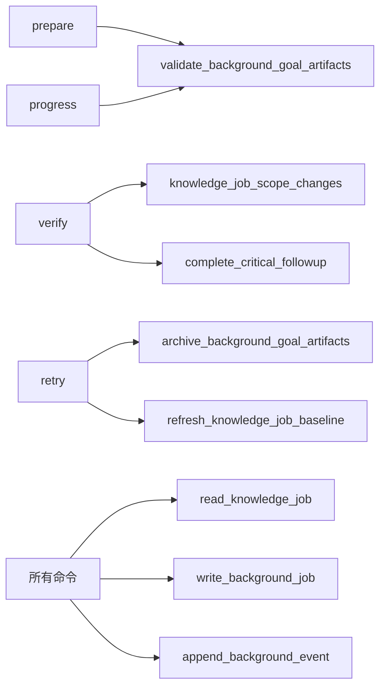

# 生命周期命令

<cite>
**本文引用的文件**   
- [scripts/harness.py](file://scripts/harness.py)
- [tests/test_harness.py](file://tests/test_harness.py)
- [SKILL.md](file://SKILL.md)
- [package.json](file://package.json)
</cite>

## 目录
1. [简介](#简介)
2. [项目结构](#项目结构)
3. [核心组件](#核心组件)
4. [架构总览](#架构总览)
5. [详细组件分析](#详细组件分析)
6. [依赖关系分析](#依赖关系分析)
7. [性能考量](#性能考量)
8. [故障排查指南](#故障排查指南)
9. [结论](#结论)
10. [附录](#附录)

## 简介
本文件面向 Docs Harness 的后台任务生命周期命令，系统性阐述 background prepare、background progress、background verify、background retry 的执行流程与语义。重点覆盖：
- Plan/Progress 工件生成与校验、幂等性保证
- 工作包状态更新、进度报告与问题标记
- 完整性检查、结果验证与终态确认
- 重试机制中的 attempt 推进、工件归档与基线刷新
- 各命令参数说明、使用示例与错误处理策略

## 项目结构
Docs Harness 的核心逻辑集中在单一控制器脚本中，并通过测试套件与技能文档提供契约与使用说明。关键位置：
- 控制器实现：scripts/harness.py
- 测试用例：tests/test_harness.py（包含 background prepare/progress/verify/retry 的典型调用）
- 技能说明：SKILL.md（背景、安装、命令清单与约束）
- 包元数据：package.json（版本与脚本入口）

图表来源
- [scripts/harness.py:7274-7308](file://scripts/harness.py#L7274-L7308)
- [scripts/harness.py:7472-7482](file://scripts/harness.py#L7472-L7482)
- [scripts/harness.py:7635-7668](file://scripts/harness.py#L7635-L7668)
- [scripts/harness.py:7332-7353](file://scripts/harness.py#L7332-L7353)

章节来源
- [scripts/harness.py:7274-7308](file://scripts/harness.py#L7274-L7308)
- [tests/test_harness.py:165-195](file://tests/test_harness.py#L165-L195)
- [SKILL.md:60-90](file://SKILL.md#L60-L90)
- [package.json:1-23](file://package.json#L1-L23)

## 核心组件
- 后台 Job 模型与持久化
  - job.json：Job 合同、状态机、范围、attempt、依赖、目标合同等
  - plan.json/progress.json：复杂路线下的 Plan/Progress 工件（revision 2 强校验）
  - events.jsonl：事件日志（状态转换、进度更新、验收拒绝等）
  - index.jsonl：后台摘要索引（job_id, attempt, status）
- 控制面安全与锁
  - state_lock：进程级状态锁，避免并发冲突
  - assert_background_control_root：禁止符号链接与越权路径
- 工件与基线
  - background_goal_artifact_values：生成冻结的 Plan/Progress
  - validate_background_goal_artifacts：绑定、全集、attempt、指纹一致性校验
  - archive_background_goal_artifacts：attempt 切换时归档旧工件
  - refresh_knowledge_job_baseline：刷新知识基线指纹
- 状态机与路由
  - BACKGROUND_TRANSITIONS：严格的状态迁移表
  - BACKGROUND_COMPLEX_ROUTES：需要 Plan/Progress 的复杂路线
  - host_dispatch_contract：宿主能力探测与命令模板

章节来源
- [scripts/harness.py:7274-7308](file://scripts/harness.py#L7274-L7308)
- [scripts/harness.py:7472-7482](file://scripts/harness.py#L7472-L7482)
- [scripts/harness.py:7485-7551](file://scripts/harness.py#L7485-L7551)
- [scripts/harness.py:8432-8458](file://scripts/harness.py#L8432-L8458)
- [scripts/harness.py:8404-8416](file://scripts/harness.py#L8404-L8416)
- [scripts/harness.py:7580-7616](file://scripts/harness.py#L7580-L7616)

## 架构总览
下图展示 background 子命令在控制器中的统一入口与分发逻辑，以及复杂路线下 prepare/progress/verify/retry 的关键交互。

图表来源
- [scripts/harness.py:8821-8827](file://scripts/harness.py#L8821-L8827)
- [scripts/harness.py:8461-8525](file://scripts/harness.py#L8461-L8525)
- [scripts/harness.py:8528-8586](file://scripts/harness.py#L8528-L8586)
- [scripts/harness.py:9054-9176](file://scripts/harness.py#L9054-L9176)
- [scripts/harness.py:9012-9053](file://scripts/harness.py#L9012-L9053)

## 详细组件分析

### background prepare（准备 Plan/Progress 工件）
- 适用场景
  - 仅对复杂路线（background_goal、background_goal_phased）生效；direct 路线返回 not_required
  - 仅允许 contract_ready 或在途 dispatched 的 Job 执行 prepare
- 执行流程
  - 若已存在 plan.json/progress.json：
    - 校验 revision 2 与绑定（job_id、idempotency_key）、attempt、全集与指纹
    - 若一致且已记录到 job.goal_artifacts：幂等返回 already_prepared
    - 否则需显式 --repair，先归档旧工件再重建
  - 生成冻结的 Plan/Progress（work_packages 不可变），写入后记录 goal_artifacts 与 prepared_at
- 幂等性与一致性
  - 通过 artifact_revision、attempt、plan_fingerprint、progress_fingerprint 四要素锁定
  - 同一 attempt 重复 prepare 不改变工件，直接复用
- 错误处理
  - 非法状态/路线、工件不完整或绑定冲突、未提供 --repair 等情况均失败关闭

图表来源
- [scripts/harness.py:8461-8525](file://scripts/harness.py#L8461-L8525)
- [scripts/harness.py:7485-7551](file://scripts/harness.py#L7485-L7551)
- [scripts/harness.py:8432-8458](file://scripts/harness.py#L8432-L8458)

章节来源
- [scripts/harness.py:8461-8525](file://scripts/harness.py#L8461-L8525)
- [scripts/harness.py:7485-7551](file://scripts/harness.py#L7485-L7551)

### background progress（更新工作包进度）
- 适用场景
  - 仅复杂路线有效；直连路线返回 progress_not_required
  - 仅 running 状态的 Job 可更新进度
- 参数要求
  - --work-package-id：必须存在于冻结方案中
  - --work-package-status：仅允许 in_progress、completed、blocked
  - --reason-code：可选，受控标识符（长度与字符限制）
- 状态迁移规则
  - pending → in_progress/blocked
  - in_progress → completed/blocked
  - completed/blocked 不允许再迁移
- 幂等性
  - 相同状态重复提交返回 idempotent=true
- 副作用
  - 原子更新 progress.json，同步计算 completed/remaining 列表
  - 更新 job.goal_artifacts 的指纹与 attempt，记录 progress_updated 事件

图表来源
- [scripts/harness.py:8528-8586](file://scripts/harness.py#L8528-L8586)

章节来源
- [scripts/harness.py:8528-8586](file://scripts/harness.py#L8528-L8586)

### background verify（验收与终态确认）
- 前置条件
  - 仅 running 状态的 Job 可验收
  - 复杂路线需通过 Goal 工件校验（绑定、attempt、全集、指纹）
- 验收逻辑
  - 校验知识范围变更：超出 allowed_write_scope 则标记 needs_rebase
  - result=no_change 但存在变更：触发 rebase
  - result=updated：
    - 知识类 Job 需提供 --assessment 并校验知识就绪
    - 可能更新 knowledge-map.json 并记录指纹
  - result=completed_with_finding：
    - 必须提供 --assessment 且 critical_finding=true
    - 创建 critical_followup 子 Job，降低交付信心
  - 非知识类 updated/no_change：直接落盘终态
- 终态与索引
  - 写入 completed_at、updated_at，释放锁
  - 记录 verify 事件与后台摘要索引
  - 对于 bootstrap 依赖者，按终态释放等待 Job

图表来源
- [scripts/harness.py:9054-9176](file://scripts/harness.py#L9054-L9176)
- [scripts/harness.py:7332-7353](file://scripts/harness.py#L7332-L7353)
- [scripts/harness.py:8765-8783](file://scripts/harness.py#L8765-L8783)

章节来源
- [scripts/harness.py:9054-9176](file://scripts/harness.py#L9054-L9176)

### background retry（重试机制）
- 适用条件
  - 仅允许 BACKGROUND_RETRYABLE_STATES 或 failed 状态的 Job 重试
  - 治理 Job 有额外限制（需满足特定状态或走修复流程）
- 重试流程
  - 若 attempt >= max_attempts：直接置 failed 并记录摘要
  - 释放锁，归档旧 plan/progress 工件（attempts/attempt-NNN/archive-NNN）
  - 重置状态为 contract_ready，attempt+1，清理临时字段
  - 刷新知识基线，记录 retry 事件（含旧工件指纹）
- 后续动作
  - 复杂路线需要重新 prepare 以重建工件
  - 直连路线可直接继续 dispatch

图表来源
- [scripts/harness.py:9012-9053](file://scripts/harness.py#L9012-L9053)
- [scripts/harness.py:8432-8458](file://scripts/harness.py#L8432-L8458)

章节来源
- [scripts/harness.py:9012-9053](file://scripts/harness.py#L9012-L9053)

### 命令参数与使用示例
- background prepare
  - 必需：--target、--job-id
  - 可选：--repair（修复冲突工件）
  - 示例：python3 scripts/harness.py background prepare --target . --job-id bg-... --json
- background progress
  - 必需：--target、--job-id、--work-package-id、--work-package-status
  - 可选：--reason-code（受控标识符）
  - 示例：python3 scripts/harness.py background progress --target . --job-id bg-... --work-package-id wp-01 --work-package-status in_progress --json
- background verify
  - 必需：--target、--job-id、--result
  - 可选：--assessment（重大发现或知识评估文件）
  - 示例：python3 scripts/harness.py background verify --target . --job-id bg-... --result updated --assessment assessment.json --json
- background retry
  - 必需：--target、--job-id
  - 示例：python3 scripts/harness.py background retry --target . --job-id bg-... --json

章节来源
- [SKILL.md:72-82](file://SKILL.md#L72-L82)
- [tests/test_harness.py:165-195](file://tests/test_harness.py#L165-L195)

## 依赖关系分析
- 内部依赖
  - prepare/progress/verify/retry 均依赖 read_knowledge_job、write_background_job、append_background_event、validate_background_goal_artifacts
  - verify 依赖 scope_covers、knowledge_job_scope_changes、complete_critical_followup
  - retry 依赖 archive_background_goal_artifacts、refresh_knowledge_job_baseline
- 外部依赖
  - Git 工具链（用于快照、引用、LFS/Submodule 检查）
  - JSON/JSONL 读写与原子写入
  - 文件系统锁（state_lock）

图表来源
- [scripts/harness.py:8461-8525](file://scripts/harness.py#L8461-L8525)
- [scripts/harness.py:8528-8586](file://scripts/harness.py#L8528-L8586)
- [scripts/harness.py:9054-9176](file://scripts/harness.py#L9054-L9176)
- [scripts/harness.py:9012-9053](file://scripts/harness.py#L9012-L9053)

章节来源
- [scripts/harness.py:7274-7308](file://scripts/harness.py#L7274-L7308)
- [scripts/harness.py:7485-7551](file://scripts/harness.py#L7485-L7551)
- [scripts/harness.py:7332-7353](file://scripts/harness.py#L7332-L7353)
- [scripts/harness.py:8765-8783](file://scripts/harness.py#L8765-L8783)

## 性能考量
- 原子写入与事件追加采用 fsync，确保崩溃恢复一致性
- 工件指纹计算对大文件采用大小+时间戳哈希，避免全量读取
- 索引与摘要增量写入，避免全量扫描
- 状态锁超时保护（超过 5 分钟视为死锁）

[本节为通用指导，无需具体文件分析]

## 故障排查指南
- 常见错误码与含义
  - missing_file/invalid_json：输入文件缺失或 JSON 无效
  - invalid_task_id/invalid_knowledge_job：ID 格式不符
  - unsafe_target/unsafe_quality_path：路径不安全（根目录、主目录、符号链接）
  - git_preflight_failed/git_remote_unavailable：Git 预检失败或远端不可用
  - invalid_background_job/invalid_background_plan/invalid_background_progress：Job/工件合同无效
  - background_goal_artifacts_tampered：工件指纹漂移或被篡改
  - invalid_background_progress_transition：工作包状态迁移非法
  - invalid_background_retry：当前状态不允许重试
- 定位步骤
  - 查看 events.jsonl 最近事件，确认状态迁移与拒绝原因
  - 检查 plan.json/progress.json 指纹是否与 job.goal_artifacts 一致
  - 核对 allowed_write_scope 与知识基线变化
  - 必要时使用 --repair 修复工件冲突

章节来源
- [scripts/harness.py:395-400](file://scripts/harness.py#L395-L400)
- [scripts/harness.py:7485-7551](file://scripts/harness.py#L7485-L7551)
- [scripts/harness.py:8528-8586](file://scripts/harness.py#L8528-L8586)
- [scripts/harness.py:9012-9053](file://scripts/harness.py#L9012-L9053)

## 结论
Docs Harness 的后台生命周期命令通过严格的工件校验、状态机与原子持久化，确保复杂后台任务的计划、进度与验收过程具备强一致性与可追溯性。prepare 保障 Plan/Progress 冻结与幂等，progress 维护工作包状态迁移与进度可见性，verify 完成范围与结果验收并驱动终态，retry 提供安全的重试与基线刷新。配合事件日志与索引，便于审计与排障。

[本节为总结，无需具体文件分析]

## 附录
- 参考命令清单与约束见 SKILL.md
- 测试用例覆盖典型 prepare/progress/verify/retry 流程，可作为使用示例参考

章节来源
- [SKILL.md:60-90](file://SKILL.md#L60-L90)
- [tests/test_harness.py:165-195](file://tests/test_harness.py#L165-L195)